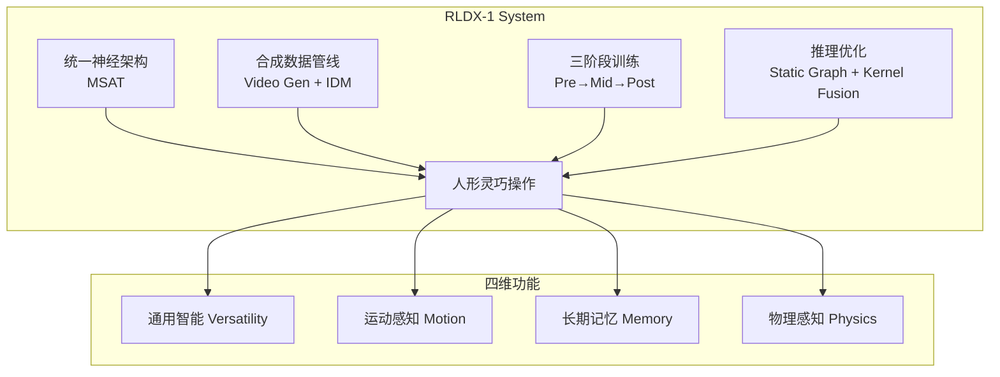
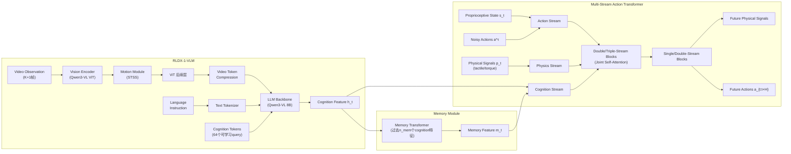
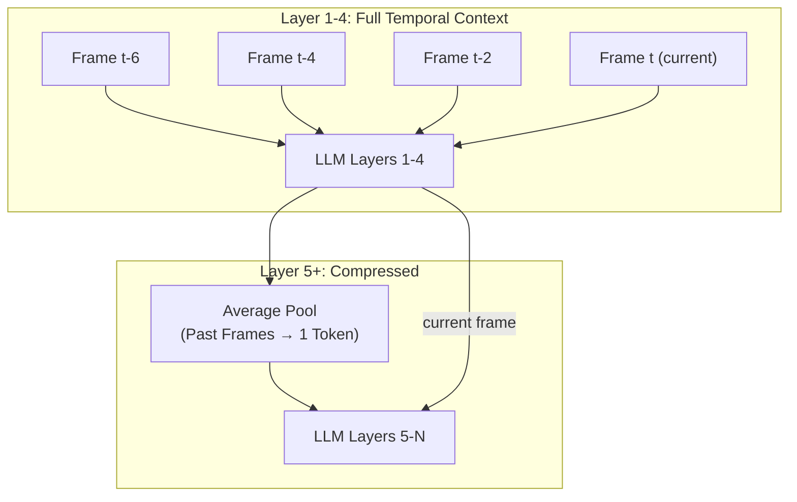
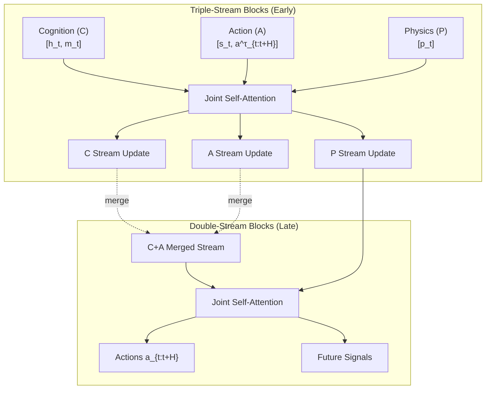
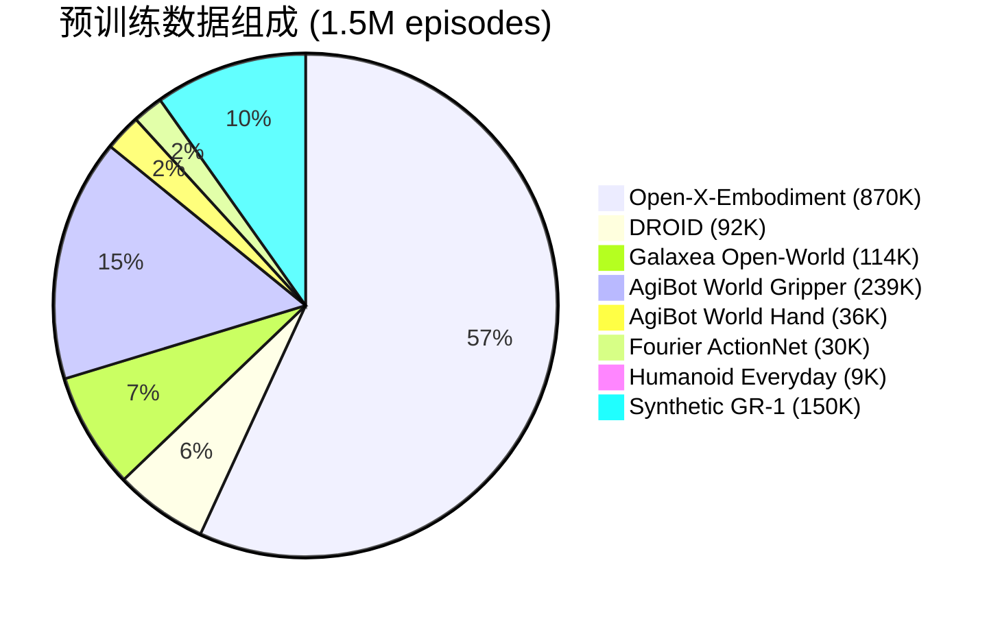
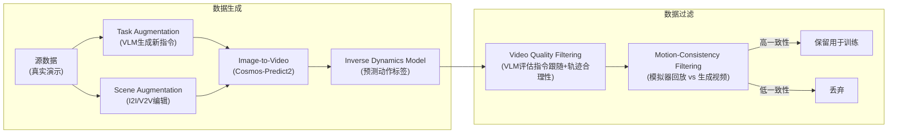
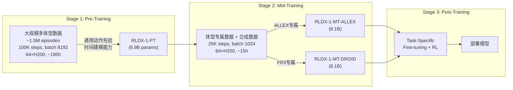
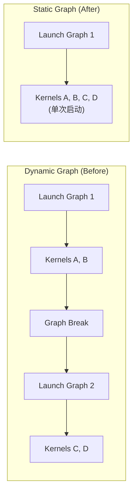

# RLDX-1 深度解析

> **论文**: RLDX-1 Technical Report (arXiv:2605.03269v2, 2026-05-07)
> **机构**: RLWRLD (rlwrld.ai) + KAIST
> **代码**: https://github.com/RLWRLD/RLDX-1
> **模型**: https://huggingface.co/collections/RLWRLD/rldx-1
> **博客**: https://www.rlwrld.ai/en/rldx-1

---

## 1. 核心动机与定位

### 1.1 问题诊断: VLA的功能性缺陷

现有VLA模型(如 $\pi_0$, $\pi_{0.5}$, GR00T N1.x)继承了VLM的"通用智能"(versatile intelligence), 即广泛的场景理解和语言条件泛化能力. 但在复杂的真实世界操作任务中, **仅靠通用性是不够的**, 还需要更广泛的**功能性能力**(functional capabilities):

| 能力缺陷 | 典型失败场景 | 根因 |
|---------|------------|------|
| **运动感知**(Motion Awareness) | 传送带上的移动物体抓取 | 静态视觉观测无法捕获物体轨迹和时间动态 |
| **长期记忆**(Long-term Memory) | Shell Game(杯子猜物)、多步决策 | 基于当前帧的策略无法回溯历史观测 |
| **物理感知**(Physical Sensing) | 插销对齐、鸡蛋精细抓取、倒水称重 | 遮挡或微妙的视觉变化下, 纯视觉不足以判断接触力 |

**RLWRLD 的核心论点**: "Scale cannot recover a modality the model was never given in the first place." -- 扩大模型规模无法弥补模态上的缺失.

### 1.2 RLDX-1的解决框架

RLDX-1 结合四个关键组件来同时解决通用性和功能性:



---

## 2. 模型架构

### 2.1 整体架构

RLDX-1 由两个主要组件构成: **Vision-Language Model (VLM)** 和 **Action Model (MSAT)**.



### 2.2 VLM 组件: RLDX-1-VLM

**骨干选择**: Qwen3-VL 8B, 提供原生分辨率视觉编码, 支持任意宽高比图像, 无需裁剪或padding.

**Robot-Specific VQA微调**: 原始 Qwen3-VL 缺乏具身接地能力. 论文构建了针对机器人场景的VQA数据集, 覆盖三个互补方面:
1. 机器人末端执行器与目标物体之间的**空间关系**
2. 任务完成的**中间子任务**推理
3. 当前帧对应的**低级动作**

微调后在RoboCasa上提升 +3.4pp (57.5% → 60.9%), 注意力可视化显示VLM从分散注意力转变为聚焦于机器人本体和操作目标.

**Cognition Tokens**: 64个可学习的query token, 附加到输入序列末尾. 给定视频观测 $o_{t-K:t}$ 和语言指令 $l_t$:

$$x = [v_t, l_t, q], \quad v_t = E_\theta(o_{t-K:t})$$

VLM 输出中 cognition token 对应的特征保留为 $h_t$, 其余丢弃. 这些token通过注意力机制聚合与下游动作预测最相关的视觉-语言信息. 同时提供 +35% 推理加速 (16.3→22.1 Hz).

**特征提取层**: 使用 VLM 中间层(第18层/共28层)的隐藏状态而非最后一层, 因为更高层过度专注于语言生成, 而中间层在视觉接地和语义抽象之间有更好的平衡.

| 提取层 | RoboCasa成功率 |
|-------|--------------|
| Layer 8 | 51.1% |
| **Layer 18 (选用)** | **60.9%** |
| Layer 28 | 56.3% |

### 2.3 功能模块1: 运动感知 (Motion Module)

#### 视觉编码器层面: STSS

在 Vision Encoder 的第9层(共27层, ~30%深度)插入运动提取模块:

$$\tilde{v}_t^{(i)} = v_t^{(i)} + S_\theta(S_t)$$

其中 $S_t$ 是空间-时间自相似性(Space-Time Self-Similarity, STSS)张量, 通过计算视频特征 $v_t^{(i)}$ 中每个时空特征与其局部邻居之间的相关性得到. STSS编码器 $S_\theta$ 处理该张量生成运动特征, 通过残差连接更新视觉特征.

插入位置选在~30%深度的动机: 物理相关线索在该深度被丰富表示 (Joseph et al., 2026).

#### LLM骨干层面: 时间压缩

多帧观测 $o_{t-K:t}$ (实际使用4帧, 时间偏移 $\{-6, -4, -2, 0\}$) 的处理策略:

1. **前4层**: 按时间顺序输入多帧token, 利用LLM因果结构在当前帧和cognition token中累积时间上下文
2. **第4层后**: 保留当前帧, 将过去帧压缩为单个context token (通过均值池化), 大幅降低计算复杂度



### 2.4 功能模块2: 长期记忆 (Memory Module)

Memory Module 附加在 VLM 之后, 维护一个FIFO队列, 存储过去 $n_{mem} = 3$ 个 cognition feature, 采样间隔为 $H+1$ 步 (即一个action chunk的长度):

- ALLEX: chunk horizon = 40, 记忆窗口覆盖过去 120 步
- FR3: chunk horizon = 16, 记忆窗口覆盖过去 48 步

Memory Module 使用 Transformer blocks 将过去的 cognition features 与当前特征融合, 输出记忆增强的特征 $m_t$.

### 2.5 功能模块3: 物理感知 (Physics Stream)

物理信号(触觉、扭矩)通过 MSAT 中专用的 **Physics (P) Stream** 处理:

- ALLEX: 48-DoF 关节扭矩 (通过电机电流估计)
- FR3: 7维关节扭矩 + AnySkin 15维触觉 (5个传感单元 × 3D力向量)

MSAT 不仅使用物理信号作为输入条件, 还被训练预测 **未来物理信号轨迹** (预测 $L = H+1$ 步), 这鼓励模型学习物理因果关系.

由于物理信号数据远比视觉数据稀缺, 设计了 **graceful degradation**: 物理流在传感器不可用时自动停用, 模型退化为纯视觉策略, 无需重新训练.

### 2.6 Action Model: MSAT (Multi-Stream Action Transformer)

MSAT 是 MM-DiT (Multi-Modal Diffusion Transformer) 向动作建模的扩展, 使用 flow-matching 目标:

**训练目标**: 给定去噪时间步 $\tau \in [0,1]$, 噪声 $\epsilon \sim \mathcal{N}(0, I)$, 构造含噪动作块:

$$a_{t:t+H}^\tau = \tau \cdot a_{t:t+H} + (1-\tau) \cdot \epsilon$$

学习速度场 $u_\theta$, 最小化:

$$\mathcal{L}(\theta; t, \tau, \epsilon) = \|u_\theta(a_{t:t+H}^\tau, \tau, c_t) - (a_{t:t+H} - \epsilon)\|_2^2$$

其中 $c_t = [h_t, m_t, s_t, p_t]$.

**推理**: 通过 Euler 方法在 $T$ 步去噪:

$$a_{t:t+H}^{\tau_{i+1}} = a_{t:t+H}^{\tau_i} + (\tau_{i+1} - \tau_i) \cdot u_\theta(a_{t:t+H}^{\tau_i}, \tau_i, c_t)$$

实际使用 4 步 Euler 去噪.

**MSAT 的多流结构**:



每个流拥有独立的: normalization, QKV投影, 残差更新. 流间通过 joint self-attention 交互 -- query/key/value 在 token 维度拼接后统一计算注意力, 再按流拆回.

**MSAT 的三个关键设计**:

1. **RoPE on Action Stream**: 对A流施加旋转位置编码, 以捕获action chunk内的相对时间结构
2. **In-context timestep injection**: flow-matching 时间步 $\tau$ 编码为正弦嵌入 + MLP, 作为A流的 token 参与注意力(而非 adaLN 特征调制)
3. **RMSNorm + SwiGLU**: 遵循现代 Transformer 实践

**跨体型共享**: MSAT 参数跨体型共享, 仅使用轻量级的 embodiment-specific projection layers 在输入/输出端进行映射.

---

## 3. 训练数据

### 3.1 数据总览



| 数据源 | 体型 | 末端 | 规模 |
|-------|------|------|------|
| Open-X-Embodiment | 单臂 | Gripper | 870K |
| DROID | 单臂 | Gripper | 92K |
| Galaxea Open-World | 双臂 | Gripper | 114K |
| AgiBot World (G) | 人形 | Gripper | 239K |
| AgiBot World (H) | 人形 | 灵巧手 | 36K |
| Fourier ActionNet | 人形 | 灵巧手 | 30K |
| Humanoid Everyday | 人形 | 灵巧手 | 9K |
| Synthetic Data | 人形 | 灵巧手 | 150K |
| **Total** | | | **~1.5M** |

### 3.2 自有真实数据

**ALLEX (48-DoF人形)**:
- 7-DoF双臂 + 15-DoF五指手 × 2
- 2-DoF腰部 + 2-DoF颈部 + 立体第一人称相机
- 关节扭矩通过电机电流估计
- 遥操作: Meta Quest VR(头部+腰部) + Vive Tracker(手腕) + Manus Pro手套(指尖) + 逆运动学

**Franka Research 3**:
- 遵循DROID配置: FR3臂 + Robotiq Gripper + 腕部相机 + 第三人称相机
- 额外: AnySkin触觉传感器 + 关节扭矩测量
- 遥操作: Meta Quest VR

### 3.3 合成数据管线



**Task Augmentation (任务增强)**:
- 分解式指令组合: 将指令分解为 behavior × target object × placement × hand type, 重组为新组合
- 技能原语条件变化: 提取源指令的技能原语(pick, pour, push), 替换目标物体或换用技能集中的其他技能

**Scene Augmentation (场景增强)**:
- Image-level: FLUX.2-dev + Canny edge map, 变换桌面外观、物体外观、光照、背景
- Video-level: Cosmos-Transfer2.5-2B 进行 V2V 迁移, 保持运动动态一致

**Motion-Consistency Filtering (运动一致性过滤)**: 论文的关键创新之一
1. 将 IDM 预测的动作在模拟器中回放, 渲染回放视频
2. 在冻结的 V-JEPA2 视频编码器上训练轻量级 attentive probe (单层 cross-attention + 线性头)
3. probe 预测合成视频与回放视频之间的对齐概率, 超过阈值则保留

合成数据效果: GR-1 Tabletop 上, 仅用真实数据41.0% → 加入100%合成数据50.1% (+9.1pp).

---

## 4. 训练流程

### 4.1 三阶段训练



### 4.2 Pre-Training 细节

- **输入**: 4帧视频观测, 时间偏移 {-6, -4, -2, 0}
- **归一化**: 本体状态和动作归一化到 [-1, 1], 使用每数据集的第1/99百分位数
- **冻结策略**: VLM骨干仅解冻最后4层
- **优化器**: AdamW, lr=1e-4, 常数调度 + 前5%线性预热
- **体型处理**: 每batch随机采样256轨迹, 通过共享的体型无关编解码器路由
- **新体型泛化**: 通过 embodiment-specific projection layers 映射到共享潜在空间, 新体型仅需训练新的投影层

### 4.3 Mid-Training 细节

目标: **体型专门化** + **功能扩展** (添加 motion/memory/physics 模块)

**ALLEX数据组成**: 自有遥操作数据 + 72K 合成数据, 5:5比例采样
**FR3数据组成**: DROID 92K + 自有遥操作数据, 8:2比例采样

**功能扩展的稳定化技巧**:
- 新模态输入独立 dropout = 0.3
- 前2K步 alignment warmup: 冻结所有预训练参数, 仅更新新添加的模态参数
- Physics Stream 参数初始化为近零输出权重

### 4.4 Post-Training: 自适应数据收集 + RL

**自适应数据收集协议 (Adaptive Data Collection)**:

1. **Base数据收集**: 定义遥操作场景, 区分一致性因素(抓取姿势、运动轨迹、执行顺序)和变化因素(物体位姿、初始配置、等待时间)
2. **Refinement数据收集**: 训练→部署→识别失败模式→扩展场景定义→收集针对性演示→迭代

**RL: RECAP + VLM Critic**:

在 RECAP (Amin et al., 2025) 框架上, RLDX-1 引入了**基于文本预测的 VLM Critic**:

- 不引入新的预测头, 而是复用 VLM 原生的文本预测接口进行值估计
- VLM 给定当前观测、任务指令和离散化状态, 自回归预测一个未归一化的整数值(作为文本)
- 直接利用 VLM 内部知识, 从有限数据实现可靠值估计
- Critic backbone: gemma3-4b-it, LoRA rank=128

```
Algorithm: RECAP Post-Training
1. 在演示数据 D_l 上训练 Critic V
2. 用 V 标注优势值 A ← V(D_l)
3. 用带优势标签的数据训练策略 π
4. for i = 1 to N:
     D_l ← D_l ∪ π.rollout()     // 收集新轨迹
     D_succ ← 筛选成功轨迹
     在 D_succ 上精调 V
     重新标注 A ← V(D_l)
     在 D_l + A 上精调 π
```

**RL效果 (Light Bulb Twisting任务)**:

| 阶段 | 帧数 (mean±std) | 尝试次数 |
|------|----------------|---------|
| Teleop (人类) | - | 约5次 |
| BC (模仿学习) | 1056 ± 326 | 12.7 ± 3.0 |
| RECAP₁ | - | ~8.5 |
| RECAP₂ | - | ~5 |
| RECAP₃ | 353 ± 22 | **4.1 ± 0.3** |

RECAP₃ 相比 BC 实现了约3×的速度和尝试次数改善, 甚至超越人类遥操作基线.

---

## 5. 推理优化

目标: 降低每步推理延迟, 在动态环境中减少观测-执行不匹配.

### 5.1 Graph Capture 优化

**问题**: PyTorch eager逐个启动算子, Torch Compile仅能部分捕获为CUDA Graph子图(因RoPE和attention mask构造依赖运行时配置), 导致图碎片化.

**Static Graph Conversion**: 将配置依赖的计算(RoPE、attention mask)预先计算并在执行期间复用, 使前向传播不再分裂为多子图, 可被捕获为单个 CUDA Graph.



### 5.2 Kernel 优化

RLDX-1 的每次推理是 short-prefill 工作负载(非自回归生成), 序列长度相对较短. 计算密集型 matmul 与访存密集型算子(RMSNorm, RoPE, 残差更新)交替出现.

**算子融合策略**: 手动设计融合核, 将中间张量保持在芯片上:

| 融合核 | 原始操作 | 融合操作 |
|-------|---------|---------|
| fused_llm_attention | RMSNorm(q) → RoPE → RMSNorm(k) → RoPE → Attn | 单核完成 |
| fused_add2_rmsnorm | $h_{res} = h_{out} + h_{in}$ → RMSNorm | 单核完成 |
| fused_add3_rmsnorm | $h_{res} = h_{out} + h_{in} + h_{ds}$ → RMSNorm | 单核完成 |
| grouped_swiglu | SwiGLU(z₁), SwiGLU(z₂) | 合并为一次调用 |

### 5.3 延迟分析

| 推理栈 | 无物理+记忆 | 全模态 | 加速比 |
|-------|-----------|-------|-------|
| PyTorch Eager | 67.0 ms | 71.2 ms | 1.00× |
| CUDA Graph + Torch.Compile | 56.9 ms | 59.6 ms | 1.19× |
| + Static Graph | 46.2 ms | 48.9 ms | 1.46× |
| **+ Kernel Optimization** | **41.6 ms** | **43.7 ms** | **1.63×** |

在 RTX 5090 上实现 >22 Hz 实时推理.

---

## 6. 实验结果

### 6.1 仿真基准

| 基准 | RLDX-1 | $\pi_{0.5}$ | GR00T N1.6 | GR00T N1.5 | $\pi_0$ | $\pi_0$-FAST |
|------|--------|------------|-----------|-----------|--------|------------|
| **LIBERO Avg** | **97.8** | 96.9 | 96.7 | 86.5 | 94.1 | 85.5 |
| **LIBERO-Plus** | **86.7** | 86.5 | 72.6 | 66.3 | 54.6 | 64.2 |
| **SIMPLER Google-VM** | **81.5** | 72.7 | 76.1 | 52.4 | 58.8 | 61.9 |
| **SIMPLER Google-VA** | **77.4** | 68.4 | 57.1 | 43.7 | 54.8 | 59.0 |
| **SIMPLER WidowX** | **71.9** | 46.9 | 57.1 | 62.0 | 27.1 | 48.3 |
| **RoboCasa Kitchen** | **70.6** | 62.1 | 66.2 | 65.7 | 62.5 | 63.6 |
| **GR-1 Tabletop** | **58.7** | 15.4 | 47.6 | 48.0 | 13.6 | - |
| **RoboCasa365 Avg** | **32.1** | 16.9 | 26.9 | 20.0 | 14.8 | 21.7 |

**关键发现**:
- 所有基准 SOTA, 且差距随任务难度增加而加大
- GR00T N1.6 在鲁棒性基准(LIBERO-Plus, Google-VA)上显著退化, RLDX-1则保持一致
- GR00T N1.6 预训练使用了 RoboCasa 仿真数据, RLDX-1 未使用任何仿真数据

### 6.2 真实世界: OpenArm 人形 (通用智能评估)

28-DoF 上半身人形 + Inspire RH56F1 6-DoF手, 348个演示训练.

| 任务 | $\pi_{0.5}$ | GR00T N1.6 | **RLDX-1** |
|------|-----------|-----------|-----------|
| Basic PnP | 41.7 | 37.5 | **50.0** |
| Directional PnP (Shelf) | 54.2 | 47.9 | **68.8** |
| Directional PnP (Dish Rack) | 58.3 | 50.0 | **70.8** |
| Unseen Object | 37.5 | 45.8 | **54.2** |
| Unseen Task | 45.8 | 50.0 | **54.2** |
| Object Grounding | 83.3 | 33.3 | **87.5** |

**失败模式分析**:
- $\pi_{0.5}$: 在 unseen 设置中严重退化 (VLM backbone弱 + full VLM fine-tuning导致过拟合)
- GR00T N1.6: 能识别物体类别但无法进行实例级接地 (Object Grounding仅33.3%, 等于随机)
- RLDX-1: 避免了两种失败模式, 跨所有设置一致提升

### 6.3 真实世界: ALLEX 人形 (功能能力评估)

48-DoF 人形, 评估运动感知 / 长期记忆 / 物理感知:

| 任务 | 评估能力 | $\pi_{0.5}$ | GR00T N1.6 | **RLDX-1** |
|------|---------|-----------|-----------|-----------|
| Conveyor PnP | 运动感知 | 29.2 | 50.0 | **87.5** |
| Object-in-Box Selection | 长期记忆 | 33.3 | 29.2 | **91.7** |
| Card Slide-and-Pick | 物理感知 | 55.3 | 62.3 | **97.2** |
| Pot-to-Cup Pouring | 物理感知 | 38.5 | 37.5 | **70.8** |
| **Average** | | 39.1 | 44.8 | **86.8** |

RLDX-1 平均成功率 86.8%, 而 $\pi_{0.5}$ 和 GR00T N1.6 约 40%.

**逐任务分析**:

- **Conveyor PnP**: 基线在不同传送带速度下崩溃为固定速度动作. GR00T N1.6 只在低速成功, $\pi_{0.5}$ 只在快速成功. RLDX-1 在已见速度100%、未见速度75%成功, 自适应切换动作节奏.
- **Object-in-Box Selection**: GR00T N1.6 随机选择(29.2%), $\pi_{0.5}$ 重复选同一个盒子(33.3%). RLDX-1 91.7%正确选择目标盒子.
- **Card Slide-and-Pick**: 基线表现出多种失败模式(滑动不准、无法抓取薄卡、交接时掉落). RLDX-1 近乎完美(97.2), 证明扭矩反馈对接触密集精细操作的价值.
- **Pot-to-Cup Pouring**: 基线无法完成完整任务 -- 即使倒入成功, 也因缺乏杯子重量感知而卡在倒水姿态. RLDX-1 通过关节扭矩估计杯子重量.

### 6.4 真实世界: Franka Research 3 (功能能力评估)

7-DoF 单臂 + AnySkin 触觉:

| 任务 | 评估能力 | $\pi_{0.5}$ | GR00T N1.6 | **RLDX-1** |
|------|---------|-----------|-----------|-----------|
| Spin Tracking | 运动感知 | 32.3 | 26.0 | **97.9** |
| Pong Game | 运动感知 | 37.0 | 42.6 | **81.5** |
| Cup Swapping | 长期记忆 | 25.0 | 12.5 | **45.8** |
| Shell Game | 长期记忆 | 45.8 | 54.2 | **91.7** |
| Plug Insertion | 物理感知 | 20.8 | 16.7 | **33.3** |
| Egg PnP | 物理感知 | 45.8 | 37.5 | **61.1** |
| **Average** | | 34.4 | 31.6 | **68.5** |

### 6.5 消融与分析

**合成数据规模效应** (GR-1 Tabletop):

| 真实数据 | 合成数据比例 | 成功率 |
|---------|-----------|-------|
| ✓ | 0% | 41.0% |
| ✓ | 25% | 45.6% |
| ✓ | 50% | 46.6% |
| ✓ | 100% | **50.1%** |

合成数据一致带来增益, 有效扩展了操作场景覆盖.

**PEFT分析** (RoboCasa Kitchen):

| Backbone | Action Model | 成功率 | 训练参数 | VRAM (batch 1) |
|----------|-------------|-------|---------|---------------|
| Full FT | Full FT | 62.7% | 2,376M | 56.8 GiB |
| Full FT | LoRA r=64 | 62.7% | 1,151M | 37.2 GiB |
| LoRA r=64 | LoRA r=64 | 55.3% | 398M | **23.7 GiB** |
| Frozen | LoRA r=64 | 36.4% | 378M | 23.3 GiB |

LoRA r=64 对 Backbone+Action 仅用 5.72% 参数, 恢复88%性能, **单GPU消费级硬件可实现微调** (24 GiB 以内).

**Test-time Sampling (Best-of-N)**:
- 对未充分收敛策略(RECAP₁)有效: 尝试次数从 8.5 降到 4.9
- 对已收敛策略(RECAP₂, RECAP₃)反而有害: 引入随机性偏离最优
- 结论: BoN 是**探索机制**, 与RL训练互补而非替代

---

## 7. 模型规格汇总

| 属性 | 规格 |
|------|------|
| VLM Backbone | Qwen3-VL 8B |
| Action Model | Flow-matching DiT (MSAT) |
| 预训练参数量 | 6.9B |
| 中训练参数量 | 8.1B (添加 motion/memory/physics) |
| Cognition Tokens | 64 |
| 视频帧数 | 4 (偏移 {-6,-4,-2,0}) |
| Action Chunk Horizon | 40 (ALLEX) / 16 (FR3) |
| 去噪步数 | 4 (Euler) |
| 预训练数据 | ~1.5M episodes |
| 预训练 | 100K steps, batch 8192, 64×H200, ~195h |
| 中训练 | 25K steps, batch 1024, 64×H200, ~15h |
| 推理延迟 | 43.7 ms (RTX 5090, 全模态, >22Hz) |
| 支持体型 | 单臂/双臂/人形 (28-48 DoF) |
| 开源协议 | 代码 Apache 2.0, 模型权重 RLWRLD License v1.0 (非商业) |

---

## 8. 与 Dexbotic 生态的关系

RLDX-1 的多项设计与 Dexbotic 框架有交叉和可借鉴之处:

| RLDX-1 组件 | Dexbotic 对应 | 可借鉴点 |
|------------|-------------|---------|
| Qwen3-VL backbone | `DexboticVLMModel` + `build_vision_tower()` | RLDX-1 的 robot-specific VQA 微调策略 |
| MSAT (flow-matching DiT) | Action heads (diffusion/flow-matching) | 多流注意力架构, 物理信号流设计 |
| Cognition Tokens | VLM hidden states extraction | 固定长度query token比直接用hidden states更高效 |
| Memory Module | (暂无) | FIFO cognition cache + Transformer fusion |
| Motion Module (STSS) | (暂无) | 视觉编码器中层插入时空自相似性 |
| 三阶段训练 | `BaseExp` orchestration | Pre→Mid→Post 的渐进专门化范式 |
| Synthetic Data Pipeline | (暂无) | Video Gen + IDM + Motion-Consistency Filtering |
| RECAP RL | (暂无) | VLM-based critic + advantage-conditioned supervision |

---

## 9. 关键贡献与创新点总结

1. **Multi-Stream Action Transformer (MSAT)**: 将 MM-DiT 扩展到动作建模, 通过专用流 + 联合注意力统一处理异构模态, 是架构层面的核心创新
2. **Motion-Consistency Filtering**: 用模拟器回放 + V-JEPA2 probe 验证合成数据的动作标签一致性, 显著提升合成数据质量
3. **Text Prediction VLM Critic**: 复用VLM文本预测接口做值估计, 避免新增预测头, 从有限数据实现可靠RL
4. **Static Graph + Kernel Fusion推理**: 消除图碎片化和HBM往返, 实现 >22Hz 实时推理
5. **功能性能力的统一**: 首次在单一VLA模型中同时实现运动感知、长期记忆、物理感知, 并证明这些能力对真实世界任务的关键作用

---

## 10. 局限性与未来方向

1. **每任务数据需求差异大**: 部分任务仍需大量post-training数据
2. **记忆仅覆盖中短时间窗口**: 48-120步的记忆窗口, 小时级交互仍是开放问题
3. **零样本泛化**: 作为预训练策略的零样本泛化能力仍有限
4. **视频/世界模型**: 扩展到长 horizon 规划和动作条件想象是未来方向
5. **计算成本**: 预训练需64×H200约195小时, 门槛较高

# 相关知识

## `IDM`是什么?

IDM (Inverse Dynamics Model) 是合成数据管线中用于从视频反推动作标签的模型 — 给定当前帧和未来帧，预测两帧之间机器人应执行的动作序列。

核心问题：视频生成模型能合成视觉逼真的机器人操作视频，但这些视频没有动作标注，无法直接用于策略训练。IDM 填补这个空缺。

RLDX-1 中的 IDM 规格：
+ 架构：0.1B Diffusion Transformer + SigLIP-2 视觉编码器
+ 训练目标：flow-matching，给定一对输入帧，去噪预测中间动作序列
+ GR-1 版：使用公开预训练 checkpoint（seonghyeonye/IDM_gr1）
+ ALLEX 版：在自有遥操作数据上从头训练，action horizon $H+1=20$，batch 256，60K steps


在合成数据管线中的位置：
```
源视频 → Scene/Task Augmentation → Video Gen (Cosmos-Predict2)
                                        ↓
                                   生成视频 (无动作标签)
                                        ↓
                                   IDM 预测动作序列 a_{t:t+H}
                                        ↓
                               Motion-Consistency Filtering
                               (模拟器回放IDM动作 vs 生成视频对比)
                                        ↓
                                   训练数据 (视频+动作)
```
但 IDM 预测的动作不一定准确，所以论文后面接了 Motion-Consistency Filtering：将 IDM 预测的动作在模拟器中回放，对比回放视频与合成视频的运动一致性，过滤掉不一致的样本。这是整个合成数据管线质量保证的关键环节。