# RLDX-1 深度解析

> **论文**: RLDX-1 Technical Report (arXiv:2605.03269v2, 2026-05-07)
> **机构**: RLWRLD (rlwrld.ai) + KAIST
> **代码**: https://github.com/RLWRLD/RLDX-1
> **模型**: https://huggingface.co/collections/RLWRLD/rldx-1
> **博客**: https://www.rlwrld.ai/en/rldx-1

---

## 1. 核心动机与定位

### 1.1 问题诊断: VLA的功能性缺陷

现有VLA模型(如 $\pi_0$, $\pi_{0.5}$, GR00T N1.x)继承了VLM的"通用智能"(versatile intelligence), 即广泛的场景理解和语言条件泛化能力. 但在复杂的真实世界操作任务中, **仅靠通用性是不够的**, 还需要更广泛的**功能性能力**(functional capabilities):

| 能力缺陷 | 典型失败场景 | 根因 |
|---------|------------|------|
| **运动感知**(Motion Awareness) | 传送带上的移动物体抓取 | 静态视觉观测无法捕获物体轨迹和时间动态 |
| **长期记忆**(Long-term Memory) | Shell Game(杯子猜物)、多步决策 | 基于当前帧的策略无法回溯历史观测 |
| **物理感知**(Physical Sensing) | 插销对齐、鸡蛋精细抓取、倒水称重 | 遮挡或微妙的视觉变化下, 纯视觉不足以判断接触力 |

**RLWRLD 的核心论点**: "Scale cannot recover a modality the model was never given in the first place." -- 扩大模型规模无法弥补模态上的缺失.

### 1.2 RLDX-1的解决框架

RLDX-1 结合四个关键组件来同时解决通用性和功能性:

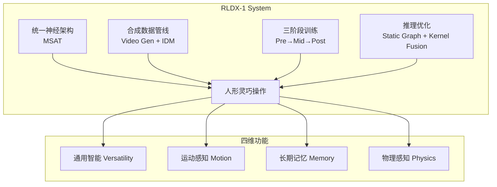
```mermaid
graph TB
    subgraph "RLDX-1 System"
        A["统一神经架构<br/>MSAT"] --> E["人形灵巧操作"]
        B["合成数据管线<br/>Video Gen + IDM"] --> E
        C["三阶段训练<br/>Pre→Mid→Post"] --> E
        D["推理优化<br/>Static Graph + Kernel Fusion"] --> E
    end

    subgraph "四维功能"
        E --> F1["通用智能 Versatility"]
        E --> F2["运动感知 Motion"]
        E --> F3["长期记忆 Memory"]
        E --> F4["物理感知 Physics"]
    end
```

---

## 2. 模型架构

### 2.1 整体架构

RLDX-1 由两个主要组件构成: **Vision-Language Model (VLM)** 和 **Action Model (MSAT)**.

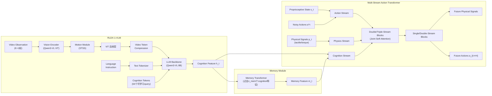
```mermaid
graph LR
    subgraph "RLDX-1-VLM"
        V["Video Observation<br/>(K+1帧)"] --> VE["Vision Encoder<br/>(Qwen3-VL ViT)"]
        VE --> MM["Motion Module<br/>(STSS)"]
        MM --> VE2["ViT 后续层"]
        VE2 --> VTC["Video Token<br/>Compression"]
        L["Language<br/>Instruction"] --> TT["Text Tokenizer"]
        TT --> LLM["LLM Backbone<br/>(Qwen3-VL 8B)"]
        VTC --> LLM
        CQ["Cognition Tokens<br/>(64个可学习query)"] --> LLM
        LLM --> CF["Cognition Feature h_t"]
    end

    subgraph "Memory Module"
        CF --> MEM["Memory Transformer<br/>(过去n_mem个cognition特征)"]
        MEM --> MF["Memory Feature m_t"]
    end

    subgraph "Multi-Stream Action Transformer"
        CF --> CS["Cognition Stream"]
        MF --> CS
        S["Proprioceptive State s_t"] --> AS["Action Stream"]
        NA["Noisy Actions a^τ"] --> AS
        P["Physical Signals p_t<br/>(tactile/torque)"] --> PS["Physics Stream"]

        CS --> DSB["Double/Triple-Stream Blocks<br/>(Joint Self-Attention)"]
        AS --> DSB
        PS --> DSB
        DSB --> SSB["Single/Double-Stream Blocks"]
        SSB --> ACT["Future Actions a_{t:t+H}"]
        SSB --> FSG["Future Physical Signals"]
    end
```

### 2.2 VLM 组件: RLDX-1-VLM

**骨干选择**: Qwen3-VL 8B, 提供原生分辨率视觉编码, 支持任意宽高比图像, 无需裁剪或padding.

**Robot-Specific VQA微调**: 原始 Qwen3-VL 缺乏具身接地能力. 论文构建了针对机器人场景的VQA数据集, 覆盖三个互补方面:
1. 机器人末端执行器与目标物体之间的**空间关系**
2. 任务完成的**中间子任务**推理
3. 当前帧对应的**低级动作**

微调后在RoboCasa上提升 +3.4pp (57.5% → 60.9%), 注意力可视化显示VLM从分散注意力转变为聚焦于机器人本体和操作目标.

**Cognition Tokens**: 64个可学习的query token, 附加到输入序列末尾. 给定视频观测 $o_{t-K:t}$ 和语言指令 $l_t$:

$$x = [v_t, l_t, q], \quad v_t = E_\theta(o_{t-K:t})$$

VLM 输出中 cognition token 对应的特征保留为 $h_t$, 其余丢弃. 这些token通过注意力机制聚合与下游动作预测最相关的视觉-语言信息. 同时提供 +35% 推理加速 (16.3→22.1 Hz).

**特征提取层**: 使用 VLM 中间层(第18层/共28层)的隐藏状态而非最后一层, 因为更高层过度专注于语言生成, 而中间层在视觉接地和语义抽象之间有更好的平衡.

| 提取层 | RoboCasa成功率 |
|-------|--------------|
| Layer 8 | 51.1% |
| **Layer 18 (选用)** | **60.9%** |
| Layer 28 | 56.3% |

### 2.3 功能模块1: 运动感知 (Motion Module)

#### 视觉编码器层面: STSS

在 Vision Encoder 的第9层(共27层, ~30%深度)插入运动提取模块:

$$\tilde{v}_t^{(i)} = v_t^{(i)} + S_\theta(S_t)$$

其中 $S_t$ 是空间-时间自相似性(Space-Time Self-Similarity, STSS)张量, 通过计算视频特征 $v_t^{(i)}$ 中每个时空特征与其局部邻居之间的相关性得到. STSS编码器 $S_\theta$ 处理该张量生成运动特征, 通过残差连接更新视觉特征.

插入位置选在~30%深度的动机: 物理相关线索在该深度被丰富表示 (Joseph et al., 2026).

#### LLM骨干层面: 时间压缩

多帧观测 $o_{t-K:t}$ (实际使用4帧, 时间偏移 $\{-6, -4, -2, 0\}$) 的处理策略:

1. **前4层**: 按时间顺序输入多帧token, 利用LLM因果结构在当前帧和cognition token中累积时间上下文
2. **第4层后**: 保留当前帧, 将过去帧压缩为单个context token (通过均值池化), 大幅降低计算复杂度

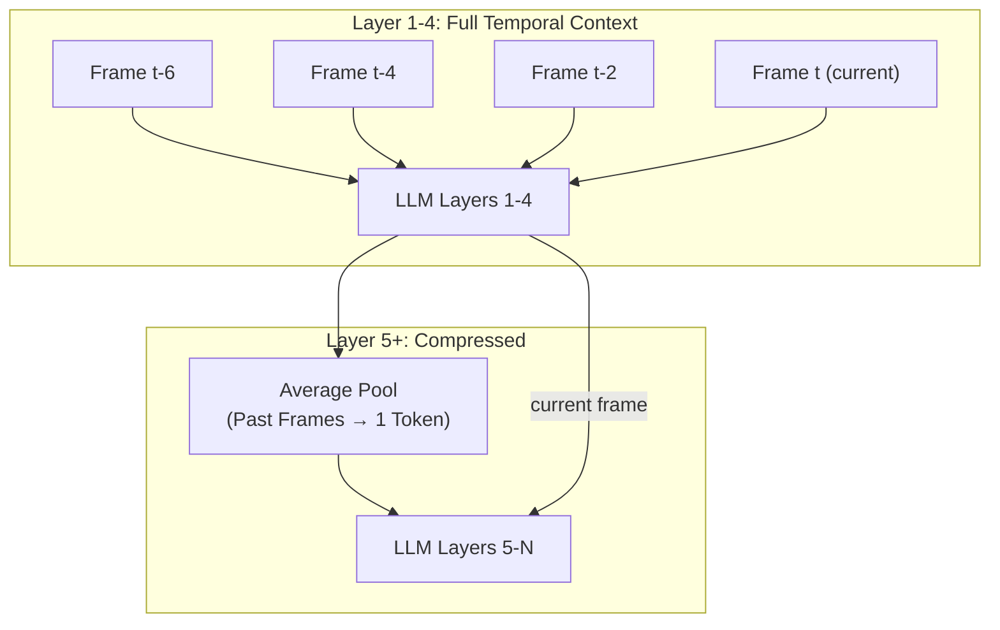
```mermaid
graph TB
    subgraph "Layer 1-4: Full Temporal Context"
        F1["Frame t-6"] --> L14["LLM Layers 1-4"]
        F2["Frame t-4"] --> L14
        F3["Frame t-2"] --> L14
        F4["Frame t (current)"] --> L14
    end

    subgraph "Layer 5+: Compressed"
        L14 --> AVG["Average Pool<br/>(Past Frames → 1 Token)"]
        AVG --> L5N["LLM Layers 5-N"]
        L14 -->|"current frame"| L5N
    end
```

### 2.4 功能模块2: 长期记忆 (Memory Module)

Memory Module 附加在 VLM 之后, 维护一个FIFO队列, 存储过去 $n_{mem} = 3$ 个 cognition feature, 采样间隔为 $H+1$ 步 (即一个action chunk的长度):

- ALLEX: chunk horizon = 40, 记忆窗口覆盖过去 120 步
- FR3: chunk horizon = 16, 记忆窗口覆盖过去 48 步

Memory Module 使用 Transformer blocks 将过去的 cognition features 与当前特征融合, 输出记忆增强的特征 $m_t$.

### 2.5 功能模块3: 物理感知 (Physics Stream)

物理信号(触觉、扭矩)通过 MSAT 中专用的 **Physics (P) Stream** 处理:

- ALLEX: 48-DoF 关节扭矩 (通过电机电流估计)
- FR3: 7维关节扭矩 + AnySkin 15维触觉 (5个传感单元 × 3D力向量)

MSAT 不仅使用物理信号作为输入条件, 还被训练预测 **未来物理信号轨迹** (预测 $L = H+1$ 步), 这鼓励模型学习物理因果关系.

由于物理信号数据远比视觉数据稀缺, 设计了 **graceful degradation**: 物理流在传感器不可用时自动停用, 模型退化为纯视觉策略, 无需重新训练.

### 2.6 Action Model: MSAT (Multi-Stream Action Transformer)

MSAT 是 MM-DiT (Multi-Modal Diffusion Transformer) 向动作建模的扩展, 使用 flow-matching 目标:

**训练目标**: 给定去噪时间步 $\tau \in [0,1]$, 噪声 $\epsilon \sim \mathcal{N}(0, I)$, 构造含噪动作块:

$$a_{t:t+H}^\tau = \tau \cdot a_{t:t+H} + (1-\tau) \cdot \epsilon$$

学习速度场 $u_\theta$, 最小化:

$$\mathcal{L}(\theta; t, \tau, \epsilon) = \|u_\theta(a_{t:t+H}^\tau, \tau, c_t) - (a_{t:t+H} - \epsilon)\|_2^2$$

其中 $c_t = [h_t, m_t, s_t, p_t]$.

**推理**: 通过 Euler 方法在 $T$ 步去噪:

$$a_{t:t+H}^{\tau_{i+1}} = a_{t:t+H}^{\tau_i} + (\tau_{i+1} - \tau_i) \cdot u_\theta(a_{t:t+H}^{\tau_i}, \tau_i, c_t)$$

实际使用 4 步 Euler 去噪.

**MSAT 的多流结构**:

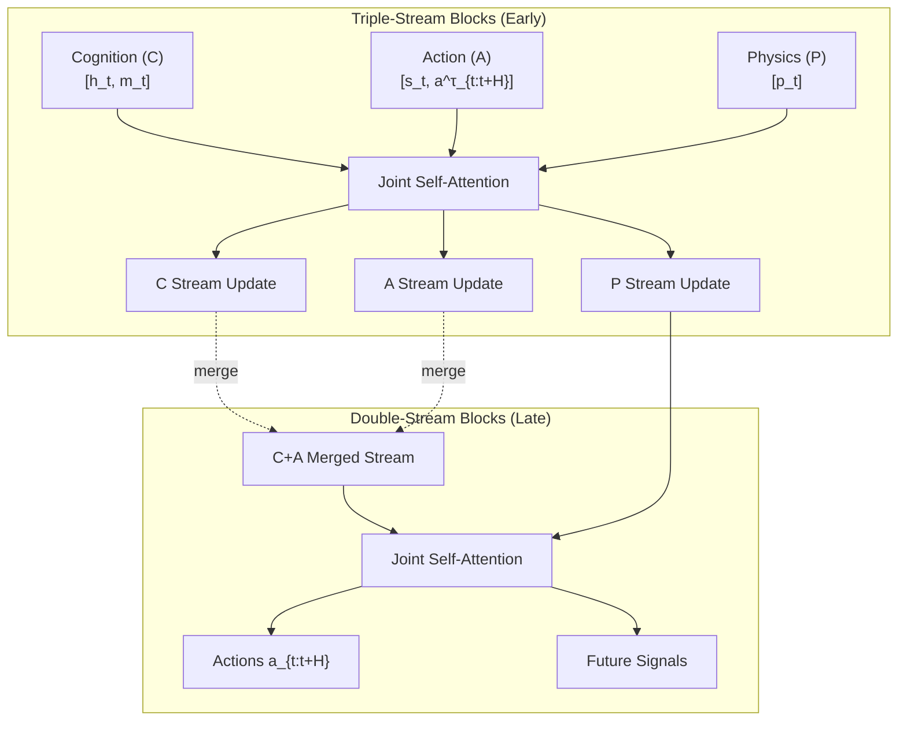
```mermaid
graph TB
    subgraph "Triple-Stream Blocks (Early)"
        CS["Cognition (C)<br/>[h_t, m_t]"] --> JSA1["Joint Self-Attention"]
        AS["Action (A)<br/>[s_t, a^τ_{t:t+H}]"] --> JSA1
        PS["Physics (P)<br/>[p_t]"] --> JSA1
        JSA1 --> CS2["C Stream Update"]
        JSA1 --> AS2["A Stream Update"]
        JSA1 --> PS2["P Stream Update"]
    end

    subgraph "Double-Stream Blocks (Late)"
        CS2 -.->|merge| CA["C+A Merged Stream"]
        AS2 -.->|merge| CA
        CA --> JSA2["Joint Self-Attention"]
        PS2 --> JSA2
        JSA2 --> OUT_A["Actions a_{t:t+H}"]
        JSA2 --> OUT_P["Future Signals"]
    end
```

每个流拥有独立的: normalization, QKV投影, 残差更新. 流间通过 joint self-attention 交互 -- query/key/value 在 token 维度拼接后统一计算注意力, 再按流拆回.

**MSAT 的三个关键设计**:

1. **RoPE on Action Stream**: 对A流施加旋转位置编码, 以捕获action chunk内的相对时间结构
2. **In-context timestep injection**: flow-matching 时间步 $\tau$ 编码为正弦嵌入 + MLP, 作为A流的 token 参与注意力(而非 adaLN 特征调制)
3. **RMSNorm + SwiGLU**: 遵循现代 Transformer 实践

**跨体型共享**: MSAT 参数跨体型共享, 仅使用轻量级的 embodiment-specific projection layers 在输入/输出端进行映射.

---

## 3. 训练数据

### 3.1 数据总览

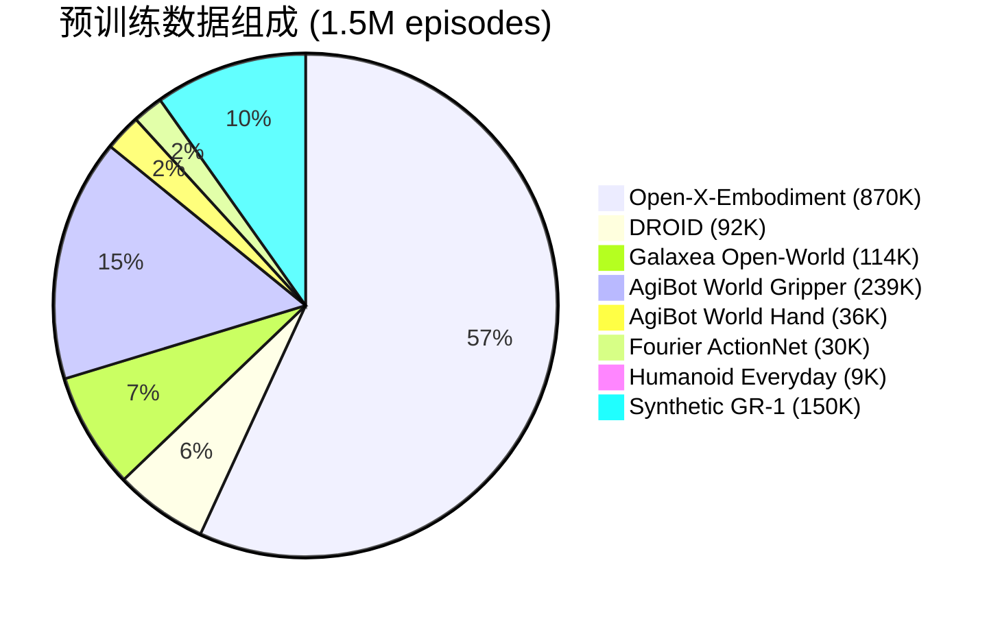
```mermaid
pie title 预训练数据组成 (1.5M episodes)
    "Open-X-Embodiment (870K)" : 58
    "DROID (92K)" : 6.1
    "Galaxea Open-World (114K)" : 7.6
    "AgiBot World Gripper (239K)" : 15.9
    "AgiBot World Hand (36K)" : 2.4
    "Fourier ActionNet (30K)" : 2.0
    "Humanoid Everyday (9K)" : 0.6
    "Synthetic GR-1 (150K)" : 10
```

| 数据源 | 体型 | 末端 | 规模 |
|-------|------|------|------|
| Open-X-Embodiment | 单臂 | Gripper | 870K |
| DROID | 单臂 | Gripper | 92K |
| Galaxea Open-World | 双臂 | Gripper | 114K |
| AgiBot World (G) | 人形 | Gripper | 239K |
| AgiBot World (H) | 人形 | 灵巧手 | 36K |
| Fourier ActionNet | 人形 | 灵巧手 | 30K |
| Humanoid Everyday | 人形 | 灵巧手 | 9K |
| Synthetic Data | 人形 | 灵巧手 | 150K |
| **Total** | | | **~1.5M** |

### 3.2 自有真实数据

**ALLEX (48-DoF人形)**:
- 7-DoF双臂 + 15-DoF五指手 × 2
- 2-DoF腰部 + 2-DoF颈部 + 立体第一人称相机
- 关节扭矩通过电机电流估计
- 遥操作: Meta Quest VR(头部+腰部) + Vive Tracker(手腕) + Manus Pro手套(指尖) + 逆运动学

**Franka Research 3**:
- 遵循DROID配置: FR3臂 + Robotiq Gripper + 腕部相机 + 第三人称相机
- 额外: AnySkin触觉传感器 + 关节扭矩测量
- 遥操作: Meta Quest VR

### 3.3 合成数据管线

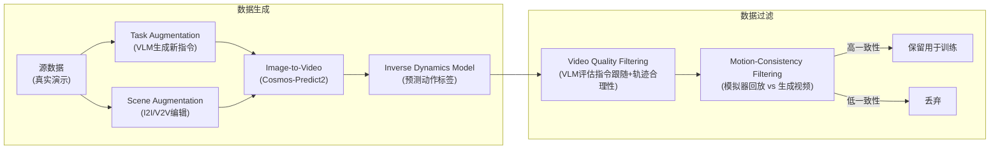
```mermaid
graph LR
    subgraph "数据生成"
        SRC["源数据<br/>(真实演示)"] --> TA["Task Augmentation<br/>(VLM生成新指令)"]
        SRC --> SA["Scene Augmentation<br/>(I2I/V2V编辑)"]
        TA --> I2V["Image-to-Video<br/>(Cosmos-Predict2)"]
        SA --> I2V
        I2V --> IDM["Inverse Dynamics Model<br/>(预测动作标签)"]
    end

    subgraph "数据过滤"
        IDM --> VQF["Video Quality Filtering<br/>(VLM评估指令跟随+轨迹合理性)"]
        VQF --> MCF["Motion-Consistency Filtering<br/>(模拟器回放 vs 生成视频)"]
        MCF -->|"高一致性"| KEEP["保留用于训练"]
        MCF -->|"低一致性"| DISCARD["丢弃"]
    end
```

**Task Augmentation (任务增强)**:
- 分解式指令组合: 将指令分解为 behavior × target object × placement × hand type, 重组为新组合
- 技能原语条件变化: 提取源指令的技能原语(pick, pour, push), 替换目标物体或换用技能集中的其他技能

**Scene Augmentation (场景增强)**:
- Image-level: FLUX.2-dev + Canny edge map, 变换桌面外观、物体外观、光照、背景
- Video-level: Cosmos-Transfer2.5-2B 进行 V2V 迁移, 保持运动动态一致

**Motion-Consistency Filtering (运动一致性过滤)**: 论文的关键创新之一
1. 将 IDM 预测的动作在模拟器中回放, 渲染回放视频
2. 在冻结的 V-JEPA2 视频编码器上训练轻量级 attentive probe (单层 cross-attention + 线性头)
3. probe 预测合成视频与回放视频之间的对齐概率, 超过阈值则保留

合成数据效果: GR-1 Tabletop 上, 仅用真实数据41.0% → 加入100%合成数据50.1% (+9.1pp).

---

## 4. 训练流程

### 4.1 三阶段训练

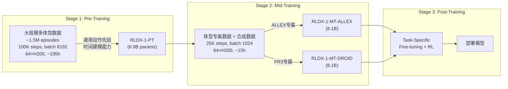
```mermaid
graph LR
    subgraph "Stage 1: Pre-Training"
        PT["大规模多体型数据<br/>~1.5M episodes<br/>100K steps, batch 8192<br/>64×H200, ~195h"]
        PT -->|"通用动作先验<br/>时间建模能力"| PTM["RLDX-1-PT<br/>(6.9B params)"]
    end

    subgraph "Stage 2: Mid-Training"
        PTM --> MT["体型专属数据 + 合成数据<br/>25K steps, batch 1024<br/>64×H200, ~15h"]
        MT -->|"ALLEX专属"| MTA["RLDX-1-MT-ALLEX<br/>(8.1B)"]
        MT -->|"FR3专属"| MTF["RLDX-1-MT-DROID<br/>(8.1B)"]
    end

    subgraph "Stage 3: Post-Training"
        MTA --> FT["Task-Specific<br/>Fine-tuning + RL"]
        MTF --> FT
        FT --> DEPLOY["部署模型"]
    end
```

### 4.2 Pre-Training 细节

- **输入**: 4帧视频观测, 时间偏移 {-6, -4, -2, 0}
- **归一化**: 本体状态和动作归一化到 [-1, 1], 使用每数据集的第1/99百分位数
- **冻结策略**: VLM骨干仅解冻最后4层
- **优化器**: AdamW, lr=1e-4, 常数调度 + 前5%线性预热
- **体型处理**: 每batch随机采样256轨迹, 通过共享的体型无关编解码器路由
- **新体型泛化**: 通过 embodiment-specific projection layers 映射到共享潜在空间, 新体型仅需训练新的投影层

### 4.3 Mid-Training 细节

目标: **体型专门化** + **功能扩展** (添加 motion/memory/physics 模块)

**ALLEX数据组成**: 自有遥操作数据 + 72K 合成数据, 5:5比例采样
**FR3数据组成**: DROID 92K + 自有遥操作数据, 8:2比例采样

**功能扩展的稳定化技巧**:
- 新模态输入独立 dropout = 0.3
- 前2K步 alignment warmup: 冻结所有预训练参数, 仅更新新添加的模态参数
- Physics Stream 参数初始化为近零输出权重

### 4.4 Post-Training: 自适应数据收集 + RL

**自适应数据收集协议 (Adaptive Data Collection)**:

1. **Base数据收集**: 定义遥操作场景, 区分一致性因素(抓取姿势、运动轨迹、执行顺序)和变化因素(物体位姿、初始配置、等待时间)
2. **Refinement数据收集**: 训练→部署→识别失败模式→扩展场景定义→收集针对性演示→迭代

**RL: RECAP + VLM Critic**:

在 RECAP (Amin et al., 2025) 框架上, RLDX-1 引入了**基于文本预测的 VLM Critic**:

- 不引入新的预测头, 而是复用 VLM 原生的文本预测接口进行值估计
- VLM 给定当前观测、任务指令和离散化状态, 自回归预测一个未归一化的整数值(作为文本)
- 直接利用 VLM 内部知识, 从有限数据实现可靠值估计
- Critic backbone: gemma3-4b-it, LoRA rank=128

```
Algorithm: RECAP Post-Training
1. 在演示数据 D_l 上训练 Critic V
2. 用 V 标注优势值 A ← V(D_l)
3. 用带优势标签的数据训练策略 π
4. for i = 1 to N:
     D_l ← D_l ∪ π.rollout()     // 收集新轨迹
     D_succ ← 筛选成功轨迹
     在 D_succ 上精调 V
     重新标注 A ← V(D_l)
     在 D_l + A 上精调 π
```

**RL效果 (Light Bulb Twisting任务)**:

| 阶段 | 帧数 (mean±std) | 尝试次数 |
|------|----------------|---------|
| Teleop (人类) | - | 约5次 |
| BC (模仿学习) | 1056 ± 326 | 12.7 ± 3.0 |
| RECAP₁ | - | ~8.5 |
| RECAP₂ | - | ~5 |
| RECAP₃ | 353 ± 22 | **4.1 ± 0.3** |

RECAP₃ 相比 BC 实现了约3×的速度和尝试次数改善, 甚至超越人类遥操作基线.

---

## 5. 推理优化

目标: 降低每步推理延迟, 在动态环境中减少观测-执行不匹配.

### 5.1 Graph Capture 优化

**问题**: PyTorch eager逐个启动算子, Torch Compile仅能部分捕获为CUDA Graph子图(因RoPE和attention mask构造依赖运行时配置), 导致图碎片化.

**Static Graph Conversion**: 将配置依赖的计算(RoPE、attention mask)预先计算并在执行期间复用, 使前向传播不再分裂为多子图, 可被捕获为单个 CUDA Graph.

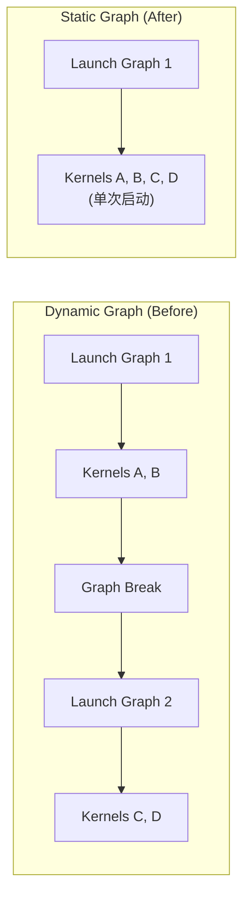
```mermaid
graph LR
    subgraph "Dynamic Graph (Before)"
        DG1["Launch Graph 1"] --> K1["Kernels A, B"]
        K1 --> GB["Graph Break"]
        GB --> DG2["Launch Graph 2"]
        DG2 --> K2["Kernels C, D"]
    end

    subgraph "Static Graph (After)"
        SG1["Launch Graph 1"] --> SK["Kernels A, B, C, D<br/>(单次启动)"]
    end
```

### 5.2 Kernel 优化

RLDX-1 的每次推理是 short-prefill 工作负载(非自回归生成), 序列长度相对较短. 计算密集型 matmul 与访存密集型算子(RMSNorm, RoPE, 残差更新)交替出现.

**算子融合策略**: 手动设计融合核, 将中间张量保持在芯片上:

| 融合核 | 原始操作 | 融合操作 |
|-------|---------|---------|
| fused_llm_attention | RMSNorm(q) → RoPE → RMSNorm(k) → RoPE → Attn | 单核完成 |
| fused_add2_rmsnorm | $h_{res} = h_{out} + h_{in}$ → RMSNorm | 单核完成 |
| fused_add3_rmsnorm | $h_{res} = h_{out} + h_{in} + h_{ds}$ → RMSNorm | 单核完成 |
| grouped_swiglu | SwiGLU(z₁), SwiGLU(z₂) | 合并为一次调用 |

### 5.3 延迟分析

| 推理栈 | 无物理+记忆 | 全模态 | 加速比 |
|-------|-----------|-------|-------|
| PyTorch Eager | 67.0 ms | 71.2 ms | 1.00× |
| CUDA Graph + Torch.Compile | 56.9 ms | 59.6 ms | 1.19× |
| + Static Graph | 46.2 ms | 48.9 ms | 1.46× |
| **+ Kernel Optimization** | **41.6 ms** | **43.7 ms** | **1.63×** |

在 RTX 5090 上实现 >22 Hz 实时推理.

---

## 6. 实验结果

### 6.1 仿真基准

| 基准 | RLDX-1 | $\pi_{0.5}$ | GR00T N1.6 | GR00T N1.5 | $\pi_0$ | $\pi_0$-FAST |
|------|--------|------------|-----------|-----------|--------|------------|
| **LIBERO Avg** | **97.8** | 96.9 | 96.7 | 86.5 | 94.1 | 85.5 |
| **LIBERO-Plus** | **86.7** | 86.5 | 72.6 | 66.3 | 54.6 | 64.2 |
| **SIMPLER Google-VM** | **81.5** | 72.7 | 76.1 | 52.4 | 58.8 | 61.9 |
| **SIMPLER Google-VA** | **77.4** | 68.4 | 57.1 | 43.7 | 54.8 | 59.0 |
| **SIMPLER WidowX** | **71.9** | 46.9 | 57.1 | 62.0 | 27.1 | 48.3 |
| **RoboCasa Kitchen** | **70.6** | 62.1 | 66.2 | 65.7 | 62.5 | 63.6 |
| **GR-1 Tabletop** | **58.7** | 15.4 | 47.6 | 48.0 | 13.6 | - |
| **RoboCasa365 Avg** | **32.1** | 16.9 | 26.9 | 20.0 | 14.8 | 21.7 |

**关键发现**:
- 所有基准 SOTA, 且差距随任务难度增加而加大
- GR00T N1.6 在鲁棒性基准(LIBERO-Plus, Google-VA)上显著退化, RLDX-1则保持一致
- GR00T N1.6 预训练使用了 RoboCasa 仿真数据, RLDX-1 未使用任何仿真数据

### 6.2 真实世界: OpenArm 人形 (通用智能评估)

28-DoF 上半身人形 + Inspire RH56F1 6-DoF手, 348个演示训练.

| 任务 | $\pi_{0.5}$ | GR00T N1.6 | **RLDX-1** |
|------|-----------|-----------|-----------|
| Basic PnP | 41.7 | 37.5 | **50.0** |
| Directional PnP (Shelf) | 54.2 | 47.9 | **68.8** |
| Directional PnP (Dish Rack) | 58.3 | 50.0 | **70.8** |
| Unseen Object | 37.5 | 45.8 | **54.2** |
| Unseen Task | 45.8 | 50.0 | **54.2** |
| Object Grounding | 83.3 | 33.3 | **87.5** |

**失败模式分析**:
- $\pi_{0.5}$: 在 unseen 设置中严重退化 (VLM backbone弱 + full VLM fine-tuning导致过拟合)
- GR00T N1.6: 能识别物体类别但无法进行实例级接地 (Object Grounding仅33.3%, 等于随机)
- RLDX-1: 避免了两种失败模式, 跨所有设置一致提升

### 6.3 真实世界: ALLEX 人形 (功能能力评估)

48-DoF 人形, 评估运动感知 / 长期记忆 / 物理感知:

| 任务 | 评估能力 | $\pi_{0.5}$ | GR00T N1.6 | **RLDX-1** |
|------|---------|-----------|-----------|-----------|
| Conveyor PnP | 运动感知 | 29.2 | 50.0 | **87.5** |
| Object-in-Box Selection | 长期记忆 | 33.3 | 29.2 | **91.7** |
| Card Slide-and-Pick | 物理感知 | 55.3 | 62.3 | **97.2** |
| Pot-to-Cup Pouring | 物理感知 | 38.5 | 37.5 | **70.8** |
| **Average** | | 39.1 | 44.8 | **86.8** |

RLDX-1 平均成功率 86.8%, 而 $\pi_{0.5}$ 和 GR00T N1.6 约 40%.

**逐任务分析**:

- **Conveyor PnP**: 基线在不同传送带速度下崩溃为固定速度动作. GR00T N1.6 只在低速成功, $\pi_{0.5}$ 只在快速成功. RLDX-1 在已见速度100%、未见速度75%成功, 自适应切换动作节奏.
- **Object-in-Box Selection**: GR00T N1.6 随机选择(29.2%), $\pi_{0.5}$ 重复选同一个盒子(33.3%). RLDX-1 91.7%正确选择目标盒子.
- **Card Slide-and-Pick**: 基线表现出多种失败模式(滑动不准、无法抓取薄卡、交接时掉落). RLDX-1 近乎完美(97.2), 证明扭矩反馈对接触密集精细操作的价值.
- **Pot-to-Cup Pouring**: 基线无法完成完整任务 -- 即使倒入成功, 也因缺乏杯子重量感知而卡在倒水姿态. RLDX-1 通过关节扭矩估计杯子重量.

### 6.4 真实世界: Franka Research 3 (功能能力评估)

7-DoF 单臂 + AnySkin 触觉:

| 任务 | 评估能力 | $\pi_{0.5}$ | GR00T N1.6 | **RLDX-1** |
|------|---------|-----------|-----------|-----------|
| Spin Tracking | 运动感知 | 32.3 | 26.0 | **97.9** |
| Pong Game | 运动感知 | 37.0 | 42.6 | **81.5** |
| Cup Swapping | 长期记忆 | 25.0 | 12.5 | **45.8** |
| Shell Game | 长期记忆 | 45.8 | 54.2 | **91.7** |
| Plug Insertion | 物理感知 | 20.8 | 16.7 | **33.3** |
| Egg PnP | 物理感知 | 45.8 | 37.5 | **61.1** |
| **Average** | | 34.4 | 31.6 | **68.5** |

### 6.5 消融与分析

**合成数据规模效应** (GR-1 Tabletop):

| 真实数据 | 合成数据比例 | 成功率 |
|---------|-----------|-------|
| ✓ | 0% | 41.0% |
| ✓ | 25% | 45.6% |
| ✓ | 50% | 46.6% |
| ✓ | 100% | **50.1%** |

合成数据一致带来增益, 有效扩展了操作场景覆盖.

**PEFT分析** (RoboCasa Kitchen):

| Backbone | Action Model | 成功率 | 训练参数 | VRAM (batch 1) |
|----------|-------------|-------|---------|---------------|
| Full FT | Full FT | 62.7% | 2,376M | 56.8 GiB |
| Full FT | LoRA r=64 | 62.7% | 1,151M | 37.2 GiB |
| LoRA r=64 | LoRA r=64 | 55.3% | 398M | **23.7 GiB** |
| Frozen | LoRA r=64 | 36.4% | 378M | 23.3 GiB |

LoRA r=64 对 Backbone+Action 仅用 5.72% 参数, 恢复88%性能, **单GPU消费级硬件可实现微调** (24 GiB 以内).

**Test-time Sampling (Best-of-N)**:
- 对未充分收敛策略(RECAP₁)有效: 尝试次数从 8.5 降到 4.9
- 对已收敛策略(RECAP₂, RECAP₃)反而有害: 引入随机性偏离最优
- 结论: BoN 是**探索机制**, 与RL训练互补而非替代

---

## 7. 模型规格汇总

| 属性 | 规格 |
|------|------|
| VLM Backbone | Qwen3-VL 8B |
| Action Model | Flow-matching DiT (MSAT) |
| 预训练参数量 | 6.9B |
| 中训练参数量 | 8.1B (添加 motion/memory/physics) |
| Cognition Tokens | 64 |
| 视频帧数 | 4 (偏移 {-6,-4,-2,0}) |
| Action Chunk Horizon | 40 (ALLEX) / 16 (FR3) |
| 去噪步数 | 4 (Euler) |
| 预训练数据 | ~1.5M episodes |
| 预训练 | 100K steps, batch 8192, 64×H200, ~195h |
| 中训练 | 25K steps, batch 1024, 64×H200, ~15h |
| 推理延迟 | 43.7 ms (RTX 5090, 全模态, >22Hz) |
| 支持体型 | 单臂/双臂/人形 (28-48 DoF) |
| 开源协议 | 代码 Apache 2.0, 模型权重 RLWRLD License v1.0 (非商业) |

---

## 8. 与 Dexbotic 生态的关系

RLDX-1 的多项设计与 Dexbotic 框架有交叉和可借鉴之处:

| RLDX-1 组件 | Dexbotic 对应 | 可借鉴点 |
|------------|-------------|---------|
| Qwen3-VL backbone | `DexboticVLMModel` + `build_vision_tower()` | RLDX-1 的 robot-specific VQA 微调策略 |
| MSAT (flow-matching DiT) | Action heads (diffusion/flow-matching) | 多流注意力架构, 物理信号流设计 |
| Cognition Tokens | VLM hidden states extraction | 固定长度query token比直接用hidden states更高效 |
| Memory Module | (暂无) | FIFO cognition cache + Transformer fusion |
| Motion Module (STSS) | (暂无) | 视觉编码器中层插入时空自相似性 |
| 三阶段训练 | `BaseExp` orchestration | Pre→Mid→Post 的渐进专门化范式 |
| Synthetic Data Pipeline | (暂无) | Video Gen + IDM + Motion-Consistency Filtering |
| RECAP RL | (暂无) | VLM-based critic + advantage-conditioned supervision |

---

## 9. 关键贡献与创新点总结

1. **Multi-Stream Action Transformer (MSAT)**: 将 MM-DiT 扩展到动作建模, 通过专用流 + 联合注意力统一处理异构模态, 是架构层面的核心创新
2. **Motion-Consistency Filtering**: 用模拟器回放 + V-JEPA2 probe 验证合成数据的动作标签一致性, 显著提升合成数据质量
3. **Text Prediction VLM Critic**: 复用VLM文本预测接口做值估计, 避免新增预测头, 从有限数据实现可靠RL
4. **Static Graph + Kernel Fusion推理**: 消除图碎片化和HBM往返, 实现 >22Hz 实时推理
5. **功能性能力的统一**: 首次在单一VLA模型中同时实现运动感知、长期记忆、物理感知, 并证明这些能力对真实世界任务的关键作用

---

## 10. 局限性与未来方向

1. **每任务数据需求差异大**: 部分任务仍需大量post-training数据
2. **记忆仅覆盖中短时间窗口**: 48-120步的记忆窗口, 小时级交互仍是开放问题
3. **零样本泛化**: 作为预训练策略的零样本泛化能力仍有限
4. **视频/世界模型**: 扩展到长 horizon 规划和动作条件想象是未来方向
5. **计算成本**: 预训练需64×H200约195小时, 门槛较高


## 11. 基于代码的网络架构深度解析

> 本章基于 RLDX-1 开源代码仓库的真实实现, 对模型的网络架构进行逐模块、逐层的深入分析. 所有代码引用均指向实际文件和行号, 所有 tensor shape 均来自代码中的实际计算过程.

### 11.1 总体架构图

下图展示了 RLDX-1 从输入到 Loss 的完整数据流. 虚线框表示可选模块 (Motion / Memory / Physics), 默认关闭.

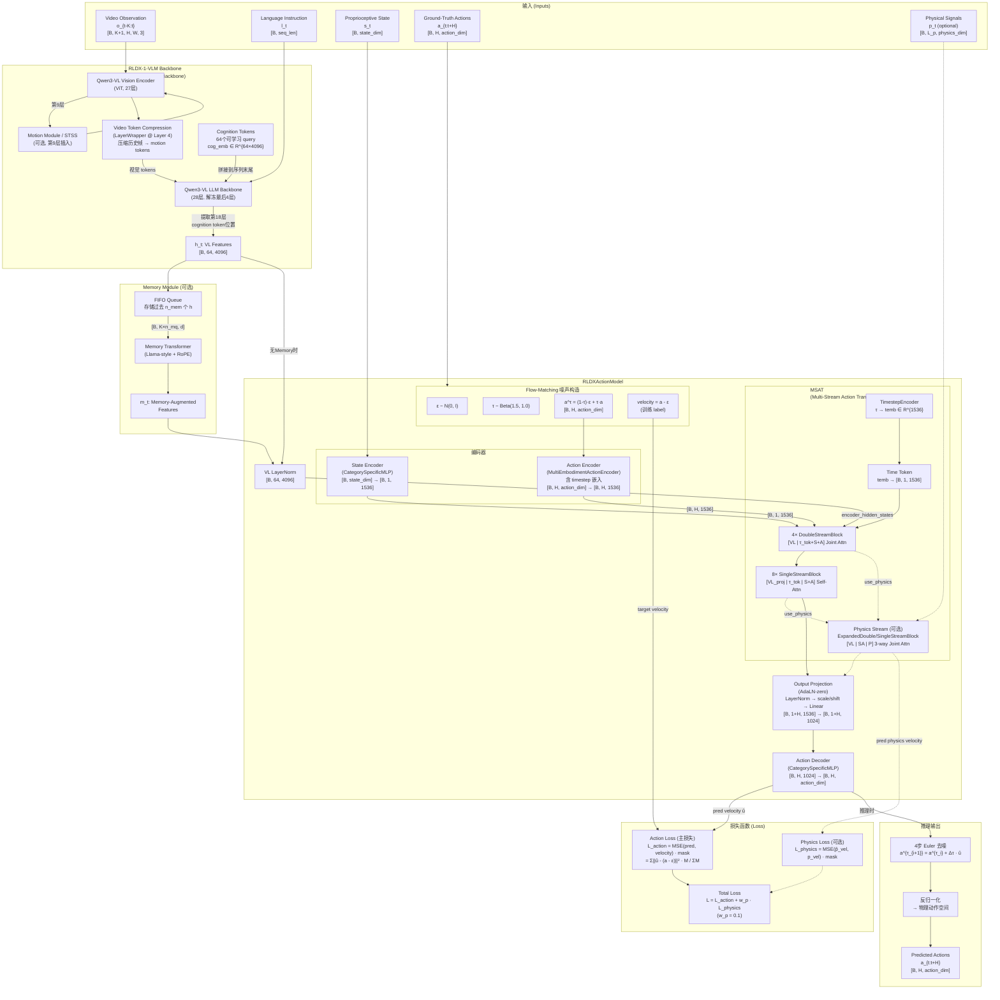
```mermaid
graph TB
    subgraph Inputs["输入 (Inputs)"]
        IMG["Video Observation<br/>o_{t-K:t}<br/>[B, K+1, H, W, 3]"]
        LANG["Language Instruction<br/>l_t<br/>[B, seq_len]"]
        STATE["Proprioceptive State<br/>s_t<br/>[B, state_dim]"]
        ACTION_GT["Ground-Truth Actions<br/>a_{t:t+H}<br/>[B, H, action_dim]"]
        PHY_IN["Physical Signals<br/>p_t (optional)<br/>[B, L_p, physics_dim]"]
    end

    subgraph VLM["RLDX-1-VLM Backbone<br/>(VTCQwen3VLBackbone)"]
        direction TB
        VE["Qwen3-VL Vision Encoder<br/>(ViT, 27层)"]
        MOTION["Motion Module / STSS<br/>(可选, 第9层插入)"]
        VTC["Video Token Compression<br/>(LayerWrapper @ Layer 4)<br/>压缩历史帧 → motion tokens"]
        LLM["Qwen3-VL LLM Backbone<br/>(28层, 解冻最后4层)"]
        COG["Cognition Tokens<br/>64个可学习 query<br/>cog_emb ∈ R^{64×4096}"]

        IMG --> VE
        VE -->|"第9层"| MOTION
        MOTION --> VE
        VE --> VTC
        LANG --> LLM
        VTC -->|"视觉 tokens"| LLM
        COG -->|"拼接到序列末尾"| LLM
        LLM -->|"提取第18层<br/>cognition token位置"| VL_OUT["h_t: VL Features<br/>[B, 64, 4096]"]
    end

    subgraph MEM["Memory Module (可选)<br/>(TransformerMemory)"]
        FIFO["FIFO Queue<br/>存储过去 n_mem 个 h"]
        MEM_TF["Memory Transformer<br/>(Llama-style + RoPE)"]
        VL_OUT --> FIFO
        FIFO -->|"[B, K×n_mq, d]"| MEM_TF
        MEM_TF --> MEM_OUT["m_t: Memory-Augmented<br/>Features"]
    end

    subgraph ActionModel["RLDXActionModel"]
        direction TB
        VLLN["VL LayerNorm<br/>[B, 64, 4096]"]

        subgraph Encoders["编码器"]
            SE["State Encoder<br/>(CategorySpecificMLP)<br/>[B, state_dim] → [B, 1, 1536]"]
            AE["Action Encoder<br/>(MultiEmbodimentActionEncoder)<br/>含 timestep 嵌入<br/>[B, H, action_dim] → [B, H, 1536]"]
        end

        subgraph FlowMatch["Flow-Matching 噪声构造"]
            NOISE["ε ~ N(0, I)"]
            TIME["τ ~ Beta(1.5, 1.0)"]
            NOISY["a^τ = (1-τ)·ε + τ·a<br/>[B, H, action_dim]"]
            VEL_GT["velocity = a - ε<br/>(训练 label)"]
        end

        subgraph MSAT_Block["MSAT<br/>(Multi-Stream Action Transformer)"]
            direction TB
            TEMB["TimestepEncoder<br/>τ → temb ∈ R^{1536}"]
            TIME_TOK["Time Token<br/>temb → [B, 1, 1536]"]
            DSB["4× DoubleStreamBlock<br/>[VL | τ_tok+S+A] Joint Attn"]
            SSB["8× SingleStreamBlock<br/>[VL_proj | τ_tok | S+A] Self-Attn"]
            PHYS_STREAM["Physics Stream (可选)<br/>ExpandedDouble/SingleStreamBlock<br/>[VL | SA | P] 3-way Joint Attn"]

            TEMB --> TIME_TOK
            TIME_TOK --> DSB
            DSB --> SSB
            DSB -.->|"use_physics"| PHYS_STREAM
            SSB -.->|"use_physics"| PHYS_STREAM
        end

        OUT_PROJ["Output Projection<br/>(AdaLN-zero)<br/>LayerNorm → scale/shift → Linear<br/>[B, 1+H, 1536] → [B, 1+H, 1024]"]
        AD["Action Decoder<br/>(CategorySpecificMLP)<br/>[B, H, 1024] → [B, H, action_dim]"]

        MEM_OUT --> VLLN
        VL_OUT -->|"无Memory时"| VLLN
        STATE --> SE
        ACTION_GT --> FlowMatch
        NOISY --> AE

        VLLN -->|"encoder_hidden_states"| DSB
        SE -->|"[B, 1, 1536]"| DSB
        AE -->|"[B, H, 1536]"| DSB
        PHY_IN -.-> PHYS_STREAM
        SSB --> OUT_PROJ
        PHYS_STREAM -.-> OUT_PROJ
        OUT_PROJ --> AD
    end

    subgraph Loss["损失函数 (Loss)"]
        ACTION_LOSS["Action Loss (主损失)<br/>L_action = MSE(pred, velocity) · mask<br/>= Σ||û - (a - ε)||² · M / ΣM"]
        PHYSICS_LOSS["Physics Loss (可选)<br/>L_physics = MSE(p̂_vel, p_vel) · mask"]
        TOTAL_LOSS["Total Loss<br/>L = L_action + w_p · L_physics<br/>(w_p = 0.1)"]

        AD -->|"pred velocity û"| ACTION_LOSS
        VEL_GT -->|"target velocity"| ACTION_LOSS
        PHYS_STREAM -.->|"pred physics velocity"| PHYSICS_LOSS
        ACTION_LOSS --> TOTAL_LOSS
        PHYSICS_LOSS -.-> TOTAL_LOSS
    end

    subgraph InferenceOutput["推理输出"]
        EULER["4步 Euler 去噪<br/>a^{τ_{i+1}} = a^{τ_i} + Δτ · û"]
        DENORM["反归一化<br/>→ 物理动作空间"]
        AD -->|"推理时"| EULER
        EULER --> DENORM
        DENORM --> FINAL_ACT["Predicted Actions<br/>a_{t:t+H}<br/>[B, H, action_dim]"]
    end
```

**顶层调用链** (`rldx/model/core/rldx.py:1107-1115`):

```python
# RLDX.forward() — 训练
def forward(self, inputs: dict) -> BatchFeature:
    backbone_inputs, action_inputs = self.prepare_input(inputs)
    backbone_outputs = self.backbone(backbone_inputs)          # VTCQwen3VLBackbone
    if self.use_memory:
        backbone_outputs = self._apply_memory_training(backbone_outputs)  # TransformerMemory
    action_outputs = self.action_model(backbone_outputs, action_inputs)   # RLDXActionModel
    return action_outputs  # 包含 loss, action_loss, physics_loss 等

# RLDX.get_action() — 推理
def get_action(self, inputs: dict) -> BatchFeature:
    backbone_inputs, action_inputs = self.prepare_input(inputs)
    backbone_outputs = self.backbone(backbone_inputs)
    if self.use_memory:
        backbone_outputs = self._apply_memory_inference(backbone_outputs, reset_memory)
    action_outputs = self.action_model.get_action(backbone_outputs, action_inputs)
    return action_outputs  # 包含去噪后的动作预测
```

---

### 11.2 Backbone: VTCQwen3VLBackbone 代码解析

Backbone 负责将多帧视频观测和语言指令编码为固定长度的 **cognition features** $h_t \in \mathbb{R}^{64 \times 4096}$.

**代码路径**: `rldx/model/modules/backbone/adapter.py`

#### 11.2.1 Cognition Tokens

Cognition Tokens 是 64 个可学习的 query 嵌入向量, 初始化为随机参数, 拼接到 LLM 输入序列的末尾:

```python
# adapter.py — _forward_qwen_with_cog_tokens()
meta_raw = self.cog_emb.to(inputs_embeds.dtype).unsqueeze(0).expand(bsz, -1, -1)
# cog_emb: nn.Parameter, shape [n_cog_tokens=64, 4096]
full_emb = torch.cat([inputs_embeds, meta_raw], dim=1)
# full_emb: [B, seq_len + 64, 4096]
```

LLM 处理完整序列后, 只提取 cognition token 对应位置的隐藏状态, 丢弃其余:

```python
# adapter.py — forward()
outputs = self.forward_qwen(vl_input)
# 提取最后 n_cog_tokens 个 token 的特征 (cog_mode="cog_only")
backbone_features = outputs[:, -n_cog_tokens:, :]  # [B, 64, 4096]
```

**设计动机**: 通过注意力机制, cognition tokens 自动聚合与下游动作预测最相关的视觉-语言信息, 同时将可变长度的 VLM 输出压缩为固定长度 (64 tokens), 带来 +35% 推理加速.

#### 11.2.2 特征提取层: 第18层

代码从 LLM 的第18层 (共28层) 提取隐藏状态, 而非最后一层:

```python
# RLDXConfig (rldx/configs/model/rldx.py)
select_layer: int = 18  # 默认值
```

**原因**: 更高层过度专注于语言生成 (next-token prediction), 而第18层在视觉接地和语义抽象之间有更好的平衡. 消融实验显示 Layer 18 (60.9%) 显著优于 Layer 28 (56.3%) 和 Layer 8 (51.1%).

#### 11.2.3 Video Token Compression (VTC)

VTC 在 LLM 的第4层 (`internal_projection=4`) 通过 `LayerWrapper` 实现:

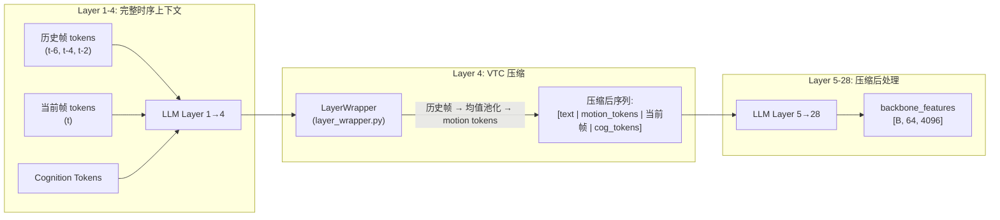
```mermaid
graph LR
    subgraph "Layer 1-4: 完整时序上下文"
        F_OLD["历史帧 tokens<br/>(t-6, t-4, t-2)"] --> L14["LLM Layer 1→4"]
        F_CUR["当前帧 tokens<br/>(t)"] --> L14
        COG2["Cognition Tokens"] --> L14
    end

    subgraph "Layer 4: VTC 压缩"
        L14 --> LW["LayerWrapper<br/>(layer_wrapper.py)"]
        LW -->|"历史帧 → 均值池化 → motion tokens"| COMPRESSED["压缩后序列:<br/>[text | motion_tokens | 当前帧 | cog_tokens]"]
    end

    subgraph "Layer 5-28: 压缩后处理"
        COMPRESSED --> L5N["LLM Layer 5→28"]
        L5N --> OUT2["backbone_features<br/>[B, 64, 4096]"]
    end
```

**VTC 压缩逻辑** (`layer_wrapper.py`):

1. 识别图像 token 范围 (通过检测 token ID 151652 作为帧分隔标记)
2. 保留当前帧的所有 token
3. 将每个历史帧的 vision tokens 均值池化为**单个 motion token**
4. 重构序列: `[text | motion_tokens | 当前帧 | trailing_tokens]`
5. 相应更新 attention mask 和 position IDs

**效果**: 多帧观测 (默认4帧, 时间偏移 `{-6, -4, -2, 0}`) 的前4层保留完整时序信息供因果注意力累积上下文, 第4层后大幅压缩序列长度, 降低后续层的计算复杂度.

#### 11.2.4 Motion Module (STSS)

Motion Module 在 Vision Encoder 的第9层插入 (`rldx/model/modules/backbone/motion.py`):

$$\tilde{v}_t^{(9)} = v_t^{(9)} + S_\theta(\text{STSS}(v_t^{(9)}))$$

其中 STSS (Space-Time Self-Similarity) 计算视频特征中每个时空位置与其局部窗口邻居之间的相关性:

```python
# motion.py — STSSTransformation
# window: (T=5, H=9, W=9) — 时间和空间的局部邻域
# corr_func: "cosine" — 余弦相似度
```

**集成模式**:
- `"lite"`: 1×1 Conv3d L-fusion (轻量级)
- `"full"`: 3层 3×3 Conv3d stack (完整)

Motion Module 默认关闭 (`use_motion=False`), 在 Mid-Training 阶段启用.

---

### 11.3 Memory Module 代码解析

Memory Module 为模型提供跨 action chunk 边界的长期记忆能力.

**代码路径**: `rldx/model/modules/memory.py`

**架构**: `TransformerMemory` — 基于 Llama 风格的 Transformer decoder, 带 RoPE 位置编码.

#### 11.3.1 训练路径

```python
# rldx.py — _apply_memory_training()
backbone_features = backbone_outputs["backbone_features"]  # [B*K, n_q, d]
# K = memory_length (默认4), 表示当前帧 + 过去K-1帧的 cognition features

# 1. 将 BK 维展开为 [B, K, n_q, d]
mq_all = backbone_features[:, -n_q:, :].view(B, K, n_q, d)

# 2. 分离: 直通部分 vs 记忆路由部分
mq_original = mq_all[:, -1, :, :]           # [B, n_q, d] — 当前帧完整 cog tokens
mq_for_memory = mq_all[:, :, n_mq_pass:, :] # [B, K, n_mq_mem, d] — 路由到 memory 的子集

# 3. 展平为序列, 送入 Memory Transformer
mq_mem_seq = mq_for_memory.view(B, K * n_mq_mem, d)
mq_memory_out = self.memory(inputs_embeds=mq_mem_seq).last_hidden_state

# 4. 取最后一个时间步的输出, 替换原始 cog tokens 的对应部分
mq_augmented = mq_memory_out.view(B, K, n_mq_mem, d)[:, -1, :, :]
```

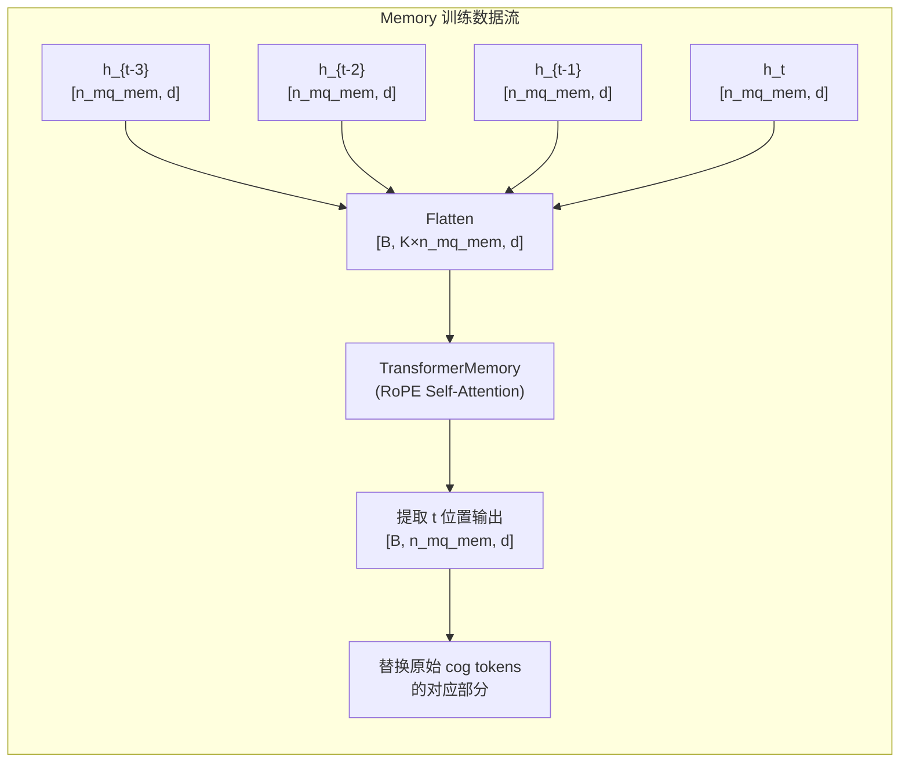
```mermaid
graph LR
    subgraph "Memory 训练数据流"
        CQ1["h_{t-3}<br/>[n_mq_mem, d]"] --> FLAT["Flatten<br/>[B, K×n_mq_mem, d]"]
        CQ2["h_{t-2}<br/>[n_mq_mem, d]"] --> FLAT
        CQ3["h_{t-1}<br/>[n_mq_mem, d]"] --> FLAT
        CQ4["h_t<br/>[n_mq_mem, d]"] --> FLAT
        FLAT --> TF["TransformerMemory<br/>(RoPE Self-Attention)"]
        TF --> EXTRACT["提取 t 位置输出<br/>[B, n_mq_mem, d]"]
        EXTRACT --> REPLACE["替换原始 cog tokens<br/>的对应部分"]
    end
```

#### 11.3.2 推理路径

推理时维护一个滑动缓存:

```python
# rldx.py — _apply_memory_inference()
# 1. 每次推理推入当前 cog tokens, 弹出最旧的
# 2. 查询 memory 得到增强的 features
# 3. 支持 reset_memory 标志 (episode 边界)
```

**配置**:
- `memory_length`: 4 (时间步窗口)
- `memory_n_cog_tokens`: None (路由到 memory 的 cog token 数量, 默认 = n_cog_tokens)
- `concat_memory`: False (替换 vs 拼接增强 tokens)

---

### 11.4 MSAT (Multi-Stream Action Transformer) 代码解析

MSAT 是整个架构的核心动作生成模块, 将 MM-DiT 扩展到动作建模.

**代码路径**: `rldx/model/modules/action_model/msat.py` (类 `MSAT`, 继承自 `JointBase`)

#### 11.4.1 MSAT 整体结构

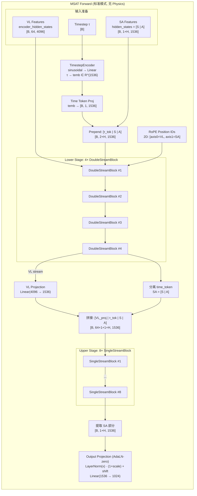
```mermaid
graph TB
    subgraph "MSAT Forward (标准模式, 无 Physics)"
        direction TB

        subgraph "输入准备"
            VL_IN["VL Features<br/>encoder_hidden_states<br/>[B, 64, 4096]"]
            SA_IN["SA Features<br/>hidden_states = [S | A]<br/>[B, 1+H, 1536]"]
            T_IN["Timestep τ<br/>[B]"]
        end

        TE["TimestepEncoder<br/>sinusoidal → Linear<br/>τ → temb ∈ R^{1536}"]
        TT["Time Token Proj<br/>temb → [B, 1, 1536]"]
        SA_CAT["Prepend: [τ_tok | S | A]<br/>[B, 2+H, 1536]"]
        ROPE["RoPE Position IDs<br/>2D: [axis0=VL, axis1=SA]"]

        T_IN --> TE
        TE --> TT
        TT --> SA_CAT
        SA_IN --> SA_CAT

        subgraph "Lower Stage: 4× DoubleStreamBlock"
            DSB1["DoubleStreamBlock #1"]
            DSB2["DoubleStreamBlock #2"]
            DSB3["DoubleStreamBlock #3"]
            DSB4["DoubleStreamBlock #4"]
            DSB1 --> DSB2 --> DSB3 --> DSB4
        end

        VL_IN --> DSB1
        SA_CAT --> DSB1
        ROPE --> DSB1

        SEP["分离 time_token<br/>SA = [S | A]"]
        DSB4 --> SEP

        VL_PROJ["VL Projection<br/>Linear(4096 → 1536)"]
        DSB4 -->|"VL stream"| VL_PROJ

        SINGLE_CAT["拼接: [VL_proj | τ_tok | S | A]<br/>[B, 64+1+1+H, 1536]"]
        VL_PROJ --> SINGLE_CAT
        SEP --> SINGLE_CAT

        subgraph "Upper Stage: 8× SingleStreamBlock"
            SSB1["SingleStreamBlock #1"]
            SSB8["SingleStreamBlock #8"]
            SSB1 -->|"..."| SSB8
        end

        SINGLE_CAT --> SSB1

        EXTRACT_SA["提取 SA 部分<br/>[B, 1+H, 1536]"]
        SSB8 --> EXTRACT_SA

        OUT_P["Output Projection (AdaLN-zero)<br/>LayerNorm(x) · (1+scale) + shift<br/>Linear(1536 → 1024)"]
        EXTRACT_SA --> OUT_P
    end
```

#### 11.4.2 DoubleStreamBlock: 联合注意力

**代码路径**: `rldx/model/modules/action_model/blocks.py:257-609`

DoubleStreamBlock 采用 Flux 风格的双流架构, SA 和 VL 两个流分别做 Norm → QKV → 联合注意力 → 分离 → MLP:


```mermaid
graph TB
    subgraph "DoubleStreamBlock Forward"
        SA_T["sa_tokens<br/>[B, N_sa, 1536]"]
        VL_T["vl_tokens<br/>[B, N_vl, 4096]"]

        subgraph "SA Stream"
            SA_NORM1["sa_norm1 (LayerNorm)"]
            SA_MOD1["Modulate: (1+scale)·x + shift"]
            SA_QKV["sa_qkv Linear<br/>(1536 → 1536×3)"]
            SA_SPLIT["Split → Q_sa, K_sa, V_sa<br/>[B, H, N_sa, 64]"]
            SA_QKNORM["RMSNorm(Q_sa), RMSNorm(K_sa)"]
        end

        subgraph "VL Stream"
            VL_NORM1["vl_norm1 (LayerNorm)"]
            VL_MOD1["Modulate: (1+scale)·x + shift"]
            VL_QKV["vl_qkv Linear<br/>(4096 → 1536×3)"]
            VL_SPLIT["Split → Q_vl, K_vl, V_vl<br/>[B, H, N_vl, 64]"]
            VL_QKNORM["RMSNorm(Q_vl), RMSNorm(K_vl)"]
        end

        SA_T --> SA_NORM1 --> SA_MOD1 --> SA_QKV --> SA_SPLIT --> SA_QKNORM
        VL_T --> VL_NORM1 --> VL_MOD1 --> VL_QKV --> VL_SPLIT --> VL_QKNORM

        JOINT_CAT["Joint Concat<br/>Q = [Q_vl | Q_sa]<br/>K = [K_vl | K_sa]<br/>V = [V_vl | V_sa]<br/>[B, H, N_vl+N_sa, 64]"]
        SA_QKNORM --> JOINT_CAT
        VL_QKNORM --> JOINT_CAT

        ROPE_APP["Apply RoPE<br/>(rope_sa_only: 仅SA轴)"]
        JOINT_CAT --> ROPE_APP

        SDPA["F.scaled_dot_product_attention<br/>[B, H, N_vl+N_sa, 64]"]
        ROPE_APP --> SDPA

        SPLIT_OUT["Split outputs<br/>vl_attn = [:, :, :N_vl]<br/>sa_attn = [:, :, N_vl:]"]
        SDPA --> SPLIT_OUT

        SA_PROJ["sa_proj → gate · residual"]
        VL_PROJ2["vl_proj → gate · residual"]
        SPLIT_OUT --> SA_PROJ
        SPLIT_OUT --> VL_PROJ2

        SA_MLP["SA MLP (SwiGLU)<br/>Norm → Modulate → FFN → gate · residual"]
        VL_MLP["VL MLP (SwiGLU)<br/>Norm → Modulate → FFN → gate · residual"]
        SA_PROJ --> SA_MLP
        VL_PROJ2 --> VL_MLP

        SA_OUT["sa_tokens (updated)"]
        VL_OUT2["vl_tokens (updated)"]
        SA_MLP --> SA_OUT
        VL_MLP --> VL_OUT2
    end
```

**核心代码** (`blocks.py:548-607`):

```python
# Joint Attention: 拼接两流的 Q, K, V
q = torch.cat([vl_q, sa_q], dim=2)  # [B, H, N_vl+N_sa, D_h]
k = torch.cat([vl_k, sa_k], dim=2)
v = torch.cat([vl_v, sa_v], dim=2)

# 对 Q, K 施加 RoPE
if self.use_rope and pe is not None:
    q, k = apply_rotary_emb(q, k, pe)

# 联合注意力计算
attn_out = F.scaled_dot_product_attention(q, k, v, attn_mask=joint_attn_mask)

# 按流拆分输出
vl_attn, sa_attn = attn_out[:, :, :N_vl], attn_out[:, :, N_vl:]

# 各流独立: projection → gated residual → MLP → gated residual
sa_tokens = sa_tokens + sa_mod1.gate * sa_proj(sa_attn)
sa_tokens = sa_tokens + sa_mod2.gate * sa_mlp(norm(sa_tokens))
```

#### 11.4.3 SingleStreamBlock: 融合自注意力

从 DoubleStream 过渡到 SingleStream 时, VL 流经过维度投影 (`Linear(4096 → 1536)`) 后与 SA 流拼接:

```python
# msat.py:446-455
vl_projected = self.vl_proj_to_sa(vl)  # [B, 64, 4096] → [B, 64, 1536]
# 拼接: [VL_proj | time_token | S | A]
x = torch.cat([vl_projected, time_token, sa], dim=1)
# x: [B, 64 + 1 + 1 + H, 1536]
```

SingleStreamBlock 对融合后的序列执行标准 self-attention + MLP:

```python
# blocks.py — SingleStreamBlock.forward()
# 并行计算 QKV 和 MLP 输入
qkv_mlp_in = self.linear1(self.pre_norm(x))  # 单个 Linear 输出 Q, K, V, MLP_in
q, k, v = qkv_mlp_in[:, :, :3*inner_dim].chunk(3, dim=-1)
mlp_in = qkv_mlp_in[:, :, 3*inner_dim:]

# Self-attention
attn_out = F.scaled_dot_product_attention(q, k, v)
# MLP
mlp_out = activation(mlp_in)
# 合并 + 投影 + gated residual
x = x + gate * linear2(cat([attn_out, mlp_out]))
```

最后提取 SA 部分:

```python
# msat.py:548-552
N_action_pure = sa.shape[1]  # 1+H (state + actions)
sa = x[:, -N_action_pure:, :]  # [B, 1+H, 1536]
out = self._output_projection(sa, temb)  # [B, 1+H, 1024]
```

#### 11.4.4 Output Projection (AdaLN-zero)

```python
# msat.py:777-781
def _output_projection(self, sa, temb):
    shift, scale = self.proj_out_1(F.silu(temb)).chunk(2, dim=1)
    # proj_out_1: Linear(1536 → 2×1536)
    sa = self.norm_out(sa) * (1 + scale[:, None]) + shift[:, None]
    return self.proj_out_2(sa)
    # proj_out_2: Linear(1536 → 1024)
```

AdaLN-zero 的设计使输出在训练初期接近零, 确保扩散过程的平滑启动.

#### 11.4.5 Timestep Encoding 与 Time Token

MSAT 支持三种 timestep 注入模式 (`temb_type`):

| 模式 | 方式 | 默认 |
|------|------|------|
| `"input_token"` | τ 编码为 token, 拼入 SA 流参与注意力 | ✓ (RLDX-1 默认) |
| `"shared_mod"` | τ 通过共享的 Modulation 调制所有 block | |
| `"layerwise_mod"` | τ 通过每层独立的 Modulation (AdaLN) 调制 | |

`"input_token"` 模式下, time token 是一个额外的 token:

```python
# msat.py:313-318
t_emb = self.time_token_proj(temb).unsqueeze(1)  # [B, 1, 1536]
time_token = t_emb.repeat(1, self.num_temb_tokens, 1)  # [B, 1, 1536]
# 拼入 SA 流: [time_token | S | A]
sa = torch.cat([time_token, sa], dim=1)
```

当使用 `"input_token"` 时, DoubleStreamBlock 的 Modulation 退化为恒等变换 (gate=1, shift=0, scale=0), 因为 time 信息已经通过 token 参与注意力了.

#### 11.4.6 RoPE 位置编码

MSAT 使用 2D RoPE (`RoPEEmbedder1D` with `axes_dim`):

```python
# msat.py:883-893 (rope_sa_only 模式)
self.rope_embedder = RoPEEmbedder1D(
    head_dim=64,
    axes_dim=[16, 48],  # axis0=16维 (VL, 未使用), axis1=48维 (SA 序列位置)
    theta=10000.0,
    max_seq_len=512,
)
```

位置 ID 分配:
- **VL tokens**: axis0 = 0 (无位置编码, 因为 `rope_sa_only`)
- **Time token**: axis1 = 0
- **State token**: axis1 = 1
- **Action tokens**: axis1 = 2, 3, ..., H+1

这意味着只有 SA 流获得序列位置信息, VL 流不参与 RoPE — 论文称此设计可防止对 VLM 空间结构的灾难性遗忘.

---

### 11.5 Flow-Matching 训练与推理

RLDX-1 的动作生成基于 **Conditional Flow Matching**, 学习从高斯噪声到目标动作分布的确定性流 (velocity field).

#### 11.5.1 训练: 噪声构造与 Velocity Target

**代码路径**: `rldx/model/core/rldx.py:314-458`

**噪声时间采样**: 从 Beta 分布采样, 然后缩放到 $[0, s]$:

$$\tau \sim \text{Beta}(\alpha=1.5, \beta=1.0), \quad \tau \leftarrow \tau \cdot s \quad (s=0.999)$$

```python
# rldx.py — sample_time()
t_raw = torch.distributions.Beta(
    self.config.noise_beta_alpha,  # 1.5
    self.config.noise_beta_beta,   # 1.0
).sample((batch_size,))
t_raw = t_raw * self.config.noise_s  # 缩放到 [0, 0.999]
```

Beta(1.5, 1.0) 的概率密度偏向较大的 τ 值, 使模型在训练时更多地关注接近完成去噪的状态, 与推理时在 τ≈1 附近需要高精度预测一致.

**含噪动作构造** (线性插值):

$$a_{t:t+H}^\tau = (1 - \tau) \cdot \epsilon + \tau \cdot a_{t:t+H}, \quad \epsilon \sim \mathcal{N}(0, I)$$

```python
noise = torch.randn(actions.shape, device=device, dtype=dtype)
t = t_raw[:, None, None]  # [B, 1, 1]
noisy_trajectory = (1 - t) * noise + t * actions  # [B, H, action_dim]
```

**Velocity Target** (训练 label):

$$v^* = a_{t:t+H} - \epsilon$$

```python
velocity = actions - noise  # [B, H, action_dim] — 这就是模型需要预测的目标
```

**损失函数**:

$$\mathcal{L}_{\text{action}} = \frac{\sum_{b,h,d} \|u_\theta(a^\tau, \tau, c) - (a - \epsilon)\|_2^2 \cdot M_{b,h,d}}{\sum_{b,h,d} M_{b,h,d} + 10^{-6}}$$

```python
# rldx.py:438-439
action_loss = F.mse_loss(pred_actions, velocity, reduction="none") * loss_mask
loss = action_loss.sum() / (loss_mask.sum() + 1e-6)
```

其中 $M$ 是 `loss_mask`, 由 `action_mask` (标注有效维度) 和 RTC 的 `postfix_mask` (仅在非前缀位置计算 loss) 相乘得到.

#### 11.5.2 推理: Euler 去噪

**代码路径**: `rldx/model/core/rldx.py:490-761`

推理时从纯噪声 $a^0 \sim \mathcal{N}(0, I)$ 出发, 通过 4 步 Euler 积分恢复干净动作:

$$a^{\tau_{i+1}} = a^{\tau_i} + (\tau_{i+1} - \tau_i) \cdot u_\theta(a^{\tau_i}, \tau_i, c_t)$$

时间步默认均匀: $\tau \in \{0, 0.25, 0.5, 0.75\} \rightarrow 1.0$

```python
# rldx.py — get_action_with_features()
actions = torch.randn(B, action_horizon, action_dim)  # 初始噪声

# 构造时间步序列
timesteps_list = [i / num_inference_timesteps for i in range(num_inference_timesteps)]
timesteps_list.append(1.0)  # [0.0, 0.25, 0.5, 0.75, 1.0]

for i in range(len(timesteps_list) - 1):
    t_cont = timesteps_list[i]
    dt = timesteps_list[i + 1] - timesteps_list[i]  # 0.25

    t_scalar = torch.full((B,), t_cont, device=device)
    t_tok = t_scalar.unsqueeze(1).expand(-1, action_horizon)

    # 编码当前含噪动作
    action_features = self.action_encoder(actions, t_tok, embodiment_id)
    sa_embs = torch.cat([state_features, action_features], dim=1)

    # MSAT 前向
    model_output, _ = self.model(
        hidden_states=sa_embs,
        encoder_hidden_states=vl_embeds,
        timestep=t_scalar,
    )
    pred_velocity = self.action_decoder(model_output, embodiment_id)[:, -action_horizon:]

    # Euler 步进
    actions = actions + dt * pred_velocity
```

每步去噪需要完整的 MSAT 前向传播, 因此 4 步推理 = 4 次 MSAT 调用. 在 RTX 5090 上, 全模态推理延迟为 43.7ms (>22Hz).

#### 11.5.3 完整训练数据流图

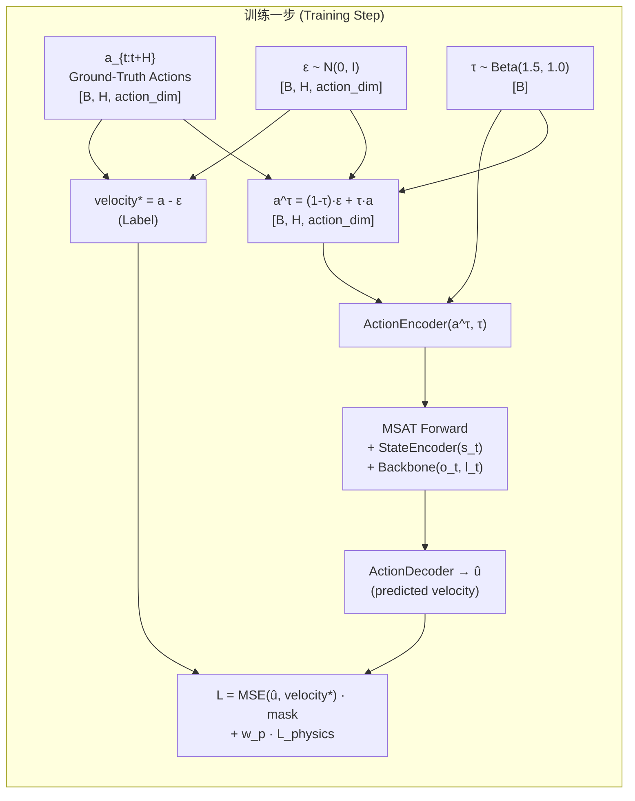
```mermaid
graph TB
    subgraph "训练一步 (Training Step)"
        direction TB
        A_GT["a_{t:t+H}<br/>Ground-Truth Actions<br/>[B, H, action_dim]"]
        EPS["ε ~ N(0, I)<br/>[B, H, action_dim]"]
        TAU["τ ~ Beta(1.5, 1.0)<br/>[B]"]

        NOISY["a^τ = (1-τ)·ε + τ·a<br/>[B, H, action_dim]"]
        VEL["velocity* = a - ε<br/>(Label)"]

        A_GT --> NOISY
        A_GT --> VEL
        EPS --> NOISY
        EPS --> VEL
        TAU --> NOISY

        ENC["ActionEncoder(a^τ, τ)"]
        NOISY --> ENC
        TAU --> ENC

        MSAT_FW["MSAT Forward<br/>+ StateEncoder(s_t)<br/>+ Backbone(o_t, l_t)"]
        ENC --> MSAT_FW

        DEC["ActionDecoder → û<br/>(predicted velocity)"]
        MSAT_FW --> DEC

        LOSS_COMP["L = MSE(û, velocity*) · mask<br/>+ w_p · L_physics"]
        DEC --> LOSS_COMP
        VEL --> LOSS_COMP
    end
```

---

### 11.6 Physics Stream 代码解析

Physics Stream 为 MSAT 添加第三个流, 处理触觉和扭矩等物理信号.

**代码路径**: `rldx/model/modules/action_model/physics_head.py`

#### 11.6.1 Physics 数据拆分

物理信号被分为 **历史 (conditioning)** 和 **未来 (prediction)** 两部分:

```python
# physics_head.py — prepare_train()
physics_hist = action_input.physics[:, :self.physics_hist_len, :]  # 条件化输入
physics_fut_gt = action_input.physics[:, self.physics_hist_len:, :]  # 预测目标
```

#### 11.6.2 Physics 编码

历史部分使用固定编码器 (无噪声), 未来部分使用 timestep-aware 编码器 (加噪):

```python
# 历史: 固定编码 (conditioning)
physics_hist_tok = self.physics_cond_encoder(physics_hist)  # [B, L_hist, 1536]

# 未来: 加噪 + timestep 编码 (flow-matching)
physics_noise = torch.randn_like(physics_fut_gt)
noisy_physics_fut = (1 - t) * physics_noise + t * physics_fut_gt
physics_velocity = physics_fut_gt - physics_noise  # 预测目标
physics_fut_tok = self.physics_fut_encoder(noisy_physics_fut, t_raw)  # [B, L_fut, 1536]

# 拼接
physics_embs = torch.cat([physics_hist_tok, physics_fut_tok], dim=1)  # [B, L_p, 1536]
```

#### 11.6.3 Physics 在 MSAT 中的流动

启用 Physics 时, MSAT 使用扩展的 block:

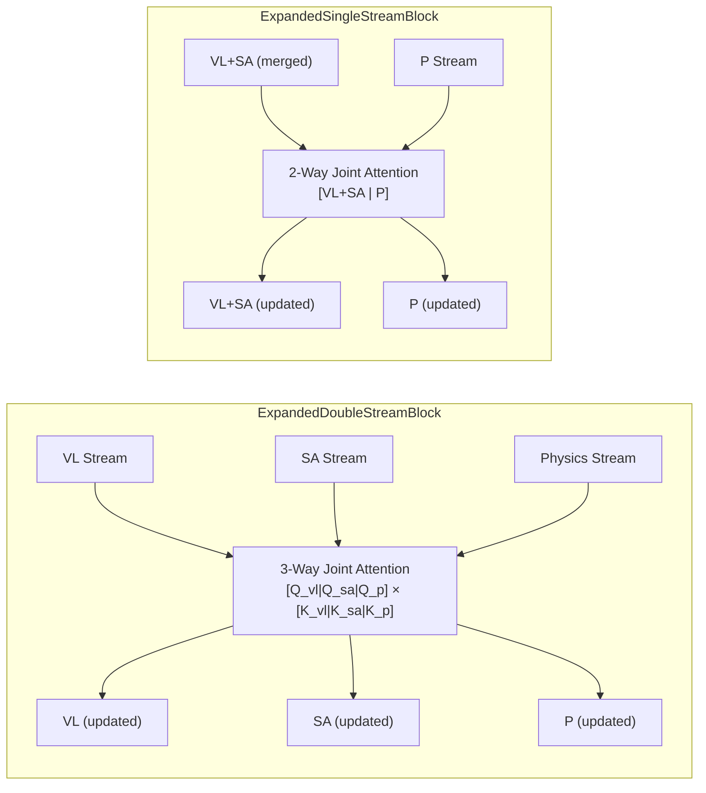
```mermaid
graph LR
    subgraph "ExpandedDoubleStreamBlock"
        VL["VL Stream"] --> JA3["3-Way Joint Attention<br/>[Q_vl|Q_sa|Q_p] × [K_vl|K_sa|K_p]"]
        SA["SA Stream"] --> JA3
        P["Physics Stream"] --> JA3
        JA3 --> VL2["VL (updated)"]
        JA3 --> SA2["SA (updated)"]
        JA3 --> P2["P (updated)"]
    end

    subgraph "ExpandedSingleStreamBlock"
        VLSA["VL+SA (merged)"] --> JA2["2-Way Joint Attention<br/>[VL+SA | P]"]
        P3["P Stream"] --> JA2
        JA2 --> VLSA2["VL+SA (updated)"]
        JA2 --> P4["P (updated)"]
    end
```

```python
# msat.py:572-576 — _forward_physics()
# Lower: ExpandedDoubleStreamBlocks [VL | SA | P] — 3-way via p_tokens kwarg
# Upper: ExpandedSingleStreamBlocks [VL+SA | P] — 2-way via p_tokens kwarg
```

#### 11.6.4 Physics Loss

$$\mathcal{L}_{\text{physics}} = \frac{\sum \|p_{\text{pred}} - (p_{\text{gt}} - p_{\text{noise}})\|_2^2 \cdot M_p}{\sum M_p + 10^{-6}}$$

```python
# physics_head.py:209-230 — compute_loss()
physics_pred_vel = self.physics_decoder(physics_hidden_fut)  # [B, L_fut, physics_dim]
loss_unreduced = F.mse_loss(physics_pred_vel, physics_velocity, reduction="none")
physics_loss = (loss_unreduced * mask_3d).sum() / (n_valid + 1e-6)
```

**总损失**:

$$\mathcal{L}_{\text{total}} = \mathcal{L}_{\text{action}} + w_p \cdot \mathcal{L}_{\text{physics}}, \quad w_p = 0.1$$

```python
# rldx.py:453-456
if physics_loss is not None:
    loss = loss + self.physics.physics_loss_weight * physics_loss  # 0.1
```

#### 11.6.5 Graceful Degradation

Physics Stream 支持优雅降级:
- `physics_dropout_prob`: 训练时按采样概率将 physics token 整体 mask 掉
- `physics_attn_mask`: 推理时传感器不可用则置为 0, 模型自动退化为纯视觉策略
- 初始化: 所有 physics 参数近零输出 (`init_physics_params_near_zero`), 确保新增模块不干扰预训练权重

---

### 11.7 Embodiment-Conditioned MLP 代码解析

RLDX-1 通过体型条件化的 MLP 实现单一 checkpoint 支持 10+ 种机器人体型.

**代码路径**: `rldx/model/modules/embodiment_conditioned_mlp.py`

#### 11.7.1 CategorySpecificMLP

每种体型拥有独立的 MLP 权重, 通过 `embodiment_id` 索引:

```python
class CategorySpecificMLP(nn.Module):
    # 每种体型的独立 2 层 MLP: input_dim → hidden_dim → output_dim
    # W1: [max_embodiments, input_dim, hidden_dim]
    # W2: [max_embodiments, hidden_dim, output_dim]

    def forward(self, x, embodiment_id):
        # 根据 embodiment_id 选择对应体型的权重
        w1 = self.w1[embodiment_id]  # [B, input_dim, hidden_dim]
        w2 = self.w2[embodiment_id]  # [B, hidden_dim, output_dim]
        h = activation(x @ w1)
        return h @ w2
```

用于:
- **State Encoder**: `[B, state_dim] → [B, 1, 1536]`
- **Action Decoder**: `[B, 1+H, 1024] → [B, 1+H, action_dim]`

#### 11.7.2 MultiEmbodimentActionEncoder

Action Encoder 更复杂, 需要同时编码含噪动作和 timestep:

```python
class MultiEmbodimentActionEncoder(nn.Module):
    # W1: action → hidden (per-embodiment)
    # W2: concat(action_emb, time_emb) → hidden (per-embodiment), with SiLU
    # W3: hidden → hidden (per-embodiment)

    def forward(self, actions, timesteps, embodiment_id):
        # actions: [B, H, action_dim]
        # timesteps: [B, H] (per-token time for RTC) or [B] (global)
        a_emb = actions @ w1[embodiment_id]      # [B, H, hidden]
        t_emb = sinusoidal_encode(timesteps)      # [B, H, hidden]
        combined = torch.cat([a_emb, t_emb], -1)  # [B, H, 2*hidden]
        h = silu(combined @ w2[embodiment_id])     # [B, H, hidden]
        return h @ w3[embodiment_id]               # [B, H, 1536]
```

**关键设计**: per-token time 支持 — 当使用 RTC (Real-Time Chunking) 时, 前缀位置的 $\tau = 1.0$ (已知干净动作), 后缀位置的 $\tau$ 按正常调度. 这使得 Action Encoder 需要在 token 级别注入 timestep, 而非全局.

#### 11.7.3 新体型扩展

扩展到新体型只需:
1. 注册新的 `EmbodimentTag` (分配 ID)
2. 新体型自动获得独立的 encoder/decoder 权重 (在对应 ID 位置)
3. 仅需训练新的投影层, MSAT 共享参数不变

---

### 11.8 完整 Tensor Shape 追踪表

以默认配置为例: `B=2, H=16, state_dim=10, action_dim=7, n_cog=64, video_length=4`

| 阶段 | 张量 | Shape | 来源 |
|------|------|-------|------|
| **输入** | video frames | `[B, 4, H, W, 3]` | 数据集 |
| | language tokens | `[B, seq_len]` | Qwen tokenizer |
| | state | `[B, 10]` | 本体感知 |
| | action (GT) | `[B, 16, 7]` | 数据集 |
| | physics (可选) | `[B, L_p, physics_dim]` | 传感器 |
| **Vision Encoder** | pixel_values | `[B, 3, T_patch, H, W]` | Qwen3-VL ViT |
| | image_tokens | `[B, N_patches, 1280]` | ViT 输出 |
| **VTC (Layer 4)** | 压缩前序列 | `[B, text+3×frame+cur_frame+64, 4096]` | LLM embedding |
| | 压缩后序列 | `[B, text+3_motion+cur_frame+64, 4096]` | LayerWrapper |
| **Backbone 输出** | backbone_features ($h_t$) | `[B, 64, 4096]` | Layer 18 cog tokens |
| **Memory (可选)** | memory input | `[B, K×n_mq_mem, 4096]` | K帧 cog features |
| | memory output | `[B, n_mq_mem, 4096]` | TransformerMemory |
| **Action Model 输入** | vl_embeds | `[B, 64, 4096]` | VL LayerNorm |
| | state_features | `[B, 1, 1536]` | State Encoder |
| | noise ε | `[B, 16, 7]` | $\mathcal{N}(0,I)$ |
| | noisy actions $a^\tau$ | `[B, 16, 7]` | 线性插值 |
| | velocity (label) | `[B, 16, 7]` | $a - \epsilon$ |
| | action_features | `[B, 16, 1536]` | Action Encoder |
| **MSAT 输入** | sa_embs (含 time token) | `[B, 18, 1536]` | `[τ_tok \| S \| A]` |
| | encoder_hidden_states | `[B, 64, 4096]` | VL features |
| | temb | `[B, 1536]` | TimestepEncoder |
| | physics_embs (可选) | `[B, L_p, 1536]` | PhysicsHead |
| **DoubleStreamBlock** | Joint Q/K/V | `[B, 24, 64+18, 64]` | 联合注意力 |
| **VL Projection** | vl_projected | `[B, 64, 1536]` | Linear(4096→1536) |
| **SingleStreamBlock** | x (融合) | `[B, 83, 1536]` | `[VL_proj\|τ_tok\|S\|A]` |
| **MSAT 输出** | SA extracted | `[B, 17, 1536]` | 提取 SA 部分 |
| | output (AdaLN-zero) | `[B, 17, 1024]` | Output Projection |
| **Action Decoder** | pred_velocity ($\hat{u}$) | `[B, 16, 7]` | 取最后 H 个 token |
| **Loss** | action_loss | scalar | $\text{MSE}(\hat{u}, v^*) \cdot M$ |
| | physics_loss (可选) | scalar | $\text{MSE}(\hat{p}, p_{vel}) \cdot M_p$ |
| **推理输出** | denoised actions | `[B, 16, 7]` | 4步 Euler |

### 11.9 模型参数量与组件占比

| 组件 | 参数量 | 占比 |
|------|--------|------|
| Qwen3-VL 8B Backbone | ~7.6B | ~93% |
| MSAT (4 Double + 8 Single Stream Blocks) | ~420M | ~5.1% |
| Embodiment MLPs (encoder + decoder) | ~50M | ~0.6% |
| Cognition Tokens | 0.26M (64×4096) | <0.01% |
| Memory Transformer (可选) | ~50M | ~0.6% |
| Physics Head (可选) | ~30M | ~0.4% |
| Motion Module (可选) | ~10M | ~0.1% |
| **总计 (预训练)** | **~6.9B** | |
| **总计 (中训练, +功能模块)** | **~8.1B** | |

### 11.10 关键代码文件索引

| 组件 | 文件路径 | 关键类/方法 |
|------|---------|------------|
| 顶层模型 | `rldx/model/core/rldx.py` | `RLDX.forward()`, `RLDX.get_action()` |
| Action Model | `rldx/model/core/rldx.py` | `RLDXActionModel.forward()`, `.get_action_with_features()` |
| MSAT | `rldx/model/modules/action_model/msat.py` | `MSAT._forward_inner()`, `._forward_physics()` |
| Attention Blocks | `rldx/model/modules/action_model/blocks.py` | `DoubleStreamBlock`, `SingleStreamBlock`, `ExpandedDoubleStreamBlock` |
| Backbone | `rldx/model/modules/backbone/adapter.py` | `VTCQwen3VLBackbone.forward()` |
| VTC 压缩 | `rldx/model/modules/backbone/layer_wrapper.py` | `LayerWrapper.forward()` |
| Memory | `rldx/model/modules/memory.py` | `TransformerMemory` |
| Motion/STSS | `rldx/model/modules/backbone/motion.py` | `MotionModule` |
| Physics | `rldx/model/modules/action_model/physics_head.py` | `PhysicsHead.prepare_train()`, `.compute_loss()` |
| Embodiment MLP | `rldx/model/modules/embodiment_conditioned_mlp.py` | `CategorySpecificMLP`, `MultiEmbodimentActionEncoder` |
| 模型配置 | `rldx/configs/model/rldx.py` | `RLDXConfig` |
| 推理策略 | `rldx/policy/rldx_policy.py` | `RLDXPolicy.get_action()` |
| RTC | `rldx/model/modules/action_model/rtc.py` | `sample_training_prefix()`, `build_per_token_time()` |

---

## 12. Forward 计算的序列图与数据流分析

> 第11章分析了 RLDX-1 的静态网络架构, 本章聚焦于 **forward 计算的动态执行流**: 训练和推理时各组件的调用顺序、tensor 在组件间的变换路径、以及输入/输出/Label/Loss Function 的完整流向. 所有分析基于实际代码.

---

### 12.1 训练 Forward 序列图

训练时, `RLDX.forward()` 是顶层入口, 依次调用 Backbone、Memory (可选)、ActionModel, 最终计算 flow-matching loss. 以下序列图展示完整的方法调用链:

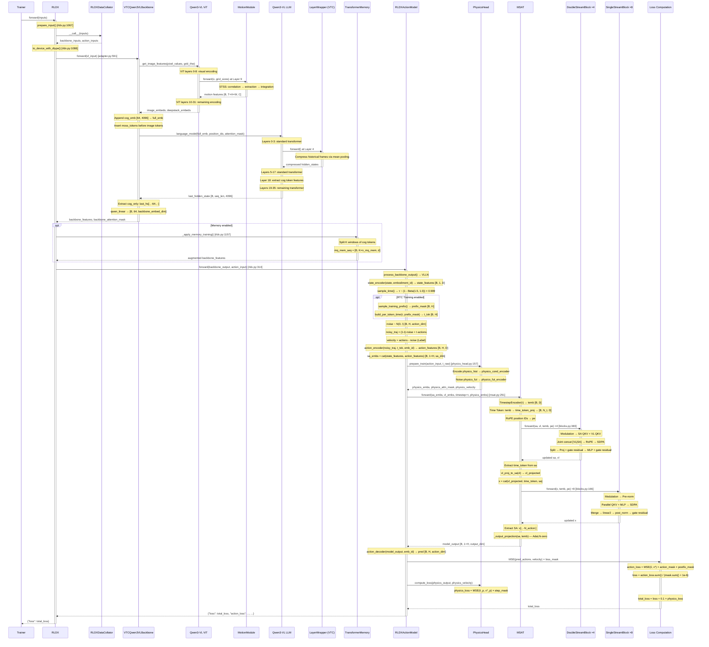
```mermaid
sequenceDiagram
    participant Trainer
    participant RLDX
    participant Collator as RLDXDataCollator
    participant Backbone as VTCQwen3VLBackbone
    participant ViT as Qwen3-VL ViT
    participant Motion as MotionModule
    participant LLM as Qwen3-VL LLM
    participant VTC as LayerWrapper (VTC)
    participant Memory as TransformerMemory
    participant AM as RLDXActionModel
    participant PhysHead as PhysicsHead
    participant MSAT
    participant DSB as DoubleStreamBlock ×4
    participant SSB as SingleStreamBlock ×8
    participant Loss as Loss Computation

    Trainer->>RLDX: forward(inputs)
    activate RLDX

    Note over RLDX: prepare_input() [rldx.py:1067]

    RLDX->>Collator: __call__(inputs)
    Collator-->>RLDX: backbone_inputs, action_inputs

    Note over RLDX: to_device_with_dtype() [rldx.py:1088]

    RLDX->>Backbone: forward(vl_input) [adapter.py:591]
    activate Backbone

    Backbone->>ViT: get_image_features(pixel_values, grid_thw)
    activate ViT
    Note over ViT: ViT layers 0-8: visual encoding
    ViT->>Motion: forward(x, grid_sizes) at Layer 9
    activate Motion
    Note over Motion: STSS: correlation → extraction → integration
    Motion-->>ViT: motion features [B, T×H×W, C]
    deactivate Motion
    Note over ViT: ViT layers 10-31: remaining encoding
    ViT-->>Backbone: image_embeds, deepstack_embeds
    deactivate ViT

    Note over Backbone: Append cog_emb [64, 4096] → full_emb
    Note over Backbone: Insert moss_tokens before image tokens

    Backbone->>LLM: language_model(full_emb, position_ids, attention_mask)
    activate LLM
    Note over LLM: Layers 0-3: standard transformer
    LLM->>VTC: forward() at Layer 4
    activate VTC
    Note over VTC: Compress historical frames via mean pooling
    VTC-->>LLM: compressed hidden_states
    deactivate VTC
    Note over LLM: Layers 5-17: standard transformer
    Note over LLM: Layer 18: extract cog token features
    Note over LLM: Layers 19-35: remaining transformer
    LLM-->>Backbone: last_hidden_state [B, seq_len, 4096]
    deactivate LLM

    Note over Backbone: Extract cog_only: last_hs[:, -64:, :]
    Note over Backbone: qwen_linear → [B, 64, backbone_embed_dim]

    Backbone-->>RLDX: backbone_features, backbone_attention_mask
    deactivate Backbone

    opt Memory enabled
        RLDX->>Memory: _apply_memory_training() [rldx.py:1157]
        activate Memory
        Note over Memory: Split K windows of cog tokens
        Note over Memory: mq_mem_seq = [B, K×n_mq_mem, d]
        Memory-->>RLDX: augmented backbone_features
        deactivate Memory
    end

    RLDX->>AM: forward(backbone_output, action_input) [rldx.py:314]
    activate AM

    Note over AM: process_backbone_output() → VLLN
    Note over AM: state_encoder(state, embodiment_id) → state_features [B, 1, D]

    Note over AM: sample_time() → τ ~ (1 - Beta(1.5, 1.0)) × 0.999

    opt RTC Training enabled
        Note over AM: sample_training_prefix() → prefix_mask [B, H]
        Note over AM: build_per_token_time(τ, prefix_mask) → t_tok [B, H]
    end

    Note over AM: noise ~ N(0, I) [B, H, action_dim]
    Note over AM: noisy_traj = (1-t)·noise + t·actions
    Note over AM: velocity = actions - noise (Label)

    Note over AM: action_encoder(noisy_traj, t_tok, emb_id) → action_features [B, H, D]
    Note over AM: sa_embs = cat(state_features, action_features) [B, 1+H, sa_dim]

    AM->>PhysHead: prepare_train(action_input, t_raw) [physics_head.py:157]
    activate PhysHead
    Note over PhysHead: Encode physics_hist → physics_cond_encoder
    Note over PhysHead: Noise physics_fut → physics_fut_encoder
    PhysHead-->>AM: physics_embs, physics_attn_mask, physics_velocity
    deactivate PhysHead

    AM->>MSAT: forward(sa_embs, vl_embs, timestep=τ, physics_embs) [msat.py:291]
    activate MSAT

    Note over MSAT: TimestepEncoder(τ) → temb [B, D]
    Note over MSAT: Time Token: temb → time_token_proj → [B, N_t, D]
    Note over MSAT: RoPE position IDs → pe

    MSAT->>DSB: forward(sa, vl, temb, pe) ×4 [blocks.py:383]
    activate DSB
    Note over DSB: Modulation → SA QKV + VL QKV
    Note over DSB: Joint concat [VL|SA] → RoPE → SDPA
    Note over DSB: Split → Proj + gate residual → MLP + gate residual
    DSB-->>MSAT: updated sa, vl
    deactivate DSB

    Note over MSAT: Extract time_token from sa
    Note over MSAT: vl_proj_to_sa(vl) → vl_projected
    Note over MSAT: x = cat(vl_projected, time_token, sa)

    MSAT->>SSB: forward(x, temb, pe) ×8 [blocks.py:166]
    activate SSB
    Note over SSB: Modulation → Pre-norm
    Note over SSB: Parallel QKV + MLP → SDPA
    Note over SSB: Merge → linear2 → post_norm → gate residual
    SSB-->>MSAT: updated x
    deactivate SSB

    Note over MSAT: Extract SA: x[:, -N_action:]
    Note over MSAT: _output_projection(sa, temb) — AdaLN-zero

    MSAT-->>AM: model_output [B, 1+H, output_dim]
    deactivate MSAT

    Note over AM: action_decoder(model_output, emb_id) → pred [B, H, action_dim]

    AM->>Loss: MSE(pred_actions, velocity) × loss_mask
    activate Loss
    Note over Loss: action_loss = MSE(v̂, v*) × action_mask × postfix_mask
    Note over Loss: loss = action_loss.sum() / (mask.sum() + 1e-6)

    AM->>PhysHead: compute_loss(physics_output, physics_velocity)
    Note over PhysHead: physics_loss = MSE(v̂_p, v*_p) × step_mask
    Note over Loss: total_loss = loss + 0.1 × physics_loss
    Loss-->>AM: total_loss
    deactivate Loss

    AM-->>RLDX: {"loss": total_loss, "action_loss": ..., ...}
    deactivate AM

    RLDX-->>Trainer: {"loss": total_loss}
    deactivate RLDX
```

---

### 12.2 训练 Forward 数据流图

以下数据流图展示 tensor 从原始输入经各组件变换到最终 loss 的完整流向, 每个节点标注 tensor shape:

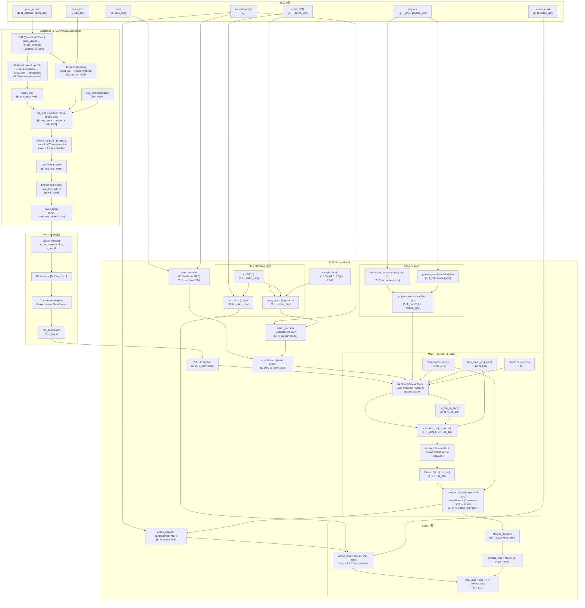
```mermaid
graph TB
    subgraph Input["输入处理"]
        IMG["pixel_values<br/>[B, N_patches, patch_dim]"]
        IDS["input_ids<br/>[B, seq_len]"]
        STATE["state<br/>[B, state_dim]"]
        ACTION["action (GT)<br/>[B, H, action_dim]"]
        PHYSICS_IN["physics<br/>[B, T_phys, physics_dim]"]
        EMB_ID["embodiment_id<br/>[B]"]
        AMASK["action_mask<br/>[B, H, action_dim]"]
    end

    subgraph Backbone["Backbone (VTCQwen3VLBackbone)"]
        direction TB
        VIT["ViT (Qwen3-VL Visual)<br/>pixel_values → image_embeds<br/>[N_patches, vit_dim]"]
        MOSS["MotionModule (Layer 9)<br/>STSS correlation → extraction → integration<br/>[B, T×H×W, motion_dim]"]
        MOSS_PROJ["moss_proj<br/>[B, n_motion, 4096]"]
        EMB["Token Embedding<br/>input_ids → inputs_embeds<br/>[B, seq_len, 4096]"]
        COG["cog_emb (learnable)<br/>[64, 4096]"]
        FULL["full_emb = cat(text, moss, image, cog)<br/>[B, seq_len + n_motion + 64, 4096]"]
        LLM_FWD["Qwen3-VL LLM (36 layers)<br/>Layer 4: VTC compression<br/>Layer 18: cog extraction"]
        LAST_HS["last_hidden_state<br/>[B, seq_len', 4096]"]
        COG_EXTRACT["Extract cog tokens<br/>last_hs[:, -64:, :]<br/>[B, 64, 4096]"]
        QWEN_LIN["qwen_linear<br/>[B, 64, backbone_embed_dim]"]
    end

    subgraph MemoryBlock["Memory (可选)"]
        MEM_SPLIT["Split K windows<br/>mq_for_memory [B, K, n_mq, d]"]
        MEM_SEQ["Reshape → [B, K×n_mq, d]"]
        TF_MEM["TransformerMemory<br/>6-layer causal Transformer"]
        MEM_OUT["mq_augmented<br/>[B, n_mq, d]"]
    end

    subgraph ActionModel["RLDXActionModel"]
        direction TB
        VLLN["VLLN Projection<br/>[B, 64, vl_dim=4096]"]
        STATE_ENC["state_encoder (Embodiment MLP)<br/>[B, 1, sa_dim=1536]"]
        TIME_SAMPLE["sample_time()<br/>τ ~ (1 - Beta(1.5, 1.0)) × 0.999"]

        subgraph FlowMatch["Flow Matching 构造"]
            NOISE["ε ~ N(0, I)<br/>[B, H, action_dim]"]
            NOISY["noisy_traj = (1-τ)·ε + τ·a<br/>[B, H, action_dim]"]
            VELOCITY["v* = a - ε (Label)<br/>[B, H, action_dim]"]
        end

        ACT_ENC["action_encoder (Embodiment MLP)<br/>[B, H, sa_dim=1536]"]
        SA_CAT["sa_embs = cat(state, action)<br/>[B, 1+H, sa_dim=1536]"]

        subgraph PhysicsEnc["Physics 编码"]
            PHYS_HIST["physics_cond_encoder(hist)<br/>[B, T_hist, embed_dim]"]
            PHYS_FUT["physics_fut_encoder(noisy_fut, τ)<br/>[B, T_fut, embed_dim]"]
            PHYS_EMB["physics_embs = cat(hist, fut)<br/>[B, T_hist+T_fut, embed_dim]"]
        end

        subgraph MSATBlock["MSAT (4 DSB + 8 SSB)"]
            TEMB["TimestepEncoder(τ)<br/>→ temb [B, D]"]
            TTOK["time_token_proj(temb)<br/>→ [B, N_t, D]"]
            ROPE["RoPE position IDs<br/>→ pe"]

            DSB_BLOCK["4× DoubleStreamBlock<br/>Joint Attention [VL|τ|SA]<br/>→ updated sa, vl"]
            VL_PROJ["vl_proj_to_sa(vl)<br/>[B, N_vl, sa_dim]"]
            CONCAT["x = cat(vl_proj, τ_tok, sa)<br/>[B, N_vl+N_t+1+H, sa_dim]"]
            SSB_BLOCK["8× SingleStreamBlock<br/>Fused Self-Attention<br/>→ updated x"]
            EXTRACT_SA["Extract SA: x[:, -N_sa:]<br/>[B, 1+H, sa_dim]"]
            OUT_PROJ["_output_projection (AdaLN-zero)<br/>LayerNorm × (1+scale) + shift → Linear<br/>[B, 1+H, output_dim=1024]"]
        end

        ACT_DEC["action_decoder (Embodiment MLP)<br/>[B, H, action_dim]"]

        subgraph LossComp["Loss 计算"]
            ACTION_LOSS["action_loss = MSE(v̂, v*) × mask<br/>loss = Σ / (Σmask + 1e-6)"]
            PHYS_DEC["physics_decoder<br/>[B, T_fut, physics_dim]"]
            PHYS_LOSS["physics_loss = MSE(v̂_p, v*_p) × mask"]
            TOTAL["total_loss = loss + λ × physics_loss<br/>(λ = 0.1)"]
        end
    end

    %% Connections
    IMG --> VIT
    VIT --> MOSS
    MOSS --> MOSS_PROJ
    VIT --> EMB
    IDS --> EMB
    MOSS_PROJ --> FULL
    EMB --> FULL
    COG --> FULL
    FULL --> LLM_FWD
    LLM_FWD --> LAST_HS
    LAST_HS --> COG_EXTRACT
    COG_EXTRACT --> QWEN_LIN

    QWEN_LIN --> MEM_SPLIT
    MEM_SPLIT --> MEM_SEQ
    MEM_SEQ --> TF_MEM
    TF_MEM --> MEM_OUT

    MEM_OUT --> VLLN
    VLLN --> DSB_BLOCK
    STATE --> STATE_ENC
    STATE_ENC --> SA_CAT
    EMB_ID --> STATE_ENC
    EMB_ID --> ACT_ENC
    EMB_ID --> ACT_DEC

    ACTION --> NOISY
    ACTION --> VELOCITY
    NOISE --> NOISY
    NOISE --> VELOCITY
    TIME_SAMPLE --> NOISY
    NOISY --> ACT_ENC
    ACT_ENC --> SA_CAT

    PHYSICS_IN --> PHYS_HIST
    PHYSICS_IN --> PHYS_FUT
    PHYS_FUT --> PHYS_EMB
    PHYS_HIST --> PHYS_EMB

    SA_CAT --> DSB_BLOCK
    PHYS_EMB --> DSB_BLOCK
    TEMB --> DSB_BLOCK
    TTOK --> DSB_BLOCK
    ROPE --> DSB_BLOCK
    DSB_BLOCK --> VL_PROJ
    DSB_BLOCK --> CONCAT
    VL_PROJ --> CONCAT
    TTOK --> CONCAT
    CONCAT --> SSB_BLOCK
    SSB_BLOCK --> EXTRACT_SA
    EXTRACT_SA --> OUT_PROJ
    TEMB --> OUT_PROJ
    OUT_PROJ --> ACT_DEC

    ACT_DEC --> ACTION_LOSS
    VELOCITY --> ACTION_LOSS
    AMASK --> ACTION_LOSS

    OUT_PROJ --> PHYS_DEC
    PHYS_DEC --> PHYS_LOSS
    ACTION_LOSS --> TOTAL
    PHYS_LOSS --> TOTAL
```

**数据流关键节点说明**:

| 阶段 | 输入 → 输出 | Shape 变化 |
|------|-------------|-----------|
| ViT | `pixel_values` → `image_embeds` | `[B, N_patches, patch_dim]` → `[N_img_tokens, vit_dim]` |
| Motion (Layer 9) | ViT intermediate features → STSS | `[B×T×H×W, C]` → `[B, n_motion, 4096]` |
| LLM (36 layers) | `full_emb` → `last_hidden_state` | `[B, seq_len', 4096]` → `[B, seq_len', 4096]` |
| VTC (Layer 4) | historical frame tokens → compressed | token count 减少 (mean pooling) |
| Cog extraction | `last_hidden_state` → cog features | `[B, seq_len', 4096]` → `[B, 64, 4096]` |
| `qwen_linear` | cog features → backbone output | `[B, 64, 4096]` → `[B, 64, backbone_embed_dim]` |
| Memory | K windows of cog tokens → augmented | `[B, K×n_mq, d]` → `[B, n_mq, d]` |
| VLLN | backbone features → VL embeddings | `[B, 64, backbone_embed_dim]` → `[B, 64, vl_dim=4096]` |
| `state_encoder` | state → state features | `[B, state_dim]` → `[B, 1, sa_dim=1536]` |
| `action_encoder` | noisy trajectory → action features | `[B, H, action_dim]` → `[B, H, sa_dim=1536]` |
| MSAT DSB ×4 | (sa, vl) → joint attention | 维度不变, 信息交互 |
| MSAT SSB ×8 | fused tokens → self-attention | 维度不变, 深层融合 |
| `_output_projection` | sa → AdaLN-zero output | `[B, 1+H, sa_dim]` → `[B, 1+H, output_dim=1024]` |
| `action_decoder` | model output → predicted velocity | `[B, H, output_dim]` → `[B, H, action_dim]` |
| Loss | $\hat{v}$ vs $v^*$ | scalar |

---

### 12.3 DoubleStreamBlock 内部序列图

DoubleStreamBlock 是 MSAT 的核心组件, 实现 VL 和 SA 两个 stream 的 joint attention. 以下展示单个 block 内部的操作序列:

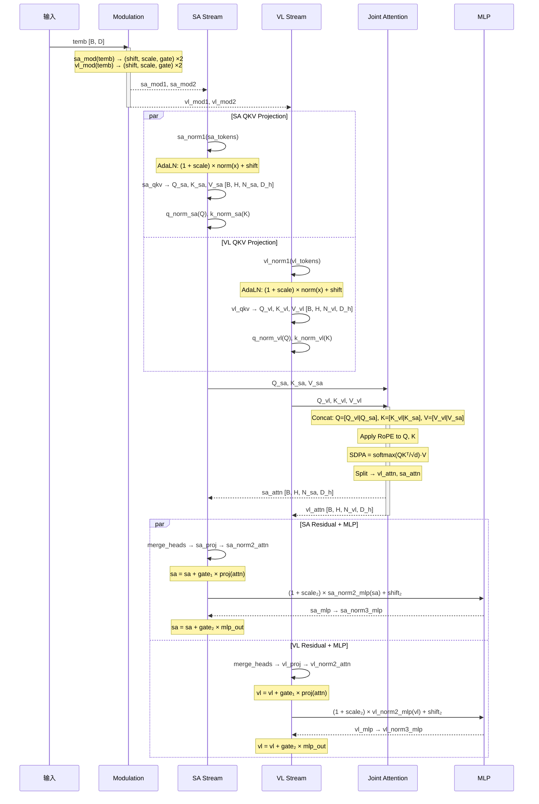
```mermaid
sequenceDiagram
    participant Input as 输入
    participant Mod as Modulation
    participant SA_Stream as SA Stream
    participant VL_Stream as VL Stream
    participant Joint as Joint Attention
    participant MLP_Block as MLP

    Input->>Mod: temb [B, D]
    activate Mod
    Note over Mod: sa_mod(temb) → (shift, scale, gate) ×2<br/>vl_mod(temb) → (shift, scale, gate) ×2
    Mod-->>SA_Stream: sa_mod1, sa_mod2
    Mod-->>VL_Stream: vl_mod1, vl_mod2
    deactivate Mod

    par SA QKV Projection
        SA_Stream->>SA_Stream: sa_norm1(sa_tokens)
        Note over SA_Stream: AdaLN: (1 + scale) × norm(x) + shift
        SA_Stream->>SA_Stream: sa_qkv → Q_sa, K_sa, V_sa [B, H, N_sa, D_h]
        SA_Stream->>SA_Stream: q_norm_sa(Q), k_norm_sa(K)
    and VL QKV Projection
        VL_Stream->>VL_Stream: vl_norm1(vl_tokens)
        Note over VL_Stream: AdaLN: (1 + scale) × norm(x) + shift
        VL_Stream->>VL_Stream: vl_qkv → Q_vl, K_vl, V_vl [B, H, N_vl, D_h]
        VL_Stream->>VL_Stream: q_norm_vl(Q), k_norm_vl(K)
    end

    SA_Stream->>Joint: Q_sa, K_sa, V_sa
    VL_Stream->>Joint: Q_vl, K_vl, V_vl

    activate Joint
    Note over Joint: Concat: Q=[Q_vl|Q_sa], K=[K_vl|K_sa], V=[V_vl|V_sa]
    Note over Joint: Apply RoPE to Q, K
    Note over Joint: SDPA = softmax(QKᵀ/√d)·V
    Note over Joint: Split → vl_attn, sa_attn
    Joint-->>SA_Stream: sa_attn [B, H, N_sa, D_h]
    Joint-->>VL_Stream: vl_attn [B, H, N_vl, D_h]
    deactivate Joint

    par SA Residual + MLP
        SA_Stream->>SA_Stream: merge_heads → sa_proj → sa_norm2_attn
        Note over SA_Stream: sa = sa + gate₁ × proj(attn)
        SA_Stream->>MLP_Block: (1 + scale₂) × sa_norm2_mlp(sa) + shift₂
        MLP_Block-->>SA_Stream: sa_mlp → sa_norm3_mlp
        Note over SA_Stream: sa = sa + gate₂ × mlp_out
    and VL Residual + MLP
        VL_Stream->>VL_Stream: merge_heads → vl_proj → vl_norm2_attn
        Note over VL_Stream: vl = vl + gate₁ × proj(attn)
        VL_Stream->>MLP_Block: (1 + scale₂) × vl_norm2_mlp(vl) + shift₂
        MLP_Block-->>VL_Stream: vl_mlp → vl_norm3_mlp
        Note over VL_Stream: vl = vl + gate₂ × mlp_out
    end
```

**DoubleStreamBlock 核心公式**:

**Modulation (AdaLN)**:

$$h_{\text{mod}} = (1 + \gamma) \cdot \text{LayerNorm}(x) + \beta$$

其中 $(\gamma, \beta, \alpha) = \text{Mod}(\text{temb})$, 分别对应 scale, shift, gate.

**Joint Attention**:

$$Q = [Q_{\text{VL}} \| Q_{\text{SA}}], \quad K = [K_{\text{VL}} \| K_{\text{SA}}], \quad V = [V_{\text{VL}} \| V_{\text{SA}}]$$

$$\text{Attn} = \text{softmax}\left(\frac{Q K^\top}{\sqrt{d_h}}\right) V$$

$$\text{attn}_{\text{VL}} = \text{Attn}[:, :N_{\text{VL}}], \quad \text{attn}_{\text{SA}} = \text{Attn}[:, N_{\text{VL}}:]$$

**Gated Residual**:

$$x \leftarrow x + \alpha_1 \cdot \text{Proj}(\text{Attn}(x))$$
$$x \leftarrow x + \alpha_2 \cdot \text{MLP}(\text{AdaLN}_2(x))$$

**SingleStreamBlock** 的结构与 DoubleStreamBlock 不同, 它将 VL 和 SA tokens 拼接后做统一的 self-attention:

$$x_{\text{mod}} = (1 + \gamma) \cdot \text{PreNorm}(x) + \beta$$

$$[\text{QKV}, \text{mlp\_in}] = \text{Linear}_1(x_{\text{mod}})$$

$$\text{out} = \text{PostNorm}(\text{Linear}_2([\text{SDPA}(Q,K,V) \| \text{SwiGLU}(\text{mlp\_in})]))$$

$$x \leftarrow x + \alpha \cdot \text{out}$$

---

### 12.4 推理 Forward 序列图

推理时, Backbone 和 Memory 只运行一次, 但 MSAT 通过 Euler 去噪循环执行多次 (默认 4 步). 入口从 `RLDXPolicy` 开始:

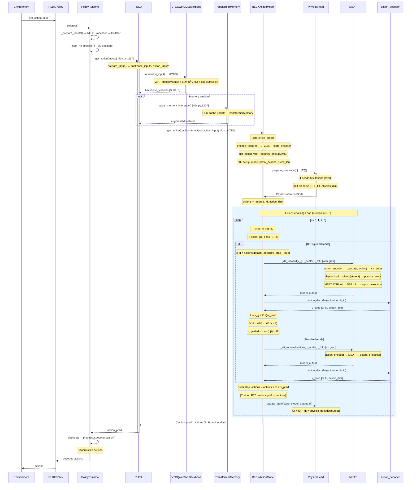
```mermaid
sequenceDiagram
    participant Env as Environment
    participant Policy as RLDXPolicy
    participant Runtime as PolicyRuntime
    participant RLDX
    participant Backbone as VTCQwen3VLBackbone
    participant Memory as TransformerMemory
    participant AM as RLDXActionModel
    participant PhysHead as PhysicsHead
    participant MSAT
    participant Decoder as action_decoder

    Env->>Policy: get_action(obs)
    Policy->>Runtime: step(obs)
    activate Runtime

    Runtime->>Runtime: _prepare_inputs() → RLDXProcessor → Collator
    Runtime->>Runtime: _inject_rtc_prefix() (if RTC enabled)

    Runtime->>RLDX: get_action(inputs) [rldx.py:1117]
    activate RLDX

    Note over RLDX: prepare_input() → backbone_inputs, action_inputs

    RLDX->>Backbone: forward(vl_input) [一次性执行]
    activate Backbone
    Note over Backbone: ViT + MotionModule + LLM (含VTC) + cog extraction
    Backbone-->>RLDX: backbone_features [B, 64, d]
    deactivate Backbone

    opt Memory enabled
        RLDX->>Memory: _apply_memory_inference() [rldx.py:1207]
        activate Memory
        Note over Memory: FIFO cache update + TransformerMemory
        Memory-->>RLDX: augmented features
        deactivate Memory
    end

    RLDX->>AM: get_action(backbone_output, action_input) [rldx.py:738]
    activate AM

    Note over AM: @torch.no_grad()
    Note over AM: _encode_features() → VLLN + state_encoder
    Note over AM: get_action_with_features() [rldx.py:490]

    Note over AM: RTC setup: mode, prefix_actions, prefix_len

    AM->>PhysHead: prepare_inference() [一次性]
    activate PhysHead
    Note over PhysHead: Encode hist tokens (fixed)
    Note over PhysHead: Init fut noise [B, T_fut, physics_dim]
    PhysHead-->>AM: PhysicsInferenceState
    deactivate PhysHead

    Note over AM: actions = randn(B, H, action_dim)

    rect rgb(230, 245, 255)
        Note over AM, MSAT: Euler Denoising Loop (4 steps, i=0..3)

        loop i = 0, 1, 2, 3
            Note over AM: t = i/4, dt = 0.25
            Note over AM: t_scalar [B], t_tok [B, H]

            alt RTC guided mode
                Note over AM: x_g = actions.detach().requires_grad_(True)
                AM->>MSAT: _dit_forward(x_g, t_scalar, t_tok) [with grad]
                activate MSAT
                Note over MSAT: action_encoder → cat(state, action) → sa_embs
                Note over MSAT: physics.build_tokens(state, t) → physics_embs
                Note over MSAT: MSAT: DSB ×4 → SSB ×8 → output_projection
                MSAT-->>AM: model_output
                deactivate MSAT
                AM->>Decoder: action_decoder(output, emb_id)
                Decoder-->>AM: v_pred [B, H, action_dim]
                Note over AM: â = x_g + (1-t)·v_pred
                Note over AM: VJP = ∂â/∂x · W·(Y - â)
                Note over AM: v_guided = v + c(t,β)·VJP
            else Standard mode
                AM->>MSAT: _dit_forward(actions, t_scalar, t_tok) [no grad]
                activate MSAT
                Note over MSAT: action_encoder → MSAT → output_projection
                MSAT-->>AM: model_output
                deactivate MSAT
                AM->>Decoder: action_decoder(output, emb_id)
                Decoder-->>AM: v_pred [B, H, action_dim]
            end

            Note over AM: Euler step: actions = actions + dt × v_pred
            Note over AM: [Trained RTC: re-lock prefix positions]
            AM->>PhysHead: update_state(state, model_output, dt)
            Note over PhysHead: fut = fut + dt × physics_decoder(output)
        end
    end

    AM-->>RLDX: {"action_pred": actions [B, H, action_dim]}
    deactivate AM

    RLDX-->>Runtime: action_pred
    deactivate RLDX

    Runtime->>Runtime: _decode() → processor.decode_action()
    Note over Runtime: Denormalize actions

    Runtime-->>Policy: decoded actions
    deactivate Runtime
    Policy-->>Env: actions
```

---

### 12.5 推理 Forward 数据流图

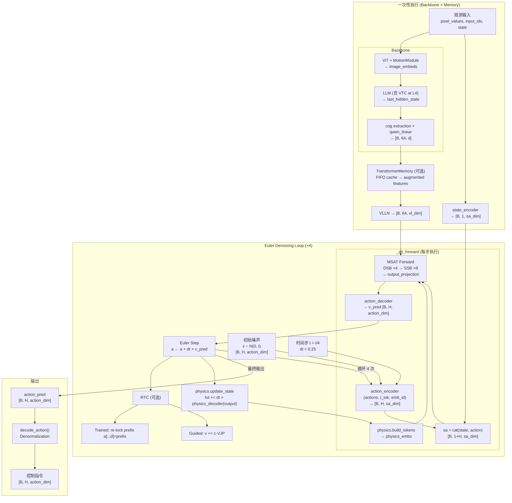
```mermaid
graph TB
    subgraph OneShot["一次性执行 (Backbone + Memory)"]
        OBS["观测输入<br/>pixel_values, input_ids, state"]

        subgraph BackboneInf["Backbone"]
            VIT_I["ViT + MotionModule<br/>→ image_embeds"]
            LLM_I["LLM (含 VTC at L4)<br/>→ last_hidden_state"]
            COG_I["cog extraction + qwen_linear<br/>→ [B, 64, d]"]
        end

        MEM_I["TransformerMemory (可选)<br/>FIFO cache → augmented features"]
        VLLN_I["VLLN → [B, 64, vl_dim]"]
        STATE_I["state_encoder<br/>→ [B, 1, sa_dim]"]
    end

    subgraph EulerLoop["Euler Denoising Loop (×4)"]
        NOISE_I["初始噪声<br/>ε ~ N(0, I)<br/>[B, H, action_dim]"]
        T_STEP["时间步 t = i/4<br/>dt = 0.25"]

        subgraph DIT["_dit_forward (每步执行)"]
            ACT_ENC_I["action_encoder<br/>(actions, t_tok, emb_id)<br/>→ [B, H, sa_dim]"]
            SA_I["sa = cat(state, action)<br/>[B, 1+H, sa_dim]"]
            PHYS_TOK["physics.build_tokens<br/>→ physics_embs"]
            MSAT_I["MSAT Forward<br/>DSB ×4 → SSB ×8<br/>→ output_projection"]
            DEC_I["action_decoder<br/>→ v_pred [B, H, action_dim]"]
        end

        EULER["Euler Step<br/>a ← a + dt × v_pred"]

        opt_rtc["RTC (可选)"]
        opt_rtc_trained["Trained: re-lock prefix a[:,:d]=prefix"]
        opt_rtc_guided["Guided: v += c·VJP"]

        PHYS_UPDATE["physics.update_state<br/>fut += dt × physics_decoder(output)"]
    end

    subgraph Output["输出"]
        ACTION_OUT["action_pred<br/>[B, H, action_dim]"]
        DENORM["decode_action()<br/>Denormalization"]
        FINAL["控制指令<br/>[B, H, action_dim]"]
    end

    OBS --> VIT_I --> LLM_I --> COG_I --> MEM_I --> VLLN_I
    OBS --> STATE_I

    NOISE_I --> ACT_ENC_I
    T_STEP --> ACT_ENC_I
    VLLN_I --> MSAT_I
    STATE_I --> SA_I
    ACT_ENC_I --> SA_I
    SA_I --> MSAT_I
    PHYS_TOK --> MSAT_I
    MSAT_I --> DEC_I
    DEC_I --> EULER
    EULER --> opt_rtc
    opt_rtc --> opt_rtc_trained
    opt_rtc --> opt_rtc_guided
    EULER --> PHYS_UPDATE
    PHYS_UPDATE --> PHYS_TOK

    EULER -->|"循环 4 次"| ACT_ENC_I
    EULER -->|"最终输出"| ACTION_OUT
    ACTION_OUT --> DENORM --> FINAL
```

**推理 Forward 关键特征**:

1. **Backbone 单次执行**: ViT + LLM + VTC + cog extraction 只运行一次, 其输出 (`vl_embeds`, `state_features`) 在 Euler 循环中复用
2. **MSAT 多次执行**: 默认 4 步 Euler 去噪, 每步执行完整的 MSAT forward (DSB ×4 + SSB ×8)
3. **`@torch.no_grad()`**: `get_action()` 整体在 `torch.no_grad()` 上下文中 (RTC guided 模式除外, 需要梯度计算 VJP)
4. **Physics 状态演化**: `PhysicsInferenceState` 在循环中通过 Euler 更新 `fut` 场
5. **无 Loss 计算**: 推理不计算 loss, 直接输出 `action_pred`

---

### 12.6 训练与推理的关键差异表

| 维度 | 训练 | 推理 |
|------|------|------|
| **入口方法** | `RLDX.forward()` → `ActionModel.forward()` | `RLDX.get_action()` → `ActionModel.get_action()` |
| **梯度计算** | 全程启用 (除冻结模块) | `@torch.no_grad()` (RTC guided 除外) |
| **噪声构造** | $x_t = (1-\tau)\varepsilon + \tau a$, 需要 GT action | $a_0 = \varepsilon \sim \mathcal{N}(0, I)$, 纯噪声初始化 |
| **时间步 $\tau$** | $\tau \sim (1 - \text{Beta}(1.5, 1.0)) \times 0.999$, 随机采样 | $\tau = \{0, 0.25, 0.5, 0.75\}$, 均匀等间距 |
| **MSAT 执行次数** | 1 次 | 4 次 (Euler 循环) |
| **Backbone 执行** | 每个 batch 执行 1 次 | 每次 `get_action()` 执行 1 次 |
| **输出** | `{"loss": ..., "action_loss": ...}` | `{"action_pred": [B, H, action_dim]}` |
| **Loss Function** | $\mathcal{L} = \text{MSE}(\hat{v}, v^*) + \lambda \mathcal{L}_{\text{physics}}$ | 无 |
| **Label** | $v^* = a - \varepsilon$ (ground-truth velocity) | 无 |
| **RTC 处理** | `sample_training_prefix()` → per-token time $t_{\text{tok}}$ | Trained: hard-inpaint + $t=1$; Guided: VJP |
| **Physics 处理** | `prepare_train()` → flow matching interpolation + loss | `prepare_inference()` → Euler state update (无 loss) |
| **Dtype 管理** | `to_device_with_dtype()`, 混合精度 | 同训练, `dtype` 由模型参数决定 |
| **Memory** | `_apply_memory_training()`: K windows batch | `_apply_memory_inference()`: FIFO cache + single step |
| **State Dropout** | `state_dropout_prob > 0` 时随机 mask | 不 dropout |
| **State Noise** | `state_additive_noise_scale > 0` 时加噪 | 不加噪 |
| **Physics Dropout** | `physics_dropout_prob > 0` 时 hist dropout | 不 dropout |

---

### 12.7 核心代码的调用过程分析

#### 12.7.1 `RLDX.forward()` — 训练顶层入口

```python
# rldx/model/core/rldx.py:1107-1115
def forward(self, inputs: dict) -> BatchFeature:
    backbone_inputs, action_inputs = self.prepare_input(inputs)   # (1) 数据准备
    backbone_outputs = self.backbone(backbone_inputs)              # (2) Backbone forward

    if self.use_memory:
        backbone_outputs = self._apply_memory_training(backbone_outputs)  # (3) Memory

    action_outputs = self.action_model(backbone_outputs, action_inputs)   # (4) ActionModel
    return action_outputs  # 包含 "loss" key
```

**调用链说明**:

1. **`prepare_input()`** (`rldx.py:1067`): 调用 `RLDXDataCollator` 处理 `vlm_content`, 然后分别调用 `backbone.prepare_input()` 和 `action_model.prepare_input()`, 最后通过 `tree.map_structure(to_device_with_dtype)` 将所有 tensor 移到正确的 device 和 dtype.

2. **`self.backbone()`** (`adapter.py:591`): `VTCQwen3VLBackbone.forward()` 依次执行 ViT 视觉编码 (含 Layer 9 的 MotionModule)、组装 token 序列 (text + moss + image + cog)、LLM forward (含 Layer 4 的 VTC 压缩)、提取 cog tokens、线性投影.

3. **`_apply_memory_training()`** (`rldx.py:1157`): 将 K 个时间窗口的 cog tokens 展平为序列, 送入 6 层 causal TransformerMemory, 取最后一个窗口的输出作为 augmented features.

4. **`self.action_model()`** (`rldx.py:314`): 完整的 flow-matching 训练: 编码 → 加噪 → MSAT → 解码 → loss 计算.

#### 12.7.2 `RLDXActionModel.forward()` — 编码 + MSAT + 解码 + Loss

```python
# rldx/model/core/rldx.py:314-458 (关键步骤)

# ─── 编码阶段 ───
backbone_output = self.process_backbone_output(backbone_output)  # VLLN 投影
vl_embeds = backbone_output.backbone_features                    # [B, 64, vl_dim]
state_features = self.state_encoder(action_input.state, embodiment_id)  # [B, 1, sa_dim]

# ─── Flow Matching 构造 ───
t_raw = self.sample_time(batch_size, device, dtype)  # τ ~ (1 - Beta(1.5, 1.0)) × 0.999
noise = torch.randn(actions.shape, ...)               # ε ~ N(0, I)
noisy_trajectory = (1 - t) * noise + t * actions      # x_t = (1-τ)ε + τa
velocity = actions - noise                             # v* = a - ε (Label)

# ─── 编码 noisy trajectory ───
action_features = self.action_encoder(noisy_trajectory, t_tok, embodiment_id)  # [B, H, sa_dim]
sa_embs = torch.cat((state_features, action_features), dim=1)  # [B, 1+H, sa_dim]

# ─── Physics 编码 ───
physics_embs, physics_attn_mask, physics_velocity = self.physics.prepare_train(action_input, t_raw)

# ─── MSAT Forward ───
model_output, _ = self.model(
    hidden_states=sa_embs, encoder_hidden_states=vl_embeds,
    timestep=t_raw, physics_embs=physics_embs, ...
)

# ─── 解码 + Loss ───
pred = self.action_decoder(action_model_output, embodiment_id)  # [B, H, action_dim]
action_loss = F.mse_loss(pred_actions, velocity, reduction="none") * loss_mask
loss = action_loss.sum() / (loss_mask.sum() + 1e-6)

# Physics loss (可选)
physics_loss = self.physics.compute_loss(physics_model_output, physics_velocity, ...)
if physics_loss is not None:
    loss = loss + self.physics.physics_loss_weight * physics_loss  # λ = 0.1
```

**Label 与 Loss Function**:

- **Label**: $v^* = a_{\text{GT}} - \varepsilon$, 即 ground-truth action 与采样噪声的差值 (flow matching velocity)
- **Loss**: $\mathcal{L}_{\text{action}} = \frac{\sum \text{MSE}(\hat{v}, v^*) \cdot m}{\sum m + 10^{-6}}$, 其中 $m$ 是 `action_mask × postfix_mask`
- **Physics Loss**: $\mathcal{L}_{\text{physics}} = \frac{\sum \text{MSE}(\hat{v}_p, v_p^*) \cdot m_p}{\sum m_p + 10^{-6}}$
- **Total**: $\mathcal{L} = \mathcal{L}_{\text{action}} + \lambda \cdot \mathcal{L}_{\text{physics}}$, 默认 $\lambda = 0.1$

#### 12.7.3 `MSAT._forward_inner()` — TimestepEncoder → DSB → SSB → Output

```python
# rldx/model/modules/action_model/msat.py:291-556 (关键步骤)

def _forward_inner(self, sa_embs, vl_embs, timesteps, ..., physics_embs=None):
    # (1) Timestep encoding
    temb = self.timestep_encoder(timesteps)  # [B, D]

    # (2) Time Token 构造
    t_emb = self.time_token_proj(temb).unsqueeze(1)       # [B, 1, D]
    time_token = t_emb.repeat(1, self.num_temb_tokens, 1)  # [B, N_t, D]

    # (3) Physics 分支 (如果启用)
    if self.use_physics and physics_embs is not None:
        return self._forward_physics(sa, vl, physics_embs, temb, ...)

    # (4) Prepend time_token: sa = [time_token | S | A]
    sa = torch.cat([time_token, sa], dim=1)

    # (5) RoPE position IDs
    pe = self.rope_embedder(ids)

    # (6) DoubleStreamBlock ×4
    for blk in self.double_blocks:
        sa, vl = blk(sa, vl, temb, pe=pe, ...)

    # (7) Separate time_token + VL projection
    time_token = sa[:, :self.num_temb_tokens, :]
    sa = sa[:, self.num_temb_tokens:, :]
    vl_projected = self.vl_proj_to_sa(vl)

    # (8) Concat for single stream: x = [vl_projected | time_token | sa]
    x = torch.cat([vl_projected, time_token, sa], dim=1)

    # (9) SingleStreamBlock ×8
    for blk in self.single_blocks:
        x = blk(x, temb, pe=pe_single, ...)

    # (10) Extract SA + output projection (AdaLN-zero)
    sa = x[:, -N_action_pure:, :]
    out = self._output_projection(sa, temb)
    return out
```

**`_output_projection` (AdaLN-zero)**:

```python
# msat.py:777-781
def _output_projection(self, sa, temb):
    shift, scale = self.proj_out_1(F.silu(temb)).chunk(2, dim=1)
    sa = self.norm_out(sa) * (1 + scale[:, None]) + shift[:, None]
    return self.proj_out_2(sa)
```

$$\text{output} = W_2 \cdot [\text{LayerNorm}(x) \cdot (1 + \gamma) + \beta]$$

其中 $(\gamma, \beta) = \text{chunk}(W_1(\text{SiLU}(\text{temb})), 2)$.

#### 12.7.4 `get_action_with_features()` — 推理 Euler 循环

```python
# rldx/model/core/rldx.py:490-735 (关键步骤)

def get_action_with_features(self, backbone_features, state_features, embodiment_id, ...):
    # (1) 初始化纯噪声
    actions = torch.randn(size=(batch_size, horizon, self.action_dim), ...)

    # (2) Physics 初始化
    phys_state = self.physics.prepare_inference(action_input, ...)

    # (3) 时间步序列: [0, 0.25, 0.5, 0.75, 1.0]
    timesteps_list = [t / float(n) for t in range(n)] + [1.0]

    # (4) Euler denoising loop
    for i in range(len(timesteps_list) - 1):
        t_cont = float(timesteps_list[i])   # t = 0, 0.25, 0.5, 0.75
        dt = float(timesteps_list[i+1] - timesteps_list[i])  # dt = 0.25

        # _dit_forward: action_encoder → MSAT → output
        mo = _dit_forward(actions, t_scalar, t_tok)
        pred_velocity = self.action_decoder(ao, embodiment_id)[:, -horizon:]

        # Euler step
        actions = actions + dt * pred_velocity

        # Physics state update
        phys_state = self.physics.update_state(phys_state, model_output, dt)

    return {"action_pred": actions}
```

**Euler 去噪过程**:

$$a_{t+\Delta t} = a_t + \Delta t \cdot \hat{v}_\theta(a_t, t)$$

从 $a_0 = \varepsilon$ 出发, 经过 4 步 ($t = 0, 0.25, 0.5, 0.75$, 每步 $\Delta t = 0.25$), 得到最终 action 预测 $a_1$.

#### 12.7.5 Physics 流 — prepare_train + compute_loss + Euler update

**训练时** (`physics_head.py:157-207`):

```python
def prepare_train(self, action_input, t_raw):
    # (1) 分割 history 和 future
    physics_hist = action_input.physics[:, :self.physics_hist_len, :]   # [B, H, D]
    physics_fut_gt = action_input.physics[:, self.physics_hist_len:, :]  # [B, F, D]

    # (2) Flow matching 插值 (与 action 共享 τ)
    physics_noise = torch.randn_like(physics_fut_gt)
    noisy_physics_fut = (1 - t) * physics_noise + t * physics_fut_gt
    physics_velocity = physics_fut_gt - physics_noise  # v*_physics

    # (3) 编码
    physics_hist_tok = self.physics_cond_encoder(physics_hist)   # 条件 tokens
    physics_fut_tok = self.physics_fut_encoder(noisy_physics_fut, t_raw)  # 噪声 tokens
    physics_embs = torch.cat([physics_hist_tok, physics_fut_tok], dim=1)

    return physics_embs, physics_attn_mask, physics_velocity
```

**Loss 计算** (`physics_head.py:209-230`):

```python
def compute_loss(self, physics_model_output, physics_velocity, action_mask, physics_attn_mask):
    physics_hidden_fut = physics_model_output[:, -self.physics_fut_len:, :]
    physics_pred_vel = self.physics_decoder(physics_hidden_fut)  # [B, F, physics_dim]

    step_mask = action_mask.any(dim=-1).float()  # [B, T]
    loss_unreduced = F.mse_loss(physics_pred_vel, physics_velocity, reduction="none")
    physics_loss = (loss_unreduced * mask_3d).sum() / (n_valid + 1e-6)
    return physics_loss
```

**推理时** (`physics_head.py:232-284`):

```python
# 初始化: fut = randn(B, T_fut, physics_dim)
# 每个 Euler 步: fut = fut + dt × physics_decoder(model_output)
```

Physics 流与 Action 流共享相同的时间步 $\tau$ 和 Euler 步进策略, 但有独立的 encoder/decoder 和 loss.

#### 12.7.6 调用链总结表

| 调用深度 | 方法 | 文件:行号 | 输入 → 输出 |
|---------|------|-----------|------------|
| 0 | `Trainer.compute_loss()` | `trainer.py:306` | batch → loss |
| 1 | `RLDX.forward()` | `rldx.py:1107` | inputs → {"loss": ...} |
| 2 | `RLDX.prepare_input()` | `rldx.py:1067` | inputs → (backbone_inputs, action_inputs) |
| 2 | `VTCQwen3VLBackbone.forward()` | `adapter.py:591` | vl_input → backbone_features |
| 3 | `forward_qwen()` → `_forward_qwen_with_cog_tokens()` | `adapter.py:324` | qwen_input → (last_hs, attn_mask) |
| 4 | `get_image_features()` → ViT | `adapter.py:362` | pixel_values → image_embeds |
| 5 | `MotionModule.forward()` (Layer 9) | `motion.py:365` | x, grid_sizes → motion features |
| 4 | `language_model()` | `adapter.py:534` | full_emb → outputs |
| 5 | `LayerWrapper.forward()` (VTC, Layer 4) | `layer_wrapper.py:59` | hidden_states → compressed |
| 2 | `_apply_memory_training()` | `rldx.py:1157` | backbone_features → augmented |
| 3 | `TransformerMemory.forward()` | `memory.py:307` | mq_mem_seq → memory_output |
| 2 | `RLDXActionModel.forward()` | `rldx.py:314` | (backbone, action) → {"loss": ...} |
| 3 | `process_backbone_output()` → VLLN | `rldx.py:308` | features → vl_embeds |
| 3 | `state_encoder()` | `rldx.py:345` | state, emb_id → state_features |
| 3 | `sample_time()` | `rldx.py:303` | batch_size → τ [B] |
| 3 | `action_encoder()` | `rldx.py:387` | noisy_traj, t_tok, emb_id → action_features |
| 3 | `PhysicsHead.prepare_train()` | `physics_head.py:157` | action_input, τ → physics_embs |
| 3 | `MSAT._forward_inner()` | `msat.py:291` | (sa, vl, τ, physics) → model_output |
| 4 | `TimestepEncoder()` | `msat.py:308` | τ → temb |
| 4 | `DoubleStreamBlock.forward()` ×4 | `blocks.py:383` | (sa, vl) → (sa', vl') |
| 4 | `SingleStreamBlock.forward()` ×8 | `blocks.py:166` | x → x' |
| 4 | `_output_projection()` | `msat.py:777` | sa, temb → output |
| 3 | `action_decoder()` | `rldx.py:428` | output, emb_id → pred_actions |
| 3 | `PhysicsHead.compute_loss()` | `physics_head.py:209` | output, v*_p → physics_loss |

**推理调用链**:

| 调用深度 | 方法 | 文件:行号 | 输入 → 输出 |
|---------|------|-----------|------------|
| 0 | `RLDXPolicy._get_action()` | `rldx_policy.py:181` | obs → actions |
| 1 | `PolicyRuntime.step()` | `policy_runtime.py:107` | obs → decoded_actions |
| 2 | `RLDX.get_action()` | `rldx.py:1117` | inputs → {"action_pred": ...} |
| 3 | `VTCQwen3VLBackbone.forward()` | `adapter.py:591` | vl_input → backbone_features |
| 3 | `_apply_memory_inference()` | `rldx.py:1207` | features → augmented (FIFO) |
| 3 | `RLDXActionModel.get_action()` | `rldx.py:738` | (backbone, action) → action_pred |
| 4 | `_encode_features()` | `rldx.py:460` | (backbone, action) → (vl, state, emb_id) |
| 4 | `get_action_with_features()` | `rldx.py:490` | features → action_pred |
| 5 | `PhysicsHead.prepare_inference()` | `physics_head.py:232` | — → PhysicsInferenceState |
| 5 | `_dit_forward()` ×4 (Euler loop) | `rldx.py:623` | (actions, t) → model_output |
| 6 | `action_encoder()` | `rldx.py:625` | (x, t_tok, emb_id) → features |
| 6 | `MSAT._forward_inner()` | `msat.py:291` | (sa, vl, τ) → output |
| 6 | `action_decoder()` | `rldx.py:670/718` | output → v_pred |
| 5 | `PhysicsHead.update_state()` ×4 | `physics_head.py:278` | (state, output, dt) → state' |
| 2 | `PolicyRuntime._decode()` | `policy_runtime.py` | action_pred → denormalized |

---

## 13. Backward 计算的梯度流与参数更新分析

> 第11章分析了 RLDX-1 的静态网络架构, 本章聚焦于 **backward 计算的动态梯度流**: `loss.backward()` 调用后梯度在计算图中的反向传播路径、各组件参数的可训练/冻结状态、以及分布式训练中的梯度处理策略. 所有分析基于实际代码.

---

### 13.1 Backward 计算概述

RLDX-1 训练采用 HuggingFace Trainer + DeepSpeed 的标准流程. 模型 `RLDX.forward()` 返回包含 `"loss"` 的字典, Trainer 内部完成 backward 和优化器更新:

```
Training Step 完整流程:
  1. model.train()                     # HF Trainer 每步调用
  2. set_frozen_modules_to_eval_mode()  # 冻结模块切回 eval
  3. outputs = model(inputs)           # forward, 返回 {"loss": L}
  4. loss = outputs["loss"]
  5. loss.backward()                   # PyTorch autograd 反向传播
  6. gradient_clipping(max_norm=1.0)   # L2 范数裁剪
  7. optimizer.step()                  # AdamW 参数更新
  8. lr_scheduler.step()               # 学习率调整
```

**PyTorch autograd 反向传播机制**:

- 冻结参数 (`requires_grad=False`) **不累积** `.grad`，但如果它们位于可训练参数的梯度路径上，**中间梯度仍会穿越冻结层** 以到达上游可训练参数
- 例如: 冻结的 LLM 28 层虽不更新权重, 但梯度仍穿越它们到达可训练的 `cog_emb` 和 Motion Block
- `.detach()` 才会真正切断梯度流 — RLDX-1 训练路径中 **无 `.detach()` 调用**, 所有 detach 仅在推理 RTC guided mode 中使用

**总损失函数**:

$$\mathcal{L}_{\text{total}} = \mathcal{L}_{\text{action}} + \lambda_p \cdot \mathcal{L}_{\text{physics}}$$

其中 $\lambda_p = 0.1$ (默认 `physics_loss_weight`).

**链式法则通过完整模型**:

$$\frac{\partial \mathcal{L}}{\partial \theta} = \frac{\partial \mathcal{L}}{\partial \hat{u}} \cdot \frac{\partial \hat{u}}{\partial h_{\text{MSAT}}} \cdot \frac{\partial h_{\text{MSAT}}}{\partial h_{\text{input}}} \cdot \frac{\partial h_{\text{input}}}{\partial \theta}$$

其中 $\theta$ 是任意可训练参数, $\hat{u}$ 是预测 velocity. 对于不同位置的参数 $\theta$, 链式法则中间环节的长度不同:

- MSAT 块内部参数: 仅需穿过 output_projection → SingleStreamBlocks → DoubleStreamBlocks
- Backbone `cog_emb`: 需穿过整个 MSAT → VLLN → Memory → 冻结 LLM 28 层 → 输入 embedding 层

---

### 13.2 可训练参数与冻结参数全景分析

#### 13.2.1 默认配置下的参数状态总览

```mermaid
graph TB
    classDef trainable fill:#4CAF50,stroke:#333,color:white
    classDef frozen fill:#9E9E9E,stroke:#333,color:white
    classDef passthrough fill:#FFFFFF,stroke:#333,color:black
    classDef highlight fill:#FF9800,stroke:#333,color:white

    RLDX["RLDX<br/>(Top-level Model)"]

    subgraph Backbone["Backbone (VTCQwen3VLBackbone)"]
        VIT["ViT 视觉编码器<br/>~675M params<br/>tune_visual=False"]:::frozen
        MOTION["Motion Block (STSS)<br/>~15M params<br/>始终可训练"]:::trainable
        LLM["LLM (Qwen3-VL 28层)<br/>~7.6B params<br/>tune_llm=False"]:::frozen
        LM_HEAD["lm_head<br/>~33M params"]:::frozen
        COG["cog_emb<br/>64×4096 = 262K params<br/>freeze_cog_tokens=False"]:::trainable
        VTC["LayerWrapper (VTC)<br/>无自身参数"]:::passthrough
        ROPE_BB["RoPE 位置编码<br/>@torch.no_grad"]:::frozen
    end

    subgraph Memory_Module["Memory Module (可选)"]
        MEM["TransformerMemory<br/>~50M params<br/>始终可训练"]:::trainable
    end

    subgraph ActionModel["ActionModel (RLDXActionModel)"]
        VLLN["VLLN (LayerNorm)<br/>8K params<br/>tune_vlln=True"]:::trainable

        subgraph Projectors["Embodiment-Conditioned MLPs"]
            SE["state_encoder<br/>~2M params"]:::trainable
            AE["action_encoder<br/>~2M params"]:::trainable
            AD["action_decoder<br/>~2M params"]:::trainable
        end

        subgraph MSAT_Block["MSAT 扩散模型"]
            TE["TimestepEncoder<br/>~0.8M params"]:::trainable
            DSB["DoubleStreamBlock ×4<br/>SA+VL 双流"]:::trainable
            SSB["SingleStreamBlock ×8<br/>融合流"]:::trainable
            VL_PROJ["vl_proj_to_sa<br/>Linear(4096→1536)"]:::trainable
            OUT_PROJ["Output Projection<br/>AdaLN-zero"]:::trainable
            ROPE_MSAT["RoPE Embedder<br/>无可训练参数"]:::passthrough
        end

        subgraph Physics["Physics Head (可选)"]
            PHY_ENC["physics_cond/fut_encoder<br/>~3M params"]:::trainable
            PHY_DEC["physics_decoder<br/>~2M params"]:::trainable
            PHY_STREAM["P Stream Blocks<br/>(Expanded DSB/SSB)"]:::trainable
        end
    end

    RLDX --> Backbone
    RLDX --> Memory_Module
    RLDX --> ActionModel

    VIT --> MOTION
    VIT --> LLM
    LLM --> COG

    style Backbone fill:#f5f5f5,stroke:#666
    style ActionModel fill:#f5f5f5,stroke:#666
    style Memory_Module fill:#f5f5f5,stroke:#666
    style MSAT_Block fill:#e8f5e9,stroke:#4CAF50
    style Projectors fill:#e8f5e9,stroke:#4CAF50
    style Physics fill:#e8f5e9,stroke:#4CAF50
```

**图例**: 🟩 绿色 = 可训练 (默认 `requires_grad=True`), 🔲 灰色 = 冻结 (`requires_grad=False`), ⬜ 白色 = 无参数透传

#### 13.2.2 详细参数清单

| 组件 | 模块路径 | 默认状态 | 控制标志 | 冻结代码位置 | ~参数量 |
|------|---------|---------|---------|------------|--------|
| LLM 语言模型层 | `backbone.qwen_model.model.language_model` | **冻结** | `tune_llm=False` | `adapter.py:231` | ~7.6B |
| lm_head | `backbone.qwen_model.lm_head` | **冻结** | `tune_llm=False` | `adapter.py:232` | ~33M |
| ViT 视觉编码器 | `backbone.qwen_model.model.visual` | **冻结** | `tune_visual=False` | `adapter.py:234` | ~675M |
| Motion Block (STSS) | `backbone...visual.motion_block` | **可训练** | 始终解冻 | `adapter.py:236-240` | ~15M |
| Cognition Tokens | `backbone.cog_emb` | **可训练** | `freeze_cog_tokens` | `rldx.py:886-889` | 262K |
| Memory | `memory` (TransformerMemory) | **可训练** | 启用时始终可训练 | `rldx.py:965-966` | ~50M |
| VLLN | `action_model.vlln` | **可训练** | `tune_vlln=True` | `rldx.py:203-204` | 8K |
| State Encoder | `action_model.state_encoder` | **可训练** | `tune_projector=True` | `rldx.py:186` | ~2M |
| Action Encoder | `action_model.action_encoder` | **可训练** | `tune_projector=True` | `rldx.py:187` | ~2M |
| Action Decoder | `action_model.action_decoder` | **可训练** | `tune_projector=True` | `rldx.py:188` | ~2M |
| Physics Head | `action_model.physics` | **可训练** | `tune_projector=True` | `rldx.py:189` | ~5M |
| MSAT 扩散模型 | `action_model.model` | **可训练** | `tune_diffusion_model=True` | `rldx.py:200-201` | ~300M |
| TimestepEncoder | `action_model.model.timestep_encoder` | **可训练** | MSAT 的一部分 | (继承) | ~0.8M |
| VL Projection | `action_model.model.vl_proj_to_sa` | **可训练** | MSAT 的一部分 | (继承) | ~6.3M |
| Output Projection | `action_model.model.proj_out_1/2` | **可训练** | MSAT 的一部分 | (继承) | ~5M |
| Position Embedding | `action_model.position_embedding` | **可训练** | `add_pos_embed` | `rldx.py:190-191` | ~50K |
| RoPE (MSAT) | `action_model.model.rope_embedder` | 无参数 | buffer | — | 0 |
| RoPE (Qwen3-VL) | backbone 内置 | 无参数 | `@torch.no_grad` | — | 0 |
| LayerWrapper (VTC) | LLM 层包装器 | 无自身参数 | 透传 | — | 0 |

#### 13.2.3 Backbone 参数冻结代码

```python
# rldx/model/modules/backbone/adapter.py:219-245
def set_trainable_parameters(self, tune_llm, tune_visual, tune_top_llm_layers=0):
    for p in self.parameters():
        p.requires_grad = True                          # 先全部开启
    if not tune_llm:
        self.qwen_model.model.language_model.requires_grad_(False)  # 冻结 LLM
        self.qwen_model.lm_head.requires_grad_(False)               # 冻结 lm_head
    if not tune_visual:
        self.qwen_model.model.visual.requires_grad_(False)          # 冻结 ViT
        # 关键例外: Motion Block 始终解冻
        if self.qwen_model.model.visual.motion_block is not None:
            self.qwen_model.model.visual.motion_block.requires_grad_(True)
    if tune_top_llm_layers > 0:
        for layer in self.qwen_model.model.language_model.layers[-tune_top_llm_layers:]:
            for param in layer.parameters():
                param.requires_grad = True              # 解冻最后 N 层
```

#### 13.2.4 Action Model 参数冻结代码

```python
# rldx/model/core/rldx.py:168-204
def set_trainable_parameters(self, tune_projector, tune_diffusion_model, tune_vlln):
    use_lora = getattr(self.config, "action_model_use_lora", False)
    if use_lora:
        tune_diffusion_model = False    # LoRA 模式覆盖 tune_diffusion_model
    for p in self.parameters():
        p.requires_grad = True          # 先全部开启
    if not tune_projector:              # 冻结编码器/解码器
        self.state_encoder.requires_grad_(False)
        self.action_encoder.requires_grad_(False)
        self.action_decoder.requires_grad_(False)
        self.physics.requires_grad_(False)
    if use_lora:
        self._apply_action_model_lora() # 冻结 MSAT + 注入 LoRA
    elif not tune_diffusion_model:
        self.model.requires_grad_(False) # 冻结整个 MSAT
    if not tune_vlln:
        self.vlln.requires_grad_(False)  # 冻结 VLLN
```

#### 13.2.5 冻结模块的 eval() 模式管理

HF Trainer 每个训练步会调用 `model.train()`, 将所有模块切换到训练模式. 但冻结模块应保持 `eval()` 模式 (影响 Dropout、BatchNorm 行为). RLDX-1 通过 `set_frozen_modules_to_eval_mode()` 在每步 forward 开始时恢复:

```python
# rldx/model/modules/backbone/adapter.py:275-284
def set_frozen_modules_to_eval_mode(self):
    if self.training:
        if not self.tune_llm:
            self.qwen_model.eval()         # 整个 backbone 切 eval
        if not self.tune_visual:
            self.qwen_model.model.visual.eval()
        # Motion Block 必须保持 train() 以正确更新 BatchNorm running stats
        if motion_block is not None:
            motion_block.train()

# rldx/model/core/rldx.py:286-301
def set_frozen_modules_to_eval_mode(self):  # ActionModel 版本
    if self.training:
        if not self.tune_projector:
            self.state_encoder.eval()
            self.action_encoder.eval()
            self.action_decoder.eval()
            self.physics.eval()
        if not self.tune_diffusion_model:
            self.model.eval()              # MSAT 切 eval
```

> **关键理解**: `eval()` 影响的是 Dropout/BatchNorm 的运行时行为, **不影响梯度计算**. 即使模块处于 `eval()` 模式, 只要 `requires_grad=True`, 梯度仍会正常计算和累积.

---

### 13.3 Loss 计算与梯度起点

Loss 是 backward 计算的起点, 其数值和结构决定了梯度的大小和流向. RLDX-1 有两条 loss 路径: Action Loss (主路径) 和 Physics Loss (可选辅助路径).

#### 13.3.1 Action Loss (Flow-Matching Velocity Loss)

**训练目标**: 给定噪声时间步 $\tau$, 模型从含噪轨迹 $a^\tau$ 预测速度场 $v^*$:

$$a^\tau = (1 - \tau) \cdot \epsilon + \tau \cdot a, \quad \epsilon \sim \mathcal{N}(0, I)$$

$$v^* = a - \epsilon \quad \text{(Label / 训练目标)}$$

$$\hat{u} = \text{ActionDecoder}\bigl(\text{MSAT}(\text{sa\_embs}, \text{vl\_embs}, \tau)\bigr) \quad \text{(模型预测)}$$

**损失函数** (带 mask 的 per-element MSE):

$$\mathcal{L}_{\text{action}} = \frac{\displaystyle\sum_{b,h,d} \bigl(\hat{u}_{b,h,d} - v^*_{b,h,d}\bigr)^2 \cdot M_{b,h,d}}{\displaystyle\sum_{b,h,d} M_{b,h,d} + 10^{-6}}$$

其中 $M$ 是 `loss_mask`, 由 `action_mask` (episode 边界) 和可选的 RTC `prefix_mask` 组成.

**梯度起点** — loss 对模型预测的偏导:

$$\frac{\partial \mathcal{L}_{\text{action}}}{\partial \hat{u}_{b,h,d}} = \frac{2(\hat{u}_{b,h,d} - v^*_{b,h,d}) \cdot M_{b,h,d}}{\sum M + 10^{-6}}$$

对应代码:

```python
# rldx/model/core/rldx.py:428-439
pred = self.action_decoder(action_model_output, embodiment_id)
pred_actions = pred[:, -actions.shape[1]:]     # 取最后 H 个时间步

action_mask = action_input.action_mask         # [B, H, action_dim], episode 边界 mask
loss_mask = action_mask
if prefix_mask is not None:                    # RTC 训练: 清除前缀
    postfix = (~prefix_mask).to(dtype=action_mask.dtype).unsqueeze(-1)
    loss_mask = action_mask * postfix

action_loss = F.mse_loss(pred_actions, velocity, reduction="none") * loss_mask
loss = action_loss.sum() / (loss_mask.sum() + 1e-6)
```

#### 13.3.2 RTC Loss Masking

Real-Time Chunking (RTC) 训练时, 随机采样一个前缀长度 $d \sim U[0, \text{max\_delay}]$, 前缀位置填入干净的 ground-truth action (时间步 $\tau=1$), 后缀位置保持标准 flow-matching 噪声:

$$M_{\text{RTC}} = M_{\text{action}} \odot (\mathbf{1} - \text{prefix\_mask})$$

**对梯度的影响**:
- 前缀位置: $M_{b,h,d} = 0$ → $\partial\mathcal{L}/\partial\hat{u} = 0$, 该位置预测不产生梯度信号
- 后缀位置: 正常计算 loss 和梯度
- Action Encoder 处理前缀位置时接收的是干净 action (而非噪声), 但由于 loss mask 为 0, **这些位置不贡献梯度**, 模型只从后缀位置学习

#### 13.3.3 Physics Loss

Physics 流使用独立的 flow-matching loss, 结构与 action loss 平行:

$$\hat{p}_{\text{vel}} = \text{PhysicsDecoder}\bigl(\text{MSAT}_{\text{physics}}[:, -L_{\text{fut}}:, :]\bigr)$$

$$\mathcal{L}_{\text{physics}} = \frac{\displaystyle\sum_{b,t,d} \bigl(\hat{p}_{b,t,d} - p^*_{b,t,d}\bigr)^2 \cdot M^p_{b,t,d}}{\displaystyle\sum M^p \cdot D_p + 10^{-6}}$$

对应代码:

```python
# rldx/model/modules/action_model/physics_head.py:209-230
def compute_loss(self, physics_model_output, physics_velocity, action_mask, physics_attn_mask):
    physics_hidden_fut = physics_model_output[:, -self.physics_fut_len:, :]
    physics_pred_vel = self.physics_decoder(physics_hidden_fut)    # 可训练解码器

    step_mask = action_mask.any(dim=-1).float()     # [B, T] per-step 有效性
    if physics_attn_mask is not None:
        step_mask = step_mask * physics_attn_mask.unsqueeze(1)
    mask_3d = step_mask.unsqueeze(-1)

    loss_unreduced = F.mse_loss(physics_pred_vel, physics_velocity, reduction="none")
    n_valid = mask_3d.sum() * physics_pred_vel.shape[-1]
    physics_loss = (loss_unreduced * mask_3d).sum() / (n_valid + 1e-6)
    return physics_loss
```

**总 Loss 合并** (`rldx.py:449-456`):

$$\mathcal{L}_{\text{total}} = \mathcal{L}_{\text{action}} + 0.1 \times \mathcal{L}_{\text{physics}}$$

#### 13.3.4 Loss 计算图

```mermaid
graph LR
    subgraph ActionLoss["Action Loss Path"]
        PRED["pred_actions<br/>[B, H, D_a]"]
        VEL["velocity*<br/>(Label, leaf)"]
        MASK["loss_mask<br/>(action_mask × postfix)"]
        MSE_A["F.mse_loss<br/>reduction=none"]
        PRED --> MSE_A
        VEL --> MSE_A
        MSE_A --> MUL_A["× loss_mask"]
        MASK --> MUL_A
        MUL_A --> SUM_A["sum / mask.sum"]
        SUM_A --> L_ACTION["L_action"]
    end

    subgraph PhysicsLoss["Physics Loss Path"]
        PHY_PRED["physics_pred_vel<br/>[B, L_fut, D_p]"]
        PHY_VEL["physics_velocity*<br/>(Label, leaf)"]
        PHY_MASK["physics_mask"]
        MSE_P["F.mse_loss<br/>reduction=none"]
        PHY_PRED --> MSE_P
        PHY_VEL --> MSE_P
        MSE_P --> MUL_P["× mask_3d"]
        PHY_MASK --> MUL_P
        MUL_P --> SUM_P["sum / n_valid"]
        SUM_P --> L_PHYSICS["L_physics"]
    end

    L_ACTION --> L_TOTAL["L_total = L_action + 0.1 × L_physics"]
    L_PHYSICS -->|"× 0.1"| L_TOTAL
    L_TOTAL --> BACKWARD["loss.backward()"]
```

> **梯度起点**: `loss.backward()` 从标量 `L_total` 开始, 沿计算图反向传播. velocity* 和 physics_velocity* 是 leaf tensor (由 `actions - noise` 计算, noise 是 `torch.randn` 产生的), 不参与梯度更新. 梯度信号完全流向 `pred_actions` (通过 action_decoder → MSAT) 和 `physics_pred_vel` (通过 physics_decoder → MSAT physics 流).

---

### 13.4 Backward 梯度流序列图

以下序列图展示 `loss.backward()` 后梯度在各组件间的反向传播路径, 是第 12 章 forward 序列图的 "镜像". 绿色参与者表示可训练 (`.grad` 累积), 灰色表示冻结 (梯度穿越但不累积).

```mermaid
sequenceDiagram
    participant Trainer
    participant Loss as Loss Computation
    participant AD as ActionDecoder<br/>(可训练)
    participant PhyDec as PhysicsDecoder<br/>(可训练)
    participant OutProj as Output Projection<br/>(可训练)
    participant SSB as SingleStreamBlock ×8<br/>(可训练)
    participant VLProj as vl_proj_to_sa<br/>(可训练)
    participant DSB as DoubleStreamBlock ×4<br/>(可训练)
    participant TE as TimestepEncoder<br/>(可训练)
    participant AE as ActionEncoder<br/>(可训练)
    participant SE as StateEncoder<br/>(可训练)
    participant VLLN as VLLN (LayerNorm)<br/>(可训练)
    participant Mem as Memory<br/>(可训练)
    participant LLM as LLM 28层<br/>(冻结-穿越)
    participant ViT as ViT<br/>(冻结-穿越)
    participant MOSS as Motion Block<br/>(可训练)
    participant CogEmb as cog_emb<br/>(可训练)

    Note over Trainer: Step 1: 触发反向传播

    Trainer->>Loss: loss.backward()
    Note over Loss: L_total = L_action + 0.1 × L_physics<br/>梯度分裂为两条路径

    rect rgb(200, 255, 200)
        Note over Loss,AD: === Action 梯度路径 ===
        Loss->>AD: dL/d(pred_actions) [B, H, D_a]
        Note over AD: ActionDecoder backward<br/>梯度 → action_decoder.W, .b<br/>(per-embodiment 权重选择,<br/>梯度仅累积到选中的 embodiment)

        AD->>OutProj: dL/d(model_output) [B, 1+H, 1024]
        Note over OutProj: _output_projection backward<br/>AdaLN-zero: proj_out_2 → proj_out_1 → norm_out<br/>梯度 → proj_out_1.W, proj_out_2.W

        OutProj->>SSB: dL/d(sa) [B, 1+H, 1536]<br/>提取 SA 部分的梯度
    end

    rect rgb(200, 255, 200)
        Note over Loss,PhyDec: === Physics 梯度路径 (并行) ===
        Loss->>PhyDec: 0.1 × dL/d(physics_pred) [B, L_fut, D_p]
        Note over PhyDec: PhysicsDecoder backward<br/>梯度 → physics_decoder.W, .b

        PhyDec->>OutProj: dL/d(physics_output) [B, L_p, 1024]
        Note over OutProj: _output_projection_physics backward<br/>梯度 → proj_out_physics_1.W, proj_out_physics_2.W
    end

    Note over SSB: Step 2: SingleStreamBlock 反向 (×8, 逆序)

    loop 8× SingleStreamBlock (逆序, blk_7 → blk_0)
        Note over SSB: gate 残差连接反向:<br/>dx_residual = dx × gate<br/>dx_through = dx<br/><br/>MLP (SwiGLU) backward:<br/>梯度 → linear2.W, mlp_proj.W<br/><br/>SDPA (Attention) backward:<br/>梯度 → Q,K,V → linear1.W<br/>梯度 → q_norm, k_norm<br/><br/>Modulation backward:<br/>梯度 → modulation.lin.W
    end

    Note over SSB,VLProj: Step 3: 拆分梯度
    SSB->>VLProj: dL/d(vl_projected) [B, 64, 1536]<br/>(前 64 个 VL token 位置)
    SSB->>DSB: dL/d(sa) [B, 1+1+H, 1536]<br/>(τ_tok + state + action 位置)

    Note over VLProj: vl_proj_to_sa backward<br/>Linear(4096→1536)<br/>梯度 → vl_proj_to_sa.W, .b<br/>输出: dL/d(vl) [B, 64, 4096]

    VLProj->>DSB: dL/d(vl) [B, 64, 4096]

    Note over DSB: Step 4: DoubleStreamBlock 反向 (×4, 逆序)

    loop 4× DoubleStreamBlock (逆序, blk_3 → blk_0)
        Note over DSB: ── SA 流 MLP backward ──<br/>梯度 → sa_mlp.W<br/><br/>── VL 流 MLP backward ──<br/>梯度 → vl_mlp.W<br/><br/>── Joint Attention backward ──<br/>SDPA backward → dQ, dK, dV<br/>Split: dQ_vl, dK_vl, dV_vl | dQ_sa, dK_sa, dV_sa<br/>RoPE backward (无参数, 穿越)<br/><br/>── SA QKV backward ──<br/>梯度 → sa_qkv.W, sa_proj.W, q_norm_sa, k_norm_sa<br/><br/>── VL QKV backward ──<br/>梯度 → vl_qkv.W, vl_proj.W, q_norm_vl, k_norm_vl<br/><br/>── Modulation backward ──<br/>梯度 → sa_mod.lin.W, vl_mod.lin.W
    end

    Note over DSB,TE: Step 5: 编码器梯度

    DSB->>TE: dL/d(temb) [B, 1536]<br/>(从所有 block 的 modulation 汇聚)
    Note over TE: TimestepEncoder backward<br/>梯度 → time_proj, timestep_embedder

    DSB->>AE: dL/d(action_embs) [B, H, 1536]
    Note over AE: ActionEncoder backward<br/>梯度 → action_encoder.W1, .W2, .W3<br/>(per-embodiment 权重)

    DSB->>SE: dL/d(state_features) [B, 1, 1536]
    Note over SE: StateEncoder backward<br/>梯度 → state_encoder.W, .b<br/>(per-embodiment 权重)

    Note over DSB,VLLN: Step 6: VL 梯度路径 → Backbone

    DSB->>VLLN: dL/d(vl_embeds) [B, 64, 4096]
    Note over VLLN: VLLN (LayerNorm) backward<br/>梯度 → vlln.weight, vlln.bias

    VLLN->>Mem: dL/d(backbone_features) [B, 64, 4096]
    Note over Mem: Memory backward (如启用)<br/>TransformerMemory 所有层参与反向<br/>梯度 → attention W, MLP W, LayerNorm

    Note over LLM: Step 7: 梯度穿越冻结 Backbone
    Mem->>LLM: dL/d(hidden_states) [B, 64, 4096]<br/>(cog_token 位置, from Layer 18)
    Note over LLM: 梯度穿越 28 层冻结 LLM<br/>Layer 18 → 17 → ... → 1 → 0<br/>梯度被计算但不累积到 LLM 参数<br/>(requires_grad=False, .grad=None)

    LLM->>CogEmb: dL/d(cog_input_emb) [B, 64, 4096]
    Note over CogEmb: ★ 梯度到达 cog_emb ★<br/>cog_emb.grad 累积<br/>nn.Parameter, requires_grad=True

    LLM->>ViT: dL/d(image_embeds)<br/>(通过 LLM 输入 embedding)
    Note over ViT: 梯度穿越冻结 ViT 层<br/>到达 Layer 9 的 Motion Block 注入点

    ViT->>MOSS: dL/d(motion_features)
    Note over MOSS: ★ 梯度到达 Motion Block ★<br/>STSS 所有参数的 .grad 累积<br/>Conv3D, layerscale 等

    Note over Trainer: Step 8: 梯度裁剪 + 优化器更新
    Note over Trainer: clip_grad_norm_(params, 1.0)<br/>optimizer.step() (AdamW fused)<br/>lr_scheduler.step() (cosine)
```

**序列图关键说明**:

| 标记 | 含义 |
|------|------|
| ★ 梯度到达 | 可训练参数的 `.grad` 被累积, 优化器会更新该参数 |
| 梯度穿越 | 冻结层: 梯度被计算但 `.grad` 不存储, 参数不被更新 |
| 梯度停止 | leaf tensor (noise ε, velocity v*, 原始 actions): 无上游依赖, 梯度终止 |
| per-embodiment | 梯度仅累积到当前 batch 中对应 `embodiment_id` 的权重子集 |

---

### 13.5 Backward 梯度流数据流图

以下数据流图展示梯度从 `L_total` 反向流经各组件到达可训练参数的完整路径, 标注每个节点的梯度 tensor shape. 图从底部 (loss) 到顶部 (参数) 自下而上.

```mermaid
graph BT
    classDef trainable fill:#4CAF50,stroke:#333,color:white
    classDef frozen_pass fill:#FFE082,stroke:#F57F17,color:black
    classDef leaf_stop fill:#EF9A9A,stroke:#C62828,color:black
    classDef no_param fill:#E0E0E0,stroke:#666,color:black

    %% ===== Loss 层 =====
    L_TOTAL["L_total (scalar)<br/>loss.backward()"]

    %% ===== Action Loss 分支 =====
    subgraph ActionBranch["Action 梯度分支"]
        direction BT
        DL_PRED["dL/d(pred_actions)<br/>[B, H, D_a]"]
        DL_MSAT_OUT["dL/d(msat_output)<br/>[B, 1+H, 1024]"]
        DL_SA_SSB["dL/d(sa_fused)<br/>[B, 64+1+1+H, 1536]"]
        DL_SA_DSB["dL/d(sa)<br/>[B, 2+H, 1536]"]
        DL_VL_DSB["dL/d(vl)<br/>[B, 64, 4096]"]
    end

    %% ===== Physics Loss 分支 =====
    subgraph PhysicsBranch["Physics 梯度分支 (×0.1)"]
        direction BT
        DL_PHY_PRED["dL/d(phy_pred)<br/>[B, L_fut, D_p]"]
        DL_PHY_OUT["dL/d(phy_msat_out)<br/>[B, L_p, 1024]"]
    end

    %% ===== 可训练参数 (梯度目标) =====
    AD_PARAM["action_decoder<br/>梯度累积 ★"]:::trainable
    PHY_DEC_PARAM["physics_decoder<br/>梯度累积 ★"]:::trainable
    PROJ_OUT_PARAM["proj_out_1, proj_out_2<br/>梯度累积 ★"]:::trainable
    PHY_PROJ_PARAM["proj_out_physics_1/2<br/>梯度累积 ★"]:::trainable
    SSB_PARAM["SingleStreamBlock ×8<br/>linear1/2, modulation<br/>q_norm, k_norm<br/>梯度累积 ★"]:::trainable
    VL_PROJ_PARAM["vl_proj_to_sa<br/>Linear(4096→1536)<br/>梯度累积 ★"]:::trainable
    DSB_SA_PARAM["DoubleStreamBlock ×4<br/>sa_qkv, sa_proj, sa_mlp<br/>sa_mod<br/>梯度累积 ★"]:::trainable
    DSB_VL_PARAM["DoubleStreamBlock ×4<br/>vl_qkv, vl_proj, vl_mlp<br/>vl_mod<br/>梯度累积 ★"]:::trainable
    TE_PARAM["TimestepEncoder<br/>梯度累积 ★"]:::trainable
    AE_PARAM["action_encoder<br/>W1, W2, W3<br/>梯度累积 ★"]:::trainable
    SE_PARAM["state_encoder<br/>梯度累积 ★"]:::trainable
    VLLN_PARAM["VLLN (LayerNorm)<br/>weight, bias<br/>梯度累积 ★"]:::trainable
    MEM_PARAM["Memory<br/>Attention + MLP<br/>梯度累积 ★"]:::trainable
    COG_PARAM["cog_emb<br/>[64, 4096]<br/>梯度累积 ★"]:::trainable
    MOSS_PARAM["Motion Block (STSS)<br/>Conv3D, layerscale<br/>梯度累积 ★"]:::trainable

    %% ===== 冻结穿越层 =====
    LLM_PASS["LLM 28 层<br/>(冻结, 梯度穿越<br/>.grad=None)"]:::frozen_pass
    VIT_PASS["ViT 层 (冻结<br/>梯度穿越)"]:::frozen_pass

    %% ===== Leaf 停止 =====
    NOISE_LEAF["ε ~ N(0,I)<br/>noise (leaf)"]:::leaf_stop
    ACTION_LEAF["a (GT actions)<br/>(leaf)"]:::leaf_stop
    VEL_LEAF["v* = a - ε<br/>velocity (label)"]:::leaf_stop

    %% ===== 连接 =====
    L_TOTAL --> DL_PRED
    L_TOTAL --> DL_PHY_PRED

    DL_PRED --> AD_PARAM
    DL_PRED --> DL_MSAT_OUT

    DL_PHY_PRED --> PHY_DEC_PARAM
    DL_PHY_PRED --> DL_PHY_OUT
    DL_PHY_OUT --> PHY_PROJ_PARAM

    DL_MSAT_OUT --> PROJ_OUT_PARAM
    DL_MSAT_OUT --> DL_SA_SSB

    DL_SA_SSB --> SSB_PARAM
    DL_SA_SSB -->|"拆分 VL 位置"| VL_PROJ_PARAM
    DL_SA_SSB -->|"拆分 SA 位置"| DL_SA_DSB
    VL_PROJ_PARAM --> DL_VL_DSB

    DL_SA_DSB --> DSB_SA_PARAM
    DL_SA_DSB --> AE_PARAM
    DL_SA_DSB --> SE_PARAM
    DL_SA_DSB -->|"temb 梯度汇聚"| TE_PARAM

    DL_VL_DSB --> DSB_VL_PARAM
    DL_VL_DSB --> VLLN_PARAM
    VLLN_PARAM --> MEM_PARAM

    MEM_PARAM --> LLM_PASS
    LLM_PASS --> COG_PARAM
    LLM_PASS --> VIT_PASS
    VIT_PASS --> MOSS_PARAM

    VEL_LEAF -.->|"梯度停止"| L_TOTAL
    NOISE_LEAF -.->|"梯度停止"| L_TOTAL
    ACTION_LEAF -.->|"梯度停止"| L_TOTAL

    style ActionBranch fill:#E8F5E9,stroke:#4CAF50
    style PhysicsBranch fill:#FFF3E0,stroke:#FF9800
```

**图例说明**:

| 颜色 | 含义 | 示例 |
|------|------|------|
| 🟩 绿色 | 可训练参数, `.grad` 被累积, 优化器更新权重 | MSAT blocks, encoder/decoder |
| 🟨 黄色 | 冻结穿越: 梯度穿过但 `.grad=None`, 权重不更新 | LLM 28层, ViT |
| 🟥 红色 | Leaf tensor: 梯度终止, 无上游依赖 | noise ε, velocity v* |
| ⬜ 灰色 | 无参数操作: 梯度穿过 | RoPE, VTC pooling |

**梯度路径长度对比**:

| 参数 | 从 loss 到参数经过的层数 | backward 计算代价 |
|------|----------------------|------------------|
| `action_decoder` | 1 层 (直接从 loss) | 最低 |
| MSAT `SingleStreamBlock` | 2 层 (decoder → proj) | 低 |
| MSAT `DoubleStreamBlock` | 3 层 (decoder → proj → SSB) | 中 |
| `state_encoder` / `action_encoder` | 4 层 (decoder → proj → SSB → DSB) | 中 |
| `VLLN` | 5 层 (... → DSB VL stream) | 中 |
| `Memory` | 6 层 (... → VLLN) | 中高 |
| `cog_emb` | 6 + 28 层 (... → Memory → 28 LLM 层) | **高** |
| `Motion Block` | 6 + 28 + ViT 层 (... → LLM → ViT) | **最高** |

---

### 13.6 参数冻结策略与训练模式

RLDX-1 支持多种训练模式, 通过 config 标志灵活控制哪些组件参与梯度更新. 不同模式适用于不同的训练阶段和资源约束.

#### 13.6.1 训练模式对比表

| 训练模式 | 可训练表面 | 关键 Config | ~可训练参数 | 使用场景 |
|---------|-----------|------------|-----------|---------|
| **Full Action Model** (默认) | MSAT + projectors + VLLN + cog_emb + motion + memory | `tune_projector=True`<br/>`tune_diffusion_model=True`<br/>`tune_vlln=True` | ~380M | 从预训练检查点 post-training |
| **Projector-Only** | state/action enc/dec + physics (MSAT 冻结) | `tune_projector=True`<br/>`tune_diffusion_model=False` | ~11M | 快速 embodiment 适配 |
| **MSAT LoRA** | MSAT 中的 LoRA 适配器 | `action_model_use_lora=True`<br/>`action_model_lora_rank=16` | ~5-20M | 内存高效微调 |
| **Backbone LoRA** | LLM 层的 LoRA 适配器 + Action Model | `backbone_use_lora=True`<br/>`backbone_lora_num_layers=-1` | ~10-50M | VLM 适配新领域 |
| **Top-N LLM** | 最后 N 层 LLM + Action Model | `tune_top_llm_layers=N` | 随 N 变化 | 适度 backbone 适配 |
| **Full Fine-Tune** | 所有参数 (LLM + ViT + Action Model) | `tune_llm=True`<br/>`tune_visual=True` | ~8.6B+ | 从头预训练 |

#### 13.6.2 默认模式梯度流

默认配置 (`tune_projector=True, tune_diffusion_model=True, tune_vlln=True, tune_llm=False, tune_visual=False`) 下的梯度流:

```
loss.backward()
  │
  ├── Action Loss → action_decoder ★ → MSAT output ★ → SSB ×8 ★ → VL proj ★ → DSB ×4 ★
  │                                                                                │
  │                 ├── action_encoder ★                                            ├── SA stream → state_encoder ★, action_encoder ★
  │                 │                                                               │
  │                 └── TimestepEncoder ★ (temb)                                    └── VL stream → VLLN ★ → Memory ★
  │                                                                                                            │
  │                                                                                     (梯度穿越 28 层冻结 LLM)
  │                                                                                                            │
  │                                                                                     ├── cog_emb ★ (梯度到达)
  │                                                                                     │
  │                                                                                     └── (梯度穿越冻结 ViT) → Motion Block ★
  │
  └── Physics Loss (×0.1) → physics_decoder ★ → MSAT physics output ★ → P stream blocks ★
                                                                         (ExpandedDSB/SSB)

★ = 可训练, .grad 累积
```

#### 13.6.3 LoRA 模式

**Action Model LoRA** (`rldx/model/core/rldx.py:219-284`):

```python
# 1. 冻结整个 MSAT
self.model.requires_grad_(False)

# 2. 定义 LoRA 目标模块
target_modules = ["vl_qkv", "vl_proj", "sa_qkv", "sa_proj",
                  "p_qkv", "p_proj",   # 仅 physics 启用时存在
                  "linear1", "linear2"]

# 3. 过滤掉不存在的模块 (如 physics 未启用时跳过 p_qkv/p_proj)
filtered = [t for t in target_modules if _present(t)]

# 4. 注入 LoRA 适配器
lora_config = LoraConfig(r=16, lora_alpha=32, lora_dropout=0.0, bias="none")
inject_adapter_in_model(lora_config, self.model)
# PEFT 自动将注入的 LoRA 参数标记为 requires_grad=True
```

LoRA 模式下的梯度流变化:
- MSAT 原始权重 (`sa_qkv.weight` 等): `requires_grad=False`, 不累积 `.grad`, 不被更新
- LoRA 权重 (`sa_qkv.lora_A.weight`, `sa_qkv.lora_B.weight`): `requires_grad=True`, 累积 `.grad`
- **梯度仍穿越冻结的原始权重** 到达上游 LoRA 参数

**Backbone LoRA** (`rldx/model/core/rldx.py:973-1053`):

```python
# 1. 冻结整个 backbone (包括 cog_emb、motion block 等)
self.backbone.requires_grad_(False)

# 2. 选择适配层
#    backbone_lora_num_layers = -1: 所有 LLM 层
#    backbone_lora_num_layers = N: 最后 N 层
layers_to_transform = list(range(total - N, total))  # 最后 N 层索引

# 3. 注入 LoRA
target_modules = ["q_proj", "k_proj", "v_proj", "o_proj",
                  "gate_proj", "up_proj", "down_proj"]
inject_adapter_in_model(lora_cfg, self.backbone)

# 4. fp32 安全提升 — 防止 bf16 AdamW 首步 NaN
for pname, p in self.backbone.named_parameters():
    if p.requires_grad and "lora_" in pname:
        p.data = p.data.to(torch.float32)    # bf16 → fp32
```

> **NaN 安全**: Backbone LoRA 参数始终被提升至 fp32 (`rldx.py:1035-1042`). 原因: bf16 下 AdamW 的 second moment (方差估计) 在第一步可能下溢到 0, 导致 NaN. 这是 LoRA 微调中的已知问题.

> **注意**: Backbone LoRA 会冻结整个 backbone (包括 `cog_emb` 和 motion block). 如需同时训练 cog_emb, 需在 LoRA 注入后手动重新启用.

#### 13.6.4 NewParamWarmupCallback — 两阶段训练

当向预训练模型添加新模块 (如 Physics 流或 Memory) 时, 新参数从随机初始化开始, 而原有参数已收敛. 直接联合训练可能导致新参数的大梯度干扰原有参数. `NewParamWarmupCallback` 解决此问题:

```python
# rldx/experiment/utils.py:232-293
class NewParamWarmupCallback(TrainerCallback):
    """Phase 1: 仅训练新参数 N 步. Phase 2: 恢复所有参数的训练."""

    def on_train_begin(self, args, state, control, model=None, **kwargs):
        # 保存所有参数的原始 requires_grad 状态
        for name, param in model.named_parameters():
            self._original_requires_grad[name] = param.requires_grad
            if param.requires_grad and name not in self.new_param_names:
                param.requires_grad_(False)   # 临时冻结原有参数
                # → 只有 new_param_names 中的参数接收梯度

    def on_step_end(self, args, state, control, model=None, **kwargs):
        if state.global_step >= self.warmup_steps:
            # 恢复所有原始可训练参数
            for name, param in model.named_parameters():
                original = self._original_requires_grad.get(name, False)
                if original and not param.requires_grad:
                    param.requires_grad_(True)

            # 重建优化器 (包含新解冻的参数)
            remaining_steps = args.max_steps - state.global_step
            self.trainer.create_optimizer_and_scheduler(num_training_steps=remaining_steps)
```

**两阶段梯度流**:

```
Phase 1 (step 0 → warmup_steps):
  loss.backward() → 梯度仅流向 new_param_names 中的参数
  原有参数: requires_grad=False, .grad=None, 不更新
  新参数: 独立训练, 从随机初始化收敛到合理范围

Phase 2 (warmup_steps → end):
  loss.backward() → 梯度流向所有原始可训练参数 + 新参数
  优化器重建: AdamW 的 momentum/variance 从零开始
  LR scheduler 也重新初始化, 从当前步继续余弦退火
```

#### 13.6.5 Exit-Zero 初始化 — Physics 流的梯度安全

Physics 流使用 **exit-zero 初始化** (`rldx/model/modules/action_model/physics.py:103-226`), 确保新添加的物理流不干扰已训练的 action 流:

```python
# 内部层: Xavier 初始化 (保证健康的梯度流)
_xavier(enc.W1)
_xavier(enc.W2)

# 出口层: 近零初始化 (输出 ≈ 0, 不干扰 action 流)
_small_noise(enc.W3, std=1e-5)           # 编码器出口
_small_noise(blk.p_proj, std=1e-4)       # ExpandedDSB 物理投影出口
_small_noise(mlp_linears[-1], std=1e-4)  # ExpandedDSB 物理 MLP 出口
_small_noise(blk.p_linear2, std=1e-4)    # ExpandedSSB 物理 linear2 出口
```

**对梯度的影响**:
- 训练初期: 物理流输出 ≈ 0, 不影响 action 流的正常梯度
- 所有层均可训练 (`requires_grad=True`), 梯度正常传播
- Xavier 初始化的内部层保证梯度不会消失
- 与 `NewParamWarmupCallback` 配合: 物理流先独立 warmup, 再联合训练

---

### 13.7 DeepSpeed 分布式训练中的梯度处理

RLDX-1 使用 DeepSpeed ZeRO 进行分布式训练, 梯度的计算、通信和存储与单 GPU 训练有显著差异.

#### 13.7.1 ZeRO-2 (默认)

配置文件: `rldx/configs/deepspeed/zero2_config.json`

ZeRO Stage 2 将 **优化器状态 + 梯度** 分片到多个 GPU, 每个 GPU 只存储其负责的参数分片对应的梯度和优化器状态:

```mermaid
graph LR
    subgraph "每个 GPU 独立执行"
        FWD["Forward<br/>(完整模型参数)"]
        BWD["Backward<br/>(计算完整梯度)"]
    end

    subgraph "梯度通信"
        RS["Reduce-Scatter<br/>(梯度分片分发)"]
    end

    subgraph "GPU_0 优化"
        G0["GPU_0: 持有 ∇θ_0<br/>optimizer state_0"]
        U0["更新 θ_0"]
    end

    subgraph "GPU_1 优化"
        G1["GPU_1: 持有 ∇θ_1<br/>optimizer state_1"]
        U1["更新 θ_1"]
    end

    subgraph "参数同步"
        AG["All-Gather<br/>(重组完整参数)"]
    end

    FWD --> BWD
    BWD --> RS
    RS --> G0
    RS --> G1
    G0 --> U0
    G1 --> U1
    U0 --> AG
    U1 --> AG
    AG --> FWD
```

关键配置:
- `"overlap_comm": true` — 梯度通信与 backward 计算重叠, 减少通信等待
- `"reduce_scatter": true` — 使用 reduce-scatter 替代 all-reduce, 直接产生梯度分片
- `"contiguous_gradients": true` — 梯度在内存中连续存放, 减少碎片化
- `"reduce_bucket_size": 1e8` — 梯度归约的 bucket 大小 (100M elements ≈ 200MB bf16)
- `"allgather_bucket_size": 1e8` — 参数广播的 bucket 大小

$$\text{GPU}_i \text{ 存储: } \nabla_{\theta_i}\mathcal{L}, \quad \theta = \bigsqcup_{i=0}^{N-1} \theta_i$$

#### 13.7.2 ZeRO-3 (可选)

配置文件: `rldx/configs/deepspeed/zero3_config.json`

ZeRO Stage 3 在 Stage 2 基础上增加 **参数分片**: 模型参数本身也分布在多个 GPU 上, forward/backward 时按需收集:

- `"stage3_max_live_parameters": 1e9` — 同时驻留的最大参数数量
- `"stage3_prefetch_bucket_size": "auto"` — 预取 bucket 大小
- `"stage3_gather_16bit_weights_on_model_save": true` — 保存时合并到 16-bit

选择标准 (`rldx/configs/base_config.py`):
- `deepspeed_stage: int = 2` (默认)
- `num_gpus > 1` 且非 DDP 模式时启用 DeepSpeed (`rldx/experiment/experiment.py:180-183`)

#### 13.7.3 梯度累积与裁剪

**梯度累积** (`gradient_accumulation_steps`): 多个 micro-batch 的梯度累加后再执行 optimizer step, 等效扩大 batch size:

$$\nabla_\theta^{\text{acc}} = \frac{1}{K} \sum_{k=1}^{K} \nabla_\theta \mathcal{L}^{(k)}$$

DeepSpeed 配置中 `"gradient_accumulation_steps": "auto"` 由 HF TrainingArguments 控制.

**梯度裁剪** (`max_grad_norm=1.0`): 累积完成后、optimizer step 之前, 对全局梯度 L2 范数裁剪:

$$\hat{g} = \begin{cases} g & \text{if } \|g\|_2 \leq 1.0 \\ \dfrac{g}{\|g\|_2} & \text{otherwise} \end{cases}$$

DeepSpeed 配置中 `"gradient_clipping": "auto"` 由 `TrainingArguments.max_grad_norm` 控制.

#### 13.7.4 混合精度训练

默认配置 (`rldx/configs/training/training_config.py`):
- `bf16=True`: 所有前向/后向计算使用 bfloat16
- `tf32=True`: matmul 操作在 Ampere+ GPU 上启用 TF32

**fp32 例外**:
- Backbone LoRA 参数: 始终提升至 fp32 (`rldx.py:1035-1042`), 防止 AdamW 首步 NaN
- Top-N LLM 可训练参数: 当 `backbone_trainable_params_fp32=True` 时提升至 fp32 (`adapter.py:192-196`)
- Loss scaling (fp16 模式): `initial_scale_power=16`, `loss_scale_window=1000` — 动态调整 loss 缩放因子防止 fp16 梯度下溢

---

### 13.8 梯度检查点与梯度监控

#### 13.8.1 Gradient Checkpointing

Gradient checkpointing 通过在 backward 时 **重新计算** forward 中间激活 (而非存储), 以计算换内存:

$$\text{Memory}_{\text{standard}} = O(N \cdot D), \quad \text{Memory}_{\text{checkpoint}} = O(\sqrt{N} \cdot D)$$

其中 $N$ 是层数, $D$ 是隐藏维度.

**配置** (`rldx/configs/training/training_config.py:83`):
- `gradient_checkpointing: bool = False` (默认关闭)
- 传递到 `TrainingArguments(gradient_checkpointing=...)` (`experiment.py:211`)

**支持声明**: 以下模块声明支持 gradient checkpointing:

| 模块 | 代码位置 | 声明 |
|------|---------|------|
| `RLDXActionModel` | `rldx.py:35` | `supports_gradient_checkpointing = True` |
| `RLDX` | `rldx.py:780` | `supports_gradient_checkpointing = True` |
| `JointBase` (MSAT 基类) | `msat.py:45` | `_supports_gradient_checkpointing = True` |

启用后, HF Trainer 使用 `torch.utils.checkpoint` 包装关键层. 对于 RLDX-1:
- LLM 28 层 + MSAT 12 块 (4 double + 8 single): 显著减少激活内存
- 代价: ~33% 额外前向计算 (重新计算被丢弃的激活)

#### 13.8.2 Motion 模块梯度监控

Motion Block 是唯一从 ViT 内部解冻的组件, 其梯度路径最长 (穿越 28 层冻结 LLM + 冻结 ViT 层), 需要特别监控. RLDX-1 提供两套梯度监控机制:

**机制 1: Backward Hook** (`rldx/model/modules/backbone/motion.py:315-338`)

```python
def _gradient_check_hook(self, grad):
    """Motion module 输出 tensor 的 backward hook."""
    step = self._grad_check_counter
    if step in {1, 2, 5, 10} or step % 50 == 0:
        print(f"[motion module Grad] step={step}: "
              f"norm={grad.norm():.6f}, mean={grad.mean():.8f}, "
              f"std={grad.std():.6f}, max={grad.abs().max():.6f}")
    return grad  # 不修改梯度, 仅观测
```

- 在 forward 中通过 `out.register_hook(self._gradient_check_hook)` 注册 (`motion.py:398-399`)
- 在 step 1, 2, 5, 10 及每 50 步记录梯度统计
- 用于检测梯度消失 (norm→0) 或爆炸 (norm→∞)

**机制 2: Trainer Callback** (`rldx/experiment/utils.py:295-331`)

```python
class MossGradientCheckCallback(TrainerCallback):
    """检查 motion module 参数的 .grad 范数."""

    def on_step_end(self, args, state, control, model=None, **kwargs):
        for name, param in model.named_parameters():
            if "motion" not in name.lower() or not param.requires_grad:
                continue
            if param.grad is not None:
                moss_grads[name] = param.grad.norm().item()
            else:
                moss_no_grad.append(name)  # ⚠️ 梯度未到达该参数
```

- 在 step 1, 5 及每 50 步检查所有 motion 相关参数
- 如果 `.grad=None` 则发出 **WARNING**: 说明梯度未成功穿越到该参数, 可能存在计算图断裂

> **为什么需要两套监控**: Hook 监控的是 motion module **输出 tensor** 的梯度 (中间梯度), Callback 监控的是 **参数** 的梯度 (最终累积的 `.grad`). 两者互补: 输出梯度正常但参数梯度为 None 说明参数可能被意外冻结; 输出梯度为 0 说明上游计算图有问题.

---

### 13.9 核心代码的调用过程分析

#### 13.9.1 `set_trainable_parameters()` 初始化调用链

模型构建时, 参数冻结按以下顺序执行:

```python
# rldx/model/core/rldx.py — RLDX.__init__() 调用链

# Step 1: Backbone 初始化 (L868-883)
self.backbone = VTCQwen3VLBackbone(
    tune_llm=config.tune_llm,         # 默认 False
    tune_visual=config.tune_visual,    # 默认 False
    tune_top_llm_layers=config.tune_top_llm_layers,  # 默认 0
    ...
)
# VTCQwen3VLBackbone.__init__ 内部调用:
#   self.set_trainable_parameters(tune_llm, tune_visual, tune_top_llm_layers)
#   → 冻结 LLM + ViT, 解冻 Motion Block, 可选解冻 top-N LLM 层

# Step 2: Cognition Token 冻结 (L885-889)
if getattr(config, "freeze_cog_tokens", False):
    self.backbone.cog_emb.requires_grad_(False)
# 在 backbone init 后执行, 因为 backbone init 会将所有参数设为 requires_grad=True

# Step 3: Action Model 初始化 (L892)
self.action_model = RLDXActionModel(config)
# RLDXActionModel.__init__ 内部调用:
#   self.set_trainable_parameters(tune_projector, tune_diffusion_model, tune_vlln)
#   → 冻结 projectors / MSAT / VLLN (根据 config)
#   → 如果 action_model_use_lora=True, 调用 _apply_action_model_lora()

# Step 4: Backbone LoRA (L899-900) — 在 Action Model 后执行
if getattr(config, "backbone_use_lora", False):
    self._apply_backbone_lora()
# 冻结整个 backbone → 注入 LoRA → fp32 提升
# 注意: 这会覆盖 Step 1 的设置, 包括 cog_emb 和 motion block 的 requires_grad

# Step 5: Memory 初始化 (L915-966)
if self.use_memory:
    self._init_memory(config)
    # 最后一步: 确保 memory 参数可训练
    for param in self.memory.parameters():
        param.requires_grad = True
```

**调用顺序的设计意图**:
1. Backbone 先初始化并冻结大部分参数
2. `freeze_cog_tokens` 在 backbone init 之后, 覆盖其默认的 `requires_grad=True`
3. Action Model 独立管理自己的冻结策略
4. Backbone LoRA **最后执行**, 因为它会冻结整个 backbone 然后重新注入 LoRA — 如果在 Step 1 之前执行, backbone 的冻结设置会被 LoRA 覆盖
5. Memory 参数最后强制设为可训练, 确保不被意外冻结

#### 13.9.2 Loss Backward 完整流程

从 `loss.backward()` 触发到各参数 `.grad` 累积的完整路径:

```python
# === Step 1: HF Trainer 调用 ===
# transformers/trainer.py (HF Trainer 内部)
loss = self.compute_loss(model, inputs)      # 调用 rldx/experiment/trainer.py:306
loss = loss / self.args.gradient_accumulation_steps  # 梯度累积缩放
self.accelerator.backward(loss)               # DeepSpeed 或标准 backward

# === Step 2: PyTorch autograd 自动执行 ===
# loss.backward() 沿以下计算图反向传播:

# (a) Loss → ActionDecoder
#   dL/d(pred_actions) = 2*(pred - velocity) * mask / sum(mask)    [B, H, D_a]
#   → action_decoder.W[embodiment_id].grad += dL/dW               按 embodiment 累积

# (b) ActionDecoder → MSAT OutputProjection
#   dL/d(msat_out) = dL/d(pred) @ action_decoder.W^T              [B, 1+H, 1024]
#   → proj_out_2.weight.grad += ...                                [1536, 1024]
#   AdaLN-zero 反向: scale, shift 从 proj_out_1 计算
#   → proj_out_1.weight.grad += ...                                [3072, 1536]

# (c) OutputProjection → SingleStreamBlocks (×8, 逆序)
#   对每个 block:
#     gate 残差连接: dx = dx * gate + dx_through
#     MLP 反向: → linear2.weight.grad, mlp_proj.weight.grad (SwiGLU)
#     Attention 反向:
#       SDPA backward → dQ, dK, dV
#       → linear1.weight.grad (Q/K/V + MLP 并行投影)
#       → q_norm, k_norm 参数梯度
#     Modulation 反向: → modulation.lin.weight.grad

# (d) SingleStreamBlocks → 拆分
#   VL 位置 [B, 64, 1536] → vl_proj_to_sa 反向
#     → vl_proj_to_sa.weight.grad                                  [1536, 4096]
#     输出: dL/d(vl) [B, 64, 4096]
#   SA 位置 [B, 2+H, 1536] → DoubleStreamBlocks

# (e) DoubleStreamBlocks (×4, 逆序)
#   对每个 block:
#     Joint Attention 反向:
#       SDPA backward → dQ, dK, dV (拼接的)
#       Split → dQ_vl, dQ_sa | dK_vl, dK_sa | dV_vl, dV_sa
#       RoPE backward (无参数, 旋转的逆)
#     SA stream: → sa_qkv.weight.grad, sa_proj.weight.grad, sa_mod.lin.weight.grad
#     VL stream: → vl_qkv.weight.grad, vl_proj.weight.grad, vl_mod.lin.weight.grad

# (f) DoubleStreamBlocks → 编码器
#   SA stream → state_encoder, action_encoder 参数梯度 (per-embodiment)
#   VL stream → VLLN.weight.grad, VLLN.bias.grad
#   temb → TimestepEncoder 参数梯度 (从所有 block 的 modulation 汇聚)

# (g) VLLN → Memory (可选) → Backbone
#   → Memory 所有 Transformer 层参数梯度
#   → 穿越冻结 LLM 28 层 (梯度计算但不累积)
#   → cog_emb.grad += ...                                          [64, 4096]
#   → 穿越冻结 ViT 层
#   → Motion Block 参数梯度 (Conv3D, layerscale)

# === Step 3: 梯度后处理 ===
# gradient_clipping: clip_grad_norm_(trainable_params, max_norm=1.0)
# optimizer.step(): AdamW fused 更新所有 .grad 非 None 的参数
# lr_scheduler.step(): cosine annealing
# optimizer.zero_grad(): 清除所有 .grad
```

#### 13.9.3 LoRA 注入的梯度影响

LoRA (Low-Rank Adaptation) 在原始 Linear 层旁插入低秩分解:

$$h = W_{\text{frozen}} \cdot x + \frac{\alpha}{r} \cdot B \cdot A \cdot x$$

其中 $W_{\text{frozen}}$ 冻结, $A \in \mathbb{R}^{r \times d_{\text{in}}}, B \in \mathbb{R}^{d_{\text{out}} \times r}$ 可训练.

**梯度计算**:

$$\frac{\partial h}{\partial A} = \frac{\alpha}{r} \cdot B^T \cdot \frac{\partial \mathcal{L}}{\partial h} \cdot x^T, \quad \frac{\partial h}{\partial B} = \frac{\alpha}{r} \cdot \frac{\partial \mathcal{L}}{\partial h} \cdot (A \cdot x)^T$$

Action Model LoRA 注入位置:

| 原始 Linear | LoRA 目标名 | Block 类型 | 作用 |
|------------|-----------|-----------|------|
| `sa_qkv` | Q/K/V 投影 (SA 流) | DoubleStreamBlock | SA 注意力 |
| `sa_proj` | 输出投影 (SA 流) | DoubleStreamBlock | SA 输出 |
| `vl_qkv` | Q/K/V 投影 (VL 流) | DoubleStreamBlock | VL 注意力 |
| `vl_proj` | 输出投影 (VL 流) | DoubleStreamBlock | VL 输出 |
| `p_qkv` | Q/K/V 投影 (P 流) | ExpandedDSB | Physics 注意力 |
| `p_proj` | 输出投影 (P 流) | ExpandedDSB | Physics 输出 |
| `linear1` | 并行 QKV+MLP 投影 | SingleStreamBlock | 融合层 |
| `linear2` | 输出投影 | SingleStreamBlock | 融合层输出 |

#### 13.9.4 Backward 中的关键代码文件索引

| 组件 | 文件路径 | 关键方法/代码 | Backward 角色 |
|------|---------|------------|-------------|
| 参数冻结 (Backbone) | `rldx/model/modules/backbone/adapter.py:219-273` | `set_trainable_parameters()` | 控制 LLM/ViT/Motion 的 `requires_grad` |
| 参数冻结 (ActionModel) | `rldx/model/core/rldx.py:168-217` | `set_trainable_parameters()` | 控制 MSAT/projectors/VLLN 的 `requires_grad` |
| eval 模式管理 | `adapter.py:275-284`, `rldx.py:286-301` | `set_frozen_modules_to_eval_mode()` | 每步恢复冻结模块 eval |
| LoRA 注入 (Action) | `rldx/model/core/rldx.py:219-284` | `_apply_action_model_lora()` | 冻结 MSAT + 注入 LoRA 适配器 |
| LoRA 注入 (Backbone) | `rldx/model/core/rldx.py:973-1053` | `_apply_backbone_lora()` | 冻结 backbone + LoRA + fp32 |
| cog_emb 冻结 | `rldx/model/core/rldx.py:885-889` | `freeze_cog_tokens` 检查 | 可选冻结 cognition tokens |
| Memory 可训练 | `rldx/model/core/rldx.py:965-966` | `requires_grad = True` | 强制 memory 参数可训练 |
| Action Loss | `rldx/model/core/rldx.py:431-439` | `F.mse_loss` + mask | 梯度起点 (action 分支) |
| Physics Loss | `rldx/model/modules/action_model/physics_head.py:209-230` | `compute_loss()` | 梯度起点 (physics 分支) |
| Loss 合并 | `rldx/model/core/rldx.py:449-456` | `loss + weight * physics_loss` | 两路梯度合并 |
| Trainer Loss | `rldx/experiment/trainer.py:306-351` | `compute_loss()` | HF Trainer → `loss.backward()` |
| Exit-Zero 初始化 | `rldx/model/modules/action_model/physics.py:103-226` | `init_physics_params_near_zero()` | Physics 流出口近零 → 梯度安全 |
| 新参数 Warmup | `rldx/experiment/utils.py:232-293` | `NewParamWarmupCallback` | 两阶段冻结/解冻 + optimizer 重建 |
| 梯度监控 (Callback) | `rldx/experiment/utils.py:295-331` | `MossGradientCheckCallback` | 检查 motion 参数 `.grad` |
| 梯度监控 (Hook) | `rldx/model/modules/backbone/motion.py:315-338` | `_gradient_check_hook()` | 检查 motion 输出梯度统计 |
| DeepSpeed ZeRO-2 | `rldx/configs/deepspeed/zero2_config.json` | ZeRO stage 2 | 梯度分片 + reduce-scatter |
| DeepSpeed ZeRO-3 | `rldx/configs/deepspeed/zero3_config.json` | ZeRO stage 3 | 参数+梯度+optimizer 全分片 |
| 优化器配置 | `rldx/configs/train_config.py:340-397` | AdamW fused + cosine | lr=1e-4, wd=1e-5, warmup=0.05 |