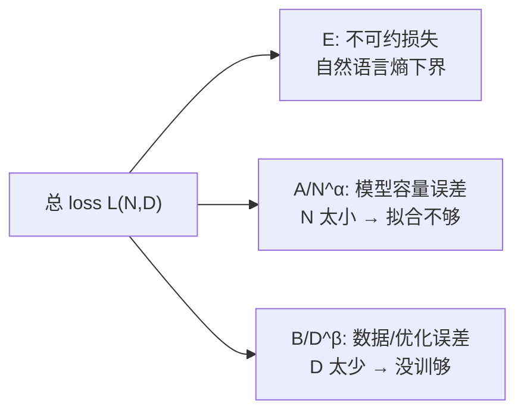
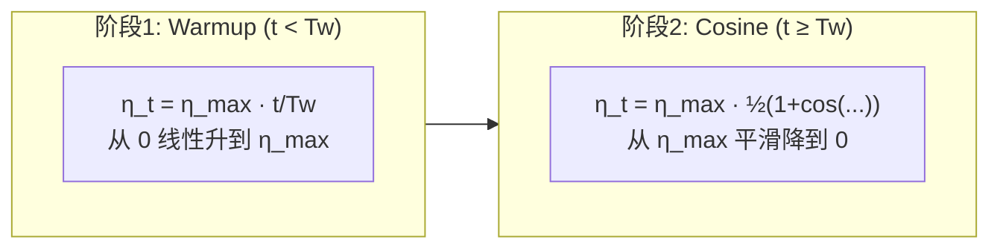
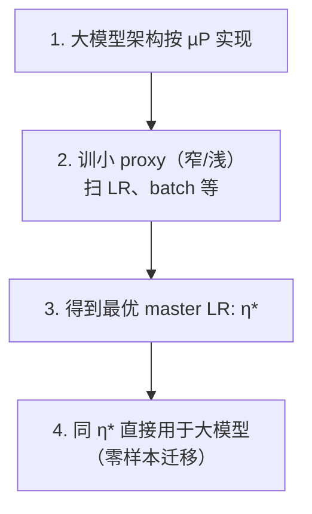

# 数据配比(mixing)

- **VQA 配额**:典型 20-30%(防 VLM 通识坍塌);
- **跨数据集配比**:DROID 30% + AgiBot 20% + Human 50%(CoLA-World 类);
- **数学规律**:Power-law 配比损失 \($L(\lambda) = c_0 + c_1\lambda^{c_2}$\)。

这句话在 **§2.4 数据配比（mixing）** 里，和上一节 §2.1 的 \(\lambda\) **不是同一个含义**。

## 它在说什么

\[
L(\lambda) = c_0 + c_1 \lambda^{c_2}
\]

这是一个 **经验拟合公式**：用来描述「某种数据在混合训练里占多少比例 \(\lambda\)」时，模型 **损失 \(L\)**（或下游任务误差）通常怎么变。

| 符号 | 含义 |
|------|------|
| \(\lambda\) | **混合比例**：某类数据在总 batch 中的采样权重或占比（0–1） |
| \(L(\lambda)\) | 在该配比下测到的 **训练/验证损失**，或任务成功率对应的误差 |
| \(c_0\) | **基线项**：即使配比接近最优，也降不下去的「地板损失」 |
| \(c_1, c_2\) | **拟合系数**：由消融实验扫不同 \(\lambda\) 后拟合得到 |

「Power-law」指：损失随配比的变化 **不是线性的**，而是近似 **幂律** \( \propto \lambda^{c_2}\)，常见特征是 **边际收益递减**——多加一点某类数据，一开始帮助大，后面帮助变小。

## 和前面两条 bullet 的关系

§2.4 前三条是在同一维度里讲三件事：

1. **VQA 配额 20–30%**  
   例如 VQA 占 batch 的 \(\lambda_{\text{VQA}} \approx 0.2\text{–}0.3\)，是为了防 VLM 通识能力坍塌；偏离这个区间，\(L(\lambda)\) 往往会明显变差。

2. **跨数据集配比**  
   如 DROID 30% + AgiBot 20% + Human 50%，是多个 \(\lambda_i\) 且 \(\sum \lambda_i = 1\)。

3. **数学规律**  
   很多论文做配比消融时，扫 \(\lambda\) 后曲线常可用上式拟合，用来找 **sweet spot**，而不是拍脑袋定 50/50。

## 直观例子

假设 \(\lambda\) = 「具身/真机数据」在混合中的占比：

- \(\lambda\) **太小**（VQA/Web 太多）→ 机器人任务差，\(L\) 高  
- \(\lambda\) **太大**（几乎全是机器人）→ VLM 通识掉，\(L\) 也可能升高  
- 中间某个 \(\lambda^*\) 最优；离开 \(\lambda^*\) 越远，\(L\) 上升往往呈 **非线性（幂律）**，不是简单直线

文档里 GigaWorld 的消融也体现类似规律：**10% PT 数据 → SR 0.57，100% → 0.83**，不是「10% 数据 ≈ 10% 性能」，而是明显非线性。

Cosmos Policy 的 **50% policy + 25% WM + 25% value** 则是把多个 \(\lambda_i\) 固定在一个经验 sweet spot 上。

## 和 §2.1 的 \(\lambda\) 区别（容易混）

| 位置 | \(\lambda\) 含义 |
|------|----------------|
| §2.1 \(D_{\text{eff}}\) | 代理数据相对真机的 **折算系数**（1h EgoDex ≈ 0.5h 真机） |
| §2.4 \(L(\lambda)\) | 训练 batch 里某类数据的 **采样占比/权重** |

## 一句话总结

这是在说：**多源数据混合预训练时，性能对配比通常不是线性响应，而可用幂律 \(L(\lambda)=c_0+c_1\lambda^{c_2}\) 近似**；因此 VQA 20–30%、DROID/AgiBot/Human 等固定比例，本质都是在找使 \(L\) 最小的 \(\lambda^*\)，而不是简单把数据量相加。该式是分析框架里的 **经验模型**，不是某一篇论文原文的固定公式；\(c_0,c_1,c_2\) 需靠具体配比消融拟合。

## 核查结论：上一轮哪些对、哪些需修正

### 基本正确的部分

| 说法 | 核查 |
|------|------|
| \(\lambda\) 在 §2.4 指 **数据混合比例**（某类数据占 batch 的权重） | ✅ 与 [Data Mixing Laws](https://arxiv.org/html/2403.16952) 中 \(r_j\) 含义一致 |
| \(L(\lambda)\) 表示 **验证损失/任务误差随配比变化** | ✅ 合理 |
| 该式是分析文档里的 **经验/启发式模型**，不是某篇 VLA 论文的原文公式 | ✅ 在 `pt_trainmth.md` / `op47` 中均未标注论文出处 |
| **VQA 20–30%** 来自多篇 VLA 工程经验（防 VLM 坍塌），不是从该幂律直接推导 | ✅ 文献中未见「VQA 必须 20–30%」的普适 scaling law；LAP/KI 等是 **co-train VQA**，比例多为工程设定 |

### 需要修正的部分（重要）

**1. 主流「数据配比 law」不是 \(c_0 + c_1\lambda^{c_2}\)**

[Data Mixing Laws (Ye et al., ICLR 2025)](https://arxiv.org/html/2403.16952) 在固定模型与 token 预算下，对混合比例用的是 **指数型**，不是简单幂律：

\[
L_i(r_{1..M}) = c_i + k_i \exp\left(\sum_{j=1}^{M} t_{ij} r_j\right)
\]

两域 pilot 甚至写明：**配比与 loss 在 log 尺度近似线性 → 用指数 law**；作者明确 **不用** \(r\to 0\) 时会发散的幂律形式（见该文 §3.1 脚注）。

[BiMix (2405.14908)](https://huggingface.co/papers/2405.14908) 则用 **双变量**形式，配比项常呈 **\(r_i^{-\alpha_i}\)**（反幂律），也不是 \(\lambda^{c_2}\)。

[Scaling Laws for Optimal Data Mixtures](https://arxiv.org/html/2507.09404v1) 则是 **加性、多域权重 \(h\)** 的另一套 law。

因此，`pt_trainmth.md:183` 里的式子更准确的说法是：把 **Kaplan/Chinchilla 通用 scaling law** \(L = c + k x^\alpha\)（\(x\) 本是参数量、token、step）**借用到单变量配比 \(\lambda\)** 的 **简化写法**，而不是当前 LLM「数据配比」领域公认的标准形式。

**2. 上一轮关于「中间有最优 \(\lambda^*\)、U 形曲线」的表述不准确**

\(L(\lambda) = c_0 + c_1\lambda^{c_2}\) 在 \(c_1>0, c_2>0\) 时 **单调**（随 \(\lambda\) 只增或只减），**无法** 描述「VQA 太少 / 太多都不好」这种 **非单调** 权衡。

而 Data Mixing Laws 论文强调：真实配比优化往往是 **非单调** 的，这才需要指数/多域形式，而不是单变量单调幂律。

**3. VLA 数据混合未必服从「越多越好的幂律」**

[Rethinking VLA Model Scaling (2602.09722)](https://arxiv.org/html/2602.09722) 表明：机器人 PT **盲目加 heterogeneous 数据会降分**（如 LIBERO 上 OXE-only 77.3% vs 加多样数据后 72.1%）。这与「扫 \(\lambda\) 用幂律拟合即可找最优」的乐观假设相冲突——VLA 更需要 **对齐、正则、域权重**，不能照搬 NLP mixing law。

---

## \(c_0, c_1, c_2\) 如何取值 / 如何求值？

**没有全球统一的 \(c_0,c_1,c_2\) 常数**；必须针对 **你的模型、数据域、训练步数、验证集** 做消融后 **拟合**。

### 若仍用文档中的简化式 \(L(\lambda) = c_0 + c_1\lambda^{c_2}\)

（仅作 **两域、单调区间** 的粗近似，例如只扫「机器人数据占比 \(\lambda\)」）

**步骤：**

1. **固定** 模型规模 \(N\)、总 token/步数 \(S\)、除 \(\lambda\) 外一切超参。
2. 选一组 \(\lambda\)（建议 ≥5 点），例如机器人占比 \(\{0.1, 0.2, 0.3, 0.4, 0.5, 0.6, 0.7, 0.8\}\)。
3. 每个 \(\lambda\) 跑完整或 **小模型+少 token 代理实验**（再按 [Data Mixing Laws](https://github.com/yegcjs/mixinglaws) 的 nested scaling 外推到大模型）。
4. 记录验证指标：交叉熵 loss，或 LIBERO SR 等（若用 SR，需转成可拟合的 loss/误差）。
5. **非线性最小二乘** 拟合 \((c_0, c_1, c_2)\)，使 \(\sum_i (L_i^{\text{obs}} - L(\lambda_i))^2\) 最小。

**Python 示意（可运行思路）：**

```python
import numpy as np
from scipy.optimize import curve_fit

def mixing_law(lam, c0, c1, c2):
    return c0 + c1 * lam**c2

# 消融得到的 (λ, 验证 loss)
lam = np.array([0.1, 0.2, 0.3, 0.4, 0.5, 0.6, 0.7, 0.8])
L_obs = np.array([...])  # 你的实测 loss

(c0, c1, c2), _ = curve_fit(
    mixing_law, lam, L_obs,
    p0=[L_obs.min(), 1.0, -0.3],  # 初值：c0≈地板loss，c2常为负（λ↑ loss↓）
    bounds=([-np.inf, 0, -10], [np.inf, np.inf, 10]),
)
lam_star = lam[np.argmin(mixing_law(lam, *c0, *c1, *c2))]  # 仅在采样点上找最优
```

**参数含义（拟合后）：**

| 参数 | 含义 |
|------|------|
| \(c_0\) | **不可约/渐近地板 loss**（类似 irreducible loss） |
| \(c_1\) | **配比敏感度幅度** |
| \(c_2\) | **边际递减指数**；\(c_2<0\) 时常表示「某类数据占比↑ → loss↓」 |

**注意：** 若曲线明显 U 形，应改用文献中的 **指数 law** 或 **多域 law**，不要用该三参数幂律硬拟合。

### 更推荐的做法（与网络文献一致）

**A. 两域（如 VQA vs Robot）— 用指数型**

\[
L_i(r_i) = c_i + k_i \exp(t_{ii} r_i)
\]

对数线性回归：\(\log(L_i - c_i) \approx \log k_i + t_{ii} r_i\)（先估 \(c_i\) 为最小观测 loss 或 irreducible 项）。

**B. 多域 — 用完整 Data Mixing Law**

拟合 \(c_i, k_i, t_{ij}\)，总 loss 为验证域加权和；代码见 [mixinglaws](https://github.com/yegcjs/mixinglaws)。

**C. 联合配比 + 数据量 — BiMix**

\[
L_i(r_i, s) = \frac{A_i}{r_i^{\alpha_i}(B_i s^{\beta_i} + C_i)}
\]

用 Trust Region Reflective（论文所用）在 \((r_i, s, L_i)\) 元组上拟合。

**D. 求最优配比**

在单纯形 \(\sum r_j=1\) 上最小化拟合的 \(L(\mathbf{r})\)（文献用 L-BFGS 等约束优化），而不是查表「20–30%」。

---

## 对 `pt_trainmth.md:183` 的改进建议（可选）

当前一行容易让人以为 **VLA 公认 law = \(c_0+c_1\lambda^{c_2}\)**。更严谨的写法可以是：

> **数学规律（简化）**：通用 scaling \(L=c+kx^\alpha\)（\(x\)=参数量/token）；**配比**在 LLM 上更常用 **指数型 Data Mixing Law**（Ye et al. 2025）或 **BiMix 双变量 law**；VLA 需额外注意负迁移，不宜直接外推 NLP 系数。

---

**总结：** 上一轮对 \(\lambda\)、\(L\) 含义和「无统一常数、需消融拟合」的判断 **大体正确**；但把该式说成配比领域的标准规律、并用单调幂律解释「VQA sweet spot」，**与当前主流文献不完全一致**。\(c_0,c_1,c_2\) **没有现成表可查**，只能通过 **多组 \(\lambda\) 训练 + 非线性回归** 得到；工程上更稳妥的是采用 **指数/多域 Data Mixing Law + 小模型外推**，并在 VLA 上验证是否出现 **负迁移** 后再定配比。

---

# Scaling law(\($L(N, D)$\) 拟合)

- **Chinchilla**:\($L(N, D) = E + A/N^\alpha + B/D^\beta$\);Hoffmann 2022 在 NLP 上得 \($\alpha \approx 0.34, \beta \approx 0.28$\)。
- **VLA 上的实证**:本文档第 5.9 节用 25 篇 PT 数字反向拟合,初步估计 VLA `α≈0.35-0.50, β≈0.20-0.35`(数据效率显著低于 NLP,反映 video 与 action token 信息密度差异)。
- **Compute-optimal**:\($N_{\text{opt}} \propto C^{0.5}, D_{\text{opt}} \propto C^{0.5}$\)。

## 一、这三行在说什么？

§2.5 是在回答一个 **算力预算下的资源配置问题**：

> 给定固定训练算力 \(C\)，模型该做多大（\(N\)）？数据该喂多少（\(D\)）？最终 loss 能降到多低（\(L\)）？

核心工具来自 DeepMind 的 **Chinchilla 论文**（Hoffmann et al., NeurIPS 2022）：[*Training Compute-Optimal Large Language Models*](https://arxiv.org/abs/2203.15556)。官方博客也总结了同一结论：[算力最优 LLM 训练分析](https://deepmind.google/blog/an-empirical-analysis-of-compute-optimal-large-language-model-training/)。

---

## 二、主公式：\($L(N,D) = E + \dfrac{A}{N^\alpha} + \dfrac{B}{D^\beta}$\)

### 直觉（风险分解）

Chinchilla 把预训练 loss 拆成三项（见论文 Appendix D.2 与式 (9)）：



| 符号 | 含义 | 物理直觉 |
|------|------|----------|
| **\(L(N,D)\)** | 预训练验证 loss（通常用 **交叉熵 / perplexity**） | 越小越好 |
| **\(N\)** | 模型参数量（Chinchilla 用 **总参数**，含 embedding） | 模型「容量」 |
| **\(D\)** | 训练见过的 **token 数**（不是样本条数） | 数据「曝光量」 |
| **\(E\)** | **不可约损失**（Bayes 风险 / 自然文本熵） | 再大模型、再多数据也降不下去的地板 |
| **\(A,\alpha\)** | **模型规模项** 的幅度与指数 | \(N\) 翻倍，该项约按 \($2^{-\alpha}$\) 缩小 |
| **\(B,\beta\)** | **数据规模项** 的幅度与指数 | \(D\) 翻倍，该项约按 \($2^{-\beta}$\) 缩小 |

### NLP 上的典型拟合值（Chinchilla 原文）

在 **MassiveText** 上，400+ 次不同 \((N,D)\) 训练后，Huber + L-BFGS 拟合得到（论文式 (10)）：

| 参数 | 拟合值 | 出处 |
|------|--------|------|
| \(E\) | **1.69** | Hoffmann 2022, Appendix D.2 |
| \(A\) | **406.4** | 同上 |
| \(B\) | **410.7** | 同上 |
| \(\alpha\) | **0.34** | 同上 |
| \(\beta\) | **0.28** | 同上 |

因此文档写的 \(\alpha \approx 0.34,\ \beta \approx 0.28\) **与原文一致**。

**读数示例**：若 \(N=10\text{B}, D=200\text{B}\)，则

\[
L \approx 1.69 + \frac{406.4}{10^{0.34}} + \frac{410.7}{200^{0.28}} \approx 1.69 + 1.62 + 1.35 \approx 4.66
\]

（具体数值随 tokenizer、数据域会变，**系数不能跨任务硬抄**。）

---

## 三、Compute-optimal：\($N_{\text{opt}} \propto C^{0.5},\ D_{\text{opt}} \propto C^{0.5}$\)

### 算力约束从哪来？

Kaplan et al. (2020) 近似：**训练 FLOPs** 与参数量、token 数的关系为

\[
$$C \approx 6ND$$
\]

（Transformer 一次前向+反向，每个参数约处理 \(6D\) 次运算的量级估计。）

### 最优分配的含义

在固定 \(C\) 下最小化 \(L(N,D)\)：

\[$
(N_{\text{opt}}, D_{\text{opt}}) = \arg\min_{N,D\ \text{s.t.}\ 6ND=C} L(N,D)
$\]

Chinchilla 用三种独立方法（训练曲线包络、IsoFLOP 曲线、参数化 loss 拟合）都得到：**\(N\) 和 \(D\) 应随算力近似等比例增长**。

| 方法 | \($N_{\text{opt}} \propto C^a$\) | \($D_{\text{opt}} \propto C^b$\) |
|------|-------------------------------|-------------------------------|
| Chinchilla 三种方法 | \($a \approx 0.46\text{–}0.50$\) | \($b \approx 0.50\text{–}0.54$\) |
| Kaplan 2020（旧结论） | **0.73** | **0.27** |
| 文档简化写法 | **\(\approx 0.5\)** | **\(\approx 0.5\)** |

文档把指数 **四舍五入成 0.5** 是合理的工程简写；严格值见 [Chinchilla Table 2](https://arxiv.org/pdf/2203.15556.pdf)。Kaplan 与 Chinchilla 的分歧，后续 [Reconciling Kaplan and Chinchilla](https://arxiv.org/html/2406.12907v2) 认为主要来自 **参数计数方式** 和 **训练是否训到收敛** 的方法差异。

### 为什么推出 \($D/N \approx 20$\)？

当 \($N_{\text{opt}} \propto C^{0.5}$\) 且 \($D_{\text{opt}} \propto C^{0.5}$\) 时，**比值 \(D/N\) 与 \(C\) 无关**，为常数。

Chinchilla Table 3 给出算力最优下的具体数字，例如：

| 模型规模 \(N\) | 最优 token 数 \(D\) | \(D/N\) |
|-------------|-------------------|---------|
| 1B | ~20B | **~20** |
| 10B | ~220B | **~22** |
| 70B (Chinchilla) | ~1.4T | **~20** |

这就是文档 §2.2 里「\(D/N \approx 20\)」的来源：**每 1 个参数大约配 20 个训练 token**（NLP、算力最优、从头预训练语境）。

经典对比：GPT-3 约 175B 参数 + 300B token（\(D/N \approx 1.7\)）→ Chinchilla 认为 **严重 under-trained**；Chinchilla 70B + 1.4T token 用 **相同算力** 却更优。

---

## 四、文档第三行：VLA 上的 \(\alpha,\beta\) 是什么意思？

```185:189:d:\SRC\d\10wEmbdm\pt_trainmth.md
### 2.5 Scaling law(\($L(N, D)$\) 拟合)

- **Chinchilla**:\($L(N, D) = E + A/N^\alpha + B/D^\beta$\);Hoffmann 2022 在 NLP 上得 \($\alpha \approx 0.34, \beta \approx 0.28$\)。
- **VLA 上的实证**:本文档第 5.9 节用 25 篇 PT 数字反向拟合,初步估计 VLA `α≈0.35-0.50, β≈0.20-0.35`(数据效率显著低于 NLP,反映 video 与 action token 信息密度差异)。
- **Compute-optimal**:\($N_{\text{opt}} \propto C^{0.5}, D_{\text{opt}} \propto C^{0.5}$\)。
```

这里 **借用了 Chinchilla 的函数形式**，但 **VLA 的 \(\alpha_{\text{VLA}}, \beta_{\text{VLA}}\) 并非 Hoffmann 原文数值**，而是你们文档 §5.9 对 25 篇论文 **\(D/N\) 与性能** 的 **启发式归纳**：

| 观察 | 含义 |
|------|------|
| \($\alpha_{\text{VLA}} \approx 0.35\text{–}0.50$\)（略 ≥ NLP） | 很多 VLA **借力已有 VLM 基座**，从零 scaling 时「加大 \(N\)」边际收益相对变小 |
| \($\beta_{\text{VLA}} \approx 0.20\text{–}0.35$\)（略 ≤ NLP） | 视频帧 / 动作 token **信息密度与文本不同**，同样 \(D\) 带来的 loss 下降更慢 |
| VLA 最优 \($D/N \approx 10\text{–}15$\)（NLP 是 ~20） | 文档建议：VLA 更常 **小模型 + 多样数据 + 多 epoch**，而非纯堆 token |

§5.9 也诚实记录了 **\(D/N\) 跨度极大**（0.001–660）：Cosmos Policy 几乎只 SFT（借力基座），DM0 LLM 阶段 \(D/N \approx 660\)（严重 over-train），LingBot 真机 \(D/N \approx 1.2\) 仍 SOTA（真机帧信息密度高）。

**重要提醒**：VLA 领域尚无像 Chinchilla 那样 **400+ 受控实验 + 统一验证集** 的权威 scaling law。[Rethinking VLA Scaling (2026)](https://arxiv.org/html/2602.09722) 还指出：**盲目加 heterogeneous 机器人数据可能降分**，不能机械套用 NLP 的 \(D/N=20\)。

---

## 五、各项如何取值 / 如何求值？

### 方法 A：完整 Chinchilla 流程（NLP 标准，可迁移思路）

**Step 1 — 设计实验网格**

- 固定数据域、tokenizer、优化器、LR 等（scaling law 只在 **控制变量** 下成立）；
- 扫多组 \((N_i, D_i)\)，每组 **训到该规模下的 near-convergence**（Chinchilla 与 Kaplan 的核心方法差异就在此）；
- 记录验证 loss \(L_i\)。

**Step 2 — 拟合 \((E, A, B, \alpha, \beta)\)**

Chinchilla 做法（Appendix D.2）：

1. 在 **log 空间** 拟合，最小化 **Huber loss**（\(\delta=10^{-3}\)，抗离群点）；
2. 优化器：**L-BFGS**；
3. 对 \((E, \log A, \log B, \alpha, \beta)\) 做 **多初值网格搜索**，取最优；
4. 得到如 \(E=1.69, A=406.4, B=410.7, \alpha=0.34, \beta=0.28\)（**仅对该数据域有效**）。

**Step 3 — 求 compute-optimal**

在 \(6ND=C\) 约束下对 \(\hat L(N,D)\) 求极小，闭式解（Chinchilla 式 (4)）：

\[
N_{\text{opt}}(C) = G\left(\frac{C}{6}\right)^{a},\quad
D_{\text{opt}}(C) = G^{-1}\left(\frac{C}{6}\right)^{b}
\]

其中 \(a=\dfrac{\beta}{\alpha+\beta},\ b=\dfrac{\alpha}{\alpha+\beta},\ G=\left(\dfrac{\alpha A}{\beta B}\right)^{\!1/(\alpha+\beta)}\)。

代入 \(\alpha=0.34,\beta=0.28\) 得 \(a\approx0.45,\ b\approx0.55\)，即 **\(N,D\) 都近似随 \(C^{0.5}\) 增长**。

**Step 4 — 得到 \(D/N\) 与预算表**

用拟合好的 law 生成 Table 3 型对照表：给定 \(C\) 或 \(N\)，查最优 \(D\)。

---

### 方法 B：工程快捷法（文档 §5.9 实际在用）

若无法做 400 次完整 PT，可用 **\(D/N\) 反推**（文档对 25 篇论文的做法）：

1. 从论文提取 \(N\)、\(D\)（token / frame / trajectory 需 **统一换算成语义 token**）；
2. 算 \(D/N\)，对照任务性能（LIBERO SR、真机成功率等）；
3. 看 **高性能论文落在哪个 \(D/N\) 区间** → 得到 VLA 经验带（10–15 或 17–27）。

这是 **benchmark 归纳**，不是严格非线性回归；\(\alpha_{\text{VLA}}, \beta_{\text{VLA}}\) 的区间是 **对现象的解释性参数**，不能像 Chinchilla 的 0.34/0.28 那样直接代入算 loss。

---

### 方法 C：VLA 实践中的「有效 \(D\)」

结合 §2.1 的 \(D_{\text{eff}}\)：

\[
D_{\text{eff}} = D_{\text{real}} + \lambda D_{\text{proxy}}
\]

- **真机轨迹** → 直接计入 \(D_{\text{real}}\)；
- **EgoDex / 仿真** → 用 \(\lambda \approx 0.3\text{–}1.0\) 折算后再代入 \(D/N\)。

否则 Cosmos Policy（\(D/N \approx 0.001\)）与 DM0（\(D/N \approx 660\)）无法在同一标尺上比较。

---

## 六、对你当前工作的可直接结论

| 问题 | 答案 |
|------|------|
| 公式干什么用？ | 在固定算力下，联合决定 **模型多大、数据多少、loss 下限**，并给出 **算力最优配比** |
| \(E,A,B,\alpha,\beta\) 有 universal 常数吗？ | **NLP 有**（Chinchilla 一组）；**VLA 没有**，需按任务重拟合或用 §5.9 的 \(D/N\) 经验带 |
| \(N_{\text{opt}} \propto C^{0.5}\) 精确吗？ | Chinchilla 严格值约 **0.46–0.50**，写 0.5 是合理近似 |
| \(D/N \approx 20\) 能用于 VLA 吗？ | **仅作 LLM/VLM 从头 PT 参考**；VLA 文档建议 **10–15**，且 P1「借力基座」类可远低于此 |
| 怎么求值？ | **正规**：多组 \((N,D)\) 实验 + Huber/L-BFGS 拟合；**工程**：扫 \(D/N\) + 任务性能找 sweet spot |

若你接下来要做 **可发表的 VLA scaling 拟合**，最小可行方案是：固定 2–3 个 \(N\)（如 0.5B/2B/4B），每个 \(N\) 扫 4–5 个 \(D\)（按 Chinchilla Approach 1），在 **同一验证 benchmark** 上测 loss/SR，再跑一遍 Chinchilla 式 (11) 的拟合 pipeline。需要的话我可以按你手头 GPU 预算，帮你设计一版具体的 \((N,D)\) 实验网格。

---

你的理解没错：**在 Chinchilla 原意里，\(D\) = 训练见过的 token 数，\(N\) = 模型参数量**。  
第 318 行之所以说「跨度极大」，不是因为 \(D/N\) 的定义变了，而是因为 **把同一套标尺硬套到 25 篇 VLA 论文上时，大家统计的 \(D\) 根本不是同一种东西**。

---

## 1. \(D/N\) 在这里到底在比什么？

Chinchilla 的用法是：

\[
\frac{D}{N} \approx 20 \quad\Rightarrow\quad \text{每 1 个参数大约配 20 个训练 token（算力最优、从头预训练）}
\]

文档 §5.9 做的是 **横向对比**：对每篇论文算一个 \(D/N\)，看它们离「20」有多远。  
**\(N\) 好办**（论文里的参数量）；**\(D\) 难办**——VLA 训练往往是多阶段，文档各卡片的「Chinchilla scaling 视角」里，**\(D\) 只计入该卡片所讨论的那一段 PT/SFT**，通常 **不含** 上游 LLM/VLM/视频基座的 token。

所以：**公式没变，变的是「这一段的 \(D\) 怎么数」**。

---

## 2. 三个例子：数字从哪来、为何极端？

### Cosmos Policy：\(D/N \approx 0.001\)（极低）

| 项 | 文档取值 | 含义 |
|----|----------|------|
| \(N\) | **2B** | Cosmos Policy 策略模型规模 |
| \(D\) | **500 demos 的 SFT** | 只数 VLA 微调阶段，不含 Cosmos 视频/WFM 基座 PT |
| \(D/N\) | **~0.001** | 500 demos 折成 token 约 \(10^6\) 量级 ÷ \(2\times10^9\) ≈ 0.0005–0.001 |

按 Chinchilla 标准这等于 **几乎没训**（under-trained）。  
但 Cosmos Policy **借力** 已在海量视频上训好的基座，SFT 只是 **对齐（alignment）**，不需要再堆 token。  
文档说「几乎只 SFT、借力基座」就是这个意思：**\(D/N\) 低，不代表模型弱，而是 \(D\) 只算了最后一段**。

---

### DM0：\(D/N \approx 660\)（极高）

| 项 | 文档取值 | 含义 |
|----|----------|------|
| \(N\) | **1.7B** | DM0 LLM 阶段参数量 |
| \(D\) | **1.13T tokens** | LLM 从头 PT 阶段 |
| \(D/N\) | \(1130/1.7 \approx\) **660** | 约为 Chinchilla 最优 20 的 **30 倍+** |

纯 NLP 视角叫 **严重 over-trained**（同样算力下，Chinchilla 会建议更小 \(N\) + 更均衡的 \(D\)）。  
文档认为对 **具身原生 LLM** 仍合理：文本 token 信息密度高、与机器人控制距离远，需要 **远超 20 的 token/参数比** 才能把表征往 embodied 方向拉。  
这里 **\(D\) 数的是完整 LLM PT**，和 Cosmos 只数 500 demos **不是同一统计口径**。

---

### LingBot-VLA：\(D/N \approx 1.2\)（也很低，但仍 SOTA）

| 项 | 文档取值 | 含义 |
|----|----------|------|
| \(N\) | **~3B** | Qwen2.5-VL 基座 |
| \(D\) | **~3.6B frame-tokens** | 20Kh 真机 × 30Hz × 约 5 帧/秒 的粗算 |
| \(D/N\) | \(3.6/3 \approx\) **1.2** | 远低于 20 |

按 Chinchilla 仍是 under-trained，但 LingBot 在真机任务上仍很强。  
文档的解释是：**真机每一帧 ≈ 图像 + 动作 + 物理反馈**，单 token/frame 的 **有效信息量 >> 纯文本 token**，所以不需要 \(D/N=20\) 也能「饱和」。  
这是 **token 不等价** 问题：同样的 \(D\)（token 数），机器人帧和 Wikipedia 文字不可比。

---

## 3. 为何说「跨度 0.001–660」？

把 25 篇论文的 \(D/N\) 画在一条数轴上：

```
0.001          1.2        20(Chinchilla)    27~75        660
   |             |              |              |            |
Cosmos        LingBot      NLP 最优参考    MolmoAct2等    DM0
Policy                      区              P2/P3 集中区   LLM PT
(只数SFT)     (真机帧)                      (自训PT)
```

**跨度大** 说明三件事（§5.9 的核心结论）：

1. **VLA 主流不是「从零 Chinchilla scaling」**，而是 **借力基座 + 短 SFT**（\(D/N\) 可 < 0.01）或 **自训长 PT**（\(D/N\) 可 > 100）。
2. **\(D\) 的统计阶段不统一**：有的只数 SFT，有的数 LLM PT，有的数真机 frame——直接比 \(D/N\) 要带着 **口径** 读。
3. **Chinchilla 的 \(D/N \approx 20\)** 只对 **单一阶段、从头、文本 token、算力最优** 有意义；套到 VLA 上只能当 **启发式参照**，不能当硬约束。

---

## 4. 直接回答你的疑问

| 你的理解 | 是否正确 |
|----------|----------|
| \(D\) 是训练数据、\(N\) 是模型大小 | ✅ **对**（Chinchilla 原义） |
| 为何 Cosmos 那么低还能 work？ | 因为 **\(D\) 没算上基座已消耗的万亿级 token** |
| 为何 DM0 660 还说合理？ | 因为 **\(D\) 数的是整段 LLM PT**，且具身任务需要 over-train 文本侧 |
| 为何 LingBot 1.2 还 SOTA？ | 因为 **真机 frame 的「有效 \(D\)」远大于名义 token 数** |

一句话：**第 318 行不是说 \(D\) 不是数据、\(N\) 不是模型大小，而是说——在 VLA 多阶段、多模态、多统计口径下，用同一个 \(D/N\) 去量 25 篇论文，会得到从 0.001 到 660 的极端分布；这恰恰说明不能机械套用 NLP 的「每参数 20 token」规则。**

若要做严肃对比，需要先统一：**\(D\) 数哪一阶段、token 如何换算、是否计入基座与 \(D_{\text{eff}}\)（§2.1 的代理数据折算）**——否则 \(D/N\) 更像 **分类标签**（P1 借力 / P2 自训 / P3 跨本体），而不是可直接代入 \(L(N,D)\) 的物理量。

---

## `over-train` 在这里指什么？

在 Chinchilla / scaling law 语境里，**over-train（过度训练）** 不是说模型一定 **过拟合（overfit）** 了，而是说：

> **在固定算力或固定模型规模下，你用的训练 token 数 \(D\) 超过了「算力最优（compute-optimal）」建议量。**

Chinchilla 对 NLP 的经验是：算力最优时大约 **\(D/N \approx 20\)**（每 1 个参数约 20 个 token）。  
若 **\(D/N \gg 20\)**，从 **纯 LLM scaling 角度** 就叫 over-train。

---

## 和「过拟合」的区别

| 概念 | 含义 |
|------|------|
| **Over-train（scaling 术语）** | 相对 Chinchilla 最优配比，**数据/步数给多了**；同样 FLOPs 本可以换更大 \(N\) 或更优 \(D/N\) |
| **Overfit（统计学习术语）** | 训练集 loss 继续降，**验证集/测试集变差** |

两者可能同时出现，但 **不必然同时发生**。  
DM0 的 \(D/N \approx 660\) 被说「LLM 视角严重 over-train」，指的是 **配比偏离 Chinchilla 最优**，不是说验证集一定崩了。

---

## 文档里为什么还说 DM0 over-train「对 VLA 仍合理」？

- **NLP 视角**：1.7B 配 1.13T token → \(D/N \approx 660\)，约为最优 20 的 **30 倍+** → 按 Chinchilla 属于 over-train（同样算力下，也许换更大模型或别的方式更省）。
- **VLA 视角**：文本 token 和机器人控制距离远，需要 **更多 epoch / 更多 token** 才能把表征往 embodied 方向拉，所以 **故意多训** 可能是配方的一部分。

也就是说：**over-train 是相对于「NLP 算力最优表」的判断，不是相对于「VLA 任务是否有效」的判断。**

---

## 另一个相关用法：小模型 over-train「反而 OK」

文档还提到 FLOWER（950M，\(D/N \approx 57\)）：

- 小模型训练便宜，**超过 Chinchilla 最优多训几轮**，边际成本不高；
- 有时能多榨一点性能。

这里的 over-train 同样是：**\(D/N\) 高于 20**，但在小模型上 **工程上可以接受甚至有益**。

---

## 一句话

**Over-train = 训练 token/步数相对模型参数量给得比 Chinchilla 算力最优配比（\(D/N \approx 20\)）更多**；在 VLA 里常因多阶段训练、token 不等价、或任务需要而 **故意出现**，不等于传统意义上的过拟合。

---

# 学习率调度(LR schedule)

- **Cosine + Warmup**:\($\eta_t = \eta_{\max}\cdot\min(t/T_w, \tfrac{1}{2}(1+\cos(\pi(t-T_w)/(T-T_w))))$\)
- **典型 PT LR**:5e-5 → 6e-6(DM0)/ 1e-4(LAP / Ψ0 PT)/ 1e-5(MolmoB0T / ABot-M0)。
- **Warmup ratio**:5-10% 总 step(VLA 主流)。
- **µTransfer**:小模型调好的 LR 可线性 transfer 到大模型(Yang et al. 2022)。

## 一、Cosine + Warmup 公式在说什么？

\[
\eta_t = \eta_{\max} \cdot \min\left(\frac{t}{T_w},\ \frac{1}{2}\left(1+\cos\frac{\pi(t-T_w)}{T-T_w}\right)\right)
\]

| 符号 | 含义 |
|------|------|
| \(\eta_t\) | 第 \(t\) 步的学习率 |
| \(\eta_{\max}\) | 峰值学习率（如 DM0 的 5e-5、LAP/Ψ0 的 1e-4） |
| \(T_w\) | Warmup 步数（常为总步数 \(T\) 的 **5–10%**） |
| \(T\) | 总训练步数 |
| \(\min(\cdot,\cdot)\) | 两阶段取 **较小者**，先 warmup、再 cosine |

### 分两段的直觉



**阶段 1（\(t < T_w\)）**：\(\frac{t}{T_w}\) 更小 → 用 warmup  
- \(t=0\) 时 \(\eta=0\)（或实现里从很小值起）  
- \(t=T_w\) 时 \(\eta=\eta_{\max}\)  
- 目的：大 batch 初期梯度大，**先慢慢加大 LR**，避免 loss 爆炸（文档 §8 陷阱「不做 warmup」）

**阶段 2（\(t \ge T_w\)）**：cosine 项更小 → 用余弦衰减  
- \(t=T_w\)：\(\cos(0)=1\) → \(\eta=\eta_{\max}\)  
- \(t=T\)：\(\cos(\pi)=-1\) → \(\eta=0\)（该式衰减到 0；工程上常改成衰减到 \(\eta_{\min}\)，如 6e-6）

**典型 PT LR 那一行**：不同论文的 **\(\eta_{\max}\)** 和 **终点 LR** 不同，但调度形状多为「warmup + cosine/stable-decay」。

---

## 二、「µTransfer：小模型 LR 可线性 transfer」是什么意思？

文档这里的「线性」容易误解，需要拆开说。

### 1. 它**不是**常见的「线性缩放规则」

很多人以为：

\[
\eta_{\text{大}} = \frac{N_{\text{大}}}{N_{\text{小}}} \cdot \eta_{\text{小}}
\]

**这不是** [Yang et al. 2022 µTransfer](https://arxiv.org/abs/2203.03466) 的核心做法。

### 2. µTransfer 实际在做什么？

**问题**：大模型直接扫 LR 太贵。  
**做法**：在 **µP（Maximal Update Parametrization）** 下，用小模型调好超参，再 **零样本（zero-shot）** 用到大模型上——**大模型上通常不再扫 LR**。



论文 Fig. 1 对比：**标准参数化（SP）** 下最优 LR 随 width 乱跳；**µP** 下最优 LR 随 width **几乎不变**（同一条曲线谷底对齐）。  
所以更准确的说法是：**「宽度缩放时 LR 可稳定迁移」**，而不是「LR 与参数量成简单正比」。

### 3. 「线性」到底指什么？（三层含义）

| 含义 | 具体形式 | 出处 |
|------|----------|------|
| **Warmup 是线性的** | \(\eta_t = \eta_{\max}\cdot t/T_w\)（\(t<T_w\)） | §2.6 公式第一项 |
| **µP 里部分层的 LR 随 width 线性缩放** | 相对基准宽度 \(n_0\)，令 \($\tilde n = n/n_0$\)，则输入/输出层等：\($\eta_{W_1}=\eta_{b}=\eta\cdot\tilde n$\)，隐藏层：\($\eta_{W_2}=\eta$\)（**不**随 width 变） | Yang 2022 式 (3)(4)、Table 3 |
| **文档简写「线性 transfer」** | 常指：小模型调好的 **master \(\eta\)** 在大模型上 **数值可直接沿用** | `pt_trainmth.md` 术语表 |

µP 对 MLP 的典型设置（宽度 \(n\)，master LR 为 \(\eta\)）：

```text
初始化: W1 ~ N(0,1/d_in), W2 ~ N(0,1/n), W3 ~ N(0,1/n²)
学习率: η_W1 = η_b = η·(n/n₀),  η_W2 = η,  η_W3 = η/(n/n₀)
```

- **隐藏层**用同一个 \(\eta\)：宽度从 128 → 8192，**最优 \(\eta\) 不变** → 这是 transfer 的关键。  
- **输入/输出层**的 LR 按 **\(\tilde n = n/n_0\) 线性放大/缩小**，是为了让各层更新幅度在宽模型里仍同阶（µP 的设计，不是「参数量翻倍 LR 翻倍」那种粗规则）。

### 4. 操作步骤（你要是自己做）

1. 用 **µP 实现**（或 `mup` 等库）搭好与目标一致的结构。  
2. 训 **小 width** 模型（如 width≥256、一定 depth/batch，论文有最低要求），扫 LR 得 \(\eta^*\)。  
3. 大模型 **同一 \(\eta^*\)** + µP 按 Table 3 设各层 LR 倍数。  
4. **Cosine + warmup 曲线形状可一并迁移**（附录还提到 batch、序列长度、训练步数在一定范围内也可迁移，深度迁移对 pre-LN Transformer 更稳）。

文档里 Ψ0 / X-VLA 等写「µTransfer 可借鉴」，多数是 **VLM 不同模块用不同 LR 倍数** 的思路，未必每篇都做了完整 µP 实现。

---

## 三、和 §2.6 其它 bullet 的关系

| Bullet | 作用 |
|--------|------|
| Cosine + Warmup | **训练过程中** \(\eta_t\) 随时间怎么变 |
| 典型 PT LR | 各论文的 \(\eta_{\max}\) / 终点 LR 经验值 |
| Warmup 5–10% | \(T_w \approx 0.05T \sim 0.1T\) |
| µTransfer | **开训前** 怎么从小模型 **少试错** 定出 \(\eta_{\max}\)（及初始化等），再套 cosine 调度 |

---

## 四、一句话对照

- **公式**：前 5–10% 步 **线性升温** 到 \(\eta_{\max}\)，之后 **余弦降温** 到 0（或 \(\eta_{\min}\)）。  
- **µTransfer**：在 **µP** 下，小模型扫到的 **master LR \(\eta^*\)** 往往可 **原样** 用于大模型；部分层 LR 按 **宽度比 \(n/n_0\) 线性缩放**，隐藏层 LR **不随宽度变**——文档写的「可线性 transfer」是这套机制的简写，**不是** \(\eta \propto\) 总参数量 \(N\) 的简单比例缩放。

若你希望，我可以把 `pt_trainmth.md:196` 改成更不易误解的表述（例如「µP 零样本迁移，非 η∝N 线性缩放」）。