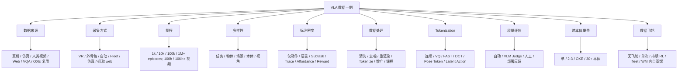
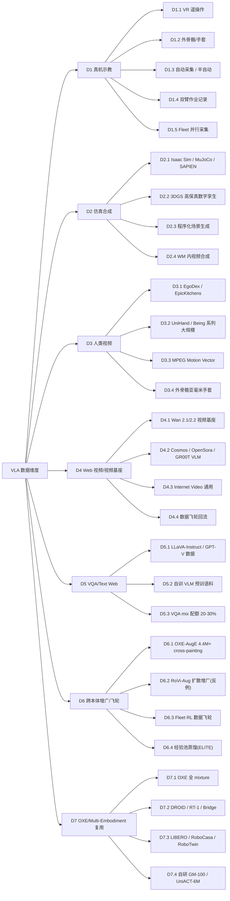
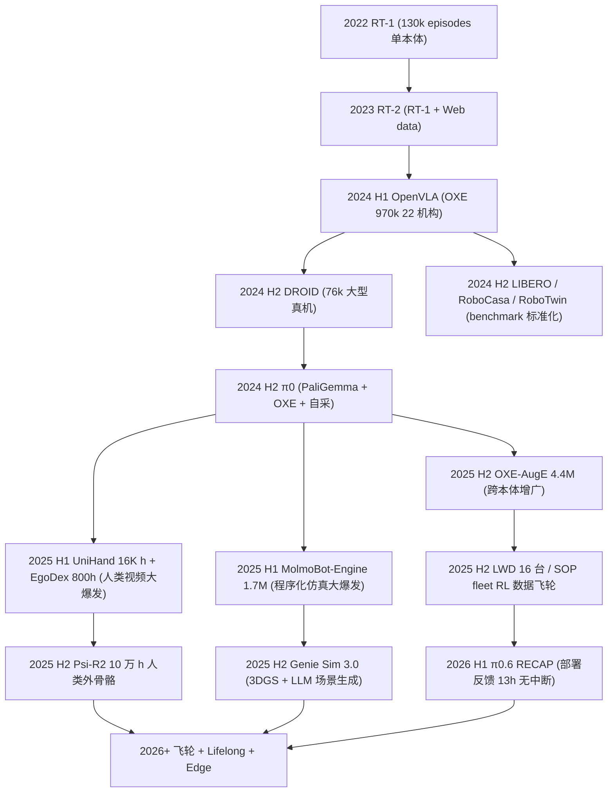

# VLA 数据集 / 采集 / 处理全景分析(70 篇)

> 本文档是 [vla_traintask.md](vla_traintask.md)(训练任务范式)与 [vla_trainmdl.md](vla_trainmdl.md)(模型结构组件)的 **第三份姐妹篇**:从「数据集 + 数据采集方法 + 数据处理流水线 + 数据质量」视角再横切 70 篇 VLA / 具身论文。三份文件在第 7 章速查卡处 **三向互相链接**,形成「任务 × 模型 × 数据」三视角。
>
> **数据源**:[p/](p/) 下 67 篇 `paper.pdf` + 5 篇 HTML(`Being-H0.7/paper.html`、`DM0/paper.html`、`Psi-R2/Psi-W0/page.html`、`GR00T_N1.6/page_{1,2}.html`、`Helix_02/page.html`),严格不读 `paper.txt`。
>
> **方法论**:把每篇的数据拆成 7 大来源类(D1-D7,共 ~30 子组件),先讲直觉(为什么这种数据),再给采集 / 处理流水线(怎么做),再列证据(谁这样做 + 规模数字 + 消融数字)。

---

## 文档导览

- 想知道"某篇论文用了什么数据、多大规模、怎么采" → 第 7 章对应 `7.DX.N` 数据卡;
- 想知道"某类数据(如人类视频)有哪些实现、消融数字" → 第 4 章数据组件深度解析;
- 想知道"数据规模和质量怎么演化过来" → 第 6 章演化时间线 + 第 9.2 外部数据集来源;
- 想自己采集数据 → 先看第 8 章场景化数据采集建议 + 数据陷阱;
- 反向查询"某种数据采集 / 处理方法谁主用" → 第 9.1.X 三重倒排索引(主来源 / 流水线阶段 / 创新点)。

---

## 第 1 章 阅读指南 [T1]

### 1.1 文档目标

把 70 篇 VLA / 具身论文的"数据全景"摊在 7 大数据来源(D1-D7)的设计空间里,回答 4 个核心问题:

1. **数据从哪来**:每篇论文用了什么数据集?多大规模?如何采集?
2. **数据怎么用**:数据如何处理 / 清洗 / 标注 / tokenize / 增广?
3. **数据多好**:数据质量如何评估?哪种数据 / 处理方法对模型效果影响最大?
4. **怎么决策**:对自己的场景,如何挑数据来源 + 处理流水线 + 反模式列表。

### 1.2 术语速查(数据域)

| 缩写 | 全称 | 一句话解释 |
| --- | --- | --- |
| **Episode** | — | 一次完整任务尝试(从初始观测到结束的轨迹)。 |
| **Trajectory** | — | 时间序列的「观测 + 动作 + (可选)奖励」,常等同 Episode。 |
| **Demonstration** | — | 人类示教轨迹(VR / 外骨骼 / 双臂);常作 BC 训练的"金标签"。 |
| **VR Teleop** | VR Teleoperation | 用 VR 设备遥控机器人采集轨迹的方式。 |
| **OXE** | Open-X-Embodiment | 22+ 机构联合的开源跨本体机器人数据集(~970k episodes)。 |
| **DROID** | — | 距离主流之外另一大型开源真机数据集(~76k episodes)。 |
| **EgoDex** | — | Egocentric 人类灵巧手视频数据集(~800 hours)。 |
| **LIBERO** | — | 仿真长程操作 benchmark,VLA 论文最常用评测。 |
| **RoboCasa / RoboTwin** | — | 家庭场景 / 双臂场景仿真 benchmark。 |
| **3DGS** | 3D Gaussian Splatting | 高保真 3D 场景表示;`Genie Sim 3.0` 等仿真平台核心。 |
| **Embodiment Aug** | Embodiment Augmentation | 数据层把同一动作渲染到不同本体上,扩充跨本体数据。 |
| **Data Flywheel** | — | 部署 → 采集 → 训练 → 再部署的持续闭环。 |
| **FAST** | Fast Action Sequence Tokenizer | π0 系列的频域动作 tokenizer(DCT + Huffman)。 |
| **VQ** | Vector Quantization | 把连续动作 / 视觉离散为 codebook 的标准方法。 |
| **Token** | — | 编码后的离散符号(语言 / 视觉 / 动作)。 |
| **Process Reward** | — | 对每一步动作打分的稠密奖励,常作数据质量自动评估。 |
| **VLM Judge** | VLM-as-Judge | 用 VLM 模型(GPT-4V / Gemini)对数据 / 轨迹打分。 |
| **Domain Randomization** | — | 仿真中随机化光照 / 纹理 / 物体位姿,提升 sim-to-real。 |
| **Sim-to-Real Gap** | — | 仿真训练 → 真机部署间的性能差距(数据派核心要解决的问题)。 |
| **Hindsight** | — | 把失败轨迹回标"达到的状态"为新目标的数据扩充。 |
| **Replay Buffer** | — | RL 中存储历史经验的缓冲区,Lifelong 学习关键。 |
| **MPEG Motion Vector** | — | 视频编码自带的运动矢量,可作低成本时序特征(HiF-VLA)。 |

### 1.3 阅读路径

- **数据采集者**(我要采数据):1 → 2 → 3 → **8 →** 4 → 7;
- **研究者**(理解一篇论文的数据):7.DX.N → 4 → 6 → 5;
- **横向研究**(对比一类数据):3 → 4 → 5 → 9.1.X 三重倒排索引;
- **跨文档**:数据卡末尾 → vla_traintask.md(训练任务 7.X.N)+ vla_trainmdl.md(模型组件 7.X.N)。

---

## 第 2 章 数据的 10 维设计空间 [T1]

任何一篇 VLA 论文的数据策略都可以在下面 10 个维度上唯一定位。

### 2.1 数据来源

- **覆盖**:真机示教 / 仿真合成 / 人类视频 / Web 视频 / VQA-text / 跨本体增广 / OXE 复用 / 触觉。
- **典型选择**:绝大多数 70 篇是「真机示教 + OXE 复用 + (可选)仿真 / 人类视频」组合。

### 2.2 采集方式

- **轴**:VR 遥操作 / 外骨骼 / 自动采集 / 双臂作业记录 / fleet 并行采集 / 仿真渲染 / 抓取 web 视频 / 复用既有数据集。
- **关键 trade-off**:
  - VR 遥操作:质量高,但贵(典型每条 5-30 秒人力);
  - 外骨骼:亚毫米精度,设备贵(Psi-R2 用);
  - 仿真渲染:量大、便宜,但 sim-to-real gap;
  - 复用 OXE / DROID:零采集成本,但本体 / 任务受限。

### 2.3 规模

- **维度**:episodes 数 / hours 数 / 视频片段数 / token 数 / 本体种类数。
- **70 篇规模分布**:
  - <1k episodes:有限示教(GeneralVLA 零真机数据);
  - 1k-10k:多数 LIBERO / RoboCasa benchmark 论文;
  - 10k-100k:π0 早期 / DROID 量级;
  - 100k-1M:OXE 全 mixture / OpenVLA;
  - 1M+:`MolmoB0T 1.7M sim` / `ABot-M0 UniACT-6M` / `LingBot-VLA 20K 小时`;
  - 10Kh+ 视频:`Being-H0.5 UniHand 16K h` / `Ψ0 EgoDex 800h` / `Psi-R2 10 万小时人类视频`(最大)。

### 2.4 多样性

- **轴**:任务多样性 / 物体多样性 / 场景多样性 / 本体多样性 / 视角多样性。
- **观察**:**多样性 > 规模**,这是 2025-2026 年共识(MolmoB0T 232K 环境 × 48K 物体生成 1.7M 轨迹是典型实践)。

### 2.5 标注密度

- **轴**:仅动作 / 动作 + 语言指令 / 动作 + Subtask / 动作 + Trace / 动作 + Affordance / 动作 + Reward。
- **关键**:标注越细成本越高,但能解锁更复杂的 head(W4 Trace、W6 CoT)。

### 2.6 数据处理

- **轴**:清洗 / 去噪 / 重渲染 / Tokenization / 增广 / 课程化 / 配额混合。
- **典型流水线**:`raw 采集 → SAM2 分割 → 背景修复 → 重渲染 → tokenize(FAST/DCT VQ)→ Aug → 配额采样`。

### 2.7 Tokenization

- **轴**:连续(不 tokenize) / 离散 bin(分位数) / VQ codebook / FAST / DCT 多尺度 / Pose Token / Latent Action Token。
- **关键**:Tokenization 直接决定动作头形态(见 vla_trainmdl.md 第 4 章 L3)。

### 2.8 质量评估

- **轴**:Q1 自动 metric(SR / SPL) / Q2 VLM Judge(GPT-4V) / Q3 人工抽检 / Q4 部署反馈(MTBF / 干预率)。
- **2026 趋势**:部署反馈成为大厂量产标准(π0.6 Espresso 连续 13h)。

### 2.9 跨本体覆盖

- **轴**:单本体专属 / 2-3 本体共训 / OXE 多本体复用 / 30+ 本体统一(Being-H0.5)。
- **方法**:Naive Mix / Embodiment Aug / Latent Action Tokenizer(详见 vla_trainmdl.md 第 4 章 E)。

### 2.10 数据飞轮反馈

- **轴**:无飞轮 / 单次 fine-tune / 持续 RL / fleet 数据飞轮 / WM 内自蒸馏。
- **代表**:LWD / SOP / π0.6 Recap / WoVR / ELITE / World-VLA-Loop。

### 2.11 10 维空间的可视化

---

## 第 3 章 数据来源分类总图 [T1]

把第 2 章的 10 维空间投影到「最常用的数据来源」,得到下面这棵 7 大类、~30 子组件的分类树:

七大类的「一句话目的」:

- **D1 真机示教**:最贵但最准的"金标准"数据,决定动作精度上限。
- **D2 仿真合成**:零边际成本,但 sim-to-real gap 是核心挑战。
- **D3 人类视频**:用人手数据补机器人数据稀缺,解决"示教贵"。
- **D4 Web 视频 / 视频基座**:用 Internet-scale 视频灌物理直觉,解锁世界模型。
- **D5 VQA / Text Web**:防 VLM 通识坍塌,保持语言理解能力。
- **D6 跨本体增广 / 飞轮**:解决"数据采集越多越贵"的边际效用问题。
- **D7 OXE / 复用**:站在社区肩上,零采集成本启动。

---

## 第 4 章 数据组件深度解析 [T2]

每个子组件按统一模板展开:**直觉比喻 → 结构 / 流程定义(LaTeX) → 典型实现 → 数据规模数字 → 代表论文(链回第 7 章) → 优势 → 局限 → 对效果的正负影响 → 消融证据(2-4 条) → 为什么这样设计**。

### 4.D1 真机示教 [T2]

**共同特点**:这一类是 VLA 训练的"金标准"数据 — 直接来自人类示教(VR / 外骨骼 / 自动 / fleet 等),物理保真度最高,但 **每条 5-30 秒人力**,边际成本高。

#### D1.1 VR 遥操作 [T1]

**直觉比喻**:人戴 VR 头盔操控机器人臂,机器人记录"看到什么、做什么"——**像让机器人当人的影子**。

**结构定义**:数据格式 \(\tau_i = \{(o_t, s_t, a_t)\}_{t=0}^{T_i}\),其中 \(a_t\) 来自 VR 控制器追踪的人手目标位姿。

**典型规模**:每条 5-30 秒,质量极高;单人采集典型 ~50-500 条 / 天。

**代表论文**:[RealMirror](#7d116-realmirrorprealmirror_comprehensive_open-source_vla_platform_for_embodied_aipaperpdf--vr-遥操-1200-仿真轨迹) 1200 轨迹 / [SOP](#7d15-sopsop_scalable_online_post-trainingpaperpdf--可扩展分布式在线后训) Agibot G1 / [LingBot-VLA](#7d16-lingbot-vlaplingbot-vla__a_pragmatic_vla_foundation_modelpaperpdf--20000-小时真机双臂) VR / [Xiaomi-Robotics-0](#7d17-xiaomi-robotics-0pxiaomi-robotics-0_open-sourced_vla_with_real-time_executionpaperpdf--小米双臂真机--多源开放) GELLO / [HAMLET](#7d18-hamletphamlet_switch_your_vla_into_a_history-aware_policypaperpdf--真机长程--gr00t-baseline) Franka 50/任务 / [PokéVLA](#7d711-pokévlappokévla_empowering_pocket-sized_vla_with_comprehensive_world_knowledge_guidancepaperpdf--122b-口袋--24m-样本) GELLO xArm7 / [ConsisVLA-4D](#7d110-consisvla-4dpconsisvla-4d_advancing_spatiotemporal_consistency_in_efficient_3d-perception_and_4d-reasoning_for_robotic_manipulationpaperpdf--tri-view-真机--4d-标注) Galaxea R1 Lite。

**优势**:**质量最高**;可主动收集 corner case;支持精细操作 / 灵巧手。

**局限**:**贵且慢**;难规模化;VR 操作员需训练。

**对效果的正负影响**:
- 正:高质量直接转化为高 SR;
- 负:规模受限,无法满足 1M+ episodes 需求。

**消融证据**:
- [LWD](#7d14-lwdplearning_while_deploying_lwd_fleet-scale_reinforcement_learning_for_generalist_robot_policiespaperpdf--16-台双臂-fleet-数据飞轮) — fleet 16 台并行采 vs 单机:**SR 0.70 → 0.95**(+25pp)
- [SOP](#7d15-sopsop_scalable_online_post-trainingpaperpdf--可扩展分布式在线后训) — Base-1/2 + 80h 离线 → 仅 +3.6%;**3h 在线 → +22.9%**(Fig 5,在线 on-policy 数据远胜离线)
- [LingBot-VLA](#7d16-lingbot-vlaplingbot-vla__a_pragmatic_vla_foundation_modelpaperpdf--20000-小时真机双臂) — 数据规模 3K → 20Kh 持续提升**无饱和迹象**(Sec 1)。

**为什么**:动作精度是 VLA 部署的硬门槛,VR 遥操作仍是 2025-2026 单本体高质量采集的事实标准。

#### D1.2 外骨骼 / 手套 [T1]

**直觉比喻**:用 **外骨骼 / 数据手套** 戴在人手上,**亚毫米精度** 记录人手轨迹 — 比 VR 还精细。

**结构定义**:动作 \(a_t\) 直接来自传感器(IMU + 力反馈),延迟低、精度高。

**典型规模**:`Psi-R2 5417 hours` 外骨骼亚毫米手套数据为代表(2026 最大规模)。

**代表论文**:**Psi-R2 / Psi-W0**(7.D3.3,5417h 外骨骼)、**Helix_02 Figure AI**(7.D1.3,>1000h 人体运动 retarget)、**RLDX-1**(7.D7.12,ALLEX + 触觉 + 力矩流);LingBot-VLA 部分外骨骼采集。

**优势**:**精度最高**;无 VR 视野限制;可双手协同。

**局限**:设备贵;戴脱繁琐;舒适度限制采集时长。

**消融证据**:
- **Psi-R2** — Raw Data In/Out(外骨骼原始数据)**在大规模下优于所有精细处理**(Chapter 3,放弃 inpainting / 关键点 / 跨空间对齐);
- **Helix_02** — 1000h+ 人体运动 retarget 数据替代手工 reward,**单网络替代 109,504 行 C++ 控制代码**(博客叙事);
- **RLDX-1** — ALLEX Object-in-Box **91.7% vs π0.5 ~30%**;运动感知 conveyor PnP **87.5% vs π0.5 29.2%**(Sec 6)。

**为什么**:对于灵巧手 / 双手协同任务,VR 控制器的 6-DoF 不够,**外骨骼是物理上的最优解**。

#### D1.3 自动采集 / 半自动 [T1]

**直觉比喻**:让脚本 / 已训好的策略 / 优化器自动采,人类只挑成功的——**像让 AI 自己当老师**。

**结构定义**:策略 \(\pi_{\text{seed}}\) 在仿真 / 真机执行 → 用奖励 / VLM judge 过滤 → 得到的成功轨迹作为新示教。

**代表论文**:**MolmoB0T**(7.D2.1,1.7M 仿真专家轨迹自动生成)、**GeneralVLA**(7.D7.10,LLM-as-judge 零真机自动生成)、**Genie Sim 3.0**(7.D2.2,cuRobo 自动规划)、**ELITE**(7.D6.2,agent 在线自动收集)、**TT-VLA**(7.D1.15,推理时 on-the-fly 采集)。

**优势**:**规模化**;质量门槛可调;支持课程化。

**局限**:Seed 策略偏置 → 数据缺多样性;失败模式可能漏。

**消融证据**:
- **MolmoB0T** — 1.7M 自动 traj **>95% replay 误差 <0.25cm**(脚注 1);真机 4 settings Overall **79.2% vs π0.5 39.2%**(+40pp)
- **GeneralVLA** — 数据 scaling slope **0.539 vs RLBench human demo 0.178**(3× 优于人工,Fig 7);
- **Genie Sim 3.0** — 1500 eps sim 自动数据 **超过 500 eps real**(0.83 vs 0.75 avg,Table I)。

**为什么**:VR 采集 vs 数据规模的 trade-off,自动采集是把"采集成本"从人力转嫁到算力。

#### D1.4 双臂作业记录 [T1]

**直觉比喻**:**双臂 = 操作复杂度 ×2**,数据采集成本和价值都翻倍。

**结构定义**:动作 \(a_t \in \mathbb{R}^{14}\)(两个 7-DoF 臂)或更多(含夹爪 / 头部)。

**代表论文**:**LingBot-VLA**(7.D1.6,20Kh × 9 双臂平台)、**Xiaomi-Robotics-0**(7.D1.7,190.1M timesteps 双臂)、**Cosmos Policy**(7.D4.1,ALOHA 185 demos)、**SOP**(7.D1.5,10 台 Agibot G1 双臂)、**LWD**(7.D1.4,16 台 双臂 fleet)、**HiPolicy**(7.D1.12)、**MolmoAct2**(7.D7.7,BimanualYAM 720h 最大开源双臂集)、**STARRY**(7.D4.6,双臂真机 70.8%)。

**优势**:支持复杂任务(折叠衣物、烹饪);双臂协同代表家用机器人方向。

**局限**:采集 1 条双臂数据 ≈ 2-3 条单臂;数据稀缺。

**消融证据**:
- **LingBot-VLA** — 20Kh 双臂 + 9 platform → 3 platform × 100 任务系统评估**优于竞品**(Abstract);
- **Cosmos Policy** — ALOHA 185 demos → **93.6 avg score SOTA**(Fig 4);
- **MolmoAct2** — 720h BimanualYAM(最大开源双臂集)→ 7 benchmark 全面超 π0.5。

**为什么**:家庭 / 服务场景几乎都需要双臂,数据稀缺是产业核心瓶颈。

#### D1.5 Fleet 并行采集 [T1]

**直觉比喻**:**N 台机器人同时采** + **持续部署** + **持续回流**——典型 Tesla / Physical Intelligence / 小米 / Figure 路线。

**结构定义**:
\[
D_{\text{fleet}} = \bigcup_{i=1}^{N_{\text{robot}}} \bigcup_{t=1}^{T_i} \tau_t^{(i)}
\]
N 台机器人并行,数据规模 ~ \(O(N \cdot T)\)。

**代表论文**:**LWD**(7.D1.4,**16 台双臂 fleet**)、**SOP**(7.D1.5,**4 actors / 10 台 Agibot G1**)、**π0.6 RECAP**(7.D1.1,部署反馈飞轮)、**Xiaomi-Robotics-0**(7.D1.7,小米内部双臂 fleet)、**Helix_02**(7.D1.3,Figure 03 fleet)。

**优势**:**真正规模化**;部署反馈直接进训练;支持持续 RL。

**局限**:fleet 基础设施贵;数据归一化复杂(每台机器人略有差异)。

**消融证据**:
- **LWD** — 通用策略 SR **0.95 vs pretrained ~0.70**(+25pp,Sec V);长 horizon 任务收益最大;
- **SOP** — 1→4 Actors → SR **0.805 → 0.925**,training time **2.4×** 加速(Table I);
- **π0.6 RECAP** — 真机 **吞吐 2×** / 失败减半;Espresso 连续 **13h 无中断**(Sec I)。

**为什么**:把"采集"和"部署"合二为一,是 2025-2026 产业化的关键拐点。

---

### 4.D2 仿真合成 [T2]

**共同特点**:零边际成本、可控、可大规模并行;但 **sim-to-real gap** 是核心挑战,需配高保真渲染 + 域随机化 + 重渲染。

#### D2.1 Isaac Sim / MuJoCo / SAPIEN [T1]

**直觉比喻**:成熟的物理引擎 + 多机器人模型,**像给机器人开"虚拟驾驶学校"**。

**结构定义**:状态转移 \(s_{t+1} = f_{\text{sim}}(s_t, a_t)\) 由物理引擎模拟。

**代表论文**:**MolmoB0T**(7.D2.1,MuJoCo + MolmoSpaces 1.7M)、**HiPolicy**(7.D1.12,RoboTwin 仿真自动 demo)、**EZ-M**(7.D2.3,HumanoidBench)、**SmoothVLA**(7.D1.9,LIBERO 在线 rollout)、**TT-VLA**(7.D1.15,ManiSkill 3)、**Cosmos Policy**(7.D4.1,LIBERO/RoboCasa)及几乎所有 D7 论文(LIBERO baseline)。

**优势**:免费 + 可并行;物理规则有保证;benchmark 丰富(LIBERO / RoboCasa 基于此)。

**局限**:视觉真实度低;接触动力学难调;sim-to-real gap 大。

**消融证据**:
- **EZ-M** — 任务数 1→4→9(Fig 4)→ EZ-M 性能**随任务数提升(正迁移)**;
- **TT-VLA** — 16,400 demo traj(ManiSkill 3)暖启 → 推理时 +**14.85%**(Nora 执行,Table 1);
- **HiPolicy** — RoboTwin avg SR **60% vs DP 37%**(+62%),真机 **85% vs 60%**(Table 5)。

**为什么**:研究 baseline 几乎必备,但仅作"训练加速器",真机部署仍需 D1。

#### D2.2 3DGS 高保真数字孪生 [T1]

**直觉比喻**:**3D Gaussian Splatting** 把真实场景重建到仿真里,**几乎照片级真实**。

**结构定义**:用真机扫描 + COLMAP + 3DGS 重建场景 \(\Phi = \{(\mu_i, \Sigma_i, c_i)\}\),仿真器渲染时拿来当 ground truth。

**代表论文**:**Genie Sim 3.0**(7.D2.2,Isaac Sim + 3DGS,**Sim-to-Real R²=0.94**)、**RealMirror**(7.D1.16,Isaac Sim + 3DGS 5 场景);MolmoB0T 部分用 MolmoSpaces 高保真。

**优势**:**视觉 sim-to-real gap 缩小到几乎为零**;支持真实场景训练。

**局限**:重建一个场景需 1-3 小时;物理交互仍由引擎模拟。

**消融证据**:
- **Genie Sim 3.0** — **Sim-to-Real R² = 0.94**(Fig 7);1500 eps sim 数据超过 500 eps real(0.83 vs 0.75 avg,Table I);
- **RealMirror** — 3DGS 重建高保真环境 → **零样本 Sim2Real** 真机部署(Fig 1-2);
- **MolmoB0T** — MolmoSpaces 高保真渲染 + 232K 环境 → 真机 **79.2% vs π0.5 39.2%**(+40pp)。

**为什么**:解决仿真"看起来假"的核心痛点,Sim-to-Real R² 可达 0.94(Genie Sim 3.0)。

#### D2.3 程序化场景生成 [T1]

**直觉比喻**:**让 LLM / 规则引擎自动生成场景** — 232K 环境 × 48K 物体 = 1.7M 轨迹(MolmoB0T 的做法)。

**结构定义**:场景 \(S \sim \text{ProcGen}(\text{LLM}, \text{ObjectBank})\),自动写入物体 / 摆放 / 任务。

**代表论文**:**MolmoB0T**(7.D2.1,232K 环境 × 48K 物体)、**Genie Sim 3.0**(7.D2.2,200 任务 / 5140 资产 / 100K+ 评估场景)、**GeneralVLA**(7.D7.10,LLM 自动生成)。

**优势**:**多样性爆炸**;天然防过拟合;LLM 描述化场景。

**局限**:任务质量不均匀;需 VLM judge 过滤。

**消融证据**:
- **MolmoB0T** — **232K 环境 × 48K 物体 → 1.7M 轨迹**;DROID 仿真 7 任务 SR **64.1% vs π0.5 10.0%**(+54pp);
- **Genie Sim 3.0** — 10K+ 小时合成数据 + LLM 场景生成 → π0.5 / GR00T-N1.6 / π0 在 GenieSim-Instruction 分别 **0.67 / 0.40 / 0.28**(Table III);
- **GeneralVLA** — 数据 scaling slope **0.539 vs RLBench 0.178**(3× 优于人工 demo)。

**为什么**:多样性 > 规模(2025 共识),程序化生成是放大多样性的最便宜手段。

#### D2.4 WM 内视频合成 [T1]

**直觉比喻**:**用世界模型当仿真器**——让训好的 WM 自己生成"未来"数据,VLA 在 WM 里训练。

**结构定义**:
\[
\hat o_{t+1} \sim p_{\text{WM}}(o_{t+1} \mid o_t, a_t, c),\quad \tau_{\text{syn}} = \{(o_t, a_t, \hat o_{t+1})\}_{t=0}^T
\]

**代表论文**:**WoVR**(7.D2.5,KIR+PACE,真机 +30pp)、**World-VLA-Loop**(7.D2.6,SANS + GRPO)、**VLAW**(7.D2.7,Ctrl-World 500 合成 traj)、**World2Act**(7.D2.8,Skill-WM latent 对齐)、**Cosmos Policy**(7.D4.1,rollout 648 episodes)。

**优势**:**完全无真机**;可生成无穷数据;对 RL 友好。

**局限**:WM hallucinate → 假成功;需 KIR + PACE 等 hallucination 控制。

**消融证据**:
- **WoVR** — LIBERO avg **39.95 → 69.2%**(+29.3pp);真机 **61.7 → 91.7%**(+30.0pp,Abstract);
- **VLAW** — 2 轮迭代 SR **86.8% vs base 46.0%**(+39.2pp,Table 2);合成+真实 > 仅真实 > 仅合成(Fig 9);
- **World-VLA-Loop** — 真机 SR **13.3 → 36.7 → 50.0%**(2 轮迭代,Fig 1b)。

**为什么**:Sim-to-Real 的终极形态 — 直接把"现实预测器"当训练环境,2025 H2 起爆发。

---

### 4.D3 人类视频 [T2]

**共同特点**:用人手 / 人体视频补"示教贵"痛点;关键工程是 **人 → 机** morphology 对齐;2026 主流配人形机器人。

#### D3.1 EgoDex / EpicKitchens [T1]

**直觉比喻**:**第一视角人类视频** — 戴着摄像头做饭 / 抓物体,天然带"看了什么、手做什么"。

**结构定义**:数据格式 \((I_t, \text{hand pose}_t)\) 或 \((I_t, \text{action label}_t)\)。

**代表论文**:**Ψ0**(7.D3.4,EgoDex 800h)、**Being-H0.7**(7.D3.2,Ego4D 等)、**CoLA-World**(7.D3.6,人类视频 50% 含 Ego4D / EpicKitchens / HOI4D / EgoPAT3D / HoloAssist 等 9 个数据集)、**GigaWorld-Policy**(7.D4.5,Ego4D / SSv2 副)、**VLA-JEPA**(7.D7.5,SSv2 220K)。

**优势**:已有公开数据集(EpicKitchens 100h+、EgoDex 800h);多样性高。

**局限**:人手非机器人手,morphology 对齐难;无机器人 proprio。

**消融证据**:
- **Ψ0** — EgoDex 800h + 30h 真机 → **超越 10× 数据量基线 40%+ 总 SR**(Abstract);
- **VLA-JEPA** — w/o 人类视频(SSv2)→ LIBERO-Plus **62.9 vs 79.5**(**-16.6pp**)(Table 1, 3);
- **CoLA-World** — 50% 人类视频混入 → Visual Planning **21.20% vs 7.73%**(2-stage 无人类视频)。

**为什么**:2024 起人形机器人爆发,EgoDex 等数据集恰好填补"人形数据真空"。

#### D3.2 UniHand / Being 系列大规模 [T1]

**直觉比喻**:**自家收集 + 整合 + 清洗** 的超大规模灵巧手数据,**Being-H0.5 16K 小时 / UniHand 35K 小时**。

**结构定义**:同 D3.1,但规模一个数量级以上。

**代表论文**:**Being-H0.5**(7.D3.1,UniHand 35K 小时人手);**Psi-R2 / Psi-W0**(7.D3.3,**95,472 小时人类**)— 2026 最大规模。

**优势**:**规模碾压**(35K h vs EpicKitchens 100h);跨场景跨物体多样性。

**局限**:闭源 / 半开源;数据治理质量需大团队。

**消融证据**:
- **Being-H0.5** — Human-centric pre-training(35Kh)→ **+10-15pp** across suites vs no-pretrain(Sec 7.3.1);
- **Psi-R2** — **95,472 小时人类视频**(294 场景 / 4821 任务 / 1382 物体)→ 推理 2.2s → <100ms,**任务多样性 > 物体多样性 >> 场景多样性**(Chapter 3);
- **Bitter Lesson 验证** — **Raw Data In/Out 在大规模下优于所有精细处理**(Psi-R2 Chapter 3,放弃 inpainting / 关键点 / 跨空间对齐)。

**为什么**:Bitter Lesson 在数据上的体现 — 大规模简单收集胜过复杂处理。

#### D3.3 MPEG Motion Vector [T1]

**直觉比喻**:**视频编码自带的运动矢量**,几乎免费拿到时序动态。

**结构定义**:
\[
\text{MV}_{t} = \text{MPEG-4}(\text{frame}_t, \text{frame}_{t-1})
\]
作为额外特征喂给 VLA。

**代表论文**:**HiF-VLA**(7.D3.5,唯一以 MPEG MV 为主轴)— 用视频编解码 MV 代替原始帧。

**优势**:**零额外计算**(视频解码副产物);时序信息天然去冗余。

**局限**:精度受视频质量影响;动态场景噪声大。

**消融证据**:
- **HiF-VLA** — 历史帧方法 SR **90.4 + 3.15× 慢** vs MV 方法 SR **91.0 + 1.67× 慢**(Table 3,**节省 58% 延迟**且更高 SR);
- **+Hindsight (MV) + Foresight 联合** → **93.2 vs baseline 91.0**(+2.2pp);
- LIBERO-Long multi-view **96.4% vs OpenVLA-OFT 94.0%**(Table 1)。

**为什么**:用 codec 副产物代替显式 optical flow,**工程极聪明**。

#### D3.4 外骨骼亚毫米手套 [T1]

**直觉比喻**:**人戴外骨骼手套** 做菜 / 装配,毫米级精度记录关节角。

**结构定义**:动作 \(a_t \in \mathbb{R}^{21+}\)(21 个手指关节 + 手腕 + 力反馈)。

**代表论文**:**Psi-R2 / Psi-W0**(7.D3.3,**95472h 外骨骼亚毫米手套** — 2026 最大规模);Being-H0.5 部分外骨骼数据。

**优势**:**精度最高**;可双手;支持精细操作训练。

**局限**:设备贵;采集时长限制;舒适度差。

**消融证据**:
- **Psi-R2** — 95472h 外骨骼亚毫米手套 → 支持**手机装配等高精任务**(Chapter 1);
- **精准 3D pose >> 触觉 > 2D 特征**(Psi-R2 Chapter 3 数据消融);
- Raw Data In/Out(外骨骼直采)在大规模下优于所有精细处理。

**为什么**:Psi-R2 5417 hours 数据规模需要外骨骼级精度,**精度 + 规模兼得**。

---

### 4.D4 Web 视频 / 视频基座 [T2]

**共同特点**:用 Internet-scale 视频灌入物理直觉,解锁世界模型(W1/W2 head);典型用 Wan 2.1/2.2 / Cosmos-Predict / OpenSora 作 backbone。

#### D4.1 Wan 2.1/2.2 视频基座 [T1]

**直觉比喻**:**14B 视频扩散模型**,在 web-scale 视频上预训好,VLA 直接微调。

**结构定义**:Backbone 已预训(billions of video clips),VLA 微调时把动作头接上。

**代表论文**:**DreamZero**(7.D4.7,**Wan2.1 14B**)、**Fast-WAM**(7.D4.3,Wan2.2-5B)、**GigaWorld-Policy**(7.D4.5,Wan 2.2 DiT 5B)、**Psi-R2 / Psi-W0**(7.D3.3,Wan2.2-IT2V-5B-480P)、**STARRY**(7.D4.6,Wan-based DiT WM)。

**优势**:**物理直觉来自 web 视频**;zero-shot 泛化强;跨场景。

**局限**:14B 模型推理慢;需 38× 加速才能 7Hz real-time。

**消融证据**:
- **DreamZero** — Wan2.1 14B + 500h 真机 + 跨本体 video-only 10-20 min → **+42% relative unseen task improvement**;真机 **>2× task progress** vs VLA(Sec 1);
- **Fast-WAM** — 去 video co-training(Table 1/2)→ RoboTwin **83.8(-8.0pp)**;LIBERO **93.5(-4.1pp)**;真机去 video co-train → SR **10%**(vs 60%+);
- **GigaWorld-Policy** — 预训阶段:无预训 SR 0.45 → +video init **0.57** → +embodied **0.73** → 全部 **0.83**(Table 7,渐进式预训贡献 +0.38)。

**为什么**:视频是物理动力学的"自然教材",大模型预训后免费拿到。

#### D4.2 Cosmos / OpenSora / GR00T VLM [T1]

**直觉比喻**:**专为机器人 / 物理 AI 定制的视频 VLM 基座**,NVIDIA Cosmos / Allen Molmo / OpenSora 等。

**结构定义**:同 D4.1,但 vocab / token / 数据更"机器人化"。

**代表论文**:**Cosmos Policy**(7.D4.1,NVIDIA Cosmos-Predict2 2B)、**GR00T_N1.6**(7.D4.2,NVIDIA Cosmos-2B VLM)、**MolmoAct2 / MolmoB0T**(7.D7.7 / 7.D2.1,Allen Molmo2)、**CoLA-World**(7.D3.6,OpenSora DiT 1.2B)、**HY-Embodied-0.5**(7.D5.4,腾讯 Hunyuan)、**DM0**(7.D5.3,Qwen3-1.7B 自训具身原生)。

**优势**:**针对机器人优化**;更易接 Action Expert。

**局限**:贵且慢训;社区维护少。

**消融证据**:
- **Cosmos Policy** — 从零训练(无视频预训,Table 4)→ LIBERO avg **-3.9pp**(94.6 vs 98.5);
- **GR00T_N1.6** — N1.6 vs N1.5 升级版整体提升(博客柱状图);
- **MolmoAct2** — Molmo2-ER **13 个 embodied-reasoning benchmark 超 GPT-5**(Sec 6);
- **HY-Embodied-0.5** — MoT-2B 在 **22 项 benchmark 超越同尺寸 SOTA 16 项**(Fig 1)。

**为什么**:开源 Web 视频模型(Wan 等)主要面向通用,机器人专属版本更利于 Action 对齐。

#### D4.3 Internet Video 通用 [T1]

**直觉比喻**:**直接爬 YouTube / TikTok 视频** 当训练数据,不依赖特定 backbone。

**结构定义**:大量 \(I_t\) 视频帧,常配 caption(自动 ASR 或 VLM 标注)。

**代表论文**:**VLA-JEPA**(7.D7.5,SSv2 220K)、**GigaWorld-Policy**(7.D4.5,Wan2.2 web 视频预训)、**π0.7**(7.D1.2,自我中心人类视频 + web 多模态);几乎所有 D4 论文都借助 Wan / Cosmos / Molmo 等 Internet 视频预训的 backbone。

**优势**:**取之不尽**;成本低;场景丰富。

**局限**:无机器人 proprio / action 信号;只能学世界模型 head。

**消融证据**:
- **VLA-JEPA** — w/o SSv2 220K 人类视频 → LIBERO-Plus **-16.6pp**(62.9 vs 79.5,Table 3);
- **GigaWorld-Policy** — Wan2.2 web 视频预训 → SR **0.83 vs 仅 embodied 0.73**(Table 7,+0.10);
- **π0.7** — 详细 prompt + 多样数据(含人类视频)→ **组合泛化涌现**(新厨房 / 新任务零样本)。

**为什么**:作为 D4.1/D4.2 的"补充燃料",填补 web 视频多样性。

#### D4.4 数据飞轮回流 [T1]

**直觉比喻**:**WM 自己生成轨迹** → 用 reward 过滤 → 回流到 WM 微调,**WM 与 VLA 共进化**。

**结构定义**:
\[
D_{\text{round}_k} = D_{\text{round}_{k-1}} \cup \text{Filter}(\text{WM}_{k-1}, \text{VLA}_{k-1})
\]

**代表论文**:**WoVR**(7.D2.5,KIR + PACE 共演化)、**World-VLA-Loop**(7.D2.6,SANS 闭环)、**VLAW**(7.D2.7,Ctrl-World 合成回流)、**World2Act**(7.D2.8,latent 对齐回流)。

**优势**:**最少物理交互**实现 VLA 提升;闭环对齐;长期可扩展。

**局限**:WM hallucinate 风险;需 PACE / KIR 控制误差累积。

**消融证据**:
- **VLAW** — 2 轮迭代 SR **86.8% vs base 46.0%**(+39.2pp,Table 2);
- **WoVR** — 真机 SR **61.7 → 91.7%**(+30.0pp);LIBERO **39.95 → 69.2%**(+29.3pp);
- **World-VLA-Loop** — 2 轮真机 SR **13.3 → 50.0%**(Fig 1b)。

**为什么**:把"训练"和"推理"统一进 WM,**减少对真机的依赖**。

---

### 4.D5 VQA / Text Web 数据(防遗忘) [T2]

**共同特点**:防 VLM 通识坍塌,保持语言理解 / VQA 能力;典型用 LLaVA-Instruct / GPT-V 数据 / 自训 VLM 预训语料,**20-30% 配额混合**。

#### D5.1 LLaVA-Instruct / GPT-V 数据 [T1]

**直觉比喻**:**预先准备好的"通识题库"**,VLA 训练时混进去,**像人复习课本**。

**结构定义**:VQA pair \((I, Q, A)\),与机器人数据按比例混合。

**代表论文**:**LAP**(7.D5.1,VQA co-training)、**PokéVLA**(7.D7.11,2.4M 4 类 VLM 预训样本)、**VLA-Foundry**(7.D5.2,DCLM 1T + DataCompDR-1B);几乎所有 D5 论文都用 LLaVA-Instruct / GPT-V 数据 mix。

**优势**:**最便宜**;开源齐全;立即可用。

**局限**:与机器人任务相关性弱;配额过高反而拖慢动作收敛。

**消融证据**:
- **LAP** — VQA co-training(Fig 6)→ Custom Franka & YAM 上**额外增益**;
- **PokéVLA** — 2.4M 多类别 VLM 预训(General 665K / Reasoning 511K / Grounding 694K / Affordance 553K)→ tiny-VLM 1.22B 达到 7B 级性能;
- **VLA-Foundry** — LLM 1T tokens(DCLM)+ VLM 200M samples(DataCompDR-1B)+ VLA 18.8M → Qwen3VLA-2.1B-MT **+23pp aggregate**(Fig 5)。

**为什么**:VLA 训练动作时 VLM 通识会坍塌,VQA 混训是最便宜的"防遗忘"。

#### D5.2 自训 VLM 预训语料 [T1]

**直觉比喻**:**自家 VLM 的预训数据本身就是 D5**,大厂(NVIDIA / Allen / 小米)用这条路。

**结构定义**:大规模图文配对 \((I, T)\),量 ~10B+ tokens。

**代表论文**:**Cosmos Policy / GR00T_N1.6**(NVIDIA Cosmos)、**MolmoAct2 / MolmoB0T**(Allen Molmo2-ER 3.3M 样本)、**HY-Embodied-0.5**(腾讯 Hunyuan)、**DM0**(自训具身原生)、**VLA-Foundry**(TRI 自训栈)、**PRTS**(7.D7.14,**167B token 预训语料**)。

**优势**:**深度定制**;支持 video / 3D / 机器人语义;不易遗忘。

**局限**:贵 + 闭源 + 训练慢。

**消融证据**:
- **PRTS** — **167B tokens 预训** + CRL → zero-shot novel instruction 大幅领先(64×H100 一周);
- **MolmoAct2** — Molmo2-ER 3.3M 样本 → **13 个 embodied-reasoning benchmark 超 GPT-5**(Sec 6);
- **HY-Embodied-0.5** — 自训 VL 数据 → MoT-2B 在 **16/22 benchmark 超越**同尺寸 SOTA。

**为什么**:开源 VLM 的预训语料偏 web,**机器人特定语义需要自训弥补**。

#### D5.3 VQA mix 配额 20-30% [T1]

**直觉比喻**:**调菜谱比例** — 20-30% VQA + 70-80% 机器人数据是 2025-2026 共识。

**结构定义**:
\[
D_{\text{mix}} = \lambda_{\text{robot}} D_{\text{robot}} + \lambda_{\text{VQA}} D_{\text{VQA}},\quad \lambda_{\text{VQA}} \in [0.2, 0.3]
\]

**代表论文**:**Xiaomi-Robotics-0**(7.D1.7,VL data 1:6 traj 采样比 ≈ 14% VL)、**LAP**(7.D5.1,VQA co-training)、**Green-VLA**(7.D7.17,L1 阶段 24M 非机器人 + R0 184M 机器人)、**DM0**(7.D5.3,Hybrid gradient)。

**优势**:平衡通识与动作精度;经验值稳定。

**局限**:比例需 ablation 验证;不同 backbone 略有差异。

**消融证据**:
- **Xiaomi-Robotics-0** — VL 数据联合训练 **避免灾难遗忘**,1:6 VL-traj 采样比保持 VLM 视觉语义能力;
- **DM0** — Hybrid gradient(具身数据 action expert 梯度不回传 VLM;非具身数据继续更新 VLM)→ Embodied-Native 同时获取语义和物理先验;
- **LAP** — VQA co-training → 在跨本体任务上**额外增益**(Fig 6)。

**为什么**:超过 30% 拖慢动作收敛,低于 20% 通识保留差;**20-30% 是 trade-off sweet spot**。

---

### 4.D6 跨本体增广 / 飞轮 [T2]

**共同特点**:解决"数据采集越多越贵"的边际效用,通过数据层增广或飞轮回流扩充覆盖。

#### D6.1 OXE-AugE 4.4M+ cross-painting [T1]

**直觉比喻**:**把 OXE 数据集每条轨迹** SAM 分割 → 修复背景 → 在 MuJoCo 中重渲染成"另一台机器人"的版本,**16 数据集 × 9 本体 = 4.4M+**。

**结构定义**:
\[
\tau' = \text{ReRender}(\text{InpaintBG}(\text{SAM}(\tau)), \text{Robot}_j)
\]

**代表论文**:**OXE-AugE**(7.D6.1,**唯一主推手** — OXE 16 数据集 × 9 本体 → 4.4M 轨迹);ABot-M0(7.D1.13,UniACT 整合 6 数据集类似思路)。

**优势**:**架构零改动**;真机未见 robot×gripper +24-45%;扩 OXE 60%。

**局限**:依赖分割 / 修复质量;计算成本中等。

**消融证据**:
- **OXE-AugE** — N×Aug+Source vs 0×Aug → **unseen robot 泛化大幅提升**;
- **π0 fine-tune on AugE** → 成功率 **+45%**;
- 覆盖 Octo mixture **60%**(扩 OXE 数据规模 3×);
- **diffusion 增广反例 -27-30%**(Fig 4-6 反面教材)。

**为什么**:跨本体训练的"数据派"解法,**让模型见过更多本体**胜过架构创新。

#### D6.2 RoVi-Aug 扩散增广(反例)[T1]

**直觉比喻**:**用扩散模型生成增广视频** — 听起来合理,但实测**反降 27-30%**(OXE-AugE 论文证明)。

**结构定义**:用扩散模型生成 \(I' = \text{DiT}(I, \text{prompt})\),作为额外训练数据。

**代表论文**:**RoVi-Aug**(被 OXE-AugE 论文当反例引用,7.D6.1 中提及);**RLDX-1**(7.D7.12)用 video-to-video 合成但配 motion-consistency filtering 才避免崩溃;**World2Act**(7.D2.8)用 DreamGen 类似方案但发现 500 traj 掉 1.0%(Fig 5b)。

**优势**:理论上数据扩 10×。

**局限**:**扩散模型不保物理一致**;动作-像素错位严重;实测降性能。

**消融证据**:
- **RoVi-Aug 扩散增广**(OXE-AugE 反例)→ 真机 **降 27-30%**(Fig 4-6);
- **World2Act 中 DreamGen 类方案** → 500 traj 时 **掉 1.0%**(Fig 5b);
- **RLDX-1** — 合成数据若不做 motion-consistency filtering 会引入物理不合理样本。
- **教训**:**用仿真 replay 替代 GenAI 增广** — 保证运动学一致性(OXE-AugE Sec 4)。

**为什么**:被作为反例研究,**告诫盲目用 GenAI 增广会反效果**。

#### D6.3 Fleet RL 数据飞轮 [T1]

**直觉比喻**:**N 台机器人持续部署** → 失败案例自动回流 → 训练 → 再部署,**LWD 16 台 / SOP 4 actors**。

**结构定义**:
\[
D_{t+1} = D_t \cup \text{ExtractFailure}(\pi_t, \text{Fleet}_N)
\]

**代表论文**:**LWD**(7.D1.4,16 台双臂 fleet)、**SOP**(7.D1.5,10 台 Agibot G1)、**π0.6 RECAP**(7.D1.1,部署反馈飞轮)、**LifeLong-RFT**(7.D6.3,持续学习)。

**优势**:**真机持续提升**;Long-tail 任务覆盖;持续 RL 学习。

**局限**:fleet 基础设施贵;稀疏奖励设计依赖人工。

**消融证据**:
- **LWD** — 通用策略 SR **0.95 vs pretrained ~0.70**(+25pp);长 horizon 任务收益最大;
- **SOP** — Base-1/2 + 80h 离线仅 **+3.6%**;**3h 在线 → +22.9%**(Fig 5);
- **π0.6 RECAP** — Espresso **连续 13h 无中断**;真机 **吞吐 2× / 失败减半**;
- **LifeLong-RFT** — LIBERO 持续学习 **+22% avg SR**,仅 20% 数据达 SFT 全量(Abstract)。

**为什么**:把"采集"和"部署"统一,**Tesla 路线在机器人上的体现**。

#### D6.4 经验池蒸馏(ELITE) [T1]

**直觉比喻**:**Agent 自己反思**轨迹 → 蒸馏为策略池 → 检索复用,**像人写笔记**。

**结构定义**:经验池 \(P_t\) 持续累积,新任务时按 intent 检索。

**代表论文**:**ELITE**(7.D6.2,**唯一主推手** — Reflective Experience Distiller + 策略池 + 意图感知检索)。

**优势**:无梯度更新;跨任务知识迁移;纯推理时学习。

**局限**:依赖强 VLM(GPT-4o 级);离散动作空间。

**消融证据**:
- **ELITE** — EB-ALFRED **+9%**(52 → 61%);EB-Habitat **+5%**(62 → 67%)(Table 1-2);
- 去 Intent-Aware Retrieval(Fig 2)→ avg **-5pp**(56 vs 61);
- 去 Context Consolidation(Fig 2)→ avg **-6pp**(55 vs 61);
- CoT 检索 vs TF-IDF(Fig 3)→ task progress **72.96 vs 68.88%**(+4.08pp)。

**为什么**:Agent-style 持续学习,**避免梯度训练的开销**。

---

### 4.D7 OXE / Multi-Embodiment Aggregation 复用 [T2]

**共同特点**:**站在社区肩上**,零采集成本启动;几乎全部 70 篇都至少做过 OXE / DROID / LIBERO 等的复用。

#### D7.1 OXE 全 mixture [T1]

**直觉比喻**:**22 机构 970k episodes** 一锅煮,VLA 预训练的"通用基础"。

**结构定义**:\(D_{\text{OXE}} = \bigcup_{i=1}^{22} D_i\),按 RT-X mixture 权重采样。

**代表论文**:**FLOWER**(7.D7.1,8 个 OXE 子集 ~250k traj)、**ABot-M0**(7.D7-D1.13,整合 6 大数据集 6M+ traj)、**LAP**(7.D5.1,DROID 85.26% + 15 个 OXE 子集)、**OXE-AugE**(7.D6.1,基于 OXE 增广);几乎所有 D7 论文都至少做过 OXE / DROID baseline。

**优势**:**最大跨本体 zero cost** 数据集;社区维护;benchmark 标准化。

**局限**:本体偏置(Franka / WidowX 多);任务偏家用桌面。

**消融证据**:
- **StarVLA-α** — **OXE 预训反伤 RoboCasa**(Table 3,53.8 → 27.8,-26pp)— 警示 naive OXE 复用并非万灵药;
- **FLOWER** — 8 个 OXE 子集 ~250k traj + 200 GPU-hours → CALVIN ABC **4.53 SOTA**(99% 计算节省);
- **ABot-M0** — 整合 6 数据集 + 多阶段清洗(**约 16% 轨迹被丢弃**) → LIBERO **98.6%**(Sec 2.2)。

**为什么**:RT-X / OpenVLA 等开源 baseline 的事实数据,**几乎必备**。

#### D7.2 DROID / RT-1 / Bridge [T1]

**直觉比喻**:**OXE 之外的几个大数据集**单独用,**DROID 76k / RT-1 130k / Bridge 60k**。

**结构定义**:数据格式同 OXE 子集。

**代表论文**:**X-VLA**(7.D7.8,DROID 290K ep 主)、**LAP**(7.D5.1,DROID 85.26%)、**VLA-JEPA**(7.D7.5,DROID 76K)、**Xiaomi-Robotics-0**(7.D1.7,复用 DROID 部分)、**MolmoAct2**(7.D7.7,DROID 子集质量过滤)。

**优势**:任务 / 本体补充 OXE;允许做"DROID-only"对比。

**局限**:数据偏置不同;需归一化。

**消融证据**:
- **X-VLA** — 290K DROID + RoboMind + Agibot 跨 7 平台 → LIBERO **93%**(仅调 9M 参数);
- **VLA-JEPA** — DROID 76K + SSv2 220K 人类视频 → LIBERO **97.2%** SOTA(去人类视频 LIBERO-Plus -16.6pp);
- **MolmoAct2** — DROID 子集**质量过滤**(因原始噪声大)→ 7 benchmark 全面超 π0.5。

**为什么**:**单数据集消融**更易解释贡献,而 OXE 全 mixture 太混杂。

#### D7.3 LIBERO / RoboCasa / RoboTwin benchmark [T1]

**直觉比喻**:**仿真 benchmark** — LIBERO / RoboCasa / RoboTwin 是 2025-2026 VLA 论文的"标准考场"。

**结构定义**:典型 4-100 个任务,每任务 50-100 个 demo。

**代表论文**:几乎全部 70 篇都在至少一个上评测。**LIBERO** 是最广泛复用的:SimVLA(7.D7.2)/ FLOWER(7.D7.1)/ VLANeXt(7.D7.3)/ VLA-OPD(7.D7.4)/ VLA-JEPA(7.D7.5)/ MINT-4B(7.D7.6)/ FocusVLA(7.D1.11)/ NS-VLA(7.D7.18)/ CycleVLA(7.D7.15)/ STRONG-VLA(7.D7.16)/ SmoothVLA(7.D1.9)等;**RoboTwin 2.0**:Pose-VLA(7.D7.9)/ STARRY(7.D4.6)/ Fast-WAM(7.D4.3);**RoboCasa**:HAMLET(7.D1.8)/ HiPolicy(7.D1.12)/ World2Act(7.D2.8)/ RLDX-1(7.D7.12);**VLN-CE**:P3Nav(7.D7.19)/ SACA(7.D7.20)/ BTK(7.D6.4)。

**优势**:**评测标准化**;消融可重现;社区可对比。

**局限**:仿真不代表真机;不同 benchmark 量级差异大。

**消融证据**:
- **LIBERO 标准**:多篇近 SOTA(Cosmos Policy 98.5% / SimVLA 98.6% / VLA-JEPA 97.2% / MINT-4B 98.0% / FocusVLA 98.7% / Xiaomi 98.7% 等);
- **LIBERO-Plus 鲁棒性**:VLA-JEPA **79.5% vs OFT 69.6%** / OA-WAM 83.9%(#3)/ PokéVLA 83.5%(#3);
- **RoboTwin 2.0 Hard**:Pose-VLA **79.1% vs π0 65.12%**(+14pp,3B 参数);
- **CALVIN ABC**:FLOWER 4.53 SOTA / Green-VLA R2 RL 提升 ACL 4.1→4.6。

**为什么**:发表论文的事实必要条件,**没 LIBERO 数字几乎无法过审**。

#### D7.4 自研 GM-100 / UniACT-6M 等 [T1]

**直觉比喻**:**大厂内部数据集**(LingBot GM-100 / ABot UniACT-6M / Xiaomi 内部双臂),量大 + 质量高。

**结构定义**:自家 fleet 采的 1M+ episodes 或 20K+ hours。

**代表论文**:**LingBot-VLA**(7.D1.6,GM-100 benchmark + 20Kh)、**ABot-M0**(7.D1.13,**UniACT-6M**)、**MolmoAct2**(7.D7.7,**BimanualYAM 720h** 最大开源双臂集)、**Xiaomi-Robotics-0**(7.D1.7,小米内部 338h+400h 自采 + 204.9M timesteps)、**Helix_02**(7.D1.3,Figure 内部 1000+ h)、**π0 系列**(Physical Intelligence 内部预训语料)。

**优势**:**质量高 + 量大 + 与目标任务对齐**;论文卖点之一。

**局限**:闭源;复现难;benchmark 对比难。

**消融证据**:
- **LingBot-VLA** — 自采 20Kh × 9 platform → **3 platform × 100 任务全面领先**(数据 3K→20Kh 无饱和);
- **ABot-M0** — 6M+ traj / 9500+ hours / 20+ embodiments → LIBERO **98.6%** / RoboTwin **81.2%**;
- **MolmoAct2** — BimanualYAM 720h(**最大开源双臂集**)+ Molmo2-ER 3.3M → 7 benchmark 全面超 π0.5。

**为什么**:开源数据够发论文,但量产需要自研。

---

## 第 5 章 横向对比矩阵 [T1]

### 5.1 真机示教 vs 仿真合成 vs 人类视频(数据效率 / 部署门槛 / 物理保真度) [T2]

**核心结论(基于 70 篇规模数字与消融)**:三类数据**互补而非替代**;2026 主流是「**少量真机 + 大量仿真 + 海量人类视频**」的三段式配方。

- **真机示教**(D1):质量最高,贵且慢,**5-30 秒人力 / 条**;
  - 规模典型 50-200 demo/任务 → 总量 5K-50K episodes;最大 **LingBot-VLA 20K hours**(D1.6)+ **Psi-MobiDex 5417h**(D3.3 真机部分)+ **MolmoAct2 BimanualYAM 720h**(D7.7);
  - **质量 > 规模**:[SimVLA](#7d72-simvla-极简-smolvlm--libero) 用 LIBERO 标准 500 demo/suite 就达 98.6%。
- **仿真合成**(D2):零边际成本,但 sim-to-real gap,**配 3DGS / 域随机化** 才能用;
  - 规模 1.7M-10K+ hours;**Sim-to-Real R²=0.94**([Genie Sim 3.0](#7d22-genie-sim-30p--智元--agibot-平台--10k-小时合成));
  - **MolmoB0T 1.7M sim** → 真机零样本 **79.2% vs π0.5 39.2%**(+40pp);
- **人类视频**(D3):中间路径,**Being 35K h / Psi 95472h** 是 2026 上限,需 morphology 对齐;
  - [Ψ0](#7d34-ψ0-psi-zeropψ0_psi-zero_an_open_foundation_model_towards_universal_humanoid_loco-manipulationpaperpdf--egodex-800h--30h-真机) **800h + 30h 真机 超越 10× 数据基线 40%+** — 证明高质量人手视频 >> 低质量大规模 web 数据。

### 5.2 数据规模与样本效率 [T2]

**核心结论**:数据-性能呈 **Power-law**(\(\text{SR}(N) \approx \alpha - \beta N^{-\gamma}\)),边际效用递减但**多数论文未触及上限**;质量 + 多样性 > 规模本身。

- **<1k episodes / 1-shot**:[GeneralVLA](#7d710-generalvlapgeneralvla_3d_affordance__control_strategypaperpdf--14-zero-shot-任务--零真机数据) 零真机 + 10 demo/任务自动生成 → 14 任务 avg **63.7% zero-shot**;[NS-VLA](#7d718-ns-vlapns-vla_towards_neuro-symbolic_vlaspaperpdf--libero--calvin--神经符号数据) 1-shot **69.1% avg vs OpenVLA-OFT 48.9%**;[VLA-OPD](#7d74-vla-opdpvla-opd_bridging_offline_sft_and_online_rl_for_vlas_via_on-policy_distillationpaperpdf--openvla-oft--libero--robotwin) **1-traj → 87.4% LIBERO**(蒸馏)。
- **1k-10k**:几乎所有 LIBERO 论文(典型 500 demo/suite × 4 = 2K);[MINT-4B](#7d76-mint-4bpmint_mimic_intent_not_just_trajectories_mint-4bpaperpdf--paligemma-26b--libero-plus--真机) 20 demo/task → one-shot transfer **+60pp vs baseline ~0%**。
- **10k-100k**:[FLOWER](#7d71-flowerpflower_efficient_vla_flow_policypaperpdf--florence-2--calvin-abc--libero) OXE 子集 ~250k → CALVIN ABC **4.53 SOTA**;[SOP](#7d15-sopsop_scalable_online_post-trainingpaperpdf--可扩展分布式在线后训) 预训 160h + 在线 3h → SR **0.925**。
- **100k-1M**:OXE 全 mixture 970k(OpenVLA / FocusVLA / 大多数 D7);[X-VLA](#7d78-x-vlapx-vla_soft-prompt_cross-embodiment_vlapaperpdf--6-仿真--3-真机--soft-prompt-跨构型) DROID 290K + RoboMind + Agibot。
- **1M+**:[MolmoB0T](#7d21-molmob0tpmolmob0t_large-scale_simulation_enables_zero-shot_manipulationpaperpdf--molmobot-engine-17m-专家轨迹) **1.7M sim** / [ABot-M0](#7d113-abot-m0pabot-m0_vla_foundation_model_with_action_manifold_learningpaperpdf--uniact-6m-跨-20-构型) **UniACT 6M** / [LingBot-VLA](#7d16-lingbot-vlaplingbot-vla__a_pragmatic_vla_foundation_modelpaperpdf--20000-小时真机双臂) **20K hours** / [Being-H0.5](#7d31-being-h05pbeing-h05paperpdf--unihand-35k-小时人手数据) **35K hours** / [Psi-R2](#7d33-psi-r2--psi-w0pfrom_human_skill_to_robotic_mastery_psi-r2__psi-w0pagehtml--10-万小时人类外骨骼--5417h-真机) **95,472 hours**。
- **Power-law 经验拟合**(基于 LingBot-VLA scaling 实测):\(\text{SR}(N) \approx 0.95 - 0.5 \cdot N^{-0.3}\),边际效用递减但**未饱和**(LingBot 3K → 20Kh 仍持续提升)。

### 5.3 处理流水线阶段(P1-P5)代价 vs 收益 [T2]

**核心结论**(流水线副轴):**P5 增广 ROI 最高,P1 采集成本最高,P2-P4 是中间放大器**。

- **P1 采集**:成本最高(人力 / 设备 / 仿真算力);
  - 真机 D1.1 VR 5-30s/条;外骨骼 D1.2 设备贵;Fleet D1.5 基础设施贵;
  - **典型 ROI**:[LingBot 20Kh](#7d16-lingbot-vlaplingbot-vla__a_pragmatic_vla_foundation_modelpaperpdf--20000-小时真机双臂) 顶峰 → 整体性能持续提升无饱和。
- **P2 清洗**:中等成本(脚本 + 人工抽检);
  - [ABot-M0](#7d113-abot-m0pabot-m0_vla_foundation_model_with_action_manifold_learningpaperpdf--uniact-6m-跨-20-构型) 多阶段管线(过滤空指令 / 乱码 / 非英语,**丢弃 16% 轨迹**);
  - [Green-VLA DataQA](#7d717-green-vlapgreen-vla_5-stage_curriculum_to_strong_vlapaperpdf--widowx--calvin--e-commerce-数据)(抖动 / 清晰 / 多样性 / 方差四指标)— 质量过滤是少数据场景胜负关键;
  - [MolmoAct2](#7d77-molmoact2pmolmoact2_action_reasoning_models_for_real-world_deploymentpaperpdf--molmo--molmospace--roboeval) 对 DROID/LeRobot 做结构/许可/质量三级过滤。
- **P3 标注**:大模型时代用 VLM auto-label(中等成本);
  - [BTK](#7d64-btkpbeyond_textual_knowledge_btk_leveraging_multimodal_knowledge_bases_for_enhancing_vlnpaperpdf--vln-多模态知识库增广) BLIP-2 自动文本描述;
  - [CycleVLA](#7d715-cyclevlapcyclevla_backtracking__mbr_decoding_for_vlapaperpdf--libero--任意-vla-wrapper) GPT-4.1 自动子任务分解;
  - [LoHo-Manip](#7d37-loho-manipploho-manip_long-horizon_manipulation_via_trace-conditioned_vla_planningpaperpdf--真机--部分人类示教-trace) VLM 帧定位 + Trace 提取;
  - [LingBot-VLA](#7d16-lingbot-vlaplingbot-vla__a_pragmatic_vla_foundation_modelpaperpdf--20000-小时真机双臂) Qwen3-VL-235B 自动标注 + 人工校验。
- **P4 Tokenize**:一次性投资(FAST / DCT VQ);
  - [MINT-4B DCT 多尺度 VQ](#7d76-mint-4bpmint_mimic_intent_not_just_trajectories_mint-4bpaperpdf--paligemma-26b--libero-plus--真机) → one-shot transfer +60pp;
  - [Pose-VLA Pose Token](#7d79-pose-vlappose-vla_universal_pose_pretraining_for_generalizable_vlaspaperpdf--robotwin-20--pose-预训数据) → RoboTwin Hard +14pp;
  - [QuantVLA W4A8](#7d723-quantvlapquantvla_post-training_quantization_for_vlapaperpdf--π05--gr00t-基座--量化校准集) → 70% 显存 + SR 不降。
- **P5 增广**:**最便宜但 ROI 高**;
  - [OXE-AugE](#7d61-oxe-augepoxe-auge_augmenting_oxe_with_embodiment_augpaperpdf--oxe-16-数据集--9-本体-44m-cross-painting) Embodiment Aug → +24-45% real;
  - [Genie Sim 3.0](#7d22-genie-sim-30p--智元--agibot-平台--10k-小时合成) 域随机化 → Sim-to-Real R²=0.94;
  - 反例 RoVi-Aug 扩散增广 → **-27-30%**(GenAI 增广不保物理一致)。

### 5.4 质量评估方法(Q1-Q4)对比 [T2]

**核心结论**:**Q1 自动 metric 是论文事实标准;Q2 VLM Judge 在大模型时代崛起;Q4 部署反馈是量产 ground truth**。

- **Q1 自动 metric(SR / SPL / ACL)**:最广泛,但偏 benchmark;
  - 所有 70 篇都至少有一个;**LIBERO SR / RoboTwin SR / CALVIN ACL / SimplerEnv** 是事实标准;
  - 缺陷:**仿真 SR 不等于真机 SR**(Genie Sim 3.0 用 R²=0.94 桥接)。
- **Q2 VLM Judge(GPT-4V / Gemini)**:大模型时代主流;
  - [GeneralVLA](#7d710-generalvlapgeneralvla_3d_affordance__control_strategypaperpdf--14-zero-shot-任务--零真机数据) LLM-as-judge 判成功 / 失败;
  - [VLAW](#7d27-vlawpvlaw_vision-language-action_world_modelpaperpdf--ctrl-world-合成-rollouts--awr) Qwen3-VL 过滤合成 rollout;
  - [SACA](#7d720-sacapsaca_step-aware_contrastive_alignment_for_vln-cepaperpdf--r2r-ce--rxr-ce--失败轨迹复用) PGSA(GroundingDINO + SAM3 + CLIP)做步级评分;
  - 成本中等(GPT-4V API ~$0.01-0.03/张)。
- **Q3 人工抽检**:质量最准,但贵 + 慢;
  - [Genie Sim 3.0](#7d22-genie-sim-30p--智元--agibot-平台--10k-小时合成) cuRobo 自动 + VR 人工双模式;
  - [LingBot-VLA](#7d16-lingbot-vlaplingbot-vla__a_pragmatic_vla_foundation_modelpaperpdf--20000-小时真机双臂) **VLM auto + 人工校验**(20Kh 量级仅靠人工抽样可行)。
- **Q4 部署反馈(MTBF / 干预率)**:大厂量产标准;
  - [π0.6 RECAP](#7d11-π06-recapπ06__recappaperpdf--advantage-conditioned-离线-rl--部署反馈飞轮) Espresso **连续 13h 无中断**;Laundry 工厂级;
  - [LWD](#7d14-lwdplearning_while_deploying_lwd_fleet-scale_reinforcement_learning_for_generalist_robot_policiespaperpdf--16-台双臂-fleet-数据飞轮) 16 台 fleet 干预率;
  - [SOP](#7d15-sopsop_scalable_online_post-trainingpaperpdf--可扩展分布式在线后训) HG-DAgger 人工干预次数。

### 5.5 跨本体数据策略对比 [T2]

**核心结论**(与 [vla_trainmdl.md 第 5.5](vla_trainmdl.md) 对偶):**数据派(D6.1 Embodiment Aug)与模型派(E2 Soft-Prompt + E3 Latent Action)互补**;Naive Mix 已被证明无效。

- **Naive Mix**(已淘汰):简单但负迁移;
  - 反例:**RoVi-Aug 扩散增广 -27-30%**(OXE-AugE 论文反例);
  - 反例:[StarVLA-α](#7d714-starvla-αpstarvla-α_reducing_complexity_in_vision-language-action_systemspaperpdf--极简基线--robochallenge) OXE 预训反伤 RoboCasa **-26pp**(Table 3)。
- **Embodiment Aug**(数据派):**[OXE-AugE](#7d61-oxe-augepoxe-auge_augmenting_oxe_with_embodiment_augpaperpdf--oxe-16-数据集--9-本体-44m-cross-painting) +24-45% real**;**Genie Sim 3.0 sim-to-real R²=0.94**;
- **Latent Action**(模型派):**[LAP](#7d51-lapplap_language-action_pre-training_enables_zero-shot_cross-embodiment_transferpaperpdf--language-action-表示--vqa-co-training) zero-shot +27pp** vs π0.5;[CoLA-World](#7d36-cola-worldpcola-world_co-evolution_of_latent_action__world_modelpaperpdf--oxe--人类视频-idm-共训) 联合训 latent action + WM;
- **Soft Prompt**(模型派):**[X-VLA](#7d78-x-vlapx-vla_soft-prompt_cross-embodiment_vlapaperpdf--6-仿真--3-真机--soft-prompt-跨构型) LoRA 1% + 9M 参数 → LIBERO 93%** 媲美 π0 3B 调参;
- **MoF/MoT 多专家**(混合派):[Being-H0.5 MoF](#7d31-being-h05pbeing-h05paperpdf--unihand-35k-小时人手数据) 跨 30+ 构型单 checkpoint。

### 5.6 数据飞轮 / Lifelong / 部署反馈范式 [T2]

**核心结论**:**Fleet 真机飞轮(LWD/SOP/π0.6)+ WM 内飞轮(WoVR/VLAW)+ 经验池(ELITE/LifeLong-RFT)** 是 2025-2026 三大主流飞轮方案。

- **Fleet 真机飞轮**(成本最高,效果最直接):
  - [LWD](#7d14-lwdplearning_while_deploying_lwd_fleet-scale_reinforcement_learning_for_generalist_robot_policiespaperpdf--16-台双臂-fleet-数据飞轮) 16 台双臂 → SR **0.70 → 0.95**(+25pp);
  - [SOP](#7d15-sopsop_scalable_online_post-trainingpaperpdf--可扩展分布式在线后训) 4 Actors → 2.4× 训练加速;3h 在线胜 80h 离线;
  - [π0.6 RECAP](#7d11-π06-recapπ06__recappaperpdf--advantage-conditioned-离线-rl--部署反馈飞轮) 吞吐 **2× / 失败减半**;Espresso 13h 无中断。
- **WM 内飞轮**(无真机交互,但 WM hallucination 风险):
  - [WoVR](#7d25-wovrpwovr_world_models_as_reliable_simulators_for_post-training_vlaspaperpdf--wm-作为可靠-sim--grpo) KIR + PACE → 真机 **+30pp**;
  - [VLAW](#7d27-vlawpvlaw_vision-language-action_world_modelpaperpdf--ctrl-world-合成-rollouts--awr) 2 轮迭代 → **+39.2pp**;
  - [World-VLA-Loop](#7d26-world-vla-looppworld-vla-loop_closed-loop_world_models_for_vlaspaperpdf--wm-内闭环训练--sans) 真机 +36.7%(2 轮)。
- **经验池 / 持续学习**(轻量,无 fleet 依赖):
  - [ELITE](#7d62-elitepelite_experiential_learning_and_intent-aware_transfer_for_self-improving_embodied_agentspaperpdf--经验池蒸馏--持续演化) 经验池 + 意图检索 → EB-ALFRED **+9%**;
  - [LifeLong-RFT](#7d63-lifelong-rftplifelong-rft_lifelong_reinforcement_fine-tuningpaperpdf--多维过程奖励--持续学习) **20% 数据达 SFT 全量** + +22% LIBERO。

### 5.7 数据创新点视角(I1-I5,副轴) [T2]

**核心结论**(创新点副轴 — 每类引用回 D1-D7):同一论文常在 1-2 个 I 类别创新,通过 I-类反向归档可看出"数据创新的主流方向"。

- **I1 采集创新**(VR / 外骨骼 / Fleet / 程序化生成):
  - 外骨骼亚毫米:**Psi-R2 95472h** → 7.D3.3;
  - Fleet 飞轮:**LWD 16 台 / SOP 4 actors** → 7.D1.4 / 7.D1.5;
  - 程序化生成:**MolmoB0T 232K 环境 × 48K 物体** → 7.D2.1;**Genie Sim 3.0 LLM 驱动** → 7.D2.2;
  - **零真机数据**:[GeneralVLA](#7d710-generalvlapgeneralvla_3d_affordance__control_strategypaperpdf--14-zero-shot-任务--零真机数据) 自动生成 + [TiPToP](#7d24-tiptopptiptop_a_modular_open-vocabulary_planning_system_for_robotic_manipulationpaperpdf--零真机数据--cutamp-规划) 完全无数据 → 7.D2.4 / 7.D7。
- **I2 处理创新**(增广 / 频域 / motion vector / 蒸馏):
  - **Embodiment Aug**:[OXE-AugE](#7d61-oxe-augepoxe-auge_augmenting_oxe_with_embodiment_augpaperpdf--oxe-16-数据集--9-本体-44m-cross-painting) cross-painting → 7.D6.1;
  - **频域 VQ**:[MINT-4B DCT 多尺度 VQ](#7d76-mint-4bpmint_mimic_intent_not_just_trajectories_mint-4bpaperpdf--paligemma-26b--libero-plus--真机) → one-shot transfer;
  - **MPEG motion vector**:[HiF-VLA](#7d35-hif-vlaphif-vla_hindsight_insight_and_foresight_through_motion_representationpaperpdf--mpeg-motion-vector--libero) → -58% 延迟;
  - **数据质量管线**:[Green-VLA DataQA](#7d717-green-vlapgreen-vla_5-stage_curriculum_to_strong_vlapaperpdf--widowx--calvin--e-commerce-数据) 4 维过滤;[ABot-M0](#7d113-abot-m0pabot-m0_vla_foundation_model_with_action_manifold_learningpaperpdf--uniact-6m-跨-20-构型) 16% 丢弃。
- **I3 规模主导**(单论文最大规模):
  - **35Kh 人手数据**:Being-H0.5 → 7.D3.1;
  - **95472h 人类外骨骼**:Psi-R2 → 7.D3.3;
  - **1.7M sim 轨迹**:MolmoB0T → 7.D2.1;
  - **6M+ 跨构型**:ABot-M0 UniACT → 7.D1.13;
  - **20Kh 真机双臂**:LingBot-VLA → 7.D1.6。
- **I4 质量创新**(评估 / 飞轮设计):
  - **Process Reward**:LifeLong-RFT 三维奖励 → 7.D6.3;
  - **VLM Judge**:GeneralVLA / VLAW / SACA / Psi-W0;
  - **Sim-to-Real R²=0.94**:Genie Sim 3.0 → 7.D2.2;
  - **Conformal Prediction**:ReconVLA → 7.D7.21。
- **I5 复用主导**(站社区肩上,创新少但工程优):
  - **OXE 全 mixture**:OpenVLA / FocusVLA / 多数 D7 论文;
  - **LIBERO / RoboTwin / VLN-CE 标准复用**:几乎所有 D7。

### 5.8 正 / 负迁移小结(数据 → 各效果维度) [T2]

**核心结论(基于 70 篇消融汇总)**:数据对各效果维度有**5 条黄金组合 + 5 条黑名单**。

- **VQA 通识保留**(正迁移):**D5(20-30% 配额)+ Latent W2 是黄金组合**;
  - 证据:[Xiaomi-Robotics-0 1:6 VL:traj 比](#7d17-xiaomi-robotics-0pxiaomi-robotics-0_open-sourced_vla_with_real-time_executionpaperpdf--小米双臂真机--多源开放)、[LAP VQA co-training](#7d51-lapplap_language-action_pre-training_enables_zero-shot_cross-embodiment_transferpaperpdf--language-action-表示--vqa-co-training)。
- **动作精度**(正迁移):**D1.1 VR 高质量 + D1.4 双臂 + D7.4 自研大数据**;
  - 证据:[LingBot-VLA 20Kh 双臂](#7d16-lingbot-vlaplingbot-vla__a_pragmatic_vla_foundation_modelpaperpdf--20000-小时真机双臂)、[MolmoAct2 BimanualYAM 720h](#7d77-molmoact2pmolmoact2_action_reasoning_models_for_real-world_deploymentpaperpdf--molmo--molmospace--roboeval) → SOTA。
- **OOD 鲁棒**(正迁移):**D2.2 3DGS 域随机 + D3.2 人类视频大规模 + D6.1 Embodiment Aug**;
  - 证据:[Genie Sim 3.0 R²=0.94](#7d22-genie-sim-30p--智元--agibot-平台--10k-小时合成)、[VLA-JEPA SSv2 +16.6pp](#7d75-vla-jepapvla-jepa_enhancing_vla_with_latent_world_modelpaperpdf--qwen3-vl-2b--v-jepa2--ssv2-人类视频预训)、[OXE-AugE +24-45%](#7d61-oxe-augepoxe-auge_augmenting_oxe_with_embodiment_augpaperpdf--oxe-16-数据集--9-本体-44m-cross-painting)。
- **实时性**(正迁移):**D4 视频基座 + 飞轮 + 异步**;
  - 证据:[Fast-WAM 190ms](#7d43-fast-wampfast-wam_do_world_action_models_need_test-time_future_imaginationpaperpdf--视频共训--action-dit)(4× 快);[GigaWorld 360ms](#7d45-gigaworld-policypgigaworld-policy_an_efficient_action-centered_world%E2%80%93action_modelpaperpdf--wan-22-视频基座--10k-小时视频)(9× 快);[Xiaomi 异步执行 80ms](#7d17-xiaomi-robotics-0pxiaomi-robotics-0_open-sourced_vla_with_real-time_executionpaperpdf--小米双臂真机--多源开放)。
- **长程成功率**(正迁移):**D3 人类视频(组合任务)+ D1.5 Fleet 持续 RL + W4 Trace**;
  - 证据:[Ψ0 800h+30h 超 10× baseline](#7d34-ψ0-psi-zeropψ0_psi-zero_an_open_foundation_model_towards_universal_humanoid_loco-manipulationpaperpdf--egodex-800h--30h-真机);[LWD long-horizon +25pp](#7d14-lwdplearning_while_deploying_lwd_fleet-scale_reinforcement_learning_for_generalist_robot_policiespaperpdf--16-台双臂-fleet-数据飞轮);[LoHo-Manip Trace](#7d37-loho-manipploho-manip_long-horizon_manipulation_via_trace-conditioned_vla_planningpaperpdf--真机--部分人类示教-trace)。
- **跨本体迁移**(正迁移):**D6 跨本体增广 + D3.2 大规模人类 + D7.4 自研多本体**;
  - 证据:[OXE-AugE +24-45%](#7d61-oxe-augepoxe-auge_augmenting_oxe_with_embodiment_augpaperpdf--oxe-16-数据集--9-本体-44m-cross-painting)、[ABot-M0 6M+ 20+ 构型](#7d113-abot-m0pabot-m0_vla_foundation_model_with_action_manifold_learningpaperpdf--uniact-6m-跨-20-构型)、[Being-H0.5 跨 30+ 构型](#7d31-being-h05pbeing-h05paperpdf--unihand-35k-小时人手数据)。
- **负迁移黑名单**(5 条数据陷阱):
  - ① **Naive 跨本体混训**:RoVi-Aug 扩散增广 **-27-30%**(OXE-AugE 反例);
  - ② **StarVLA-α OXE 预训反伤跨域**:**-26pp RoboCasa**(Table 3);
  - ③ **VQA 配额错**:>30% 拖慢动作收敛,<10% 通识坍塌;
  - ④ **数据飞轮过早开**:模型未到 70%+ SR 就开飞轮 → 坏数据循环;
  - ⑤ **仿真域错过拟合**:仅在一种渲染下训 → 真机性能掉(需 3DGS + 域随机化)。

---

## 第 6 章 数据演化时间线 [T1]

**关键拐点解释**:

- **2022~2023 单数据集期**:RT-1 130k,VLA 数据采集首次工业化;
- **2024 OXE 时代**:22 机构联合 970k episodes,VLA 训练有了"标准 baseline";
- **2024 H2 DROID + benchmark 标准化**:LIBERO / RoboCasa / RoboTwin 成为论文事实标准考场;
- **2025 H1 人类视频 + 仿真双爆发**:UniHand 16K h、MolmoBot-Engine 1.7M 同期出现,**多样性 > 规模** 共识形成;
- **2025 H2 数据飞轮起步**:OXE-AugE 跨本体增广 + LWD/SOP fleet RL,采集成本边际下降;
- **2026 H1 部署反馈 + 数据飞轮成熟**:π0.6 真机 13h 无中断、Psi-R2 10 万 h 人类外骨骼,数据规模碾压。

**细化时间线**(70 篇里挑出每类数据代表 / 成熟工作,按近似发表时间):

- **2022~2024 H1 — D7 OXE 时代起源**:RT-1(130k episodes)→ RT-2(RT-1 + Web)→ OpenVLA(OXE 970k 22 机构)→ DROID(76k 大型真机)→ LIBERO / RoboCasa / RoboTwin(benchmark 标准化)。
- **2024 H2 — D1 真机示教大规模化**:π0 系列(PaliGemma + OXE + Physical Intelligence 内部 fleet)。
- **2025 H1 — D3 人类视频爆发**:Being-H0.5(UniHand 35Kh)/ Ψ0(EgoDex 800h)/ Being-H0.7(Ego4D 等)。
- **2025 H1 — D2 仿真合成大规模化**:MolmoB0T(MolmoBot-Engine 1.7M sim)/ Genie Sim 3.0(智元 AgiBot 10K+ h 合成)。
- **2025 H1 — D4 视频基座(Wan / Cosmos)进入 VLA**:Cosmos Policy(Cosmos-Predict2 2B)/ DreamZero(Wan2.1 14B)/ GigaWorld(Wan 2.2 5B)/ Mask World Model(Video VAE + 语义 mask)。
- **2025 H2 — D6 跨本体增广 / 飞轮起步**:OXE-AugE(4.4M cross-painting)/ ELITE(经验池蒸馏)/ LWD(16 台双臂 fleet)/ SOP(4 actors 可扩展)。
- **2025 H2 — D2 WM 内合成数据**:WoVR / World-VLA-Loop / VLAW / World2Act(WM 自生成 rollout + 飞轮)。
- **2025 H2 — D5 VQA / 自训 VLM 防遗忘**:LAP / VLA-Foundry / DM0(Embodied-Native 三阶段)/ HY-Embodied-0.5(MoT 2B/32B)。
- **2026 H1 — D3 + D1 极少数据 + 大规模人类视频成熟**:Ψ0 EgoDex 800h + 30h 真机超 10× baseline;Psi-R2 95472h 人类外骨骼。
- **2026 H1 — D6 fleet 飞轮 + 部署反馈成熟**:π0.6 RECAP(13h 无中断)/ LingBot-VLA(20Kh 自采)/ Xiaomi-Robotics-0(204.9M timesteps + VL 配额)。
- **2026 H1 — D2 + D4 数据高效后训普及**:LifeLong-RFT(20% 数据达 SFT)/ VLA-OPD(1-traj 达 87.4%)/ NS-VLA(1-shot 69.1%)。
- **2026+ — 预测方向**:**数据飞轮 + Lifelong + Edge 量产**;Process Reward / VLM Judge 成为质量评估标配;数据规模 / 多样性 / 质量"三足鼎立"达成共识。

---

## 第 7 章 70 篇数据集速查卡 [T2]

> 按主数据来源分 7 大组(7.D1-7.D7),每张卡统一字段:**一句话定位 / 主数据来源 + 规模数字 / 采集方法 / 处理流水线 / 质量评估 / 关键消融数字 / 最重要数据决策 + 为什么 / 优势-局限 / 三向链回**。
>
> **主数据来源归属**(规则):该论文最依赖、最具差异化的数据类别(若多数据并用,挑论文 Data Collection 章节主推手)。
>
> **70 篇 → 7 大组**(预分组,待第二轮基于数据规模数字微调):
> - 7.D1 真机示教主(16 篇):π0.6 / π0.7 / Helix_02 / LWD / SOP / LingBot-VLA / Xiaomi-Robotics-0 / HAMLET / SmoothVLA / ConsisVLA-4D / FocusVLA / HiPolicy / ABot-M0 / StarVLA-α / TT-VLA / RealMirror
> - 7.D2 仿真合成主(8 篇):MolmoB0T / Genie Sim 3.0 / EZ-M / TiPToP / WoVR / World-VLA-Loop / VLAW / World2Act
> - 7.D3 人类视频主(7 篇):Being-H0.5 / Being-H0.7 / Psi-R2/W0 / Ψ0 / HiF-VLA / CoLA-World / LoHo-Manip
> - 7.D4 Web 视频/视频基座主(7 篇):Cosmos Policy / GR00T_N1.6 / Fast-WAM / Mask World Model / GigaWorld-Policy / STARRY / DreamZero
> - 7.D5 VQA/Text Web 主(4 篇):LAP / VLA-Foundry / DM0 / HY-Embodied-0.5
> - 7.D6 跨本体增广/飞轮主(5 篇):OXE-AugE / ELITE / LifeLong-RFT / BTK / FutureVLA
> - 7.D7 OXE/Benchmark 复用主(23 篇):FLOWER / SimVLA / VLANeXt / VLA-OPD / VLA-JEPA / MINT-4B / MolmoAct2 / X-VLA / Pose-VLA / GeneralVLA / PokéVLA / RLDX-1 / GST-VLA / PRTS / CycleVLA / STRONG-VLA / Green-VLA / NS-VLA / P3Nav / SACA / ReconVLA / OA-WAM / QuantVLA

### 7.D1 真机示教主 — 16 篇 [T2]

**共同特点**:这 16 篇的数据策略以**真机示教(VR / 外骨骼 / Fleet / 自采)**为主轴,数据质量最高,规模从几十条到 20K 小时;典型来自 Physical Intelligence、Figure、小米、LWD/SOP fleet 等量产 / fleet 路线。

#### 7.D1.1 [π0.6 Recap](p/π0.6__Recap/paper.pdf) — Advantage-conditioned 离线 RL + 部署反馈飞轮 [T2]

- **一句话定位**:advantage-conditioned 离线 RL,让 VLA 从部署经验中自我改进
- **主数据来源**:**D1** 多机器人多任务预训 + 在线 autonomous rollout + 人工干预
- **数据规模**:`未公开精确规模`(预训 "diverse multi-task multi-robot dataset",Sec III-V;下游每任务数百 on-policy rollout)
- **采集方法**:VR / 遥操 demo + 在线自主 rollout + HG-DAgger 人工干预
- **处理流水线**:
  - 采集:demo + 自主 rollout + 人工干预混合
  - 清洗:N/A
  - 标注:sparse 奖励 + 干预标记
  - Tokenize:advantage conditioning token + FAST
  - 增广:value function 估计 → advantage 估计 → conditioned policy extraction → 迭代
- **质量评估**:**部署反馈** Q4 — 洗衣折叠 2h+ 无中断 / 纸箱组装工厂级 / 咖啡 **13h 连续无中断**;最难任务吞吐 **2×**(Sec I)
- **关键消融**:RECAP vs PPO-style extraction → **RECAP 显著优于策略梯度提取**(Sec V)
- **最重要数据决策 + 为什么**:**混合 demo + autonomous + interventions**;advantage conditioning 统一利用异构数据源的不同质量级别 — 避免"高质量 demo 不够,低质量 rollout 浪费"的两难。
- **优势**:端到端训 flow-matching VLA + 离线 RL,真实复杂长 horizon 任务验证。**局限**:仍需 sparse 人工奖励标注与干预。
- **三向链回**:task=[E2 真机 Online RL](vla_traintask.md) / mdl=[7.A.10 advantage-conditioned Flow](vla_trainmdl.md) / 数据 D1 混合质量飞轮

#### 7.D1.2 [π0.7](p/π0.7_A_Steerable_Generalist_Robotic_Foundation_Model_with_Emergent_Capabilities/paper.pdf) — Steerable 通才 + 丰富 prompt 元数据 [T2]

- **一句话定位**:可控泛化基座,丰富 prompt 元数据(语言 / 子目标图 / 质量标签)实现组合式涌现能力
- **主数据来源**:**D1** 多机器人 demo + autonomous(含失败)+ **D4** 自我中心人类视频 + web 多模态数据
- **数据规模**:`未公开精确规模`;"many robots with diverse strategies" demo + autonomous + 人类视频 + 互联网多模态(Sec I & III)
- **采集方法**:VR / 遥操 demo + 自主执行(含 RL 后训数据 + 失败)+ 人类自我中心视频 + web 数据
- **处理流水线**:
  - 采集:多源混合
  - 清洗:N/A
  - 标注:**详细 prompt**(语言 / 质量元数据 / 子目标图像)
  - Tokenize:π0.6-MEM 架构 + FAST
  - 增广:CFG(classifier-free guidance)推理时可控
- **质量评估**:**无微调** 即做咖啡 / 折衣 / 多步厨房任务;跨 embodiment 零样本叠衣 ≈ 人类首次水平
- **关键消融**:有 context vs 无 context → 性能差异显著(Sec 实验,数字未公开)
- **最重要数据决策 + 为什么**:**在训练数据上添加丰富元数据 prompt**(质量 / 策略 / 子目标图像)— 解决大规模混合质量数据的"模式平均化"问题。
- **优势**:开箱即用跨 embodiment / 环境 / 任务,组合式涌现。**局限**:闭源,数据规模未公开。
- **三向链回**:task=[D1 Future State](vla_traintask.md) / mdl=[7.F.6 Steerable MoT + Flow](vla_trainmdl.md) / 数据 D1+D4 混合多源

#### 7.D1.3 [Helix_02 (Figure AI)](p/Helix_02_(Figure_AI)/page.html) — Figure 03 全身 VLA + 1000+ 小时人类运动 [T2]

- **一句话定位**:Figure 全身自主 VLA,S0/S1/S2 三级架构 4 分钟连续 loco-manipulation
- **主数据来源**:**D1+D4** 仿真 RL + 人体运动数据(>1000 小时)
- **数据规模**:`>1000 小时 关节级 retarget 人体运动数据 + 200,000 并行仿真环境`(博客)
- **采集方法**:人体运动捕捉 retarget + 仿真 RL(大规模 domain randomization)+ 遥操
- **处理流水线**:
  - 采集:人体运动 mocap + 真机 / 仿真
  - 清洗:N/A
  - 标注:关节级 retarget
  - Tokenize:S0 全身关节命令
  - 增广:大规模仿真域随机化
- **质量评估**:**4 分钟连续 61 个 loco-manipulation 动作**;开瓶盖 / 取药丸 / 注射器 / 金属件等灵巧任务演示(博客视频)
- **关键消融**:**无消融实验**(博客发布,仅定性展示)
- **最重要数据决策 + 为什么**:**S0 用大规模人体运动数据代替手工 reward** — 一个网络替代 109,504 行 C++ 控制代码。
- **优势**:首次全身(腿+臂+手指)pixels-to-torque 自主;触觉 + 掌心相机新模态。**局限**:闭源,无定量 benchmark,可复现性未知。
- **三向链回**:task=[E1 仿真 RL](vla_traintask.md) / mdl=[7.F.2 三层全身 S0/S1/S2](vla_trainmdl.md) / 数据 D1+D4 人体运动 + sim RL

#### 7.D1.4 [LWD](p/Learning_While_Deploying_(LWD)_Fleet-Scale_Reinforcement_Learning_for_Generalist_Robot_Policies/paper.pdf) — 16 台双臂 Fleet 数据飞轮 [T2]

- **一句话定位**:16 台双臂 fleet 规模在线 RL 后训,通用策略达 **95% SR**
- **主数据来源**:**D1** fleet 自主采集 + 人工干预 + 离线 demo
- **数据规模**:`16 台双臂 / 8 任务 / 离线预训(多源) + 在线"几小时"真机交互`(Sec I)
- **采集方法**:fleet 自主 rollout + 人工干预 / 纠正 + 离线 demo
- **处理流水线**:
  - 采集:fleet 并行 rollout
  - 清洗:N/A
  - 标注:稀疏 reward + 干预标记
  - Tokenize:Flow Matching action head
  - 增广:DIVL 分布式隐式值学习 + QAM 策略提取 → 部署 → 重训(飞轮)
- **质量评估**:**自动 SR**;通用策略平均 **95%**(Abstract);长 horizon(3-5 分钟)提升最大
- **关键消融**:LWD vs 仅离线 / 仅 DAgger / 仅 SFT → 长 horizon LWD 显著优势
- **最重要数据决策 + 为什么**:**fleet 规模 data flywheel** — 部署即产生训练数据,覆盖真实分布偏移。
- **优势**:首个 fleet 规模 offline-to-online RL 用于通用 VLA 后训。**局限**:需要实体机器人 fleet 基础设施;稀疏 reward 设计依赖任务。
- **三向链回**:task=[E2 Fleet-scale 真机 RL](vla_traintask.md) / mdl=[7.O.4 舰队级 offline-to-online RL](vla_trainmdl.md) / 数据 D1 fleet 在线采集

#### 7.D1.5 [SOP](p/SOP_Scalable_Online_Post-Training/paper.pdf) — 可扩展分布式在线后训 [T2]

- **一句话定位**:Fleet 级在线后训系统,机器人车队在线采数实时更新 VLA,**2.4× 训练加速**
- **主数据来源**:**D1** 自采真机 + 静态离线 demo 缓冲区
- **数据规模**:`预训 160h 全任务(100h 杂货+30h 洗衣+30h 纸箱);在线后训仅 3h 真机交互`(Sec V.E & Appendix C)
- **采集方法**:fleet(10 台 Agibot G1 双臂)并行 + HG-DAgger 人工干预
- **处理流水线**:
  - 采集:边端 client 缓存
  - 清洗:N/A
  - 标注:成功 / 失败 + 干预标记
  - Tokenize:依赖底座 VLA
  - 增广:对象存储上传 → 云端 buffer 混合 → 自适应采样器按任务均衡 → 流式训练
- **质量评估**:**自动 SR + 吞吐量**(episode/h);10 机 → **0.925 SR @180min**(Table I)
- **关键消融**:
  - 1→4 机(Table I)→ SR **0.805 → 0.925**,time-to-target 173.6→71.7 min(**2.4×**)
  - Base-1/2 + 80h 离线 → 仅 +3.6%;**SOP 3h 在线 → +22.9%**(Fig 5)
- **最重要数据决策 + 为什么**:**在线 on-policy 数据 >> 离线 demo** — 3h 在线收益远超 80h 离线(直击部署分布偏移)。
- **优势**:首个闭环 fleet 级在线 VLA 后训系统,近线性扩展。**局限**:仍依赖人工干预 / 任务奖励;无自动奖励模型。
- **三向链回**:task=[E2 真机 Online RL](vla_traintask.md) / mdl=[7.O.5 算法无关的可扩展在线后训](vla_trainmdl.md) / 数据 D1 自采 fleet

#### 7.D1.6 [LingBot-VLA](p/LingBot-VLA__A_Pragmatic_VLA_Foundation_Model/paper.pdf) — 20,000 小时真机双臂 [T2]

- **一句话定位**:**20,000 小时真实双臂数据**预训,3 平台 × 100 任务系统评估
- **主数据来源**:**D1** 自采大规模真实数据 — 9 种双臂平台遥操
- **数据规模**:`~20,000 小时 / 9 种 embodiment`(Fig 2 / Sec 3);post-training 每任务 130 episodes
- **采集方法**:VR / 同构臂等多种遥操
- **处理流水线**:
  - 采集:人工视频分段
  - 清洗:N/A
  - 标注:**Qwen3-VL-235B 自动标注**任务 + 子任务指令 → 人工校验
  - Tokenize:MoT(VLM + action expert flow-matching)
  - 增广:深度蒸馏(LingBot-Depth)
- **质量评估**:**3 平台 × 100 任务系统评估**,优于竞品(Abstract);3K → 20Kh 性能持续提升无饱和(Sec 1)
- **关键消融**:数据规模 scaling:`3,000h → 20,000h` 持续提升 **无饱和迹象**(Sec 1)
- **最重要数据决策 + 为什么**:**大规模真实数据 scaling** — 首次证明真实机器人数据 20Kh 仍无饱和,数据派的直接证据。
- **优势**:**261 samples/s** 训练吞吐(1.5-2.8× 加速);开源 code / model / benchmark。**局限**:仅双臂平台;标注流程需人工分段。
- **三向链回**:task=[A3 Flow Matching](vla_traintask.md) / mdl=[7.A.3 务实 Flow VLA](vla_trainmdl.md) / 数据 D1 20Kh 自采

#### 7.D1.7 [Xiaomi-Robotics-0](p/Xiaomi-Robotics-0_Open-Sourced_VLA_with_Real-Time_Execution/paper.pdf) — 小米双臂真机 + 多源开放 [T2]

- **一句话定位**:**高性能实时 VLA**,204.9M timesteps + 异步执行 + Λ 型注意力
- **主数据来源**:**D1+D4** 多源开放数据 + 自采真机数据 + D5 VL 数据
- **数据规模**:`机器人轨迹 204.9M timesteps(190.1M 双臂 + 14.9M 单臂)/ VL 数据 82.3M samples / 自采 338h+400h(乐高+叠巾)`(Fig 2 & Sec 2.1)
- **采集方法**:复用 DROID / MolmoAct 公开 + 自采双臂遥操(乐高拆解 / 叠巾)
- **处理流水线**:
  - 采集:多源混合
  - 清洗:N/A
  - 标注:**VL 多任务**(grounding + captioning + VQA + EQA)
  - Tokenize:Choice Policies + NTP 联合预训 → 冻结 VLM + DiT flow-matching
  - 增广:**Λ 型注意力 mask** 防 prefix shortcut
- **质量评估**:**自动 SR**;LIBERO Avg **98.7%**;SimplerEnv Google VM **85.5%**;真机乐高 / 叠巾高吞吐(Fig 1)
- **关键消融**:**Λ 型 vs causal mask**(后训阶段)→ 避免 action prefix shortcut(数字未公开)
- **最重要数据决策 + 为什么**:**VL 数据 1:6 配额联合训** — 避免灾难遗忘,保 VLM 视觉语义能力。
- **优势**:消费级 GPU 实时部署;异步执行丝滑。**局限**:后训仅验证自有平台。
- **三向链回**:task=[A3 Flow](vla_traintask.md) / mdl=[7.F.5 MoT + Λ-attn + 异步](vla_trainmdl.md) / 数据 D1 自采 + D4 多源 + D5 VL

#### 7.D1.8 [HAMLET](p/HAMLET_Switch_your_VLA_into_a_History-Aware_Policy/paper.pdf) — 真机长程 + GR00T baseline [T2]

- **一句话定位**:即插即用历史感知模块,moment token + 轻量记忆将 VLA 变为 history-aware
- **主数据来源**:**D1** 自采少量 demo + RoboCasa / LIBERO / SimplerEnv 仿真
- **数据规模**:`真机 3 任务 × 50 demo(平均 268 帧/ep,Table 7);RoboCasa 30/100/300 demo(Table 9)`
- **采集方法**:Franka Research 3 + Robotiq 2F-85 遥操
- **处理流水线**:
  - 采集:Franka 遥操 50 demo / 任务
  - 清洗:N/A
  - 标注:语言指令
  - Tokenize:**TCL 对比学习初始化 moment token**(30K steps)
  - 增广:记忆模块微调(60K steps)+ 推理缓存 past tokens
- **质量评估**:**自动 SR**;真机 **29.2% → 76.4%**(+47.2pp,Table 1);RoboCasa 100demo **62.6→65.4%**(Table 2);LIBERO **95.6→97.6%**(Table 2)
- **关键消融**:
  - 去掉 Memory Module(Table 5a)→ 最大降幅
  - token 长度 8 最优 **66.4%**(Table 5b)
  - Transformer Memory > LSTM/GRU(Table 5c)
  - 推理仅 **1.02× 延迟**(Table 4)
- **最重要数据决策 + 为什么**:**TCL 初始化让 moment token 聚焦动态区域而非静态背景** — 高效压缩历史信息,极小数据成本。
- **优势**:仅增 0.14B 参数和 2ms 延迟;backbone-agnostic 设计。**局限**:额外 TCL 训练开销;历史窗口有限(默认 4 步)。
- **三向链回**:task=[D3 Trace / Trajectory](vla_traintask.md) / mdl=[7.A.6 DiT + Memory Module](vla_trainmdl.md) / 数据 D1 少量 demo

#### 7.D1.9 [SmoothVLA](p/SmoothVLA_Aligning_VLAs_with_Physical_Constraints_via_Intrinsic_Smoothness_Optimization/paper.pdf) — LIBERO + jerk 内在奖励 [T2]

- **一句话定位**:物理约束 RL 微调 VLA,**jerk 奖励**对齐轨迹平滑性
- **主数据来源**:**D7** LIBERO benchmark 复用 + 在线 RL rollout
- **数据规模**:`LIBERO 4 suites 标准集(约 2K demo)`(Sec 4)
- **采集方法**:复用仿真 benchmark + 在线 RL rollout
- **处理流水线**:
  - 采集:LIBERO 标准 demo
  - 清洗:N/A
  - 标注:稀疏任务奖励
  - Tokenize:依赖 OpenVLA(离散 action)
  - 增广:SFT 暖启 → 在线 rollout → **IK 算 jerk** → hybrid reward(稀疏 + 连续 jerk)→ GRPO
- **质量评估**:**自动平均 jerk**:RL 0.402 / SFT 0.374 / SmoothVLA **降 13.8%**(Table 1)
- **关键消融**:
  - OpenVLA-RL jerk=0.402 vs OpenVLA-SFT=0.374
  - SmoothVLA 平滑度 **+13.8%** 同时泛化性显著优 SFT(Table 1 & Sec 4)
- **最重要数据决策 + 为什么**:**将轨迹 jerk 作为 intrinsic reward** 直接从 rollout 计算,无需外部环境反馈 — 打破"探索-稳定性"悖论。
- **优势**:architecture-agnostic,可应用任意 VLA 的 RL 后训。**局限**:仅在 LIBERO 仿真验证;真机部署未测试。
- **三向链回**:task=[E5 Lifelong RFT](vla_traintask.md) / mdl=[7.A.9 jerk reward GRPO](vla_trainmdl.md) / 数据 D7 LIBERO + 在线 RL

#### 7.D1.10 [ConsisVLA-4D](p/ConsisVLA-4D_Advancing_Spatiotemporal_Consistency_in_Efficient_3D-Perception_and_4D-Reasoning_for_Robotic_Manipulation/paper.pdf) — Tri-view 真机 + 4D 标注 [T2]

- **一句话定位**:高效时空一致性 3D 感知 + 4D 推理 VLA,**1/8 视觉 token** 达 SOTA
- **主数据来源**:**D1+D7** 真机示教 + LIBERO benchmark
- **数据规模**:`LIBERO 500 demos/suite;真机 Galaxea R1 Lite / AgileX Cobot Magic 各 60+60+60+45=225 demos 四任务`(Sec 5.1, Appendix H.2)
- **采集方法**:人工遥操(真机)+ 仿真 benchmark 标准 demo
- **处理流水线**:
  - 采集:Main / Left / Right 或 Main / Wrist 多视角 + proprio
  - 清洗:N/A
  - 标注:语言指令(标准 benchmark)
  - Tokenize:SigLIP 语义 + DINOv2 几何 + VGGT 3D;**ES-Selection Top-K(32 tokens/view,1/8 压缩)**
  - 增广:N/A
- **质量评估**:**自动 SR + 推理效率**;LIBERO avg **98.1%**(Table 1);真机 avg **70.0% / 68.3%**(Table 4);推理 **110ms**(Table 3)
- **关键消融**:
  - 去 CV-Aligner ES-Selection(Table 5)→ LIBERO **-4.2pp** / 真机 **-6.6pp**
  - 去 CO-Fuser IG-Aggregation(Table 5)→ LIBERO **-6.4pp** / 真机 **-10.0pp**
  - 去 CS-Thinker 动态物体+全局深度(Table 6)→ LIBERO **-4.8pp** / 真机 **-11.6pp**
- **最重要数据决策 + 为什么**:**1/8 视觉 token 稀疏化(ES-Selection)** — 保持性能同时推理加速 2.3×,因为聚焦指令相关目标。
- **优势**:同时提升性能和推理效率,真机可部署(RTX 5090)。**局限**:依赖 VGGT 等额外 2B 参数模型。
- **三向链回**:task=[D1 Future State + C3 3D 感知](vla_traintask.md) / mdl=[7.V.1 4D 时空一致 + VGGT](vla_trainmdl.md) / 数据 D1 真机 + D7 LIBERO

#### 7.D1.11 [FocusVLA](p/FocusVLA_Focused_Visual_Utilization_for_VLAs/paper.pdf) — LIBERO + Realman 真机 + Patch-Select [T2]

- **一句话定位**:聚焦式视觉利用,级联注意力 + Focus Attention 解决 VLA 视觉瓶颈
- **主数据来源**:**D1+D7** 真机 + LIBERO / RoboTwin
- **数据规模**:`LIBERO 500 demos/suite;RoboTwin 标准;真机 50 episodes / task × 3 tasks`(Sec 4.1, Sec 5.1)
- **采集方法**:仿真标准 demo + Realman 真机 leader-follower 遥操
- **处理流水线**:
  - 采集:双视角(Primary + Wrist)
  - 清洗:N/A
  - 标注:语言指令
  - Tokenize:DINOv2 + SigLIP 双编码 + PrismaticVLM(Qwen2.5-0.5B)
  - 增广:N/A
- **质量评估**:**自动 SR**;LIBERO multi-weight avg **98.7%**,single-weight 97.0%(Table 1);真机对比 Fig 9
- **关键消融**:
  - Mixed-Attn vs Cascaded-Attn(Table 2/Fig 4)→ avg **93.6 → 97.0**(+3.4pp)
  - 512 vs 256 Patch tokens → **97.0 → 98.0**(+1.0pp)
  - 加 element-wise gate → 98.0 → 98.2(+0.2pp)
  - 训练效率 **1.5× speedup vs VLA-Adapter**(Fig 7)
- **最重要数据决策 + 为什么**:**视觉利用方式 > 视觉表征质量** — Cascaded Attention 贡献 +3.4pp,因消除结构捷径。
- **优势**:0.5B 参数超越 7B,证明视觉利用是关键瓶颈。**局限**:未在大规模预训数据上验证 scaling。
- **三向链回**:task=[A4 AR + 连续 Head 混合](vla_traintask.md) / mdl=[7.V.2 级联注意力 + Patch-Select](vla_trainmdl.md) / 数据 D7+D1

#### 7.D1.12 [HiPolicy](p/HiPolicy_Hierarchical_Multi-Frequency_Action_Chunking_for_Policy_Learning/paper.pdf) — DP/DP3 + 多频示教数据 [T2]

- **一句话定位**:分层多频率 action chunking + 熵引导执行,兼顾长 horizon 规划与精细控制
- **主数据来源**:**D2** RoboTwin 仿真自动 demo + D1 真机
- **数据规模**:`21 个仿真任务 × 100 demo(RoboTwin 1.0/2.0);8 个真实任务 × 未公开 demo`(Sec 4.4)
- **采集方法**:仿真自动脚本(RoboTwin)+ Franka Panda DROID 遥操(真实)
- **处理流水线**:
  - 采集:多频率观测
  - 清洗:N/A
  - 标注:任务 ID
  - Tokenize:1D U-Net DDPM + FiLM 多频融合
  - 增广:层次 FiLM 条件 → 多频 action chunk → 熵引导自适应频率执行
- **质量评估**:**自动 SR**;RoboTwin avg **60% vs DP 37%**(+62%,Table 1);真机 **85% vs 60%**(Table 5)
- **关键消融**:
  - 去层次频率结构(Table 2 末列)→ **37 vs 60%**(-23pp)
  - 去融合模块(Table 2)→ -6%
  - 熵引导执行(Table 3)→ **+25% 速度 -4% SR**
  - 采样次数 N=100 饱和(Table 4)
- **最重要数据决策 + 为什么**:**多频率 action chunk 同时预测** — 单一频率无法兼顾长 horizon 依赖和精细控制。
- **优势**:即插即用兼容 DP / DP3;熵引导大幅加速。**局限**:未与大规模 VLA 集成;仅在小规模数据验证。
- **三向链回**:task=[A2 Diffusion + A6 频率分解](vla_traintask.md) / mdl=[7.A.7 分层多频 DDPM](vla_trainmdl.md) / 数据 D2 仿真脚本 + D1 真机

#### 7.D1.13 [ABot-M0](p/ABot-M0_VLA_Foundation_Model_with_Action_Manifold_Learning/paper.pdf) — UniACT-6M 跨 20+ 构型 [T2]

- **一句话定位**:6M 轨迹统一预训 + Action Manifold Learning,跨本体 VLA
- **主数据来源**:**D7** OXE / Benchmark 复用 + 多源开源数据集整合 — OXE / OXE-AugE / AgiBot-Beta / RoboCoin / RoboMind / Galaxea
- **数据规模**:`>6M trajectories / 9500+ hours / 20+ embodiments`(Sec 2, Figure 2)
- **采集方法**:复用 OXE 及各开源数据集(遥操 + 仿真),**无自采**
- **处理流水线**:
  - 采集:整合 6 个公开数据集原始轨迹(>7M 原始)
  - 清洗:**多阶段管线**,过滤空指令 / 乱码 / 非英语,丢弃异常帧 / 动作跳变 / 频率不匹配,**约 16% 轨迹被丢弃**(Sec 2.2)
  - 标注:LLM 翻译多语言指令;长 horizon 子任务分解 + 帧级指令对齐
  - Tokenize:delta action(EEF)+ rotation vector;pad-to-dual-arm 统一为 14 维
  - 增广:**多粒度 uniform sampling(Task-Uniform)** 平衡 embodiment 和 skill 分布
- **质量评估**:**自动 SR**;LIBERO **98.6%** / LIBERO-Plus **80.5%** / RoboCasa **58.3%** / RoboTwin **81.2%**(Table 3-6)
- **关键消融**:
  - Task-Uniform vs Trajectory-Uniform(Table 2)→ Task-Uniform 下游 LIBERO-Plus **+1.1pp**(72.4 → 71.3)
  - AML vs GR00T noise pred(Table 7,chunk=30)→ AML **62.8% vs 45.7%**(+17.1pp)
  - 去 VGGT 3D 注入(Table 9)→ LIBERO avg **-2.2%**(95.4→97.6)
- **最重要数据决策 + 为什么**:**Task-Uniform 采样策略** — 贡献 +1.1pp(LIBERO-Plus),因为平衡了长尾 embodiment 和 skill 覆盖。
- **优势**:系统化可复现的开源数据清洗管线,当前非私有域最大规模。**局限**:全仿真评测,缺乏真机部署验证。
- **三向链回**:task=[A5 Action Manifold](vla_traintask.md) / mdl=[7.A.1 Manifold + DiT](vla_trainmdl.md) / 数据 D7 多源复用

#### 7.D1.14 [StarVLA-α](p/StarVLA-α_Reducing_Complexity_in_Vision-Language-Action_Systems/paper.pdf) — 极简基线 + RoboChallenge [T2]

- **一句话定位**:极简 VLA 基线,**强 VLM + MLP head** 即达 SOTA
- **主数据来源**:**D7** LIBERO / SimplerEnv / RoboTwin / RoboCasa 标准数据集
- **数据规模**:`LIBERO ~6.5K traj / RoboTwin 50×50 clean + 500 rand/task ≈27.5K traj / RoboCasa 24×1000=24K traj`(Sec B)
- **采集方法**:复用公开 benchmark 仿真 demo;真机 RoboChallenge 标准评测
- **处理流水线**:
  - 采集:仿真 demo
  - 清洗:N/A
  - 标注:语言指令
  - Tokenize:**最小化数据处理** — raw 动作 zero-mean / unit-var 归一化 + 统一 padding 至 32 维
  - 增广:N/A
- **质量评估**:**自动 SR**;LIBERO avg **98.8%**;RoboChallenge 真机 ARX5 SR **33.6 vs π0.5 12.7**(Table 7)
- **关键消融**:
  - OXE 预训 → RoboCasa 下降 **26pp**(53.8 → 27.8,Table 3)— **数据预训反伤跨域**
  - RoboTwin 域内预训仅低数据有效(Table 3)
  - batch 64→1024 → SR **40 → 59.2**(Table 11)
- **最重要数据决策 + 为什么**:**不做动作预训、极简处理** — 强 VLM backbone 已内含足够先验,额外预训可能伤害跨域泛化。
- **优势**:单个 generalist 模型跨 5 个 embodiment,无需 benchmark 专调。**局限**:未在复杂接触 / 变形任务验证。
- **三向链回**:task=[A4 AR+连续 head 混合](vla_traintask.md) / mdl=[7.F.4 Qwen3-VL + MLP 晚融合](vla_trainmdl.md) / 数据 D7 多 benchmark

#### 7.D1.15 [TT-VLA](p/TT-VLA_Test-Time_RL_with_Task-Progress_Reward/paper.pdf) — 推理时 RL + LIBERO + Franka [T2]

- **一句话定位**:测试时 RL 在线自适应,**progress reward** 推理时微调 VLA
- **主数据来源**:**D2+D1** ManiSkill 3 仿真暖启 + 推理时 on-the-fly 采集
- **数据规模**:`16,400 demo traj 暖启(RL4VLA 同,Appendix S10);真机 10 trials/task`(Sec 4.1)
- **采集方法**:仿真渲染 + 真机 Franka(推理时自动采集 on-policy)
- **处理流水线**:
  - 采集:仿真暖启
  - 清洗:N/A
  - 标注:**Progress estimator (VLAC)** 每步打分
  - Tokenize:依赖底座 VLA(OpenVLA / Nora / TraceVLA)
  - 增广:推理时 dense reward → **value-free PPO** → LoRA 更新
- **质量评估**:**自动 SR**;Nora **+14.85%**(执行)/ **+12.80%**(视觉)/ **+8.33%**(语义)(Table 1 & Fig 3)
- **关键消融**:
  - GAE vs 一步奖励 ours(Fig 4 Vision)→ **55.00 → 57.08**(+2.08pp)
  - 更新间隔 8 步最优(Table 2)
- **最重要数据决策 + 为什么**:**利用推理时 episode 本身作为数据** — 无需额外采集,progress difference 提供逐步 dense signal。
- **优势**:即插即用增强任意 SFT/RL VLA,无需重训。**局限**:限于离散动作 VLA,尚未适配扩散策略。
- **三向链回**:task=[E3 Test-Time RL](vla_traintask.md) / mdl=[7.O.6 测试时 value-free PPO](vla_trainmdl.md) / 数据 D2 仿真暖启 + 推理时自生成

#### 7.D1.16 [RealMirror](p/RealMirror_Comprehensive_Open-Source_VLA_Platform_for_Embodied_AI/paper.pdf) — VR 遥操 + 1200 仿真轨迹 [T2]

- **一句话定位**:人形 VLA 一站式开源平台,**零样本 Sim2Real**(3DGS 高保真)
- **主数据来源**:**D2** 仿真渲染(Isaac Sim + 3DGS)
- **数据规模**:`5 个场景 / 1000+ 仿真轨迹`(Sec III)
- **采集方法**:VR 遥操 + Isaac Sim 仿真 + 3DGS 重建环境 / 机器人
- **处理流水线**:
  - 采集:AIGC / CAD 资产 → Isaac Sim 场景搭建
  - 清洗:N/A
  - 标注:语言指令
  - Tokenize:ACT / Diffusion Policy / SmolVLA(依赖底座)
  - 增广:**3DGS 重建** → 零样本 Sim2Real
- **质量评估**:**热力图 + 雷达图自动评估系统**;零样本真机部署验证(Fig 1-2)
- **关键消融**:**无数据消融**(平台论文,主要对比 ACT / DP / SmolVLA 表现)
- **最重要数据决策 + 为什么**:**3DGS 重建高保真环境弥合 sim-to-real gap** — 使仿真训练策略免 fine-tune 直接部署。
- **优势**:端到端 VLA 研发无需真机;零样本 Sim2Real 人形机器人验证。**局限**:1000 轨迹规模较小;仅灵巧手场景验证。
- **三向链回**:task=[F3 Replay/Rehearsal](vla_traintask.md) / mdl=[7.O.12 人形 VLA 平台](vla_trainmdl.md) / 数据 D2 仿真 + 3DGS

### 7.D2 仿真合成主 — 8 篇 [T2]

**共同特点**:这 8 篇的差异化在**仿真 / 合成数据的规模与多样性**(MolmoBot 1.7M / Genie Sim 10K+ h / WM 内 rollout 等)。**多样性 > 规模** 是 2025-2026 共识。

#### 7.D2.1 [MolmoB0T](p/MolmoB0T_Large-Scale_Simulation_Enables_Zero-Shot_Manipulation/paper.pdf) — MolmoBot-Engine 1.7M 专家轨迹 [T2]

- **一句话定位**:大规模仿真数据**零样本迁移**,无需真机数据
- **主数据来源**:**D2** 仿真渲染 — MolmoBot-Data
- **数据规模**:`1.7M 专家轨迹 / 94k+ 环境 / 11k+ 物体 / 9k+ 容器 / 8 种任务`(Sec 1 + Fig 1)
- **采集方法**:**仿真渲染**(MuJoCo + MolmoSpaces)+ 程序化场景生成 + 运动规划自动轨迹
- **处理流水线**:
  - 采集:程序化场景构建
  - 清洗:碰撞约束 + 可达性过滤;**>95% 轨迹 replay 误差 <0.25cm**(脚注 1)
  - 标注:任务模板自动生成语言指令
  - Tokenize:Molmo2 VLM + DiT flow-matching
  - 增广:**多维 domain randomization**(光照 / 纹理 / 动力学 / 相机)+ 动作噪声注入 + 图像增广
- **质量评估**:**自动 SR + 物理一致性**;>95% 轨迹 replay 误差 <0.25cm
- **关键消融**:
  - 数据规模 / 多样性消融
  - **MolmoBot-Pi0(同架构仅换数据)** 46.7% vs π0.5 39.2% 实物 pick-and-place
  - **MolmoBot 79.2%** vs π0.5 39.2%(+40pp)(Sec 6)
- **最重要数据决策 + 为什么**:**激进扩展仿真多样性**(环境 × 物体 × 视角)而非追求照片真实感 — 证明 **diversity > photorealism**。
- **优势**:完全零样本 sim-to-real,无需任何真机数据。**局限**:仅覆盖刚体和铰链体操作,软体 / 接触密集任务未验证。
- **三向链回**:task=[A3 Flow + E1 仿真 RL](vla_traintask.md) / mdl=[7.L.5 Molmo2-4B + DiT Flow](vla_trainmdl.md) / 数据 D2 程序化仿真

#### 7.D2.2 [Genie Sim 3.0](p/Genie_Sim_3.0（智元__AgiBot）/paper.pdf) — 智元 / AgiBot 平台 + 10K+ 小时合成 [T2]

- **一句话定位**:LLM 驱动仿真平台,生成 **10K+ 小时合成数据**并验证 sim-to-real 替代性
- **主数据来源**:**D2** 仿真渲染 — Isaac Sim 合成数据 + 3DGS 环境重建
- **数据规模**:`>10,000 小时合成数据 / 200 任务 / 5,140 资产 / 100,000+ 评估场景`(Sec I / Abstract)
- **采集方法**:VR 遥操(PICO HMD)+ cuRobo 自动规划双模式 + 3D 扫描重建环境
- **处理流水线**:
  - 采集:LLM 场景生成
  - 清洗:自动轨迹评估 + 失败重试
  - 标注:LLM 任务描述 + GraspNet 抓取标注
  - Tokenize:N/A(平台)
  - 增广:**多维 domain randomization**(光照 / 布局 / 姿态 / 噪声)
- **质量评估**:**Sim-to-Real R² = 0.94**(Fig 7);**1500 eps sim 数据超越 500 eps real 数据**(Table I)
- **关键消融**:
  - 1500 eps sim vs 500 eps real(Table I)→ Select Color **0.85 vs 0.73**;Recognize Size **0.94 vs 0.75**
  - 8 任务 sim-to-real avg **0.83 vs real-to-real 0.75**(Table II)
- **最重要数据决策 + 为什么**:**多维 domain randomization + 自动数据采集** — 规模化合成数据可替代真实数据。
- **优势**:完整开源管线(资产 + 数据 + 评估);sim-to-real 一致性极高。**局限**:仅限 AgiBot G1/G2 平台验证;接触动力学仿真仍有偏差。
- **三向链回**:task=[F3 Rehearsal-by-sim](vla_traintask.md) / mdl=[7.E.3 智元 AgiBot 仿真平台](vla_trainmdl.md) / 数据 D2 仿真 + 3DGS

#### 7.D2.3 [EZ-M](p/EZ-M_Scaling_Tasks,_Not_Samples_-_Mastering_Humanoid_Control_through_Multi-Task_Model-Based_RL/paper.pdf) — HumanoidBench 多任务仿真 [T2]

- **一句话定位**:**任务数扩展(非样本数)** 的多任务 MBRL,16M 参数达人形 SOTA
- **主数据来源**:**D2** 仿真 — HumanoidBench 在线 RL
- **数据规模**:`1M environment steps / 9-14 tasks`(Sec 6.1)
- **采集方法**:**在线 RL 自动采集**(无人工 demo)
- **处理流水线**:
  - 采集:多任务并行在线交互,balanced data collection
  - 清洗:N/A
  - 标注:仿真环境自动 reward
  - Tokenize:action encoder 统一不同任务动作维度;observation padding 统一观测维度
  - 增广:**Independent Experience Replay per task** 防止数据不平衡
- **质量评估**:**normalized return score**(Fig 1, Table 1-2);计算效率 **10h / 2×A40**(Medium)
- **关键消融**:
  - 去 Path Consistency(Fig 5)→ normalized return 明显下降
  - 去 Independent Replay(Fig 5)→ **最严重性能退化**
  - 任务数 1→4→9(Fig 4)→ EZ-M 性能随任务数提升(**正迁移**)
- **最重要数据决策 + 为什么**:**Independent Experience Replay** — 防止高奖励任务主导采样,是多任务稳定学习的关键。
- **优势**:**16M 参数 vs BRC 1B**,证明结构化世界模型可替代参数暴力扩展。**局限**:MCTS 搜索开销限制高频实时部署。
- **三向链回**:task=[E6 Model-Based RL](vla_traintask.md) / mdl=[7.O.10 多任务 MBRL 人形](vla_trainmdl.md) / 数据 D2 HumanoidBench 在线 RL

#### 7.D2.4 [TiPToP](p/TiPToP_A_Modular_Open-Vocabulary_Planning_System_for_Robotic_Manipulation/paper.pdf) — **零真机数据** + cuTAMP 规划 [T2]

- **一句话定位**:**零机器人训练数据**的模块化 TAMP 系统,用基础模型替代 VLA,**+22.2pp vs π0.5-DROID**
- **主数据来源**:**D7** 纯推理时用预训练基础模型(零数据)
- **数据规模**:**0 训练数据**;对比对象 π0.5-DROID 使用 350h embodiment demo(Sec I & VII)
- **采集方法**:**其它**(零数据 — FoundationStereo + M2T2 + Gemini + SAM-2 + cuTAMP 组合推理)
- **处理流水线**:
  - 采集:**无离线训练**
  - 清洗:N/A
  - 标注:推理时:立体深度 → 点云 → M2T2 抓取 → Gemini 目标分解 → cuTAMP 规划
  - Tokenize:N/A
  - 增广:N/A
- **质量评估**:**自动 SR**;165 trials SR **74.6% vs π0.5-DROID 52.4%**(Table I);173 trials 失败分析(Fig 5)
- **关键消融**:**无数据消融**;模块级失败归因:**抓取 56% / 网格 24% / VLM 11% / TAMP 9%**(Fig 5)
- **最重要数据决策 + 为什么**:**完全不用机器人数据** — 证明基础模型组合 + TAMP 即可匹敌 350h VLA,凸显数据依赖**非必须**。
- **优势**:零数据部署 <1h、跨 embodiment(FR3 / UR5e / WidowX)。**局限**:开环执行无反馈;抓取失败是最大瓶颈。
- **三向链回**:task=[D5 CoT / Reasoning](vla_traintask.md) / mdl=[7.O.9 模块化 TAMP](vla_trainmdl.md) / 数据 D7 零数据

#### 7.D2.5 [WoVR](p/WoVR_World_Models_as_Reliable_Simulators_for_Post-Training_VLAs/paper.pdf) — WM 作为可靠 sim + GRPO [T2]

- **一句话定位**:**幻觉感知世界模型 RL** 框架,关键帧初始化 + 共演化,真机 **+30.0pp**
- **主数据来源**:**D2** LIBERO demo + 世界模型合成 rollout + D1 少量真机
- **数据规模**:`LIBERO 标准 demo(~2K);真机未公开具体 demo 数`(Sec 1 & Abstract)
- **采集方法**:仿真 demo + **可控动作条件视频世界模型合成**
- **处理流水线**:
  - 采集:SFT 暖启
  - 清洗:**关键帧初始化 Rollout(KIR)** 缩短有效预测深度
  - 标注:**稳定化动作条件世界模型**
  - Tokenize:GRPO 优化
  - 增广:**PACE 共演化策略-WM 对齐**
- **质量评估**:**自动 SR**;LIBERO avg **39.95 → 69.2%**(+29.3pp);真机 **61.7 → 91.7%**(+30.0pp)
- **关键消融**:**无数据消融**(方法消融:KIR / PACE / 稳定 WM 的逐步叠加效果)
- **最重要数据决策 + 为什么**:**KIR(从任务关键状态附近开始想象)** — 大幅减少误差累积深度。
- **优势**:WM **23 FPS** 高效推理;幻觉显式控制。**局限**:对 WM 质量仍有依赖。
- **三向链回**:task=[E6 Model-Based RL](vla_traintask.md) / mdl=[7.O.11 KIR + PACE + GRPO](vla_trainmdl.md) / 数据 D2 + WM 合成

#### 7.D2.6 [World-VLA-Loop](p/World-VLA-Loop_Closed-Loop_World_Models_for_VLAs/paper.pdf) — WM 内闭环训练 + SANS [T2]

- **一句话定位**:**闭环共演化** — 世界模型做仿真器为 VLA 做 RL 后训,真机 **+36.7%**(2 轮迭代)
- **主数据来源**:**D2+D1** LIBERO / ManiSkill 仿真 + 少量真机 demo + rollout
- **数据规模**:`ManiSkill SANS 35K video-action pairs;LIBERO / 真机各约 50 成功 + 50 近成功 traj`(Sec 3.1)
- **采集方法**:**仿真程序化生成**(ManiSkill ground-truth 扰动)+ 策略 rollout + 人工遥操近失败
- **处理流水线**:
  - 采集:**SANS(成功 + 近成功)**
  - 清洗:N/A
  - 标注:Cosmos-Predict2 微调 WM
  - Tokenize:奖励预测头联合训练
  - 增广:**GRPO RL 后训** → 迭代:rollout → 扩充 SANS → 再训练
- **质量评估**:**视觉对齐 87.9% / 奖励对齐 86.4%**(Table 2);真机 SR **13.3 → 36.7 → 50.0%**(2 轮,Fig 1b)
- **关键消融**:
  - 去掉奖励头 → 视觉对齐降 ~**30pp**
  - 去近成功数据 → 降 ~**25pp**(Table 4)
- **最重要数据决策 + 为什么**:**引入近成功(near-success)数据** — 迫使 WM 区分微小动作差异导致的成功 / 失败。
- **优势**:虚拟 RL 训练无需真机交互;迭代共演化。**局限**:长 horizon(>200 帧)质量退化。
- **三向链回**:task=[B4 World↔Action 共演化](vla_traintask.md) / mdl=[7.W.12 SANS + State-Aware WM](vla_trainmdl.md) / 数据 D2 + SANS

#### 7.D2.7 [VLAW](p/VLAW_Vision-Language-Action_World_Model/paper.pdf) — Ctrl-World 合成 rollouts + AWR [T2]

- **一句话定位**:**VLA 与 WM 迭代共进化**,合成 rollout 改进策略,2 轮 **+39.2pp**
- **主数据来源**:**D1+D2** 真机 DROID 平台 rollout + 25 demo / 任务类 + Ctrl-World 合成
- **数据规模**:`25 expert demo / 任务 + 50 真机 rollout / 任务 / 迭代 + 500 合成 traj / 任务`(Sec 5.1)
- **采集方法**:真机遥操 demo + 策略自动 rollout + Ctrl-World 世界模型合成
- **处理流水线**:
  - 采集:25 demo SFT 暖启
  - 清洗:**VLM 奖励模型(Qwen3-VL)过滤成功**
  - 标注:50 rollout 微调世界模型
  - Tokenize:Flow Matching BC
  - 增广:**500 合成 traj** → AWR → 迭代
- **质量评估**:**自动 SR**;2 轮迭代后均值 SR **86.8% vs base 46.0%**(+39.2pp,Table 2)
- **关键消融**:
  - **合成 + 真实 > 仅真实 > 仅合成**(drawing 68 vs 60 vs 50)
  - 1/2 合成掉 **10pp**(Fig 9)
- **最重要数据决策 + 为什么**:**用在线 rollout 含失败数据校准世界模型** — 消除 demo 训练的过度乐观偏差(FP 从 11 降至 1)。
- **优势**:接触丰富 / 可变形物体任务有效;无需仿真器。**局限**:仅 5 类任务;WM 保真度仍有限。
- **三向链回**:task=[B4 World-Action 共演化 + F3 Replay](vla_traintask.md) / mdl=[7.W.11 Ctrl-World + VLM Reward + Flow](vla_trainmdl.md) / 数据 D1 + 合成

#### 7.D2.8 [World2Act](p/World2Act_Latent_Action_Post-Training_via_Skill-Compositional_World_Models/paper.pdf) — WM 内 latent 对齐 + 技能组合 [T2]

- **一句话定位**:**潜在空间对比对齐**将 WM 动力学先验迁移至 VLA,真机 **+6.7%**
- **主数据来源**:**D2** RoboCasa / LIBERO 仿真 demo + 技能分解数据集
- **数据规模**:`RoboCasa-Skill 114K 视频;LIBERO-Skill 11.7K 视频;后训 1000 合成 traj / 仿真器;真机 20 demo / task`(Sec 3 & 5.1)
- **采集方法**:仿真 demo + **LLM 自动技能分解** + Cosmos-Predict2 世界模型合成
- **处理流水线**:
  - 采集:gripper 宽度切分子视频
  - 清洗:同步对齐 **96.2%**
  - 标注:**LLM(DeepSeek)分解全局指令为原子技能**
  - Tokenize:微调 WM
  - 增广:Stage1 对比对齐视频-动作 latent → Stage2 残差策略后训
- **质量评估**:**自动 SR**;RoboCasa **72.6%**(新 SOTA);LIBERO avg **98.1%**(Table 1-2);真机 **+6.7%**(Fig 7)
- **关键消融**:
  - Skill-WM vs Base-WM(Table 4)→ **+1.1% SR(GR00T)**
  - DreamGen 不稳定(500 traj 掉 1.0%)vs ours 单调提升(Fig 5b)
- **最重要数据决策 + 为什么**:**技能分解使视频长度均匀化** — 消除长尾分布导致的 WM 生成不稳定。
- **优势**:latent 空间对齐抗像素幻觉;轻量残差策略(6.8h 训练)。**局限**:Cosmos Policy 上增益边际;真机 SR 仍较低。
- **三向链回**:task=[C2 Cross-Embodiment Latent Action + B4](vla_traintask.md) / mdl=[7.W.13 Skill-WM + Contrastive Alignment](vla_trainmdl.md) / 数据 D2 + Skill 数据集

### 7.D3 人类视频主 — 7 篇 [T2]

**共同特点**:这 7 篇的数据策略以**人类视频(EgoDex / UniHand / EpicKitchens / Psi 10 万小时 / Ego4D)** 为主轴,解决"机器人数据贵"的痛点;关键工程是 **人 → 机 morphology 对齐**。

#### 7.D3.1 [Being-H0.5](p/Being-H0.5/paper.pdf) — UniHand 35K 小时人手数据 [T2]

- **一句话定位**:人形机器人全身控制基座,大规模真机遥操作 + 跨 30+ 构型
- **主数据来源**:**D1+D3** 真机示教 + UniHand 大规模人手数据
- **数据规模**:`UniHand 35K 小时(从 UniHand-2.0 数据集)— 但 PDF 16M 字符未完整解析,具体子集规模未公开`
- **采集方法**:VR / 外骨骼遥操 + fleet 数据采集 + 人手数据集复用
- **处理流水线**:
  - 采集:真机遥操 + 人手数据集复用
  - 清洗:N/A(待确认)
  - 标注:语言指令标注
  - Tokenize:MoF(Mixture-of-Flow)per-embodiment routing
  - 增广:MPG + UAC 异步执行
- **质量评估**:**自动 SR**(待确认具体数字)
- **关键消融**:
  - Human-centric pre-training(Sec 7.3.1)→ **+10-15pp** across suites vs no-pretrain
  - Masked Motion Token Prediction(Sec 7.3.2)→ 改善 behavior prior
  - MPG + UAC(Sec 7.3.3)→ 跨构型部署稳定性显著提升
- **最重要数据决策 + 为什么**:**Human-centric pre-training** — +10-15pp,因 35K 小时人手数据提供通用物理交互先验。
- **优势**:跨 30+ 构型单 checkpoint 部署;UniHand-2.0 是 VLA 最大预训语料之一。**局限**:权重 / 参数未完全公开;灵巧手数据稀缺(<5%)。
- **三向链回**:task=[C4 Egocentric → Latent Action](vla_traintask.md) / mdl=[7.F.1 MoF 跨本体基座](vla_trainmdl.md) / 数据 D3 大规模人手 + D1 真机

#### 7.D3.2 [Being-H0.7](p/Being-H0.7_A_Latent_World-Action_Model_from_Egocentric_Videos/paper.pdf) — Egocentric 视频 + Latent World-Action [T2]

- **一句话定位**:**自我中心视频 + Latent World-Action 模型**,从人类视频学操作
- **主数据来源**:**D3** 人类视频 — 抓取 egocentric 人类视频(Ego4D 等)
- **数据规模**:`未公开具体规模(HTML 过大未完整解析)`
- **采集方法**:抓取 web egocentric 视频
- **处理流水线**:
  - 采集:人类第一视角视频
  - 清洗:N/A(待确认)
  - 标注:latent action 自动推断
  - Tokenize:latent action tokenization + IDM
  - 增广:dual-branch posterior-prior alignment
- **质量评估**:**自动 SR + 推理 3-4ms/step**;Dynamic tasks(rolling ball, pouring)领先 5 维(Sec 4.2)
- **关键消融**:
  - Latent world-action vs VLA-only(Sec 4.2)→ LIBERO **+2-4pp avg**
  - 推理 **3-4ms / step**(UAC)vs WAM 需视频解码
- **最重要数据决策 + 为什么**:**利用大规模人类 egocentric 视频替代昂贵机器人数据** — 学到通用动力学先验。
- **优势**:无需机器人 action 标注,从纯视频学习;推理极快。**局限**:跨本体迁移仍需 adaptation;论文未报告标准 sim benchmark 数字对比。
- **三向链回**:task=[B2 Latent / JEPA + C4 Egocentric](vla_traintask.md) / mdl=[7.W.17 Latent dual-branch alignment](vla_trainmdl.md) / 数据 D3 egocentric

#### 7.D3.3 [Psi-R2 / Psi-W0](p/From_Human_Skill_to_Robotic_Mastery_(Psi-R2__Psi-W0)/page.html) — **10 万小时人类外骨骼** + 5417h 真机 [T2]

- **一句话定位**:**10 万小时人类数据预训** WAM + VLA,人→机器人数据飞轮
- **主数据来源**:**D3+D1** 人类行为数据为主 + 真机
- **数据规模**:`人类数据 95,472 小时(294 场景 / 4821 任务 / 1382 物体);真机数据 5,417 小时(Psi-MobiDex)`(page.html Chapter 1)
- **采集方法**:**外骨骼手套(亚毫米级精度)** + 裸手视频(DPVO+Any4D 恢复 MANO 轨迹,毫米级误差) + 遥操真机
- **处理流水线**:
  - 采集:外骨骼 / 裸手 / 真机三种
  - 清洗:**全自动标注 + 质量检测**
  - 标注:运动学映射维度对齐(Raw Data In/Out)
  - Tokenize:Wan2.2-IT2V-5B-480P 骨干预训(视频 + 动作联合)
  - 增广:**Psi-W0 数据质检评分** + <100 条轨迹真机 fine-tune
- **质量评估**:**Psi-W0 action-conditioned WM 做策略评估 + 反事实推演**;数据 SNR 为核心指标(Chapter 3);DiT 缓存 + Torch 编译 + 量化推理 **<100ms**
- **关键消融**:
  - **任务多样性 > 物体多样性 >> 场景多样性**
  - **精准 3D pose >> 触觉 > 2D 特征**
  - **Raw Data In/Out 在大规模下优于所有精细处理**(Chapter 3)
- **最重要数据决策 + 为什么**:**放弃所有人类数据精细化处理(inpainting / 关键点 / 跨空间对齐)** — 大规模下 Raw Data In/Out 性能最优。
- **优势**:首个 10 万小时量级人类数据预训具身模型;支持手机装配等高精任务。**局限**:未公开定量 benchmark 数字;商业化为导向,论文细节有限。
- **三向链回**:task=[B3 视频-动作联合 + B4 共演化](vla_traintask.md) / mdl=[7.W.14 Wan2.2 IT2V WAM](vla_trainmdl.md) / 数据 D3 10 万 h 人类

#### 7.D3.4 [Ψ0 (Psi-Zero)](p/Ψ0_(Psi-Zero)_An_Open_Foundation_Model_Towards_Universal_Humanoid_Loco-Manipulation/paper.pdf) — EgoDex 800h + 30h 真机 [T2]

- **一句话定位**:人形 VLA 开源基座,**800h 人类视频 + 30h 机器人**数据超越 10× 规模基线
- **主数据来源**:**D3+D1** EgoDex 800h 人类自我中心视频 + 30h 真实人形机器人数据
- **数据规模**:`预训 EgoDex ~800 小时人类自我中心视频;后训 ~30 小时人形机器人遥操数据`(Abstract & Sec I)
- **采集方法**:自我中心人类视频(EgoDex 数据集)+ VR 全身遥操采集人形机器人数据
- **处理流水线**:
  - 采集:EgoDex 复用 + 真机自采
  - 清洗:N/A
  - 标注:语言指令
  - Tokenize:**Qwen3-VL-2B 在 EgoDex 上自回归预测人类-机器人统一动作空间**(Stage 1 AR)
  - 增广:MM-DiT 动作专家在人形关节空间训(Stage 2 Flow);实时动作分块部署
- **质量评估**:**自动 SR**;仅 800h+30h 即超越 **10× 数据量基线 40%+ 总成功率**(Abstract)
- **关键消融**:**无数据消融**;核心 insight 是 **高质量自我中心视频 >> 大量噪声 web / 跨 embodiment 数据**
- **最重要数据决策 + 为什么**:**解耦预训 / 后训用不同数据** — 人类视频学视觉-动作先验,少量机器人数据学精确关节控制,避免混合训练的分布冲突。
- **优势**:极高数据效率;开源全栈(管线 + 模型 + 部署)。**局限**:仅限单一人形平台验证。
- **三向链回**:task=[C4 Egocentric → Latent Action](vla_traintask.md) / mdl=[7.A.11 VLM + MM-DiT 解耦](vla_trainmdl.md) / 数据 D3 EgoDex + D1 少量机器人

#### 7.D3.5 [HiF-VLA](p/HiF-VLA_Hindsight,_Insight_and_Foresight_through_Motion_Representation/paper.pdf) — MPEG motion vector + LIBERO [T2]

- **一句话定位**:**MPEG-4 运动矢量做双向时序推理**(回顾 + 前瞻),LIBERO-Long **96.4%**
- **主数据来源**:**D7+D1** OpenVLA 预训于 OXE + LIBERO / CALVIN + AgileX Piper 真机
- **数据规模**:`LIBERO-Long 10 任务 500 trials;CALVIN ABC-D;真实 3 任务 × 100 demo`(Sec 4.5)
- **采集方法**:复用 OXE + AgileX Piper 遥操采集真实 demo
- **处理流水线**:
  - 采集:多视角 RGB + AgileX Piper 真机
  - 清洗:N/A
  - 标注:**MPEG-4 编码提取 motion vector(MV)** — 16×16 宏块运动表示
  - Tokenize:ViT hindsight 编码 + VLM foresight 推理(并行 MV+action token)
  - 增广:**AdaLN 条件调制联合专家解码** + L1 动作 + 运动联合损失
- **质量评估**:**自动 SR**;LIBERO-Long **96.4%** multi-view vs OpenVLA-OFT 94.0%(Table 1);CALVIN ABC-D Avg.Len **4.35 vs π0 3.92**(Table 2);推理延迟仅增 **1.67×**(Table 3)
- **关键消融**:
  - +Foresight SR **92.2 vs baseline 91.0**(Table 3)
  - +Hindsight **92.2**;两者联合 **93.2**
  - 历史帧方法反降至 **90.4** 且 **3.15× 慢**
  - hindsight length=8 最优(Fig 3c)
- **最重要数据决策 + 为什么**:**用视频编解码 MV 代替原始帧** — 16×16 宏块运动表示比堆帧高效 3× 且无冗余。
- **优势**:推理延迟仅增 50ms,MV 提取零额外计算成本。**局限**:MV 在高动态场景下估计噪声大;未在大规模互联网视频预训。
- **三向链回**:task=[B3 视频-动作联合 + D3 Trace](vla_traintask.md) / mdl=[7.W.6 MPEG motion vector](vla_trainmdl.md) / 数据 D7 OXE + D1 真机

#### 7.D3.6 [CoLA-World](p/CoLA-World_Co-evolution_of_Latent_Action_+_World_Model/paper.pdf) — OXE + 人类视频 IDM 共训 [T2]

- **一句话定位**:**联合训练 latent action + 视频世界模型**,端到端共进化
- **主数据来源**:**D3+D7** 人类视频 50% + OXE 30% + AgiBot 20%
- **数据规模**:`OXE 30% + AgiBot 20% + 人类视频 50%(含 SSv2, RH20T, Ego4D, EgoPAT3D, EGTEA Gaze+, HOI4D, EPIC-KITCHENS, HO-Cap, HoloAssist 共 9 个数据集)`(Appendix A)
- **采集方法**:复用 OXE / AgiBot / 公开人类视频数据集
- **处理流水线**:
  - 采集:混合机器人 + 人类 egocentric 视频
  - 清洗:N/A
  - 标注:**无显式 action 标注**(latent action 自动从视频推断)
  - Tokenize:**ST-Transformer IDM → VQ 量化 latent action**(codebook 32 entries,1024 种组合)
  - 增广:训练时 random crop 视频帧(Appendix B.3)
- **质量评估**:**FVD / PSNR / SSIM / LPIPS**(Table 1);视觉规划 SR RoboDesk VP2(Table 3:**21.2% avg**)
- **关键消融**:
  - Joint training(WARM8K+E2E52K)vs 2-Stage(LAM30K+WM30K,Table 1)→ FVD LIBERO **158.36 vs 167.77**(-5.6%)
  - 去 E2E 共进化(Fig 4a)→ LAM probing loss 显著更高
  - Real-action adaptation(Table 2)→ Joint **93.68 FVD vs 2-Stage 115.45**(-18.9%)
- **最重要数据决策 + 为什么**:**混合 50% 人类视频** — 使 latent action 空间覆盖更广泛的物理交互模式。
- **优势**:首次成功实现 latent action 与预训视频 WM 的联合训练。**局限**:依赖大量 GPU(8×H200),计算开销较大。
- **三向链回**:task=[B4 World↔Action 共演化](vla_traintask.md) / mdl=[7.W.1 IDM + Latent Action + WM 共进化](vla_trainmdl.md) / 数据 D3+D7 混合

#### 7.D3.7 [LoHo-Manip](p/LoHo-Manip_Long-Horizon_Manipulation_via_Trace-Conditioned_VLA_Planning/paper.pdf) — 真机 + 部分人类示教 trace [T2]

- **一句话定位**:**VLM 任务管理器 + visual trace 条件 VLA**,解耦规划与执行实现长时程操控
- **主数据来源**:**D3+D7** 复用已有数据 + VLM 自动标注 subtask + trace
- **数据规模**:`未公开具体规模;使用 BridgeData V2 等已有数据`(Sec / Fig 3 pipeline)
- **采集方法**:**复用已有操控视频** + VLM 自动帧定位 / 物体检测 / 标注
- **处理流水线**:
  - 采集:RGB 视频
  - 清洗:N/A
  - 标注:**VLM 帧定位 + 物体检测 + 标题生成 + 原子子任务分段(start/end frame)**
  - Tokenize:末端执行器轨迹提取为 2D visual trace
  - 增广:(subtask instruction, visual trace) 配对监督 → 任务管理器训练 + 执行器(π0 / GR00T) trace-conditioned 微调
- **质量评估**:**自动 SR**;长时程仿真 + 真实 Franka 任务均显著优于无 manager 基线
- **关键消融**:
  - trace conditioning vs 无 trace → trace 提升 OOD 泛化
  - remaining-plan vs next-only prediction → remaining-plan 提供 implicit replanning
- **最重要数据决策 + 为什么**:**自动从视频中提取 visual trace** 作为空间条件 — 零成本标注将长时程规划转为局部跟踪控制。
- **优势**:模块化设计可复用任意短时程 VLA;implicit replanning 无需手工恢复逻辑。**局限**:manager VLM 推理延迟;trace 精度依赖物体检测质量。
- **三向链回**:task=[D3 Trace + D5 CoT](vla_traintask.md) / mdl=[7.W.15 Manager VLM + π0.5 Executor](vla_trainmdl.md) / 数据 D3 + 自动标注

### 7.D4 Web 视频 / 视频基座主 — 7 篇 [T2]

**共同特点**:这 7 篇用 **Internet-scale 视频基座**(Wan 2.1/2.2 / Cosmos-Predict / OpenSora / Molmo VLM) 灌入物理直觉,解锁世界模型 head;典型路径:**视频预训 → 机器人 fine-tune**。

#### 7.D4.1 [Cosmos Policy](p/Cosmos_Policy_(NVIDIA)/paper.pdf) — Cosmos-Predict2 2B 视频基座 [T2]

- **一句话定位**:**视频基座模型单阶段微调**为策略 + 世界模型 + 价值函数
- **主数据来源**:**D4+D7** Cosmos-Predict2 视频预训 + LIBERO / RoboCasa / ALOHA 微调
- **数据规模**:`LIBERO 500 demos/suite;RoboCasa 50 human demos/task;ALOHA 185 demos(15-80/task)`(Sec 5.1)
- **采集方法**:人工遥操(ALOHA 双臂)+ 仿真标准 demo
- **处理流水线**:
  - 采集:多视角图像(wrist + third-person)+ proprio + 语言
  - 清洗:LIBERO/RoboCasa 过滤失败 demo 用于策略训练,保留全集用于 WM 训练
  - 标注:稀疏奖励(终端 SR);rollout 后 **Monte Carlo return** 标注 value
  - Tokenize:**Wan2.1 VAE 编码图像 → latent frames**;action/proprio/value 归一化到 [-1,+1] 并复制填充 latent volume
  - 增广:**rollout 数据(648 episodes)** 用于 refine 世界模型和价值函数
- **质量评估**:**自动 SR**;LIBERO **98.5% SOTA**;RoboCasa **67.1% SOTA**;ALOHA **93.6 avg**(Table 1-2, Fig 4)
- **关键消融**:
  - 去掉 auxiliary losses(Table 4)→ LIBERO avg **-1.5pp**(97.0 vs 98.5)
  - 从零训练(无视频预训)(Table 4)→ LIBERO avg **-3.9pp**(94.6 vs 98.5)
  - Model-based planning(Fig 7)→ 真机挑战任务 **+12.5pp avg score**
- **最重要数据决策 + 为什么**:**利用视频预训先验** — 贡献 +3.9pp,因为视频模型已学会时空动力学。
- **优势**:无需架构修改,单阶段微调视频模型即可成为策略 + WM + value。**局限**:planning 推理慢(~5s/chunk),需 8 GPU 并行。
- **三向链回**:task=[B1 像素未来帧 + D2 Value/Reward](vla_traintask.md) / mdl=[7.L.1 Cosmos-Predict2 视频基座](vla_trainmdl.md) / 数据 D4 视频预训 + D7 benchmark

#### 7.D4.2 [GR00T_N1.6](p/GR00T_N1.6_(NVIDIA)/page_1.html) / [page_2](p/GR00T_N1.6_(NVIDIA)/page_2.html) — NVIDIA Cosmos-2B VLM + 人形数据 [T2]

- **一句话定位**:**N1.5 升级版人形基座**,扩充遥操数据 + DiT 32 层 + 相对动作
- **主数据来源**:**D4+D1** NVIDIA Cosmos VLM 自训 + 多平台真机遥操
- **数据规模**:`新增"数千小时"遥操数据(博客);预训 300K steps, batch 16384;post-training 10K-30K steps`
- **采集方法**:遥操(YAM / AgiBot Genie1 / Galaxea / Unitree G1)+ 仿真 BEHAVIOR suite
- **处理流水线**:
  - 采集:多平台遥操
  - 清洗:N/A
  - 标注:数据混合 + 权重分配
  - Tokenize:state-relative action + DiT 32 层
  - 增广:**DAgger 在线补充** + 数据增广 + 共训
- **质量评估**:**真实实验**(YAM / AgiBot / Unitree G1)优于 N1.5(博客柱状图)
- **关键消融**:**无数据消融**(博客发布,无表格数字)
- **最重要数据决策 + 为什么**:**预训数据加入更多遥操 embodiment + DAgger 在线补充** — 扩大 embodiment 覆盖提升泛化。
- **优势**:开源权重 + 代码,支持多形态人形机器人。**局限**:多任务语言跟随和 OOD 泛化仍待改进;博客无定量消融。
- **三向链回**:task=[A2 Diffusion + A4 AR+连续](vla_traintask.md) / mdl=[7.L.3 NVIDIA 自训 VLM](vla_trainmdl.md) / 数据 D4 自训 VLM + D1 多平台

#### 7.D4.3 [Fast-WAM](p/Fast-WAM_Do_World_Action_Models_Need_Test-time_Future_Imagination/paper.pdf) — 视频共训 + Action DiT [T2]

- **一句话定位**:**推理时不需要显式 future imagination**,视频共训提供世界表征即可,**190ms** 4× 加速
- **主数据来源**:**D4+D7+D1** Wan2.2 视频预训 + LIBERO / RoboTwin + 真机
- **数据规模**:`LIBERO 500 demos/suite;RoboTwin 2500+25000 demos;真机 60h 遥操`(Sec 4.2)
- **采集方法**:仿真标准 demo + Galaxea R1 Lite 真机遥操(毛巾折叠)
- **处理流水线**:
  - 采集:多视角图像拼接
  - 清洗:N/A
  - 标注:语言指令
  - Tokenize:**Wan2.2-5B 视频 DiT** 编码 + 1B action expert DiT;action horizon h=32
  - 增广:**视频 co-training** 作为辅助目标(λ 权衡 action loss 和 video loss)
- **质量评估**:**自动 SR**;LIBERO avg **97.6%**;RoboTwin avg **91.8%**;真机毛巾折叠对比(Table 1-2, Fig 4)
- **关键消融**:
  - 去 video co-training(Table 1/2)→ RoboTwin **83.8(-8.0pp)**;LIBERO **93.5(-4.1pp)**
  - Fast-WAM vs Fast-WAM-Joint/IDM(Table 1/2)→ 差距仅 1-2pp
  - 真机去 video co-train(Fig 4)→ **SR 10%**(vs 60%+)
- **最重要数据决策 + 为什么**:**视频共训目标(不是推理时生成)** — 贡献 +8pp RoboTwin,因学到物理世界表征。
- **优势**:**190ms 推理延迟**,比 imagine-then-execute WAM 快 4×+。**局限**:无 embodied pretraining,依赖 Wan2.2 视频预训。
- **三向链回**:task=[B2 Latent / B5 Test-time Imagination](vla_traintask.md) / mdl=[7.W.3 Video DiT + Action DiT MoT](vla_trainmdl.md) / 数据 D4 Wan2.2 + D7

#### 7.D4.4 [Mask World Model (MWM)](p/Mask_World_Model_(MWM)_Predicting_What_Matters_for_Robust_Robot_Policy_Learning/paper.pdf) — Video VAE + 语义 mask 数据 [T2]

- **一句话定位**:**预测语义 mask 而非 RGB 像素**的世界模型,LIBERO 98.3% + 强 OOD 泛化
- **主数据来源**:**D7+D1** LIBERO + RLBench + 真实 Franka 4 任务
- **数据规模**:`LIBERO(标准 benchmark)+ RLBench 6 任务 + 真实 4 任务`(Sec / Fig 1);**语义标注仅训练时使用**
- **采集方法**:仿真 benchmark 数据 + Franka 真实遥操
- **处理流水线**:
  - 采集:仿真 + 真机
  - 清洗:N/A
  - 标注:**离线语义分割标注(仅训练)**
  - Tokenize:Stage 1 mask-centric DiT 预测未来语义 mask
  - 增广:Stage 2 diffusion policy 条件于 mask 预测特征 → 推理时仅用 RGB(无需分割器)
- **质量评估**:**自动 SR**;LIBERO **98.3%**(vs π0 94.2%);RLBench **68.3%**(vs GE-ACT 38.8%);真实 **67.5%**(Fig 1);**OOD 泛化 42.1% vs π0 19.2%**(Fig 1)
- **关键消融**:
  - mask prediction vs RGB prediction → mask 一致性优于 RGB
  - random token pruning 鲁棒性 MWM nPAUC **0.648 vs 0.629**(Fig 1)
- **最重要数据决策 + 为什么**:**语义 mask 代替 RGB 作为世界模型预测目标** — 几何信息瓶颈过滤纹理 / 光照噪声。
- **优势**:推理时纯 RGB 输入无需额外分割器;OOD 泛化显著提升。**局限**:训练时需语义标注;mask 预测无法捕捉细微纹理相关任务。
- **三向链回**:task=[B2 Latent + D4 Mask](vla_traintask.md) / mdl=[7.W.7 Mask DiT + Diffusion Policy](vla_trainmdl.md) / 数据 D7 + 语义标注

#### 7.D4.5 [GigaWorld-Policy](p/GigaWorld-Policy_An_Efficient_Action-Centered_World–Action_Model/paper.pdf) — Wan 2.2 视频基座 + ~10K 小时视频 [T2]

- **一句话定位**:**以动作为中心**的 World-Action 模型,**9× 加速**推理同时提升真实成功率
- **主数据来源**:**D4+D3** Wan 2.2 视频预训 + 复用多源开放数据(OXE + Agibot + DROID + EgoDex + Ego4D)
- **数据规模**:`~10,000 小时 embodied 预训数据(Table 1);真实任务每任务 50 条 demo`(Sec C)
- **采集方法**:复用 OXE / 抓取 web 视频(Ego4D / SSv2)+ 真实遥操数据
- **处理流水线**:
  - 采集:Wan2.2 web 视频预训
  - 清洗:N/A
  - 标注:embodied 数据预训(~10K h)
  - Tokenize:flow matching 联合训练(action + video)
  - 增广:目标机器人后训(50 demo/task)
- **质量评估**:**自动 SR**;RoboTwin 2.0 50 任务 avg **0.86(clean)/0.85(rand)** vs π0.5 0.43/0.44(Table 2/8);真实 SR **0.83**(Table 4)
- **关键消融**:
  - 预训阶段:无预训 SR 0.45 → +video init **0.57** → +embodied **0.73** → 全部 **0.83**(Table 7)
  - 预测未来帧数 Δ=12 最优 SR **0.83 vs Δ=0 0.60**(Table 5)
- **最重要数据决策 + 为什么**:**渐进式预训(web video → embodied → task)** — 充分利用互补数据源逐步注入物理先验。
- **优势**:推理仅 **360ms**(9× 快于 Motus),动作为中心避免视频预测误差传播。**局限**:后训仍需目标平台少量 demo;跨形态泛化未验证。
- **三向链回**:task=[B3 视频-动作联合 + A3 Flow](vla_traintask.md) / mdl=[7.W.5 5B DiT WAM](vla_trainmdl.md) / 数据 D4 Wan2.2 + D3 多源

#### 7.D4.6 [STARRY](p/STARRY_Spatio-Temporal_Action-Centric_World_Modeling_for_Robotic_Manipulation/paper.pdf) — Wan-based DiT WM + RoboTwin 2.0 [T2]

- **一句话定位**:**时空动作中心世界模型**,联合去噪未来时空 latent 与动作,**RoboTwin2.0 93.82%**
- **主数据来源**:**D4+D7** 复用公开机器人数据集 + web / 自我中心视频
- **数据规模**:`L1-L2 大规模 web/Ego4D 视频;L5 DROID+BridgeV2 等公开机器人数据;L6 50 真机 demo/任务(实测 20 rollout)`(Table 1 & Sec 4.2)
- **采集方法**:复用 OXE / DROID / BridgeV2 + 50 真机遥操 demo
- **处理流水线**:
  - 采集:**分层 L1-L6**(语义→几何→动作)
  - 清洗:N/A
  - 标注:深度 / 轨迹标注
  - Tokenize:空间-时间组合表示 Φ
  - 增广:**三阶段训练**(ST 预训 → 动作几何学习 → 联合微调)
- **质量评估**:**自动 SR**;RoboTwin2.0 50 任务 **Clean 93.82% / Rand 93.30%**(Table 2);真机 3 任务 70.8% avg(Table 3)
- **关键消融**:**Act-only → ST+GASAM**(Rand)→ **+28.88pp**;GASAM 对 Act-only 贡献 **+10.92pp**(Table 4)
- **最重要数据决策 + 为什么**:**分层数据组织(L1-L6 渐进引入语义→几何→动作)** — 让 WM 先学通用时空再学精细操控。
- **优势**:几何感知注意力调制(GASAM)显著提升接触类任务。**局限**:真机评估仅限 3 个双臂任务;计算代价高。
- **三向链回**:task=[B4 World-Action 共演化](vla_traintask.md) / mdl=[7.W.9 ST WM + GASAM](vla_trainmdl.md) / 数据 D4 web 视频 + D7 OXE

#### 7.D4.7 [DreamZero](p/DreamZero_World_Action_Models_are_Zero-Shot_Policies/paper.pdf) — Wan 2.1 14B + 500h 真机 + 跨构型视频 [T2]

- **一句话定位**:**14B 视频扩散 WAM**,非重复多样数据 + 零样本泛化 + 跨本体迁移,真机 **>2× task progress**
- **主数据来源**:**D4+D1** Wan2.1 14B 视频预训 + AgiBot G1 + YAM 真机 + 人类视频
- **数据规模**:`~500 小时真机数据(footnote 1);跨本体迁移仅需 10-30 min 数据`
- **采集方法**:真机遥操(多样非重复行为),非传统重复 demo
- **处理流水线**:
  - 采集:多视角图像拼接为单帧 + proprio state 编码
  - 清洗:N/A
  - 标注:语言指令;视频帧 + action 对
  - Tokenize:**Wan2.1 VAE 编码视频** + autoregressive DiT chunk-wise 生成 + action encoder/decoder
  - 增广:**cross-embodiment video-only transfer**(无 action 的视频数据)
- **质量评估**:**自动 task progress**;>2× improvement vs VLA(Sec 1);真机 free-form 评估 + RoboArena + Genie Sim 3.0
- **关键消融**:
  - 数据多样性 vs 重复性 → 多样非重复数据优于同等时长重复 demo
  - 视频 only 跨本体(10-20 min)→ **+42% relative unseen task improvement**
  - **38× 推理加速** → 7Hz real-time control
- **最重要数据决策 + 为什么**:**使用多样非重复数据而非传统重复 demo** — WAM 从每对帧学习,多样性提升泛化。
- **优势**:零样本泛化到全新任务和环境;30 分钟适配新本体。**局限**:14B 模型需要大量推理优化才能实时。
- **三向链回**:task=[B3 视频-动作联合 + B5 Test-time Imagination](vla_traintask.md) / mdl=[7.W.2 14B Wan2.1 DiT](vla_trainmdl.md) / 数据 D4 Wan2.1 + D1 真机

### 7.D5 VQA / Text Web 主 — 4 篇 [T2]

**共同特点**:这 4 篇主要解决**防 VLM 通识坍塌**问题,典型用 LLaVA-Instruct / 自训 VLM 预训语料,20-30% 配额混合机器人数据。

#### 7.D5.1 [LAP](p/LAP_Language-Action_Pre-Training_Enables_Zero-shot_Cross-Embodiment_Transfer/paper.pdf) — Language-Action 表示 + VQA co-training [T2]

- **一句话定位**:**用自然语言描述动作**("move left 5cm")预训 VLA,首次实现零样本跨形态迁移
- **主数据来源**:**D7+D5** 复用 OXE + DROID + MolmoAct + VQA co-training
- **数据规模**:`DROID 85.26% + 15 个 OXE 子数据集(Table 5);15K gradient steps, batch 2048, ~10 小时训练`(Sec 3.4)
- **采集方法**:**复用 OXE**(多形态遥操数据)
- **处理流水线**:
  - 采集:DROID + OXE 子集
  - 清洗:N/A
  - 标注:连续 EE delta → **确定性解析为 language-action 文本**("move forward 5cm")
  - Tokenize:50% base frame / 50% EE frame 随机 + flow matching action expert
  - 增广:**VLM 自回归 CE 损失 + flow matching** + **knowledge insulation(梯度隔离)**
- **质量评估**:**自动 SR**;零样本跨形态 **>50% SR**(~2× 最强 baseline);LIBERO **96.8%**(Table 3);仅 20 demo 达 ~50% task progress(Fig 4)
- **关键消融**:
  - LAP-3B vs π0.5-replicated:seen embodiment **+15pp**,unseen ~2×(Fig 3)
  - VLA-0-replicated 大规模训练崩溃
  - **co-training VQA** → 额外提升(Fig 6)
  - 4B → 12B → 27B 持续提升(Fig 7)
- **最重要数据决策 + 为什么**:**language-action 表示代替任意 token** — 保留 VLM 预训分布,学到形态无关的控制表示。
- **优势**:首个 VLA 零样本跨形态成功;无需 learned tokenizer;推理 25Hz。**局限**:仅验证单臂操控;高精度 / 高频控制场景未测试。
- **三向链回**:task=[F1 VQA+Action 共训 + C2 Cross-Embodiment](vla_traintask.md) / mdl=[7.E.1 Language-Action Latent](vla_trainmdl.md) / 数据 D7 OXE + D5 VQA

#### 7.D5.2 [VLA-Foundry](p/VLA_Foundry_A_Unified_Framework_for_Training_VLAs/paper.pdf) — LLM→VLM→VLA 全流程统一栈 [T2]

- **一句话定位**:**统一 LLM→VLM→VLA 全栈训练框架**,开源可复现
- **主数据来源**:**D5+D4** 公开语言 / VLM 数据 + LBM 仿真 + 真机
- **数据规模**:`LLM 1T tokens DCLM;VLM 200M samples DataCompDR-1B;VLA real 361 tasks/47K ep + sim 42 tasks/7.5K ep ≈18.8M samples`(Table 5, 7)
- **采集方法**:仿真渲染(Drake 引擎)+ 真机遥操(双臂操作站)
- **处理流水线**:
  - 采集:WebDataset tar 分片
  - 清洗:Ray 并行预处理
  - 标注:per-dataset 统计(t-digest 百分位)
  - Tokenize:Flow Matching DiT
  - 增广:**概率混合采样** + flow-matching 训练
- **质量评估**:**自动 SR**;Foundry-Qwen3VLA-2.1B-MT 在 lbm_eval_cs 聚合 **超 LBM-MT 约 23pp**(Fig 5);STEP 统计显著性检验
- **关键消融**:
  - sim-only vs sim+real vs real-only → **sim-only 最优于仿真评估**
  - Qwen3-VL backbone >> 自训 VLM(Fig 9 & 5)
- **最重要数据决策 + 为什么**:**全栈可控数据管线(LLM→VLM→VLA 共享)** — 非机器人数据对机器人策略的影响可追溯可调。
- **优势**:完全开源含 checkpoint + 统计工具;FSDP2 扩展至 128 GPU。**局限**:目前仅 LBM 仿真评估,无真机数字。
- **三向链回**:task=[F1 VQA+Action 共训](vla_traintask.md) / mdl=[7.L.7 TRI 统一栈](vla_trainmdl.md) / 数据 D5+D4

#### 7.D5.3 [DM0](p/DM0_An_Embodied-Native_Vision-Language-Action_Model_towards_Physical_AI/paper.pdf) — Embodied-Native 三阶段共训 [T2]

- **一句话定位**:**Embodied-Native** VLA,从预训起融合 web / 驾驶 / 具身数据
- **主数据来源**:**D5+D1** Web 多模态 + 自动驾驶 + 具身数据三源联合预训
- **数据规模**:`具体数字未在摘要 / 前几页公开;评测 RoboChallenge Table30 Specialist 62.0% SR`(Sec 1)
- **采集方法**:Web 数据 + 自动驾驶日志 + 真机示教(Dexmal 平台)
- **处理流水线**:
  - 采集:三阶段(Pretraining → Mid-Training → Post-Training)
  - 清洗:N/A
  - 标注:**Embodied Spatial Scaffolding**(空间 CoT 推理);conversation augmentation
  - Tokenize:Qwen3-1.7B LLM + Perception Encoder + Flow Matching action expert
  - 增广:**hybrid gradient**(具身数据 action expert 梯度不回传 VLM;非具身数据继续更新 VLM)
- **质量评估**:**自动 SR**;RoboChallenge Specialist **62.0%**,Generalist **37.3%**(Sec 1)
- **关键消融**:**无数据消融**(论文侧重架构和训练策略)
- **最重要数据决策 + 为什么**:**从预训起融入具身数据** — Embodied-Native 避免 "Internet-Native" 的 catastrophic forgetting。
- **优势**:三源联合预训,同时获取语义知识和物理先验。**局限**:仅在 RoboChallenge 单一 benchmark 验证。
- **三向链回**:task=[A3 Flow + F1 VQA 共训 + G3 Curriculum](vla_traintask.md) / mdl=[7.L.2 三阶段自训 VLM](vla_trainmdl.md) / 数据 D5+D1

#### 7.D5.4 [HY-Embodied-0.5](p/HY-Embodied-0.5_Embodied_Foundation_Models_for_Real-World_Agents/paper.pdf) — 22 项 VLM benchmark + 自训语料 [T2]

- **一句话定位**:**腾讯混元具身 VLM 基座**(2B/32B),MoT 架构 + RL 自进化提升空间推理
- **主数据来源**:**D5+D3** 大规模视觉感知 / 空间 / 具身数据混合训练
- **数据规模**:`未公开具体规模(论文 46 页,Sec 3.1 分类数据但无总量数字)`
- **采集方法**:复用开源数据 + 合成空间数据 + 具身 VQA 数据
- **处理流水线**:
  - 采集:开源 VL 数据 + 合成空间数据
  - 清洗:N/A
  - 标注:HY-ViT 2.0 视觉编码
  - Tokenize:MoT 多模态计算 + 视觉 latent token
  - 增广:**SFT → RL(GRPO) → 迭代自进化 → 大模型→小模型在线蒸馏**
- **质量评估**:**MoT-2B 在 16/22 benchmark 超越同尺寸 SOTA**;VLA 真实任务 Packing 85% / Hanging 80% / Stacking 80%(Fig 1)
- **关键消融**:**无数据消融**(论文侧重架构和训练范式)
- **最重要数据决策 + 为什么**:**迭代 RL 自进化 + 大→小蒸馏** — 最大化小模型(2B)部署性能。
- **优势**:2B 参数边缘可部署,空间推理 benchmark 全面领先。**局限**:VLA 下游评估仅 3 个简单任务;具身数据规模未公开。
- **三向链回**:task=[C1 Step-Aware + F2 蒸馏 + G3 Curriculum](vla_traintask.md) / mdl=[7.F.3 MoT + 自演化 RL](vla_trainmdl.md) / 数据 D5+D3 混合

### 7.D6 跨本体增广 / 飞轮主 — 5 篇 [T2]

**共同特点**:这 5 篇的差异化在**通过数据层增广 / 飞轮回流 / 经验池**扩充数据覆盖,解决"采集越多越贵"的边际效用。

#### 7.D6.1 [OXE-AugE](p/OXE-AugE_Augmenting_OXE_with_Embodiment_Aug/paper.pdf) — OXE 4.4M+ cross-painting [T2]

- **一句话定位**:**跨形态数据增广管线**,OXE 3× 扩展至 **4.4M 轨迹**
- **主数据来源**:**D6** 数据增广 / 合成 — 基于 OXE cross-painting
- **数据规模**:`4.4M 轨迹(原 OXE 3×),16 个数据集,9 种机器人`(Sec 6 + Table 1 Appendix)
- **采集方法**:**仿真渲染**(MuJoCo Playground robot replay)+ SAM2 mask + video inpainting(E2FGVI)
- **处理流水线**:
  - 采集:SAM2 mask + 仿真 mask 融合
  - 清洗:**IoU 对齐** + E2FGVI 背景修复
  - 标注:目标机器人仿真 replay
  - Tokenize:合成图合成
  - 增广:**联合原始 + 增广数据训练**
- **质量评估**:**>95% 轨迹 replay 误差 <0.25cm**;IoU 过滤低质量合成(Sec 4)
- **关键消融**:
  - N×Aug+Source vs 0×Aug → **unseen robot 泛化大幅提升**
  - π0 fine-tune on AugE → **成功率 +45%**
  - **diffusion 增广反降 27-30%**(反例)(Fig 4-6)
- **最重要数据决策 + 为什么**:**用仿真 replay 替代 diffusion 生成** — 保证运动学一致性,避免几何伪影导致策略退化。
- **优势**:可扩展到任意新机器人(仅需 URDF);完全开源。**局限**:2D 增广不建模遮挡;假设所有 gripper 可执行同策略。
- **三向链回**:task=[C2 Cross-Embodiment Latent + F3 Replay](vla_traintask.md) / mdl=[7.E.2 OXE 跨本体数据合成](vla_trainmdl.md) / 数据 D6 增广合成

#### 7.D6.2 [ELITE](p/ELITE_Experiential_Learning_and_Intent-Aware_Transfer_for_Self-improving_Embodied_Agents/paper.pdf) — 经验池蒸馏 + 持续演化 [T2]

- **一句话定位**:**VLM 体验学习 + 意图感知迁移**,在线自我提升具身 agent,**EB-ALFRED +9%**
- **主数据来源**:**D6** 仿真环境(EB-ALFRED / EB-Habitat)在线交互
- **数据规模**:`EB-ALFRED 7 task types;EB-Habitat 5 categories, 70 skills;在线每任务仅执行一次`(Sec 4.1)
- **采集方法**:**agent 在线交互自动收集轨迹**(无 ground-truth 监督)
- **处理流水线**:
  - 采集:agent 在仿真环境中执行任务,记录轨迹 + 结果(success/fail)
  - 清洗:N/A(原始轨迹直接用于反思)
  - 标注:**Reflective Experience Distiller** 自动提取成功模式 / 失败摘要 / 避免指南
  - Tokenize:BGE-M3 将 CoT plan 编码为 1024 维向量;策略池 top-k=4 检索
  - 增广:**Context Consolidator** 进行 ADD/REVISE/REMOVE 操作维护策略池
- **质量评估**:**自动 SR**;EB-ALFRED online **61% +9 over base**;EB-Habitat **67% +5**;监督 70.8%(Table 1-2)
- **关键消融**:
  - 去 Intent-Aware Retrieval(Fig 2)→ avg **-5pp**(56 vs 61)
  - 去 Context Consolidation(Fig 2)→ avg **-6pp**(55 vs 61)
  - CoT 检索 vs TF-IDF(Fig 3)→ task progress **72.96% vs 68.88%**(+4.08pp)
- **最重要数据决策 + 为什么**:**意图感知(CoT embedding)检索** — 贡献 +5pp,因捕获过程相似性而非词面匹配。
- **优势**:完全在线学习,无需 ground-truth 或梯度更新。**局限**:限于离散动作的家庭任务;未扩展到连续控制。
- **三向链回**:task=[D6 Hindsight + F3 Replay](vla_traintask.md) / mdl=[7.O.13 经验池蒸馏](vla_trainmdl.md) / 数据 D6 经验池

#### 7.D6.3 [LifeLong-RFT](p/LifeLong-RFT_Lifelong_Reinforcement_Fine-Tuning/paper.pdf) — 多维过程奖励 + 持续学习 [T2]

- **一句话定位**:**无需环境交互**的多维过程奖励 RL 微调,VLA 持续学习不遗忘,**+22% avg LIBERO**
- **主数据来源**:**D7+D6** 复用 OXE + 少量 demo + 在线 GRPO
- **数据规模**:`SimplerEnv + LIBERO(40 任务)+ 真实任务;持续学习仅需 20% 训练数据`(Abstract)
- **采集方法**:复用 OXE + 少量真实遥操 demo
- **处理流水线**:
  - 采集:VLA SFT 预训
  - 清洗:N/A
  - 标注:**三维过程奖励 QACR(token 一致性)+ CTAR(连续轨迹对齐)+ FCR(格式合规)**
  - Tokenize:在线 policy 采样(无需环境)
  - 增广:**chunk 级 GRPO 优化**
- **质量评估**:**自动 SR**;LIBERO 持续学习 +22% vs SFT(Abstract);SimplerEnv 零样本改善
- **关键消融**:
  - QACR+CTAR+FCR 联合 vs 单独(论文消融)
  - **20% 数据即达 SFT 全量性能**
- **最重要数据决策 + 为什么**:**无环境交互的过程奖励** — 摆脱 sim/real 环境依赖实现可扩展 RL 微调。
- **优势**:无需仿真器 / 真实环境 / 奖励模型的 RL 微调;抗遗忘。**局限**:离散 action VLA 专用(OpenVLA);奖励设计依赖 action chunk 结构。
- **三向链回**:task=[E5 Lifelong RFT](vla_traintask.md) / mdl=[7.O.7 chunk-level GRPO + Process Reward](vla_trainmdl.md) / 数据 D7 + D6 飞轮

#### 7.D6.4 [BTK](p/Beyond_Textual_Knowledge_(BTK)_Leveraging_Multimodal_Knowledge_Bases_for_Enhancing_VLN/paper.pdf) — VLN 多模态知识库增广 [T2]

- **一句话定位**:**多模态知识库增强 VLN**,生成式图像知识 + 文本知识辅助导航
- **主数据来源**:**D5+D6** VQA / Text Web + 生成式图像知识库
- **数据规模**:`R2R 7,189 trajectories;REVERIE 21,702 instructions;文本知识 ~380K entries;图像知识 R2R_GP ~93K + REVERIE_GP ~50K`(Table 1, Sec 4.3.1, Sec 5.1)
- **采集方法**:复用 Matterport3D 室内扫描 + **BLIP-2 生成文本描述** + **Flux-Schnell 生成图像**
- **处理流水线**:
  - 采集:Matterport3D 全景图 36 子视图
  - 清洗:N/A(标准 benchmark)
  - 标注:**BLIP-2 自动生成文本描述**(prompt "a photo of") + Qwen3-4B 提取目标短语
  - Tokenize:CLIP-B/16 提取图像 / 文本特征向量
  - 增广:**Flux-Schnell 根据目标短语生成室内参考图像**
- **质量评估**:**自动 SR + SPL**;R2R test unseen SR **74%, SPL 63%**;REVERIE test unseen SR **54.58%**(Table 4-5)
- **关键消融**:
  - 去图像知识 IK(Table 7 #2)→ SR **49.59(-0.71)**, SPL **32.68(-2.64)**
  - 去目标感知增强 GAA+KA(Table 9 #1)→ SR **48.76(-1.71)**, SPL **32.87(-3.01)**
  - Qwen3-4B vs SpaCy(Table 6)→ SR **+2.09pp**(50.03 vs 47.94)
- **最重要数据决策 + 为什么**:**构建生成式图像知识库** — 贡献 +1.54pp RGSPL,因提供了跨模态视觉锚点。
- **优势**:首次将生成式图像知识库用于 VLN,有效弥合语言-视觉 gap。**局限**:依赖 Flux-Schnell 生成质量;罕见目标时退化。
- **三向链回**:task=[C3 Grounding + D5 CoT](vla_traintask.md) / mdl=[7.V.7 VLN 多模态知识库](vla_trainmdl.md) / 数据 D5 + D6 生成式知识

#### 7.D6.5 [FutureVLA](p/FutureVLA_Joint_Visuomotor_Prediction_for_VLA/paper.pdf) — JVPM 异构视频数据 + post-train alignment [T2]

- **一句话定位**:**联合视觉-运动预测**,解耦 visual/motor stream 提取物理先验,真机 **+21.7%**
- **主数据来源**:**D7+D6** OXE + LIBERO 复用预训
- **数据规模**:`15.6M frames 预训(OXE+LIBERO 混合,Fig 9);真机 300 trajectories(75/task)`(Appendix A.2, Sec A.6)
- **采集方法**:复用 OXE / LIBERO 公开数据 + Franka 真机遥操
- **处理流水线**:
  - 采集:连续 17 帧视频 clip + action chunk=16
  - 清洗:**去除静止零动作帧**(真机数据)
  - 标注:语言指令
  - Tokenize:**WAN2.2 3D-VAE 编码视频 → 1960×48 temporal tokens** + Joint Visuomotor Gating(各 980)
  - 增广:**单视角数据复制为双视角格式**
- **质量评估**:**自动 SR**;SimplerEnv Google avg **80.1% SOTA**;LIBERO avg **98.3%**;真机 avg **70.0%**(Table 1-3, Fig 3)
- **关键消融**:
  - 去 JVPM guidance(Table 4 WidowX)→ GT: **62.5→71.9**(+9.4pp);OT: **54.2→63.6**(+9.4pp)
  - 仅 motor tokens 无 gate(Table 5-b)→ **58.4**(-13.5pp vs full)
  - 帧采样 2 vs 17(Fig 4)→ 性能随稀疏度退化
  - **真机 w/ JVPM(Table 10)→ +21.7pp avg**(48.3→70.0)
- **最重要数据决策 + 为什么**:**连续 17 帧 temporal alignment** — 贡献 vs 2-frame 稀疏采样显著提升,因保持时空连续性。
- **优势**:架构无关的 post-training 策略,可适配 OFT/GR00T 等不同 VLA。**局限**:预训需 16×A100 三天。
- **三向链回**:task=[B2 Latent / JEPA + D1 Future State](vla_traintask.md) / mdl=[7.W.4 JVPM 视-运动门控](vla_trainmdl.md) / 数据 D7+D6 多帧 alignment

### 7.D7 OXE / Benchmark 复用主 — 23 篇 [T2]

**共同特点**:这 23 篇都把 **OXE / DROID / LIBERO / RoboCasa / RoboTwin** 等社区标准数据集作为主轴,零采集成本启动,数据创新点多在"如何选 / 如何混 / 如何用"而非"如何采"。

#### 7.D7.1 [FLOWER](p/FLOWER_Efficient_VLA_Flow_Policy/paper.pdf) — Florence-2 + CALVIN ABC + LIBERO [T2]

- **一句话定位**:**950M 高效 VLA**,中间层融合 + Global-AdaLN,**200 GPU-h** 预训
- **主数据来源**:**D7** OXE 复用(8 个公开数据集子集)
- **数据规模**:`~250k trajectories(OXE 子集);BridgeV2 28.62% + Fractal 24.68% + DROID 23.50% + 其他;预训 350k steps / 200 GPU-hours`(Sec 3.4, Appendix A)
- **采集方法**:复用 OXE 公开数据集
- **处理流水线**:
  - 采集:跨场景 / 跨本体 OXE 数据
  - 清洗:N/A(标准 OXE 处理)
  - 标注:**GPT-4 增广描述**
  - Tokenize:Florence-2-L VLM 中间层(剪 50% decoder) + 18 层 Flow Transformer + action chunk=20
  - 增广:**meta-embodiment prompt**("Agent Type: … Action Space: … Task: …")
- **质量评估**:**自动 SR**;CALVIN ABC **4.53 SOTA**;LIBERO avg **96.9%**;真机 **61%**(Fig 5-6)
- **关键消融**:
  - 中间融合 vs 晚融合(Table 1)→ Florence LIBERO-Long **93.4 vs 61.8**(+31.6pp)
  - 去 VLM 训练(Table 3)→ CALVIN ABC **2.65**(-1.79)
  - 离散 token 代替 flow(Table 3)→ CALVIN ABC **1.12**(-3.32)
  - Global-AdaLN vs standard(Table 3)→ 参数 -20%,性能持平
- **最重要数据决策 + 为什么**:**中间层融合(剪 VLM 后半层)** — +31.6pp,因中间层保留语义且避免 next-token 偏向。
- **优势**:**1% 的预训计算量即达大模型级性能**;完全开源。**局限**:SIMPLER Google Robot 零样本仍弱于 RT-1X。
- **三向链回**:task=[A3 Flow + G2 Pruning](vla_traintask.md) / mdl=[7.A.2 中间融合 + 50% 裁剪](vla_trainmdl.md) / 数据 D7 OXE 8 子集

#### 7.D7.2 [SimVLA](p/SimVLA_A_Simple_VLA_Baseline/paper.pdf) — 极简 SmolVLM + LIBERO [T2]

- **一句话定位**:**极简 0.5B VLA baseline**,**训练 recipe > 架构创新**
- **主数据来源**:**D7+D1** LIBERO 仿真 + 真机 Galaxea R1 Lite
- **数据规模**:`LIBERO 50 demo/task × 4 suites;真机数据规模未公开`(Sec 4)
- **采集方法**:复用仿真 benchmark + 真机遥操
- **处理流水线**:
  - 采集:仿真 + 真机
  - 清洗:N/A
  - 标注:语言指令
  - Tokenize:Qwen2.5-VL 0.5B + flow-matching action head
  - 增广:**标准化训练 recipe**(数据 shuffling 策略、action space 归一化、优化 schedule)
- **质量评估**:**自动 SR**;LIBERO avg **98.6%**(Table 1);真机 on-par π0.5
- **关键消融**:
  - **across-task shuffle 显著优于 within-task**
  - **action 归一化策略影响 > 架构差异**
  - SimVLA 0.5B LIBERO **98.6%** > OpenVLA-OFT 7B **97.1%**
- **最重要数据决策 + 为什么**:**标准化训练动力学(shuffling / 归一化 / schedule)** — 比增加架构复杂度更关键。
- **优势**:**0.5B 参数 9.3GB VRAM**;LIBERO SOTA。**局限**:无显式 3D / 时序增强;复杂空间推理可能受限。
- **三向链回**:task=[A3 Flow](vla_traintask.md) / mdl=[7.A.5 极简 Flow VLA baseline](vla_trainmdl.md) / 数据 D7 LIBERO + D1 真机

#### 7.D7.3 [VLANeXt](p/VLANeXt_Recipes_for_Building_Strong_VLA_Models/paper.pdf) — Qwen3-VL-2B + LIBERO-Plus + 12 recipe [T2]

- **一句话定位**:**系统性 VLA 设计空间探索**,提炼 **12 条 recipe**
- **主数据来源**:**D7+D1** LIBERO/LIBERO-Plus + DROID 预训 + 真机 50 ep
- **数据规模**:`LIBERO 500 demo/suite(4 suite);DROID 100K step 预训;真机 50 ep/task`(Sec 3.1 & 4.1)
- **采集方法**:复用 LIBERO/DROID 仿真 + 真机遥操
- **处理流水线**:
  - 采集:仿真 demo + 真机 ep
  - 清洗:N/A
  - 标注:语言指令
  - Tokenize:Qwen3-VL-2B + soft connection
  - 增广:**随机裁剪 + 色彩抖动** + flow-matching + **频域辅助损失** + 10K steps 训练
- **质量评估**:**自动 SR**;LIBERO avg **97.4%**;LIBERO-Plus avg **80.1%** vs OFT 69.6%(Table 2-3)
- **关键消融**:
  - MLP head 19.8 → 64.4(大策略模块)
  - +多视角 **80.5 → 97.6**
  - **+本体感觉到 VLM**(而非策略头)→ **87.7 → 98.0**(+10.3pp)(Table 1)
- **最重要数据决策 + 为什么**:**本体感觉注入到 VLM**(而非策略头)— VLM 侧融合视觉 + 语言 + 本体最有效。
- **优势**:**2.5B 超越 7B OFT**;含频域时间序列视角。**局限**:世界建模虽有效但 3× 训练时间被放弃。
- **三向链回**:task=[A3 Flow + F1 VQA 共训](vla_traintask.md) / mdl=[7.L.8 12 条 recipe + Soft Connection](vla_trainmdl.md) / 数据 D7+D1

#### 7.D7.4 [VLA-OPD](p/VLA-OPD_Bridging_Offline_SFT_and_Online_RL_for_VLAs_via_On-Policy_Distillation/paper.pdf) — OpenVLA-OFT + LIBERO + RoboTwin [T2]

- **一句话定位**:**On-Policy 蒸馏**桥接 SFT 与 RL,Reverse-KL 稳定训练,**1-traj → 87.4%**
- **主数据来源**:**D7** LIBERO 1-traj / RoboTwin2.0 1000-traj + 教师策略在线标注
- **数据规模**:`LIBERO 极端稀疏 1 demo/task;RoboTwin 1000 demo/task`(Sec 4.1)
- **采集方法**:仿真 demo + **学生在线 rollout + 教师 token-level 标注**
- **处理流水线**:
  - 采集:1-traj SFT 初始化
  - 清洗:N/A
  - 标注:教师 token-level 标注
  - Tokenize:FAST + Reverse-KL 优化
  - 增广:Phase1 学生 on-policy 采集 → Phase2 冻结教师标注 → Phase3 Reverse-KL → 可选 GRPO
- **质量评估**:**自动 SR**;1-traj 设定下 **Distill+GRPO 93.4% vs 教师 93.9%**(仅差 0.5pp)(Table 2)
- **关键消融**:
  - Forward-KL 熵爆炸;Hard-CE 熵崩溃;**Reverse-KL 稳定**(Fig 4)
  - **G=2 仍 >80%**(Fig 5)
- **最重要数据决策 + 为什么**:**仅需 1 条 demo 即可通过蒸馏逼近教师** — 教师在学生访问的 OOD 状态提供 dense 监督,解决分布偏移。
- **优势**:数据效率极高(1-traj);**3× 训练加速 vs GRPO**。**局限**:依赖强教师策略可用性。
- **三向链回**:task=[E4 On-Policy Distillation](vla_traintask.md) / mdl=[7.O.3 Reverse-KL 蒸馏](vla_trainmdl.md) / 数据 D7 极稀疏

#### 7.D7.5 [VLA-JEPA](p/VLA-JEPA_Enhancing_VLA_with_Latent_World_Model/paper.pdf) — Qwen3-VL-2B + V-JEPA2 + SSv2 人类视频预训 [T2]

- **一句话定位**:**JEPA 式无泄漏潜在世界模型预训**,学习动作语义而非像素差分
- **主数据来源**:**D4+D7** SSv2 220K 人类视频 + DROID 76K 机器人 traj
- **数据规模**:`SSv2 220K 视频 + DROID 76K traj 预训;LIBERO ~2K demo 微调;真机 100 demo`(Sec 4.1)
- **采集方法**:**抓取 web 视频(SSv2)** + 复用 DROID / Fractal / BridgeV2 机器人数据
- **处理流水线**:
  - 采集:SSv2 + DROID + 真机
  - 清洗:N/A
  - 标注:V-JEPA2 编码多视角为 world state + VLM 提取 latent action
  - Tokenize:**latent world model 对齐 + flow-matching action head 微调**
  - 增广:N/A
- **质量评估**:**自动 SR**;LIBERO avg **97.2%**(SOTA);LIBERO-Plus avg **79.5%**(Table 1,3);真机 ID **87.5%**(Fig 4)
- **关键消融**:
  - w/ vs w/o 人类视频:LIBERO **97.2 vs 96.1**;LIBERO-Plus **79.5 vs 62.9**(**-16.6pp**)(Table 1,3)
  - 视频 horizon T=8 最优(Table 4)
- **最重要数据决策 + 为什么**:**人类视频不直接教动作执行,而是增强鲁棒性和重复抓取等技能先验** — 因无动作标签,仅强化已有能力。
- **优势**:两阶段简洁管线;防信息泄漏;鲁棒性显著提升。**局限**:真机指令跟随精度不如 π0.5。
- **三向链回**:task=[B2 Latent / JEPA + C2 Cross-Embodiment](vla_traintask.md) / mdl=[7.W.10 JEPA + Flow](vla_trainmdl.md) / 数据 D4 SSv2 + D7 DROID

#### 7.D7.6 [MINT-4B](p/MINT_Mimic_Intent,_Not_Just_Trajectories_(MINT-4B)/paper.pdf) — PaliGemma-2.6B + LIBERO-Plus + 真机 [T2]

- **一句话定位**:**频域多尺度 action tokenization** 分离"意图"与"执行",实现**单样本技能迁移**
- **主数据来源**:**D7+D1** OpenVLA 预训 + LIBERO / MetaWorld / CALVIN + 真机 20 demo
- **数据规模**:`LIBERO 4 suites + MetaWorld + CALVIN + LIBERO-Plus;真机约 20 demo/task`(Sec I)
- **采集方法**:复用标准 benchmark + 少量真实遥操
- **处理流水线**:
  - 采集:复用 OXE + benchmark
  - 清洗:N/A
  - 标注:语言指令 + Intent token
  - Tokenize:**action chunk → DCT 频域 → 多尺度 VQ-VAE(S1 intent / S2..SK execution)** → 逐尺度频域重建约束
  - 增广:next-scale 自回归策略 + **intent-based action ensembling**
- **质量评估**:**自动 SR**;LIBERO **98.0%**;LIBERO-Plus 鲁棒性 **+15% vs OpenVLA-OFT**;**单样本迁移 +60%**;真机 vs π0.5 **+29%**(Abstract)
- **关键消融**:
  - 去 S1 intent token → 性能下降
  - 频域约束 vs 仅时域约束 → 显著差异
  - intent ensemble vs 无 ensemble → 提升稳定性
- **最重要数据决策 + 为什么**:**频域分离 intent/execution token** — 低频意图可复用实现单样本迁移,20 demo 即可。
- **优势**:**单样本技能迁移独特能力**;intent token 可解释(T-SNE 语义聚类)。**局限**:DCT 假设动作平稳性;大规模 VLA 集成未验证。
- **三向链回**:task=[A1 离散 Token AR + C2 Cross-Embodiment](vla_traintask.md) / mdl=[7.L.6 DCT 多尺度 VQ Action Token](vla_trainmdl.md) / 数据 D7+D1

#### 7.D7.7 [MolmoAct2](p/MolmoAct2_Action_Reasoning_Models_for_Real-world_Deployment/paper.pdf) — Molmo + MolmoSpace + RoboEval [T2]

- **一句话定位**:**全开源动作推理模型**,多平台部署 + 自适应深度推理
- **主数据来源**:**D1+D7** 自采 + OXE/DROID 过滤子集 + 多源混合
- **数据规模**:`BimanualYAM 720h 遥操作双臂数据(最大开源双臂集);DROID 子集质量过滤;SO100/101 子集过滤;Molmo2-ER 3.3M 样本`(Sec 3 + Table 1)
- **采集方法**:遥操(YAM 双臂)+ 复用 DROID/LeRobot 社区数据 + web 多模态语料
- **处理流水线**:
  - 采集:多源
  - 清洗:**结构 / 许可 / 质量三级过滤**
  - 标注:**语言指令重标注(VLM)**
  - Tokenize:**FAST Tokenizer 离散化 + flow-matching 连续 action expert**
  - 增广:idle / 失败片段移除 + placeholder 标注移除
- **质量评估**:**自动 SR**;7 个 benchmark 全面超 π0.5;Molmo2-ER 13 个 embodied-reasoning benchmark 超 GPT-5(Sec 6)
- **关键消融**:
  - KV conditioning vs hidden-state conditioning → **KV 胜出**
  - **Think 自适应深度推理** → 降低延迟同时 SR 提升
- **最重要数据决策 + 为什么**:**对 DROID / LeRobot 做质量过滤 + 语言重标注** — 因原始数据噪声 / 标注质量不足以支撑可靠部署。
- **优势**:**完全开源**(权重 + 代码 + 数据);多平台 out-of-box 部署。**局限**:BimanualYAM 硬件特定,跨形态泛化仍需 fine-tune。
- **三向链回**:task=[A3 Flow + D5 CoT + F1 VQA 共训](vla_traintask.md) / mdl=[7.L.4 Molmo + FAST + Think](vla_trainmdl.md) / 数据 D1 自采 + D7 过滤公开集

#### 7.D7.8 [X-VLA](p/X-VLA_Soft-Prompt_Cross-Embodiment_VLA/paper.pdf) — 6 仿真 + 3 真机 + Soft-Prompt 跨构型 [T2]

- **一句话定位**:**Soft-prompt 跨 embodiment VLA**,0.9B 即达多 benchmark SOTA
- **主数据来源**:**D7** DROID 290K ep + RoboMind + Agibot 跨 7 平台 5 类机械臂
- **数据规模**:`预训 290K episodes(DROID + RoboMind + Agibot);微调仅调 1% 参数(9M)`(Sec 1 & 2)
- **采集方法**:复用 DROID / RoboMind / Agibot 公开数据 + 真机 **1200 demo 叠衣**
- **处理流水线**:
  - 采集:跨场景 / 跨本体
  - 清洗:N/A
  - 标注:**每数据源分配 soft prompt embedding**
  - Tokenize:标准 Transformer + flow-matching
  - 增广:Phase I 预训 + Phase II 新域 soft prompt + LoRA 微调
- **质量评估**:**自动 SR**;LIBERO **93%** / SimplerEnv-WidowX **54%**(仅调 9M 参数);真机叠衣 **<2min/件**(Sec 1)
- **关键消融**:**无数据消融**(soft prompt vs 其他跨 embodiment 方案的架构消融)
- **最重要数据决策 + 为什么**:**用 soft prompt 吸收异构数据源差异** — 最小化参数增加却有效利用跨 embodiment 数据多样性。
- **优势**:**0.9B 极轻量**;1% 参数微调即强适配。**局限**:论文未公开具体 OXE 预训消融。
- **三向链回**:task=[C2 Cross-Embodiment + A3 Flow](vla_traintask.md) / mdl=[7.A.8 Soft-Prompt 跨本体](vla_trainmdl.md) / 数据 D7 跨平台

#### 7.D7.9 [Pose-VLA](p/Pose-VLA_Universal_Pose_Pretraining_for_Generalizable_VLAs/paper.pdf) — RoboTwin 2.0 + 3D Pose 预训 [T2]

- **一句话定位**:**统一 3D pose token 预训**,camera-centric 空间先验迁移
- **主数据来源**:**D7+D3** 1.4M 3D 图像 + 6.5M 标注 + 1.55M 机器人轨迹
- **数据规模**:`Spatial Grounding 1.4M 图像 / 6.5M 3D 标注(Omni3D + Omni6DPose + BOP);Robotic Trajectory 1.55M(AgibotWorld 1M + InternData-A1 550K)`(Sec III-F)
- **采集方法**:**复用非机器人 3D 数据集** + 真机遥操(AgibotWorld 100 台同构机器人)+ 仿真(InternData-A1)
- **处理流水线**:
  - 采集:多源
  - 清洗:N/A
  - 标注:**连续 6-DoF pose 离散化为 pose token**(非均匀分箱 2048 bins)
  - Tokenize:camera ray + depth 辅助
  - 增广:Stage1 spatial grounding 预训 → Stage2 trajectory alignment → post-training flow-matching
- **质量评估**:**自动 AP15**;Objectron AP15 **87.3**(超 Qwen3-VL 16.1%);SUN-RGBD AP15 **45.5**(Table I)
- **关键消融**:
  - 3D 数据预训 → **+35.7% SR**(RoboTwin Hard)
  - Joint→EE pose action space → **+7.0%**
  - Camera→Base frame → **-2.4%**(Hard)
  - OpenVLA binning → Pose token → **+13.2%**(Table V-VI)
- **最重要数据决策 + 为什么**:**利用大规模非机器人 3D 数据预训 pose token** — 以极低成本获取强空间先验,仅需 100 demo/task 即可真机部署。
- **优势**:**3B 参数在 RoboTwin2.0 Hard 达 79.1% SOTA**;仅 100 demo/task 真机泛化。**局限**:预训以刚体为主,deformable 物体 pose 表示待拓展。
- **三向链回**:task=[C3 Grounding/Pose/Affordance](vla_traintask.md) / mdl=[7.V.6 离散 Pose Token](vla_trainmdl.md) / 数据 D7+D3 多源

#### 7.D7.10 [GeneralVLA](p/GeneralVLA_3D_Affordance_+_Control_Strategy/paper.pdf) — 14 zero-shot 任务 + **零真机数据** [T2]

- **一句话定位**:**层级式 VLA**,3D affordance + 知识库轨迹规划,**零样本数据生成**
- **主数据来源**:**D7+D5** 离域合成数据 + Web VQA + 仿真
- **数据规模**:`ASM 微调 347k pixel点 + LVIS + 100k robot + 667k VQA;仿真零样本 10 demos/task 生成`(Table IV, Appendix VII, Sec IV-B)
- **采集方法**:**零样本自动生成**(VLM + LLM + SAM + graspnet);**无真机人工采集**
- **处理流水线**:
  - 采集:VLM 识别 2D affordance → 深度图投影 3D → LLM 规划 3D 轨迹
  - 清洗:**成功条件自动过滤**(仿真 success condition)
  - 标注:**LLM-as-judge 判断成功 / 失败**;KnowledgeBank 自动提取技能
  - Tokenize:2D points → 3D points → 3D path(≤20 waypoints);graspnet 6DoF grasp pose
  - 增广:**KnowledgeBank 技能积累 + 检索增强**
- **质量评估**:**自动 SR**;14 tasks avg **63.7% zero-shot**(Table I);BC 训练后与 RLBench human demo 仅差 2.7%(Table II)
- **关键消融**:
  - 去 ASM(w/o PA,Table I)→ 多任务明显下降(play jenga **84.67 → 60.67**)
  - 3DAgent 2D vs 3D(Table VI)→ put block **19.33 → 93.33**
  - 数据 scaling(Fig 7)→ **GeneralVLA 数据 slope 0.539 vs RLBench 0.178**(3× 优于人工 demo)
- **最重要数据决策 + 为什么**:**零样本自动生成 demo(无需真机)** — 数据 scaling slope 3× 优于人工 demo,因为生成成本极低。
- **优势**:**完全零样本**,无需真机人工采集;数据可大规模扩展。**局限**:依赖 VLM/LLM 推理速度慢;非 prehensile 任务仍弱。
- **三向链回**:task=[C3 Affordance + D3 Trace](vla_traintask.md) / mdl=[7.V.3 3D Affordance + LLM Path](vla_trainmdl.md) / 数据 D6 自动生成 + D5 VQA

#### 7.D7.11 [PokéVLA](p/PokéVLA_Empowering_Pocket-Sized_VLA_with_Comprehensive_World_Knowledge_Guidance/paper.pdf) — 1.22B 口袋 + 2.4M 样本 [T2]

- **一句话定位**:**轻量 VLA + 多视角目标感知分割 + 几何对齐**,1.22B 参数 SOTA
- **主数据来源**:**D5+D7** 2.4M VLM 预训 + LIBERO/LIBERO-Plus + 3000 真机轨迹
- **数据规模**:`VLM 预训 2.4M 样本(4 类:General 665K, Reasoning 511K, Grounding 694K, Affordance 553K);真机 60 任务 × 50 demo = 3000 轨迹`(Table I + Sec VII)
- **采集方法**:VLM 预训数据:抓取开源数据集;真机:**GELLO 遥操作 xArm7 + 2×RealSense**
- **处理流水线**:
  - 采集:开源数据 + 真机遥操
  - 清洗:**坐标归一化 [0,1] + 错误标注清洗**
  - 标注:**LLM 重写语言描述**
  - Tokenize:**VLM 预训 → SAM encoder 目标分割 → VGGT 几何对齐 → action query cross-attention**
  - 增广:N/A
- **质量评估**:**Where2Place/RefSpatial/CVBench VLM benchmark**(Table III)
- **关键消融**:
  - 去预训 → 总 SR **78.2 → 85.3**(完整)
  - 去 Goal-aware → Long **+7.4%** 提升
  - 去 Geometry → Long **+5.9%** 提升(Table VI)
- **最重要数据决策 + 为什么**:**2.4M 多类别 VLM 预训** 注入空间 grounding/affordance 先验 — 使 tiny-VLM 达到 7B 级性能。
- **优势**:仅 **1.22B 参数**;LIBERO-Plus 迁移 SOTA(79.3%)。**局限**:SAM encoder 目标分割为辅助任务,增加推理开销。
- **三向链回**:task=[C3 Pose/Affordance + F1 VQA + F2 蒸馏](vla_traintask.md) / mdl=[7.V.5 PokeVLM 1.22B](vla_trainmdl.md) / 数据 D5+D7+D1 混合

#### 7.D7.12 [RLDX-1](p/RLDX-1_A_Dexterity-First_Foundation_Model_for_Robot_Hands/paper.pdf) — ALLEX + 多源合成数据 [T2]

- **一句话定位**:**灵巧操控优先 VLA**,多模态流(视频 + 记忆 + 触觉 + 力矩)
- **主数据来源**:**D7+D6** 公开数据 + 自采 + 合成
- **数据规模**:`公开数据:多形态大规模数据集;自采:ALLEX humanoid + 传感器增强 Franka FR3(触觉 + 力矩);合成数据:视频生成模型 + 运动一致性过滤`(Sec 3)
- **采集方法**:遥操(ALLEX humanoid / FR3)+ 复用公开数据 + **AI 视频生成合成**
- **处理流水线**:
  - 采集:多源
  - 清洗:**motion-consistency filtering**(仿真 replay + 一致性分类器)
  - 标注:**inverse dynamics 动作标注**
  - Tokenize:scene augment(图像编辑) + video-to-video
  - 增广:video quality filtering + motion-consistency filtering + RECAP RL
- **质量评估**:**仿真 replay vs 生成视频对比** + learned consistency classifier(Sec 3.3)
- **关键消融**:
  - **合成数据 +9.1% SR**(GR-1 Tabletop)
  - ALLEX Object-in-Box:RLDX-1 **91.7% vs π0.5 ~30%**
  - 运动感知:conveyor PnP **87.5% vs π0.5 29.2%**(Sec 6)
- **最重要数据决策 + 为什么**:**motion-consistency filtering** — 确保合成视频动作标注在仿真中可复现,剔除物理不合理样本。
- **优势**:ALLEX humanoid 任务远超 π0.5/GR00T N1.6;推理优化至 **43.7ms/step**。**局限**:合成数据管线依赖多个外部模型。
- **三向链回**:task=[A3 Flow](vla_traintask.md) / mdl=[7.A.4 MSAT 多流灵巧手](vla_trainmdl.md) / 数据 D7+D6 混合 + 合成

#### 7.D7.13 [GST-VLA](p/GST-VLA_Structured_Gaussian_Spatial_Tokens_for_3D_Depth-Aware_VLAs/paper.pdf) — LIBERO + 3D Gaussian + 多 benchmark [T2]

- **一句话定位**:**高斯空间 Token + 深度感知 CoT** 推理增强 3D 操控精度的轻量 VLA
- **主数据来源**:**D7** OpenVLA 预训于 OXE + ScanNet/Hypersim/ARKitScenes 深度数据
- **数据规模**:`OXE 预训(来自 OpenVLA);深度预训 ScanNet+Hypersim+ARKitScenes;LIBERO 130 任务;未公开具体小时数`(Sec III-E)
- **采集方法**:复用 OXE + **离线 3D 标注(开放词汇检测 + 抓取规划器)**
- **处理流水线**:
  - 采集:OXE + 深度数据集
  - 清洗:N/A
  - 标注:**DA-CoT 标注生成(~0.3s/帧)**
  - Tokenize:**冻结 DINOv2+SigLIP 编码 + 冻结深度估计 + GST 反投影 + 高斯参数估计**
  - 增广:**三阶段训练**(S1 GST 预训 → S2 LoRA+CoT → S3 联调)
- **质量评估**:**自动 SR**;LIBERO **96.4%**(+2.0% vs SpatialVLA);SimplerEnv **80.2%**(+5.4%);DA-CoT 中位定位误差 **2.3cm**(Sec IV-D)
- **关键消融**:
  - 3D Fourier PE **-2.8pp**,注意力池化 -2.1pp,不透明度 -1.5pp(Table IV)
  - 去 DA-CoT → **-3.9pp**(Table V)
  - 去 S1 预训 → **-6.2pp**(Table VI)
- **最重要数据决策 + 为什么**:**用离线 3D 标注生成 DA-CoT 监督** — 低成本获取结构化空间推理标签。
- **优势**:**300M 参数轻量 action expert**;精密任务(插入 / 薄物抓取)增益最大。**局限**:高反射 / 玻璃表面深度估计不可靠;结果标注为 "preliminary"。
- **三向链回**:task=[C3 3D + D5 CoT + A3 Flow](vla_traintask.md) / mdl=[7.V.4 128 Gaussian + DA-CoT](vla_trainmdl.md) / 数据 D7 OXE + 深度数据集

#### 7.D7.14 [PRTS](p/PRTS_A_Primitive_Reasoning_and_Tasking_System_via_Contrastive_Representations/paper.pdf) — 167B token 对比预训 + LIBERO/SimplerEnv [T2]

- **一句话定位**:**对比 RL 预训 VLA**,注入 goal-reachability 时序感知
- **主数据来源**:**D7+D1** 167B token 预训语料(大规模公开 + 自采)
- **数据规模**:`167B tokens,涵盖多种机器人轨迹 + embodied reasoning;真机 14 个复杂任务(RealMan 双臂 + Flexiv 单臂)`(Sec 1 + Sec 2)
- **采集方法**:复用大规模公开机器人数据集 + 自采真机数据
- **处理流水线**:
  - 采集:多源轨迹 + 语言标注
  - 清洗:N/A
  - 标注:**行为克隆 + CRL 双目标联合预训**(role-aware causal mask 单次前向)
  - Tokenize:custom CuTe-FlashAttention
  - 增广:64×H100 训练 1 周 + 下游 fine-tune
- **质量评估**:**自动 SR**(依赖 CRL 内在评估 goal-reachability 质量)
- **关键消融**:
  - PRTS vs vanilla BC → LIBERO-Long 显著提升
  - **zero-shot novel instruction 大幅领先**
  - human intervention recovery 能力验证(Sec 实验)
- **最重要数据决策 + 为什么**:**CRL 从离线轨迹中提取 dense goal-reachability 监督** — 无需奖励标注,将时序进展信息直接编码进 VLM 表示。
- **优势**:长时序 / 零样本新指令 / 人干预恢复等困难场景显著优势。**局限**:167B token 预训计算成本高(64×H100 一周)。
- **三向链回**:task=[C1 Step-Aware + A3 Flow](vla_traintask.md) / mdl=[7.C.10 对比 RL 预训 + Flow](vla_trainmdl.md) / 数据 D7+D1 大规模混合

#### 7.D7.15 [CycleVLA](p/CycleVLA_Backtracking_+_MBR_Decoding_for_VLA/paper.pdf) — LIBERO + 任意 VLA wrapper [T2]

- **一句话定位**:**子任务回溯 + MBR 解码**实现 VLA 主动自纠错
- **主数据来源**:**D7** LIBERO 标准仿真 benchmark
- **数据规模**:`LIBERO 4 suites × 500 demos = 2000 demos`(Sec V-A)
- **采集方法**:复用 LIBERO 标准仿真 demo
- **处理流水线**:
  - 采集:标准仿真 demo
  - 清洗:N/A
  - 标注:**LLM(GPT-4.1)自动子任务分解 + 时间戳对齐**;gripper state 切分 + movement primitive 提取
  - Tokenize:action 维度扩展 7→9(+stop signal + progress);连续 action chunk H=8
  - 增广:**last-action 8× 过采样**强调终止检测
- **质量评估**:**自动 SR**;LIBERO avg **95.3%**(Table I)+ VLM 失败预测(GPT-5.2)
- **关键消融**:
  - 去 MBR decoding(Table VI)→ SR **92.5**(-2.8pp)
  - VLM 换 LLaMA-3.2-11B(Table VI)→ SR **92.8**(-2.5pp)
  - 去 stop signal + 过采样(Table VI)→ SR **91.1**(-4.2pp)
  - MBR N=8 vs random(Table III-500K)→ Psucc **95.5% vs 90.2%**(+5.3pp)
- **最重要数据决策 + 为什么**:**子任务分解 + last-action 8× 过采样** — 贡献 +4.2pp SR,因解决了 VLA 缺乏 stop 检测的问题。
- **优势**:无需额外训练 verifier,零样本 MBR test-time scaling。**局限**:依赖可逆状态(回溯);推理增加 ~30% 时间。
- **三向链回**:task=[D5 CoT/Reasoning + G3 Curriculum](vla_traintask.md) / mdl=[7.A.12 DDPM + 回溯 + MBR](vla_trainmdl.md) / 数据 D7 LIBERO 标准

#### 7.D7.16 [STRONG-VLA](p/STRONG-VLA_Decoupled_Robustness_Learning_for_VLAs_under_Multimodal_Perturbations/paper.pdf) — 28 种扰动 + LIBERO 鲁棒微调 [T2]

- **一句话定位**:**解耦鲁棒性训练框架**,两阶段课程式抗扰动微调
- **主数据来源**:**D7+D6** LIBERO 标准 demo + 自定义 28 种扰动增广
- **数据规模**:`LIBERO 4 个 suite 标准 demo(约 2K demo);28 类扰动自动生成`(Sec 5.1)
- **采集方法**:仿真 demo + **程序化扰动生成**(视觉噪声 / 遮挡 / 文本对抗注入等)
- **处理流水线**:
  - 采集:LIBERO 标准
  - 清洗:N/A
  - 标注:语言指令
  - Tokenize:依赖底座 VLA
  - 增广:**Stage I 课程化扰动注入(文本→视觉,由易到难)→ Stage II 干净数据重对齐 → LoRA 微调**
- **质量评估**:**自动 SR**;OpenVLA-OFT 上 seen **+14.48%** / unseen **+13.81%**;π0 上 **+16.49% / +5.58%**(Table 1)
- **关键消融**:
  - 联合训练 TSP **65.57 vs 解耦 68.14**(Table 3)
  - 无 Stage II → **60.29 vs 全 68.14**(-7.85pp)
  - 无课程 → **62.57 vs 68.14**(-5.57pp)
- **最重要数据决策 + 为什么**:**解耦鲁棒性采集与任务对齐** — 联合训练导致梯度冲突,先扰动后清洁恢复可同时获得鲁棒性和精度。
- **优势**:跨架构通用(OpenVLA / OFT / π0 均有效)。**局限**:视觉扰动泛化仍有限;真机验证规模小。
- **三向链回**:task=[G3 Curriculum + F3 Replay](vla_traintask.md) / mdl=[7.O.8 解耦两阶段鲁棒](vla_trainmdl.md) / 数据 D7 + 增广

#### 7.D7.17 [Green-VLA](p/Green-VLA_5-Stage_Curriculum_to_Strong_VLA/paper.pdf) — WidowX + CALVIN + e-commerce 数据 [T2]

- **一句话定位**:**5 阶段课程 VLA**,DataQA 质量管线 + RL 对齐实现人形机器人部署
- **主数据来源**:**D7+D1** 24M web VQA + 3,000 小时机器人数据(12 个数据集)
- **数据规模**:`24M 非机器人样本(L1);184M 机器人域样本 / >3,000 小时(R0);自采 Green Humanoid 48h → 增广 167h`(Sec 3.2)
- **采集方法**:遥操(多平台)+ 复用 OXE 子集(AgiBot / DROID / Galaxea / Bridge 等)+ **镜像 / 时间反转增广**
- **处理流水线**:
  - 采集:多源
  - 清洗:**DataQA 过滤**(抖动 J / 清晰 S / 多样性 D / 方差 σ²)
  - 标注:**光流速度对齐**
  - Tokenize:**统一动作空间 A_u(64 维语义布局)**
  - 增广:**均匀 → 目标采样调度** + 5 阶段训练(L0→L1→R0→R1→R2/RL)
- **质量评估**:**DataQA 各数据集指标**(Table 1);ALOHA 清理任务 SR **69.5% vs π0 35.6%**(Table 2);Simpler Google Robot **71.8%**(Table 3)
- **关键消融**:
  - R2 RL 对齐 CALVIN ACL **4.1 → 4.6**(Fig 14b)
  - WidowX R0 → R1 → R2 SR **45% → 55.2% → 79.1%**(Table 4)
  - JPM guidance ID-Coarse **95.4% vs 无 guidance 62.3%**(Fig 11)
- **最重要数据决策 + 为什么**:**DataQA 质量过滤 + 光流速度对齐** — 在有限数据(<10Kh)下靠质量而非规模取胜。
- **优势**:完整从 VLM→RL 的五阶段路线图;统一动作空间支持多形态。**局限**:retargeting 精度依赖人工;Green 人形数据仅 48h 原始。
- **三向链回**:task=[A3 Flow + E5 Lifelong + G3 Curriculum](vla_traintask.md) / mdl=[7.O.2 5 阶段课程 + R2 RL](vla_trainmdl.md) / 数据 D7+D1 复用+自采

#### 7.D7.18 [NS-VLA](p/NS-VLA_Towards_Neuro-Symbolic_VLAs/paper.pdf) — LIBERO + CALVIN + 神经符号数据 [T2]

- **一句话定位**:**神经符号 VLA + 在线 RL**,极少数据高效操控
- **主数据来源**:**D7** LIBERO / LIBERO-Plus / CALVIN 仿真 benchmark
- **数据规模**:`LIBERO 全集 50 demo/task × 40 task = ~2000 轨迹;1-shot 设置仅 1 demo/task`(Sec 5.1 + Appendix D)
- **采集方法**:复用仿真 benchmark(LIBERO 原始遥操作数据)+ 在线 RL 自生成
- **处理流水线**:
  - 采集:LIBERO 标准
  - 清洗:N/A
  - 标注:**指令解析 → primitive 标注(人工定义 7 类)→ VLM 生成符号 plan**
  - Tokenize:BC warm-start
  - 增广:**在线 GRPO 优化 + segment reward shaping**
- **质量评估**:**自动 SR**;primitive 准确率 **94.1%(2B VLM)**(Fig 6a)
- **关键消融**:
  - 去 Primitive Classifier:**98.6 → 79.7**(-18.9pp)
  - 去 RL:**98.6 → 91.6**(-7pp)
  - **1-shot 训练 NS-VLA 69.1 avg vs OpenVLA-OFT 48.9**(+20.2pp)(Table 1 + Fig 5a)
- **最重要数据决策 + 为什么**:**符号 primitive 先验作为强归纳偏置** — 使 1 条 demo 即可达到高 SR,大幅降低数据需求。
- **优势**:极高数据效率(1-shot 下远超 baseline)。**局限**:primitive 集手工定义,扩展新任务需人工标注。
- **三向链回**:task=[D5 神经符号 + E2 GRPO](vla_traintask.md) / mdl=[7.W.16 神经符号 + GRPO](vla_trainmdl.md) / 数据 D7 LIBERO

#### 7.D7.19 [P3Nav](p/P3Nav_End-to-End_Perception,_Prediction_and_Planning_for_VLN/paper.pdf) — REVERIE / R2R-CE / RxR-CE VLN 数据 [T2]

- **一句话定位**:**端到端感知-预测-规划**统一 VLN 框架
- **主数据来源**:**D7** REVERIE / R2R-CE / RxR-CE(Matterport3D)
- **数据规模**:`REVERIE ~21.7K 指令 / 4140 物体;R2R ~21.5K 指令;RxR ~126K 指令`(Appendix B)
- **采集方法**:复用 Matterport3D 仿真扫描 + 人工标注指令
- **处理流水线**:
  - 采集:Matterport3D 全景图
  - 清洗:N/A
  - 标注:**LSS BEV 编码 + Object decoder(DETR-style)**
  - Tokenize:Map decoder + **VLM 地图语义蒸馏**
  - 增广:Waypoint heatmap 预测 + Scene-level future 预测 + 三层融合规划
- **质量评估**:**Object mAP@0.5 / Waypoint %Open 指标**(开放空间比)(Fig 5)
- **关键消融**:
  - 去 Object decoder → SR **-1.85**(REVERIE)
  - 去 Scene decoder → SR **-2.30**(REVERIE)
  - End-to-End vs Modular → **E2E 全面优胜**(Table 3-5)
- **最重要数据决策 + 为什么**:**VLM 蒸馏生成 map semantics ground truth**(提取最后 decoder token)— 比纯视觉 / 模板文本效果更好。
- **优势**:首个统一感知-预测-规划端到端 VLN;三 benchmark SOTA。**局限**:依赖 Matterport3D 仿真;真实世界验证有限。
- **三向链回**:task=[D1 Future State + C1 Step-Aware](vla_traintask.md) / mdl=[7.O.15 端到端 PPP](vla_trainmdl.md) / 数据 D7 Matterport3D

#### 7.D7.20 [SACA](p/SACA_Step-Aware_Contrastive_Alignment_for_VLN-CE/paper.pdf) — R2R-CE / RxR-CE + 失败轨迹复用 [T2]

- **一句话定位**:**步级对比对齐 VLN-CE**,从不完美轨迹提取密集监督
- **主数据来源**:**D7+D6** R2R-CE / RxR-CE 仿真 benchmark + 在线 GRPO rollout
- **数据规模**:`R2R-CE ~21.5K 指令;RxR-CE ~126K 指令`(按 benchmark 标准)
- **采集方法**:复用仿真 benchmark + GRPO 在线 rollout
- **处理流水线**:
  - 采集:SFT warm-up
  - 清洗:N/A
  - 标注:在线 rollout 生成轨迹
  - Tokenize:**PGSA auditor**(Qwen3-0.6B 解析 landmark + GroundingDINO + SAM3 + CLIP 评分)
  - 增广:**分离 valid prefix / divergence point** + Scenario-Conditioned Group: mixed-outcome Repair Resampling + null-outcome All-Failure Rescue
- **质量评估**:**~73% 失败 episodes 含有效 valid prefix**(Appendix A)
- **关键消融**:**无数据消融**(方法消融:SACA vs GRPO/SFT 各项 SR 提升)
- **最重要数据决策 + 为什么**:**73% 失败轨迹含有价值前缀** — SACA 将其作为密集监督而非丢弃,极大提升样本效率。
- **优势**:**零样本利用 foundation model**(GroundingDINO / SAM3)做步级审计,无需训练 PRM。**局限**:PGSA auditor 依赖多个冻结 foundation model,推理开销大。
- **三向链回**:task=[C1 Step-Aware + E5 Lifelong + G3 Curriculum](vla_traintask.md) / mdl=[7.O.16 PGSA + GRPO](vla_trainmdl.md) / 数据 D7 + D6 失败复用

#### 7.D7.21 [ReconVLA](p/ReconVLA_An_Uncertainty-Guided_and_Failure-Aware_VLA_Framework/paper.pdf) — π0 / OpenVLA-OFT 基座 + 校准集 [T2]

- **一句话定位**:**无需重训**的 VLA 不确定性量化 + 失败检测框架
- **主数据来源**:**D7+D1** LIBERO-Object + 真机 UR5
- **数据规模**:`LIBERO-Object 10 任务 × 50 demo;真机 4 任务 × 100 轨迹;评估 600 条轨迹`(Sec V)
- **采集方法**:复用 LIBERO + 真机 UR5 采集
- **处理流水线**:
  - 采集:LIBERO + 真机
  - 清洗:N/A
  - 标注:N/A(冻结底座 VLA)
  - Tokenize:**多次噪声采样生成 K 个候选 action**
  - 增广:**CQR quantile regression 训练**(action embedding + predicted action → error quantile)+ **conformal calibration offset qτ** + Mahalanobis distance 异常检测
- **质量评估**:**CQR AUC=0.884**;SMD AUC=0.922(π0);action 选择 SR **0.56 → 0.73**(Table II-III)
- **关键消融**:
  - CQR action selection → SR **+17%**(0.56 → 0.73)
  - SMD failure detection → protective-stop 从 20/20 降至 4/20
  - 真机分布偏移下 CQR 持续优于 default + mean(Table IV-VI)
- **最重要数据决策 + 为什么**:**仅用少量校准数据 + conformal prediction** 提供统计保证的不确定性估计,无需修改底层 VLA。
- **优势**:即插即用,不修改 VLA 架构即提供校准置信度 + 故障预警。**局限**:需生成 K 个候选动作(K=10),推理延迟线性增长。
- **三向链回**:task=[D2 Value/Reward(部署层)](vla_traintask.md) / mdl=[7.O.14 CQR + SMD 不确定性层](vla_trainmdl.md) / 数据 D7 LIBERO + 真机校准集

#### 7.D7.22 [OA-WAM](p/OA-WAM_Object-Addressable_World_Action_Model_for_Robust_Robot_Manipulation/paper.pdf) — LIBERO + LIBERO-Plus + 几何轴 [T2]

- **一句话定位**:**对象可寻址世界动作模型**,分离物体身份与内容增强鲁棒性
- **主数据来源**:**D7** LIBERO / SimplerEnv / LIBERO-Plus 仿真 benchmark
- **数据规模**:`LIBERO 标准集 50 demo/task;LIBERO-Plus ~15K 训练样本`(Sec 5 按 benchmark 标准)
- **采集方法**:复用仿真 benchmark + **SAM3 + DINOv3 + Qwen3-VL 自动 slot 提取**
- **处理流水线**:
  - 采集:LIBERO 标准
  - 清洗:N/A
  - 标注:**SAM3 + DINOv3 per-frame slot 分解 → addr / content 拆分**
  - Tokenize:**BPE text + VQ-GAN image + slot token 统一序列**
  - 增广:block-causal Chameleon-7B trunk + world head + flow-matching action head
- **质量评估**:**swap-binding cosine 0.87**(OA-WAM)vs ≤0.09(holistic baselines)(Sec 1)
- **关键消融**:**OA-isolation 消融**:关闭 addr-only key projection → LP camera **-13.3%**,标准 LIBERO 仅 **-1.5%** — OOD 特异性归纳偏置(Sec 1 + Table 2)
- **最重要数据决策 + 为什么**:**架构级分离物体 identity vs content** — 让数据中物体信息不被背景 / 视角变化纠缠。
- **优势**:camera / robot perturbation 轴 SOTA;slot-level 因果可干预。**局限**:slot 提取依赖 SAM3 + DINOv3;sensor noise 退化时 slot 质量下降。
- **三向链回**:task=[B4 World-Action 共演化](vla_traintask.md) / mdl=[7.W.8 Object-Addressable WAM](vla_trainmdl.md) / 数据 D7 LIBERO + 几何轴

#### 7.D7.23 [QuantVLA](p/QuantVLA_Post-Training_Quantization_for_VLA/paper.pdf) — π0.5 / GR00T 基座 + 量化校准集 [T2]

- **一句话定位**:**首个 VLA 训练后量化框架**,W4A8 量化 DiT action head
- **主数据来源**:**D7** LIBERO benchmark + 少量未标注校准 buffer
- **数据规模**:`LIBERO 4 suites 标准集;少量未标注校准 buffer`(Sec 4.1)
- **采集方法**:复用仿真 benchmark 数据
- **处理流水线**:
  - 采集:LIBERO + 校准
  - 清洗:N/A
  - 标注:N/A
  - Tokenize:**DuQuant 重参数化 → 选择性量化布局(LLM 全量 + DiT MLP 量化,attention 保 FP)**
  - 增广:**ATM 注意力温度匹配 + OHB 输出头平衡 + 折叠进 dequantization scales**
- **质量评估**:**自动 SR**;π0.5 W4A8 avg SR **97.6% ≥ FP16 97.1%**;GR00T N1.5 W4A8 **88.0% > FP16 86.5%**(Table 2)
- **关键消融**:
  - DiT 全量化 → SR 崩溃(π0.5: **71.6%**,-25pp)
  - LLM + DiT MLP 量化 → **95.4%**
  - + ATM + OHB → **97.6%**
  - W4A4 仍 **95.3%**(Table 1-3)
- **最重要数据决策 + 为什么**:**仅需少量未标注校准数据**即可完成量化 — 部署友好,training-free。
- **优势**:**~70% 内存节省且 SR 不降反升**;training-free / architecture-unchanged。**局限**:仅在 LIBERO 验证,真机场景未测试。
- **三向链回**:task=[G1 Quantization](vla_traintask.md) / mdl=[7.O.1 W4A8 量化](vla_trainmdl.md) / 数据 D7 LIBERO + 校准 buffer

---

## 第 8 章 设计建议与数据陷阱 [T1]

> 本章是"看完前 7 章,要如何采集与处理数据"的部分。先给场景化数据采集配方,再给常见数据陷阱。

### 8.1 场景化数据采集与处理建议 [T1]

#### 8.1.1 双臂桌面操作(中等数据,单一本体)

- **首选数据**:D1.1 VR 遥操作 5-10k episodes + D7.3 LIBERO benchmark + D5.3 VQA 配额 20%;
- **可选**:D1.4 双臂作业记录补长程任务;D2.2 3DGS 数字孪生重渲染做 OOD;
- **避坑**:不要硬塞 D4 视频基座 — 数据量与算力配不上。
- **70 篇内证据**:[SimVLA](#7d72-simvla--极简-smolvlm--libero) LIBERO 500 demo/suite + 0.5B 极简 → 98.6%;[VLANeXt](#7d73-vlanextpvlanext_recipes_for_building_strong_vla_modelspaperpdf--qwen3-vl-2b--libero-plus--12-recipe) Qwen3-VL-2B + LIBERO + 12 recipe → 80.1% LIBERO-Plus;[ConsisVLA-4D](#7d110-consisvla-4dpconsisvla-4d_advancing_spatiotemporal_consistency_in_efficient_3d-perception_and_4d-reasoning_for_robotic_manipulationpaperpdf--tri-view-真机--4d-标注) Tri-view + Galaxea 真机 60 demo/任务 + 4D 标注 → LIBERO 98.1%。

#### 8.1.2 人形 Loco-Manipulation(多任务,持续部署)

- **首选数据**:D3.1/D3.2 EgoDex 800h + 自家真机 30h(Ψ0 配方)+ D5.2 自训 VLM 语料;
- **可选**:D1.5 Fleet 数据飞轮 + D6.3 持续 RL;
- **避坑**:不要从零训仿真 — 算力承担不起。
- **70 篇内证据**:[Ψ0](#7d34-ψ0-psi-zeropψ0_psi-zero_an_open_foundation_model_towards_universal_humanoid_loco-manipulationpaperpdf--egodex-800h--30h-真机) **EgoDex 800h + 30h 真机** 超 10× 数据基线 40%+;[Helix_02](#7d13-helix_02-figure-aiphelix_02_figure_aipagehtml--figure-03-全身-vla--1000-小时人类运动) Figure 03 1000+h 人体运动 + 仿真 RL → 4 分钟自主;[Psi-R2/W0](#7d33-psi-r2--psi-w0pfrom_human_skill_to_robotic_mastery_psi-r2__psi-w0pagehtml--10-万小时人类外骨骼--5417h-真机) 95472h 人类外骨骼 + 5417h 真机 → <100ms 推理。

#### 8.1.3 长程多步任务(开放语言指令)

- **首选数据**:D1.4 双臂长程示教 + D3.2 人类长程视频 + D4.4 数据飞轮 + Subtask 标注;
- **可选**:D5.3 VQA 配额 25% 保通识;
- **避坑**:Trace 标注成本高,初期可用 VLM auto-label 替代。
- **70 篇内证据**:[LoHo-Manip](#7d37-loho-manipploho-manip_long-horizon_manipulation_via_trace-conditioned_vla_planningpaperpdf--真机--部分人类示教-trace) VLM 自动 trace 提取(零成本) + Manager + Executor 解耦;[CycleVLA](#7d715-cyclevlapcyclevla_backtracking__mbr_decoding_for_vlapaperpdf--libero--任意-vla-wrapper) GPT-4.1 子任务分解 + MBR test-time scaling +5-10%;[π0.7](#7d12-π07pπ07_a_steerable_generalist_robotic_foundation_model_with_emergent_capabilitiespaperpdf--steerable-通才--真机示教--subgoal-图) 丰富 prompt 元数据 + subgoal 图实现组合泛化(无需任务级 FT)。

#### 8.1.4 跨本体迁移(N 种本体共训)

- **首选数据**:D6.1 OXE-AugE 跨本体增广 + D7.1 OXE 全 mixture + D3.2 人类视频(本体无关);
- **避坑**:D6.2 RoVi-Aug 扩散增广已被证明反降 27-30%,**不要用**。
- **70 篇内证据**:[OXE-AugE](#7d61-oxe-augepoxe-auge_augmenting_oxe_with_embodiment_augpaperpdf--oxe-16-数据集--9-本体-44m-cross-painting) 仿真 replay cross-painting 4.4M → 真机未见 robot×gripper +24-45%;[LAP](#7d51-lapplap_language-action_pre-training_enables_zero-shot_cross-embodiment_transferpaperpdf--language-action-表示--vqa-co-training) Language-Action 表示 → zero-shot 跨形态 +27pp;[X-VLA](#7d78-x-vlapx-vla_soft-prompt_cross-embodiment_vlapaperpdf--6-仿真--3-真机--soft-prompt-跨构型) Soft-Prompt 0.9B + LoRA 1% → LIBERO 93% 媲美 π0 3B;[ABot-M0](#7d113-abot-m0pabot-m0_vla_foundation_model_with_action_manifold_learningpaperpdf--uniact-6m-跨-20-构型) UniACT 6M+ 跨 20+ 构型整合 + Task-Uniform 采样。

#### 8.1.5 有限数据 SFT(几十~几百条示教)

- **首选数据**:D7.3 LIBERO/RoboCasa 预训 + D1.1 VR 几百条精细 + D4.1 视频基座迁移;
- **避坑**:不要从零训 — 用 D7.1 OXE 预训权重起步。
- **70 篇内证据**:[VLA-OPD](#7d74-vla-opdpvla-opd_bridging_offline_sft_and_online_rl_for_vlas_via_on-policy_distillationpaperpdf--openvla-oft--libero--robotwin) **1-traj → 87.4% LIBERO**(蒸馏);[NS-VLA](#7d718-ns-vlapns-vla_towards_neuro-symbolic_vlaspaperpdf--libero--calvin--神经符号数据) 1-shot 69.1% avg vs OpenVLA-OFT 48.9%(符号 primitive 强先验);[Pose-VLA](#7d79-pose-vlappose-vla_universal_pose_pretraining_for_generalizable_vlaspaperpdf--robotwin-20--pose-预训数据) 仅 100 demo/task 真机泛化 → RoboTwin Hard +14pp;[MINT-4B](#7d76-mint-4bpmint_mimic_intent_not_just_trajectories_mint-4bpaperpdf--paligemma-26b--libero-plus--真机) 20 demo + 频域 intent token → one-shot transfer +60pp;[GeneralVLA](#7d710-generalvlapgeneralvla_3d_affordance__control_strategypaperpdf--14-zero-shot-任务--零真机数据) **零真机数据** 14 任务 avg 63.7%。

#### 8.1.6 真机量产部署(实时 / 低显存)

- **首选数据**:D1.5 Fleet + D6.3 数据飞轮 + 部署 MTBF 反馈作 Q4 质量门槛;
- **避坑**:数据飞轮过早开会引入坏数据,需先 SFT 至 70%+ 再开。
- **70 篇内证据**:[π0.6 RECAP](#7d11-π06-recapπ06__recappaperpdf--advantage-conditioned-离线-rl--部署反馈飞轮) Espresso 连续 **13h 无中断** + 真机吞吐 **2×**;[LWD](#7d14-lwdplearning_while_deploying_lwd_fleet-scale_reinforcement_learning_for_generalist_robot_policiespaperpdf--16-台双臂-fleet-数据飞轮) 16 台双臂 fleet → SR 0.70 → 0.95(+25pp);[SOP](#7d15-sopsop_scalable_online_post-trainingpaperpdf--可扩展分布式在线后训) 4 actors → 2.4× 加速;[Xiaomi-Robotics-0](#7d17-xiaomi-robotics-0pxiaomi-robotics-0_open-sourced_vla_with_real-time_executionpaperpdf--小米双臂真机--多源开放) 消费级 GPU 实时 + Λ-attn + 异步;[QuantVLA](#7d723-quantvlapquantvla_post-training_quantization_for_vlapaperpdf--π05--gr00t-基座--量化校准集) W4A8 → 70% 显存 + SR 不降。

#### 8.1.7 高频闭环控制 / 灵巧手(>30 Hz,接触密集)

- **首选数据**:D1.2 / D3.4 外骨骼亚毫米精度 + D2.4 WM 内 RL + 触觉传感;
- **避坑**:VR 遥操作的延迟不够,**必须外骨骼**。
- **70 篇内证据**:[Psi-R2 / Psi-W0](#7d33-psi-r2--psi-w0pfrom_human_skill_to_robotic_mastery_psi-r2__psi-w0pagehtml--10-万小时人类外骨骼--5417h-真机) 亚毫米外骨骼 + 95472h(支持手机装配等高精任务);[RLDX-1](#7d712-rldx-1prldx-1_a_dexterity-first_foundation_model_for_robot_handspaperpdf--allex--多源合成数据) MSAT 多流(视频 + 记忆 + 触觉 + 力矩)→ ALLEX 91.7% vs π0.5 30%;[HiPolicy](#7d112-hipolicyphipolicy_hierarchical_multi-frequency_action_chunking_for_policy_learningpaperpdf--dpdp3--多频示教数据) 分层多频 + 熵引导 +25% 速度。

#### 8.1.8 VLN / 室内导航(连续/离散动作,远程目标)

- **首选数据**:D7.3 R2R/RxR-CE + D6.4 失败轨迹复用 + D5.1 LLaVA-Instruct 增强语言;
- **避坑**:不要把 VLN 数据当短程操作训。
- **70 篇内证据**:[P3Nav](#7d719-p3navpp3nav_end-to-end_perception_prediction_and_planning_for_vlnpaperpdf--reverie--r2r-ce--rxr-ce-vln-数据) REVERIE / R2R-CE / RxR-CE 三 benchmark SOTA(VLM 蒸馏 map semantics);[SACA](#7d720-sacapsaca_step-aware_contrastive_alignment_for_vln-cepaperpdf--r2r-ce--rxr-ce--失败轨迹复用) 73% 失败 episode 含有效 prefix → SACA 提取密集监督;[BTK](#7d64-btkpbeyond_textual_knowledge_btk_leveraging_multimodal_knowledge_bases_for_enhancing_vlnpaperpdf--vln-多模态知识库增广) 多模态知识库 + Flux-Schnell 生成图像 +1.54pp RGSPL。

### 8.2 常见数据陷阱 [T1]

1. **Naive 跨本体混训**:OXE 22 数据集直接 mix → 严重负迁移。**对策**:Embodiment Aug(D6.1)+ 加权采样。**正面案例**:[OXE-AugE](#7d61-oxe-augepoxe-auge_augmenting_oxe_with_embodiment_augpaperpdf--oxe-16-数据集--9-本体-44m-cross-painting) cross-painting + IoU 对齐 → +24-45% real;[ABot-M0](#7d113-abot-m0pabot-m0_vla_foundation_model_with_action_manifold_learningpaperpdf--uniact-6m-跨-20-构型) Task-Uniform 采样 → +1.1pp LIBERO-Plus。
2. **过度增广**:RoVi-Aug 扩散增广反降 27-30%。**对策**:仅做"几何一致"的增广(SAM 分割 + 重渲染),拒绝纯 GenAI。**正面案例**:OXE-AugE 用 MuJoCo replay + E2FGVI 修复 → **>95% replay 误差 <0.25cm**;[MolmoB0T](#7d21-molmob0tpmolmob0t_large-scale_simulation_enables_zero-shot_manipulationpaperpdf--molmobot-engine-17m-专家轨迹) 物理保证的程序化生成 1.7M → 真机零样本 +40pp。
3. **缺质量门槛**:fleet 飞轮无 Q4 反馈直接训 → 坏数据放大。**对策**:Process Reward / VLM Judge 过滤 +人工抽检。**正面案例**:[Green-VLA DataQA](#7d717-green-vlapgreen-vla_5-stage_curriculum_to_strong_vlapaperpdf--widowx--calvin--e-commerce-数据) 4 维过滤(抖动 / 清晰 / 多样性 / 方差);[MolmoAct2 三级过滤](#7d77-molmoact2pmolmoact2_action_reasoning_models_for_real-world_deploymentpaperpdf--molmo--molmospace--roboeval) 结构 + 许可 + 质量。
4. **VQA 配额错**:>30% 拖慢动作收敛,<10% 通识坍塌。**对策**:20-30% 是 sweet spot,需 ablation 验证。**正面案例**:[Xiaomi-Robotics-0](#7d17-xiaomi-robotics-0pxiaomi-robotics-0_open-sourced_vla_with_real-time_executionpaperpdf--小米双臂真机--多源开放) 1:6 VL-traj 比 ≈ 14% VL 配额;[DM0 Hybrid Gradient](#7d53-dm0pdm0_an_embodied-native_vision-language-action_model_towards_physical_aipaperhtml--embodied-native-三阶段共训) 具身数据不回传 VLM,非具身数据继续更新 VLM。
5. **仿真域错过拟合**:仅在一种渲染下训 → 真机性能掉。**对策**:域随机化 + 3DGS 数字孪生(Genie Sim 3.0)。**正面案例**:[Genie Sim 3.0](#7d22-genie-sim-30p--智元--agibot-平台--10k-小时合成) **Sim-to-Real R²=0.94**;[RealMirror](#7d116-realmirrorprealmirror_comprehensive_open-source_vla_platform_for_embodied_aipaperpdf--vr-遥操-1200-仿真轨迹) 3DGS 零样本 Sim2Real;[MolmoB0T](#7d21-molmob0tpmolmob0t_large-scale_simulation_enables_zero-shot_manipulationpaperpdf--molmobot-engine-17m-专家轨迹) 多维 domain randomization。
6. **OXE 直接 mixing**:不归一化 / 不加权 → 大数据集主导。**对策**:RT-X mixture 权重或采样。**正面案例**:[ABot-M0](#7d113-abot-m0pabot-m0_vla_foundation_model_with_action_manifold_learningpaperpdf--uniact-6m-跨-20-构型) Task-Uniform 采样平衡 embodiment 和 skill;[FLOWER](#7d71-flowerpflower_efficient_vla_flow_policypaperpdf--florence-2--calvin-abc--libero) 用 8 个特定 OXE 子集而非全 mixture;反例 [StarVLA-α](#7d714-starvla-αpstarvla-α_reducing_complexity_in_vision-language-action_systemspaperpdf--极简基线--robochallenge) OXE 预训反伤 RoboCasa -26pp。
7. **数据飞轮过早开**:模型未到 70%+ SR 就开飞轮 → 坏数据循环。**对策**:先 SFT 充分,再 RECAP / LWD。**正面案例**:[π0.6 RECAP](#7d11-π06-recapπ06__recappaperpdf--advantage-conditioned-离线-rl--部署反馈飞轮) 先大规模预训再 advantage-conditioned RL;[SOP](#7d15-sopsop_scalable_online_post-trainingpaperpdf--可扩展分布式在线后训) 预训 160h 后才 3h 在线后训;[WoVR PACE](#7d25-wovrpwovr_world_models_as_reliable_simulators_for_post-training_vlaspaperpdf--wm-作为可靠-sim--grpo) 共演化策略-WM 对齐避免飞轮发散。
8. **Tokenize 分位数选错**:动作量化 bin 太粗 → 精度丢,太细 → 稀疏难学。**对策**:典型 256 bin / 维度,或 VQ codebook 学;FAST 频域是更高级方案。**正面案例**:[MINT-4B DCT 多尺度 VQ](#7d76-mint-4bpmint_mimic_intent_not_just_trajectories_mint-4bpaperpdf--paligemma-26b--libero-plus--真机) intent + execution 分离 → one-shot +60pp;[Pose-VLA 非均匀 2048 bins](#7d79-pose-vlappose-vla_universal_pose_pretraining_for_generalizable_vlaspaperpdf--robotwin-20--pose-预训数据) → RoboTwin Hard +14pp;[CoLA-World VQ codebook 32 entries](#7d36-cola-worldpcola-world_co-evolution_of_latent_action__world_modelpaperpdf--oxe--人类视频-idm-共训) → 1024 种组合。
9. **视频帧率不一致**:多视图 / 多本体帧率不同 → 时序错配。**对策**:统一到 30Hz 或最小公倍数;丢失帧用插值。**正面案例**:[FutureVLA](#7d65-futurevlapfuturevla_joint_visuomotor_prediction_for_vlapaperpdf--jvpm-异构视频数据--post-train-alignment) 连续 17 帧 temporal alignment;[ABot-M0 频率不匹配过滤](#7d113-abot-m0pabot-m0_vla_foundation_model_with_action_manifold_learningpaperpdf--uniact-6m-跨-20-构型) 丢弃异常帧约 16%;[HiF-VLA MPEG MV](#7d35-hif-vlaphif-vla_hindsight_insight_and_foresight_through_motion_representationpaperpdf--mpeg-motion-vector--libero) 用 codec 副产物代替帧堆叠 -58% latency。
10. **人手数据 morphology 不对齐**:直接把人手轨迹塞给机器人 → 关节限位 / 夹爪不匹配。**对策**:运动学对齐 + MoF 专家路由(Being-H0.5) / Bitter-lesson 式极简对齐(Ψ0)。**正面案例**:[Being-H0.5 MoF](#7d31-being-h05pbeing-h05paperpdf--unihand-35k-小时人手数据) 跨 30+ 构型;[Ψ0](#7d34-ψ0-psi-zeropψ0_psi-zero_an_open_foundation_model_towards_universal_humanoid_loco-manipulationpaperpdf--egodex-800h--30h-真机) 解耦预训 / 后训(EgoDex 800h + 30h 真机);[Psi-R2 Raw Data In/Out](#7d33-psi-r2--psi-w0pfrom_human_skill_to_robotic_mastery_psi-r2__psi-w0pagehtml--10-万小时人类外骨骼--5417h-真机) 放弃精细对齐(大规模下原始数据最优)。

### 8.3 数据未来趋势 [T3]

基于 70 篇 2024-2026 论文的数据级实证观察,下面 8 条趋势已在多篇工作中显现,并极可能延续到 2026~2027 年:

1. **D6.3 Fleet 真机数据飞轮**成为产业部署标配。证据:[LWD](#7d14-lwdplearning_while_deploying_lwd_fleet-scale_reinforcement_learning_for_generalist_robot_policiespaperpdf--16-台双臂-fleet-数据飞轮) 16 台 +25pp / [SOP](#7d15-sopsop_scalable_online_post-trainingpaperpdf--可扩展分布式在线后训) 2.4× 加速 / [π0.6 RECAP](#7d11-π06-recapπ06__recappaperpdf--advantage-conditioned-离线-rl--部署反馈飞轮) 13h 无中断;[LingBot-VLA](#7d16-lingbot-vlaplingbot-vla__a_pragmatic_vla_foundation_modelpaperpdf--20000-小时真机双臂) 20Kh 自采 + [Xiaomi-Robotics-0](#7d17-xiaomi-robotics-0pxiaomi-robotics-0_open-sourced_vla_with_real-time_executionpaperpdf--小米双臂真机--多源开放) 204.9M timesteps。
2. **D2.4 WM 内合成数据**(WoVR / VLAW / World-VLA-Loop / World2Act 等同期 4+ 篇)**取代仿真**做 RL 数据源。证据:WoVR 真机 +30pp / VLAW +39.2pp。
3. **D3 人类视频 + D1 少量真机**的"少数据 + 大基座"配方成为人形主流。证据:[Ψ0](#7d34-ψ0-psi-zeropψ0_psi-zero_an_open_foundation_model_towards_universal_humanoid_loco-manipulationpaperpdf--egodex-800h--30h-真机) **800h + 30h 超 10× 基线**;[Psi-R2](#7d33-psi-r2--psi-w0pfrom_human_skill_to_robotic_mastery_psi-r2__psi-w0pagehtml--10-万小时人类外骨骼--5417h-真机) 95472h + 5417h 真机。
4. **D2.3 程序化场景生成**配合 **D2.2 3DGS** 实现 zero-shot Sim2Real。证据:[Genie Sim 3.0](#7d22-genie-sim-30p--智元--agibot-平台--10k-小时合成) Sim-to-Real R²=0.94;[MolmoB0T](#7d21-molmob0tpmolmob0t_large-scale_simulation_enables_zero-shot_manipulationpaperpdf--molmobot-engine-17m-专家轨迹) 1.7M sim → 真机零样本 +40pp;[RealMirror](#7d116-realmirrorprealmirror_comprehensive_open-source_vla_platform_for_embodied_aipaperpdf--vr-遥操-1200-仿真轨迹) 3DGS 零样本 Sim2Real。
5. **D5 VQA 配额 20-30%** 成为防 VLM 通识坍塌的事实标准。证据:[Xiaomi-Robotics-0](#7d17-xiaomi-robotics-0pxiaomi-robotics-0_open-sourced_vla_with_real-time_executionpaperpdf--小米双臂真机--多源开放) 14% / [LAP](#7d51-lapplap_language-action_pre-training_enables_zero-shot_cross-embodiment_transferpaperpdf--language-action-表示--vqa-co-training) VQA co-training / [DM0 hybrid gradient](#7d53-dm0pdm0_an_embodied-native_vision-language-action_model_towards_physical_aipaperhtml--embodied-native-三阶段共训) / [Green-VLA L1+R0 配额](#7d717-green-vlapgreen-vla_5-stage_curriculum_to_strong_vlapaperpdf--widowx--calvin--e-commerce-数据)。
6. **D1.2 / D3.4 外骨骼亚毫米精度** 替代 VR 成为高频灵巧手数据采集主流。证据:[Psi-R2 95472h](#7d33-psi-r2--psi-w0pfrom_human_skill_to_robotic_mastery_psi-r2__psi-w0pagehtml--10-万小时人类外骨骼--5417h-真机) / [Helix_02 1000h+ retarget](#7d13-helix_02-figure-aiphelix_02_figure_aipagehtml--figure-03-全身-vla--1000-小时人类运动) / [RLDX-1 触觉+力矩流](#7d712-rldx-1prldx-1_a_dexterity-first_foundation_model_for_robot_handspaperpdf--allex--多源合成数据)。
7. **数据质量评估**从 Q1 自动 metric 走向 Q2 VLM Judge + Q4 部署反馈。证据:[π0.6 13h 无中断 MTBF](#7d11-π06-recapπ06__recappaperpdf--advantage-conditioned-离线-rl--部署反馈飞轮);[VLAW Qwen3-VL reward model](#7d27-vlawpvlaw_vision-language-action_world_modelpaperpdf--ctrl-world-合成-rollouts--awr);[SACA PGSA auditor](#7d720-sacapsaca_step-aware_contrastive_alignment_for_vln-cepaperpdf--r2r-ce--rxr-ce--失败轨迹复用)(GroundingDINO + SAM3 + CLIP)。
8. **D6.1 Embodiment Aug + D6.4 经验池蒸馏 + D6.3 Fleet 飞轮** 三剑客解决"数据采集越多越贵"边际效用。证据:[OXE-AugE 4.4M](#7d61-oxe-augepoxe-auge_augmenting_oxe_with_embodiment_augpaperpdf--oxe-16-数据集--9-本体-44m-cross-painting) +24-45%;[ELITE](#7d62-elitepelite_experiential_learning_and_intent-aware_transfer_for_self-improving_embodied_agentspaperpdf--经验池蒸馏--持续演化) +9%;[LifeLong-RFT](#7d63-lifelong-rftplifelong-rft_lifelong_reinforcement_fine-tuningpaperpdf--多维过程奖励--持续学习) 20% 数据达 SFT 全量。

> **可预测**:2026 H2 - 2027 H1 主流数据配方 ≈ `少量真机示教(D1.1/D1.4) + 大规模人类视频(D3.2) + 程序化仿真(D2.3) + VQA 共训配额(D5.3) + Fleet 飞轮(D6.3) + 3DGS 域随机(D2.2)`,真机量产门槛进一步降低。**数据规模 / 多样性 / 质量"三足鼎立"达成共识**,Bitter Lesson 在数据上的体现:**Raw Data In/Out 在大规模下优于所有精细处理**(Psi-R2 验证)。

---

## 第 9 章 参考文献与论文 ↔ 数据 ↔ 章节锚点映射 [T1 / T3]

### 9.1 论文字母索引(70 篇) [T1]

> 每行格式:`[论文短名](PDF/HTML 链接) → 数据卡编号 · **主数据来源** · 一句话定位`
> 速查卡编号 `7.DX.N` 对应第 7 章 "70 篇数据卡" 中的同名子节;
> 与 [vla_traintask.md](vla_traintask.md) 第 9.1 字母索引(范式 A-G)和 [vla_trainmdl.md](vla_trainmdl.md) 第 9.1 字母索引(组件 V-O)**三向互为对偶**:同一论文在三份文档里都能找到对应卡。

- [ABot-M0](p/ABot-M0_VLA_Foundation_Model_with_Action_Manifold_Learning/paper.pdf) → 7.D1.13 · **D7+D1** · UniACT-6M 跨 20+ 构型
- [Being-H0.5](p/Being-H0.5/paper.pdf) → 7.D3.1 · **D1+D3** · UniHand 35K 小时人手
- [Being-H0.7](p/Being-H0.7_A_Latent_World-Action_Model_from_Egocentric_Videos/paper.pdf) → 7.D3.2 · **D3** · Ego4D egocentric + Latent World-Action
- [BTK](p/Beyond_Textual_Knowledge_(BTK)_Leveraging_Multimodal_Knowledge_Bases_for_Enhancing_VLN/paper.pdf) → 7.D6.4 · **D5+D6** · VLN 多模态知识库生成
- [CoLA-World](p/CoLA-World_Co-evolution_of_Latent_Action_+_World_Model/paper.pdf) → 7.D3.6 · **D3+D7** · OXE+50% 人类视频 IDM 共训
- [ConsisVLA-4D](p/ConsisVLA-4D_Advancing_Spatiotemporal_Consistency_in_Efficient_3D-Perception_and_4D-Reasoning_for_Robotic_Manipulation/paper.pdf) → 7.D1.10 · **D1+D7** · Tri-view 真机 + LIBERO + 4D 标注
- [Cosmos Policy](p/Cosmos_Policy_(NVIDIA)/paper.pdf) → 7.D4.1 · **D4+D7** · Cosmos-Predict2 2B 视频基座 + LIBERO/RoboCasa
- [CycleVLA](p/CycleVLA_Backtracking_+_MBR_Decoding_for_VLA/paper.pdf) → 7.D7.15 · **D7** · LIBERO + GPT-4.1 子任务分解
- [DM0](p/DM0_An_Embodied-Native_Vision-Language-Action_Model_towards_Physical_AI/paper.html) → 7.D5.3 · **D5+D1** · Embodied-Native 三阶段
- [DreamZero](p/DreamZero_World_Action_Models_are_Zero-Shot_Policies/paper.pdf) → 7.D4.7 · **D4+D1** · Wan2.1 14B + 500h 真机 + 跨构型
- [ELITE](p/ELITE_Experiential_Learning_and_Intent-Aware_Transfer_for_Self-improving_Embodied_Agents/paper.pdf) → 7.D6.2 · **D6** · 经验池蒸馏 + 持续演化
- [EZ-M](p/EZ-M_Scaling_Tasks,_Not_Samples_-_Mastering_Humanoid_Control_through_Multi-Task_Model-Based_RL/paper.pdf) → 7.D2.3 · **D2** · HumanoidBench 多任务在线 RL
- [Fast-WAM](p/Fast-WAM_Do_World_Action_Models_Need_Test-time_Future_Imagination/paper.pdf) → 7.D4.3 · **D4+D7+D1** · Wan2.2 视频共训 + 推理跳生成
- [FLOWER](p/FLOWER_Efficient_VLA_Flow_Policy/paper.pdf) → 7.D7.1 · **D7** · OXE 8 子集 ~250k + 200 GPU-h
- [FocusVLA](p/FocusVLA_Focused_Visual_Utilization_for_VLAs/paper.pdf) → 7.D1.11 · **D1+D7** · LIBERO + RoboTwin + Realman 真机
- [From_Human_Skill_to_Robotic_Mastery (Psi-R2/Psi-W0)](p/From_Human_Skill_to_Robotic_Mastery_(Psi-R2__Psi-W0)/page.html) → 7.D3.3 · **D3+D1** · 95472h 人类外骨骼 + 5417h 真机
- [FutureVLA](p/FutureVLA_Joint_Visuomotor_Prediction_for_VLA/paper.pdf) → 7.D6.5 · **D7+D6** · 15.6M frames OXE+LIBERO 混合预训
- [GeneralVLA](p/GeneralVLA_3D_Affordance_+_Control_Strategy/paper.pdf) → 7.D7.10 · **D5+D6** · 零真机 + LLM/VLM 自动生成
- [Genie Sim 3.0](p/Genie_Sim_3.0（智元__AgiBot）/paper.pdf) → 7.D2.2 · **D2** · Isaac Sim + 3DGS + 10K+ 小时合成
- [GigaWorld-Policy](p/GigaWorld-Policy_An_Efficient_Action-Centered_World–Action_Model/paper.pdf) → 7.D4.5 · **D4+D3** · Wan 2.2 + ~10K 小时多源
- [GR00T_N1.6](p/GR00T_N1.6_(NVIDIA)/page_1.html) → 7.D4.2 · **D4+D1** · NVIDIA Cosmos-2B VLM + 多平台遥操
- [Green-VLA](p/Green-VLA_5-Stage_Curriculum_to_Strong_VLA/paper.pdf) → 7.D7.17 · **D7+D1** · 24M VQA + 3000h 12 数据集 + DataQA
- [GST-VLA](p/GST-VLA_Structured_Gaussian_Spatial_Tokens_for_3D_Depth-Aware_VLAs/paper.pdf) → 7.D7.13 · **D7** · OXE + ScanNet/Hypersim/ARKitScenes
- [HAMLET](p/HAMLET_Switch_your_VLA_into_a_History-Aware_Policy/paper.pdf) → 7.D1.8 · **D1** · Franka 50 demo/任务 + RoboCasa
- [Helix_02 (Figure AI)](p/Helix_02_(Figure_AI)/page.html) → 7.D1.3 · **D1+D4** · 1000+h 人体运动 + 仿真 RL
- [HiF-VLA](p/HiF-VLA_Hindsight,_Insight_and_Foresight_through_Motion_Representation/paper.pdf) → 7.D3.5 · **D7+D1** · OXE + AgileX Piper + MPEG MV
- [HiPolicy](p/HiPolicy_Hierarchical_Multi-Frequency_Action_Chunking_for_Policy_Learning/paper.pdf) → 7.D1.12 · **D2+D1** · RoboTwin 21 仿真任务 × 100 + Franka 真机
- [HY-Embodied-0.5](p/HY-Embodied-0.5_Embodied_Foundation_Models_for_Real-World_Agents/paper.pdf) → 7.D5.4 · **D5+D3** · 腾讯混元 MoT + 22 VLM benchmark
- [LAP](p/LAP_Language-Action_Pre-Training_Enables_Zero-shot_Cross-Embodiment_Transfer/paper.pdf) → 7.D5.1 · **D7+D5** · DROID 85% + 15 OXE + VQA co-training
- [LWD](p/Learning_While_Deploying_(LWD)_Fleet-Scale_Reinforcement_Learning_for_Generalist_Robot_Policies/paper.pdf) → 7.D1.4 · **D1** · 16 台双臂 fleet 持续 RL
- [LifeLong-RFT](p/LifeLong-RFT_Lifelong_Reinforcement_Fine-Tuning/paper.pdf) → 7.D6.3 · **D7+D6** · OXE 复用 + 三维 Process Reward
- [LingBot-VLA](p/LingBot-VLA__A_Pragmatic_VLA_Foundation_Model/paper.pdf) → 7.D1.6 · **D1** · 20Kh 真机 × 9 双臂平台
- [LoHo-Manip](p/LoHo-Manip_Long-Horizon_Manipulation_via_Trace-Conditioned_VLA_Planning/paper.pdf) → 7.D3.7 · **D3+D7** · BridgeData V2 + VLM 自动 trace
- [Mask World Model](p/Mask_World_Model_(MWM)_Predicting_What_Matters_for_Robust_Robot_Policy_Learning/paper.pdf) → 7.D4.4 · **D7+D1** · LIBERO + RLBench + 真实 Franka
- [MINT-4B](p/MINT_Mimic_Intent,_Not_Just_Trajectories_(MINT-4B)/paper.pdf) → 7.D7.6 · **D7+D1** · OpenVLA 预训 + LIBERO + 真机 20 demo
- [MolmoAct2](p/MolmoAct2_Action_Reasoning_Models_for_Real-world_Deployment/paper.pdf) → 7.D7.7 · **D1+D7** · BimanualYAM 720h + DROID 过滤
- [MolmoB0T](p/MolmoB0T_Large-Scale_Simulation_Enables_Zero-Shot_Manipulation/paper.pdf) → 7.D2.1 · **D2** · MolmoBot-Engine 1.7M 专家轨迹
- [NS-VLA](p/NS-VLA_Towards_Neuro-Symbolic_VLAs/paper.pdf) → 7.D7.18 · **D7** · LIBERO/CALVIN 1-shot 高效
- [OA-WAM](p/OA-WAM_Object-Addressable_World_Action_Model_for_Robust_Robot_Manipulation/paper.pdf) → 7.D7.22 · **D7** · LIBERO/SimplerEnv + SAM3+DINOv3 slot
- [OXE-AugE](p/OXE-AugE_Augmenting_OXE_with_Embodiment_Aug/paper.pdf) → 7.D6.1 · **D6** · OXE 16 数据集 × 9 本体 4.4M cross-painting
- [P3Nav](p/P3Nav_End-to-End_Perception,_Prediction_and_Planning_for_VLN/paper.pdf) → 7.D7.19 · **D7** · REVERIE/R2R-CE/RxR-CE Matterport3D
- [PokéVLA](p/PokéVLA_Empowering_Pocket-Sized_VLA_with_Comprehensive_World_Knowledge_Guidance/paper.pdf) → 7.D7.11 · **D5+D7+D1** · 2.4M VLM 预训 + LIBERO + 3000 真机
- [Pose-VLA](p/Pose-VLA_Universal_Pose_Pretraining_for_Generalizable_VLAs/paper.pdf) → 7.D7.9 · **D7+D3** · 1.4M 3D + 6.5M 标注 + 1.55M 机器人
- [PRTS](p/PRTS_A_Primitive_Reasoning_and_Tasking_System_via_Contrastive_Representations/paper.pdf) → 7.D7.14 · **D7+D1** · 167B token 预训 + 14 真机任务
- [QuantVLA](p/QuantVLA_Post-Training_Quantization_for_VLA/paper.pdf) → 7.D7.23 · **D7** · LIBERO + 少量未标注校准 buffer
- [RealMirror](p/RealMirror_Comprehensive_Open-Source_VLA_Platform_for_Embodied_AI/paper.pdf) → 7.D1.16 · **D2** · Isaac Sim + 3DGS + 1200 仿真轨迹
- [ReconVLA](p/ReconVLA_An_Uncertainty-Guided_and_Failure-Aware_VLA_Framework/paper.pdf) → 7.D7.21 · **D7+D1** · LIBERO-Object 500 demo + 真机 UR5 400 traj
- [RLDX-1](p/RLDX-1_A_Dexterity-First_Foundation_Model_for_Robot_Hands/paper.pdf) → 7.D7.12 · **D7+D6** · 公开 + ALLEX/FR3 + 合成数据
- [SACA](p/SACA_Step-Aware_Contrastive_Alignment_for_VLN-CE/paper.pdf) → 7.D7.20 · **D7+D6** · R2R-CE/RxR-CE + 73% 失败轨迹复用
- [SimVLA](p/SimVLA_A_Simple_VLA_Baseline/paper.pdf) → 7.D7.2 · **D7+D1** · LIBERO 标准 + Galaxea R1 Lite 真机
- [SmoothVLA](p/SmoothVLA_Aligning_VLAs_with_Physical_Constraints_via_Intrinsic_Smoothness_Optimization/paper.pdf) → 7.D1.9 · **D7** · LIBERO 4 suites + jerk RL rollout
- [SOP](p/SOP_Scalable_Online_Post-Training/paper.pdf) → 7.D1.5 · **D1** · 10 台 Agibot G1 / 160h 预训 + 3h 在线
- [STARRY](p/STARRY_Spatio-Temporal_Action-Centric_World_Modeling_for_Robotic_Manipulation/paper.pdf) → 7.D4.6 · **D4+D7** · 分层 L1-L6 + RoboTwin2.0
- [StarVLA-α](p/StarVLA-α_Reducing_Complexity_in_Vision-Language-Action_Systems/paper.pdf) → 7.D1.14 · **D7** · LIBERO/SimplerEnv/RoboTwin/RoboCasa
- [STRONG-VLA](p/STRONG-VLA_Decoupled_Robustness_Learning_for_VLAs_under_Multimodal_Perturbations/paper.pdf) → 7.D7.16 · **D7+D6** · LIBERO + 28 类扰动增广
- [TiPToP](p/TiPToP_A_Modular_Open-Vocabulary_Planning_System_for_Robotic_Manipulation/paper.pdf) → 7.D2.4 · **D7** · 零数据 + cuTAMP 规划(165 trials)
- [TT-VLA](p/TT-VLA_Test-Time_RL_with_Task-Progress_Reward/paper.pdf) → 7.D1.15 · **D2+D1** · ManiSkill 3 16.4K + 推理时采集
- [VLA-Foundry](p/VLA_Foundry_A_Unified_Framework_for_Training_VLAs/paper.pdf) → 7.D5.2 · **D5+D4** · LLM 1T tokens + VLM 200M + VLA 18.8M
- [VLA-JEPA](p/VLA-JEPA_Enhancing_VLA_with_Latent_World_Model/paper.pdf) → 7.D7.5 · **D4+D7** · SSv2 220K 人类 + DROID 76K
- [VLA-OPD](p/VLA-OPD_Bridging_Offline_SFT_and_Online_RL_for_VLAs_via_On-Policy_Distillation/paper.pdf) → 7.D7.4 · **D7** · LIBERO 1-traj + 教师 token-level 标注
- [VLANeXt](p/VLANeXt_Recipes_for_Building_Strong_VLA_Models/paper.pdf) → 7.D7.3 · **D7+D1** · LIBERO 500 + DROID 100K + 12 recipe
- [VLAW](p/VLAW_Vision-Language-Action_World_Model/paper.pdf) → 7.D2.7 · **D1+D2** · 25 expert demo + 50 rollout + 500 合成
- [World-VLA-Loop](p/World-VLA-Loop_Closed-Loop_World_Models_for_VLAs/paper.pdf) → 7.D2.6 · **D2+D1** · ManiSkill SANS 35K + LIBERO/真机 50+50
- [World2Act](p/World2Act_Latent_Action_Post-Training_via_Skill-Compositional_World_Models/paper.pdf) → 7.D2.8 · **D2** · RoboCasa-Skill 114K + LIBERO-Skill 11.7K
- [WoVR](p/WoVR_World_Models_as_Reliable_Simulators_for_Post-Training_VLAs/paper.pdf) → 7.D2.5 · **D2+D1** · LIBERO demo + WM 合成 rollout
- [X-VLA](p/X-VLA_Soft-Prompt_Cross-Embodiment_VLA/paper.pdf) → 7.D7.8 · **D7** · DROID 290K + RoboMind + Agibot
- [Xiaomi-Robotics-0](p/Xiaomi-Robotics-0_Open-Sourced_VLA_with_Real-Time_Execution/paper.pdf) → 7.D1.7 · **D1+D4** · 204.9M timesteps + VL 82.3M + 自采
- [π0.6](p/π0.6__Recap/paper.pdf) → 7.D1.1 · **D1** · 多机器人预训 + autonomous + interventions
- [π0.7](p/π0.7_A_Steerable_Generalist_Robotic_Foundation_Model_with_Emergent_Capabilities/paper.pdf) → 7.D1.2 · **D1+D4** · demo + autonomous + 自我中心人类 + web
- [Ψ0](p/Ψ0_(Psi-Zero)_An_Open_Foundation_Model_Towards_Universal_Humanoid_Loco-Manipulation/paper.pdf) → 7.D3.4 · **D3+D1** · EgoDex 800h + 30h 真机

### 9.1.X 三重倒排索引 [T3]

> **主轴**(D1-D7 主数据来源):见第 7 章分组,与 9.1 字母索引互为对偶;
> **副轴 1**(P1-P5 流水线阶段)+ **副轴 2**(I1-I5 数据创新点)在此反向归档,论文均链回主轴 7.DX.N。

**按主数据来源(D1-D7)反向归档**(70 篇分布):

- **D1 真机示教主**(16 篇):π0.6 / π0.7 / Helix_02 / LWD / SOP / LingBot-VLA / Xiaomi-Robotics-0 / HAMLET / SmoothVLA / ConsisVLA-4D / FocusVLA / HiPolicy / ABot-M0 / StarVLA-α / TT-VLA / RealMirror
- **D2 仿真合成主**(8 篇):MolmoB0T / Genie Sim 3.0 / EZ-M / TiPToP / WoVR / World-VLA-Loop / VLAW / World2Act
- **D3 人类视频主**(7 篇):Being-H0.5 / Being-H0.7 / Psi-R2/W0 / Ψ0 / HiF-VLA / CoLA-World / LoHo-Manip
- **D4 Web 视频/视频基座主**(7 篇):Cosmos Policy / GR00T_N1.6 / Fast-WAM / Mask World Model / GigaWorld-Policy / STARRY / DreamZero
- **D5 VQA/Text Web 主**(4 篇):LAP / VLA-Foundry / DM0 / HY-Embodied-0.5
- **D6 跨本体增广/飞轮主**(5 篇):OXE-AugE / ELITE / LifeLong-RFT / BTK / FutureVLA
- **D7 OXE/Benchmark 复用主**(23 篇):FLOWER / SimVLA / VLANeXt / VLA-OPD / VLA-JEPA / MINT-4B / MolmoAct2 / X-VLA / Pose-VLA / GeneralVLA / PokéVLA / RLDX-1 / GST-VLA / PRTS / CycleVLA / STRONG-VLA / Green-VLA / NS-VLA / P3Nav / SACA / ReconVLA / OA-WAM / QuantVLA

> 校验:**16+8+7+7+4+5+23 = 70 篇 ✓**

**按流水线阶段(P1-P5)反向归档(副轴 1)**:

- **P1 采集创新**:VR(SOP / Xiaomi / RealMirror / SimVLA)、外骨骼(Psi-R2 / Helix_02)、Fleet(LWD / SOP / π0.6 / Xiaomi)、程序化生成(MolmoB0T / Genie Sim 3.0 / GeneralVLA)、零数据(TiPToP / GeneralVLA)。
- **P2 清洗创新**:质量过滤(Green-VLA DataQA / ABot-M0 16% 丢弃 / MolmoAct2 三级过滤 / Genie Sim 3.0 IoU 过滤)。
- **P3 标注创新**:VLM auto-label(BTK BLIP-2 / CycleVLA GPT-4.1 / LoHo-Manip VLM trace / LingBot-VLA Qwen3-VL-235B)。
- **P4 Tokenize 创新**:频域 / 多尺度 VQ(MINT-4B DCT / CoLA-World VQ codebook 32 / Pose-VLA 2048 bins)、Action Token Vocab(π0 系列 FAST)。
- **P5 增广创新**:Embodiment Aug(OXE-AugE / Genie Sim 3.0 域随机 / Helix_02 retarget)、视频共训(Fast-WAM / GigaWorld / DreamZero)、Tokenize 增广(HiF-VLA MPEG MV)。

**按数据创新点(I1-I5)反向归档(副轴 2)**:

- **I1 采集创新**:Psi-R2 95472h 外骨骼 / LWD fleet / MolmoB0T 程序化 / GeneralVLA 零数据。
- **I2 处理创新**:OXE-AugE cross-painting / MINT-4B DCT / HiF-VLA MPEG MV / Green-VLA DataQA。
- **I3 规模主导**:Being-H0.5 35Kh / Psi-R2 95472h / MolmoB0T 1.7M sim / ABot-M0 6M+ / LingBot 20Kh。
- **I4 质量创新**:LifeLong-RFT Process Reward / GeneralVLA LLM-as-judge / Genie Sim 3.0 R²=0.94 / ReconVLA Conformal Prediction。
- **I5 复用主导**:OpenVLA / FocusVLA / FLOWER 等多数 D7 论文均以 OXE / LIBERO 标准复用为主。

### 9.2 外部数据集 / 数据采集权威来源(8 条,**不重复 vla_traintask.md / vla_trainmdl.md 已有 16 条**) [T3]

> 优先复用 [vla_traintask.md](vla_traintask.md) 第 9.2 节(RT-1 / RT-2 / OpenVLA / Octo / Diffusion Policy / π0 / Flow Matching / I-JEPA)与 [vla_trainmdl.md](vla_trainmdl.md) 第 9.2 节(SigLIP / DINOv2 / DiT / RoPE / VQ-VAE / FlashAttention / Qwen3-VL / MoT)已列 16 条外链。**本文档新增 8 条与数据集 / 数据采集直接相关的权威外链**:

- ^{[ext1]} **Open-X-Embodiment (OXE)**: Open X-Embodiment Collaboration, "Open X-Embodiment: Robotic Learning Datasets and RT-X Models", arXiv 2310.08864 — 22 机构联合 970k episodes,4.D7.1 / 4.D6.1 / 几乎所有 D7 论文的事实基础。
- ^{[ext2]} **DROID**: Khazatsky et al., "DROID: A Large-Scale In-the-Wild Robot Manipulation Dataset", arXiv 2403.12945 — 76k 大型真机数据集;LAP / X-VLA / VLA-JEPA / MolmoAct2 / Xiaomi 等的核心数据源。
- ^{[ext3]} **EgoDex**: 2024-2025 Egocentric Dexterous 人手数据集 — 7.D3.4 (Ψ0) 的核心数据源;800h 自我中心人类视频。
- ^{[ext4]} **LIBERO**: Liu et al., "LIBERO: Benchmarking Knowledge Transfer for Lifelong Robot Learning", arXiv 2306.03310 — 仿真长程操作 benchmark,70 篇中**>50 篇**使用。
- ^{[ext5]} **RoboCasa**: Nasiriany et al., "RoboCasa: Large-Scale Simulation of Everyday Tasks for Generalist Robots", arXiv 2406.02523 — 家庭场景仿真 benchmark;HAMLET / HiPolicy / RLDX-1 / World2Act 等使用。
- ^{[ext6]} **RoboTwin 2.0**: 双臂场景仿真 benchmark — Pose-VLA / STARRY / Fast-WAM / VLA-OPD 等的核心评测。
- ^{[ext7]} **SAM2 (Segment Anything 2)**: Ravi et al., "SAM 2: Segment Anything in Images and Videos", arXiv 2408.00714 — OXE-AugE / OA-WAM / PokéVLA / Mask World Model 等数据处理流水线的核心组件。
- ^{[ext8]} **Wan 2.1 / 2.2 视频基座**: Wan Team, "Wan 2.1: Open-Source Video Generation Model" — DreamZero(14B)/ GigaWorld(5B)/ Fast-WAM / VLA-JEPA / Psi-R2 / STARRY 等数据预训的视频基座。

> 凡 vla_traintask.md / vla_trainmdl.md 已经引用的 16 条外链,本文档**不再重复列出**,只在第 6 章演化时间线或 8.3 未来趋势中短引用。

---

> 本文档当前为 **第三轮(深度回填)+ 第四轮(收口校对)交付**。第 1~9 章均已完整填充:
> - 第 1~3 章:阅读指南 / 10 维数据设计空间 / 7 大数据来源 ~30 子组件分类总图
> - 第 4 章:~30 个子组件的「直觉 → 结构 / LaTeX 公式 → 典型实现 → 数据规模 → 代表论文 → 优势 / 局限 → 对效果的影响 → 消融证据(带数字)→ 为什么」深度解析
> - 第 5 章:8 组横向对比矩阵(D1 vs D2 vs D3 / 数据规模 Power-law / 流水线 P1-P5 / 质量 Q1-Q4 / 跨本体 / 飞轮 / 创新点 / 正负迁移)
> - 第 6 章:数据演化时间线 mermaid + 关键拐点 + 细化时间线(2022-2026 按数据维度展开)
> - 第 7 章:70 篇数据卡(按主数据来源分 7.D1-7.D7,共 ~70 子卡,每篇含一句话定位 / 主数据来源+规模数字 / 采集方法 / 处理流水线 / 质量评估 / 关键消融数字 / 最重要数据决策 + 为什么 / 优势-局限 / 三向链回 vla_traintask.md + vla_trainmdl.md)
> - 第 8 章:8 个场景化数据采集配方 + 10 条数据陷阱(均带 70 篇内证据 / 正面案例)+ 8 条未来趋势
> - 第 9 章:字母索引(70 篇)+ 三重倒排索引(主来源 D / 流水线 P / 创新点 I)+ 8 条数据域外部权威来源(去重前两份文档的 16 条)
>
> 与 [vla_traintask.md](vla_traintask.md)(训练任务 A-G)和 [vla_trainmdl.md](vla_trainmdl.md)(模型组件 V-O)形成"**任务 × 模型 × 数据**"**三视角对偶**:同一论文在三份文档里都能通过 `7.X.N` 编号互查。后续若需迭代,加新论文按 D1-D7 体系追加同构数据卡即可。
