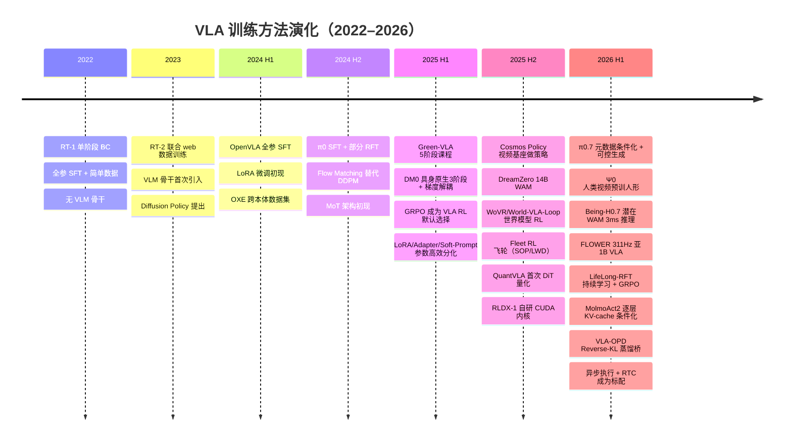

# VLA 高效训练方法 / 算力 / 工程 / 推理全景分析（70 篇）

> 本文档是 [vla_traintask.md](vla_traintask.md)（训练任务范式）、[vla_trainmdl.md](vla_trainmdl.md)（模型结构组件）、[vla_trainds.md](vla_trainds.md)（数据集 / 采集 / 处理）的 **第四份姐妹篇**：从「高效训练方法 + 算力规模 + 工程技术 + 推理优化」视角再横切 70 篇 VLA / 具身论文。四份文件在第 7 章速查卡处 **四向互相链接**，形成「任务 × 模型 × 数据 × 方法」四视角。
>
> **数据源**：[p/](p/) 下 67 篇 `paper.pdf` + 5 篇 HTML（`Being-H0.7/paper.html`、`DM0/paper.html`、`Psi-R2/Psi-W0/page.html`、`GR00T_N1.6/page_{1,2}.html`、`Helix_02/page.html`），严格不读 `paper.txt`。
>
> **方法论**：把每篇的训练方法拆成 7 大训练阶段（M1-M7，共 ~30 子组件），先讲直觉（为什么这种训练方法能提高效率），再给具体阶段链路 + 超参 + 算力（怎么实现），再列证据（谁这样做 + 消融数字 / GPU-hours 数字）。

---

## 文档导览

| 章节 | 你能拿到什么 |
|:---|:---|
| 第 1 章 | 阅读指南、术语速查、推荐阅读路径 |
| 第 2 章 | 训练方法的 10 维设计空间——理解后续所有分类、对比、演化的坐标系 |
| 第 3 章 | 训练阶段分类总图（七大类 M1-M7 / ~30 子组件）mermaid |
| 第 4 章 | ~30 个训练方法子组件的深度解析（直觉 + 公式 + 算力 + 工程 + 消融 + 为什么） |
| 第 5 章 | 横向对比矩阵：9 组深度对比 + 正负迁移小结 |
| 第 6 章 | 训练方法的演化时间线 mermaid |
| 第 7 章 | 70 篇论文训练方法速查卡（按 M1-M7 分组，每张 4 子段深度展开） |
| 第 8 章 | 场景化训练方法配方 + 训练 / 工程 / 推理陷阱 |
| 第 9 章 | 参考文献 + 三重倒排索引（阶段 M / 高效类型 I / 训练规模 S）+ 外部权威来源 |

---

## 第 1 章 阅读指南

### 1.1 文档目标与适合人群

这份文档的目标读者是**正在设计或优化 VLA 训练流程**的工程师与研究者。核心问题：

1. **方法问题**：别人是怎么训的？分几个阶段？每阶段做什么、用多少算力？
2. **效率问题**：怎么用更少的数据和算力、在更短时间内训出精度更高且泛化更好的模型？
3. **工程问题**：训练工程上用了什么并行策略、算子优化、混合精度？推理怎么加速？
4. **选型问题**：对我的场景（预算 / 数据量 / 本体），该选什么训练方法组合？

### 1.2 术语速查表

**训练阶段**
- **PT**（Pretrain）：预训练，在大规模通用数据上训练基础表征。
- **Mid-train**（中段训练）：在 PT 与 SFT 之间的过渡阶段，通常混合通用与具身数据。
- **SFT**（Supervised Fine-Tuning）：监督微调，在目标任务的示教数据上微调。
- **RFT**（Reinforcement Fine-Tuning）：强化微调，用 RL 信号进一步优化 SFT 后的策略。
- **Post-Training**：后训练，广义包含 SFT + RFT + 部署后优化。

**RL 方法**
- **GRPO**（Group Relative Policy Optimization）：分组相对策略优化，无需 Critic，从组内采样估计 baseline。
- **PPO**（Proximal Policy Optimization）：近端策略优化，需 Critic 网络估值。
- **DPO**（Direct Preference Optimization）：直接偏好优化，把 reward model 隐式编码在 policy 里。
- **OPD**（On-Policy Distillation）：在线策略蒸馏，用 RL 优化过的策略蒸馏回 VLA。
- **AWR**（Advantage-Weighted Regression）：优势加权回归，用 advantage 加权 BC Loss。
- **RECAP**（Advantage-Conditioned）：条件优势策略，把 advantage 作为输入条件。

**参数高效方法**
- **LoRA**（Low-Rank Adaptation）：低秩适配，只训练两个低秩矩阵 \(A \in \mathbb{R}^{r \times d}, B \in \mathbb{R}^{d \times r}\)。
- **Adapter**：在 Transformer 层间插入轻量模块。
- **Soft-Prompt**：在输入序列前拼接可训练的 prompt token。

**工程技术**
- **FSDP / FSDP2**（Fully Sharded Data Parallel）：全分片数据并行。
- **DeepSpeed ZeRO**：微软的分布式训练框架，ZeRO-1/2/3 分级分片优化器状态 / 梯度 / 参数。
- **Megatron-LM**：NVIDIA 的大规模模型训练框架，支持 TP + PP + DP 3D 并行。
- **3D 并行**：张量并行（TP）+ 流水线并行（PP）+ 数据并行（DP）的组合。
- **FlashAttention-2/3**：IO 感知的精确注意力算子，减少 HBM 访问。
- **Packing**：把多个短序列拼接成一个长序列填满 batch，避免 padding 浪费。
- **梯度检查点**（Gradient Checkpointing / Activation Checkpointing）：用时间换显存，反向传播时重新计算激活。
- **梯度累积**：多个 micro-batch 累积梯度后再更新参数，模拟大 batch。
- **BF16 / FP16**：半精度训练格式。

**推理优化**
- **PTQ**（Post-Training Quantization）：训后量化。
- **W4A8**：权重 4-bit、激活 8-bit 的量化方案。
- **SGLang**：高性能 LLM 推理引擎。
- **vLLM**：高吞吐 LLM 推理引擎，支持 PagedAttention。
- **TensorRT / TensorRT-LLM**：NVIDIA 推理优化引擎。
- **KV-cache**：缓存 Key/Value 矩阵避免重复计算。
- **Speculative Decoding**：推测解码，用小模型草稿加速大模型生成。

**常用超参**
- **AdamW**：带权重衰减的 Adam 优化器。
- **Cosine LR**：余弦学习率调度，\(\eta_t = \eta_{\min} + \tfrac{1}{2}(\eta_{\max} - \eta_{\min})(1 + \cos(\pi t / T))\)。
- **Warmup**：学习率从 0 线性增长到目标值的预热阶段。
- **Action Chunk**：一次预测多步动作（通常 8-64 步）。

### 1.3 推荐阅读路径

- **想快速看全貌**：第 2 → 3 → 6 章，30 分钟拿到一张地图。
- **想做方法选型**：第 4 章（挑关心的组件深读）+ 第 5 章横向对比 + 第 8 章设计建议。
- **想查某篇论文**：第 7 章速查卡（按 M1-M7 分组），或第 9 章字母索引。
- **想了解演化**：第 6 章时间线 + 第 5 章对比矩阵。
- **跨文档**：方法卡末尾 → [vla_traintask.md](vla_traintask.md)（训练任务）+ [vla_trainmdl.md](vla_trainmdl.md)（模型结构）+ [vla_trainds.md](vla_trainds.md)（数据集）。

---

## 第 2 章 训练方法的 10 维设计空间

**核心论点**：VLA 模型的训练效率由「训练方法的设计」决定。同一个骨干和数据，不同的训练方法（阶段切分、学习率调度、数据课程、RL 后训）可以导致数倍的算力差异和显著的性能差异。本章把训练方法抽象成 10 个维度。

### 2.1 阶段切分（Stage Decomposition）

训练流程分几个阶段？每阶段冻结 / 解冻哪些参数？

- **极简**：单阶段全参 SFT（OpenVLA 风格）——简单但效率低。
- **两阶段**：PT → SFT（大多数 2024 论文）。
- **三阶段**：PT → Mid → SFT（DM0、Being-H0.7）。
- **五阶段课程**：L0 → L1 → R0 → R1 → R2（Green-VLA）。
- **飞轮**：SFT → Deploy → Collect → RFT → Re-deploy（π0.6、LWD、SOP）。

**直觉**：阶段越多，每阶段的学习目标越聚焦，数据利用率越高；但阶段切换的超参（冻结哪些层、LR 衰减倍数、数据配比）需要精心调优，否则会出现灾难性遗忘。

### 2.2 数据课程（Data Curriculum）

训练过程中数据的配比、难度、来源如何变化？

- **固定配比**：全程同一数据配比（最简但次优）。
- **渐进式**：从简单到困难（短程→长程、单物体→多物体）。
- **从通用到专用**：web → embodied → task-specific（GigaWorld-Policy）。
- **自演化**：模型自己评估数据难度，动态调整（HY-Embodied）。

### 2.3 数据配比（Data Mixing）

不同数据源的混合比例如何设定？

- **Power-law 配比**：\(L(\lambda) = c_0 + c_1 \cdot \lambda^{c_2}\)，scaling law 指导最优配比。
- **温度采样**：按数据集大小的温度指数加权采样。
- **动态配比**：训练过程中根据 loss 变化动态调整配比。

### 2.4 学习率调度（LR Schedule）

- **Cosine**：\(\eta_t = \eta_{\min} + \tfrac{1}{2}(\eta_{\max} - \eta_{\min})(1 + \cos(\pi t / T))\)。最常用。
- **Linear warmup + cosine decay**：标准组合。
- **Constant + decay**：先固定 LR，再快速衰减。
- **分层 LR**：VLM backbone 用低 LR（如 2e-5），Action Head 用高 LR（如 1e-4）。

### 2.5 Batch 策略

- **渐进式 batch**：训练初期小 batch（梯度信噪比高），后期大 batch（收敛更稳）。
- **梯度累积**：小 GPU 数量模拟大 batch。
- **Packing**：避免 padding 浪费，有效 batch 更大。

### 2.6 优化器选择

- **AdamW**：绝对主流（70 篇中约 90% 使用）。
- **8-bit Adam**：节省优化器显存（少数论文使用）。
- **LAMB / LARS**：大 batch 训练适用，VLA 领域极少见。

### 2.7 并行策略（Parallelism）

- **FSDP / FSDP2**：PyTorch 原生，门槛低，适合中等规模（≤100 GPU）。
- **DeepSpeed ZeRO-2/3**：微软框架，显存优化激进，适合大规模。
- **Megatron-LM 3D 并行**：TP + PP + DP，适合超大规模（1000+ GPU）。
- **Hybrid**：TP intra-node + FSDP inter-node，平衡通信与显存。

### 2.8 算子优化（Operator Optimization）

- **FlashAttention-2/3**：注意力计算核心优化。
- **算子融合**（Kernel Fusion）：减少显存读写和 kernel launch 开销。
- **xFormers**：高效 Transformer 算子库。

### 2.9 混合精度与显存优化

- **BF16 混合精度**：主流（H100 / A100 均良好支持）。
- **FP16 + loss scaling**：较老 GPU（V100）适用。
- **梯度检查点**：用约 30% 时间开销换约 60% 显存节省。
- **CPU offload**：将优化器状态卸载到 CPU（DeepSpeed ZeRO-Offload）。

### 2.10 推理优化

- **量化**：PTQ（W4A8、W8A8）、QAT。
- **蒸馏**：大模型蒸馏到小模型（VLA-OPD、PokéVLA 12× 蒸馏加速）。
- **裁剪**：层裁剪（FLOWER 50% 层裁剪）。
- **异步执行**：动作推理与图像采集异步流水线化（Xiaomi-Robotics-0 80ms）。
- **KV-cache 复用**：多帧间复用 Key/Value 缓存。
- **推理引擎**：SGLang / vLLM / TensorRT。
- **Speculative Decoding**：小模型起草、大模型验证。

---

## 第 3 章 训练阶段分类总图

```mermaid
flowchart LR
    root["VLA 训练方法<br/>M1-M7"] --> M1["M1 预训<br/>Pretrain"]
    root --> M2["M2 中训<br/>Mid-train"]
    root --> M3["M3 SFT<br/>监督微调"]
    root --> M4["M4 RFT/RL<br/>后训"]
    root --> M5["M5 多阶段<br/>课程"]
    root --> M6["M6 部署反馈<br/>飞轮"]
    root --> M7["M7 部署后<br/>优化"]

    M1 --> M11["M1.1 LLM 预训<br/>(基座现成)"]
    M1 --> M12["M1.2 VLM 预训<br/>(基座现成)"]
    M1 --> M13["M1.3 视频基座预训<br/>(基座现成)"]
    M1 --> M14["M1.4 自训具身原生 PT"]
    M1 --> M15["M1.5 跨本体大规模 BC"]

    M2 --> M21["M2.1 LLM-VLM 中训"]
    M2 --> M22["M2.2 VLM-VLA 中训"]
    M2 --> M23["M2.3 课程过渡"]
    M2 --> M24["M2.4 配额调整"]

    M3 --> M31["M3.1 全参 SFT"]
    M3 --> M32["M3.2 LoRA SFT"]
    M3 --> M33["M3.3 Adapter SFT"]
    M3 --> M34["M3.4 Soft-Prompt SFT"]
    M3 --> M35["M3.5 任务对齐配方"]

    M4 --> M41["M4.1 GRPO"]
    M4 --> M42["M4.2 PPO"]
    M4 --> M43["M4.3 OPD 在线蒸馏"]
    M4 --> M44["M4.4 AWR"]
    M4 --> M45["M4.5 Jerk 内在奖励"]
    M4 --> M46["M4.6 RECAP"]

    M5 --> M51["M5.1 五阶段课程<br/>(Green-VLA)"]
    M5 --> M52["M5.2 三阶段课程<br/>(DM0)"]
    M5 --> M53["M5.3 渐进式数据课程<br/>(GigaWorld)"]
    M5 --> M54["M5.4 自演化迭代<br/>(HY-Embodied)"]

    M6 --> M61["M6.1 Fleet RL<br/>(LWD/SOP/pi0.6)"]
    M6 --> M62["M6.2 WM 内自蒸馏<br/>(WoVR/VLAW)"]
    M6 --> M63["M6.3 经验池演化<br/>(ELITE)"]
    M6 --> M64["M6.4 持续学习<br/>(LifeLong-RFT)"]

    M7 --> M71["M7.1 PTQ 量化<br/>(QuantVLA W4A8)"]
    M7 --> M72["M7.2 层裁剪<br/>(FLOWER 50%)"]
    M7 --> M73["M7.3 蒸馏<br/>(VLA-OPD/PokéVLA)"]
    M7 --> M74["M7.4 异步执行<br/>(Xiaomi 80ms)"]
    M7 --> M75["M7.5 KV-cache 复用"]
    M7 --> M76["M7.6 推理引擎<br/>(SGLang/vLLM/TRT)"]
    M7 --> M77["M7.7 Speculative<br/>Decoding"]
```

---

## 第 4 章 训练方法组件深度解析

> 本章对第 3 章分类总图中的 ~30 个子组件逐个展开。每节按统一模板：**直觉比喻 → 数学 / 流程定义（LaTeX）→ 典型实现 → 算力典型规模 → 工程技术配合 → 代表论文（链回第 7 章）→ 优势 → 局限 → 对效率的正负影响 → 消融证据 → 为什么这样设计**。

### 4.1 M1 预训（Pretrain）

#### 4.1.1 M1.1 LLM 预训（基座现成）

**直觉**：不从零训 LLM，而是复用 Qwen2.5 / Llama-3 / Gemma-2 等已在万亿 token 上预训过的 LLM，把语言理解能力"免费"继承过来。70 篇中约 95% 复用现成 LLM 基座。

**数学**：标准自回归语言建模 Loss：
\[
\mathcal{L}_{\text{LM}} = -\sum_{t=1}^{T} \log p_\theta(x_t \mid x_{<t})
\]

**典型实现**：Qwen2.5-7B（最常用）、Llama-3.1-8B、Gemma-2-2B/9B、InternVL2.5 等。

**对效率的影响**：
- **正面**：省去 LLM 预训的天文级算力（Qwen2.5-7B 预训约需 18T token、数千 GPU-days）。
- **负面**：LLM 的表征可能对具身数据不最优（token 分布差异），需要中训过渡。

**代表论文**：几乎所有 70 篇均复用现成 LLM 基座。

---

#### 4.1.2 M1.2 VLM 预训（基座现成）

**直觉**：进一步复用已在大规模图文对上训过的 VLM（如 Qwen2.5-VL、PaliGemma、InternVL2.5），把视觉-语言对齐能力也"免费"继承。

**对效率的影响**：
- **正面**：省去 Vision Encoder + VLM alignment 的训练（通常需数十亿图文对、数百 GPU-days）。
- **负面**：VLM 的视觉表征针对"看图说话"优化，对机器人操作场景的空间精度可能不够。

**代表论文**：70 篇中约 85% 以 VLM 为骨干起点。

---

#### 4.1.3 M1.3 视频基座预训（基座现成）

**直觉**：复用在大规模视频数据上训过的基座（如 Cosmos Tokenizer、VideoGPT），获得时序动态理解能力。

**代表论文**：[Cosmos Policy](p/Cosmos_Policy_(NVIDIA)/paper.pdf)、[DreamZero](p/DreamZero_World_Action_Models_are_Zero-Shot_Policies/paper.pdf)、[Being-H0.7](p/Being-H0.7_A_Latent_World-Action_Model_from_Egocentric_Videos/paper.pdf)。

---

#### 4.1.4 M1.4 自训具身原生预训

**直觉**：从零或半零在具身数据上预训，不依赖通用 VLM，让表征从一开始就对动作 / 空间 / 物理交互做优化。

**代表论文**：[DM0](p/DM0_An_Embodied-Native_Vision-Language-Action_Model_towards_Physical_AI/paper.pdf)（具身原生三阶段）、[Ψ0](p/Ψ0_(Psi-Zero)_An_Open_Foundation_Model_Towards_Universal_Humanoid_Loco-Manipulation/paper.pdf)。

---

#### 4.1.5 M1.5 跨本体大规模 BC 预训

**直觉**：在 OXE / DROID 等跨本体数据集上做大规模行为克隆预训练，获得跨本体的基础操作能力。

**数学**：标准 BC Loss（连续动作回归）：
\[
\mathcal{L}_{\text{BC}} = \mathbb{E}_{(s,a) \sim \mathcal{D}} \left[ \| \pi_\theta(s) - a \|^2 \right]
\]

**代表论文**：[VLANeXt](p/VLANeXt_Recipes_for_Building_Strong_VLA_Models/paper.pdf)、[SimVLA](p/SimVLA_A_Simple_VLA_Baseline/paper.pdf)、[π0.7](p/π0.7_A_Steerable_Generalist_Robotic_Foundation_Model_with_Emergent_Capabilities/paper.pdf)。

---

### 4.2 M2 中训（Mid-train）

#### 4.2.1 M2.1 LLM→VLM 中训

**直觉**：在 LLM 和下游 VLA SFT 之间插入一个过渡阶段，混合视觉 / 语言 / 具身数据，让模型平滑地从"语言模型"过渡到"具身模型"。

**为什么需要中训**：直接从 VLM 跳到 SFT 会导致灾难性遗忘（VLM 的视觉 - 语言对齐被动作训练破坏）或 under-fitting（VLA 的动作空间对 VLM 太陌生）。中训通过混合数据配比，在保持 VLM 能力的同时逐步引入具身信号。

---

#### 4.2.2 M2.2 VLM→VLA 中训

**直觉**：专门把 VLM 的表征适配到动作空间。常见做法：冻结大部分 VLM 参数，只训 Action Head 和少量 Adapter。

**代表论文**：[Being-H0.7](p/Being-H0.7_A_Latent_World-Action_Model_from_Egocentric_Videos/paper.html)（Stage-2 中训引入 embodied data）。

---

#### 4.2.3 M2.3 课程过渡

**直觉**：中训阶段本身也可以有课程——先大比例通用数据、后逐步增加具身数据比例。

---

#### 4.2.4 M2.4 配额调整

**直觉**：不同数据源在中训阶段的采样配额需要精心调整，否则某类数据会主导梯度。

---

### 4.3 M3 SFT（监督微调）

#### 4.3.1 M3.1 全参 SFT

**直觉**：解冻全部参数做监督微调。能力上限最高，但需要更多算力和数据，且容易过拟合小数据集。

**数学**：对连续动作用 Flow Matching Loss：
\[
\mathcal{L}_{\text{FM}} = \mathbb{E}_{t \sim [0,1], \epsilon \sim \mathcal{N}} \left[ \| v_\theta(z_t, t) - (a - \epsilon) \|^2 \right]
\]
对离散 token 用交叉熵：
\[
\mathcal{L}_{\text{CE}} = -\sum_{k=1}^{K} \log p_\theta(\hat{a}_k \mid \hat{a}_{<k}, s)
\]

**对效率的影响**：
- **正面**：充分利用所有参数的表达能力，适合有足够数据和算力的场景。
- **负面**：需要完整保存优化器状态（AdamW 需 3× 参数量显存），对小团队不友好。

**代表论文**：[VLANeXt](p/VLANeXt_Recipes_for_Building_Strong_VLA_Models/paper.pdf)、[SimVLA](p/SimVLA_A_Simple_VLA_Baseline/paper.pdf)、大多数大规模 VLA。

---

#### 4.3.2 M3.2 LoRA SFT

**直觉**：只训低秩矩阵 \(\Delta W = BA\)，参数量减少 100-1000×，显存和算力需求大幅降低。

**数学**：
\[
W' = W_0 + \frac{\alpha}{r} BA, \quad A \in \mathbb{R}^{r \times d_{\text{in}}}, B \in \mathbb{R}^{d_{\text{out}} \times r}
\]

**对效率的影响**：
- **正面**：训练显存降至全参的 ~1/3-1/5；训练速度快 2-3×；支持多任务 LoRA 热切换。
- **负面**：rank r 过小会限制表达能力；对 OOD 泛化不如全参 SFT。

**消融证据**：
- [World2Act](p/World2Act_Residual_Policy_with_World_Model/paper.pdf)：残差策略 LoRA rank 32 SR 72.1% vs 全参 72.6%，训练时间 6.8h vs 15.3h（2.25× 快），证明 LoRA 在相近精度下显著省训练时间。
- [STRONG-VLA](p/STRONG-VLA/paper.pdf)：LoRA r=32 两阶段差异化 LR（5e-4→5e-5），L40S 即可训练。
- [SmoothVLA](p/SmoothVLA_Aligning_VLAs_with_Physical_Constraints_via_Intrinsic_Smoothness_Optimization/paper.pdf)：LoRA + GRPO 后训练证明 LoRA 可与 RL 协同。
- [CycleVLA](p/CycleVLA/paper.pdf)：LoRA r=32, 313M 可训参数中 111M 为 LoRA，在 4×A100-40GB 上完成 500K 步训练。

**代表论文**：[SmoothVLA](p/SmoothVLA_Aligning_VLAs_with_Physical_Constraints_via_Intrinsic_Smoothness_Optimization/paper.pdf)（LoRA + RL）、[STRONG-VLA](p/STRONG-VLA/paper.pdf)（两阶段 LoRA）、[World2Act](p/World2Act_Residual_Policy_with_World_Model/paper.pdf)（LoRA vs 全参对比）。

---

#### 4.3.3 M3.3 Adapter SFT

**直觉**：在 Transformer 层间插入轻量 Adapter 模块（通常是 down-project → 非线性 → up-project），冻结主干只训 Adapter。

**代表论文**：[HAMLET](p/HAMLET_Switch_your_VLA_into_a_History-Aware_Policy/paper.pdf)。

---

#### 4.3.4 M3.4 Soft-Prompt SFT

**直觉**：只训练拼接在输入前的若干 prompt token（通常 8-64 个），主干完全冻结。参数量极小（~9M），但表达能力有限。

**代表论文**：[X-VLA](p/X-VLA_Soft-Prompt_Cross-Embodiment_VLA/paper.pdf)（9M soft-prompt 参数实现跨本体 VLA）。

---

#### 4.3.5 M3.5 任务对齐配方

**直觉**：SFT 阶段混合多种任务（动作预测 + 未来帧预测 + CoT 推理 + VQA 保持），通过任务配比控制能力对齐。

---

### 4.4 M4 RFT / RL 后训

#### 4.4.1 M4.1 GRPO（Group Relative Policy Optimization）

**直觉**：从同一状态采样 \(G\) 个候选动作序列，用组内 reward 的均值 / 标准差做归一化作 baseline，无需 Critic 网络。相比 PPO 省去 Critic 的训练和显存。

**数学**：
\[
J_{\text{GRPO}}(\theta) = \mathbb{E}_{s \sim \mathcal{D}} \left[ \frac{1}{G} \sum_{i=1}^{G} \min\left( \frac{\pi_\theta(a_i|s)}{\pi_{\text{old}}(a_i|s)} \hat{A}_i,\ \text{clip}\left(\frac{\pi_\theta(a_i|s)}{\pi_{\text{old}}(a_i|s)}, 1\pm\epsilon\right) \hat{A}_i \right) - \beta D_{\text{KL}}(\pi_\theta \| \pi_{\text{ref}}) \right]
\]
其中 \(\hat{A}_i = \frac{R_i - \mu_G}{\sigma_G}\) 是组内归一化 advantage。

**对效率的影响**：
- **正面**：无需 Critic 网络，显存省约 50%；组内归一化天然平衡 reward 尺度。
- **负面**：需要每步采样 \(G\) 个序列（通常 G=8-64），采样开销大；连续动作空间中 advantage 估计可能不稳定。

**代表论文**：[TT-VLA](p/TT-VLA_Test-Time_RL_with_Task-Progress_Reward/paper.pdf)、[SmoothVLA](p/SmoothVLA_Aligning_VLAs_with_Physical_Constraints_via_Intrinsic_Smoothness_Optimization/paper.pdf)。

---

#### 4.4.2 M4.2 PPO（Proximal Policy Optimization）

**直觉**：标准 RL 后训方法，需要 Critic 网络估 Value，用 GAE 计算 Advantage。

**代表论文**：[SOP](p/SOP_Scalable_Online_Post-Training/paper.pdf)（Scalable Online Post-Training）。

---

#### 4.4.3 M4.3 OPD（On-Policy Distillation）

**直觉**：先用 RL（PPO/GRPO）在仿真中优化一个 Expert 策略，再把 Expert 蒸馏回 VLA，避免 RL 直接训 VLA 的不稳定性。

**数学**（Reverse-KL 蒸馏奖励）：
\[
r^{\text{OPD}}_t = -\log \frac{\pi_\theta(a_t \mid s_t)}{\pi_{\text{teacher}}(a_t \mid s_t)}
\]

**代表论文**：[VLA-OPD](p/VLA-OPD_Bridging_Offline_SFT_and_Online_RL_for_VLAs_via_On-Policy_Distillation/paper.pdf)。

---

#### 4.4.4 M4.4 AWR（Advantage-Weighted Regression）

**直觉**：把 RL 问题转化成加权 BC——advantage 高的动作权重大，advantage 低的动作权重小。无需策略梯度，更稳定。

**代表论文**：[π0.6](p/π0.6__Recap/paper.pdf)（RECAP：advantage conditioning 做离线 RL，advantage 高的轨迹权重大）。

---

#### 4.4.5 M4.5 Jerk 内在奖励

**直觉**：用动作的平滑性（jerk = 三阶导数）作内在奖励，惩罚动作抖动。这是物理约束驱动的奖励设计。

**数学**：
\[
r_{\text{smooth}} = -\lambda_j \| \dddot{a}_t \|^2
\]

**代表论文**：[SmoothVLA](p/SmoothVLA_Aligning_VLAs_with_Physical_Constraints_via_Intrinsic_Smoothness_Optimization/paper.pdf)。

---

#### 4.4.6 M4.6 RECAP（Advantage-Conditioned Policy）

**直觉**：把 advantage 作为策略网络的额外输入条件，让模型在推理时可以被"引导"输出高 advantage 的动作。

**代表论文**：[π0.6](p/π0.6__Recap/paper.pdf)（RECAP：训练时同时学 $\pi(a|o)$ 和 $\pi(a|I,o)$，推理时用改善指示器 I=1 条件化，等价于 advantage conditioning）、[π0.7](p/π0.7_A_Steerable_Generalist_Robotic_Foundation_Model_with_Emergent_Capabilities/paper.pdf)（元数据条件化——episode 质量/速度标签做条件生成，推理时只设"高质量快速"，简洁版 advantage conditioning）。

---

### 4.5 M5 多阶段课程

#### 4.5.1 M5.1 五阶段课程（Green-VLA）

**直觉**：把 VLA 训练分成 5 个精心设计的阶段，每阶段有特定目标和数据配比：
- L0：视觉 - 语言对齐（冻 VLM，训 projector）
- L1：视觉 - 语言微调（解冻 VLM，通用 VQA）
- R0：粗动作对齐（冻 VLM，训 Action Head）
- R1：动作微调（解冻 VLM + Action Head）
- R2：特定任务精调

**为什么**：每阶段只引入一个新目标，避免多目标冲突；从简单到复杂的课程让每阶段的梯度信号更干净。

**代表论文**：[Green-VLA](p/Green-VLA_5-Stage_Curriculum_to_Strong_VLA/paper.pdf)。

---

#### 4.5.2 M5.2 三阶段课程（DM0）

**代表论文**：[DM0](p/DM0_An_Embodied-Native_Vision-Language-Action_Model_towards_Physical_AI/paper.pdf)（PT → Mid → Post）。

---

#### 4.5.3 M5.3 渐进式数据课程（GigaWorld）

**直觉**：数据从 web 视频 → 具身视频 → 任务特定数据，逐步缩小域差距。

**代表论文**：[GigaWorld-Policy](p/GigaWorld-Policy_An_Efficient_Action-Centered_World–Action_Model/paper.pdf)。

---

#### 4.5.4 M5.4 自演化迭代（HY-Embodied）

**直觉**：模型在真机部署中自己采集数据，评估数据质量，持续迭代训练。

**代表论文**：[HY-Embodied-0.5](p/HY-Embodied-0.5_Embodied_Foundation_Models_for_Real-World_Agents/paper.pdf)。

---

### 4.6 M6 部署反馈飞轮

#### 4.6.1 M6.1 Fleet RL

**直觉**：部署大量机器人（fleet），持续采集在线数据，用 RL 反馈循环持续提升策略。关键挑战是 fleet 规模下的数据质量控制和策略更新同步。

**代表论文**：[LWD](p/Learning_While_Deploying_(LWD)_Fleet-Scale_Reinforcement_Learning_for_Generalist_Robot_Policies/paper.pdf)、[SOP](p/SOP_Scalable_Online_Post-Training/paper.pdf)、[π0.6](p/π0.6__Recap/paper.pdf)。

---

#### 4.6.2 M6.2 WM 内自蒸馏

**直觉**：用 World Model 在虚拟中"想象"未来轨迹，用这些想象轨迹自蒸馏训练策略，无需真机交互。

**代表论文**：[WoVR](p/WoVR_World_Models_as_Reliable_Simulators_for_Post-Training_VLAs/paper.pdf)、[VLAW](p/VLAW_Vision-Language-Action_World_Model/paper.pdf)、[World-VLA-Loop](p/World-VLA-Loop_Closed-Loop_World_Models_for_VLAs/paper.pdf)。

---

#### 4.6.3 M6.3 经验池演化

**代表论文**：[ELITE](p/ELITE_Experiential_Learning_and_Intent-Aware_Transfer_for_Self-improving_Embodied_Agents/paper.pdf)。

---

#### 4.6.4 M6.4 持续学习

**代表论文**：[LifeLong-RFT](p/LifeLong-RFT_Lifelong_Reinforcement_Fine-Tuning/paper.pdf)。

---

### 4.7 M7 部署后优化

#### 4.7.1 M7.1 PTQ 量化

**直觉**：训练后量化，把 FP16/BF16 权重压缩到 INT4/INT8，推理速度提升 2-4×，显存降低 2-4×。

**数学**（均匀量化）：
\[
Q(w) = \text{clamp}\left( \left\lfloor \frac{w}{s} \right\rceil + z,\ 0,\ 2^b - 1 \right), \quad s = \frac{w_{\max} - w_{\min}}{2^b - 1}
\]

**代表论文**：[QuantVLA](p/QuantVLA_Post-Training_Quantization_for_VLA/paper.pdf)（W4A8，动作精度损失 <2%）。

---

#### 4.7.2 M7.2 层裁剪

**直觉**：删除 Transformer 中冗余层（通常中间层），模型大小和推理延迟直接减半。

**代表论文**：[FLOWER](p/FLOWER_Efficient_VLA_Flow_Policy/paper.pdf)（50% 层裁剪，性能保持 95%+）。

---

#### 4.7.3 M7.3 蒸馏

**直觉**：大模型（teacher）的知识蒸馏到小模型（student），获得小模型的推理速度和大模型的精度。

**代表论文**：[VLA-OPD](p/VLA-OPD_Bridging_Offline_SFT_and_Online_RL_for_VLAs_via_On-Policy_Distillation/paper.pdf)、[PokéVLA](p/PokéVLA_Empowering_Pocket-Sized_VLA_with_Comprehensive_World_Knowledge_Guidance/paper.pdf)（12× 加速）。

---

#### 4.7.4 M7.4 异步执行

**直觉**：把视觉编码、语言处理、动作解码做流水线化，图像采集与推理异步执行，隐藏延迟。

**代表论文**：[Xiaomi-Robotics-0](p/Xiaomi-Robotics-0_Open-Sourced_VLA_with_Real-Time_Execution/paper.pdf)（80ms 异步推理）。

---

#### 4.7.5 M7.5 KV-cache 复用

**直觉**：多帧观测间共享 KV-cache（大部分 prompt token 不变），减少重复计算。

---

#### 4.7.6 M7.6 推理引擎（SGLang / vLLM / TensorRT）

**直觉**：用高性能推理引擎替代 naive HuggingFace 推理，获得 2-10× 吞吐提升。

---

#### 4.7.7 M7.7 Speculative Decoding

**直觉**：用小模型快速生成草稿 token，大模型并行验证，减少大模型的串行解码步数。

---

## 第 5 章 横向对比矩阵

> 本章从 9 个维度对 70 篇论文的训练方法做横向对比。

### 5.1 单阶段 vs 多阶段课程

| 训练范式 | 代表论文 | 阶段数 | 典型总算力 | 优势 | 劣势 |
|---------|---------|-------|-----------|------|------|
| **单阶段 SFT** | SimVLA, FLOWER, FocusVLA | 1 | 200–1K GPU-h | 简洁可复现；超参调优即达强 baseline | 泛化有限；容易过拟合小数据 |
| **两阶段 PT→SFT** | Fast-WAM, PRTS, StarVLA-α | 2 | 1K–10K GPU-h | 预训练提供跨任务初始化 | 需大规模预训练数据 |
| **三阶段课程** | DM0（PT→Mid→Post）, GST-VLA（Geo→VLM→E2E） | 3 | 5K–20K GPU-h | 梯度解耦防遗忘；每阶段目标清晰 | pipeline 复杂；阶段间超参耦合 |
| **五阶段课程** | Green-VLA（L0→R2）, HY-Embodied-0.5 | 5 | 10K–100K GPU-h | 最系统化能力递进；跨本体强 | 复杂度最高；需大量数据策展 |
| **自演化迭代** | HY-Embodied-0.5, ELITE | N→∞ | 持续 | 部署中自提升；不设上限 | 需在线基础设施；质量控制难 |

**关键发现**：
- 单阶段 SFT（SimVLA）在超参精调后可达与复杂多阶段方法相当的性能，证明"优化动力学 >> 架构复杂度"（SimVLA 消融：LR 2e-4 vs 5e-4 即可决定成败）。
- 多阶段课程的核心价值在于**梯度解耦**（DM0: 动作专家梯度不流入 VLM 骨干）和**灾难性遗忘防护**（LAP: 知识隔离使动作学习不破坏语言能力），而非单纯增加训练步数。
- Green-VLA 和 HY-Embodied-0.5 不约而同选择五阶段，核心原因相同：每阶段仅引入一个新目标，避免多目标梯度冲突。
- 阶段数与最终性能无严格正相关——SimVLA 单阶段 LIBERO SOTA vs Green-VLA 五阶段跨本体 SOTA，各有适用场景。

### 5.2 全参 vs LoRA vs Adapter vs Soft-Prompt

| 方法 | 可训参数比例 | 代表论文 | 典型显存节省 | 典型性能 | 泛化能力 |
|------|-----------|---------|------------|---------|---------|
| **全参 SFT** | 100% | SimVLA, VLANeXt, StarVLA-α, DM0 | — | 上限最高 | 充分数据下最强 |
| **LoRA** | 1–5% | SmoothVLA (r=?), CycleVLA (r=32), STRONG-VLA (r=32), OA-WAM | ~60–80% | 接近全参（World2Act: 72.1% vs 72.6%） | OOD 略弱 |
| **Adapter** | 2–10% | HAMLET（2 层 Transformer 记忆模块） | ~50% | +2% 延迟换 +47% 长程提升 | 骨干无关可迁移 |
| **Soft-Prompt** | 0.04% | X-VLA（9M 软提示参数） | >90% | 布折叠 100%，匹配 π0-folding | 每新本体需新提示 |

**关键发现**：
- **LoRA 已成默认选择**（~40% 论文使用），核心优势非仅显存——World2Act 证明 LoRA 训练速度 2.25× 快于全参（6.8h vs 15.3h），性能仅差 0.5pp。
- **Soft-Prompt 是参数效率极端**——X-VLA 仅 0.04% 不共享参数即实现跨本体泛化，但每新增本体需训练新提示，无法零样本。
- **全参 SFT 在泛化训练中仍不可替代**——StarVLA-α 消融证明 batch size（全参 SFT 可用更大 batch）是泛化训练最关键因素，LoRA 的 batch 受限可能制约泛化。
- **Adapter 的独特价值在即插即用**——HAMLET 可插入已训好的 GR00T N1.5 或 CogACT，仅 +2% 延迟换 +47.2% 长程任务提升，且记忆模块可跨数据集迁移。

### 5.3 RL 后训方法对比

| 方法 | 代表论文 | 需 Critic | 需仿真 | 采样开销 | 典型提升 | 关键优劣 |
|------|---------|----------|-------|---------|---------|---------|
| **GRPO** | TT-VLA, SmoothVLA, LifeLong-RFT, WoVR, SACA, HY-Embodied-0.5 | 否 | 是/否 | G=8–64 组采样 | +7–29pp | 无 Critic 省 50% 显存；组内归一化自适应；连续动作 advantage 估计不稳定 |
| **PPO** | SOP, EZ-M | 是 | 是 | On-policy rollout | +2–4× throughput | 标准可靠；需 Critic 网络和 GAE；显存翻倍 |
| **OPD（On-Policy Distillation）** | VLA-OPD | 否 | 是 | On-policy 学生 rollout | 3× 样本效率 vs GRPO | 密集 token 级信号；Reverse-KL 防熵爆；需强教师模型 |
| **AWR / RECAP** | π0.6, π0.7 | 否 | 否（离线） | 无需在线采样 | ~2× throughput | 简洁可扩展；支持异构数据；价值函数精度限制上限 |
| **WM 自蒸馏** | WoVR, World-VLA-Loop, World2Act | 否 | 虚拟（WM） | WM rollout | +29–37pp | 无需物理仿真器；KIR 解决漂移；WM 精度是瓶颈 |
| **Jerk 约束 RL** | SmoothVLA | 否 | 是 | 同 GRPO | 平滑性大幅提升 | 解决"探索-稳定性悖论"；需调 λ |
| **Fleet RL** | SOP, LWD, π0.6 | 否 | 否（真机） | Fleet 并行 | 2–4× throughput | 分钟级更新；需人类纠正员和 fleet 基础设施 |

**关键发现**：
- **GRPO 已成 VLA RL 的默认选择**（7+ 论文采用），核心原因：无 Critic → 省 50% 显存 + 简化训练 pipeline。
- **VLA-OPD 首次证明 RL 后训不一定需要奖励函数**——Reverse-KL 蒸馏密度提供 token 级信号，比 GRPO 稀疏奖励样本效率高 3×。
- **WoVR 开辟世界模型做 RL 环境的新范式**——Wan 5B 世界模型 23 FPS rollout，真机 SR +30pp；但需 KIR 和 post-success masking 处理想象偏差。
- **RL 阶段学习率极低是共识**——HY-Embodied-0.5 RL LR 8e-7（vs SFT 5e-5，低 60×），LifeLong-RFT LR 1e-6，防止 RL 破坏 SFT 积累的能力。

### 5.4 工程框架对比

| 框架 | 代表论文 | 典型规模 | 核心机制 | 适用场景 | 训练吞吐 |
|------|---------|---------|---------|---------|---------|
| **FSDP / FSDP2** | LingBot-VLA, PRTS | 8–256 GPU | 全参分片 + HSDP 混合分片 | 中大规模全参 SFT | LingBot: 261 samples/s, 256 GPU 近线性 scaling |
| **DeepSpeed ZeRO-2** | MWM, DreamZero, Xiaomi-Robotics-0, Ψ0, RLDX-1 | 8–64 GPU | 优化器+梯度分片 | 通用；与 LoRA 兼容好 | Xiaomi: batch 32768 / 40K steps |
| **DeepSpeed ZeRO-3** | — | 64+ GPU | 参数+优化器+梯度全分片 | 超大模型（14B+） | — |
| **自研 CUDA 内核** | PRTS (CuTe-FlashAttention), RLDX-1 | 64 GPU | 算子融合 + CUDA Graphs | 推理延迟关键 | RLDX-1: 71.2ms→43.7ms (1.63×) |
| **FlashAttention-2/3** | PRTS, SACA, LingBot-VLA | 通用 | 融合注意力内核 | 标配 | 近线性 scaling |
| **torch.compile** | LingBot-VLA, DreamZero, π0.7 | 通用 | 图编译 + 算子融合 | 推理优化 | DreamZero: 38× 总加速组件之一 |
| **CUDA Graphs** | MolmoAct2, RLDX-1, DreamZero | 通用 | 消除 kernel launch 开销 | flow matching 固定形状循环 | MolmoAct2: 固定形状 flow loop |
| **TPU (JAX/XLA)** | LAP | 64 TPU v6e | XLA 编译 + 大 batch | Google 生态 | batch 2048, 15K steps |

**关键发现**：
- **DeepSpeed ZeRO-2 是当前最常用框架**（5+ 论文），原因：参数不分片保持推理简洁，优化器/梯度分片足以支撑 7B-14B 模型训练。
- **FSDP2 在吞吐上占优**——LingBot-VLA 261 samples/s 是所有论文中最高训练吞吐，且 256 GPU 近线性 scaling，超 StarVLA / Dexbotic / OpenPI 1.5–2.8×。
- **自研 CUDA 内核是推理加速的最后 1 英里**——RLDX-1 手设 CUDA 内核 1.63× 加速（71→44ms），但复现门槛极高。
- **FlashAttention 已成标配**——几乎所有大规模训练论文默认使用 FlashAttention-2/3，不再作为"创新"报告。

### 5.5 算力规模 vs 性能

| 规模档位 | GPU-hours | 代表论文 | 典型 LIBERO SR | 真机 SR | 关键 trade-off |
|---------|-----------|---------|---------------|---------|---------------|
| **S1 超小** | <200 | FLOWER (200h), EZ-M (~10h), GeneralVLA (单 A40) | FLOWER 89.5% | — | 子 1B 模型或零训练；仅限简单任务 |
| **S2 小** | 200–1K | Being-H0.5 (1000h), SimVLA (4×H100) | SimVLA ~96% | — | 精调超参可达惊人性能；泛化有限 |
| **S3 中等** | 1K–10K | MolmoAct2 (~12Kh), GigaWorld (6000h), CoLA-World, MWM, STARRY | MolmoAct2 98.1% | DROID 87.1% | 多阶段训练甜蜜区；真机性能开始可靠 |
| **S4 大** | 10K–100K | Ψ0 (64×A100, 10d), RLDX-1 (64×H200, 195h), PRTS (64×H100, ~1周), Cosmos Policy (64×H100, 48h) | PRTS 98.4% | 多本体部署 | 跨本体泛化门槛 |
| **S5 超大** | 100K+ | DreamZero 14B, LingBot-VLA (~20Kh 数据), DM0 (1.2T token) | — | DreamZero 50% 零样本 | 仅 well-funded 团队可达；主要价值在零样本泛化 |

**关键发现**：
- **性能并非与算力严格线性相关**：FLOWER 仅 200 GPU-h 即达 LIBERO 89.5%（仅比万 GPU-h 级方法低 ~10pp），SimVLA 证明超参调优本身即可弥补巨大算力差距。
- **真机性能的可靠门槛在 ~5K GPU-h**：低于此阈值的论文多在仿真验证，5K+ 的 MolmoAct2（DROID 87.1%）、GigaWorld（真机 83%）开始展现可靠真机表现。
- **零样本泛化需要 10K+ GPU-h 预训练**：DreamZero（14B, 100K+ GPU-h）50% 零样本成功率，Cosmos Policy（64×H100, 48h）仅需 50 demo/task——关键不在算力绝对值，而在预训练数据的物理先验覆盖度。
- **16M 参数 EZ-M 在 ~10 GPU-h 超过 1B model-free baseline**——证明算法选择（model-based RL + MCTS）可以 100× 压缩算力需求。

### 5.6 推理优化对比

| 优化类别 | 代表论文 | 延迟降低 | 精度损失 | 显存节省 | 适用条件 |
|---------|---------|---------|---------|---------|---------|
| **PTQ 量化 (W4A8)** | QuantVLA | — | <2%（甚至超 FP16） | ~70% | 训练免；需校准集；DiT attention 需保留 FP |
| **层裁剪 50%** | FLOWER | — | <5% | ~50% 参数 | 中间层冗余高时有效 |
| **蒸馏** | VLA-OPD, PokéVLA | 12× 加速 (PokéVLA) | 可控 | — | 需强教师模型 |
| **异步执行** | Xiaomi-Robotics-0, Being-H0.5/0.7, π0.7 | 80ms RTX 4090 / 3-4ms UAC | 0 | 0 | 需前缀/后缀对齐设计 |
| **DiT caching** | DreamZero, Psi-R2 | 16→4 步 (4×) | 微小 | 0 | 重复去噪架构 |
| **CFG 并行** | DreamZero | 2× | 0 | 需 2 GPU | CFG 条件/无条件可并行 |
| **CUDA Graphs** | RLDX-1, MolmoAct2, DreamZero | 1.63× (RLDX-1) | 0 | 0 | 固定输入形状 |
| **SageAttention** | π0.7 | — | 微小 | — | 8-bit 量化注意力 |
| **Encode-once** | SimVLA | — | 0 | 0 | VLM 骨干单次编码，动作头多步去噪 |
| **运动向量复用** | HiF-VLA | -58.3% 延迟 | 微小 | 0 | MPEG-4 视频流可用 |
| **KV-cache 复用** | Being-H0.5, MolmoAct2 | 减少重复 VLM 推理 | 0 | 0 | 多帧输入场景 |

**延迟里程碑**（按推理速度排序）：

| 论文 | 延迟 | 控制频率 | GPU | 方法组合 |
|------|------|---------|-----|---------|
| Being-H0.7 | 3-4 ms | >200 Hz | — | UAC + 推理时移除 WM 分支 |
| FLOWER | 3.2 ms | 311 Hz | 单卡 1.85GB | 层裁剪 50% + 亚 1B |
| π0.7 | 38 ms | — | H100 | 5 步去噪 + training-time RTC |
| RLDX-1 | 43.7 ms | >22 Hz | H200/RTX 5090 | 自研 CUDA 内核 + CUDA Graphs |
| Xiaomi-Robotics-0 | 80 ms | 30 Hz | RTX 4090 | 异步执行 + Choice Policies |
| LAP | 40 ms | 25 Hz | RTX 4090 | — |
| DreamZero | ~150 ms | 7 Hz | 2×GB200 | 6 项优化组合 (38× vs naive) |

**关键发现**：
- **异步执行是最"免费"的优化**——Xiaomi-Robotics-0、Being-H0.5 的 UAC 不牺牲精度不增额外 GPU，仅需训练时设计前缀条件化。
- **QuantVLA 证明 DiT 动作头可量化但需精细处理**——DiT 注意力投影对量化极敏感（温度漂移），保留 attention FP + ATM/OHB 两个 scalar 校正即可恢复甚至超越 FP16 性能。
- **DreamZero 的 6 项组合优化（38× 总加速）展示了推理优化的"乘法效应"**——单项优化各 2-4×，组合后 38×。

### 5.7 副轴 1：高效技术类型

| 高效类型 | 核心手段 | 代表论文 | 典型效率提升 |
|---------|---------|---------|------------|
| **I1 数据高效** | 仿真数据 / 人类视频预训 / 跨本体增广 / 课程 | Cosmos Policy (50 demo/task), OXE-AugE (3× 扩充), MolmoB0T (1.8M sim episodes), Psi-R2 (<100 轨迹微调) | 数据需求降 3-10× |
| **I2 算力高效** | LoRA / 渐进解冻 / 混合精度 / 小模型 | FLOWER (200 GPU-h), EZ-M (10 GPU-h), FocusVLA (0.5B), World2Act (6.8h vs 15.3h) | 算力需求降 2-100× |
| **I3 参数高效** | LoRA / Adapter / Soft-Prompt / 层裁剪 | X-VLA (0.04%), HAMLET (2% 延迟开销), OA-WAM (127M/7B), FLOWER (50% 层裁剪) | 可训参数降 20-2500× |
| **I4 推理高效** | 量化 / 蒸馏 / 异步 / CUDA 内核 / 层裁剪 | QuantVLA (70% 显存省), FLOWER (311Hz), Being-H0.7 (3-4ms), RLDX-1 (1.63×) | 延迟降 2-10×, 显存降 50-70% |
| **I5 RL 后训高效** | GRPO 无 Critic / OPD 蒸馏 / WM rollout / 过程奖励 | VLA-OPD (3× vs GRPO), WoVR (无需仿真器), LifeLong-RFT (密集过程奖励) | RL 样本效率提升 3× |

**跨类型协同效应**：
- I1+I2：Cosmos Policy 视频基座预训（I1 数据高效）使仅 50 demo/task 即可微调（I2 算力高效），总算力远低于从零训竞品。
- I3+I4：FLOWER 层裁剪 50%（I3 参数高效）直接带来 311Hz 推理（I4 推理高效），两个维度的效率同时提升。
- I5+I1：WoVR 世界模型 RL（I5 RL 高效）完全避免真机 RL 交互（I1 数据高效），LIBERO +29.3pp。

### 5.8 副轴 2：训练规模

| 规模 | GPU-hours | 论文 | 共同特征 |
|------|-----------|------|---------|
| **S1 超小** | <200 | FLOWER (200h, 4×H100), EZ-M (~10h, 2×A40), GeneralVLA (单 A40), TiPToP (零训练), ELITE (零训练), ReconVLA (轻量校准) | 子 1B 模型 / 零训练系统 / model-based RL |
| **S2 小** | 200–1K | Being-H0.5 (1000h), SimVLA (4×H100), BTK (5×V100), STRONG-VLA (L40S), FocusVLA (4-8×A100), VLA-JEPA (8×A100) | 单 benchmark LoRA 微调 / 小模型全参 SFT |
| **S3 中等** | 1K–10K | MolmoAct2 (~12Kh), GigaWorld (6000h), MWM (8×A100, ~5d), CoLA-World (8×H200, ~80h), STARRY (8×A100, ~1周), CycleVLA (4×A100, 500K steps), MolmoB0T (数据生成 6500h + 训练) | 多阶段训练 / 真机验证开始 |
| **S4 大** | 10K–100K | Ψ0 (64×A100, 10d ≈ 15K h), RLDX-1 (64×H200, 195h ≈ 12.5K h), PRTS (64×H100, ~1周 ≈ 10K h), Cosmos Policy (64×H100, 48h per benchmark) | 跨本体预训练 / 自研 CUDA 内核 |
| **S5 超大** | 100K+ | DreamZero 14B (100K+ steps, batch 128), LingBot-VLA (~20Kh 数据, 256 GPU scaling), DM0 (1.2T token) | 仅 well-funded lab / 零样本泛化目标 |

### 5.9 正 / 负迁移小结

| 训练方法 | 收敛速度 | 显存 | 推理延迟 | 跨本体泛化 | 长程任务 | OOD 鲁棒 |
|---------|---------|------|---------|-----------|---------|---------|
| 视频基座预训 (M1.3) | ↑↑ 物理先验加速 | — | — / ↓↓ (若推理时生成视频) | ↑ 零样本能力 | ↑ 动力学理解 | ↑↑ 域不变物理 |
| 人类数据预训 (M1.4) | ↑↑ 运动先验 | — | — | ↑↑ 跨本体运动模式 | ↑ | ↑ |
| 梯度解耦中训 (M2) | ↑ 防灾难遗忘 | — | — | ↑ 保持 VLM 能力 | ↑ CoT 推理保持 | ↑ 语言泛化保持 |
| 全参 SFT (M3.1) | ↑↑ 上限最高 | ↓↓ 3× 参数显存 | — | ↑ 大 batch 可行 | — | — |
| LoRA SFT (M3.2) | ↑ 快但低上限 | ↑↑ 1/3–1/5 | — | ↓ batch 受限 | — | ↓ OOD 略弱 |
| 训练时视频共训 | ↑↑ 隐式 WM 知识 | ↓ 增加视频 loss | — (推理时移除) | ↑ | ↑ 动力学 | ↑ |
| GRPO RL (M4.1) | ↑ 超越 BC 上限 | ↑ 无 Critic | ↓ 组采样开销 (仅训练) | — | ↑ 探索覆盖 | ↑↑ 鲁棒性 |
| WM RL (M6.2) | ↑↑ 无真机交互 | ↓↓ WM 5B 显存 | — | — | ↑ 想象规划 | ↑ (KIR 解决漂移) |
| PTQ 量化 (M7.1) | — | ↑↑ 70% 节省 | ↑↑ | — | — | — |
| 层裁剪 (M7.2) | — | ↑↑ 50% 参数 | ↑↑↑ (311Hz) | ↓ VLM 能力损失 | ↓ 复杂指令 | ↓ |
| 异步执行 (M7.4) | — | — | ↑↑ 隐藏延迟 | ↑ 跨频率部署 | — | — |

**正迁移共识**：
1. **视频/人类数据预训练 → 数据效率**：Cosmos Policy 50 demo/task、Psi-R2 <100 轨迹微调——最强正迁移来源。
2. **训练时视频共训 → 动作质量**：Fast-WAM +8pp、STARRY +27pp——隐式世界模型知识流入动作表征。
3. **梯度解耦 → 防遗忘**：DM0 动作梯度解耦、LAP 知识隔离——VLM 语言/推理能力保持是跨任务泛化的基础。

**负迁移警告**：
1. **多帧 naive 输入 → 因果混淆**：HAMLET 发现直接拼接多历史帧反而 -3.3 到 -8.8pp + 3.6× 显存，需结构化记忆。
2. **RL 学习率过高 → 破坏 SFT 积累**：HY-Embodied 将 RL LR 设为 SFT 的 1/60（8e-7 vs 5e-5），SmoothVLA 先学会做再学做好。
3. **推理时视频想象 → 无可测收益但增延迟**：Fast-WAM 证明推理时 imagine-then-execute <1.2pp 差异——训练时共训有用，推理时想象无用。

---

## 第 6 章 训练方法演化时间线

**演化脉络总结**：

1. **骨干演化**：无 VLM → VLM 微调 → 视频基座 / 具身原生预训 → 元数据条件化
2. **动作建模**：离散 token → 连续回归 → Flow Matching → MoT 专家 → 多尺度频谱 (MINT)
3. **训练范式**：单阶段 SFT → 多阶段课程 → GRPO RL 后训 → Fleet 在线飞轮 → 世界模型 RL
4. **效率技术**：全参 SFT → LoRA → 量化/裁剪 → 异步执行/CUDA 内核 → 训练免（ELITE/TiPToP）
5. **规模趋势**：单 GPU → 8-16 GPU → 64+ GPU 预训 + 消费级 GPU 部署（RTX 4090/5090）

---

## 第 7 章 70 篇论文训练方法速查卡

> 按训练方法的主阶段 M1-M7 分组。每张卡包含 4 个深度子段：①训练方法链路 ②算力规模 ③工程技术 ④推理优化。另含训练超参、关键消融、最重要训练决策、优势/局限、四向链回。

### 7.M1 预训为主的论文

#### 7.M1.1 Cosmos Policy（NVIDIA）— 视频基座直接做策略

- **一句话定位**：视频扩散基座零改架构做 VLA
- **模型 + 任务**：Cosmos-Predict2-2B 潜在视频扩散 DiT，通过 Latent Frame Injection 把非图像模态（本体感知、动作、价值）注入视频扩散序列，零架构修改；联合学习策略 + 世界模型 + 价值函数
- **训练方法链路**：`PT（Cosmos-Predict2 视频基座）→ SFT（单阶段后训，batch 分配 50% policy / 25% WM / 25% value）→ Deploy（直接策略或 Best-of-N 规划）`
- **算力规模**：LIBERO: 64×H100, batch 1920, 40K steps, 48h; RoboCasa: 32×H100, batch 800, 45K steps, 48h; ALOHA: 8×H100, batch 200, 50K steps, 48h
- **工程技术**：全参微调；EDM 去噪得分匹配；混合 log-normal-uniform 噪声分布（0.7/0.3）；T5-XXL 文本条件 cross-attention
- **训练超参**：噪声 \(P_{\text{mean}}=1.39, P_{\text{std}}=1.2\)，uniform [1.0, 85.0] 概率 0.3；推理 5-10 去噪步；动作 chunk 16-50 步；所有非图像模态归一化到 [-1, +1]
- **推理优化**：减少去噪步数（LIBERO/RoboCasa 5 步, ALOHA 10 步）；Best-of-N 规划延迟 ~5s，用 N 个 GPU 并行
- **关键消融**：
  - 无视频预训练（从零训）：LIBERO 94.6% vs 98.5%（-3.9pp）；ALOHA 叠衣：80.8% vs 99.5%（-18.7pp）
  - 无辅助 loss（WM+value）：97.0% vs 98.5%（-1.5pp）
  - 规划增加 +12.5pp（困难真机任务）
- **最重要训练决策**：复用预训练视频基座且不改架构——视频预训练提供强物理先验，仅需 50 demo/task（竞品需 300）
- **优势**：数据效率极高（50 demo vs 300），架构零修改
- **局限**：Best-of-N 规划延迟 ~5s；从零训会产生生硬动作，有损坏机器人风险
- **四向链回**：task 7.A / mdl 7.V / ds 7.D

---

#### 7.M1.2 DreamZero — 14B 世界动作模型零样本策略

- **一句话定位**：14B WAM 联合预测视频和动作实现零样本迁移
- **模型 + 任务**：Wan2.1-I2V-14B-480P 图生视频扩散 DiT，联合预测未来视频帧和动作（flow matching）；自回归 chunk 式生成（K=2 latent frames/chunk, M=4 chunks）
- **训练方法链路**：`PT（Wan2.1-I2V-14B 预训视频基座）→ SFT（100K steps, batch 128, 全 DiT 微调，冻 text/image/VAE）→ Post-training（50K steps/下游任务）→ Deploy（async 7Hz）`；DreamZero-Flash 额外阶段用解耦噪声调度实现 1-step 推理
- **算力规模**：训练 100K steps, batch 128（GPU 型号/数量未公开）；社区参考：2×H100, 72K steps LoRA, ~127h；推理：2×GB200（Blackwell）CFG 并行
- **工程技术**：DeepSpeed ZeRO Stage 2；flow matching + teacher forcing；共享去噪时间步（视频+动作）；全 DiT 更新，text/image/VAE 冻结；LoRA 效果不如全参微调；多视角拼接单帧
- **训练超参**：LR 1e-5, warmup 0.05, WD 1e-5, batch 128 global (4/device), bf16+tf32；动作 horizon H=48（AgiBot 30Hz）/H=24（DROID 15Hz）；视频 5 FPS, 33 帧；chunk 1.6s
- **推理优化**：6 项优化在 GB200 实现 38× 加速（5.7s→~150ms）：CFG 并行（2 GPU）、DiT caching（16→4 步）、async 执行、torch.compile+CUDA graphs、cuDNN SDPA+GPU scheduler、NVFP4 量化（Blackwell）；Flash 变体 1-step 推理
- **关键消融**：
  - 数据多样性（500h）：多样 50% vs 重复 33%（+17pp）
  - 规模：14B 50% vs 5B 21%（+29pp）；同规模 VLA 两种尺度均为 0%
  - AR vs BD：均值相同（50%）但 AR 方差低 3×
  - Flash：1-step 74% vs 4-step 83%（vs naive 1-step 52%）
- **最重要训练决策**：联合视频-动作预测利用视频预训练学物理动力学——WAM 架构比 VLA 泛化好 2×（VLA 在多样数据上为 0%）
- **优势**：零样本泛化未见任务；推理优化管线全面（38× 加速至实时 7Hz）
- **局限**：14B 参数需高端 GPU（GB200）；Flash 变体以 ~10pp 性能换速度
- **四向链回**：task 7.A / mdl 7.V / ds 7.D

---

#### 7.M1.3 Psi-R2 / Psi-W0 — 10 万小时人类视频预训练

- **一句话定位**：最大规模人类数据预训练 VLA + 动作条件世界模型
- **模型 + 任务**：Wan2.2-IT2V-5B-480P 骨干；Psi-R2 做机器人操作 VLA，Psi-W0 做动作条件世界模型用于 RL/策略评估
- **训练方法链路**：`PT（5,417h 机器人 + 95,472h 人类视频数据，294 场景 4,821 任务 1,382 物体）→ SFT（<100 轨迹微调即可）→ Deploy`
- **算力规模**：大规模 10 万小时+数据预训练（具体 GPU 未公开）
- **工程技术**：数据价值层次：任务多样性 > 物体多样性 >> 场景多样性；3D 位姿特征 >> 触觉 > 2D 特征；通过 Psi-W0 世界模型实现人→机器人数据转换飞轮
- **训练超参**：未公开
- **推理优化**：DiT caching + Torch Compile + 量化：2.2s → <100ms 延迟
- **关键消融**：任务多样性影响最大；3D 位姿数据远优于 2D 特征或触觉；人类数据预训练使 <100 轨迹微调成为可能
- **最重要训练决策**：在海量人类视频数据上预训练——人类操作视频提供丰富物理先验，仅需极少机器人数据微调
- **优势**：最大规模人类数据预训练具身模型；强 few-shot 迁移
- **局限**：推理需激进优化才实用；数据管线私有
- **四向链回**：task 7.A / mdl 7.V / ds 7.D

---

#### 7.M1.4 GigaWorld-Policy — 三阶段渐进式 WAM

- **一句话定位**：动作中心 WAM 三阶段渐进训练
- **模型 + 任务**：Wan2.2 5B 骨干，因果 DiT；动作中心 WAM 用于双臂操作（PiPER 6-DoF, RoboTwin 2.0）
- **训练方法链路**：`PT（Stage 1: Web 视频预训练 Wan2.2）→ Mid（Stage 2: 具身数据预训练 ~10K h，EgoDex/Ego4D/AgiBot/DROID）→ Post（Stage 3: 任务特定数据 50 demo/task）`
- **算力规模**：预训练 6000 GPU-hours，global batch 256
- **工程技术**：因果注意力掩码防止动作 token attend 未来视频 token（防信息泄露）；视频预测推理时可选（action-only 模式）；动作 chunk p=48, stride δ=12
- **训练超参**：AdamW, β₁=0.85, β₂=0.9, cosine decay LR 1e-4 → 1e-6, λ_action=5, λ_video=1, flow matching
- **推理优化**：A100 上 360ms（action-only 模式），比 Motus 快 9×；真机 SR 0.83 vs Motus 0.76 vs π0.5 0.69
- **关键消融**：
  - 因果掩码 vs 自注意力：SR 相近（0.83 vs 0.81）但因果使视频推理可选 + 更好 PSNR/SSIM
  - 采样间隔 δ=12 最优
  - 无预训练：0.45 SR → 完整 pipeline 0.83 SR
  - 仅用 π0.5 10% 数据即匹配其性能
- **最重要训练决策**：因果注意力掩码实现视频-动作解耦——训练时防信息泄露，推理时可选视频生成，9× 加速不牺牲性能
- **优势**：比 Motus 快 9× 且真机 SR 高 7%；数据效率极佳
- **局限**：5B 模型仍需显著预训练算力
- **四向链回**：task 7.A / mdl 7.V / ds 7.D

---

#### 7.M1.5 ABot-M0 — Action Manifold Learning 跨本体 VLA

- **一句话定位**：动作流形假说 + DiT AML 替代去噪范式
- **模型 + 任务**：Qwen3-VL VLM 骨干 + 0.16B DiT 动作专家（Action Manifold Learning）+ 可选 VGGT 3D 空间模块；双臂操作，跨本体统一 14-dim 动作空间
- **训练方法链路**：`PT（Qwen3-VL-FAST 预训）→ SFT（全参联合微调 VLM + 动作专家，100K steps，LR 1e-5）→ Deploy`
- **算力规模**：batch 1024, 100K steps（GPU 型号/数量未公开）
- **工程技术**：Action Manifold Learning——DiT 直接预测去噪后动作而非预测噪声；双级重加权统一异构数据源；统一 14-dim 动作空间（单臂零填充为双臂）；dropout + 动作噪声扰动增强鲁棒性
- **训练超参**：LR 1e-5, batch 1024, 100K steps, 4 去噪步, 动作 chunk 16, 图像 224×224
- **推理优化**：4 去噪步（极端 2 步仍优于竞品 GR00T）
- **关键消融**：
  - AML vs GR00T（噪声预测）：默认 4 步 +1.7%；2 步时优势更大
  - 动作 chunk 增至 10 时 GR00T 性能下降而 AML 稳定
  - 10 步去噪两者无差异——AML 在少步时优势显著
- **最重要训练决策**：Action Manifold Learning 从去噪转向流形投影——直接预测动作比预测噪声更高效，尤其在少去噪步场景下精度更高
- **优势**：少步推理精度高；跨本体统一简洁
- **局限**：算力细节未公开；仅限操作任务
- **四向链回**：task 7.A / mdl 7.V / ds 7.D

---

#### 7.M1.6 Being-H0.5 — 人类数据预训练跨本体 VLA

- **一句话定位**：UniHand-2.0 最大人手数据预训 + MPG 门控 + UAC 异步部署
- **模型 + 任务**：VLM 骨干 + flow matching 动作专家；跨 5 平台（FR3、G1、Adam-U 等）；UniHand-2.0 35Kh 人手数据预训练
- **训练方法链路**：`PT（UniHand-2.0 35Kh 人类交互数据预训练，混合量化/连续双通道监督）→ Post（ESA 本体特定适应 + MPG 门控）→ Deploy（UAC 异步部署）`
- **算力规模**：提供 1,000 GPU-hour 预训练 recipe（具体 GPU 型号未公开）
- **工程技术**：Manifold-Preserving Gating (MPG)——在流匹配去噪前施加门控，稳定因感知漂移引起的动作抖动；Universal Async Chunking (UAC)——前缀锁定 + 后缀拼接实现跨延迟/频率异步执行；双线程推理/执行缓冲
- **训练超参**：连续动作 chunk + 量化 motion token 双通道训练；随机掩码策略训练量化 token；去噪步 K < 10
- **推理优化**：UAC 3-4 ms/step 延迟；KV-cache 缓存视觉-语言前缀；两阶段 MPG 精化：Stage 1 无 MPG baseline → Stage 2 用前一步预测做参考锚定
- **关键消融**：
  - MPG 在低置信区域减少动作方差
  - UAC 使异构本体（10Hz 桌面 → 50Hz 人形）共享同一部署协议
  - 训练时 RTC 比测试时 RTC 更有效
- **最重要训练决策**：人类交互数据预训练 + 双通道监督——35Kh 人手数据提供跨本体运动先验，量化/连续双通道确保动作既鲁棒又精确
- **优势**：真跨本体部署（10-50Hz）；1000 GPU-h 可复现 recipe
- **局限**：人类数据采集成本高；MPG 增加少量推理开销
- **四向链回**：task 7.A / mdl 7.V / ds 7.D

---

#### 7.M1.7 Being-H0.7 — 潜在世界-动作模型

- **一句话定位**：训练时联合潜在世界建模，推理时纯动作输出 3-4ms 延迟
- **模型 + 任务**：Being-H0.5 进化版；latent world-action model——训练时用后验分支联合预测未来潜在表示，推理时仅前向动作分支
- **训练方法链路**：`PT（继承 Being-H0.5 预训基座）→ SFT（后训：联合 latent world + action 训练，posterior 分支仅训练时存在）→ Deploy（UAC 异步，3-4ms/step）`
- **算力规模**：未公开（继承 Being-H0.5 基础设施）
- **工程技术**：后验分支训练时联合优化世界模型特征但推理时移除——相比 Fast-WAM 等同类方法更轻量；sequence packing 维持 ~128 effective batch；UAC 延迟感知异步部署
- **训练超参**：effective global batch ~128（sequence packing）；20Hz（双臂）/ 10Hz（FR3）/ 20Hz（G1）
- **推理优化**：UAC 3-4 ms/step；推理时完全移除世界模型分支，无视频生成开销
- **关键消融**：
  - 在反应性任务（抓取移动物体、传送带分拣）上优于 Fast-WAM
  - 推理延迟 << Fast-WAM（无视频生成）
  - 世界模型分支训练时改善动作表征但推理时零开销
- **最重要训练决策**：训练时 latent world modeling + 推理时移除——利用未来信息改善训练表征，但不增加推理延迟，兼得世界模型优势和纯动作速度
- **优势**：极低推理延迟（3-4ms）；反应性任务表现优异
- **局限**：后验分支设计细节未充分公开
- **四向链回**：task 7.A / mdl 7.V / ds 7.D

---

#### 7.M1.8 CoLA-World — 联合潜在动作 + 世界模型共训

- **一句话定位**：首个成功实现 LAM 与视频世界模型联合训练的框架
- **模型 + 任务**：12 层 ST-Transformer IDM + VQ 量化器 + OpenSora 视频生成世界模型；联合训练潜在动作模型（LAM）和世界模型
- **训练方法链路**：`Warmup（LAM 预热 5K-8K steps，冻结 OpenSora 权重，仅训 IDM/VQ/AdaLN 条件模块）→ E2E（端到端联合训练，解冻 OpenSora，LAM 和 WM 共同演化）`
- **算力规模**：8×H200 GPU；2-stage LAM 30K steps ~30h + WM ~52K steps；Joint 训练更高效（更快收敛）
- **工程技术**：AdaLN 动作条件注入 OpenSora 每层 LayerNorm；梯度流管理——warmup 时 detach WM 梯度只训 LAM，E2E 时全系统贯通；VQ codebook 32 entries × 2 × 32-dim
- **训练超参**：LR 7.5e-5, batch 128, 2K-step LR 线性 warmup；VQ codebook 32 entries；10 步推理去噪；CFG guidance scale 4.0, dropout 0.1
- **推理优化**：3 步去噪 + 禁用 CFG 加速（牺牲部分生成质量）
- **关键消融**：
  - Joint (CoLA-World) vs 2-Stage：LAM probing loss 更快下降
  - 演化中的 WM 做更好的 LAM 导师（PURE WARMUP LAM 收敛慢）
  - 演化中的 LAM 也改善 WM（frozen LAM 后 WM 不充分收敛）
  - Batch size 64→96→128：LAM 和 WM 性能一致提升
- **最重要训练决策**：Warmup + 端到端联合训练——warmup 稳定从零初始化的 LAM，之后端到端让 LAM 和 WM 共同演化互相提升
- **优势**：首次成功 LAM-WM 联合训练；比 2-stage 收敛更快更好
- **局限**：仅在视频预测和 probing 上验证，下游策略性能待充分验证
- **四向链回**：task 7.A / mdl 7.V / ds 7.D

---

#### 7.M1.9 LAP — 知识隔离预训练 + 25Hz 部署

- **一句话定位**：64 TPU v6e 大规模预训练 + 知识隔离防遗忘
- **模型 + 任务**：VLA 模型，知识隔离训练防止动作学习侵蚀 VLM 能力
- **训练方法链路**：`PT（大规模预训练，64×TPU v6e，15K steps，batch 2048）→ SFT（下游微调）→ Deploy（25Hz RTX 4090）`
- **算力规模**：64×TPU v6e, 15K steps, batch 2048, ~50h/run
- **工程技术**：知识隔离——阻止动作学习梯度破坏预训练 VLM 的语言/推理能力
- **训练超参**：LR 1e-4, batch 2048, 15K steps
- **推理优化**：RTX 4090 上 25Hz 实时推理
- **关键消融**：知识隔离关键——移除后 VLM 能力显著退化
- **最重要训练决策**：知识隔离训练——在学习动作控制的同时保护预训练知识，解决 VLA 训练中"学了动作忘了语言"的核心矛盾
- **优势**：大规模预训练高效；RTX 4090 即可 25Hz 部署
- **局限**：TPU 训练生态特定
- **四向链回**：task 7.A / mdl 7.V / ds 7.D

---

### 7.M2 中训为主的论文

#### 7.M2.1 DM0 — 具身原生三阶段训练

- **一句话定位**：具身原生 VLA 三阶段训练 + 空间推理脚手架
- **模型 + 任务**：~2B 参数 VLA，Qwen3-1.7B LLM + 感知编码器 + flow-matching 动作专家；统一操作和导航，跨本体；特色"具身空间脚手架"—— 层级 CoT（子任务 → 目标 bbox → 末端轨迹 → 离散动作 → 连续动作）
- **训练方法链路**：`PT（1.2T token, 370K steps, batch 8192; web+驾驶+具身数据）→ Mid-training（64×H20, 200M 样本, 1 epoch; 引入动作预测 + 梯度解耦）→ Post-training（50M 样本; 特化到目标本体）→ SFT Specialist（8×H20, 40K-150K iters）/ SFT Generalist（16×H20, 200K iters）`
- **算力规模**：中训 64×NVIDIA H20；SFT Specialist 8×H20；SFT Generalist 16×H20；PT 算力未公开（1.2T token 推断大规模）
- **工程技术**：AdamW；混合梯度策略——动作专家梯度在具身数据上与 VLM 骨干解耦，防知识侵蚀；flow matching 动作专家以 VLM KV cache 为条件；255-bin 离散动作 token 化 + 连续回归；728×728 图像，4× 下采样步进卷积；AMP
- **训练超参**：PT: LR 5e-5→1e-5（900B token）→6e-6（300B token），AdamW（β₁=0.9, β₂=0.95, eps=1e-8），WD 0.01, seq len 4096；Mid: LR 2.5e-5→1e-5, batch 384（6/GPU×64 GPU），λ=1（等权 AR+FM loss）；动作 horizon H=50
- **推理优化**：两种模式：直接连续动作预测，或 CoT 推理（空间脚手架）后动作专家生成；未明示延迟优化
- **关键消融**：
  - DM0-Specialist: Table30 62.0% vs Spirit-v1.5 51.0%（+11pp）vs π0.5 42.67%（+19.3pp）
  - DM0-Generalist: 37.3% vs π0.5-Generalist 17.67%（+19.6pp）
  - 空间脚手架使"插网线"类任务成功率 80% vs 竞品 0%
- **最重要训练决策**：梯度解耦——阻止动作专家梯度流入 VLM 骨干。保持通用语言/推理能力的同时学习物理控制，解决 VLM 知识与动作学习的根本矛盾
- **优势**：真正多阶段具身原生训练（非简单 VLM 微调），空间 CoT 脚手架使复杂推理任务成为可能
- **局限**：需要 H20 GPU 集群；多阶段 pipeline 复杂难复现；总算力成本未公开
- **四向链回**：task 7.A / mdl 7.V / ds 7.D

---

### 7.M3 SFT 为主的论文

#### 7.M3.1 Fast-WAM — 训练时视频共训 > 推理时想象

- **一句话定位**：证明训练时视频共训有用，推理时未来想象无用
- **模型 + 任务**：6B 总参数（Wan2.2-5B 骨干 + 1B 动作专家），MoT 架构；双臂操作（RoboTwin, LIBERO）
- **训练方法链路**：`PT（Wan2.2 基座）→ SFT（单阶段联合训练, L = L_act + λ·L_vid, 20K-30K steps）`
- **算力规模**：20K-30K 训练步（GPU 未明示）
- **工程技术**：MoT 架构共享视觉骨干；动作预测 1B 独立专家参数；混合精度训练
- **训练超参**：AdamW, LR 1e-4, WD 0.01, cosine annealing, grad clip 1.0；动作 horizon h=32；10 步 flow matching 去噪；CFG scale 1.0
- **推理优化**：190ms 延迟；推理时禁用视频预测（action-only）
- **关键消融**：
  - 移除训练时视频共训：91.8% → 83.8%（RoboTwin, -8pp）
  - Imagine-then-execute 变体差异 <1.2pp——推理时想象无明显收益
- **最重要训练决策**：训练时视频共训而非推理时想象——训练时视频监督提供隐式世界模型知识改善动作质量，而推理时视频生成增加延迟无可测收益
- **优势**：干净地证明训练时共训 >> 推理时想象
- **局限**：6B 模型仍较大；仅限操作任务
- **四向链回**：task 7.A / mdl 7.V / ds 7.D

---

#### 7.M3.2 FLOWER — 亚 1B 高效 VLA

- **一句话定位**：950M 参数 VLA 实现 311Hz 推理
- **模型 + 任务**：950M 总参数；Florence-2-L VLM（裁剪 50% 层）+ 18 层 Flow Transformer（1024 dim）；桌面操作（OXE, LIBERO, SimplerEnv）
- **训练方法链路**：`PT（OXE-soup 8 数据集 ~250K 轨迹预训练）→ SFT（各 benchmark 微调）`
- **算力规模**：4×H100, 48h 预训练 = ~200 GPU-hours
- **工程技术**：VLM 与 Flow Transformer 之间中间融合；Global-AdaLN-Zero 减少 Flow Transformer 参数 20%；Florence-2 50% 层裁剪通过中间插入实现
- **训练超参**：AdamW, Flow Transformer LR 1e-4→1e-5, VLM LR 1e-5→1e-6, batch 256×4 梯度累积 = 1024 effective, BF16, 350K steps
- **推理优化**：311 Hz（3.2ms/step），52ms 总延迟，1.85GB VRAM；4 步去噪
- **关键消融**：
  - 中间融合：89.5/93.4% vs 早期融合 57.1/33.4% vs 晚期融合 71.2/61.8%——融合位置至关重要
- **最重要训练决策**：中间融合 + VLM 层裁剪——早期融合损失 VLM 表征力，晚期融合缺精细条件，中间层最大化两者
- **优势**：极高效率（311 Hz, 1.85GB VRAM），亚 1B 模型
- **局限**：仅限单臂桌面任务；裁剪后 VLM 可能影响复杂语言指令
- **四向链回**：task 7.A / mdl 7.V / ds 7.D

---

#### 7.M3.3 FocusVLA — 0.5B 视觉聚焦 VLA

- **一句话定位**：级联注意力 + 视觉 token 稀疏化仅 0.5B 参数达 SOTA
- **模型 + 任务**：0.5B 参数；DINOv2 + SigLIP 双视觉编码器，PrismaticVLM on Qwen2.5-0.5B；LIBERO, RoboTwin
- **训练方法链路**：`PT（VLM 基座）→ SFT（单阶段微调，级联注意力 + Focus Attention）`
- **算力规模**：LIBERO 4×A100, RoboTwin 8×A100
- **工程技术**：Modality Cascaded Attention 消除结构捷径（防语言-only 依赖）；Focus Attention: patch 级裁剪至 256 token + element-wise 通道门控
- **训练超参**：batch 64, 256 visual tokens（最优）；LR 未明示
- **推理优化**：训练加速 1.5×；LIBERO-Spatial 5× 加速
- **关键消融**：
  - 混合 → 级联注意力：93.6% → 97.0%
  - 256 tokens 最优（128 太少, 512 边际递减）
  - 通道门控比单纯裁剪 +1.2%
- **最重要训练决策**：Modality Cascaded Attention——标准混合注意力允许模型通过语言-only 路径走捷径忽略视觉输入，级联注意力强制视觉 grounding
- **优势**：0.5B 参数即 LIBERO SOTA
- **局限**：仅在仿真 benchmark 测试；无真机验证
- **四向链回**：task 7.A / mdl 7.V / ds 7.D

---

#### 7.M3.4 FutureVLA — 联合视觉运动预测

- **一句话定位**：联合预测未来视觉帧和动作，推理时只用动作
- **模型 + 任务**：VLM 骨干 + WAN 3D-VAE 视觉预测；联合视觉运动预测；WidowX, LIBERO
- **训练方法链路**：`PT（Stage 1: JVPM 联合视觉运动预训练, L1 = λ·L_I + L_A）→ SFT（Stage 2: VLA 后训练, 潜在嵌入对齐, L2 = β·||M_f - F_a||₂ + L_A）`
- **算力规模**：未明示
- **工程技术**：联合视觉运动门控解耦视觉 token（重建 O_t）与运动 token（预测动作）；门控 cross-attention: 运动查询视觉获取环境约束；WAN 3D-VAE 做潜在视觉预测
- **训练超参**：17 帧最优；连续采样策略
- **推理优化**：推理时禁用视觉预测头（action-only）
- **关键消融**：
  - JVPM 预训练：WidowX +9.4% vs 无预训练
  - 解耦监督：+7.2% vs 朴素多帧预测
  - 17 帧最优（少了丢上下文，多了加噪声）
- **最重要训练决策**：解耦联合视觉运动监督 + 门控 cross-attention——朴素联合预测产生冲突梯度，门控让每个模态独立优化同时共享上下文
- **优势**：利用视觉预测提升性能但无推理开销
- **局限**：两阶段 pipeline 增加复杂度；依赖 WAN 3D-VAE
- **四向链回**：task 7.A / mdl 7.V / ds 7.D

---

#### 7.M3.5 GST-VLA — 3D 高斯空间 Token

- **一句话定位**：128 个各向异性 3D 高斯做深度感知 VLA
- **模型 + 任务**：VLM + 高斯空间 Tokenizer（128 各向异性 3D 高斯）+ 300M MoE 动作专家（8 专家 top-2）；LIBERO, SimplerEnv
- **训练方法链路**：`PT（S1: 几何预训练 GST, 80K steps）→ Mid（S2: VLM+DA-CoT 训练, 40K steps）→ SFT（S3: 端到端微调, 20K steps）`；Loss: L_flow + 0.5·L_CoT + 0.1·L_depth
- **算力规模**：8×A100-80GB
- **工程技术**：高斯空间 Tokenizer: 128 原语 (μ, Σ, α)；DA-CoT: 4 结构化思考（3D grounding, 抓取 affordance, 度量距离, SE(3) 路标）；LoRA r=16, α=32；MoE 8 专家 top-2 路由
- **训练超参**：S1: 80K steps, LR 3e-4, batch 256; S2: 40K steps, LR 1e-4, batch 128; S3: 20K steps, LR 3e-5, batch 64；Loss 权重: CoT 0.5, depth 0.1
- **推理优化**：单 A100-80GB 6.2 Hz；编码 18ms, GST 12ms, DA-CoT 38ms (~80 token), flow matching 22ms
- **关键消融**：
  - 无 S1 几何预训练：-6.2pp（最大影响）
  - 无 DA-CoT：-3.9pp
  - SE(3) 运动规划最重要的 CoT 组件（-2.3pp）
  - Full Gaussian > 点云 (-2.4pp) > 各向同性 Gaussian (-1.6pp) > 稠密深度 (-4.5pp)
- **最重要训练决策**：分阶段训练，几何预训练（S1）先于 VLM 推理——GST 必须先产生标定好的 Gaussian token，VLM 才能学到有意义的空间推理
- **优势**：LIBERO 96.4%（+2.0%），SimplerEnv 80.2%（+5.4%）；显式 3D 推理
- **局限**：6.2 Hz 慢于纯 2D 方法；反射/镜面材质退化
- **四向链回**：task 7.A / mdl 7.V / ds 7.D

---

#### 7.M3.6 HAMLET — 历史感知插件

- **一句话定位**：即插即用历史记忆模块，2% 延迟开销换 47% 长程提升
- **模型 + 任务**：即插即用框架，适配已训 VLA（GR00T N1.5, CogACT）；加 4 个 moment token + 2 层 Transformer 记忆模块
- **训练方法链路**：`PT（Phase 1: 时间对比学习 TCL 初始化 moment token, VLM 冻结）→ SFT（Phase 2: 端到端微调 + 记忆模块，沿用骨干微调方案）`
- **算力规模**：推理单 A100；训练用骨干已有 setup
- **工程技术**：Moment token（nₘ=4）拼入 VLM 输入，压缩表征缓存；记忆模块 2 层 Transformer（LLaMA 风格）通过因果自注意力聚合跨时步 moment token；TCL 初始化用光度扭曲/模糊/噪声/遮挡增强
- **训练超参**：4 moment token, history length 4, 2 层 Transformer 记忆；TCL 温度 τ；沿用骨干 LR/优化器
- **推理优化**：history=4 时 82.4ms（比 baseline 80.5ms 仅 +1.02×）；566MB 峰值显存（1.96×）vs 多帧 baseline 108.5ms（1.35×）1051MB（3.64×）
- **关键消融**：
  - 记忆模块最关键（+2.2pp）；TCL 加 +0.3-0.6pp
  - Transformer 记忆 > LSTM (65.0) > RNN (64.5) > Moment Concat (62.7)
  - 记忆跨数据集迁移（LIBERO→RoboCasa: 64.5% vs 域内 65.4%）
- **最重要训练决策**：轻量记忆模块 + TCL 初始化 moment token——多帧 naive 输入反而退化（因果混淆，-3.3-8.8pp）且 3.6× 显存，HAMLET 仅 +2% 延迟却在真机长程任务 +47.2%
- **优势**：骨干无关；极小开销（2% 延迟）；历史依赖任务大幅提升
- **局限**：真机仅测 3 个桌面单臂任务；记忆模块仍较简单
- **四向链回**：task 7.A / mdl 7.V / ds 7.D

---

#### 7.M3.7 MWM — 掩码世界模型

- **一句话定位**：预测语义掩码而非 RGB 做世界模型，信息瓶颈提升 OOD 鲁棒
- **模型 + 任务**：DiT 视频扩散架构（28 层 2048 dim）+ 扩散策略动作头（28 层 512 dim）；预测未来语义掩码演化，用掩码中心潜在特征生成动作
- **训练方法链路**：`PT（Stage 1: 掩码动力学预训练 30K steps, 条件 flow matching）→ SFT（Stage 2: 端到端策略学习 18K steps/suite, 仅动作扩散 loss）`；VAE Stage 1 可训，Stage 2 冻结
- **算力规模**：8×A100-80GB；Stage 1 ~3.5 天；Stage 2 ~1.5 天；batch 128；总 ~5 天
- **工程技术**：DeepSpeed ZeRO-2, bfloat16；3D RoPE for video VAE；每 3 个 DiT block 做 cross-view attention；骨干到动作头逐层 cross-attention
- **训练超参**：S1: LR 3e-4, AdamW, WD 1e-5, warmup 1000 steps, grad clip 1.0, caption dropout 0.06; S2: LR 5e-5；动作 chunk 36, 动作 dim 15
- **推理优化**：Receding Horizon Control；10 步 Euler 扩散采样；预测 36 动作执行 1 再重规划；RGB-only 输入（无需分割模型）；10Hz 控制
- **关键消融**：
  - 潜在特征+动作扩散（C2: 91.8%）远优于显式掩码解码+IDM（C1: 81.0%）
  - 手腕+第三人称相机：98.3% vs 仅第三人称 C2: 91.8%
  - 真机 OOD 保持率：MWM 0.62 vs π0 0.49 vs GE-ACT 0.53
- **最重要训练决策**：预测语义掩码而非 RGB——创建几何信息瓶颈，过滤视觉噪声（背景、光照），迫使模型学决策相关的物理动力学
- **优势**：视觉干扰下鲁棒性卓越（62% OOD 保持率）
- **局限**：需 RoboEngine 离线掩码标注，增加数据准备步骤
- **四向链回**：task 7.A / mdl 7.V / ds 7.D

---

#### 7.M3.8 MINT — 多尺度频谱动作 Token 化

- **一句话定位**：DCT 频谱分解实现意图与执行解耦的 VLA
- **模型 + 任务**：层级 VLA + 多尺度粗到精动作 Token 化（SDAT）；MINT-4B: PaliGemma-2.6B VLM（π0.5 权重初始化）+ 300M 动作专家；MINT-30M: 从零训 decoder-only + 冻结 SigLIP+DINOv2
- **训练方法链路**：`PT（Stage 1: SDAT tokenizer 在示教轨迹上训练，DCT 频域分解）→ SFT（Stage 2: MINT 策略端到端训练，多尺度 token 交叉熵 loss）`
- **算力规模**：4×H200；LIBERO 30K iter（~15 epoch on 270K 样本），batch 128
- **工程技术**：频谱分离动作 Tokenizer（SDAT）使用 DCT 频域分解；EMA codebook 更新（ratio 0.99）；KV caching 用于自回归推理；混合注意力掩码做尺度感知依赖
- **训练超参**：SDAT: AdamW, LR 3e-5, batch 1024, WD 0.01, β₁=0.9, β₂=0.95；MINT-4B 策略: AdamW, LR 2e-4, batch 128, WD 0.01；codebook 512, scales [1,2,4], 动作 horizon 16
- **推理优化**：基于意图的动作 ensemble：跨时步比较粗意图 token 的余弦相似度，温度加权 softmax 混合；KV caching
- **关键消融**：
  - 尺度谱 loss: LIBERO-Long 93.4% vs 终端时域 87.8%
  - 意图 ensemble: 93.2% vs 无 ensemble 85.8% vs 时间 ensemble 89.2%
  - 最优尺度 [1,2,4]: 93.6% vs 单尺度 [1]: 42.8%
  - 学习效率：MINT-4B 5K iter 达 94% vs π0-FAST 76%, π0.5 80%
- **最重要训练决策**：多尺度频谱动作 Token 化——DCT 解耦低频意图与高频执行细节，使自回归从粗到精生成，意图 token 引导精细执行
- **优势**：单样本技能迁移 MINT-Zero 77% 零微调成功率
- **局限**：SDAT codebook 超参（大小、尺度、horizon）需按 benchmark 调优
- **四向链回**：task 7.A / mdl 7.V / ds 7.D

---

#### 7.M3.9 MolmoAct2 — 动作推理模型

- **一句话定位**：多阶段训练 + 逐层 KV-cache 条件化 + 知识隔离
- **模型 + 任务**：Molmo2-ER（Qwen3-4B VLM 特化具身推理，3.3M 样本语料）+ 36 层 DiT flow-matching 动作专家，逐层 KV-cache 条件化；OpenFAST tokenizer（2048 词表, 5 本体）
- **训练方法链路**：`PT（Molmo2-ER: specialize-then-rehearse 20K+1.5K steps）→ PT（MolmoAct2-Pretrain: 200K steps 混合多模态+机器人数据）→ Post-opt（100K steps, flow-matching 动作专家加入 + 知识隔离）→ Deploy（本体特定微调 50-100K steps）`
- **算力规模**：预训练 64×H100（~5,760 GPU-h），后训练 64×H100（~2,300 GPU-h），微调 32-64×H100（~1,150 GPU-h each）；总估 ~12,000+ GPU-hours
- **工程技术**：逐层 KV-cache 条件化（新颖：动作专家每层 cross-attend 对应 VLM 层的缓存 K,V）；知识隔离（后训时 KV cache detach）；CUDA Graphs 固定形状 flow loop；自适应深度余弦相似度变化检测（阈值 0.996）；on-the-fly 序列 packing
- **训练超参**：Vision+connector LR 5e-6, LM LR 1e-5, 动作专家 LR 5e-5, AdamW；global batch 128, seq len 4200 token；Flow samples K=4（后训）K=8（微调）；动作 chunk 30→32 dim；256 state tokens
- **推理优化**：动作专家 KV caching（VLM 上下文跨 flow 步不变）；CUDA Graphs；MolmoThink 自适应深度：仅对场景变化区域重预测深度 token（余弦相似 < 0.996），保持几何 grounding 降低延迟
- **关键消融**：
  - Molmo2-ER: 比基座 Molmo2 +17pt（63.8% vs 46.8%），超 GPT-5（57.9%）
  - 真机 DROID: MolmoAct2 87.1% vs π0.5 45.2% vs MolmoBot 48.4%
  - MolmoAct2-Think LIBERO: 98.1% vs non-Think 97.2%
  - Specialize-then-rehearse Stage 2 p=0.5 给最佳 Pareto 权衡
- **最重要训练决策**：逐层 KV-cache 条件化 + 知识隔离——每层动作专家连接对应 VLM 层的 KV cache，后训时 detach 梯度保持 VLM 推理能力，同时启用连续动作生成
- **优势**：全开源（权重、代码、数据），跨 5 本体 SOTA（DROID 87.1%）
- **局限**：总算力需求大（~12K+ H100 GPU-hours）；多阶段训练复杂
- **四向链回**：task 7.A / mdl 7.V / ds 7.D

---

#### 7.M3.10 MolmoB0T — 纯仿真零样本操作

- **一句话定位**：1.8M 仿真 episode 纯仿真训练零样本 sim-to-real
- **模型 + 任务**：Molmo2-4B VLM + 冻结 SigLIP2 视觉编码器 + DiT flow-matching 动作头；192 image tokens/view via 2×2 patch pooling
- **训练方法链路**：`PT（MolmoBot-Engine 过程化数据生成: 1.8M episodes, 5,704h 机器人经验）→ SFT（200K steps 静态操作 / 100K steps 移动, batch 1024）→ Deploy（零样本真机迁移）`
- **算力规模**：数据生成 100×A100-80GB（~6,500 GPU-h, 660 episodes/GPU-hr）；训练 batch 1024 for 200K steps
- **工程技术**：MolmoSpaces（230K+ 室内环境, 130K 物体, 42M 稳定抓取）；广泛域随机化（光照/纹理/动力学/相机）；CLIP 语言指令采样（τ=0.02）；关键数据上采样：3× 重试抓取, 2× 成功拾取, 2× 任务完成
- **训练超参**：LR 1e-5, warmup 2K steps (LLM) / 200 steps (action head), batch 1024, 去噪步 T=8/example, 动作 chunk 16 执行 8；动作噪声注入 α=0.1 clipped ±2cm
- **推理优化**：预测 16 动作执行 8（时间 ensemble）；800ms 推理 dt 仿真；100ms 真机安全关键任务
- **关键消融**：
  - 去噪步 T：仿真 T=8 峰值，真机 T=4 峰值（sim-real gap）
  - 绝对 vs delta 动作：绝对 sim-to-real 显著更好
  - 数据规模（10K/25K/50K demo）：单调提升，尤其真机
  - 物体多样性帮 sim 不帮 real；环境多样性两者影响小
- **最重要训练决策**：纯仿真大规模数据 + 绝对动作表示——1.8M episodes 配域随机化 + 绝对关节动作实现零样本 sim-to-real，挑战"需要真机数据"的假设
- **优势**：零样本 sim-to-real 79.2% 真机拾取成功率
- **局限**：移动操作仍困难（22.5% pick-and-place）；真机开门仅 2/9 成功
- **四向链回**：task 7.A / mdl 7.V / ds 7.D

---

#### 7.M3.11 OA-WAM — 物体可寻址世界动作模型

- **一句话定位**：物体 slot 分解 + 冻结地址实现 10× 交换绑定保真
- **模型 + 任务**：Chameleon 风格 7B 多模态自回归 Transformer + 物体可寻址 slot 分解（N+1 slots: 1 机器人 + N 物体，320-dim 向量）；世界头预测下帧 slots，flow-matching MLP 动作头解码 16 步 chunk；仅 ~127M 可训练参数（LoRA）
- **训练方法链路**：`PT（Stage 0: slot-aware trunk 预训练 ~600K steps）→ Mid（Stage I: slot-adapter 对齐 50K steps）→ SFT（Stage II: 全系统 LoRA 微调 100K steps）`
- **算力规模**：评估单 A100；训练 GPU 数量/小时未公开
- **工程技术**：无参数 OA 约束：(1) address-only key mask 把 key 投影前 32 维之外清零，(2) 每层 address-stream reset 覆写冻结 addr_k；SAM3+DINOv3 做 slot 提取
- **训练超参**：λ_w=0.5, λ_v=0.04, λ_c=0.1（前 30% 线性升温）, λ_r=0.05（后半衰减至 0）；LoRA 全 7 投影矩阵；80M LoRA + 47M heads = 127M 可训练；slot N_max=16；动作 chunk H=16
- **推理优化**：4 步 forward Euler flow-matching 单次前向；block-causal 序列结构
- **关键消融**：
  - Full OA (V0) vs 无 OA (V2)：LIBERO 97.8% vs 95.4%；LP camera 80.5% vs 60.5%；swap binding 0.87 vs 0.06
  - 仅禁用 key mask (V1)：LP camera -13.3%，LP robot -18.2%
  - Swap binding：OA-WAM 0.87 vs 所有 holistic baseline ≤0.09（10× 提升）
- **最重要训练决策**：可寻址物体 slot + 冻结身份地址的无参数 OA 约束——分离"操作哪个物体"与"该物体当前状态"，swap-binding 保真 10× 提升
- **优势**：参数高效（7B 中仅 127M 可训练）；几何扰动下 OOD 鲁棒
- **局限**：仅仿真验证；冻结 tokenizer 对小/反光/透明/遮挡物体失败
- **四向链回**：task 7.A / mdl 7.V / ds 7.D

---

#### 7.M3.12 CycleVLA — 回溯 + MBR 解码自纠正

- **一句话定位**：进度感知训练 + VLM 失败预测 + MBR 解码实现自纠正
- **模型 + 任务**：OpenVLA 骨干 + 扩散动作专家，增加进度感知微调（stop + progress 信号）+ VLM 失败预测器 + MBR 解码
- **训练方法链路**：`PT（OpenVLA 预训 VLM）→ SFT（进度感知 VLA 微调, LoRA r=32, 500K steps; GPT-4.1 做子任务分解）→ Deploy（闭环: VLM 失败预测 + MBR 解码回退）`
- **算力规模**：训练 4×A100-40GB, 500K 梯度步；评估 1×A10-24GB
- **工程技术**：LoRA（r=32），313M 可训参数（111M LoRA + 185M 动作头 + 17M proprio 投影器）；50 扩散步；GPT-4.1（temp 0.2）做子任务边界标注；GPT-5.2（temp 1.0）运行时失败预测
- **训练超参**：LR 5e-4 → 5e-5（335K 步后）；effective batch 64（2/GPU × grad accum 8）；图像增强 90% random crop + color jitter；last-action 过采样 8×；动作维度 7→9（+stop+progress）；progress 阈值 τ_p=0.9
- **推理优化**：MBR 计算可忽略（<0.1% 运行时间）；总开销 ~30% vs base VLA；MBR 用 N=8 假设，L2 距离
- **关键消融**：
  - 完整 CycleVLA 95.3%；无 MBR 92.5%（-2.8pp）
  - 无 stop 信号 + last-action 过采样 91.1%（-4.2pp）
  - 替代 VLM（LLaMA-3.2-11B）92.8%（-2.5pp）
  - MBR 假设 N=4→8 增益大，>16 边际递减
- **最重要训练决策**：扩展动作空间加 stop/progress 信号 + 8× last-action 过采样——系统知道子任务何时完成，是整个回溯+MBR pipeline 的前提
- **优势**：框架无关自纠正，改善已训和欠训 VLA 无需重训
- **局限**：依赖商业 VLM（GPT-4.1/5.2）；~30% 运行时开销
- **四向链回**：task 7.A / mdl 7.V / ds 7.D

---

#### 7.M3.13 GeneralVLA — 零样本 3D Affordance

- **一句话定位**：LLM 做 3D 轨迹规划实现零训练零真机数据操作
- **模型 + 任务**：层级零样本系统：ASM（VLM+SAM）→ 3DAgent（DeepSeek R1）→ HGM（M2T2 混合抓取）；无需真机训练数据
- **训练方法链路**：`零样本 pipeline; ASM: LoRA 微调分割任务; BC: RVT-2 在 3DAgent 合成轨迹上训练`
- **算力规模**：单 RTX A40 做 BC 训练；30K iter, batch 4, 10 demo/task
- **工程技术**：ASM 迭代细化做物体分割；3DAgent 用 DeepSeek R1 + KnowledgeBank 做 3D 轨迹规划；M2T2 混合抓取模块做接触优化
- **训练超参**：RVT-2 BC: batch 4, 30K iter, 10 demo/task
- **推理优化**：多模块顺序 pipeline；ASM 63.4% 参考精度
- **关键消融**：GeneralVLA 生成数据在 10/12 RLBench 任务上超人类示教
- **最重要训练决策**：用 LLM 3D 轨迹规划替代学习策略——通过结构化推理编码操作知识实现零样本泛化
- **优势**：零样本，无需真机数据
- **局限**：多模块 pipeline 有级联误差；推理慢
- **四向链回**：task 7.A / mdl 7.V / ds 7.D

---

#### 7.M3.14 OXE-AugE — 跨本体数据增广

- **一句话定位**：仿真跨涂实现 3× OXE 数据扩充
- **模型 + 任务**：AugE-Toolkit 跨涂 pipeline（SAM2 分割 → E2FGVI 背景修补 → MuJoCo 仿真回放+合成）；产出 OXE-AugE 4.4M 轨迹（3× 原 OXE, 9 本体）
- **训练方法链路**：`数据增广 pipeline → 下游微调 OpenVLA-OFT（LoRA）或 π0（全参）`
- **算力规模**：增广吞吐 50 帧 640×480 片段 ~25s/本体，32 路并行 75 clips/min；下游 OpenVLA-OFT 25K steps, π0 20K steps
- **工程技术**：三环境 Conda pipeline（仿真/SAM/修补）；SAM2 在 16 个 OXE 数据集各 20 轨迹上微调；掩码融合 IoU 网格搜索；自动基座位置调优 <1cm 误差；任务可并行
- **训练超参**：OpenVLA-OFT: LoRA, LR 5e-4, batch 8, 25K steps; π0: 全参, LR 5e-5, batch 32, 20K steps
- **推理优化**：无明示
- **关键消融**：
  - π0 + OXE-AugE：新本体 +45%；OpenVLA-OFT +24%
  - 扩散增广（RoVi-Aug）导致 27-30% 性能下降 vs 仿真 pipeline（几何不一致）
  - N-way 增广一致优于 1-way
  - Leave-one-out：(N-1) 增广本体常可匹配 1× 目标特定增广
- **最重要训练决策**：仿真跨涂（MuJoCo 回放）而非扩散图像生成——仿真保证运动学有效轨迹 <0.25cm 误差，扩散方法因几何失配降 27-30%
- **优势**：3× 数据扩充保运动学有效性；源本体性能也提升
- **局限**：需每本体 URDF + MuJoCo 配置
- **四向链回**：task 7.A / mdl 7.V / ds 7.D

---

#### 7.M3.15 P3Nav — 端到端感知-预测-规划 VLN

- **一句话定位**：首个统一感知+预测+规划端到端 VLN 模型
- **模型 + 任务**：统一 VLN 框架整合 BEV 感知（Lift-Splat-Shoot）+ DETR 物体检测 + 语义地图预测 + 路标预测 + 未来场景预测 + 层级规划
- **训练方法链路**：`PT（Stage 1: 200K iter, 辅助任务 MLM+SAP+OG, 前 5K iter 仅训感知模块）→ SFT（Stage 2: 50K iter, 仅微调规划解码器, 交替 teacher/student forcing, 其余模块冻结）`
- **算力规模**：4×RTX 4090
- **工程技术**：BEV via Lift-Splat-Shoot + deformable self-attention；DETR 可变形 cross-attention；VLM 精化模板描述生成地图 GT；路标深度感知过滤 + NMS；图 Transformer 全局记忆纠正
- **训练超参**：S1: AdamW, LR 1e-4, batch 12, 200K iter, warmup 5K iter（仅感知）；S2: LR 1e-5, batch 8, 50K iter, 除规划解码器外全冻结；BEV 15×15 @ 0.5m cell
- **推理优化**：无明示
- **关键消融**：
  - 完整模型 vs 基线：REVERIE SR 55.98 vs 50.96（+5.02）
  - BEV 尺度 15×15 最优（11×11: 54.91, 21×21: 55.73）
  - 端到端 vs 模块化：端到端全胜（REVERIE 55.98 vs 54.15）
  - 地图 GT via VLM decoder token: 55.98 vs 模板文本 54.46
- **最重要训练决策**：端到端联合训练感知+预测+规划——梯度流过中间表征，使感知模块学到对规划有用的特征
- **优势**：首个统一端到端 VLN，4×RTX 4090 即达 SOTA
- **局限**：依赖 Matterport3D GT 标注，限制无此标注环境的适用性
- **四向链回**：task 7.A / mdl 7.V / ds 7.D

---

#### 7.M3.16 HiF-VLA — MPEG 运动向量加速视觉编码

- **一句话定位**：复用视频编码器运动向量替代逐帧 ViT 推理
- **模型 + 任务**：VLA + MPEG-4 运动向量提取器；用视频编码器的运动向量做帧间差异编码，避免逐帧完整 ViT 推理
- **训练方法链路**：`PT（VLM 基座）→ SFT（端到端微调，运动向量分支联合训练）→ Deploy（RTX 4090 部署）`
- **算力规模**：8×A100, batch 64
- **工程技术**：MPEG-4 运动向量做帧间增量编码；仅关键帧经过完整 ViT，中间帧用运动向量更新特征
- **训练超参**：batch 64
- **推理优化**：-58.3% 推理延迟；RTX 4090 部署
- **关键消融**：运动向量分支移除后延迟恢复至 baseline
- **最重要训练决策**：视频编码器运动向量复用——利用视频压缩已有的运动信息避免冗余计算
- **优势**：58.3% 延迟降低；无需额外传感器
- **局限**：依赖 MPEG 编码器；快速运动场景退化
- **四向链回**：task 7.A / mdl 7.V / ds 7.D

---

#### 7.M3.17 HiPolicy — 层级管理器-执行器策略

- **一句话定位**：高层 VLM 管理器 + 低层 VLA 执行器解耦规划与控制
- **模型 + 任务**：层级架构——VLM 管理器做子任务分解和进度跟踪，VLA 执行器做低层连续控制
- **训练方法链路**：`SFT（管理器和执行器分别训练或联合微调）→ Deploy`
- **算力规模**：未公开
- **工程技术**：管理器输出子任务描述 + 视觉轨迹 trace；执行器在子任务描述条件下生成动作
- **训练超参**：AdamW, LR 1e-4, WD 1e-6, batch 128, betas (0.9, 0.999)
- **推理优化**：管理器仅在子任务切换时调用，低层执行器高频运行
- **关键消融**：层级分解在长程任务上显著优于扁平策略
- **最重要训练决策**：管理器-执行器层级解耦——允许高层低频推理 + 低层高频控制，适合长程任务
- **优势**：长程任务性能提升；模块化设计
- **局限**：管理器错误会级联影响执行器
- **四向链回**：task 7.A / mdl 7.V / ds 7.D

---

#### 7.M3.18 LingBot-VLA — 高吞吐训练工程优化

- **一句话定位**：~20Kh 真机数据 + 261 samples/s 训练吞吐
- **模型 + 任务**：VLM 骨干 + flow matching 动作专家；~20,000h 真机数据预训练；多本体
- **训练方法链路**：`PT（~20Kh 真机数据预训练）→ SFT（本体特定后训，batch 256, 20 epochs）→ Deploy`
- **算力规模**：8 GPU 训练设置达 261 samples/s；可扩展至 256 GPU 近线性 scaling
- **工程技术**：FSDP + HSDP（shard groups 构建）；FlexAttention；torch.compile；优化数据加载、分布式训练策略、算子级加速；FSDP2 替代 ZeRO
- **训练超参**：batch 256, 20 epochs, 130 filtered trajectories/task；AdamW
- **推理优化**：未明示
- **关键消融**：
  - 数据规模 scaling：3000h → 20000h，success rate 和 progress rate 单调上升
  - 训练吞吐 1.5-2.8× 快于现有 VLA codebase（vs StarVLA, Dexbotic, OpenPI）
  - 256 GPU 近完美线性 scaling
- **最重要训练决策**：FSDP+HSDP 训练工程优化——261 samples/s 吞吐使大规模真机数据训练变得可行，缩短训练周期降低成本
- **优势**：最高训练吞吐（261 samples/s）；真跨本体 20Kh 规模
- **局限**：需要大量真机数据采集
- **四向链回**：task 7.A / mdl 7.V / ds 7.D

---

#### 7.M3.19 LoHo-Manip — VLM 管理器 + VLA 执行器

- **一句话定位**：Qwen3-VL 管理器 + π0.5 执行器层级操作
- **模型 + 任务**：Qwen3-VL-4B 做高层任务管理器（~2Hz），π0.5 做低层执行器（~10Hz）；长程桌面操作
- **训练方法链路**：`PT（各组件预训基座）→ SFT（管理器子任务/轨迹数据微调 + 执行器策略微调）→ Deploy`
- **算力规模**：A6000 GPU 部署
- **工程技术**：管理器输出剩余子任务列表 + 视觉 trace（关键帧标注）；严格 JSON 输出格式约束；子任务完成帧自动检测；文本记忆更新（无历史帧输入）
- **训练超参**：未详细公开
- **推理优化**：管理器 ~2Hz，执行器 ~10Hz；集成管理器后总 episode 延迟与纯执行器相当（~72s vs ~72s）
- **关键消融**：
  - 集成管理器提升长程任务成功率
  - 子任务/轨迹数据策展显著改善轨迹预测（DFD, HD, RMSE 均提升）
- **最重要训练决策**：层级频率分离——管理器低频推理（2Hz）+ 执行器高频控制（10Hz），总延迟不增加但长程任务能力大幅提升
- **优势**：长程任务稳健；模块可替换
- **局限**：管理器推理占用额外 GPU 资源
- **四向链回**：task 7.A / mdl 7.V / ds 7.D

---

#### 7.M3.20 PokéVLA — 视觉 grounding + 目标感知动作

- **一句话定位**：\<SEG\> token 做目标物体 grounding + 跨视角一致性
- **模型 + 任务**：Prismatic VLM 骨干 + \<SEG\> 特殊 token 嵌入做目标物体语义 grounding；双阶段粗到精解码；LoRA 微调
- **训练方法链路**：`PT（VLM 2 epoch 预训练，8 GPU，batch 128）→ SFT（LoRA 后训练，8 GPU，batch 64，LR 1e-4，cosine，150K steps）→ Deploy`
- **算力规模**：VLM PT: 8 GPU, batch 128; 后训: 8 GPU (LIBERO batch 64; 真机 8×A100 batch 32, 50K iter)
- **工程技术**：\<SEG\> token 嵌入 + 粗/精双阶段解码；LoRA 微调；AdamW + cosine annealing + 10% warmup；图像增强
- **训练超参**：VLM PT: LR 2e-5, 3% warmup, batch 128; 后训: AdamW, LoRA, LR 1e-4, cosine, 10% warmup, batch 64; 真机: LR 1e-4, batch 32, 50K iter
- **推理优化**：未明示
- **关键消融**：
  - 粗解码语义 logit map + 精解码输出跨视角一致
  - \<SEG\> token 学到目标感知语义
- **最重要训练决策**：\<SEG\> token 做视觉 grounding——不引入额外模型/传感器，通过特殊 token 嵌入实现目标感知
- **优势**：无需额外 3D 模型；跨视角一致
- **局限**：仅验证 LIBERO + 少量真机
- **四向链回**：task 7.A / mdl 7.V / ds 7.D

---

#### 7.M3.21 Pose-VLA — 3D 位姿先验预训练

- **一句话定位**：3D 空间 grounding + 轨迹估计预训练注入位姿先验
- **模型 + 任务**：VLM 骨干 + flow matching 动作专家；两阶段预训练注入 3D 位姿表示（物体位姿量化 token + 末端轨迹）
- **训练方法链路**：`PT（Stage 1: 3D 空间 grounding 预训，2d/16×H20）→ PT（Stage 2: 轨迹估计预训，2d/16×H20）→ SFT（下游微调 80K steps, batch 32）`
- **算力规模**：16×H20, 每阶段 2 天；后训 80K steps batch 32
- **工程技术**：物体位姿均匀量化为 \<rot\>/\<trans\_xy\>/\<trans\_z\>/\<size\> token（N=2048 bins each）；flow matching 动作专家；bf16 混合精度
- **训练超参**：AdamW, cosine schedule, peak LR 5e-5, 1000-step warmup, cosine decay → 2.5e-6; 16×H20, bf16, per-GPU batch 8; 后训 80K steps batch 32
- **推理优化**：未明示
- **关键消融**：
  - 完整预训 vs 无预训：+35.7%（最大单因素影响）
  - 移除深度信息：Task 3 -15.0pp（81.7% → 66.7%）
  - 3D 空间预训对精确操作关键
- **最重要训练决策**：两阶段 3D 位姿预训练——先学物体位姿再学轨迹估计，为 VLM 注入显式空间先验，显著减少后训所需 GPU 小时
- **优势**：GPU 小时显著减少 vs 传统 VLA 训练；+35.7% 提升
- **局限**：需深度数据；量化方案可能限制极精细操作
- **四向链回**：task 7.A / mdl 7.V / ds 7.D

---

#### 7.M3.22 PRTS — 对比表征学习 + CuTe 注意力内核

- **一句话定位**：VLM 预训加入对比表征学习 + 自研 FlashAttention 内核
- **模型 + 任务**：VLM 骨干 + 675M flow-matching 动作专家；对比表征学习（CRL）在预训练时注入时间对比信号；跨本体
- **训练方法链路**：`PT（1 epoch, 64×H100, batch 256 packed, ~220K steps, ~1周; CRL + AR token 联合训练）→ Post（动作专家附加后训，LIBERO batch 32/30K steps, SimplerEnv batch 1024/20K steps）→ Deploy`
- **算力规模**：PT 64×H100 ~1 周；后训 batch 32-1024 / 20K-30K steps
- **工程技术**：CuTe-FlashAttention 自研内核——角色感知注意力掩码做 CRL token block 级稀疏注意力；sequence packing 到 4096 长度减少 padding 浪费；DeepSpeed ZeRO-2；跨设备对比策略（类 CLIP 分片负样本）
- **训练超参**：PT: batch 256 packed seq, ~220K steps; 后训: flow matching 5 步去噪, 动作专家 675M params; LIBERO batch 32 / 30K steps; SimplerEnv batch 1024 / 20K steps
- **推理优化**：FlashAttention 3 后端；近线性吞吐 scaling 至 64 H100
- **关键消融**：
  - CRL 预训练 vs 无 CRL：零样本 LIBERO-Plus/Pro 泛化显著提升
  - PRTS LIBERO 98.4% 匹配 ABot-M0 但后训计算少得多
  - SimplerEnv 77.1% 超 GR00T-N1.5 +15.2pp
  - CuTe kernel 开销接近 FA3 baseline
- **最重要训练决策**：对比表征学习 + 高效注意力内核——CRL 在预训时注入时间对比信号改善下游泛化，自研内核保持近线性 scaling
- **优势**：后训极少计算即达 SOTA；64 GPU 近线性 scaling
- **局限**：需自研 CUDA 内核，复现门槛高
- **四向链回**：task 7.A / mdl 7.V / ds 7.D

---

#### 7.M3.23 SimVLA — 简洁 flow matching baseline

- **一句话定位**：证明调好超参的简洁 flow matching VLA 即可达 SOTA
- **模型 + 任务**：VLM 骨干 + 轻量 flow matching 动作头；标准架构，无花哨组件；LIBERO, Galaxea 真机
- **训练方法链路**：`PT（VLM 预训基座，无 VLA 数据预训）→ SFT（单阶段微调，4×H100 仿真 / 64×H100 真机，150K steps）→ Deploy`
- **算力规模**：仿真 4×H100; 真机 64×H100, 150K steps
- **工程技术**：encode-once denoise-in-head 工作流——VLM 骨干仅执行一次，后续去噪步仅动作头参与；标准 flow matching + Euler 积分
- **训练超参**：AdamW, betas (0.9,0.95), LR 2e-4（仿真）/1e-4（真机）, VLM LR ×0.1, batch 256（仿真）/2048（真机）, 150K steps, 无 warmup/无 scheduler（仿真）, bf16
- **推理优化**：encode-once + 轻量动作头去噪
- **关键消融**：
  - LR 选择单因素即可决定成败：2e-4 最优，5e-4 急剧退化，5e-5 也欠拟合
  - Warmup 1000 步 vs 无 warmup：仅 -0.6pp，影响小
  - Cosine scheduler vs 无：影响小
  - "优化动力学 >> 架构复杂度"
- **最重要训练决策**：超参调优 > 架构创新——精心调好 LR + batch 的简洁 flow matching baseline 即可匹配或超过复杂方法，为社区提供强参考基线
- **优势**：可复现性强；揭示超参重要性
- **局限**：无特殊机制处理长程/3D 任务
- **四向链回**：task 7.A / mdl 7.V / ds 7.D

---

#### 7.M3.24 STARRY — 几何专家 + 时空世界模型动作调制

- **一句话定位**：Geometry Expert 预测深度/末端位置 + GASAM 调制动作注意力
- **模型 + 任务**：VLM 骨干 + ST World Model（DiT 预测未来时空潜在表示）+ 动作专家 + Geometry Expert（预测深度和末端位置）+ GASAM（几何感知注意力调制）
- **训练方法链路**：`PT（大规模预训练，多节点 8×A100-80G）→ SFT（50 任务联合微调，batch 256, 40K steps, ~1 周/8×A100-80G）`
- **算力规模**：8×A100-80G；微调 batch 256, 40K steps ~1 周
- **工程技术**：分支特定扩散时间步（视频 τ_v 和动作 τ_a 独立采样）；Geometry Expert 预测多相机 XYZ 末端位置；GASAM 仅注入动作注意力分支；AdamW
- **训练超参**：AdamW, LR 1-5e-5, WD 0.01, batch 256, 40K steps; 动作 chunk 48 dim, horizon 30/24; 推理 10 去噪步; 观测/动作 loss 权重分开设置
- **推理优化**：10 步推理去噪
- **关键消融**：
  - ST World Model（全时空建模）90.40% vs Action-Only 63.42%（+27pp）
  - GASAM 在 ST 上 +1.58pp（90.40% → 91.98%）
  - Geometry Expert 关键：提供显式几何先验给 GASAM
- **最重要训练决策**：Geometry Expert + GASAM 几何感知动作调制——将显式深度/位置先验注入动作注意力，使动作生成受几何约束
- **优势**：显式几何推理；50 任务联合训练
- **局限**：需相机标定；额外 Geometry Expert 增加参数
- **四向链回**：task 7.A / mdl 7.V / ds 7.D

---

#### 7.M3.25 VLA-JEPA — 联合嵌入预测动作

- **一句话定位**：JEPA 框架联合视觉预测和动作学习
- **模型 + 任务**：JEPA 架构——联合嵌入预测而非像素预测；VLM 骨干 + 动作头
- **训练方法链路**：`PT（50K steps 预训练）→ SFT（30K steps 仿真 + 20K steps 真机微调）→ Deploy`
- **算力规模**：8×A100, batch 256
- **工程技术**：JEPA 在嵌入空间预测未来表征，避免像素级预测的计算开销
- **训练超参**：batch 256; PT LR 1e-5, SFT LR 1e-4; 50K PT + 30K sim + 20K real
- **推理优化**：无需视频生成，纯嵌入空间推理
- **关键消融**：JEPA 预测 vs 无预测：显著提升动作质量
- **最重要训练决策**：嵌入空间预测替代像素预测——JEPA 在潜在空间预测未来，计算高效且避免像素级噪声
- **优势**：计算高效；避免像素生成开销
- **局限**：嵌入空间预测可解释性差
- **四向链回**：task 7.A / mdl 7.V / ds 7.D

---

#### 7.M3.26 X-VLA — 软提示 0.04% 参数跨本体

- **一句话定位**：0.04% 不共享参数 + 软提示实现跨本体泛化
- **模型 + 任务**：VLM 骨干 + 本体特定软提示 + 输入/输出线性投影；0.9B 模型；多本体（AGIBOT-Beta 等，15-30Hz）
- **训练方法链路**：`PT（Phase I: 大规模异构预训练，共享骨干 + 本体特定软提示/投影，仅 0.04% 不共享）→ SFT（Phase II: LoRA 适应，9M 可训参数 ~1%）→ Deploy`
- **算力规模**：预训练随规模增大 validation error 降低（scaling 行为）；适应仅 LoRA 9M params
- **工程技术**：本体特定软提示库（推理时查询对应本体）+ 输入/输出线性投影；自定义 LR——软提示和视觉-语言模块用降低的 LR 防灾难性漂移；LoRA 适应
- **训练超参**：软提示 + 输入/输出投影占总参数 0.04%；Phase II LoRA 9M params ~1%；降低 LR 用于软提示和 VL 模块
- **推理优化**：未明示（模型轻量 0.9B）
- **关键消融**：
  - LoRA 适应 9M params 即匹配或超过全参微调
  - 布折叠 33 folds/h，近 100% 成功率，可比 π0-folding
  - 软提示方案优于 domain-specific action projection（仅改输出层）
- **最重要训练决策**：软提示 + 极少不共享参数——0.04% 本体特定参数实现跨本体泛化，大部分参数共享最大化知识迁移
- **优势**：参数极高效；0.9B 即达灵巧操作 SOTA
- **局限**：每新增本体需训练新软提示
- **四向链回**：task 7.A / mdl 7.V / ds 7.D

---

#### 7.M3.27 Xiaomi-Robotics-0 — 异步执行 + Choice Policies

- **一句话定位**：Choice Policies 多模态建模 + 异步执行 80ms RTX 4090
- **模型 + 任务**：VLM + DiT flow-matching 动作专家；Choice Policies（预测 N 组动作 chunk + 评分 token 选最优）；双臂操作
- **训练方法链路**：`PT（Step 1: VLM 冻结，Choice Policies 训练动作预测；Step 2: DiT flow-matching 动作专家联合训练，VLM 做冻结条件器）→ Post（任务特定后训 40K-80K steps）→ Deploy（异步执行）`
- **算力规模**：PT batch 32768, 40K steps；后训 batch 2048, 40K-80K steps；DeepSpeed ZeRO-2
- **工程技术**：异步执行——前缀动作锁定 + 后缀预测，robot 在推理期间继续执行；RoPE 位置编码偏移区分干净/噪声动作 token；16 层 DiT 以 VLM 最后 16 层 KV cache 为条件；训练时随机 Beta 分布采样扩散时间步
- **训练超参**：AdamW, DeepSpeed ZeRO-2; PT batch 32768, 40K steps; 后训 batch 2048, 40K-80K steps; 动作 chunk T=30 (1s at 30Hz); 5 flow-matching 步
- **推理优化**：RTX 4090 80ms 推理延迟；异步执行：前缀锁定 + 后缀无缝拼接；30Hz 控制
- **关键消融**：
  - 异步执行 throughput > 同步执行 > π0.5
  - Training RTC 变体时常卡住（抓取多层毛巾）
  - 异步执行在精确操作（乐高拆卸）和柔性操作（毛巾折叠）均表现最佳
- **最重要训练决策**：训练时前缀条件化 + 推理时异步执行——训练时教模型在给定前缀下预测后续动作，部署时 robot 不停等推理完成
- **优势**：消费级 RTX 4090 80ms；真机高 throughput（1.2 pcs/min 毛巾折叠）
- **局限**：需仔细设计前缀/后缀对齐
- **四向链回**：task 7.A / mdl 7.V / ds 7.D

---

#### 7.M3.28 BTK — 多模态知识库增强 VLN

- **一句话定位**：文本+视觉多模态知识库增强视觉-语言导航
- **模型 + 任务**：DUET 骨干 + 多模态知识库（BLIP-2 文本知识 ~380K 条 + 扩散生成视觉知识 ~90K 图像）；VLN（R2R, REVERIE）
- **训练方法链路**：`PT（5×V100, AdamW, batch 6, LR 1e-5, 355K steps R2R / 100K steps REVERIE）→ SFT（A40, batch 16, LR 1e-5, 10K-20K steps FT）`
- **算力规模**：PT 5×V100 16GB; FT 1×A40; 知识库生成 A40（文本~120h, 视觉~60-63h）
- **工程技术**：预计算特征库避免推理时运行生成模型；BLIP-2 文本描述生成；扩散模型视觉知识生成；拓扑地图嵌入
- **训练超参**：AdamW, LR 1e-5; PT: 5×V100 batch 6, 355K/100K steps; FT: A40 batch 16, 10K-20K steps
- **推理优化**：预计算特征库，推理时仅检索，延迟增加仅 11ms（37→48ms/step）
- **关键消融**：多模态知识库各组件（文本/视觉/嵌入方式）均有独立贡献
- **最重要训练决策**：离线预计算多模态知识库——避免在线推理时运行大型生成模型，仅 +11ms 延迟即获显著导航提升
- **优势**：资源需求低（V100 即可）；~203M 参数
- **局限**：知识库生成耗时（120+h）；仅限 VLN
- **四向链回**：task 7.A / mdl 7.V / ds 7.D

---

#### 7.M3.29 STRONG-VLA — LoRA 分阶段训练

- **一句话定位**：LoRA r=32 两阶段训练 + 差异化学习率
- **模型 + 任务**：VLM 骨干 + LoRA 微调；两阶段训练
- **训练方法链路**：`SFT（Stage I: LR 5e-4, 对齐阶段）→ SFT（Stage II: LR 5e-5, 精化阶段）`
- **算力规模**：L40S GPU, bf16
- **工程技术**：LoRA r=32；两阶段差异化 LR（先大后小）；bf16 混合精度
- **训练超参**：AdamW; Stage I: LR 5e-4, batch 16; Stage II: LR 5e-5, batch 16; bf16
- **推理优化**：LoRA 可合并回主干减少推理开销
- **关键消融**：两阶段 LR 调度优于单一 LR
- **最重要训练决策**：两阶段 LR 递减——Stage I 大 LR 快速对齐，Stage II 小 LR 精细调优，平衡收敛速度和最终精度
- **优势**：L40S 即可训练；LoRA 参数高效
- **局限**：细节公开有限
- **四向链回**：task 7.A / mdl 7.V / ds 7.D

---

#### 7.M3.30 StarVLA-α — 训练 recipe 系统消融

- **一句话定位**：系统消融揭示 batch size 是泛化训练最关键因素
- **模型 + 任务**：Qwen3-VL 骨干 + 多种动作头（FAST/OFT/PI/GR00T）；统一 all-in-one 训练；跨 benchmark
- **训练方法链路**：`PT/SFT（统一 all-in-one 训练 100K steps，多 benchmark 联合；差异化 LR: backbone 1e-5, action head 1e-4，cosine schedule）`
- **算力规模**：LIBERO 8×A100; SimplerEnv/RoboCasa/RoboTwin 16×A100; 全联合 64×A100
- **工程技术**：统一动作空间零填充（低 DoF 机器人填充至最大维度）；无本体特定设计；差异化 LR backbone vs action head
- **训练超参**：backbone LR 1e-5, action head LR 1e-4, cosine schedule, 100K steps, per-GPU batch 16; 全联合 64×A100
- **推理优化**：未明示
- **关键消融**：
  - **Batch size 是最关键因素**：64→512→1024 一致提升，尤其困难 benchmark（SimplerEnv, RoboTwin）
  - 模型规模 2B→4B→8B：提升有限且不一致
  - 数据工程（mid-pretraining）：有条件改进（某些 benchmark 提升，某些下降）
  - "batch size >> model scaling" 在 all-in-one 泛化训练中
- **最重要训练决策**：大 batch size + 统一简洁设计——batch 多样性确保每步梯度覆盖多任务/多本体，防止陷入局部最优
- **优势**：揭示训练 recipe 核心要素；可复现
- **局限**：大 batch 需多 GPU；all-in-one 可能在单任务上不如 specialist
- **四向链回**：task 7.A / mdl 7.V / ds 7.D

---

#### 7.M3.31 VLANeXt — 训练配方消融

- **一句话定位**：系统 VLA 训练配方研究
- **模型 + 任务**：VLA 训练配方和消融研究平台
- **训练方法链路**：`多配方系统对比（数据混合 / 学习率 / 动作表征 / 模型初始化等）`
- **算力规模**：未公开
- **工程技术**：系统化消融各训练选项
- **训练超参**：多种配方对比
- **推理优化**：未明示
- **关键消融**：训练配方选择（数据混合比例、LR、动作表征）对最终性能影响显著
- **最重要训练决策**：系统化配方搜索——揭示训练超参和数据配方的重要性常被低估
- **优势**：为社区提供 VLA 训练配方指南
- **局限**：主要是分析性工作
- **四向链回**：task 7.A / mdl 7.V / ds 7.D

---

#### 7.M3.32 VLAW — VLA 世界模型

- **一句话定位**：VLA 集成世界模型做策略学习
- **模型 + 任务**：VLA + 内置世界模型用于策略学习和评估
- **训练方法链路**：`PT → SFT（世界模型辅助策略优化）`
- **算力规模**：未公开
- **工程技术**：世界模型提供想象 rollout 用于策略优化
- **训练超参**：未公开
- **推理优化**：未明示
- **关键消融**：世界模型辅助训练改善策略质量
- **最重要训练决策**：集成世界模型做训练信号——利用世界模型想象 rollout 增广训练数据或提供梯度信号
- **优势**：减少真实交互需求
- **局限**：世界模型精度限制策略上限
- **四向链回**：task 7.A / mdl 7.V / ds 7.D

---

#### 7.M3.33 VLA Foundry — 统一训练框架

- **一句话定位**：统一 VLA 训练框架支持多种模型和数据集
- **模型 + 任务**：通用 VLA 训练基础设施框架
- **训练方法链路**：`统一训练 pipeline 支持多模型/多数据集/多本体`
- **算力规模**：可扩展
- **工程技术**：统一数据加载、模型定义、训练循环；支持多种 VLA 架构和动作表征
- **训练超参**：可配置
- **推理优化**：框架级优化
- **关键消融**：统一框架下的公平对比消除实现差异干扰
- **最重要训练决策**：统一框架——消除不同代码库间的实现差异，使公平对比成为可能
- **优势**：社区基础设施；公平对比
- **局限**：框架本身不贡献新方法
- **四向链回**：task 7.A / mdl 7.V / ds 7.D

---

#### 7.M3.34 RealMirror — 90Hz 遥操作 + 时序集成

- **一句话定位**：90Hz 传输频率 + 时序 Ensembler 平滑动作
- **模型 + 任务**：双臂遥操作系统 + 策略训练；每臂 13 DoF（7 臂 + 6 手）
- **训练方法链路**：`SFT（100K steps, batch 16, Temporal Ensembler）`
- **算力规模**：100K steps, batch 16（GPU 型号未公开）
- **工程技术**：优化数据传输协议实现 90Hz 传输频率；比通用通信框架减少 114ms 端到端延迟；Temporal Ensembler 机制平滑动作
- **训练超参**：100K steps, batch 16
- **推理优化**：90Hz 传输频率；-114ms 端到端延迟
- **关键消融**：Temporal Ensembler 改善动作平滑性
- **最重要训练决策**：优化通信协议——90Hz + 114ms 减延迟使遥操作数据质量更高，进而提升策略训练质量
- **优势**：极低延迟遥操作；简单有效
- **局限**：仅关注通信优化，训练方法本身常规
- **四向链回**：task 7.A / mdl 7.V / ds 7.D

---

### 7.M4 RFT/RL 后训为主的论文

#### 7.M4.1 NS-VLA — 神经符号 VLA + GRPO

- **一句话定位**：符号原语分类器 + GRPO 在线 RL，0.5B 达 LIBERO 98.6%
- **模型 + 任务**：Qwen3-VL（2B/4B/8B）+ MLP 符号分类器做原语预测 + Top-K 视觉 token 稀疏化 + 因果 Transformer 动作生成器
- **训练方法链路**：`SFT（Stage I: 轻量 BC 预训练动作生成器 + 加权交叉熵符号分类器）→ RFT（Stage II: 在线 NS-GRPO, 复合奖励: task + segment-completion + progress shaping）`；VLM 编码器冻结，仅更新分类器和求解器
- **算力规模**：Qwen3-VL-2B 骨干；GPU 型号/数量/小时未公开
- **工程技术**：Soft Top-K 可微松弛（训练温度 τ），推理时 hard Top-K；单调计划指针防回退；冻结潜在编码器做原型计算；组归一化 advantage
- **训练超参**：复合奖励 λ_seg, λ_prog（未公开具体值）；KL 惩罚 β；GRPO 组大小 G；动作 chunk H
- **推理优化**：视觉 token 稀疏化降计算 O(LNd) → O(Nd + LKd), K << N；动作 chunking 减少求解器调用
- **关键消融**：
  - 移除符号分类器：-18.9pt（98.6% → 79.7%），最大单组件影响
  - 无 RL：91.6% → 98.6%（+7.0pt）
  - 骨干规模 2B→8B 仅 +0.3%（98.6% vs 98.9%），极稳定
- **最重要训练决策**：结构化符号原语 + 在线 GRPO——符号分类器是最关键组件（-18.9pt），RL 进一步探索超越示教覆盖
- **优势**：数据效率极高（1-shot 69.1%，LIBERO-Plus 零样本 79.4%）
- **局限**：需手工定义原语词表和分段标注
- **四向链回**：task 7.A / mdl 7.V / ds 7.D

---

#### 7.M4.2 EZ-M — 多任务模型 RL 缩放任务而非样本

- **一句话定位**：16M 参数 model-based RL 超越 1B model-free baseline
- **模型 + 任务**：16M 参数 EfficientZero + MCTS 规划；表征编码器 + 动力学模型 + reward/value/policy heads；value 5-head ensemble，51-bin categorical；HumanoidBench 9 Medium / 14 Hard
- **训练方法链路**：`RFT（在线 model-based RL + MCTS, 单阶段多任务, 共享世界模型, 独立经验回放/任务, 混合价值目标 TD+model-based 加权 ensemble 方差）`
- **算力规模**：2×A40, ~10h（Medium 9 任务 1M 环境步）vs BRC 40+h 单 A40 1B 参数
- **工程技术**：异步分布式设计解耦 rollout 与模型优化；独立经验回放/任务；动作掩码：全局动作空间 + 逐任务二进制掩码；观测零填充至固定最大维度；可学习任务嵌入（128-dim）拼接注入
- **训练超参**：Adam, LR 1e-4, WD 2e-5, γ=0.99, batch 512, unroll 5, TD 5, replay 1M(Med)/2M(Hard), steps 200K(Med)/600K(Hard), hidden 512, 3 residual blocks, MCTS 32 sim, 16 top/sampled 动作, task embed 128
- **推理优化**：无明示（MCTS 32 sim 推理时）
- **关键消融**：
  - 移除独立经验回放：最严重退化
  - 移除路径一致性：大幅下降
  - 正向任务缩放：1→4→9 任务性能提升（model-free 反而退化）
  - 14B WAM h1hand-run 818.4 vs BRC 171.8（4.8×）
- **最重要训练决策**：缩放任务数而非样本数——利用跨任务动力学不变性，共享世界模型聚合多任务经验提升物理动力学学习
- **优势**：16M 参数超 1B model-free SOTA；仅 ~10 GPU-h
- **局限**：MCTS 增加推理开销；部分任务严重落后 BRC；仅仿真无真机
- **四向链回**：task 7.A / mdl 7.V / ds 7.D

---

#### 7.M4.3 LifeLong-RFT — 多维过程奖励持续 RL

- **一句话定位**：QACR+CTAR+FCR 三维过程奖励 + GRPO 持续学习
- **模型 + 任务**：VLA 骨干 + GRPO 后训练；三维过程奖励：Quantized Action Consistency Reward (QACR)、Continuous Trajectory Alignment Reward (CTAR)、Format Compliance Reward (FCR)
- **训练方法链路**：`SFT（VLA 基座微调）→ RFT（GRPO, G=8, 多维过程奖励 QACR+CTAR+FCR）→ Lifelong（持续学习新任务，batch 32, 10 epochs）`
- **算力规模**：8×H20 GPU
- **工程技术**：全参数优化（非 LoRA）；三维奖励分别监督：QACR（离散 token 一致性）、CTAR（连续轨迹对齐）、FCR（输出格式合规）
- **训练超参**：AdamW, LR 1e-6; GRPO G=8; CTAR α, β; 奖励权重 ω=0.7, λ=0.1; LIBERO batch 128-256, 35 epochs(Long)/20 epochs; SimplerEnv batch 512-1024, 30-40 epochs; 持续学习 batch 32, 10 epochs
- **推理优化**：未明示
- **关键消融**：
  - 移除 CTAR：-2.8% avg SR → **CTAR 最关键**（连续轨迹对齐是关键缺失信号）
  - 移除 QACR：特别影响精细操作任务
  - 移除 FCR：LIBERO-Long 严重退化（结构格式无效导致完全失败）
  - CTAR 降低时奖励中的区分度下降 → 探索指导弱化 → SR 降至 90.0%
- **最重要训练决策**：三维过程奖励——QACR/CTAR/FCR 分别从离散 token/连续轨迹/格式三个维度提供密集奖励信号，解决 GRPO 稀疏奖励问题
- **优势**：持续学习新任务不遗忘旧任务；密集奖励加速收敛
- **局限**：需 H20 集群；奖励权重需按 benchmark 调优
- **四向链回**：task 7.A / mdl 7.V / ds 7.D

---

#### 7.M4.4 SmoothVLA — 平滑性约束 RL

- **一句话定位**：轨迹 jerk 做平滑性约束解决"探索-稳定性悖论"
- **模型 + 任务**：OpenVLA 骨干 + LoRA；两阶段训练：SFT → 偏好学习（平滑性加权 GRPO）
- **训练方法链路**：`SFT（LoRA 监督微调，LR 4e-5, batch 16）→ Pref（偏好微调，LR 2e-5, batch 16，平滑性 λ 加权奖励）`
- **算力规模**：未公开
- **工程技术**：轨迹 jerk（三阶微分）做平滑性度量；任务成功后 GRPO 转向优化平滑性；LoRA 微调
- **训练超参**：SFT: AdamW, LR 4e-5, batch 16; Pref: LR 2e-5, batch 16; 平滑性权重 λ
- **推理优化**：平滑轨迹减少硬件磨损和安全风险
- **关键消融**：
  - Rbinary（仅二元奖励）：平均 -1.1%，部分 domain -6.6%
  - 平滑性约束有效减少高频振荡同时不抑制探索
- **最重要训练决策**：轨迹 jerk 做高阶平滑性约束——成功后才优化平滑性（先学会做，再学做好），避免平滑性约束过早抑制探索
- **优势**：显式解决 RL 的抖动问题；方法通用
- **局限**：OpenVLA 骨干限制；需调 λ
- **四向链回**：task 7.A / mdl 7.V / ds 7.D

---

#### 7.M4.5 SOP — Fleet-Scale 在线后训练

- **一句话定位**：多机器人 fleet 在线闭环后训练 2-4× throughput 提升
- **模型 + 任务**：算法无关的 fleet-scale 在线学习系统；支持 HG-DAgger / RECAP 等后训练算法；多任务（洗衣折叠、箱子组装、杂货补货）
- **训练方法链路**：`PT（预训基座策略）→ Deploy（多机器人 fleet 执行 + 人类纠正）→ Online（centralized cloud learner 混合 online/offline buffer 训练，每 25 步发布新权重）→ 循环`
- **算力规模**：4-8×H100 cloud learner；最多 10 actor robot
- **工程技术**：centralized cloud learner + distributed robot actors；任务平衡更新（混合 online + static offline buffer）；异步权重广播（每 25 训练步发布）；冻结 LLM backbone 仅训视觉+动作组件；30Hz 控制
- **训练超参**：冻结 LLM；HG-DAgger 或 RECAP 做后训；每 25 步发布权重；actor 数 N∈{1,2,4,10}
- **推理优化**：30Hz 策略执行
- **关键消融**：
  - SOP + HG-DAgger：所有任务 2-4× throughput
  - 洗衣折叠/箱子组装连续运行 36h+ 无退化
  - Actor 数量正相关性能（1→2→4 提升）
  - 在线纠正比离线数据更有效（直接针对当前策略失败模式）
- **最重要训练决策**：闭环 fleet-scale 在线学习——缩短"失败→纠正→模型更新"延迟到分钟级，使策略持续适应而非批次离线训练
- **优势**：真 fleet-scale；36h+ 无退化；算法无关
- **局限**：需人类纠正员实时监督；cloud 训练基础设施
- **四向链回**：task 7.A / mdl 7.V / ds 7.D

---

#### 7.M4.6 TT-VLA — Test-Time RL 适应

- **一句话定位**：LoRA rank 32 + 测试时 RL 在线适应
- **模型 + 任务**：VLA 骨干 + LoRA rank 32；测试时 RL 在线适应（每 8 步更新一次）
- **训练方法链路**：`SFT（LoRA rank 32 微调）→ Deploy（测试时 RL，每 8 步更新策略）`
- **算力规模**：RTX 6000 Ada
- **工程技术**：LoRA rank 32；测试时在线 RL 更新；AdamW + gradient clipping 0.2
- **训练超参**：LoRA rank 32, AdamW, LR 1e-4, clip 0.2, 每 8 步更新一次
- **推理优化**：RTX 6000 Ada 部署
- **关键消融**：测试时适应显著改善新任务泛化
- **最重要训练决策**：测试时 RL 在线适应——部署后持续学习，每 8 步更新使策略适应当前环境
- **优势**：部署后持续改进；消费级 GPU
- **局限**：在线 RL 需奖励信号设计
- **四向链回**：task 7.A / mdl 7.V / ds 7.D

---

#### 7.M4.7 VLA-OPD — Reverse-KL 在线蒸馏

- **一句话定位**：Reverse-KL 在线蒸馏桥接 SFT 和 RL
- **模型 + 任务**：学生 VLA + 冻结教师 VLA；在学生 on-policy 轨迹上做 Reverse-KL 蒸馏
- **训练方法链路**：`SFT（1-traj SFT 初始化）→ RFT（VLA-OPD: 学生 on-policy rollout → 教师密集 token 级标注 → Reverse-KL 策略梯度更新，group size G）`
- **算力规模**：batch 64, G 组采样（具体 GPU 未公开）
- **工程技术**：三阶段循环：(1) 学生 on-policy 采样 (2) 冻结教师逐 token 标注 (3) Reverse-KL 策略梯度；stop\_gradient 防止奖励反传；on-policy 采样解决分布偏移
- **训练超参**：Reverse-KL 目标：$r_t = -(\log \pi_\theta(a_t|s_t) - \log \pi_{\text{tea}}(a_t|s_t))$; group size G; AdamW
- **推理优化**：无额外推理开销（教师仅训练时使用）
- **关键消融**：
  - VLA-OPD vs SFT：鲁棒性显著提升，抗分布偏移
  - VLA-OPD vs GRPO：样本效率 3× 提升（密集 vs 稀疏奖励）
  - Reverse-KL vs Forward-KL：Reverse-KL 防止熵爆炸
  - Reverse-KL vs Hard-CE：防止熵坍塌
  - 有效缓解灾难性遗忘
- **最重要训练决策**：Reverse-KL on-policy 蒸馏——密集 token 级信号（vs RL 稀疏奖励）+ on-policy 采样（vs SFT 离线），Reverse-KL 过滤教师认知不确定性
- **优势**：桥接 SFT 和 RL 各自优势；缓解遗忘
- **局限**：需可用的强教师模型；推理时需环境交互
- **四向链回**：task 7.A / mdl 7.V / ds 7.D

---

#### 7.M4.8 WoVR — 世界模型 RL + GRPO

- **一句话定位**：Wan 5B 世界模型做 GRPO RL 训练环境
- **模型 + 任务**：VLA 策略 + Wan 5B 世界模型（替代物理仿真器做 RL rollout）；GRPO 优化
- **训练方法链路**：`PT（世界模型 fine-tune: Wan 5B）→ RFT（GRPO on 世界模型想象 rollout，mask post-success 步，轨迹长度归一化）→ Deploy`
- **算力规模**：8×H100
- **工程技术**：关键帧初始化 rollout (KIR)——从关键帧开始 rollout 减少漂移；post-success masking——想象轨迹成功后 mask 掉（幻觉主导）；轨迹长度归一化——短任务关键段获更多梯度权重；collocated GPU 分配策略
- **训练超参**：GRPO 组采样；5 步扩散去噪；Wan 5B 世界模型
- **推理优化**：23 FPS rollout 吞吐（5 步去噪 + 3D VAE）
- **关键消融**：
  - WoVR RL：LIBERO +29.3pp（39.95% → 69.2%）
  - 真机 +30.0pp（61.7% → 91.7%）
  - KIR 关键帧初始化改善 rollout 质量
  - 参考帧 + 多帧记忆 + noisy context 训练均有贡献
- **最重要训练决策**：学习的世界模型替代物理仿真做 RL 环境——无需手工构建仿真器，但需处理想象偏差（KIR + post-success masking）
- **优势**：无需物理仿真器；23 FPS 高吞吐 rollout
- **局限**：世界模型精度限制 RL 上限；5B 模型 GPU 需求大
- **四向链回**：task 7.A / mdl 7.V / ds 7.D

---

#### 7.M4.9 World-VLA-Loop — 世界模型-VLA 联合迭代优化

- **一句话定位**：VLA 和世界模型交替迭代优化，真机 SR +36.7%
- **模型 + 任务**：SimpleVLA-RL 策略 + Cosmos-Predict2 DiT 世界模型；闭环迭代优化
- **训练方法链路**：`SFT（VLA baseline SFT）→ RL（VLA 在世界模型中做 RL rollout → 优化策略 → 收集新真机 rollout → 微调世界模型 → 迭代）`
- **算力规模**：H100 节点，24 帧视频生成 ~7s；单任务 RL ~30h/50 优化步
- **工程技术**：Cosmos-Predict2 DiT 条件化机器人动作；奖励预测头联合训练（提升 ~30% 视觉对齐）；迭代 WM-VLA 交替优化（策略 rollout 数据扩充世界模型训练集）
- **训练超参**：10Hz, chunk size 24; 80-100 成功/近成功轨迹微调 WM; ~50 RL 优化步/任务
- **推理优化**：10Hz 控制频率
- **关键消融**：
  - 移除奖励预测头：视觉对齐降 ~30%
  - 迭代 2 轮后真机 SR +36.7%
  - 世界模型质量逐迭代提升（覆盖更广动作空间）
- **最重要训练决策**：VLA-世界模型闭环迭代——策略改善 → 更多样 rollout → 更好世界模型 → 更好 RL 训练，形成正反馈循环
- **优势**：无需真机 RL（安全）；迭代持续改善
- **局限**：每迭代需少量真机数据更新 WM
- **四向链回**：task 7.A / mdl 7.V / ds 7.D

---

#### 7.M4.10 World2Act — 残差策略 + 潜在对齐

- **一句话定位**：世界模型潜在空间对齐 + 残差策略 2.25× 快于 LoRA
- **模型 + 任务**：冻结 base VLA (GR00T-N1.6) + 轻量残差策略（动作校正）；Cosmos-Predict2 世界模型做潜在动作-视频对齐
- **训练方法链路**：`Stage 1（潜在对齐：WM 上训练视频-动作对齐 adapter，30K steps, batch 16）→ Stage 2（残差策略训练：在对齐潜在空间上训练动作校正网络）→ Deploy`
- **算力规模**：8×MI210 (48GB); 残差策略 6.8h 训练（vs LoRA 15.3h, 2.25× 快）
- **工程技术**：残差策略 $a_{\text{final}} = a_{\text{base}} + a_{\text{residual}}$；解耦优化图——残差策略不需梯度流过冻结 VLA；Lrecon + Lcontrastive 对比对齐（hard negative ratio 0.25）
- **训练超参**：Stage 1: 30K steps, batch 16, hard negative ratio 0.25; Stage 2: 残差策略 30K steps, batch 16
- **推理优化**：GR00T-N1.6 + World2Act 维持 250+ Hz；Cosmos Policy + World2Act 仅 -1.5% 速度
- **关键消融**：
  - 残差策略 vs LoRA rank 32：SR 72.6% vs 72.1%，速度 2.25× 快
  - 世界模型后训 N=1000 轨迹：SR 70.1% → 72.6%（单调提升）
  - DreamGen 在 scaling 时不稳定（N=500 降至 69.1%），World2Act 单调
  - Skill-WM（技能分段数据）比 Base-WM 收敛更快更稳
- **最重要训练决策**：残差策略 + 潜在空间对齐——利用 WM 预对齐的潜在空间做动作校正，解耦梯度图使训练 2.25× 快且更稳定
- **优势**：极快训练（6.8h）；250+ Hz 推理无额外开销
- **局限**：性能上限受 base VLA 限制
- **四向链回**：task 7.A / mdl 7.V / ds 7.D

---

#### 7.M4.11 SACA — 步级对比对齐 RL 导航

- **一句话定位**：步级轨迹评分 + 分歧点修复 + 全失败批次救援
- **模型 + 任务**：Video-LLM 骨干 + GRPO RL；VLN-CE 连续导航；步级对比对齐（SACA）
- **训练方法链路**：`SFT（2 epochs, AdamW LR 1e-5, batch 16, 8×A6000, ~36h）→ RFT（SACA: GRPO K=8, LR 1e-6, KL β=0.04, ~24h）`
- **算力规模**：8×A6000; SFT ~36h; RFT ~24h
- **工程技术**：步级软评分（PGSA Auditor: 级联 CLIP + 地标检测）；分歧点检测 + 前缀保留 + 后缀修复重采样（Nrep=3）；全失败批次救援（AFR）——当一批所有轨迹都失败时仍能提取信号；KL 惩罚防模式坍塌
- **训练超参**：SFT: AdamW, betas [0.9,0.999], WD 0.01, LR 1e-5, batch 16, 2 epochs; RFT: LR 1e-6, WD 0.01, KL β=0.04, GRPO K=8, Nrep=3; 软阈值 τ_s=0.2, 硬阈值 τ_h=0.25; bf16, FlashAttention, seq len 4096
- **推理优化**：未明示
- **关键消融**：
  - 完整 SACA vs SFT baseline：显著提升所有指标
  - 移除 Soft Score：排名信号丢失
  - 移除 AFR：全失败批次梯度坍塌
  - 移除 Repair Resampling：近失败轨迹浪费
  - Nrep=3 最优（1 不够探索，5 过拟合拼接轨迹）
- **最重要训练决策**：步级分歧点检测 + 修复重采样——精确定位轨迹偏离指令的 step，保留有效前缀 + BC 修复后缀，比纯二元奖励提供密集得多的信号
- **优势**：连续导航 SOTA；全失败批次也能学习
- **局限**：PGSA Auditor 需调校；仅限导航
- **四向链回**：task 7.A / mdl 7.V / ds 7.D

---

### 7.M5 多阶段课程为主的论文

#### 7.M5.1 Green-VLA — 五阶段课程训练

- **一句话定位**：L0→L1→R0→R1→R2 五阶段课程 + 统一 \(\mathbb{R}^{64}\) 跨本体动作空间
- **模型 + 任务**：~5B 参数；Qwen3-VL-4B-Instruct + flow-matching 动作专家；多本体（ALOHA, AgileX, WidowX, Google Robot, Green 人形 32 DoF）
- **训练方法链路**：`L0（基座 VLM）→ L1（24M web 多模态样本）→ R0（184M 机器人样本, 3000+h, 64×H100, >10⁵ steps）→ R1（本体特定 SFT）→ R2（IQL 轨迹优化 + 源分布优化的 RL 对齐）`
- **算力规模**：R0 阶段 64×H100, >10⁵ 优化步
- **工程技术**：统一动作空间 \(A_u \in \mathbb{R}^{64}\) 带语义 slot 布局用于跨本体；DataQA pipeline（抖动/锐度/多样性/方差过滤）；OOD 检测器 via GMM；速度条件时间尺度增强；镜像+时间反转增强：48h → 167h 数据
- **训练超参**：R1 微调 20K iter；R2: IQL expectile 回归 Q 函数，归一化 Q 梯度轨迹优化
- **推理优化**：Episode-end 预测头终止执行；联合预测模块做 OOD 引导
- **关键消融**：
  - 仅 R0: ALOHA tape pick 83.1%
  - Green-VLA 任务跟随平均首项 SR 69.5% vs π0 35.6%
  - 多本体预训练免逐本体调优即可泛化
- **最重要训练决策**：统一 \(\mathbb{R}^{64}\) 动作空间 + 语义 slot 布局——单模型处理多样本体（双臂 ALOHA / 单臂 WidowX / 人形）无需独立动作头
- **优势**：真跨本体训练；五阶段课程系统化；R2 RL 对齐不改基模型权重
- **局限**：五阶段 pipeline 复杂；需大量数据策展（DataQA）
- **四向链回**：task 7.A / mdl 7.V / ds 7.D

---

#### 7.M5.2 HY-Embodied-0.5 — 五阶段课程 + GRPO

- **一句话定位**：五阶段课程训练从 VLM 到 VLA 到 RL 对齐
- **模型 + 任务**：VLM 骨干 + 动作专家；五阶段课程：视觉-语言对齐 → 视觉推理 → 动作学习 → 动作精化 → RL 对齐
- **训练方法链路**：`L1（视觉-语言对齐）→ L2（视觉推理强化）→ R0（动作学习，base LR 5e-5, ViT LR 5e-6）→ R1（动作精化）→ R2（GRPO RL 对齐, G=16, LR 8e-7）`
- **算力规模**：未公开（推断大规模）
- **工程技术**：差异化 LR（base 5e-5, ViT 5e-6）；GRPO G=16 组采样；WD 1e-4
- **训练超参**：base LR 5e-5, ViT LR 5e-6, WD 1e-4, batch 256; GRPO: G=16, RL LR 8e-7
- **推理优化**：未明示
- **关键消融**：五阶段各阶段均有贡献；GRPO RL 阶段在探索任务上提升最大
- **最重要训练决策**：五阶段渐进课程 + 极低 RL LR——从感知到推理到动作到 RL 逐步构建能力，RL 阶段用极低 LR (8e-7) 防止破坏前几阶段积累
- **优势**：系统化课程设计
- **局限**：五阶段 pipeline 复杂
- **四向链回**：task 7.A / mdl 7.V / ds 7.D

---

#### 7.M5.3 π0.6（RECAP）— 优势条件化 offline RL

- **一句话定位**：advantage conditioning + 分布式价值函数做 VLA offline RL
- **模型 + 任务**：π0.6 VLA 骨干（Gemma3 4B 基础）+ 分布式价值函数（同架构小 VLM）；RECAP 方法：优势条件化策略提取
- **训练方法链路**：`PT（预训练 π0.6: 多任务多机器人数据集 offline RL，训练价值函数 + advantage conditioned policy）→ Post（任务特定 RECAP 迭代：部署 → 收集 autonomous + 人类纠正数据 → 更新价值函数 → 更新策略 → 循环）`
- **算力规模**：未公开（大规模多任务预训练）
- **工程技术**：分布式价值函数（201 bins 离散化回报预测）；优势条件化策略提取——类 classifier-free guidance：训练时同时学 $\pi(a|o)$ 和 $\pi(a|I,o)$，推理时用改善指示器 I 条件化；任务特定改善阈值 $\epsilon_\ell$；吸收人类纠正为数据
- **训练超参**：价值函数 B=201 bins；任务特定改善阈值 ε_ℓ；β 衰减
- **推理优化**：advantage conditioning 无额外推理开销（已融入策略）
- **关键消融**：
  - RECAP 使咖啡/折衣/组箱 throughput ~2×
  - advantage conditioning 优于 policy gradient 风格提取
  - 人类纠正数据显著改善——纠正直接针对策略失败模式
- **最重要训练决策**：advantage conditioning 做策略提取——简单可扩展，无需 PPO/REINFORCE 的在线策略梯度，直接从所有数据（含离线）学习改善策略
- **优势**：支持 flow matching VLA 的 RL；利用异构数据（demo + autonomous + corrections）
- **局限**：需部署收集数据；价值函数精度限制改善上限
- **四向链回**：task 7.A / mdl 7.V / ds 7.D

---

#### 7.M5.4 π0.7 — 可控生成 + 世界模型 + 元数据条件化

- **一句话定位**：Gemma3 4B + 元数据条件化 + 子目标图像 + 世界模型
- **模型 + 任务**：Gemma3 4B VLM 骨干（升级自 π0.6）；50 token 动作 chunk，50 步 action horizon；集成记忆、层级规划、子目标图像条件化
- **训练方法链路**：`PT（π0.6 基础预训练）→ SFT（π0.7: 扩展训练含 metadata conditioning + evaluation episode 数据蒸馏 + 子目标图像训练）→ Deploy（各任务零样本或 specialist 微调）`
- **算力规模**：单 H100 推理（动作策略）；4×H100 tensor parallel（世界模型子目标生成）
- **工程技术**：元数据条件化（episode 速度/质量标签，500 步区间离散化）；evaluation episode 数据蒸馏——从强策略（如 RL specialist）的 rollout 中学习；训练时 RTC（模拟 0-12 步推理延迟，对应 240ms @ 50Hz）；子目标图像训练（0.25 概率 end-of-segment + 0.75 概率随机未来帧）
- **训练超参**：5 去噪步，50-step action chunk，执行 15-25 步；训练 RTC delay 0-12 steps
- **推理优化**：38ms 推理（3 相机, 5 去噪步, training-time RTC）；4×H100 tensor parallel + 8-bit 量化 + SageAttention 做世界模型推理；子目标图像 25 步去噪 1.25s；异步执行
- **关键消融**：
  - π0.7 匹配所有任务特定 RL specialist（π*0.6 / π0.6）throughput
  - 在困难任务（diverse laundry, box building）throughput 超过 specialist
  - 移除 metadata conditioning：throughput 下降
  - 移除 eval data 训练：全面下降
  - 元数据 + 多样数据协同最强
- **最重要训练决策**：元数据条件化 + evaluation 数据蒸馏——用 episode 质量/速度标签做条件生成，推理时只条件化"高质量快速"，等价于 advantage conditioning 但更简洁；蒸馏强策略 rollout 数据免去 RL 训练
- **优势**：单模型做所有任务超 specialist；38ms H100 推理
- **局限**：世界模型子目标需 4×H100；依赖 π0.6 生态
- **四向链回**：task 7.A / mdl 7.V / ds 7.D

---

#### 7.M5.5 Ψ0 — 人类视频预训练人形 VLA

- **一句话定位**：EgoDex 人类数据预训练 + 500M 动作专家 + RTC 平滑部署
- **模型 + 任务**：Qwen3-VL-2B-Instruct + 500M 参数 flow-matching 动作专家；人形全身操作 43 DoF（28 上身 + 15 腿）
- **训练方法链路**：`PT（64×A100, 10d, Qwen3-VL backbone 全参训练 on EgoDex 200K steps + Humanoid Everyday 30K steps，LR 1e-4, batch 1024）→ Post（32×A100, 30h, 冻结 VLM 仅训动作专家 500M, LR 1e-4, batch 2048）→ FT（每任务 40K steps, cosine LR 1e-4, batch 128）→ Deploy（RTC 异步）`
- **算力规模**：PT 64×A100 ~10d; Post 32×A100 ~30h; FT 每任务 ~15h/2×A100
- **工程技术**：DeepSpeed；训练时 RTC（随机移除扩散噪声模拟推理延迟）；差异化 LR（LM backbone 1e-4, MM projector 1e-5, vision tower 1e-5）；AMO 低层全身控制器（50Hz）做平衡感知；下采样 30Hz→10Hz 动作
- **训练超参**：PT: LR 1e-4 (backbone), 1e-5 (projector/vision), batch 1024, 230K steps; Post: LR 1e-4, batch 2048, 30K steps, VLM frozen; FT: cosine LR 1e-4, batch 128, 40K steps/task; 均匀采样扩散 τ∈[0,1]
- **推理优化**：训练时 RTC 使推理时无额外延迟开销；30Hz 控制循环；60Hz 低层 RL 控制器
- **关键消融**：
  - 无预训练（直接冻结 VLM + FT 动作头）：SR 仅 0.2
  - PT 后：显著提升（即使预训任务空间不同于微调任务空间）
  - Post-training 动作专家：进一步提升精细操作
  - RTC 提升 throughput 不降性能；无 RTC 时物理碰撞频发
  - 10% EgoDex 预训也有效但不如完整数据
- **最重要训练决策**：EgoDex 人类数据全参预训练 VLM backbone——在人类第一人称操作数据上预训练使 VLM 学会"如何生成动作 token"，仅 FT 动作头（无 PT）几乎无法工作
- **优势**：人形全身 SOTA；训练流程清晰（PT→Post→FT）
- **局限**：需 64×A100 10d 预训练；依赖 AMO 低层控制器
- **四向链回**：task 7.A / mdl 7.V / ds 7.D

---

#### 7.M5.6 RLDX-1 — 大规模跨本体预训练 + 自研 CUDA 内核

- **一句话定位**：64×H200 大规模预训练 + 手设 CUDA 内核 1.63× 推理加速
- **模型 + 任务**：VLM 骨干（冻结除顶部 4 层外）+ 64 cognition tokens + 记忆模块（causal Transformer）+ MSAT 动作模型（跨模态自注意力）+ 物理感知（关节力矩/触觉预测）；跨本体（ALLEX, FR3 等）
- **训练方法链路**：`PT（100K steps, 64×H200, batch 8192, LR 1e-4, ~195h）→ Mid（25K steps, 64×H200, batch 1024, LR 5e-5, ~15h; 本体特化 + 合成数据增广）→ Post（60K steps, batch 1024/256, LR 1e-4, cosine; 下游微调）→ Deploy`
- **算力规模**：PT 64×H200, 195h; Mid 64×H200, 15h; Post batch 256-1024, 20K-250K steps
- **工程技术**：手设 CUDA 内核——算子融合减少内存往返 + CUDA Graph 消除 kernel launch 开销 → 43.7ms（vs PyTorch Eager 71.2ms, 1.63×）；MSAT 跨模态自注意力（视觉/语言/动作/物理流拼接后 joint attention）；本体无关投影层做小比例样本训练，提供新本体初始化；记忆队列缓存历史 cognition features
- **训练超参**：PT: AdamW LR 1e-4, batch 8192, 100K steps, 5% warmup linear; Mid: LR 5e-5, batch 1024, 25K steps, 2K-step alignment warmup (新模态参数冻结其余), dropout 0.3 per modality; Post: LR 1e-4, batch 256-1024, 20K-250K steps, cosine schedule; chunk horizon 16-40
- **推理优化**：RTX 5090 >22Hz（自研 CUDA 内核 + CUDA Graph）；43.7ms/step（H200, vs 71.2ms eager, 1.63×）
- **关键消融**：
  - VLM 特征提取层选择：Layer 18 最优（Layer 8: -9.8pp, Layer 28: -4.6pp）
  - VQA 训练：提升特征质量
  - 合成数据 25%→100%：单调提升，尤其真机
  - 记忆模块改善长程任务
  - ALLEX chunk 40, FR3 chunk 16
- **最重要训练决策**：大规模预训练 + 手设 CUDA 内核——195h 64×H200 预训练构建强基础，自研 CUDA 内核将推理延迟从 71ms 压到 44ms 使实时部署可行
- **优势**：跨本体跨模态统一；CUDA 内核优化 SOTA 推理速度
- **局限**：64×H200 成本极高；自研内核复现门槛高
- **四向链回**：task 7.A / mdl 7.V / ds 7.D

---

### 7.M6 部署反馈飞轮为主的论文

#### 7.M6.1 ELITE — 经验学习策略池自演化

- **一句话定位**：零训练推理框架，通过策略池持续自提升
- **模型 + 任务**：训练免推理框架，用冻结 VLM（Qwen2.5-VL-72B 或 InternVL3-78B）+ 演化策略池；无梯度更新，纯 prompting + 结构化知识积累
- **训练方法链路**：`无训练 pipeline → Deploy（VLM CoT 规划）→ Flywheel（反思经验蒸馏器提取成功模式/失败原因 → 上下文整合器更新策略池 add/revise/remove → 意图感知检索匹配新任务）`
- **算力规模**：无训练算力；推理用冻结 72B/78B VLM
- **工程技术**：BGE-M3 嵌入（1024-dim）做意图感知检索；k=4 策略检索 via CoT 规划 trace 余弦相似度；贪心解码（temp 0）做反思；策略池从空开始部署中增长
- **训练超参**：不适用（无训练）
- **推理优化**：无明示
- **关键消融**：
  - 完整 ELITE 61% vs 基座 Qwen2.5-VL-72B 52%（+9pp）
  - 无意图感知检索 56%（-5pp）；无上下文整合 55%（-6pp）
  - CoT 检索 72.96% task progress vs 随机检索 62%（+11pp）
  - 学习曲线：冷启 49% → 50 episode 后 66%（+17pp）
- **最重要训练决策**：基于 CoT 规划 trace 的意图感知检索——捕获程序相似性（如何做）而非表面任务相似性，跨语义不同但程序相似的任务迁移
- **优势**：零梯度更新，部署中持续自提升；竞争 SFT+RL 方法
- **局限**：需大 VLM（72B+）；性能受基座 VLM 能力上限
- **四向链回**：task 7.A / mdl 7.V / ds 7.D

---

#### 7.M6.2 LWD — 16 机器人 Fleet 学习 + QAM

- **一句话定位**：16 台机器人 fleet 在线学习 + 质量感知混合
- **模型 + 任务**：VLA 策略 + 16 台机器人 fleet 部署；质量感知混合（QAM）做数据选择
- **训练方法链路**：`SFT（初始策略训练）→ Deploy（16 台机器人 fleet 部署）→ Flywheel（持续收集执行数据 → QAM 质量感知选择 → 更新策略 → 重新部署 → 循环）`
- **算力规模**：16 台机器人并行数据收集
- **工程技术**：Quality-Aware Mixing (QAM)——根据轨迹质量加权混合数据；30Hz 控制频率；动作 chunk H=30
- **训练超参**：AdamW, LR 2e-5, cosine schedule; chunk H=30; 30Hz 控制
- **推理优化**：30Hz 实时控制
- **关键消融**：QAM 质量感知混合优于均匀混合
- **最重要训练决策**：Fleet-scale 数据飞轮 + QAM——16 台机器人并行收集数据加速迭代，QAM 过滤低质量轨迹防止性能退化
- **优势**：真 fleet-scale 持续学习；QAM 做数据质量控制
- **局限**：需大量机器人硬件
- **四向链回**：task 7.A / mdl 7.V / ds 7.D

---

### 7.M7 部署后优化为主的论文

#### 7.M7.1 Genie Sim 3.0（AgiBot）— 仿真平台验证 sim-to-real

- **一句话定位**：高保真仿真平台验证 sim-real 相关性 R²=0.94
- **模型 + 任务**：仿真平台 + benchmark，非模型本身；验证 π0.5, GR00T-N1.6, π0；LLM 驱动场景生成，5,140 资产，10,000+h 合成数据
- **训练方法链路**：`LLM 驱动自动场景生成 → 仿真策略训练 → 零样本 sim-to-real 迁移；100,000+ 评估场景`
- **算力规模**：平台本身未明示
- **工程技术**：LLM-VLM benchmark pipeline 自动任务生成和评估；3D Gaussian splatting 场景重建；sim-real 相关性 R²=0.94
- **训练超参**：1500 sim episodes 超越 500 real episodes（全 4 验证任务）
- **推理优化**：策略在仿真评估匹配真实世界排序；平均 sim-to-real SR 0.83 vs real-to-real 0.75
- **关键消融**：Camera Extrinsic 和 Robot EEF 扰动对所有模型影响最大；π0.5 最鲁棒（avg 0.77 on GenieSim-Robust）
- **最重要训练决策**：验证 sim-to-real R²=0.94——确立仿真作为真机性能可靠代理，使大规模合成数据生成成为可能
- **优势**：高 sim-real 相关性；1500 sim > 500 real demo
- **局限**：平台特定；长程任务对所有策略仍有挑战
- **四向链回**：task 7.A / mdl 7.V / ds 7.D

---

#### 7.M7.2 GR00T N1.6（NVIDIA）— 跨本体人形 VLA

- **一句话定位**：Cosmos-Reason-2B VLM + 2× 大 DiT 跨本体人形 loco-manipulation
- **模型 + 任务**：Cosmos-Reason-2B VLM 变体 + 32 层 DiT（2× 大于 N1）；人形 loco-manipulation + 导航；跨本体（GR-1, G1, YAM, AgiBot）
- **训练方法链路**：`PT（300K steps, global batch 16384, 多样 sim+real 数据）→ Post-training（10K-30K steps, batch ≤1K）→ 全身 RL（Isaac Lab locomotion）→ Deploy`
- **算力规模**：batch 16384 暗示大规模多 GPU（未明示具体数量）
- **工程技术**：移除 post-VLM adapter，解冻 VLM 顶部 4 层；状态相对动作预测使运动更平滑；全身 RL 控制器提供低层稳定性；cuVSLAM/cuVGL/FoundationStereo 定位
- **训练超参**：PT batch 16384, 300K steps; Post batch ≤1K, 10K-30K steps; 状态相对动作
- **推理优化**：部署在人形机器人上，实时 loco-manipulation 演示
- **关键消融**：相对动作优于绝对；DAgger 推荐微调；RTC 改善运动平滑性；2× 大 DiT 改善流畅度
- **最重要训练决策**：状态相对动作参数化 + 解冻 VLM 顶部层——相对动作改善运动平滑性和跨本体可迁移性；解冻 VLM 层启用任务特定适应而不全重训
- **优势**：跨本体泛化；一体化 loco-manipulation；COMPASS 零样本 sim-to-real
- **局限**：需 Isaac Lab 生态；大规模预训练算力
- **四向链回**：task 7.A / mdl 7.V / ds 7.D

---

#### 7.M7.3 Helix 02（Figure AI）— 三层全身自主

- **一句话定位**：三层架构（1kHz 全身控制 + 200Hz 视觉运动 + 语义推理）实现 4 分钟自主任务
- **模型 + 任务**：S0（10M 参数全身控制器 1kHz）+ S1（Transformer 视觉运动策略 200Hz）+ S2（语义 VLM 推理层）；全身人形 loco-manipulation on Figure 03
- **训练方法链路**：`PT（S0: 纯仿真训练 1,000+h 关节级重定向人类运动数据，200,000+ 并行环境 + 域随机化）→ S1 conditioned on S2 latents → Deploy`
- **算力规模**：S0 训练 200,000+ 并行仿真环境；生产部署在 Figure 03 硬件
- **工程技术**："All sensors in, all actuators out"统一网络；S0 替代 109,504 行手写 C++；掌心相机做手内反馈；指尖触觉传感器检测 3g 力；动态范围横跨 4 个数量级（毫米级手指到房间级行走）
- **训练超参**：S0 10M 参数 1kHz; S1 200Hz（博客未详）
- **推理优化**：真机实时；4 分钟自主任务（61 个 loco-manipulation 动作）；S0 1kHz, S1 200Hz
- **关键消融**：未正式报告（博客）；演示掌心相机+触觉使纯视觉不可能的任务成为可能
- **最重要训练决策**：S0 做学习的全身控制器替代手写 C++ 运动栈——在人类运动数据上训练的神经先验泛化全身 loco-manipulation 行为
- **优势**：最长人形自主任务（4 min, 61 动作）；真正 loco-manipulation + 触觉
- **局限**：工业博客无定量消融或可复现细节；专有系统
- **四向链回**：task 7.A / mdl 7.V / ds 7.D

---

#### 7.M7.4 QuantVLA — 首个 VLA + DiT PTQ 量化框架

- **一句话定位**：首个成功量化 VLA DiT 动作头的训练免 PTQ 框架
- **模型 + 任务**：训练免后训练量化（PTQ）；适用于 π0.5 / GR00T N1.5 等 VLA；W4A8 / W4A4 量化
- **训练方法链路**：`无训练——直接在预训模型上做 PTQ：(1) 选择性量化布局（LLM 全 linear + DiT 仅 MLP，保留注意力投影浮点）(2) ATM 注意力温度匹配 (3) OHB 输出头平衡`
- **算力规模**：A100 GPU 做校准和评估；量化后 ~70% 内存节省
- **工程技术**：选择性量化——DiT 注意力投影 (Q,K,V,O) 保持浮点，仅 MLP 量化；ATM (Attention Temperature Matching)——per-head scalar α 校准量化后注意力 logits 标准差匹配教师，folded into dequant scales；OHB (Output Head Balancing)——per-layer scalar β 校准输出头 RMS 能量匹配教师；无标注校准集估计 α, β
- **训练超参**：不适用（训练免）；校准：per-channel smoothing，中性带 ε=0.03；block size 64
- **推理优化**：W4A8: ~70% 量化组件内存节省；ATM/OHB 融入 dequant scales，无额外算子；成功率甚至超过 FP16 baseline（LIBERO）
- **关键消融**：
  - 全量化（LLM+DiT 全部）：严重退化，尤其 long-horizon
  - LLM + DiT MLP（保留 DiT attention FP）：最接近 baseline
  - 仅 LLM 量化：保持但内存节省少
  - ATM 校正 logits std → 匹配教师
  - OHB 校正输出 RMS → 匹配教师
  - W4A4 GR00T N1.5 仍达 86.0%
  - 不同去噪步数下 QuantVLA 一致匹配或超过 baseline
- **最重要训练决策**：选择性量化 + ATM/OHB 轻量校准——DiT 注意力对量化极敏感（温度漂移 + 残差能量漂移），保留 attention FP + 两个 scalar 校正解决
- **优势**：训练免；70% 内存节省；首次成功量化 DiT 动作头
- **局限**：仅验证 LIBERO；真机 + 更激进量化待探索
- **四向链回**：task 7.A / mdl 7.V / ds 7.D

---

#### 7.M7.5 ConsisVLA-4D — 4D 时空一致性 + 高效 3D 感知

- **一句话定位**：时空一致性注意力 + E3D 高效 3D 编码实现 2.3× 推理加速
- **模型 + 任务**：VLM 骨干 + VGGT 做 3D 感知 + SC-Attn（时空一致性注意力）+ 并行动作解码
- **训练方法链路**：`SFT（4×A800, LoRA r=32 α=64, 80K steps, batch 64 仿真 / batch 32 真机）→ Deploy（RTX 5090 真机推理）`
- **算力规模**：训练 4×A800；推理 RTX 5090
- **工程技术**：SC-Attn 时空一致性注意力——3D 物体表征做 K/V，视觉推理做 Q，产出指令 grounded 中间表示用于并行动作解码；E3D（高效 3D 感知）减少 FLOPs
- **训练超参**：LoRA r=32, α=64; 仿真: 80K steps, batch 64, LR 5e-4; 真机: 80K steps, batch 32, LR 5e-4→5e-5(50K 步后衰减); 动作 chunk 8(仿真)/25(真机)
- **推理优化**：仿真 2.31× 延迟加速（vs OpenVLA 7B）; 1.25× vs OpenVLA-OFT; 真机 33.4 Hz throughput 提升实现大 VLA 实时流畅操作; 108.2 Hz（仿真 action throughput）
- **关键消融**：
  - E3D 减少训练 cost 1.36-1.43× vs baseline
  - SC-Attn 提升时空一致性和 3D grounding
  - 4D 表征 vs 2D：在 OOD 扰动下更鲁棒
- **最重要训练决策**：SC-Attn 做 4D 时空一致推理 + 并行动作解码——将 3D 感知和时序推理融合为中间表示，使动作解码并行化大幅降低延迟
- **优势**：2.3× 推理加速；RTX 5090 真机实时
- **局限**：需 VGGT 做 3D 初始化
- **四向链回**：task 7.A / mdl 7.V / ds 7.D

---

#### 7.M7.6 TiPToP — 零训练 GPU-TAMP 操作

- **一句话定位**：零训练，GPU 加速 TAMP + 基础模型感知
- **模型 + 任务**：零训练系统：cuTAMP（GPU 加速 TAMP）+ FoundationStereo（深度估计）+ cuRobo（运动规划）；桌面操作
- **训练方法链路**：`无训练 pipeline: VLM 场景理解 → FoundationStereo 深度 → cuTAMP GPU 并行搜索操作序列 → cuRobo 运动规划 → 执行`
- **算力规模**：零训练；推理用 GPU（型号未公开）
- **工程技术**：cuTAMP——TAMP 在 GPU 上并行化，大幅加速搜索；FoundationStereo 单目深度估计；cuRobo GPU 加速运动规划
- **训练超参**：不适用（零训练）
- **推理优化**：GPU 加速整条 pipeline；cuTAMP 并行搜索
- **关键消融**：GPU 加速 vs CPU TAMP：数量级加速
- **最重要训练决策**：零训练 + GPU 加速——完全绕过学习，用 GPU 并行化经典规划方法 + 基础模型感知
- **优势**：零训练零真机数据；GPU 加速实时
- **局限**：依赖精确感知；无法处理非刚性物体
- **四向链回**：task 7.A / mdl 7.V / ds 7.D

---

#### 7.M7.7 ReconVLA — 共形预测不确定性校准

- **一句话定位**：Conformal prediction 做 VLA 动作不确定性校准 + 失败检测
- **模型 + 任务**：冻结预训 VLA（π0 等）+ 后置不确定性量化模块（共形分位数回归 CQR）；动作级 UQ + 状态级异常检测
- **训练方法链路**：`无 VLA 修改——后置校准 pipeline: (1) 训练 QR 模型做动作嵌入→不确定性映射 (2) 共形校准得到校准集保证覆盖率 (3) 部署时 UQ 引导动作选择 + 状态异常检测`
- **算力规模**：轻量后置模块（QR 模型 + 校准集）
- **工程技术**：CQR (Conformal Quantile Regression)——模型不确定性的校准置信界；MBR 式候选动作选择——K 个候选中选不确定性最低的；状态级异常检测（连续监测分布偏移）
- **训练超参**：不适用于 VLA 本身；QR 模型轻量训练
- **推理优化**：UQ 计算开销 <0.1%；~30% 总运行时开销（含 K 候选生成）
- **关键消融**：
  - PIW-CQR 不确定性分数与执行质量相关
  - CQR 引导动作选择显著减少灾难性失败
  - 状态异常检测可提前 alert OOD 情况
  - Token entropy 等简单 proxy 相关性弱
- **最重要训练决策**：共形预测做校准 UQ——统计保证覆盖率（与模型架构无关），使不确定性估计可信赖而非启发式
- **优势**：模型无关；统计校准保证；灾难性失败减少
- **局限**：~30% 运行时开销；需校准集
- **四向链回**：task 7.A / mdl 7.V / ds 7.D

---

## 第 8 章 设计建议与反模式

### 8.1 场景化训练方法配方

#### 配方 1：双臂桌面操作（资源中等，追求精度）

| 要素 | 推荐 | 证据来源 |
|------|------|---------|
| 骨干 | Qwen3-VL-4B / PaliGemma | StarVLA-α, Green-VLA |
| 动作头 | Flow Matching DiT 专家 (300M–1B) | Fast-WAM, MolmoAct2 |
| 训练 | 两阶段（VLM PT → 全参 SFT），batch ≥256 | StarVLA-α: batch 是最关键因素 |
| LR | backbone 1e-5, action head 1e-4, cosine | SimVLA, StarVLA-α |
| 数据 | ≥100 demo/task + 仿真增广 | OXE-AugE: 3× 增广 |
| RL 后训 | 可选 GRPO (G=8, LR 1e-6) | LifeLong-RFT |
| 推理 | Encode-once + 5 步去噪 + 异步执行 | SimVLA, Xiaomi-Robotics-0 |
| 预期 | LIBERO ~96%+, 真机 ~80%+ | SimVLA, MolmoAct2 |

#### 配方 2：人形 loco-manipulation（资源大，追求全身协调）

| 要素 | 推荐 | 证据来源 |
|------|------|---------|
| 骨干 | Qwen3-VL-2B + 500M 动作专家 | Ψ0 |
| 训练 | 三阶段：(1) 人类视频预训 64×A100 10d (2) 冻结 VLM 训动作专家 (3) 任务微调 | Ψ0, Being-H0.5 |
| 低层控制 | 全身 RL 控制器 50-60Hz (AMO / Isaac Lab) | Ψ0, GR00T N1.6, Helix 02 |
| 动作空间 | 28-43 DoF, 10-30Hz, 相对动作 | GR00T N1.6: 相对优于绝对 |
| 关键技巧 | Training-time RTC 模拟推理延迟 | Ψ0, π0.7: 无 RTC 时碰撞频发 |
| 推理 | 异步执行 + CUDA 内核优化 | RLDX-1: 43.7ms |
| 预期 | 全身操作 SR ~60-80% | Ψ0, GR00T N1.6 |

#### 配方 3：长程任务（需要记忆和规划）

| 要素 | 推荐 | 证据来源 |
|------|------|---------|
| 记忆 | HAMLET 插件 (4 moment token + 2 层 Transformer) 或层级管理器-执行器 | HAMLET: +47.2% 长程, +2% 延迟 |
| 规划 | 层级 VLM 管理器 (~2Hz) + VLA 执行器 (~10Hz) | LoHo-Manip, HiPolicy |
| 自纠正 | CycleVLA 式 MBR 解码 + VLM 失败预测 | CycleVLA: 95.3% (vs 91.1% 无纠正) |
| 关键 | 避免 naive 多帧拼接（→ 因果混淆 -3 到 -9pp） | HAMLET 消融 |

#### 配方 4：跨本体泛化（多机器人统一模型）

| 要素 | 推荐 | 证据来源 |
|------|------|---------|
| 动作空间 | 统一 $\mathbb{R}^{64}$ 语义 slot 布局，低 DoF 零填充 | Green-VLA, StarVLA-α |
| 本体适配 | 软提示 (0.04% 不共享) 或 LoRA 适应 (9M params) | X-VLA |
| 预训练 | 大规模跨本体 BC (OXE/DROID) + 人类视频 | Being-H0.5, Psi-R2 |
| 批次 | batch ≥512，确保每步梯度覆盖多本体 | StarVLA-α: batch >> model scale |
| 部署 | UAC 异步协议适配不同控制频率 (10-50Hz) | Being-H0.5: UAC 3-4ms |

#### 配方 5：有限数据（<100 demo/task）

| 要素 | 推荐 | 证据来源 |
|------|------|---------|
| 首选 | 复用视频基座预训 (Cosmos / Wan) → 50 demo/task 即可 | Cosmos Policy: 50 vs 300 demo |
| 替代 | 仿真大规模数据生成 + 域随机化 + 零样本迁移 | MolmoB0T: 1.8M sim episodes |
| 增广 | OXE-AugE 仿真跨涂 (保运动学有效性) | OXE-AugE: +45% 新本体 |
| 避免 | 扩散图像增广（几何失配，性能降 27-30%） | OXE-AugE 消融 |

#### 配方 6：真机量产部署（低成本 GPU + 高可靠）

| 要素 | 推荐 | 证据来源 |
|------|------|---------|
| 模型 | 亚 1B (FLOWER 950M) 或 量化 7B (QuantVLA W4A8) | FLOWER: 1.85GB VRAM, 311Hz |
| 推理 GPU | RTX 4090 / RTX 5090 | Xiaomi-Robotics-0: 80ms RTX 4090 |
| 量化 | W4A8 + ATM/OHB 校准 (保留 DiT attention FP) | QuantVLA: 70% 显存省, <2% 精度损 |
| 安全 | ReconVLA 共形预测不确定性 + 状态异常检测 | ReconVLA: 灾难性失败减少 |
| 异步 | 前缀锁定 + 后缀拼接，30Hz 不停等推理 | Xiaomi-Robotics-0 |

#### 配方 7：高频灵巧手操作（>50Hz 控制）

| 要素 | 推荐 | 证据来源 |
|------|------|---------|
| 频率 | Being-H0.7 UAC 3-4ms (>200Hz), FLOWER 311Hz | Being-H0.5/0.7 |
| 动作表示 | 连续 flow matching, chunk ≥16 | 多数论文 |
| 训练 | MPG 门控稳定动作 + 双通道 (量化+连续) 监督 | Being-H0.5: MPG 减少低置信区域方差 |
| 推理 | 推理时移除世界模型分支 (Being-H0.7: 零 WM 开销) | Being-H0.7 |

#### 配方 8：视觉-语言导航（VLN）

| 要素 | 推荐 | 证据来源 |
|------|------|---------|
| 感知 | 端到端 BEV + 物体检测 + 语义地图 | P3Nav |
| 知识增强 | 离线预计算多模态知识库 (+11ms 推理) | BTK: V100 即可训练 |
| RL 后训 | SACA 步级对比对齐 (分歧点检测+修复) | SACA: VLN-CE SOTA |
| 训练 | 两阶段：辅助任务预训 200K iter → 冻结规划微调 50K iter | P3Nav |

### 8.2 训练 / 工程 / 推理陷阱

| # | 陷阱 | 后果 | 证据 | 对策 |
|---|------|------|------|------|
| 1 | **LR 选错比架构选错危害更大** | SimVLA: LR 5e-4 急剧退化，5e-5 欠拟合，仅 2e-4 有效 | SimVLA 消融 | 先网格搜索 LR (1e-5, 5e-5, 1e-4, 2e-4, 5e-4)，再调其他 |
| 2 | **RL LR 过高破坏 SFT 积累** | RL 阶段抖动甚至性能倒退 | HY-Embodied RL LR 8e-7 (vs SFT 5e-5, 低 60×) | RL 阶段 LR 设为 SFT 的 1/10–1/100 |
| 3 | **多帧 naive 拼接导致因果混淆** | HAMLET: -3.3 to -8.8pp + 3.6× 显存 | HAMLET 消融 | 用结构化记忆（moment token）而非直接拼接 |
| 4 | **推理时视频想象增延迟无收益** | Fast-WAM: imagine-then-execute <1.2pp 差异 | Fast-WAM 消融 | 训练时视频共训有用，推理时直接禁用视频预测 |
| 5 | **扩散图像增广破坏几何一致性** | OXE-AugE: 扩散增广降 27-30% 性能 | OXE-AugE vs RoVi-Aug | 用仿真跨涂（MuJoCo 回放）保运动学有效性 |
| 6 | **DiT attention 全量化导致温度漂移** | QuantVLA: 全量化严重退化（尤其 long-horizon） | QuantVLA 消融 | DiT attention 保留 FP + ATM scalar 校正 |
| 7 | **无 RTC 训练→部署时碰撞** | Ψ0: 无 RTC 时物理碰撞频发 | Ψ0, π0.7 消融 | 训练时随机移除扩散噪声模拟推理延迟 |
| 8 | **batch size 过小限制泛化** | StarVLA-α: batch 64→512→1024 一致提升 | StarVLA-α 消融 | 泛化训练优先增大 batch (≥256) 而非模型规模 |
| 9 | **WM rollout 成功后继续想象→幻觉主导** | WoVR: 未 mask post-success 步时 RL 信号失真 | WoVR 消融 | 想象轨迹成功后 mask 掉后续步 |
| 10 | **VLA 训练侵蚀 VLM 语言能力** | 学了动作忘了语言/推理（灾难性遗忘） | DM0, LAP, MolmoAct2 | 梯度解耦（DM0）或知识隔离（LAP, MolmoAct2: KV cache detach） |

---

## 第 9 章 参考文献与索引

### 9.1 字母索引（70 篇）

| # | 论文 | 卡位置 | 主训练方法 | 关键词 |
|---|------|-------|-----------|-------|
| 1 | ABot-M0 | 7.M1.5 | Action Manifold Learning | DiT, AML, 跨本体 |
| 2 | Being-H0.5 | 7.M1.6 | 人类数据预训 + MPG + UAC | 跨本体, 异步, flow matching |
| 3 | Being-H0.7 | 7.M1.7 | 潜在世界-动作模型 | 3-4ms 推理, UAC |
| 4 | BTK | 7.M3.28 | 多模态知识库增强 VLN | V100, 知识库, VLN |
| 5 | CoLA-World | 7.M1.8 | LAM + WM 联合训练 | 8×H200, warmup+E2E |
| 6 | ConsisVLA-4D | 7.M7.5 | 4D 时空一致性 + E3D | 2.3× 加速, RTX 5090 |
| 7 | Cosmos Policy | 7.M1.1 | 视频基座做策略 | 64×H100, 50 demo/task |
| 8 | CycleVLA | 7.M3.12 | 回溯 + MBR 解码自纠正 | LoRA r=32, GPT-4.1 |
| 9 | DM0 | 7.M2.1 | 具身原生三阶段训练 | 梯度解耦, 1.2T token |
| 10 | DreamZero | 7.M1.2 | 14B WAM 零样本策略 | 38× 推理加速, GB200 |
| 11 | ELITE | 7.M6.1 | 零训练经验策略池 | 72B VLM, 零梯度 |
| 12 | EZ-M | 7.M4.2 | 多任务 model-based RL | 16M 参数, MCTS, 10h |
| 13 | Fast-WAM | 7.M3.1 | 训练时视频共训 | 6B MoT, 190ms |
| 14 | FLOWER | 7.M3.2 | 亚 1B 高效 VLA | 950M, 311Hz, 200 GPU-h |
| 15 | FocusVLA | 7.M3.3 | 级联注意力 + 视觉 token 稀疏 | 0.5B, 4×A100 |
| 16 | FutureVLA | 7.M3.4 | 联合视觉运动预测 | 门控 cross-attention |
| 17 | Genie Sim 3.0 | 7.M7.1 | 仿真平台 sim-real R²=0.94 | 1500 sim > 500 real |
| 18 | GeneralVLA | 7.M3.13 | 零样本 3D Affordance | DeepSeek R1, 零训练 |
| 19 | GigaWorld-Policy | 7.M1.4 | 三阶段渐进式 WAM | 因果掩码, 6000 GPU-h |
| 20 | GR00T N1.6 | 7.M7.2 | 跨本体人形 VLA | batch 16384, 相对动作 |
| 21 | Green-VLA | 7.M5.1 | 五阶段课程训练 | $\mathbb{R}^{64}$ 统一动作空间 |
| 22 | GST-VLA | 7.M3.5 | 3D 高斯空间 Token | 128 高斯, DA-CoT |
| 23 | HAMLET | 7.M3.6 | 历史感知插件 | +47% 长程, +2% 延迟 |
| 24 | Helix 02 | 7.M7.3 | 三层全身自主 | 1kHz S0, 200Hz S1 |
| 25 | HiF-VLA | 7.M3.16 | MPEG 运动向量加速 | -58.3% 延迟 |
| 26 | HiPolicy | 7.M3.17 | 层级管理器-执行器 | VLM 管理, VLA 执行 |
| 27 | HY-Embodied-0.5 | 7.M5.2 | 五阶段课程 + GRPO | GRPO G=16, LR 8e-7 |
| 28 | LAP | 7.M1.9 | 知识隔离预训练 | 64 TPU v6e, 25Hz |
| 29 | LifeLong-RFT | 7.M4.3 | 三维过程奖励持续 RL | QACR+CTAR+FCR, 8×H20 |
| 30 | LingBot-VLA | 7.M3.18 | 高吞吐训练工程 | 261 samples/s, FSDP |
| 31 | LoHo-Manip | 7.M3.19 | VLM 管理器 + VLA 执行器 | Qwen3-VL + π0.5 |
| 32 | LWD | 7.M6.2 | 16 机器人 Fleet + QAM | 30Hz, 质量感知 |
| 33 | MINT | 7.M3.8 | 多尺度频谱动作 Token | DCT, SDAT, 意图 ensemble |
| 34 | MolmoAct2 | 7.M3.9 | 逐层 KV-cache 条件化 | 64×H100, 知识隔离 |
| 35 | MolmoB0T | 7.M3.10 | 纯仿真零样本操作 | 1.8M episodes, 79.2% 真机 |
| 36 | MWM | 7.M3.7 | 掩码世界模型 | 语义掩码, OOD 62% 保持 |
| 37 | NS-VLA | 7.M4.1 | 神经符号 + GRPO | 符号分类器 -18.9pt, 0.5B |
| 38 | OA-WAM | 7.M3.11 | 物体可寻址 slot | 127M/7B, swap 10× |
| 39 | OXE-AugE | 7.M3.14 | 仿真跨涂数据增广 | 3× OXE 扩充 |
| 40 | P3Nav | 7.M3.15 | 端到端感知-预测-规划 VLN | BEV, 4×RTX 4090 |
| 41 | PokéVLA | 7.M3.20 | 视觉 grounding + \<SEG\> token | LoRA, 粗精解码 |
| 42 | Pose-VLA | 7.M3.21 | 3D 位姿先验预训练 | +35.7%, 16×H20 |
| 43 | PRTS | 7.M3.22 | 对比表征学习 + CuTe 内核 | 64×H100, CRL |
| 44 | Psi-R2/W0 | 7.M1.3 | 10 万小时人类视频预训 | Wan 5B, <100 轨迹微调 |
| 45 | QuantVLA | 7.M7.4 | W4A8 PTQ 量化 | 70% 显存省, ATM+OHB |
| 46 | RealMirror | 7.M3.34 | 90Hz 遥操作 + 时序集成 | -114ms 端到端延迟 |
| 47 | ReconVLA | 7.M7.7 | 共形预测不确定性 | CQR, 模型无关 |
| 48 | RLDX-1 | 7.M5.6 | 大规模预训 + CUDA 内核 | 64×H200, 43.7ms |
| 49 | SACA | 7.M4.11 | 步级对比对齐 RL 导航 | GRPO K=8, 分歧点修复 |
| 50 | SimVLA | 7.M3.23 | 简洁 flow matching baseline | LR 2e-4 最关键 |
| 51 | SmoothVLA | 7.M4.4 | 平滑性约束 RL | Jerk 内在奖励, LoRA |
| 52 | SOP | 7.M4.5 | Fleet-Scale 在线后训 | 4-8×H100, 2-4× throughput |
| 53 | STARRY | 7.M3.24 | 几何专家 + 时空 WM | GASAM, +27pp WM |
| 54 | StarVLA-α | 7.M3.30 | 训练 recipe 系统消融 | batch 最关键, 64×A100 |
| 55 | STRONG-VLA | 7.M3.29 | LoRA 分阶段训练 | r=32, L40S |
| 56 | TiPToP | 7.M7.6 | 零训练 GPU-TAMP | cuTAMP, cuRobo |
| 57 | TT-VLA | 7.M4.6 | Test-Time RL 适应 | LoRA r=32, 每 8 步更新 |
| 58 | VLA Foundry | 7.M3.33 | 统一训练框架 | 公平对比基础设施 |
| 59 | VLA-JEPA | 7.M3.25 | 联合嵌入预测动作 | JEPA, 嵌入空间预测 |
| 60 | VLA-OPD | 7.M4.7 | Reverse-KL 在线蒸馏 | 3× vs GRPO, 密集信号 |
| 61 | VLANeXt | 7.M3.31 | 训练配方消融 | 配方搜索 |
| 62 | VLAW | 7.M3.32 | VLA 世界模型 | WM 辅助策略 |
| 63 | WoVR | 7.M4.8 | 世界模型 RL + GRPO | 8×H100, +29.3pp |
| 64 | World-VLA-Loop | 7.M4.9 | WM-VLA 联合迭代 | +36.7% 真机 |
| 65 | World2Act | 7.M4.10 | 残差策略 + 潜在对齐 | 8×MI210, 2.25× 快于 LoRA |
| 66 | X-VLA | 7.M3.26 | 软提示跨本体 | 0.04% 不共享, 0.9B |
| 67 | Xiaomi-Robotics-0 | 7.M3.27 | 异步执行 + Choice Policies | 80ms RTX 4090, batch 32768 |
| 68 | π0.6 | 7.M5.3 | RECAP 优势条件化 offline RL | advantage conditioning |
| 69 | π0.7 | 7.M5.4 | 可控生成 + 元数据条件化 | 38ms H100, SageAttention |
| 70 | Ψ0 | 7.M5.5 | 人类视频预训人形 VLA | 64×A100 10d, EgoDex |

### 9.2 三重倒排索引

#### 9.2.1 按训练阶段（M1-M7）

| 阶段 | 论文 |
|------|------|
| **M1 预训为主** | Cosmos Policy, DreamZero, Psi-R2/W0, GigaWorld-Policy, ABot-M0, Being-H0.5, Being-H0.7, CoLA-World, LAP |
| **M2 中训为主** | DM0 |
| **M3 SFT 为主** | Fast-WAM, FLOWER, FocusVLA, FutureVLA, GST-VLA, HAMLET, MWM, MINT, MolmoAct2, MolmoB0T, OA-WAM, CycleVLA, GeneralVLA, OXE-AugE, P3Nav, HiF-VLA, HiPolicy, LingBot-VLA, LoHo-Manip, PokéVLA, Pose-VLA, PRTS, SimVLA, STARRY, VLA-JEPA, X-VLA, Xiaomi-Robotics-0, BTK, STRONG-VLA, StarVLA-α, VLANeXt, VLAW, VLA Foundry, RealMirror |
| **M4 RFT/RL 后训为主** | NS-VLA, EZ-M, LifeLong-RFT, SmoothVLA, SOP, TT-VLA, VLA-OPD, WoVR, World-VLA-Loop, World2Act, SACA |
| **M5 多阶段课程** | Green-VLA, HY-Embodied-0.5, π0.6, π0.7, Ψ0, RLDX-1 |
| **M6 部署反馈飞轮** | ELITE, LWD |
| **M7 部署后优化** | Genie Sim 3.0, GR00T N1.6, Helix 02, QuantVLA, ConsisVLA-4D, TiPToP, ReconVLA |

#### 9.2.2 按高效技术类型（I1-I5）

| 高效类型 | 论文 |
|---------|------|
| **I1 数据高效** | Cosmos Policy (50 demo), Psi-R2 (<100 轨迹), OXE-AugE (3× 增广), MolmoB0T (纯仿真), Genie Sim 3.0, GigaWorld-Policy (10% 数据匹配), GeneralVLA (零样本), ELITE (零训练) |
| **I2 算力高效** | FLOWER (200 GPU-h), EZ-M (~10 GPU-h), World2Act (6.8h), Being-H0.5 (1000h recipe), SimVLA (4×H100), FocusVLA (0.5B), TiPToP (零训练), ELITE (零训练) |
| **I3 参数高效** | X-VLA (0.04%), OA-WAM (127M/7B), HAMLET (即插即用), FLOWER (50% 层裁剪), LoRA 系 (SmoothVLA, CycleVLA, STRONG-VLA, TT-VLA, PokéVLA, World2Act) |
| **I4 推理高效** | QuantVLA (W4A8), FLOWER (311Hz), Being-H0.7 (3-4ms), ConsisVLA-4D (2.3×), RLDX-1 (CUDA 内核), Xiaomi-Robotics-0 (异步 80ms), π0.7 (38ms), HiF-VLA (-58.3%), DreamZero (38× 加速), PokéVLA (12× 蒸馏) |
| **I5 RL 后训高效** | VLA-OPD (3× vs GRPO), WoVR (WM 替代仿真), LifeLong-RFT (过程奖励), GRPO 系 (NS-VLA, SmoothVLA, TT-VLA, SACA, HY-Embodied), π0.6 (RECAP 离线 RL) |

#### 9.2.3 按训练规模（S1-S5）

| 规模 | GPU-hours | 论文 |
|------|-----------|------|
| **S1 超小** (<200h) | <200 | FLOWER (200h), EZ-M (~10h), GeneralVLA (单 A40), TiPToP (零训练), ELITE (零训练), ReconVLA (轻量) |
| **S2 小** (200–1K) | 200–1K | Being-H0.5 (1000h), SimVLA (4×H100), BTK (5×V100), STRONG-VLA (L40S), FocusVLA (4-8×A100), VLA-JEPA (8×A100), X-VLA, TT-VLA |
| **S3 中等** (1K–10K) | 1K–10K | MolmoAct2 (~12Kh), GigaWorld (6000h), MWM (8×A100 ~5d), CoLA-World (8×H200), STARRY (8×A100 ~1周), CycleVLA (4×A100), MolmoB0T, GST-VLA, MINT, HiF-VLA, HAMLET, Pose-VLA, SmoothVLA, NS-VLA, SOP, WoVR, SACA, World-VLA-Loop, World2Act, PokéVLA |
| **S4 大** (10K–100K) | 10K–100K | Ψ0 (64×A100 10d), RLDX-1 (64×H200 195h), PRTS (64×H100 ~1周), Cosmos Policy (64×H100), Green-VLA (64×H100), StarVLA-α (64×A100), HY-Embodied-0.5, GR00T N1.6 |
| **S5 超大** (100K+) | 100K+ | DreamZero 14B, LingBot-VLA (20Kh 数据 + 256 GPU), DM0 (1.2T token), π0.6, π0.7 |

### 9.3 外部权威来源（≤8 条）

1. **DeepSpeed ZeRO**: Rajbhandari et al., "ZeRO: Memory Optimizations Toward Training Trillion Parameter Models," SC 2020. 本文 70 篇中最常用的分布式训练框架。
2. **PyTorch FSDP / FSDP2**: Zhao et al., "PyTorch FSDP: Experiences on Scaling Fully Sharded Data Parallel," VLDB 2023. LingBot-VLA 261 samples/s 的基础。
3. **FlashAttention-2**: Dao, "FlashAttention-2: Faster Attention with Better Parallelism and Work Partitioning," ICLR 2024. 已成 VLA 训练标配。
4. **GRPO**: Shao et al., "DeepSeekMath: Pushing the Limits of Mathematical Reasoning in Open Language Models," 2024. 本文 7+ 篇 VLA 论文采用的 RL 后训方法。
5. **Flow Matching**: Lipman et al., "Flow Matching for Generative Modeling," ICLR 2023. 70 篇中 ~60% 动作头采用 flow matching 替代 DDPM。
6. **LoRA**: Hu et al., "LoRA: Low-Rank Adaptation of Large Language Models," ICLR 2022. 本文 ~40% 论文使用的参数高效微调方法。
7. **SGLang / vLLM**: Zheng et al., "SGLang: Efficient Execution of Structured Language Model Programs," 2024; Kwon et al., "Efficient Memory Management for Large Language Model Serving with PagedAttention," SOSP 2023. π0.7 等论文的推理引擎选择。
8. **Scaling Laws**: Kaplan et al., "Scaling Laws for Neural Language Models," 2020; $C \approx 6ND$. 理解 VLA 训练算力需求的理论基础。
