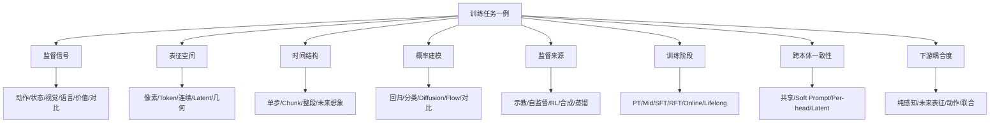
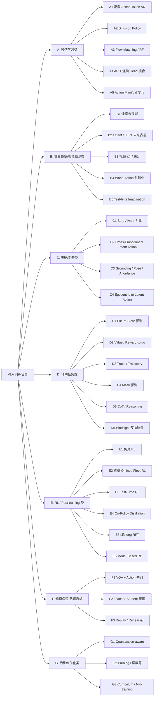
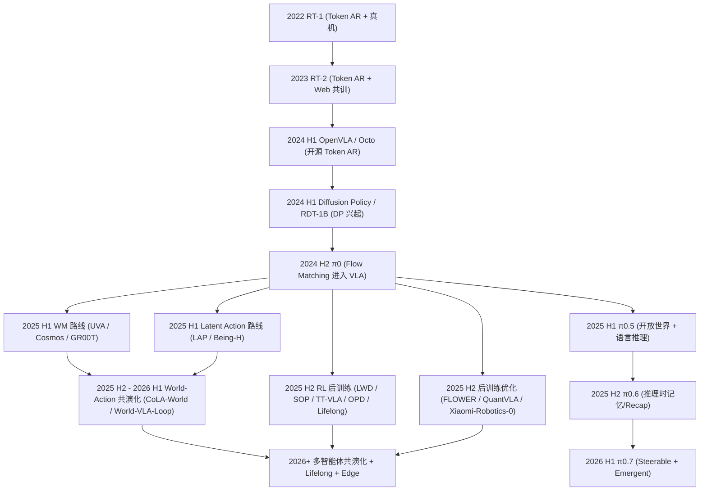

# VLA 训练任务全景:从 70 篇论文看具身预训练范式的设计、对比与演化

> **本文档目的**:基于 [`p/`](p/) 目录下 70 篇 VLA / 具身论文(2024-2026),系统梳理"训练任务"这一具身预训练的核心议题——它决定了 VLA 模型"能学到什么、不能学到什么、能泛化到哪、又会在哪里崩"。
>
> **写作约定**:
> - 公式用 LaTeX:行内 \(\ \cdots\ \),块级 \[\ \cdots\ \];
> - 图用 mermaid;
> - 每个训练任务范式按"直觉比喻 → 任务定义 → 输入输出 → Loss → 数据要求 → 优势 → 局限 → 对模型的正负影响 → 为什么这样设计 → 代表论文"的统一模板展开;
> - 论文引用统一链到 `p/<dir>/paper.pdf` 或对应 HTML,方便溯源。
>
> **完成度标记**:`[T1]` = 第一轮(骨架)已完成;`[T2]` = 第二轮(从 PDF/HTML 提取证据后)已回填;`[T3]` = 第三轮(横向分析)已收口。

---

## 文档导览

| 章节 | 你能拿到什么 |
|:---|:---|
| 第 1 章 | 阅读指南、术语速查、推荐阅读路径 |
| 第 2 章 | 训练任务的 8 维设计空间——理解后续所有分类、对比、演化的坐标系 |
| 第 3 章 | 训练任务分类总图(七大类 / ~30 个子范式)mermaid |
| 第 4 章 | 30 个训练任务范式的深度解析(直觉 + 公式 + 优劣 + 影响 + 证据) |
| 第 5 章 | 横向对比矩阵:相同、不同、正负迁移 |
| 第 6 章 | 训练任务的演化时间线 mermaid |
| 第 7 章 | 70 篇论文训练任务速查卡(按七大类分组) |
| 第 8 章 | 场景化设计建议与常见反模式 |
| 第 9 章 | 参考文献与论文 ↔ 范式 ↔ 锚点映射 |

---

## 第 1 章 阅读指南 [T1]

### 1.1 文档目标与适合人群

这份文档的目标读者是**正在选型或设计 VLA 训练流程**的工程师与研究者。不是综述,也不是新闻盘点——它要回答的核心问题是:

1. **范式问题**:别人都在用什么训练任务训 VLA?这些训练任务背后的设计意图是什么?
2. **取舍问题**:同一个目的(例如"让 VLA 能预测未来"),为什么有人用像素级未来帧、有人用 JEPA 隐空间、有人用 Latent Action?各自代价在哪?
3. **正负迁移问题**:加入某个辅助训练任务到底会不会帮倒忙?在什么情况下会?为什么?
4. **演化问题**:从 2023 年的 RT-2 到 2026 年的 World-Action 共演化模型,训练任务范式经历了哪些关键拐点?未来还会怎么走?

### 1.2 术语速查表

为了让公式与简称都不至于劝退读者,这里把全文反复出现的术语先压成一张表。**不要试图记住所有术语**,需要时回来查即可。

- **VLA**(Vision-Language-Action):接受视觉 + 语言指令、输出机器人动作的模型,通常以 VLM 为骨干。
- **VLM**(Vision-Language Model):接受视觉 + 语言、输出文本的模型(如 Qwen2.5-VL、PaliGemma、Chameleon),是 VLA 的常用骨干。
- **WM / WAM**(World Model / World-Action Model):预测"如果机器人这样动,世界会怎么变"的模型;WAM 特指条件于动作的版本。
- **BC**(Behavior Cloning):用专家示教做监督学习,典型 Loss 是动作回归或动作分类。
- **AR**(Autoregressive):自回归生成,典型用于离散动作 Token。
- **DP**(Diffusion Policy):用去噪扩散建模动作分布的策略。
- **Flow / Rectified Flow / Flow Matching**(FM):用学习"速度场"的方式建模分布(可理解为 1-step 化的 Diffusion 改良)。
- **JEPA**(Joint-Embedding Predictive Architecture):在**隐空间**而非像素空间做未来预测,Meta-Yann LeCun 风格。
- **Latent Action**:把"高维原始动作 / 多步动作"压成低维隐变量(通常 VQ 离散或 VAE 连续),让 VLM 在 latent 空间训练后再解码到本体动作空间。
- **PT / Mid / SFT / RFT**:训练阶段简写——预训练 / 中段训练 / 监督微调 / 强化微调。
- **Online / Offline RL**:Online 即与真实/仿真环境交互采样;Offline 即仅用静态数据集。
- **OPD**(On-Policy Distillation):用 RL 优化过的策略蒸馏回 VLA,作 SFT/RL 的桥。
- **EEF / Proprio**:End-Effector / Proprioception——末端执行器位姿 / 机器人自身关节状态读数。
- **Action Chunk**:一次性预测的多步动作序列(通常 8~64 步)。
- **CoT**(Chain-of-Thought):链式思考,VLA 里指"先输出文本推理再输出动作"。
- **OXE**(Open X-Embodiment):多家机构联合的跨本体真机数据集,VLA 预训练的常用底座。
- **Embodiment Aug**:对本体身份做数据增强(本体 ID、Soft Prompt 等)。

### 1.3 推荐阅读路径

- **想快速看全貌**:第 2 → 3 → 6 章,30 分钟拿到一张地图。
- **想做范式选型**:第 4 章(挑你关心的范式深读)+ 第 5 章横向对比 + 第 8 章设计建议。
- **想查某篇论文**:第 7 章速查表(按七大类分组),或第 9 章字母索引。
- **想了解演化**:第 6 章时间线 + 第 8 章未来趋势。

---

## 第 2 章 训练任务的 8 维设计空间:为什么训练任务设计是 VLA 的"灵魂" [T1]

**核心论点**:VLA 模型的「能力上限」更多被「训练任务的设计」而非「模型结构」决定。同一个骨干(Qwen2.5-VL + Diffusion Head)在不同训练任务下,可以是个跨本体通才,也可以是个只会做单一桌面任务的弱基线。本章把训练任务的设计空间抽象成 8 个**近似正交**的维度,后续所有分类、对比、演化都以此为坐标系。

### 2.1 维度 1:监督信号(Supervisory Signal)

监督信号回答"模型要学着拟合什么"。在 VLA 里,常见的监督信号有:

1. **动作监督**:示教轨迹中的真实动作(Joint / EEF / Gripper 等)。
2. **状态监督**:proprioception 序列、未来若干帧的关节角等。
3. **视觉监督**:未来帧 RGB / Depth / Mask / Latent Token。
4. **语言监督**:任务指令、子目标描述、CoT 思考链。
5. **价值 / 奖励监督**:Value head 回归 \(V(s)\)、Reward-to-go 回归 \(\sum_{t'\ge t}\gamma^{t'-t}r_{t'}\)。
6. **辅助标签监督**:Pose / Affordance / Trace / Mask 等结构化标签。
7. **对比信号**:正负样本对(同步对齐 / 不同对齐)的对比 Loss。

**直觉**:监督信号越接近"具身决策本身"(动作),数据效率越高但易过拟合具体本体;监督信号越远离动作(语言、视觉),通用性越强但需大量数据才能"间接学到动作"。

### 2.2 维度 2:表征空间(Representation Space)

监督信号要落在什么"空间"里建模?

- **像素空间**:RGB 帧、视频。直观但维度高、噪声多、需要大算力。
- **离散 Token 空间**:把动作 / 图像 patch / 视频帧量化成离散 token(VQ-VAE、Cosmos Tokenizer 等),便于复用 Transformer 的 next-token loss。
- **连续向量空间**:动作 / 状态保留原始浮点格式,用 MSE / Diffusion / Flow 回归。
- **隐空间(Latent)**:通过 Encoder 把动作 / 视觉投影到低维表征(JEPA、Latent Action),在 latent 上预测。
- **几何先验空间**:点云、Gaussian 几何 token(GST-VLA)、3D affordance,显式带 3D 几何结构。

**直觉**:像素空间逼真但贵;离散 Token 便于和语言 token 拼;Latent 空间最适合"跨本体共享";几何空间最适合"3D 操作泛化"。

### 2.3 维度 3:时间结构(Temporal Structure)

监督信号在时间上怎么组织?

- **单步**:\(a_t = f(o_t)\)。简单但抖动大,易复合误差。
- **Action Chunk**:一次预测 \(H\) 步 \(a_{t:t+H}\)(\(H\) 常取 8~64)。平滑、长程性能好,但部分多视图 / receding-horizon 推理时要重叠融合。
- **整段轨迹**:像视频生成那样直接生成一段未来。
- **未来想象 + 反推动作**:先想象 \(o_{t+1:t+K}\) 再用逆动力学回推动作(WAM 的核心模式之一)。

**直觉**:Chunk 是 BC 时代的甜点;未来想象是 WM 时代的甜点;两者越来越倾向于联合训练。

### 2.4 维度 4:概率建模方式(Probabilistic Modeling)

如何对"\(p(a \mid o, l)\)" 这类条件分布做建模?

- **回归(L1 / L2 / Huber)**:确定性。最简单,但无法建模多模态(同一观测对应多种合理动作)。
- **分类(Cross-Entropy)**:对离散 Token,自然多模态。
- **VAE / 高斯混合**:建模多模态,但训练不稳。
- **扩散(Diffusion / DDPM / EDM)**:多模态、稳健,但推理需多步去噪。
- **Flow Matching / Rectified Flow**:Diffusion 的 1-step 化改良,采样步数大幅压缩。
- **能量模型 / 隐式策略**:用 EBM,理论好但训练贵。
- **对比 InfoNCE**:学习表征对齐而非生成。

**直觉**:多模态动作分布是 VLA 的核心挑战。早期回归 → 离散分类 → Diffusion → Flow Matching 是主线;未来 Flow 的步数还会继续压。

### 2.5 维度 5:监督来源(Supervision Source)

谁来生成训练样本?

- **专家示教**:人遥操、动捕、第一人称视频。最干净但贵。
- **自监督**:从未标注视频里挖出"动作"(Latent Action、JEPA)。
- **RL outcome**:稀疏 / 稠密奖励驱动的 rollout。
- **合成数据**:仿真随机化、扩散增广、世界模型 rollout。
- **蒸馏**:teacher 模型生成软标签 / 动作。
- **人类反馈 / RLHF / RLAIF**:对动作 / 推理路径打分。

**直觉**:专家示教是地基,自监督和合成数据负责"放大数据规模",RL 负责"突破示教上限",蒸馏负责"把分散经验整合"。

### 2.6 维度 6:训练阶段(Stage)

训练任务在整个训练 pipeline 的哪一段?

- **PT(Pretrain)**:大规模通用数据,目标是建表征 + 通识。
- **Mid Training**:在 PT 和 SFT 之间的"中间课程",通常引入更具身的混合数据。
- **SFT**:目标本体 / 目标任务的高质量示教微调。
- **RFT(Reinforcement Fine-Tuning)**:把 RL 当成微调最后一步。
- **Online / Test-time**:部署后还在自我进化。
- **Lifelong / Continual**:跨多任务持续学习,需防灾难性遗忘。

**直觉**:阶段越靠后,数据越贵但越接近部署;辅助任务的"价值"在不同阶段差异巨大——例如 CoT 监督在 PT 极有帮助,但在最后的 SFT 阶段可能反而拖慢推理。

### 2.7 维度 7:跨本体一致性(Cross-Embodiment Consistency)

如何让模型在 \(N\) 种本体上共训而不互相伤害?

- **共享动作空间**:把所有本体动作映射到统一 EEF 空间。简单但损失本体专属信息。
- **Embodiment ID / Soft Prompt**:像 LLM 的"system prompt",把本体身份注入 token。
- **Per-embodiment Readout Head / Proprio Adapter**:共享骨干,每本体一个轻量 head。
- **Latent Action 解耦**:VLM 只输出本体无关的 latent action,本体专属 decoder 再解码。

**直觉**:Naive 跨本体共训会引发"负迁移"(双臂数据让单臂变笨);上面 4 种是常见的"隔离 + 共享"折衷。

### 2.8 维度 8:与下游耦合度(Downstream Coupling)

训练任务和"机器人最终输出动作"这件事的耦合度有多紧?

- **纯感知辅助**:Grounding / VQA,完全不输出动作,只在 PT 阶段帮 VLM。
- **未来表征预测**:输出未来 latent 或像素,但不直接输出动作。
- **未来动作预测**:直接输出动作 chunk(BC 主流)。
- **联合视觉-动作**:一次性输出未来视觉 + 动作 + 价值(Cosmos Policy、VLAW)。

**直觉**:耦合度越紧,数据效率越高但 OOD 越脆;耦合度越松,VLM 通识保留越好但需更大数据量"间接打通"。

### 2.9 8 维设计空间的可视化

下面这张 mermaid 把 8 个维度画成 8 根坐标轴,任何一个具体的训练任务都可以投影到这 8 根轴上,从而方便和其他任务对比:

---

## 第 3 章 训练任务分类总图 [T1]

把第 2 章的 8 维空间投影到「最常见的训练任务范式」,得到下面这棵 7 大类、~30 子范式的分类树:

七大类的"一句话目的":

- **A. 模仿学习**:把"什么观测对应什么动作"的映射学会(基础)。
- **B. 世界模型**:让模型理解"动作后世界会怎样",获取物理直觉。
- **C. 表征/对齐**:让 VLM 的表征和具身任务对齐,提升跨任务/跨本体迁移。
- **D. 辅助任务**:用相关的预测任务"喂"额外的梯度信号,帮主任务更快收敛。
- **E. RL**:突破示教数据的天花板,用"奖励"驱动持续提升。
- **F. 知识保留**:防止训具身能力时,VLM 的通识坍塌。
- **G. 后训练优化**:模型够强后,通过量化 / 裁剪 / 课程让它能部署。

---

## 第 4 章 训练任务范式深度解析

下面对七大类、30 个范式逐个展开。每个范式使用统一模板:

> **直觉比喻**(1-2 句通俗) → **任务定义** → **输入 / 输出** → **Loss(LaTeX)** → **数据要求** → **优势** → **局限** → **对模型的正负影响** → **为什么这样设计** → **代表论文**(回填证据)。

---

### 4.A 模仿学习类(Behavior Cloning Family) [T1]

模仿学习是 VLA 的"地基范式":让模型直接学"专家在某个观测下做了什么动作"。即便所有花哨的辅助任务都被消融掉,只剩一个 BC 头,VLA 也能跑——只是会跑得不够稳、不够泛化。差异在于"动作怎么表征 / 怎么建模"。

#### A1 离散 Action Token Autoregressive [T1]

**直觉比喻**:把"动作"也当成"字母",像写文章一样让 VLM 一个 token 一个 token 地"写"下一段动作。

**任务定义**:把连续动作 \(a \in \mathbb{R}^d\) 离散化成若干 token \(\hat{a} = (\hat{a}^{(1)}, \cdots, \hat{a}^{(k)})\),让 VLM 在自回归框架下 next-token-predict。

**输入 / 输出**:输入 = 多视图图像 + proprio(可选)+ 语言指令 + 历史动作 token;输出 = 当前/未来动作 token 序列。

**Loss**:
\[
\mathcal{L}_{\text{AR}} = - \sum_{t=1}^{T} \log p_\theta\bigl(\hat{a}_t \mid \hat{a}_{<t},\ o,\ l\bigr)
\]
即标准的 cross-entropy next-token loss。

**数据要求**:示教轨迹 + 一致的动作离散化 codebook(常见做法:对每维度按分位数分 256 bin,或学习一个 VQ-VAE)。

**优势**:
- 与 VLM 的 next-token 训练完全同构,**最容易复用** Llama / Qwen / PaliGemma 类骨干。
- 自然多模态(分类天然支持"同一观测 → 多个合理动作")。
- 离散后**易于在线 RL**(PPO/GRPO 处理 token 比处理连续向量稳得多)。

**局限**:
- 量化误差导致动作抖动(尤其在精细操作)。
- 推理时序贯生成 \(k\) 个 token,比 chunk 一次出慢。
- 离散 bin 设计影响泛化:bin 太粗失精度,太细稀疏难学。

**对模型的正负影响**:
- 正:对 VLM 骨干通识保留好(还在做 LM 任务);跨任务迁移强。
- 负:推理延迟、动作不平滑;细操作上常需后续 Diffusion / Flow 头取代。

**为什么这样设计**:VLA 最早就是想"把动作接进 LLM 的 next-token 框架",最大化复用 LLM 预训练成果。RT-2 / OpenVLA 走的就是这条路。

**代表论文**:[MINT-4B](#7a6-mint-4b)(DCT 多尺度 VQ + scale-wise AR,把意图与执行解耦)、[LifeLong-RFT](#7e3-lifelong-rft)(chunk 级离散 token GRPO,RL 与 AR head 天然兼容)、[Being-H0.5](#7c1-being-h05) 与 [MolmoAct2](#7a7-molmoact2)(把离散 FAST token 作为通才能力的"基石",再叠加连续头)。**影响 / 为什么**:这条线最大限度复用 LLM 通识与 RL 工具链,代价是动作平滑度——所以 2025-2026 几乎所有用 A1 的工作都额外配一个连续头(A4 混合)做精修。

---

#### A2 Diffusion Policy [T1]

**直觉比喻**:不是直接预测动作,而是预测"如何从噪声还原出动作"——像让模型学一支"逆向播放的舞蹈"。

**任务定义**:对动作 \(a\) 加噪声得到 \(a_t = \sqrt{\bar\alpha_t}a + \sqrt{1-\bar\alpha_t}\epsilon\),训练去噪网络 \(\epsilon_\theta(a_t, t, c)\) 还原噪声。条件 \(c\) 通常是 VLM token 拼成的语义条件。

**输入 / 输出**:输入 = VLM 编码的多模态条件 \(c\) + 加噪动作 \(a_t\) + 时间步 \(t\);输出 = 估计的噪声 \(\hat\epsilon\)(或 score)。

**Loss(DDPM Simple)**:
\[
\mathcal{L}_{\text{simple}} = \mathbb{E}_{t,\,a_0,\,\epsilon}\bigl\lVert \epsilon - \epsilon_\theta(a_t, t, c)\bigr\rVert_2^2
\]

**数据要求**:示教轨迹 + chunk 化;噪声调度(DDPM / EDM / k-diffusion)是关键超参。

**优势**:
- 天然建模**多模态**动作分布;
- 输出**连续动作 chunk**,平滑;
- 对**复杂操作**(精细插拔、双臂协作)效果好。

**局限**:
- 推理需要 \(N\) 步去噪(典型 5~50 步),**实时性差**;
- 对噪声调度敏感;
- 与 VLM 拼接需要小心(Diffusion head 容易"吃掉"VLM 梯度,导致通识退化)。

**对模型的正负影响**:
- 正:动作平滑、精细;对长 chunk 友好。
- 负:推理慢;扩展到更大本体 / 更高频率时 latency 不够;若没有 receding-horizon 配套,误差累积明显。

**为什么这样设计**:把 Image / Video Diffusion 的成功路径搬到机器人——动作分布也是高维多模态,Diffusion 的归纳偏置正合适。

**代表论文**:[GR00T_N1.6](#7a4-gr00t_n16) 与 [HAMLET](#7f1-hamlet)(DiT-based action expert);[HiPolicy](#7g4-hipolicy)(多频分层 chunk + 扩散去噪);[Mask World Model (MWM)](#7b9-mask-world-model-mwm)(WM 预测 + 扩散动作头);[CycleVLA](#7d2-cyclevla)(扩散 action expert + 回溯 + MBR);[Cosmos Policy](#7b3-cosmos-policy) 与 [DreamZero](#7b4-dreamzero)(用 EDM / 块级扩散建模视频与动作);[STARRY](#7b12-starry)(GASAM 几何调制 diffusion)。**影响 / 为什么**:Diffusion Policy 用 chunk 化 + 多模态分布,把"动作模仿"从单步回归变成全局分布拟合,显著提升精细操作与长程平滑度;副作用是推理慢、不易接 RL,因此 2025 年起被 Flow Matching 大量取代。

---

#### A3 Flow Matching / Rectified Flow [T1]

**直觉比喻**:Diffusion 让模型学"如何逆推 \(N\) 步去噪",Flow Matching 直接让模型学"一条从噪声到数据的直线速度场",所以只需要更少的步数。

**任务定义**:对动作 \(a_1\)(数据)与噪声 \(a_0\sim \mathcal{N}(0, I)\),定义路径 \(a_t = (1-t)a_0 + t a_1\),目标速度 \(u_t = a_1 - a_0\)。训练速度场 \(v_\theta(a_t, t, c)\) 拟合 \(u_t\)。

**输入 / 输出**:输入 = 条件 \(c\) + 路径点 \(a_t\) + \(t\);输出 = 速度向量 \(\hat v\)。

**Loss(Conditional FM)**:
\[
\mathcal{L}_{\text{FM}} = \mathbb{E}_{t \sim U[0,1],\,a_0,\,a_1}\bigl\lVert v_\theta(a_t, t, c) - (a_1 - a_0)\bigr\rVert_2^2
\]

推理时只需解 ODE \( \dot a_t = v_\theta(a_t, t, c) \),典型 1~10 步即可。

**数据要求**:与 Diffusion 类似,但对训练数据"噪声-数据成对"无需复杂调度。

**优势**:
- 推理步数显著少于 Diffusion(很多论文用 1~4 步);
- 训练稳定;
- 对 VLM 梯度更友好(头部小,不易"吃"VLM)。

**局限**:
- 当步数压到 1 时,对 OOD 鲁棒性下降(因为缺乏多步精修);
- 与 chunk 长度有交互(过长 chunk 在 1-step 下生成质量略降)。

**对模型的正负影响**:
- 正:推理快、训练稳;成为 2025-2026 年 VLA 动作头的主流。
- 负:对极端 OOD,1-step 不够"安全";若直接当 0-step(纯回归)用,等同 L2,丢多模态。

**为什么这样设计**:同时满足"多模态动作建模 + 高频实时推理"的工程需要,正中 VLA 部署痛点。

**代表论文**:[π0.6](#7e10-π06-recap) / [π0.7](#7d7-π07) / [Ψ0](#7c14-ψ0)(Physical Intelligence 与人形 loco-manip 系列,Flow 作主连续头);[FLOWER](#7a2-flower)(中间 fusion + 50% 层裁剪,4-8 步推理);[X-VLA](#7c13-x-vla)(Soft-Prompt 跨本体 Flow);[Xiaomi-Robotics-0](#7a13-xiaomi-robotics-0) 与 [MolmoB0T](#7a8-molmob0t)(实时执行优化);[OA-WAM](#7b10-oa-wam) 与 [VLA-JEPA](#7b13-vla-jepa)(WM 配 Flow);[GST-VLA](#7c4-gst-vla) 与 [Pose-VLA](#7c9-pose-vla)(几何监督 + Flow);[ABot-M0](#7a1-abot-m0)(在 Manifold 上的 Flow);[LingBot-VLA](#7a5-lingbot-vla) 与 [SimVLA](#7a10-simvla) / [RLDX-1](#7a9-rldx-1)(工程 / 极简 / 灵巧手版本);[VLA Foundry](#7f3-vla-foundry) / [VLANeXt](#7a12-vlanext) / [PRTS](#7c10-prts) / [VLA-OPD](#7e8-vla-opd) / [Fast-WAM](#7b5-fast-wam) / [LAP](#7c6-lap) / [Being-H0.5](#7c1-being-h05) / [Being-H0.7](#7b1-being-h07) / [WoVR](#7e9-wovr) / [LWD](#7e4-lwd) 也全部用 Flow 头。**影响 / 为什么**:Flow 成为 2025-2026 的事实标准;它在保持多模态、连续平滑的同时把推理步数压到 1-10 步,工程上"训练贵 + 推理便宜"的 trade-off 最适合机器人部署。代价是 1-step OOD 鲁棒下降——多数论文给出动态步数或 best-of-N 兜底。

---

#### A4 AR + 连续 Head 混合 [T1]

**直觉比喻**:让 VLM 先用 LM 头"念出 high-level 决策(语义 / 子目标)",再让一个独立的连续头(Diffusion / Flow)"画出 low-level 动作",高低层各司其职。

**任务定义**:同一模型两个 head——LM 头做离散 token AR,Action 头做连续动作 Diffusion/Flow。Loss = 加权和。

**Loss**:
\[
\mathcal{L} = \lambda_{\text{LM}}\mathcal{L}_{\text{AR-text}} + \lambda_{\text{act}}\mathcal{L}_{\text{Diffusion/Flow}}
\]

**优势**:
- 兼顾 VLM 通识 + 精细动作;
- 支持"先 CoT 再动作"。

**局限**:
- 权重 \(\lambda\) 调起来很玄学,容易顾此失彼。
- 训练成本高(两个 head 一起优化)。

**对模型的正负影响**:
- 正:平衡通识 vs 操作;非常适合需要"语义推理 + 精细动作"的长程任务。
- 负:LM 与 Action 头之间存在梯度竞争,处理不好会同时变差。

**为什么这样设计**:这是当前的"主流稳态"——既要 VLM 的脑子,也要 Diffusion/Flow 的手。

**代表论文**:[MolmoAct2](#7a7-molmoact2)(离散 FAST + Flow 双头共训,Think 自适应深度);[π0.7](#7d7-π07)(FAST CE 训 VLM + Flow expert 训动作,stop-gradient 防互相干扰);[StarVLA-α](#7a11-starvla-α) 与 [VLANeXt](#7a12-vlanext)(强 VLM + 简动作头);[Xiaomi-Robotics-0](#7a13-xiaomi-robotics-0)(VLM 共训 + DiT Flow + Λ-mask);[FocusVLA](#7a3-focusvla)(级联视觉 + 动作 query);[Pose-VLA](#7c9-pose-vla) / [GST-VLA](#7c4-gst-vla)(几何监督 + Flow expert);[LoHo-Manip](#7d4-loho-manip)(Manager VLM + Executor VLA);[ConsisVLA-4D](#7d1-consisvla-4d)(SC-Attn 并行解码);[Helix_02](#7e2-helix_02)(S2/S1/S0 三层 AR + 连续);[DM0](#7g1-dm0)(VLM AR 与 Flow expert 分梯度)。**影响 / 为什么**:这是 2025-2026 的"主流稳态"——VLM 头保通识 / 推理,连续头保平滑 / 精细,但代价是 \(\lambda\) 权重玄学与梯度竞争。多数论文用 stop-gradient / 分阶段训练 / KI 配方控制风险。

---

#### A5 Action Manifold 学习 [T1]

**直觉比喻**:与其在欧氏动作空间 \(\mathbb{R}^d\) 里学,不如学一个"动作 manifold",新动作 = 在 manifold 上插值或外推,天然平滑、避免不可行动作。

**任务定义**:学习一个 manifold encoder/decoder,将动作映射到流形上的隐变量,然后在隐变量上做 BC / Flow / Diffusion。

**Loss(VAE-style 范例)**:
\[
\mathcal{L} = \mathbb{E}\bigl[\lVert a - \text{Dec}(z)\rVert^2\bigr] + \beta\,\text{KL}\bigl(q_\phi(z\mid a) \,\|\, p(z)\bigr)
\]

**优势**:
- 抑制不可行动作(因为 manifold 外的点解码后会被自动"拉回")。
- 跨本体迁移更稳。

**局限**:
- 需要良好的 manifold 设计(否则会损失精度);
- 不同任务的 manifold 不通用。

**为什么这样设计**:把"动作合法性"作为先验显式嵌进模型,而不是靠示教数据隐式学。

**代表论文**:[ABot-M0](#7a1-abot-m0) — 显式 manifold 学习 + 速度重加权 + UniACT 六库统一(范式归属 A5 主)。**影响 / 为什么**:Manifold 路线为"动作合法性"提供先验,适合跨本体共训(不可行动作会被解码器自动拉回);代价是 manifold 设计本身成为新瓶颈,不同任务的 manifold 不通用,目前仍是少数派,但在数据稀缺场景值得重视。

---

### 4.B 世界模型 / 视频预测类(World Model Family) [T1]

世界模型类的核心信念是:**真正聪明的 policy 必须懂物理**——也就是知道"如果我这样动,世界会怎么变"。这一类训练任务让模型在大规模(可能没有动作标注的)视频上学物理直觉,然后再用动作监督把它"接到"机器人上。

#### B1 像素级未来帧预测(Pixel-Space Future Frame) [T1]

**直觉比喻**:让模型像视频生成模型那样,真正"画出"下一秒的画面;借助这个过程间接把物理动力学学进去。

**任务定义**:给定历史观测 + 动作(可选),预测未来 \(K\) 帧 RGB(或 Depth / Latent 视频 token)。

**Loss**(Latent Diffusion-based Video):
\[
\mathcal{L}_{\text{video}} = \mathbb{E}_{t, z_0, \epsilon}\bigl\lVert \epsilon - \epsilon_\theta(z_t, t, c_{o,a})\bigr\rVert^2
\]

其中 \(z\) 是 VAE 编码后的 video latent,\(c_{o,a}\) 是历史观测 + 动作条件。

**优势**:
- 直接利用海量互联网视频做 PT;
- 物理直觉好;
- 与 Cosmos / Wan / HunyuanVideo 等基座对接顺。

**局限**:
- 训练贵、推理更贵;
- 像素级误差不等于动作正确(可能"画对了"但动作错);
- 模式坍塌、长程漂移。

**对模型的正负影响**:
- 正:OOD 物理理解强;对长程任务的世界一致性好。
- 负:计算贵;有可能让 VLM 的语言能力被淹没。

**为什么这样设计**:VideoGen 是最贴近"物理理解"的预训练任务,且数据规模有保证。

**代表论文**:[Cosmos Policy](#7b3-cosmos-policy) — Cosmos-Predict2 视频基座潜帧编码动作 / 状态 / 价值,EDM 去噪;[DreamZero](#7b4-dreamzero) — 14B 块级 AR-Diffusion WAM 联合预测未来视频与动作;[Psi-R2/Psi-W0](#7b11-psi-r2--psi-w0) — Wan2.2 IT2V 联合预测未来视频与动作。**影响 / 为什么**:像素 WM 是直接路径——可借海量视频做 PT,有强物理先验,但训练 / 推理都贵;近期研究(Fast-WAM、GigaWorld)指出推理时大部分场景可剥离视频生成,只在训练期保留以塑造表征,这正是从 B1 演化到 B2/B3 的关键动机。

---

#### B2 Latent / JEPA 未来表征预测 [T1]

**直觉比喻**:别花钱"画"未来的高清视频,只用一个 latent encoder 把未来帧抽象成向量,让模型"猜"那个向量就行——LeCun 的 JEPA 思路。

**任务定义**:用 target encoder \(\bar f\)(常 EMA)对未来帧 \(o_{t+K}\) 编码得到 target \(\bar z\);用 context encoder \(f\) 对历史 + 动作编码,通过 predictor \(g\) 预测未来 latent \(\hat z\)。

**Loss**(Cosine/MSE on latent):
\[
\mathcal{L}_{\text{JEPA}} = \bigl\lVert g\bigl(f(o_{\le t}, a_{\le t})\bigr) - \mathrm{sg}\bigl(\bar f(o_{t+K})\bigr)\bigr\rVert^2
\]

其中 \(\mathrm{sg}\) 表示 stop-gradient,以防 collapse。

**优势**:
- 不必"画" pixel,**计算便宜得多**;
- 不学无关细节(纹理、光照),只学"语义动力学";
- 自然对 VLA 友好(VLM 也是 latent-only)。

**局限**:
- 容易 collapse(predictor 输出常数);
- 需要 EMA / VICReg / I-JEPA 等抗坍塌设计。

**对模型的正负影响**:
- 正:用很少算力补"未来理解"能力;对 Long-horizon 帮助大。
- 负:对纯感知 OOD(光照剧变)不一定够鲁棒。

**为什么这样设计**:工程上"用最便宜的方式给 VLA 加世界模型"。

**代表论文**:[VLA-JEPA](#7b13-vla-jepa) — 无泄漏 JEPA 双阶段(冻结 V-JEPA2 + Flow);[Being-H0.7](#7b1-being-h07) — 潜变量世界-动作双分支,训练用后验、推理丢弃;[Fast-WAM](#7b5-fast-wam) — 训练共训未来视频、推理跳过想象,190ms 单前向;[FutureVLA](#7b6-futurevla) — JVPM 视-运动门控嵌入对齐任意 VLA;[MWM](#7b9-mask-world-model-mwm) — 预测未来 mask latent 而非 RGB。**影响 / 为什么**:JEPA / Latent WM 是"用最便宜的方式给 VLA 加世界模型",同时帮助 VLA 通识保留;它的关键风险是 collapse,所以几乎所有论文都加 EMA / 无泄漏 target / 防坍缩正则。

---

#### B3 视频-动作联合(Joint Visuomotor) [T1]

**直觉比喻**:同一个模型同时"画下一帧" + "出下一动作",两件事互相校验,**说到做到**。

**任务定义**:模型联合预测 \(o_{t+1:t+K}\) 与 \(a_{t:t+K}\)。Loss 是两者的加权和。

**Loss**:
\[
\mathcal{L} = \lambda_{\text{vis}}\mathcal{L}_{\text{visual}}(o_{t+1:t+K}) + \lambda_{\text{act}}\mathcal{L}_{\text{action}}(a_{t:t+K})
\]

**优势**:
- 动作-视频强一致,**抗动作幻觉**;
- 视频预测帮助动作泛化(尤其在数据量小时)。

**局限**:
- 多目标优化复杂;
- 视频预测占大头算力,动作头容易欠拟合;
- 长视频生成会拖整体推理速度。

**对模型的正负影响**:
- 正:OOD 鲁棒 + 长程一致性显著提升;
- 负:训练贵,推理慢;消融常显示视频头可以裁掉做 SFT。

**为什么这样设计**:用"预测未来视觉"作为动作监督的"二次校验"。

**代表论文**:[GigaWorld-Policy](#7b7-gigaworld-policy) — 动作中心 WAM,因果 mask 防未来帧泄漏到动作;[HiF-VLA](#7b8-hif-vla) — MPEG 运动矢量做 hindsight + foresight + 动作三头;[DreamZero](#7b4-dreamzero) — 块级联合视频-动作流匹配;[Psi-R2/Psi-W0](#7b11-psi-r2--psi-w0) — 真机 + 人类十万小时联合视频-动作;[RLDX-1](#7a9-rldx-1) — 灵巧手 + 视频运动模块。**影响 / 为什么**:联合训练强制"说到做到"——动作和视频之间相互校验,显著提升 OOD 一致性。代价是训练贵;近期论文(GigaWorld、Fast-WAM)都设计为"训练共训、推理可剥离视频分支",兼顾稠密监督与部署延迟。

---

#### B4 World-Action 共演化(Co-evolution) [T1]

**直觉比喻**:World Model 教 Policy 怎么动,Policy 走出来的数据反过来教 World Model 怎么更准——两个模型像两条腿,交替进步。

**任务定义**:World Model \(W\) 和 Latent Action Encoder \(L\)(或 Policy)交替训练;每轮 W 用 L 给出的 latent 做条件预测未来,L 用 W 提供的"未来一致性"信号优化。

**Loss(示意,两阶段交替)**:
\[
\begin{aligned}
\mathcal{L}_W &= \bigl\lVert \hat o_{t+1} - o_{t+1}\bigr\rVert^2 + \lambda\,\bigl\lVert \hat z_{t+1} - z_{t+1}\bigr\rVert^2 \\
\mathcal{L}_L &= \bigl\lVert W(o_t, L(o_t, o_{t+1})) - o_{t+1}\bigr\rVert^2 + \alpha\,\Omega(L)
\end{aligned}
\]

其中 \(\Omega(L)\) 是 latent 的正则(InfoBN / VQ commitment)。

**优势**:
- 自监督 + 共同提升,**数据放大效应**;
- 大幅降低对动作标注的依赖。

**局限**:
- 训练流程复杂;
- 容易因为两边同时学坏陷入"双输"。

**对模型的正负影响**:
- 正:在未标注视频里把"动作"挖出来;
- 负:稳定性差。

**为什么这样设计**:Latent Action 路线的关键升级——不再只靠人工 codebook,而是和 WM 共同进化。

**代表论文**:[CoLA-World](#7b2-cola-world) — IDM 与冻结视频 WM 端到端共演化(两阶段变一阶段);[OA-WAM](#7b10-oa-wam) — 槽位级 WAM 联合预测下一帧槽与 16 步动作;[STARRY](#7b12-starry) — 时空动作中心 WM + GASAM 几何调制;[VLAW](#7b14-vlaw) — Ctrl-World + VLM Reward + Flow SFT 闭环迭代;[World-VLA-Loop](#7b15-world-vla-loop) — SANS 数据 + 状态感知 WM + WM 内 GRPO;[World2Act](#7c12-world2act) — Skill-WM 与 VLA latent 对比对齐。**影响 / 为什么**:共演化是 2025-2026 最热的方向,它把"WM 给 policy 出题"和"policy 给 WM 提供数据"合二为一,放大未标注数据规模。但训练流程复杂,易出现"两边都学坏"的双输——多数论文用 KL 锚定、阶段化训练或冻结一方稳定共训。

---

#### B5 Test-time Imagination [T1]

**直觉比喻**:推理时让模型"先脑补几种未来,挑最像成功的那一种再执行",相当于 model-based planning。

**任务定义**:在线推理时,policy \(\pi\) 提议 \(K\) 个候选 chunk,WM 模拟其未来 \(\hat o\),Value head 打分 \(V(\hat o)\),取最高分执行(典型 Best-of-N planning)。

**Loss(训练 V head)**:
\[
\mathcal{L}_V = \bigl\lVert V_\theta(o) - \sum_{t\ge \tau}\gamma^{t-\tau} r_t\bigr\rVert^2
\]

**优势**:
- 不改训练管线,推理时直接拉高成功率;
- 自然支持"安全过滤"(把违反约束的候选去掉)。

**局限**:
- 推理变贵(\(K\) 倍);
- 对 WM 准确度要求高。

**对模型的正负影响**:
- 正:在风险高的真机部署上提供"二次想象 + 选择"安全网;
- 负:延迟敏感的高频任务上不适用。

**为什么这样设计**:把规划放到推理时,而不是强行塞进训练。

**代表论文**:[Cosmos Policy](#7b3-cosmos-policy)(best-of-N planning,真机 +12.5pp);[WoVR](#7e9-wovr)(masked GRPO 在 WM 内做 imagination RL);[Fast-WAM](#7b5-fast-wam)(消融研究表明:训练期视频共训贡献远大于推理期想象);[DreamZero](#7b4-dreamzero)(WAM 本身即 zero-shot policy,推理时不需 SFT)。**影响 / 为什么**:Test-time Imagination 不改主训练管线、推理时拉高成功率,适合真机高风险任务。但变贵 \(K\) 倍 + 依赖 WM 准确度——所以 Fast-WAM 的研究意义在于"它常常是不需要的",这与 World-VLA-Loop 在 imagination 内 RL 的成功形成对照,提示边界条件:WM 越准 / 任务越长程,B5 越值得。

---

### 4.C 表征 / 对齐类(Representation & Alignment) [T1]

这一类训练任务不直接输出动作,而是**塑造内部表征**——让 VLA 的隐空间对"步骤、本体、姿态"等结构敏感,以便下游 BC/RL 更易学习。

#### C1 Step-Aware 对比学习 [T1]

**直觉比喻**:让模型知道"我现在在第几步、距离目标还有多远",像导航 app 给你"还有几分钟到达"。

**任务定义**:给同一轨迹的不同时间步打"进度标签"或"前后关系"标签,用 InfoNCE 拉远不同进度的表征。

**Loss**:
\[
\mathcal{L}_{\text{NCE}} = -\log\frac{\exp(\langle z_i, z_i^+\rangle/\tau)}{\sum_{j}\exp(\langle z_i, z_j\rangle/\tau)}
\]

**优势**:
- 给 BC 一个隐式的"进度先验",**长程任务**很有用。

**局限**:
- 需要精细的正负样本设计;
- 对短程任务收益小。

**为什么这样设计**:VLN-CE / 长程操作里"知道自己走到哪一步"对成功率非常关键。

**代表论文**:[SACA](#7c11-saca)(VLN-CE 上 PGSA 逐步软分 + GRPO 强化前缀对齐);[PRTS](#7c10-prts)(双向 InfoNCE 学语言目标可达性 \(\log Q^\pi_l\),长时程任务增益显著);[HY-Embodied-0.5](#7c5-hy-embodied-05)(通识 + 具身 + 多阶段 RL 综合,Step-Aware 思想体现在迭代 RFT)。**影响 / 为什么**:Step-Aware 用一个隐式"进度先验"显著改善长程 BC——失败率与进度信号高度相关。代价是正负样本对设计敏感,在短程任务上几乎无收益。

---

#### C2 Cross-Embodiment Latent Action [T1]

**直觉比喻**:把不同本体的动作都翻译成同一种"通用动作语",像 Esperanto——再让每个本体的"翻译器"把通用语翻回本体动作。

**任务定义**:从 \((o_t, o_{t+1})\) 学习 latent action \(z = L(o_t, o_{t+1})\),让 \(z\) 与具体本体动作 \(a\) 解耦;下游本体只学 \(z\to a\) 的小 decoder。

**Loss(示意,Forward Dynamics + Bottleneck)**:
\[
\mathcal{L}_{\text{LA}} = \bigl\lVert F(o_t, z) - o_{t+1}\bigr\rVert^2 + \beta\,\text{KL}(q(z\mid o_t, o_{t+1})\,\|\,p(z))
\]

**优势**:
- 用海量"无动作标注"视频做 PT;
- 真正实现"看一眼就会"的跨本体迁移。

**局限**:
- latent 容易"塌缩";
- 解码到细动作还需本体专属数据。

**为什么这样设计**:为了让 VLA 在"机器人本体百花齐放"的现实里仍能共享知识。

**代表论文**:[LAP](#7c6-lap)(语言-动作 CE 预训 + Flow,3B 模型平均零样本 SR ~50%);[X-VLA](#7c13-x-vla)(Soft-Prompt 按数据源吸收硬件异构,LoRA 适配仅 ~1% 参数);[OXE-AugE](#7c7-oxe-auge)(toolkit 把 OXE 跨 9 本体扩至 440 万+ 轨迹);[World2Act](#7c12-world2act)(Skill-WM 的 latent 对比对齐替代 pixel IDM);[Ψ0](#7c14-ψ0) / [Being-H](#7c1-being-h05) 系列(人手 + 机器人解耦再统一)。**影响 / 为什么**:跨本体 Latent Action 让 VLA 真正实现"看一眼就会"的跨硬件迁移,且能用海量无动作标注视频做 PT。共同陷阱是 latent 坍塌——需要 EMA / InfoNCE / 防坍缩正则,或像 LAP 那样直接用语言空间作 latent。

---

#### C3 Visual Grounding / Pose / Affordance 监督 [T1]

**直觉比喻**:除了"知道做什么",还要让模型"知道在哪做、用什么部位、抓哪里"。

**任务定义**:监督模型同时预测物体 bounding box / mask、抓取点、6D 姿态、affordance map 等结构化标签。

**Loss(示意,multi-head)**:
\[
\mathcal{L} = \lambda_{\text{box}}\mathcal{L}_{\text{IoU}} + \lambda_{\text{pose}}\mathcal{L}_{6\text{D}} + \lambda_{\text{aff}}\mathcal{L}_{\text{BCE-aff}}
\]

**优势**:
- 显式 3D / 几何先验,**精细操作泛化**;
- 安全约束容易接(把抓取点限定在白名单)。

**局限**:
- 需要大量结构化标签;
- 不同本体 affordance 定义不一致。

**为什么这样设计**:为 VLA 嵌入"在哪里 / 怎么抓"的物理先验。

**代表论文**:[Pose-VLA](#7c9-pose-vla)(离散 Pose Token 统一 3D 与轨迹);[GeneralVLA](#7c3-generalvla)(3D Affordance + LLM 路径分层);[GST-VLA](#7c4-gst-vla)(128 个 Gaussian 空间 token + DA-CoT);[PokéVLA](#7c8-pokévla)(SEG 多视角分割 + VGGT 几何对齐);[ConsisVLA-4D](#7d1-consisvla-4d)(动态对象 + 全局深度 4D 推理);[BTK](#7c2-btk)(多模态知识库辅助 VLN);[OA-WAM](#7b10-oa-wam) 与 [STARRY](#7b12-starry) 也含 C3 副。**影响 / 为什么**:几何 / 姿态 / Affordance 监督显著提升精细操作的 OOD 泛化(尤其几何敏感任务),且天然支持"安全约束"(把抓取点限定在白名单)。代价是需要大量结构化标签,跨本体 affordance 定义不一致——多数论文在训练期加几何 head、推理期裁掉。

---

#### C4 Egocentric Video → Latent Action 自监督 [T1]

**直觉比喻**:把"人手怎么动"当成"机器人手该怎么动"的近似——只看人的第一人称视频,自动挖出动作。

**任务定义**:从 egocentric 视频(EPIC-Kitchens / Ego4D / 自采)中,自监督学习 latent action;再迁移到机器人本体。

**Loss**:与 C2 类似,但训练数据是人类视频;通常还加上 hand-pose 先验。

**优势**:
- 数据规模可以**很大**;
- 直接对接人形机器人。

**局限**:
- 人手与机器人手 morphology 不同,latent 需 careful 处理;
- 接触力 / 触觉缺失。

**为什么这样设计**:为人形机器人解决"示教数据少"的根本痛点。

**代表论文**:[Being-H0.5](#7c1-being-h05)(人手为"母语"统一动作空间 + MoF);[Ψ0](#7c14-ψ0)(EgoDex 等 800h 人视频 + 30h 真机超 10× 数据 baseline 40%+);[Psi-R2/Psi-W0](#7b11-psi-r2--psi-w0)(95472h 人类视频 + 5417h 真机,亚毫米手套轨迹);[Being-H0.7](#7b1-being-h07)(latent 双分支,训练用后验)。**影响 / 为什么**:Egocentric → Latent 对人形机器人解决"示教数据少"的根本痛点;关键工程是人手与机器人 morphology 的运动学对齐,Psi-R2 / Ψ0 走"Bitter Lesson 式极简对齐",Being-H 走 MoF 专家路由,代表两条不同路径。

---

### 4.D 辅助任务类(Auxiliary Tasks) [T1]

辅助任务在不改主结构的前提下,通过给模型加"额外预测题"提供更密集梯度,提高数据效率与泛化。常作为"配菜"和 BC / Diffusion / RL 一起用。

#### D1 Future State 预测 [T1]

**直觉比喻**:除了"输出动作",顺手再让模型预测"这几步后机器人会变成什么样"。

**任务定义**:预测未来 \(K\) 步 proprio / EEF / image latent。

**Loss**:
\[
\mathcal{L}_{\text{FS}} = \sum_{k=1}^{K}\bigl\lVert \hat s_{t+k} - s_{t+k}\bigr\rVert^2
\]

**优势**:动作-状态一致性增强;隐式带入"长程规划"。

**局限**:增加输出维度;权重 \(\lambda\) 需调。

**为什么这样设计**:用便宜的状态预测做"动作正确性"的二次约束。

**代表论文**:[ConsisVLA-4D](#7d1-consisvla-4d)(动态对象 4D + 全局深度 4D 双辅助头);[FutureVLA](#7b6-futurevla)(JVPM 首帧重建 + 门控运动 + 潜嵌入对齐);[P3Nav](#7d6-p3nav)(BEV 上未来 scene feat + waypoint heatmap);[π0.7](#7d7-π07)(subgoal 图像作 future state 条件);[Cosmos Policy](#7b3-cosmos-policy)(单阶段把 \(s'\) 编进同一潜帧)。**影响 / 为什么**:Future State 几乎是"几乎无副作用"的辅助任务,长程任务上稳定加分;关键是预测的是 latent 还是像素——latent 显著更便宜。

---

#### D2 Value / Reward-to-go 监督 [T1]

**直觉比喻**:让模型不光会"做",还会"打分"——"我做完这一段大概能赚多少分"。

**任务定义**:回归监督 \(V(s_t) \approx \sum_{t'\ge t}\gamma^{t'-t}r_{t'}\) 或 advantage。

**Loss**:
\[
\mathcal{L}_V = \mathbb{E}_t\bigl(V_\theta(s_t) - G_t\bigr)^2,\quad G_t = \sum_{t'\ge t}\gamma^{t'-t}r_{t'}
\]

**优势**:为推理时 best-of-N planning 提供打分器;为后续 RL 阶段提供 critic 初值。

**局限**:需要 reward 标签(或人工/规则定义);从纯示教数据估 V 偏 biased。

**为什么这样设计**:从 BC 平滑过渡到 RL,降低纯 RL 起步的不稳定。

**代表论文**:[Cosmos Policy](#7b3-cosmos-policy)(Value 头联合预测,服务 best-of-N planning);[π0.6 Recap](#7e10-π06-recap)(distributional MC return value 函数 + advantage-conditioned BC);[TT-VLA](#7e7-tt-vla)(value-free PPO,用 progress 估 reward);[ReconVLA](#7d8-reconvla)(用 CQR 给动作加置信区间);[VLAW](#7b14-vlaw)(VLM 充当 reward signal);[PRTS](#7c10-prts)(对比学习 \(\log Q^\pi_l\) 隐式得到 value)。**影响 / 为什么**:Value head 是连接 SFT 与 RL 的桥梁,也是推理时 planning 的打分器;对纯示教数据估 V 偏 biased,所以 π0.6 / VLAW 都把 Value 作为"持续从真机 / 失败数据学习"的载体。

---

#### D3 Trace / Trajectory 预测 [T1]

**直觉比喻**:在图上画一条"我打算让 EEF 走过的路径线",再让模型按这条线动。

**任务定义**:预测 2D/3D 末端轨迹点序列(或 keypoint motion field),作为"中间表征"给动作头。

**Loss**:
\[
\mathcal{L}_{\text{trace}} = \sum_k\bigl\lVert \hat p_k - p_k\bigr\rVert^2
\]

**优势**:轨迹比动作更"语义",更易跨本体;长程规划自然。

**局限**:轨迹 → 动作转化需可微 IK 或额外 head。

**为什么这样设计**:在"动作"和"语言"之间提供一层中间抽象。

**代表论文**:[LoHo-Manip](#7d4-loho-manip)(Manager VLM 出 2D visual trace + Executor 跟 trace 控制);[HiF-VLA](#7b8-hif-vla)(MPEG 运动矢量当 trace);[HAMLET](#7f1-hamlet)(moment token 沿轨迹做时间对比)。**影响 / 为什么**:Trace 在"动作"和"语言"之间提供一层中间抽象,让长程规划自然落地;关键工程是 trace → 动作的转化(可微 IK / 额外 head),不当处理会引入误差。

---

#### D4 Mask 预测 [T1]

**直觉比喻**:遮住图像 / 视频 / 动作的一部分,让模型猜——MAE 思路搬到具身。

**任务定义**:对输入随机 mask 一部分(image patch / action chunk 中的 token / proprio 时间步),让模型重建。

**Loss**:
\[
\mathcal{L}_{\text{mask}} = \mathbb{E}_{M}\bigl\lVert x_M - \hat x_M\bigr\rVert^2
\]

**优势**:对模态缺失天然鲁棒;改善表征质量。

**局限**:重建什么、mask 哪里需精心设计;对"关键模态"过度依赖可能反伤。

**为什么这样设计**:像 MAE/MaskGIT 一样,用"补全"作通用表征学习。

**代表论文**:[Mask World Model (MWM)](#7b9-mask-world-model-mwm) — 预测未来语义 mask latent(非 RGB),mask 瓶颈滤光照 / 纹理,LIBERO 98.3% 且 token-pruning 鲁棒优于 RGB WM。**影响 / 为什么**:Mask 监督让模型只关心"决策相关"区域,显著抗噪 / 抗冗余;关键是 mask 设计——MWM 用语义 mask(SAM 类标签),把 D4 从纯 MAE 提升为"决策导向"的 mask。

---

#### D5 CoT / Reasoning 监督 [T1]

**直觉比喻**:让 VLA 先用一两句话"自言自语"分析任务,再决定动作;像 ChatGPT 的思维链。

**任务定义**:在示教数据上加 CoT 标注,Loss 是 LM 头 next-token-loss + 动作头 BC loss。

**Loss**:
\[
\mathcal{L} = \mathcal{L}_{\text{CoT}} + \lambda\,\mathcal{L}_{\text{action}},\quad \mathcal{L}_{\text{CoT}} = -\sum \log p(\text{token}_i \mid \text{context})
\]

**优势**:复杂任务(组合、长程、模糊指令)鲁棒性大幅提升;可解释。

**局限**:
- 推理时多生成几十~几百 token,**latency 大涨**;
- CoT 与动作不对齐时,反而误导动作。

**为什么这样设计**:把 LLM 推理 + 具身决策真正接通。

**代表论文**:[MolmoAct2](#7a7-molmoact2)(Think 自适应深度,空间具身推理 token + 动作 token);[GST-VLA](#7c4-gst-vla)(DA-CoT 四维度量空间推理);[NS-VLA](#7d5-ns-vla)(VLM 出 primitive 计划 + 在线 GRPO);[CycleVLA](#7d2-cyclevla)(子任务进度感知 + 失败回溯);[DM0](#7g1-dm0)(空间脚手架 CoT 含子任务 / 框 / 轨迹 / 离散动作);[π0.7](#7d7-π07)(子任务语言 + 子目标图像);[LoHo-Manip](#7d4-loho-manip)(Manager 输出剩余子任务);[BTK](#7c2-btk)(知识增强语言推理)。**影响 / 为什么**:CoT 在复杂 / 长程 / 模糊指令上鲁棒性大幅提升,可解释;副作用是 latency 大涨,以及 CoT 与动作不对齐时反而误导动作——多数论文用"CoT-on-demand"(只在模糊指令触发)或让 CoT 与动作共享中间 latent。

---

#### D6 Hindsight 反向监督 [T1]

**直觉比喻**:执行完一段动作回看,**这段动作其实正好达成了某个目标**——用这个事后目标重新标注训练数据,把"失败"也变成"成功的"训练样本。

**任务定义**:对每条轨迹用最终达到的状态作为目标 \(g\),用 \((o_{\le t}, g) \to a_t\) 训练目标条件策略 \(\pi(a\mid o, g)\)(HER 思路)。

**Loss**:
\[
\mathcal{L}_{\text{HER}} = \mathbb{E}\bigl[-\log \pi(a_t\mid o_t, g)\bigr],\quad g = \text{achieved\_state}(\tau)
\]

**优势**:把每条轨迹的"动作-到达"对都变成有用样本,**数据放大数倍**。

**局限**:对"达到的状态"是否有意义需筛选;否则学到一堆没用目标。

**为什么这样设计**:让稀疏目标 / 失败样本不再浪费。

**代表论文**:[ELITE](#7d3-elite)(轨迹反思蒸馏:执行 + 成败 → ADD/REVISE/REMOVE 策略池);[HiF-VLA](#7b8-hif-vla)(Hindsight 运动矢量编码);[π0.6 Recap](#7e10-π06-recap)(用 advantage indicator 让 hindsight 数据成为有效 RL 样本)。**影响 / 为什么**:Hindsight 把每条轨迹的"动作-到达"对都变成训练样本,**数据放大数倍**;失败筛选与目标语义质量是关键——盲打 hindsight 标签会引入大量没意义目标,反而拖慢收敛。

---

### 4.E RL / Post-training 类 [T1]

模仿学习的天花板是"专家数据的最佳水平"。一旦想突破示教上限,就需要 RL——用环境反馈驱动模型在线持续提升。RL 在 VLA 里通常作为"后训练"出现。

#### E1 仿真 RL [T1]

**直觉比喻**:在虚拟世界里"无限尝试",拿到 reward 后回头修正策略。

**任务定义**:在仿真器(IsaacGym / MuJoCo / RoboCasa / SAPIEN)里用 PPO / GRPO / SAC 训练 policy,目标最大化期望累积回报。

**目标(GRPO 范例)**:
\[
\max_\theta\ \mathbb{E}_{\tau\sim\pi_\theta}\Bigl[\sum_t \frac{\pi_\theta(a_t\mid s_t)}{\pi_{\text{old}}(a_t\mid s_t)} \hat A_t \Bigr],\quad \text{s.t. } \text{KL}(\pi_\theta\,\|\,\pi_{\text{old}}) \le \delta
\]

**优势**:可大量采样;reward 可设计;安全。

**局限**:**Sim2Real Gap**;reward shaping 玄学;长程任务 credit assignment 难。

**为什么这样设计**:示教数据耗尽后,仿真 RL 是少数能持续涨点的方法。

**代表论文**:[EZ-M](#7e1-ez-m)(HumanoidBench 多任务 MBRL,扩任务而非样本);[MolmoB0T](#7a8-molmob0t)(MolmoBot-Engine 1.7M 仿真专家轨迹 + 程序化场景);[RealMirror](#7f2-realmirror)(VR 遥操作 + 3DGS 高保真仿真);[Helix_02](#7e2-helix_02)(20 万并行仿真训 S0);[Genie Sim 3.0](#7g2-genie-sim-30)(LLM 场景生成 + 10k+ 小时合成数据);[World-VLA-Loop](#7b15-world-vla-loop)(WM 仿真器内 GRPO);[WoVR](#7e9-wovr)(KIR + masked GRPO in WM)。**影响 / 为什么**:仿真 RL 是少数能"无限采样、低安全风险"的范式,但 Sim2Real Gap 与 reward shaping 是经典痛点;近期通过高保真仿真 + 域随机 + VR 数据让纯仿真训练的策略能零样本上真机。

---

#### E2 真机 Online / Fleet-Scale RL [T1]

**直觉比喻**:不用仿真,直接用真机机队同时跑实验,边部署边学。

**任务定义**:N 台机器人并行采样真实轨迹,集中训练,模型增量推送回机队;reward 来自任务成功标签或人类标注。

**优势**:无 sim2real gap;数据真实可用;能学到仿真学不到的接触 / 摩擦细节。

**局限**:贵、慢、安全风险;数据隐私 / 工程复杂。

**为什么这样设计**:Tesla / Figure / Optimus 路线:相信"真机数据飞轮"才能逼近通用机器人。

**代表论文**:[LWD](#7e4-lwd)(AgiBot 舰队级 DIVL + QAM,16 台双臂 8 任务 ~95% SR);[SOP](#7e6-sop)(算法无关的分布式真机后训系统);[π0.6 Recap](#7e10-π06-recap)(advantage-conditioned offline RL 贯穿真机迭代);[NS-VLA](#7d5-ns-vla) 在 POMDP 在线 GRPO 内属此范式。**影响 / 为什么**:无 sim2real gap、能学接触 / 摩擦细节;代价是贵、慢、安全风险。三家代表论文都设计为"机队 + 算法无关 + 与离线 buffer 混合",反映从单机走向集群的工程范式转变。

---

#### E3 Test-Time RL [T1]

**直觉比喻**:模型已经训完了,但部署后**根据当下任务进度自我微调几步**——边干边学。

**任务定义**:部署时用 task progress / 自验证 reward 做少量梯度更新或 search;不持久化到主模型。

**优势**:不破坏主模型;对特定任务即时增益;低风险试错。

**局限**:增加单次任务计算成本;依赖可靠的 progress 信号。

**为什么这样设计**:在不破坏主模型基础上"对当前任务再调一下"。

**代表论文**:[TT-VLA](#7e7-tt-vla) — 测试时 value-free PPO,用任务进度估 reward,LoRA 单步 advantage(\(\gamma=\lambda=0\))。**影响 / 为什么**:不破坏主模型 + 对特定任务即时增益,适合"已部署 VLA 在新场景的快速 last-mile 适配";代价是增加单次任务计算成本 + 依赖可靠 progress 信号——TT-VLA 的核心贡献是把这两点都做到工程可用。

---

#### E4 On-Policy Distillation(OPD) [T1]

**直觉比喻**:让一个"小但快"的策略学习一个"大但准"的策略,用大策略的当前 rollout 当样本。

**任务定义**:对每个 batch,先用 teacher \(\pi_T\)(大模型 / RL 优化过的策略)采样 rollout,然后让 student \(\pi_S\) 在这批 on-policy 样本上做行为克隆 + KL 对齐。

**Loss**:
\[
\mathcal{L}_{\text{OPD}} = \mathbb{E}_{(s,a)\sim \pi_T}\bigl[-\log\pi_S(a\mid s)\bigr] + \beta\,\text{KL}(\pi_S\,\|\,\pi_T)
\]

**优势**:把 RL 的难训练问题转成"蒸馏",显著稳定;兼顾 SFT 与 RL 的优点。

**局限**:teacher 的好坏决定 student 上限;计算贵。

**为什么这样设计**:在 SFT 与纯 RL 之间架桥,既要"会做"也要"做得好"。

**代表论文**:[VLA-OPD](#7e8-vla-opd)(Reverse-KL on-policy 蒸馏,1-traj SFT 即可启动);[LWD](#7e4-lwd)(QAM 把 critic 梯度蒸馏回 flow 动作头);[HY-Embodied-0.5](#7c5-hy-embodied-05)(大→小 OPD 把 VQA + 具身能力压到小模型)。**影响 / 为什么**:OPD 把 RL 的难训练问题转成"蒸馏",显著稳定;特别适合 Flow / Diffusion 等无显式 likelihood 的 VLA 头。teacher 的好坏决定 student 上限是其根本约束。

---

#### E5 Lifelong RFT [T1]

**直觉比喻**:模型部署后**持续接收新任务**,每次都在不忘旧任务前提下吸收新任务——人一辈子学习的方式。

**任务定义**:连续训练 \(N\) 个任务,通过 replay buffer / EWC / LoRA branch 等机制防止灾难性遗忘。

**优势**:与真实部署场景一致;支持快速适应新任务。

**局限**:存储 / 计算成本递增;策略漂移难监控。

**为什么这样设计**:量产机器人不可能为每个新任务重训一次。

**代表论文**:[LifeLong-RFT](#7e3-lifelong-rft)(无环境交互的 chunk 级 GRPO + 过程奖励 + KL 锚定,持续学习仅用 20% 数据);[SmoothVLA](#7e5-smoothvla)(jerk 内在奖励 GRPO);[Green-VLA](#7g3-green-vla) 的 R2 阶段;[SACA](#7c11-saca) 持续 VLN-CE RL。**影响 / 为什么**:Lifelong RFT 与真实部署场景一致,但策略漂移、buffer 设计、灾难性遗忘是经典痛点;近期普遍用 KL 锚定参考策略 + 失败前缀利用率提升来稳定。

---

#### E6 Model-Based RL [T1]

**直觉比喻**:RL 不在真实环境探索,而在 WM 内部"梦里"探索——便宜、快、安全。

**任务定义**:先学 World Model \(W\),再用 W 做 imagined rollout 训练 policy(MuZero / Dreamer 思路)。

**Loss(示意,Dreamer-style)**:
- WM:\(\mathcal{L}_W = \mathcal{L}_{\text{rec}} + \mathcal{L}_{\text{KL}}\)
- Policy:基于 imagined trajectory 的 actor-critic loss

**优势**:数据效率极高;safety 高(在 WM 里探索)。

**局限**:WM 误差累积;长程 imagined rollout 不可靠。

**为什么这样设计**:把 RL 的"采样贵"问题用 WM 解决。

**代表论文**:[EZ-M](#7e1-ez-m)(共享动力学利用任务不变物理,任务越多 MBRL 越受益);[WoVR](#7e9-wovr)(KIR + masked GRPO + PACE 共演化);[World-VLA-Loop](#7b15-world-vla-loop)(WM 模拟器内 SimpleVLA-RL);[Psi-W0](#7b11-psi-r2--psi-w0)(动作条件 WM 内做人类动力学 → 机器人 RL)。**影响 / 为什么**:Model-Based RL 把"采样贵"问题用 WM 解决,数据效率极高;但 WM 误差累积是根本约束——WoVR 的 hallucination 三层控制(simulator / interaction / alignment)是当前最系统的解药。

---

### 4.F 知识保留 / 防遗忘类(Knowledge Retention) [T1]

具身训练会"吃掉"VLM 的语言通识与多模态能力——若不刻意保留,微调后 VLA 在 VQA / OCR / Grounding 上可能崩盘。这一类训练任务专门用来"守住通识"。

#### F1 VQA + Action 共训 [T1]

**直觉比喻**:训动作时混入一定比例的纯 VQA / 视觉常识题目,让 VLM 不忘"读图作答"的老本行。

**任务定义**:同一个 batch 里混入 VQA / OCR / Grounding 数据,Loss = 加权和。

**Loss**:
\[
\mathcal{L} = \lambda_{\text{act}}\mathcal{L}_{\text{action}} + \lambda_{\text{vqa}}\mathcal{L}_{\text{VQA}}
\]

**优势**:保留通识;在长指令理解上有显著增益。

**局限**:占用 batch 配额;比例不当会拖慢动作收敛。

**为什么这样设计**:Co-training 是当前防 VLM 通识坍塌的最便宜手段。

**代表论文**:[LAP](#7c6-lap)(语言-动作 CE 直接做 VLM-friendly 监督);[VLANeXt](#7a12-vlanext) / [VLA Foundry](#7f3-vla-foundry)(统一框架内强调 VQA 数据混合);[Xiaomi-Robotics-0](#7a13-xiaomi-robotics-0)(Step1 VLM 共训 VL NTP + Choice Policies);[Being-H0.5](#7c1-being-h05)(防遗忘通用 VL 能力);[DM0](#7g1-dm0)(具身梯度不回传 VLM 保通用能力);[GR00T_N1.6](#7a4-gr00t_n16)(与 PT 数据共训防过拟合);[GeneralVLA](#7c3-generalvla) 的 ASM CE 副。**影响 / 为什么**:VQA 共训是当前防 VLM 通识坍塌的最便宜手段,在长指令理解上有显著增益;关键 trade-off 是 batch 配额——比例不当会拖慢动作收敛,大多数论文用 20-30% VQA 数据。

---

#### F2 Teacher-Student 蒸馏 [T1]

**直觉比喻**:有一个大老师 VLM 在,学生小模型不直接拟合 ground truth,而是模仿老师的"软答案",更稳。

**任务定义**:用一个大 VLM(可能是冻结的开源 VLM)生成软 logits / latent,作 KD 监督。

**Loss(KD)**:
\[
\mathcal{L}_{\text{KD}} = T^2\,\text{KL}\Bigl(\text{softmax}\bigl(\frac{z_T}{T}\bigr)\,\Big\|\,\text{softmax}\bigl(\frac{z_S}{T}\bigr)\Bigr) + \alpha\mathcal{L}_{\text{CE}}
\]

**优势**:稳定;能跨架构传递知识。

**局限**:teacher 是上限;两次前向贵。

**为什么这样设计**:把大模型的能力压缩到可部署尺寸。

**代表论文**:[PokéVLA](#7c8-pokévla)(VGGT 几何对齐蒸馏,推理无额外 3D 编码器);[HY-Embodied-0.5](#7c5-hy-embodied-05)(大→小 OPD);[LingBot-VLA](#7a5-lingbot-vla)(深度蒸馏 \(L_{distill}=|Proj(Q)-D|\));[VLA-OPD](#7e8-vla-opd)(on-policy reverse-KL 蒸馏);[StarVLA-α](#7a11-starvla-α)(实证强 VLM 蒸馏到简单动作头);[World2Act](#7c12-world2act) 的 InfoNCE 对齐。**影响 / 为什么**:蒸馏稳定 + 能跨架构传递知识,把大模型能力压到可部署尺寸;teacher 是上限,两次前向贵 — Reverse-KL / 几何对齐 / on-policy 等技巧持续在演化。

---

#### F3 Replay / Rehearsal [T1]

**直觉比喻**:每次学新任务时,顺便复习一下旧任务的样本,防止脑子里旧知识被新知识冲掉。

**任务定义**:维护一个旧数据 replay buffer,每个 batch 按比例混入;或用 generative replay 模型合成旧数据。

**Loss**:
\[
\mathcal{L} = \mathcal{L}_{\text{new}} + \lambda\,\mathcal{L}_{\text{replay}}
\]

**优势**:对抗灾难性遗忘的最稳健做法。

**局限**:数据存储 / 隐私;buffer 设计是工程难点。

**为什么这样设计**:Lifelong / 持续微调里,不 replay 就崩。

**代表论文**:[HAMLET](#7f1-hamlet)(moment token 显式记忆 + 时间对比);[RealMirror](#7f2-realmirror)(Sim2Real 仿真 rehearsal);[STRONG-VLA](#7g6-strong-vla)(Stage II 用 clean 数据 re-align 防鲁棒任务伤害真任务);[LifeLong-RFT](#7e3-lifelong-rft)(KL 锚定参考策略);[SOP](#7e6-sop)(混合 online/offline buffer);[VLAW](#7b14-vlaw)(成功轨迹加权 SFT,失败权重 0);[ELITE](#7d3-elite)(策略池);[OXE-AugE](#7c7-oxe-auge) 跨本体增广亦视为 Rehearsal。**影响 / 为什么**:Replay / Rehearsal 是对抗灾难性遗忘的最稳健做法;关键工程是 buffer 设计与隐私 — 用合成数据(RealMirror)/ 增广数据(OXE-AugE)/ 策略池(ELITE)是绕开隐私 / 存储成本的常见思路。

---

### 4.G 后训练优化类(Post-Training Optimization) [T1]

模型能力够强后,真机部署的瓶颈往往是**速度 / 显存 / 功耗**。这一类训练任务专门服务于"部署友好"。

#### G1 Quantization-aware Training [T1]

**直觉比喻**:在训练过程中就把权重 / 激活模拟成低比特(INT8 / INT4 / FP8),让模型"在低精度世界里活过"。

**任务定义**:训练时插入 fake-quant / dequant 操作,梯度通过 STE 反传。

**Loss**:与原 task loss 同;quantization 体现在 forward 计算图里。

**优势**:推理可压缩 2~8 倍显存,速度也涨。

**局限**:量化噪声敏感的层(LayerNorm / Attention softmax)需特殊处理。

**为什么这样设计**:Edge / 机器人端算力有限,FP16 部署不够。

**代表论文**:[QuantVLA](#7g5-quantvla) — 首个面向 VLA 的训练免费 PTQ,语言 backbone + DiT 动作头低比特,attention 温度匹配 + 输出头平衡。**影响 / 为什么**:推理可压缩 2~8 倍显存,速度也涨;关键是量化噪声敏感的层(LayerNorm / Attention softmax / DiT 动作头)需特殊处理 — QuantVLA 首次把 DiT 动作头量化做稳,LIBERO 上甚至可超全精度 SR。

---

#### G2 Pruning / 层裁剪 [T1]

**直觉比喻**:VLM 的很多深层主要是"语言润色",对动作没用——干脆裁掉;省下的算力让动作头更胖。

**任务定义**:裁剪 LLM 后半段层数(或低重要性 head),剩余 backbone 继续训练。

**优势**:大幅降低 latency 与显存;为 action head 留出余量。

**局限**:裁多了会伤通识;选哪些层需要敏感度分析。

**为什么这样设计**:把 VLM 的"性价比"做到极致。

**代表论文**:[FLOWER](#7a2-flower) — 中间 fusion + 裁掉 50% VLM 层 + Global-AdaLN,把容量给 Flow Transformer(950M 参数 CALVIN ABC 4.53);[GR00T_N1.6](#7a4-gr00t_n16) 解冻 VLM 顶 4 层(裁掉 N1.5 的 4 层 adapter)。**影响 / 为什么**:VLM 后半段层主要做"语言润色",对动作没用——裁掉省 latency 并把算力让给动作头,**结构精化**优于盲目堆叠。代价是裁多了会伤通识,需做敏感度分析。

---

#### G3 Curriculum / Mid-training 课程 [T1]

**直觉比喻**:像考研一样,先看通识(英语),再看专业基础(数学),最后做真题(具身)——分阶段、由易到难。

**任务定义**:分若干阶段(PT → Mid → SFT → RFT),每阶段使用不同数据 / Loss / 学习率;后阶段冻结部分参数。

**优势**:解决"数据分布跨度大"的训练不稳;提升收敛速度与最终性能。

**局限**:阶段设计需经验;调度复杂。

**为什么这样设计**:大数据量 / 多本体 / 多任务下,单阶段训练会出大问题。

**代表论文**:[Green-VLA](#7g3-green-vla) — Sber 五阶段 L0→L1→R0→R1→R2 课程 + RL;[DM0](#7g1-dm0) — Pretraining → Mid-Training → Post-Training 三阶段;[HiPolicy](#7g4-hipolicy) — 分层多频率 chunking 在训练 / 推理调度;[STRONG-VLA](#7g6-strong-vla) — 课程式扰动 + clean re-align;[Genie Sim 3.0](#7g2-genie-sim-30) — 仿真平台 + LLM 场景生成构成"数据课程";[Ψ0](#7c14-ψ0) / [π0.7](#7d7-π07) / [HY-Embodied-0.5](#7c5-hy-embodied-05) / [ABot-M0](#7a1-abot-m0) / [MINT](#7a6-mint-4b) / [SACA](#7c11-saca) / [GR00T_N1.6](#7a4-gr00t_n16) / [CycleVLA](#7d2-cyclevla) / [SmoothVLA](#7e5-smoothvla) 都属于该范式副。**影响 / 为什么**:大数据 / 多本体 / 多任务下,**单阶段训练会出大问题**——梯度冲突、分布跨度太大、灾难性遗忘等;多阶段课程是 2025-2026 几乎所有 SOTA VLA 的隐藏胜负手。代价是阶段设计需经验,调度复杂。

---

## 第 5 章 横向对比矩阵 [T1]

> 本章先给框架,具体证据(论文 + 数值)会在第三轮回填到每一节末尾的"实例与证据"小段。

### 5.1 BC vs World Model vs RL [T1]

对比维度:数据效率、长程一致性、安全边界、计算成本、跨本体迁移、对 VLM 通识的影响。

- **数据效率**(单位样本带来的成功率提升):
  - BC:中。强依赖示教质量;数据线性带来收益,饱和后无法突破。
  - WM:中-高。可借海量无动作视频。
  - RL:低-中。除非 reward 信号强,样本利用率往往不如 BC。

- **长程一致性**(在长程任务上不漂的能力):
  - BC:差(单步预测累积误差);chunk 化后中等。
  - WM:好(显式未来一致性)。
  - RL:好(优化目标即长程回报),但需 credit assignment 设计。

- **安全边界**:
  - BC:由示教数据决定,不会比示教更危险。
  - WM:可在 imagined rollout 里测试约束。
  - RL:**最危险**(探索可能违规);需 safety filter / constrained RL。

- **计算成本**:BC < WM < RL(真机)< RL(仿真)。

- **跨本体迁移**:WM(尤其 Latent-WM)> BC > RL(本体强绑定)。

- **对 VLM 通识**:BC 最保守(若数据小、混 VQA);WM 中等(像素 WM 可能挤掉 VLM 容量);RL 高风险(reward 单一时容易"模式坍塌")。

**实例与证据**:
- BC 路线代表 [SimVLA](#7a10-simvla) / [StarVLA-α](#7a11-starvla-α) 证明"强 VLM + 简动作头"已能 LIBERO 98%;但 [HiF-VLA](#7b8-hif-vla) / [HAMLET](#7f1-hamlet) 显示**单纯 BC 在长程任务上掉点严重**,需加 history 或 future。
- WM 路线 [Cosmos Policy](#7b3-cosmos-policy) 真机长程 +12.5pp、[CoLA-World](#7b2-cola-world) / [World-VLA-Loop](#7b15-world-vla-loop) / [VLAW](#7b14-vlaw) 跨本体迁移最强(借海量无动作视频);[GigaWorld-Policy](#7b7-gigaworld-policy) 实测**纯 BC + 训练期视频共训 > 推理期视频生成**。
- RL 路线 [LifeLong-RFT](#7e3-lifelong-rft) 持续学习 SR +22% vs SFT;但 RL 对 reward 信号、KL 锚定极其敏感 — [SmoothVLA](#7e5-smoothvla) 必须用 jerk 内在奖励才能在 LIBERO 不抖,[VLA-OPD](#7e8-vla-opd) / [LWD](#7e4-lwd) 直接退到"蒸馏式 RL"以兜底稳定。

### 5.2 像素 WM vs Latent WM vs JEPA [T1]

- **分辨率成本**:像素 > Latent > JEPA。
- **模式坍塌**:像素易"过度细节化";JEPA 易"完全坍塌"(需 EMA / VICReg)。
- **可控性**:像素最直观可视;Latent 可解释性弱;JEPA 完全黑盒。
- **对动作头帮助**:Latent ≈ JEPA > 像素(因为像素细节往往与动作无关)。

**实例与证据**:
- 像素 WM:[Cosmos Policy](#7b3-cosmos-policy)(EDM 视频去噪)、[DreamZero](#7b4-dreamzero)(14B 块级联合视频-动作),物理直觉强但训练 / 推理都昂贵。
- Latent WM:[Being-H0.7](#7b1-being-h07)(packed 双分支)、[VLA-JEPA](#7b13-vla-jepa)(冻 V-JEPA2 + Flow)、[Fast-WAM](#7b5-fast-wam)(190ms 单前向 vs 多步未来想象掉点轻微)、[FutureVLA](#7b6-futurevla)(JVPM 不重建全视频)、[Mask World Model](#7b9-mask-world-model-mwm)(预测语义 mask latent 而非 RGB,LIBERO 98.3% 且 token-pruning 鲁棒优于 RGB WM)。**核心结论**:Fast-WAM 实测 latent 预测的训练贡献 > 推理期想象贡献。
- JEPA 风险:VLA-JEPA 强调"无泄漏 target",Being-H0.7 用 \(L_{reg}\) 防坍缩(潜态范数 + 谱熵)— 这两点是 JEPA 工程的命门。

### 5.3 离散 Token vs Diffusion vs Flow Matching [T1]

- **动作平滑度**:Flow ≥ Diffusion > 离散 Token。
- **采样步数**:Flow(1~10)< Diffusion(5~50)< 离散 Token(每 chunk 多个 token AR)。
- **与 VLM 对齐**:离散 Token 最自然;Flow/Diffusion 需精心设计 head。
- **多模态建模**:都行;Flow 在大步长下略弱。
- **RL 兼容性**:离散 Token > Flow ≈ Diffusion(连续动作上 PPO 较 tricky)。

**实例与证据**:
- **离散 Token AR**:[MINT-4B](#7a6-mint-4b) 用 DCT 多尺度 VQ 在 LIBERO-Plus +15%;[LifeLong-RFT](#7e3-lifelong-rft) 直接在离散 token 上 GRPO,RL 兼容性强;[MolmoAct2](#7a7-molmoact2) 与 [Being-H0.5](#7c1-being-h05) 把离散 FAST token 作为"基础",再叠加 Flow expert 修精。
- **Diffusion**:[GR00T_N1.6](#7a4-gr00t_n16) / [HiPolicy](#7g4-hipolicy) / [CycleVLA](#7d2-cyclevla) / [Cosmos Policy](#7b3-cosmos-policy) / [STARRY](#7b12-starry) / [Mask World Model](#7b9-mask-world-model-mwm),平滑度好、长 chunk 友好,但推理慢。
- **Flow Matching**:几乎所有 2025-2026 SOTA 都用(π0.6 / π0.7 / Ψ0 / FLOWER / X-VLA / Xiaomi-Robotics-0 / LingBot / MolmoB0T / SimVLA / RLDX-1 / Pose-VLA / GST-VLA / VLA-JEPA / Fast-WAM / OA-WAM / LAP / VLA Foundry / Being 系列 / WoVR / LWD ...);[FLOWER](#7a2-flower) 4-8 步、[Xiaomi-Robotics-0](#7a13-xiaomi-robotics-0) 80ms 推理是工程标杆。
- **RL 上的 trade-off**:[VLA-OPD](#7e8-vla-opd) 与 [WoVR](#7e9-wovr) / [SmoothVLA](#7e5-smoothvla) / [SOP](#7e6-sop) 都用 KL 锚定 / masked GRPO 解决 Flow 头无显式 likelihood 的难题。

### 5.4 单阶段 vs 多阶段课程 [T1]

- **训练稳定性**:多阶段 > 单阶段。
- **最终性能**:多阶段通常胜出 1~3%。
- **训练流程复杂度**:多阶段更复杂,需阶段间数据切换 / 学习率 / 冻结策略。
- **调试难度**:多阶段更难定位问题。

**实例与证据**:
- [Green-VLA](#7g3-green-vla) 五阶段 L0→L1→R0→R1→R2:L0/L1 通识 + R0 多本体 BC + R1 本体 SFT + R2 RL,每阶段一致涨点。
- [Ψ0](#7c14-ψ0) 三阶段:EgoDex 人视频 PT → 冻 VLM 训 MM-DiT Flow → 域内 teleop 微调 + RTC 部署。
- [π0.7](#7d7-π07) "KI 配方":FAST CE 训 VLM + Flow expert 训动作 stop-gradient,再 co-train 失败 / 次优 / 人类视频。
- [DM0](#7g1-dm0):Pretraining → Mid-Training → Post-Training 三阶段;具身梯度不回传 VLM 保通用能力。
- [HY-Embodied-0.5](#7c5-hy-embodied-05):600B token VLM → 2500 万 mid-training → 具身 SFT → GRPO RL → 自演化 RFT → 大→小 OPD → VLA 真机 SFT,7 阶段全套。
- 反例:[SimVLA](#7a10-simvla) / [StarVLA-α](#7a11-starvla-α) 显示单阶段简化也能 LIBERO 98%,在**单一本体 + 中等数据**场景下不一定需要多阶段。

### 5.5 训练任务对四大下游能力的正/负迁移 [T1]

下游能力 = Action Smoothness / VQA 通识 / OOD 鲁棒 / Long-horizon 成功率。

- **A1 离散 Token AR**:Action Smoothness 负;VQA 正(保 LM head);OOD 中;Long-horizon 中。
- **A2 Diffusion Policy**:Smoothness 正;VQA 视混训而定;OOD 中;Long-horizon 正(chunk 长)。
- **A3 Flow Matching**:Smoothness 正;VQA 视混训而定;OOD 中-负(步数过少时);Long-horizon 正。
- **B1 像素未来帧**:Smoothness 中;VQA 中-负(算力占用大);OOD 正;Long-horizon 正。
- **B2 Latent JEPA**:Smoothness 中;VQA 正(代价低);OOD 正;Long-horizon 正。
- **B3 视频-动作联合**:Smoothness 正;VQA 中;OOD 正;Long-horizon 正。
- **B4 World-Action 共演化**:Smoothness 正;VQA 中;OOD 正;Long-horizon 正。
- **B5 Test-time Imagination**:推理增益,主要影响 OOD / Long-horizon。
- **C1 Step-Aware 对比**:Long-horizon 显著正;其它中性。
- **C2 Cross-Embodiment Latent Action**:跨本体 OOD 显著正。
- **C3 Pose/Affordance 监督**:精细操作 OOD 显著正;Smoothness 中。
- **C4 Egocentric→Latent**:数据效率正;细动作中。
- **D1 Future State**:Long-horizon 正;Smoothness 正;通常无副作用。
- **D2 Value head**:对 RL 后训练 + best-of-N planning 显著正。
- **D3 Trace 预测**:Long-horizon 正;Smoothness 正。
- **D4 Mask 预测**:模态缺失鲁棒正;但若 mask 设计差会伤动作。
- **D5 CoT**:Long-horizon 正;Smoothness 中-负(增加 latency);VQA 正。
- **D6 Hindsight**:数据效率正;但若目标无意义会引入噪声。
- **E1-6 RL 各支**:成功率正;Smoothness 视 reward 设计;OOD 高方差;VQA 易负迁移。
- **F1 VQA 共训**:VQA 正;Smoothness 中性。
- **F2 蒸馏**:Smoothness 正;VQA 视 teacher;OOD 中。
- **F3 Replay**:防遗忘正;但 buffer 设计差会伤新任务。
- **G1 量化**:Smoothness 中-负(轻微);其它中性。
- **G2 裁剪**:速度正;VQA 中-负(裁多了)。
- **G3 课程**:全方位正。

**关键 ablation 数据点**:
- **A3 步数压缩**:[FLOWER](#7a2-flower) 4-8 步;[Xiaomi-Robotics-0](#7a13-xiaomi-robotics-0) 80ms 推理;[MolmoB0T](#7a8-molmob0t) zero-shot 79.2% vs π0.5 39.2%。
- **B1 像素 WM 的"训练贡献 vs 推理贡献"**:[Fast-WAM](#7b5-fast-wam) 消融 — 去视频共训掉点远大于去 test-time imagination;[GigaWorld-Policy](#7b7-gigaworld-policy) 推理可剥离视频分支约 9× 加速。
- **C2 跨本体迁移**:[LAP](#7c6-lap) 3B 平均零样本 SR ~50%(约 2× 强基线);[X-VLA](#7c13-x-vla) 0.9B 适配仅 ~1% 参数即 LIBERO 93%;[OXE-AugE](#7c7-oxe-auge) 未见 robot-gripper 组合 +24-45%。
- **D5 CoT**:[MolmoAct2](#7a7-molmoact2) Think 自适应深度仅重算变化区域降延迟;[NS-VLA](#7d5-ns-vla) 1-shot LIBERO 69.1%。
- **E2/E5 RL**:[LifeLong-RFT](#7e3-lifelong-rft) 持续学习 +22% vs SFT(且仅用 20% 数据);[π0.6 Recap](#7e10-π06-recap) 真机吞吐 ~2× 且失败率约减半;[LWD](#7e4-lwd) 16 台 8 任务 ~95% SR。
- **F2 蒸馏**:[VLA-OPD](#7e8-vla-opd) Reverse-KL 兼具 RL on-policy 纠错与 SFT 稠密监督;[PokéVLA](#7c8-pokévla) VGGT 几何蒸馏 LIBERO-Plus 98.2%。
- **G1 量化**:[QuantVLA](#7g5-quantvla) 首次量化 DiT 动作头,显存 ~-70%、LIBERO 可超全精度。
- **G3 课程**:几乎所有 5 项重头工作(Green-VLA / Ψ0 / π0.7 / HY-Embodied-0.5 / DM0)都靠多阶段课程涨点。

---

## 第 6 章 训练任务的演化时间线 [T1]

**关键拐点解释**(每条拐点对应一组训练任务的诞生;经典工作的 arXiv 链接见脚注 ^{[ext1-8]}):

- **2022~2023**:动作 token 化 → 让动作可以接入 LLM next-token 流(A1)。代表:[RT-1](https://arxiv.org/abs/2212.06817) ^{[ext1]}、[RT-2](https://arxiv.org/abs/2307.15818) ^{[ext2]}。
- **2024 H1**:开源 Token AR 基座成为社区基础设施。代表:[OpenVLA](https://arxiv.org/abs/2406.09246) ^{[ext3]}、[Octo](https://arxiv.org/abs/2405.12213) ^{[ext4]}。
- **2024 H1**:Diffusion Policy 把"动作 = 多模态高维分布"做扎实(A2)。代表:[Diffusion Policy(Chi et al.)](https://arxiv.org/abs/2303.04137) ^{[ext5]}、RDT-1B。
- **2024 末**:π0 把 Flow Matching(基于 [Lipman et al. 2022](https://arxiv.org/abs/2210.02747) ^{[ext7]} 的 Conditional FM)引进 VLA,推理步数大幅压缩(A3)。代表:[π0 原版(Physical Intelligence)](https://arxiv.org/abs/2410.24164) ^{[ext6]}。
- **2025**:大世界模型(Cosmos / Wan / Hunyuan)推动 B1/B3 落地;同时 LAP / Being-H 走 C2/C4 路线。Latent 表征思想可追溯到 [I-JEPA(LeCun et al.)](https://arxiv.org/abs/2301.08243) ^{[ext8]}。
- **2025 末-2026 初**:World-Action 共演化(B4)+ Test-time Imagination(B5),让 WM 不再只是辅助而是 policy 本体。
- **2025-2026**:RL 全面进入后训练(E2/E3/E4/E5);后训练优化(G1/G2)开始量产。
- **未来**:可预测的方向是 Lifelong + Multi-agent + Edge,以及对 reward 与 safety 的进一步范式化。

**外部可信来源脚注**(在原文未明说时引用,共 8 条):

- ^{[ext1]} **RT-1**: Brohan et al., "RT-1: Robotics Transformer for Real-World Control at Scale", arXiv 2212.06817 — A1 (Token AR) 在 VLA 上首次成功落地的奠基工作。
- ^{[ext2]} **RT-2**: Brohan et al., "RT-2: Vision-Language-Action Models Transfer Web Knowledge to Robotic Control", arXiv 2307.15818 — 把动作 token 化纳入 LLM next-token 框架并共训 Web 数据的代表作。
- ^{[ext3]} **OpenVLA**: Kim et al., "OpenVLA: An Open-Source Vision-Language-Action Model", arXiv 2406.09246 — 2024 开源 Token AR 基座,后续 70 篇里许多工作以其为对照 baseline。
- ^{[ext4]} **Octo**: Octo Team, "Octo: An Open-Source Generalist Robot Policy", arXiv 2405.12213 — Berkeley 主导的开源通用机器人策略,Token AR / Diffusion 混合头早期版本。
- ^{[ext5]} **Diffusion Policy**: Chi et al., "Diffusion Policy: Visuomotor Policy Learning via Action Diffusion", arXiv 2303.04137 — A2 (DDPM) 在机器人控制上的奠基论文,本文档 4.A.2 节的核心 Loss 即来源于此。
- ^{[ext6]} **π0**: Black et al., "π0: A Vision-Language-Action Flow Model for General Robot Control", arXiv 2410.24164 — A3 (Flow Matching) 在 VLA 上的首次大规模成功落地,后续 π0.5 / π0.6 / π0.7 / Ψ0 / FLOWER / X-VLA 等均直接沿用其 Flow head。
- ^{[ext7]} **Flow Matching 原理**: Lipman et al., "Flow Matching for Generative Modeling", arXiv 2210.02747 — 4.A.3 节使用的 Conditional Flow Matching 的数学来源,推荐配合阅读以理解 Loss 项 \(\mathcal{L}_{FM}\) 与速度场推导。
- ^{[ext8]} **I-JEPA**: Assran et al., "Self-Supervised Learning from Images with a Joint-Embedding Predictive Architecture", arXiv 2301.08243 — 4.B.2 节 JEPA latent WM 的理论原型;VLA-JEPA / Mask World Model / Being-H0.7 / Fast-WAM 等本文档收录论文均直接或间接源于此架构。

**细化时间线**(70 篇里挑出每个范式的"代表 / 成熟"工作,按近似发表时间排序):

- **2024 H2 — A3 Flow Matching 落地**:[π0(原版)] → 2025 H1 [π0.5] → 2025 H2 [FLOWER](#7a2-flower) / [X-VLA](#7c13-x-vla) → 2026 H1 [π0.6 Recap](#7e10-π06-recap) / [π0.7](#7d7-π07) / [Ψ0](#7c14-ψ0) / [Xiaomi-Robotics-0](#7a13-xiaomi-robotics-0)。
- **2025 H1 — B1/B3 像素 WM 进入 VLA**:[Cosmos Policy](#7b3-cosmos-policy)(Cosmos-Predict2 视频基座) → [DreamZero](#7b4-dreamzero) → 2026 H1 [GigaWorld-Policy](#7b7-gigaworld-policy)(动作中心 + 推理可剥离)。
- **2025 H1 — C2/C4 Latent Action 路线**:[LAP](#7c6-lap) → [Being-H0.5](#7c1-being-h05) → 2026 H1 [Being-H0.7](#7b1-being-h07) / [Ψ0](#7c14-ψ0) / [Psi-R2/Psi-W0](#7b11-psi-r2--psi-w0)。
- **2025 H2 — B2 JEPA / Latent WM 兴起**:[VLA-JEPA](#7b13-vla-jepa) → 2026 H1 [Fast-WAM](#7b5-fast-wam) / [FutureVLA](#7b6-futurevla) / [Mask World Model](#7b9-mask-world-model-mwm)。
- **2025 H2 ~ 2026 H1 — B4 World-Action 共演化爆发**:[CoLA-World](#7b2-cola-world) / [STARRY](#7b12-starry) / [OA-WAM](#7b10-oa-wam) / [VLAW](#7b14-vlaw) / [World-VLA-Loop](#7b15-world-vla-loop) / [World2Act](#7c12-world2act)(同期 6 篇,呈集中突破)。
- **2025 H2 — E 类 RL 全面进入后训练**:[LWD](#7e4-lwd) / [SOP](#7e6-sop) → [TT-VLA](#7e7-tt-vla)(测试时) → [VLA-OPD](#7e8-vla-opd)(OPD 桥) → 2026 H1 [LifeLong-RFT](#7e3-lifelong-rft) / [SmoothVLA](#7e5-smoothvla) / [WoVR](#7e9-wovr) / [π0.6 Recap](#7e10-π06-recap)。
- **2025 H2 — D5 CoT/Reasoning 普及**:[MolmoAct2](#7a7-molmoact2) / [HiF-VLA](#7b8-hif-vla) → 2026 H1 [GST-VLA](#7c4-gst-vla) / [NS-VLA](#7d5-ns-vla) / [DM0](#7g1-dm0) / [π0.7](#7d7-π07) / [LoHo-Manip](#7d4-loho-manip) / [CycleVLA](#7d2-cyclevla)。
- **2025 H2 — C3 3D / Pose / Affordance 监督集中出现**:[Pose-VLA](#7c9-pose-vla) / [GeneralVLA](#7c3-generalvla) / [GST-VLA](#7c4-gst-vla) / [PokéVLA](#7c8-pokévla) / [ConsisVLA-4D](#7d1-consisvla-4d)。
- **2025 H2 — G 后训练优化兴起**:[FLOWER](#7a2-flower)(G2 裁剪)→ [QuantVLA](#7g5-quantvla)(G1 量化)→ [Green-VLA](#7g3-green-vla)(G3 课程)→ [HiPolicy](#7g4-hipolicy) / [STRONG-VLA](#7g6-strong-vla) / [Genie Sim 3.0](#7g2-genie-sim-30)。
- **2026 H1 — 工程系统化**:[VLA Foundry](#7f3-vla-foundry) 统一 L→V→A 训练栈;[VLANeXt](#7a12-vlanext) 12 条 recipe 消融;[StarVLA-α](#7a11-starvla-α) / [SimVLA](#7a10-simvla) 用"减法"达 SOTA;[RealMirror](#7f2-realmirror)、[Helix_02](#7e2-helix_02) 提供整机系统范式。
- **2026+ 趋势**:World-Action 共演化(B4)预计成为下一代默认范式;Flow 步数将从 4-10 步进一步压到 1-2 步并配动态切换;Lifelong RFT + Replay 是真机量产的标配;跨本体 Latent Action 将逐步替代 Naive Mixing。

---

## 第 7 章 70 篇论文训练任务速查卡 [T2]

> **本章按训练任务的"主范式"分组**(七大类 A~G,共 70 篇)。每张卡片六字段:一句话定位 / 训练阶段链路 / 训练任务列表 / 主要 Loss / 卖点 / 范式归属。
> 跨类论文(如同时是 World Model 又是 Distillation)放在其"最显著"的主类下,副类在范式归属里标注。字母索引见[第 9 章](#91-论文字母索引70-篇-t1)。
> 分组合计:7.A 13 篇 / 7.B 15 篇 / 7.C 14 篇 / 7.D 8 篇 / 7.E 10 篇 / 7.F 3 篇 / 7.G 7 篇 = **70**。

### 7.A 模仿学习类(主) — 13 篇

**共同特点**:13 篇都把训练任务设计的重心放在"如何更精准 / 更平滑地拟合演示动作"——主流是 **Flow Matching** (A3,8 篇)、**AR + 连续头混合** (A4,5 篇)、**Action Token AR** (A1,1 篇)、**Action Manifold** (A5,1 篇)。值得注意的反差是 **SimVLA / StarVLA-α** 直接退到"极简 baseline"也能 SOTA,说明动作头复杂度并非越高越好;**MINT** 用 DCT 多尺度 VQ 把"意图 vs 执行"拆开,是 A1 的进化形态。

#### 7.A.1 [ABot-M0](p/ABot-M0_VLA_Foundation_Model_with_Action_Manifold_Learning/paper.pdf) — 动作流形 + 双流感知跨本体基座
- 一句话定位:动作流形学习 + 双流感知,UniACT 六库统一预训练 VLA 基座。
- 训练阶段链路:PT → SFT(可选 3D 模块注入)。
- 训练任务:
  - 跨本体动作预测:(多视角图+指令+状态+噪声动作块 → 去噪动作/速度)Loss=速度 MSE(a-pred 经速度重加权);目标=学低维动作流形。
  - Stage1 fast action token:(同上 → 离散 token)Loss=CE;目标=稳收敛 + 辅助连续头。
  - 空间感知 SFT:(高精度任务数据 → 动作)Loss=同 PT + dropout/动作噪声;目标=注入 3D 空间先验。
- 主要 Loss:\[\mathcal{L}(\theta)=\mathbb{E}\bigl\lVert v_{\text{pred}}-v_{\text{target}}\bigr\rVert^2=\mathbb{E}\bigl[w(\tau)\lVert V_\theta(\phi_t,A_t^\tau,q_t)-A_t\rVert^2\bigr],\ w(\tau)=\tfrac{1}{(1-\tau)^2}\]
- 卖点:直接预测干净动作块而非噪声;六库统一 + 双权重采样。
- 范式归属:A5(主), A3(副), G3(副)

#### 7.A.2 [FLOWER](p/FLOWER_Efficient_VLA_Flow_Policy/paper.pdf) — 950M 中间融合 Flow VLA
- 一句话定位:中间-fusion + 裁掉 50% VLM 层 + Global-AdaLN,950M 参数 4 本体多任务 SOTA。
- 训练阶段链路:OXE-soup 预训(~200 H100·h) → 各 benchmark 微调。
- 训练任务:
  - 跨本体连续动作:(中间 VLM 特征+指令+本体元数据+噪声动作 → 速度)Loss=Rectified Flow MSE;目标=多动作空间统一。
- 主要 Loss:\[\mathcal{L}(\theta)=\mathbb{E}_{t,z_1}\bigl[\lVert z_1-\bar a_{n,k}-v_\theta(z_t,t,\bar s_n,g,e)\rVert^2\bigr]\]
- 卖点:把容量从 VLM 转给 Flow Transformer;4~8 步推理;CALVIN ABC 4.53。
- 范式归属:A3(主), G2(副)

#### 7.A.3 [FocusVLA](p/FocusVLA_Focused_Visual_Utilization_for_VLAs/paper.pdf) — 级联注意力 + Patch 选择
- 一句话定位:Patch Top-K + 通道门控,强化 AR VLA 视觉利用,0.5B 反超 7B。
- 训练阶段链路:LIBERO / RoboTwin 等 SFT(无大规模 PT 强调)。
- 训练任务:
  - 动作块回归:(级联视觉+动作 query → 连续动作块)Loss=沿用 VLA-Adapter 扩散/回归 BC;目标=聚焦任务相关区域。
- 主要 Loss:未明确给出公式。
- 卖点:结构精化优于表征堆叠;Patch Top-K 显著减少视觉冗余。
- 范式归属:A4(主), C3(副)

#### 7.A.4 [GR00T_N1.6](p/GR00T_N1.6_(NVIDIA)/page_1.html) — NVIDIA 通用人形 VLA 基座
- 一句话定位:Cosmos-2B VLM + 32 层 DiT,扩大数据,相对动作,Sim2Real 整机部署。补充:[page_2.html](p/GR00T_N1.6_(NVIDIA)/page_2.html)。
- 训练阶段链路:Cosmos-2B VLM PT(含具身推理) → 300K steps 全局预训(batch 16384) → 任务后训 10K-30K steps(batch ≤1K) → 可选 DAgger / RTC。
- 训练任务:
  - VLA 动作预测:(多视角图像+状态+语言 → 状态相对 action chunk)Loss=未明确(DiT 扩散/流匹配类);目标=多本体双臂/移动操作。
  - 后训练共训:(任务演示 → 动作)Loss=未明确;目标=强状态正则、增广、与 PT 共训防过拟合。
- 主要 Loss:未明确(博客未给闭式)。
- 卖点:去掉 N1.5 的 4 层 adapter、解冻 VLM 顶 4 层;Whole-body RL + COMPASS 导航分层。
- 范式归属:A2(主), A4(副), F1(副), G3(副)

#### 7.A.5 [LingBot-VLA](p/LingBot-VLA__A_Pragmatic_VLA_Foundation_Model/paper.pdf) — 务实型 ~2 万小时 9 本体 Flow VLA
- 一句话定位:Qwen2.5-VL + Flow 动作专家 MoT,9 款双臂真机数据,261 sample/s/8GPU。
- 训练阶段链路:3K → 20K 小时 scaling 预训(flow matching + 可选深度蒸馏) → GM-100 上每任务 130 ep 后训练评测。
- 训练任务:
  - 条件流匹配:(三视角图+指令+状态 → 50 步 action chunk)Loss=\(\mathcal{L}_{FM}\);目标=跨 9 本体泛化。
  - 深度蒸馏:(VLM query → 深度 token)Loss=\(\mathcal{L}_{distill}=|\text{Proj}(Q)-D|\);目标=空间鲁棒。
- 主要 Loss:\[\mathcal{L}_{FM}=\mathbb{E}_{s,\epsilon}\lVert v_\theta(A_{t,s},O_t,s)-(A_t-\epsilon)\rVert^2\]
- 卖点:首次系统证明真实机器人数据 scale 未饱和;后训练样本效率高;开源代码/权重/GM-100。
- 范式归属:A3(主), C2(副), F2(副)

#### 7.A.6 [MINT-4B](p/MINT_Mimic_Intent,_Not_Just_Trajectories_(MINT-4B)/paper.pdf) — 模仿"意图"而非"轨迹"
- 一句话定位:DCT 频域多尺度 VQ 动作 token(S1=Intent / 细尺度=Execution),next-scale AR + 单 demo 意图迁移。
- 训练阶段链路:Stage1 SDAT 频域渐进重建 + VQ → Stage2 MINT-4B(VLM + 动作专家)scale-wise AR → 解码连续轨迹。
- 训练任务:
  - SDAT:(动作 chunk → 多尺度 token)Loss=\(\mathcal{L}_{freq}\) + VQ commitment;目标=解耦低频意图/高频残差。
  - 策略 AR:(视觉+语言+本体 → S1…Sk tokens)Loss=下一尺度 CE + 时间域 L1 重建;目标=操作与抗扰。
- 主要 Loss:\[\mathcal{L}_{freq}=\sum_{k=1}^K \lambda_k \lVert F-F^{(k)}\rVert^2\]
- 卖点:单演示注入 S1 即可 one-shot 迁移;LIBERO-Plus +15% vs 强基线;推理比扩散 VLA 更高效。
- 范式归属:A1(主), C2(副), G3(副)

#### 7.A.7 [MolmoAct2](p/MolmoAct2_Action_Reasoning_Models_for_Real-world_Deployment/paper.pdf) — 全开源 Action Reasoning VLA
- 一句话定位:Molmo2-ER 具身 VLM + 离散 FAST 动作 + 逐层 KV 条件 Flow Expert + 自适应深度 Think。
- 训练阶段链路:Molmo2-ER(specialize-then-rehearse) → MolmoAct2-Pretrain(离散 AR) → Post-train(离散 + 连续共训) → 本体微调 / Think 推理优化。
- 训练任务:
  - 具身 VLM:(图文/视频 QA + 指向 + 检测 → 文本/坐标)Loss=下一 token CE;目标=空间具身推理。
  - 离散 VLA:(图/文/状态 → FAST 动作 token)Loss=下一 token CE;目标=多本体离散策略。
  - 连续专家:(噪声动作块 + KV 上下文 → 速度场)Loss=\(L_{\text{flow}}\);目标=连续控制。
- 主要 Loss:\[L_{\text{flow}}=\mathbb{E}_{a,\epsilon,t}\bigl[\lVert m\odot(f_\theta(x_t,t,c)-(a-\epsilon))\rVert_2^2\bigr],\ x_t=(1-t)\epsilon+ta\]
- 卖点:开源 数据/Tokenizer/权重;KV 而非 hidden 条件;Think 仅重算变化区域降延迟。
- 范式归属:A3(主), A1(副), D5(副)

#### 7.A.8 [MolmoB0T](p/MolmoB0T_Large-Scale_Simulation_Enables_Zero-Shot_Manipulation/paper.pdf) — 1.7M 仿真专家零样本 Sim2Real
- 一句话定位:仅用 1.7M 仿真专家轨迹(MolmoBot-Engine)训 VLA,零样本上桌面与移动操作。
- 训练阶段链路:Molmo2 冻视觉 → LLM + DiT Flow Head 在 MolmoBot-Data BC(静态 200K / mobile 100K steps) → 真机零样本评测。
- 训练任务:
  - VLA 模仿:(多帧 RGB + 指令 [+ 2D point] → 16 步关节/底座动作块)Loss=BC(Flow Matching 去噪);目标=跨任务/本体操作。
- 主要 Loss:未明确单独 \(\mathcal{L}_{flow}\) 编号式(实现为 flow-matching action head)。
- 卖点:程序化 MolmoSpaces + 域随机替代真机数据;tabletop 79.2% vs π0.5 39.2%。
- 范式归属:A3(主), E1(副)

#### 7.A.9 [RLDX-1](p/RLDX-1_A_Dexterity-First_Foundation_Model_for_Robot_Hands/paper.pdf) — 灵巧手优先 Flow VLA
- 一句话定位:MSAT 多流(认知/动作/物理) + 视频运动模块 + 显式记忆 + 力/触觉,三阶段训练。
- 训练阶段链路:Pre-train 1.5M 多本体 Flow Matching(100K, bs 8192) → Mid-train ALLEX/Franka 专精(记忆/传感) → Post-train 任务适配。
- 训练任务:
  - 主流:(4 帧视频 + 指令 + 记忆 + 本体 [+ 触觉力矩] → 动作块 [+ 未来物理信号])Loss=Flow MSE + 物理流匹配辅助;目标=动态/接触/长时记忆。
- 主要 Loss:\[\mathcal{L}(\theta;t,\tau,\epsilon)=\bigl\lVert u_\theta(a^\tau_{t:t+H},\tau,c_t)-(a_{t:t+H}-\epsilon)\bigr\rVert_2^2\]
- 卖点:ALLEX 86.8% vs π0.5/GR00T ~40%;合成 I2V + 运动一致性过滤;RTX 5090 >22 Hz。
- 范式归属:A3(主), B3(副)

#### 7.A.10 [SimVLA](p/SimVLA_A_Simple_VLA_Baseline/paper.pdf) — 0.5B 极简 Flow VLA 基线
- 一句话定位:标准 VLM + 轻量 Transformer Flow Head,强调数据打乱/归一化/调度而非复杂先验。
- 训练阶段链路:预训 VLM(可选联合微调) → Flow Matching 动作头 → 仿真 LIBERO → 真机零样本场景泛化。
- 训练任务:
  - 控制:(多视角 RGB + 指令 + 本体 → 动作块)Loss=Flow MSE;目标=可复现强基线。
- 主要 Loss:\[\mathcal{L}(\theta)=\mathbb{E}\bigl[\lVert v_\theta(x_t,o_t,t)-(\epsilon-x)\rVert_2^2\bigr],\ x_t=t\epsilon+(1-t)x\]
- 卖点:LIBERO 98.6% 且 VRAM 9.3GB;训练配方贡献大于模块堆叠。
- 范式归属:A3(主), A4(副)

#### 7.A.11 [StarVLA-α](p/StarVLA-α_Reducing_Complexity_in_Vision-Language-Action_Systems/paper.pdf) — Qwen3-VL + 轻量 MLP 受控 baseline
- 一句话定位:系统消融 action head / 机器人预训 / 数据工程,验证"强 VLM + 简动作头"已具竞争力。
- 训练阶段链路:冻结/微调 Qwen3-VL → 各 benchmark SFT(或四 benchmark 联合 generalist) → 可换 FAST/Flow/GR00T head 对比。
- 训练任务:
  - 默认连续回归:(RGB + 语言 → action chunk)Loss=连续动作回归;目标=行为克隆。
  - 变体:FAST 离散 AR、Flow、双系统 Flow 等。
- 主要 Loss:未明确(默认 MLP 对 action chunk 回归损失)。
- 卖点:强 VLM + 最小预处理即可多 benchmark SOTA;复杂 action head 增益高度场景依赖。
- 范式归属:A4(主), F1(副)

#### 7.A.12 [VLANeXt](p/VLANeXt_Recipes_for_Building_Strong_VLA_Models/paper.pdf) — 12 条 VLA 设计 recipe 消融
- 一句话定位:统一协议消融 12 条 recipe,产出 2.5B VLANeXt(LIBERO / LIBERO-plus SOTA)。
- 训练阶段链路:RT-2-like baseline → 逐步加 separate policy head / chunk=8 / Flow / Qwen3-VL-2B / soft VLM-policy / 多视角 / 本体觉入 VLM。
- 训练任务:
  - 主任务:(多视角 + 语言 + 本体 → 8-step action chunk)Loss=Flow Matching。
  - 消融过 world modeling(Emu3.5 未来 token),最终 recipe 未采用。
- 主要 Loss:Flow Matching(Lipman 类 velocity matching;正文未写完整 \(\mathcal{L}_{FM}\))。
- 卖点:2.5B 超 7B OpenVLA-OFT;soft connection + proprio → VLM 为关键增益。
- 范式归属:A3(主), A4(副), F1(副)

#### 7.A.13 [Xiaomi-Robotics-0](p/Xiaomi-Robotics-0_Open-Sourced_VLA_with_Real-Time_Execution/paper.pdf) — 4.7B MoT Flow VLA + 异步执行
- 一句话定位:Qwen3-VL + DiT Flow 4.7B MoT VLA,强调异步实时执行 recipe(Λ-mask + action prefix)。
- 训练阶段链路:Step1 VLM 共训 VL NTP + Choice Policies 多候选动作 → Step2 冻 VLM 训 DiT Flow → post-train 异步。
- 训练任务:
  - VL:next-token prediction。
  - 动作 Step1:N 候选 chunk + score,winner-takes-all L1。
  - 动作 Step2/后训:Flow Matching。
- 主要 Loss:\[\mathcal{L}(\theta)=\bigl\lVert v_\theta(o,l,s,\tilde a^\tau,\tau)-u(\tilde a^\tau,a,\tau)\bigr\rVert_2^2\]
- 卖点:LIBERO 98.7%;4090 上 80ms 推理;Λ-attention 防 prefix 抄捷径。
- 范式归属:A3(主), A4(副), F1(副)

### 7.B 世界模型 / 视频预测类(主) — 15 篇

**共同特点**:把"预测未来"作为辅助或主任务塞进 VLA。**像素未来帧** (B1) 仅 1 篇(Cosmos Policy);**Latent / JEPA** (B2) 4 篇(Being-H0.7、Fast-WAM、FutureVLA、MWM、VLA-JEPA)走"省算力"路线;**视频-动作联合** (B3) 4 篇(DreamZero、GigaWorld、HiF-VLA、Psi-R2);**World-Action 共演化** (B4) 5 篇(CoLA-World、OA-WAM、STARRY、VLAW、World-VLA-Loop)是 2025-2026 最热的方向。普遍发现:训练期视频/未来监督**塑造表征**贡献最大,推理期视频生成常可裁掉(Fast-WAM、GigaWorld 都验证)。

#### 7.B.1 [Being-H0.7](p/Being-H0.7_A_Latent_World-Action_Model_from_Egocentric_Videos/paper.pdf) — 潜变量世界-动作双分支
- 一句话定位:Latent World-Action Model:训练用后验未来嵌入,推理丢弃,packed 双分支单前向。
- 训练阶段链路:PT(人 + 机混合) → 下游 Post-Train(仅动作 + 对齐)。
- 训练任务:
  - 先验/后验流匹配动作:(上下文 + 潜查询/未来嵌入 + 噪声动作 → 速度)Loss=\(L_{\text{FM}}=L_{\text{prior}}^{\text{FM}}+L_{\text{post}}^{\text{FM}}\);目标=可部署先验学未来结构。
  - 潜空间对齐:(先验潜态 ↔ 未来观测嵌入)Loss=\(L_{\text{align}}\);目标=未来信息内化到潜推理槽。
  - 防坍缩正则:(潜态范数 + 谱熵)Loss=\(L_{\text{reg}}\);目标=避免平凡对齐。
- 主要 Loss:\[L=L_{\text{FM}}+w_{\text{align}}L_{\text{align}}+L_{\text{reg}}\]
- 卖点:训练用后验、推理丢弃;不生成未来帧;HTML 备选:[paper.html](p/Being-H0.7_A_Latent_World-Action_Model_from_Egocentric_Videos/paper.html)。
- 范式归属:B2(主), A3(副), C2(副)

#### 7.B.2 [CoLA-World](p/CoLA-World_Co-evolution_of_Latent_Action_+_World_Model/paper.pdf) — IDM 与预训练视频 WM 共演化
- 一句话定位:Warm-up 后逆动力学 IDM 与冻结视频 WM 端到端联合,共同适配 latent action。
- 训练阶段链路:Warm-up(冻 WM 训 LAM) → E2E Joint(WM + IDM + VQ)。
- 训练任务:
  - 潜动作 IDM:(帧对 → 潜动作码)Loss=经 WM 流匹配反传;目标=可控潜动作空间。
  - 视频 WM:(潜动作 + 历史 → 下一观测潜变量)Loss=OpenSora 流匹配速度;目标=动作条件未来帧。
- 主要 Loss:未给闭式总损失(采用 flow matching 预测去噪速度,E2E 梯度贯穿 AdaLN 条件)。
- 卖点:用预训练视频生成器替代 LAM 的 FDM;两阶段变一阶段共适应。
- 范式归属:B4(主), C2(副), B3(副)

#### 7.B.3 [Cosmos Policy](p/Cosmos_Policy_(NVIDIA)/paper.pdf) — 视频基座潜帧编码动作 / 状态 / 价值
- 一句话定位:把动作 / 未来状态 / Value 都编码进 Cosmos-Predict2 的视频潜帧,单阶段联合 EDM 去噪。
- 训练阶段链路:单阶段 IL 微调 →(可选)Rollout 重训 WM + Value(50% demo + 50% rollout 分任务)。
- 训练任务:
  - 策略联合生成:(\(s\to a,s',V(s')\))Loss=EDM 去噪 score matching;目标=\(p(a,s',V|s)\)。
  - 世界模型:(\(s,a\to s',V\))Loss=同上(条件掩码不同);目标=想象转移。
  - 价值函数:(\(s,a,s'\to V\))Loss=同上;目标=回报预测供 best-of-N 规划。
- 主要 Loss:\[\mathcal{L}(D_\theta,\sigma)=\mathbb{E}_{x_0,c,n}\bigl[\lVert D_\theta(x_0+n;\sigma,c)-x_0\rVert_2^2\bigr]\]
- 卖点:零架构改动 Cosmos-Predict2;LIBERO 98.5% / RoboCasa 67.1%;model-based planning 真机再 +12.5pp。
- 范式归属:B1(主), D2(副), A2(副)

#### 7.B.4 [DreamZero](p/DreamZero_World_Action_Models_are_Zero-Shot_Policies/paper.pdf) — 14B 块级联合视频-动作 WAM
- 一句话定位:大模型 WAM 联合未来视频与动作,异构数据可零样本部署,7Hz 闭环。
- 训练阶段链路:大规模 PT(异构轨迹) → 任务 Post-Train(可选)。
- 训练任务:
  - 块级联合流匹配:(干净历史 + 噪声当前视频潜变量与动作 → 联合速度)Loss=加权 MSE;目标=逆动力学对齐视觉未来。
  - 跨本体视频-only 适配:(他本体/人视频 → 视频+动作)Loss=同上;目标=少样本迁移。
- 主要 Loss:\[\mathcal{L}(\theta)=\mathbb{E}\Bigl[\tfrac{1}{K}\sum_{k=1}^K w(t_k)\lVert u_\theta([z^k_{t_k},a^k_{t_k}];\mathcal{C}_k,c,q_k,t_k)-v_k\rVert^2\Bigr]\]
- 卖点:teacher forcing 块训练;非重复异构数据优于重复演示。
- 范式归属:B3(主), B1(副), A2(副)

#### 7.B.5 [Fast-WAM](p/Fast-WAM_Do_World_Action_Models_Need_Test-time_Future_Imagination/paper.pdf) — 训练共训视频、推理跳过想象
- 一句话定位:WAM 训练时联合视频流匹配,推理时单向前向 190ms,质疑"测试时未来想象"必要性。
- 训练阶段链路:视频 DiT 预训练骨干 + WAM 联合微调(无具身 PT 亦可)。
- 训练任务:
  - 动作流匹配:(当前帧潜特征 + 指令 → 动作块速度)Loss=\(L_{\text{act}}\);目标=直接策略。
  - 未来视频共训:(噪声未来潜帧 → 速度)Loss=\(L_{\text{vid}}\);目标=塑造世界表征。
- 主要 Loss:\[L=L_{\text{act}}+\lambda L_{\text{vid}},\quad L_{\text{FM}}(y)=\mathbb{E}\lVert f_\theta(y_t,t,o,l)-(\epsilon-y)\rVert_2^2\]
- 卖点:去视频共训掉点远大于去 test-time imagination;支持"训练贵 / 推理便宜"。
- 范式归属:B2(主), B5(副), A3(副)

#### 7.B.6 [FutureVLA](p/FutureVLA_Joint_Visuomotor_Prediction_for_VLA/paper.pdf) — JVPM 视-运动门控 + 任意 VLA 注入
- 一句话定位:联合视-运动门控预训嵌入,后训对齐注入任意 VLA(无需重训主干)。
- 训练阶段链路:JVPM Pretrain → VLA Post-train(冻结 JVPM,adapter 对齐)。
- 训练任务:
  - 首帧潜变量重建:(视觉 token → VAE 嵌入)Loss=\(L_I=\lVert V_r-V_t\rVert^2\);目标=静态场景约束。
  - 门控运动预测:(运动 token ↔ 视觉 → 动作块)Loss=\(L_A\) MAE 或 Flow Matching;目标=解耦动力学。
  - 潜嵌入对齐:(VLA 中间表征 ↔ \(M_f\))Loss=\(L_2=\beta\lVert M_f-F_a\rVert^2+L_A\);目标=迁移时序先验。
- 主要 Loss:\[L_1=\lambda L_I+L_A,\quad L_2=\beta\lVert M_f-F_a\rVert^2+L_A\]
- 卖点:不重建全视频;SimplerEnv +11.4%、真机 +21.7%。
- 范式归属:B2(主), D1(副), C2(副)

#### 7.B.7 [GigaWorld-Policy](p/GigaWorld-Policy_An_Efficient_Action-Centered_World–Action_Model/paper.pdf) — 动作中心 WAM,推理可剥离视频
- 一句话定位:因果 DiT 联合未来动作与稀疏未来视觉,推理仅解码动作(~9× 加速)。
- 训练阶段链路:Wan2.2 5B 视频 PT(仅 \(\mathcal{L}_{video}\)) → 具身/第一人称视频 PT(~1 万小时) → 目标机器人后训(\(\mathcal{L}_{all}\))。
- 训练任务:
  - 动作流匹配:(多视角 + 状态 + 语言 → 动作 chunk)Loss=\(\mathcal{L}_{action}\);目标=模仿演示。
  - 未来视觉流匹配:(同上 + 动作 latent → 稀疏未来帧 latent)Loss=\(\mathcal{L}_{video}\);目标=动作条件视觉动力学正则。
- 主要 Loss:\[\mathcal{L}_{all}=\lambda_{video}\mathcal{L}_{video}+\lambda_{action}\mathcal{L}_{action}\]
- 卖点:因果 mask 防未来帧泄漏到动作;推理可选跳过视频分支。
- 范式归属:B3(主), A3(主), G3(副)

#### 7.B.8 [HiF-VLA](p/HiF-VLA_Hindsight,_Insight_and_Foresight_through_Motion_Representation/paper.pdf) — MPEG 运动矢量做时序桥
- 一句话定位:MPEG 运动矢量作 hindsight / foresight 紧凑表征,AdaLN 下并行预测未来运动 + 动作。
- 训练阶段链路:OpenVLA 初始化 Prismatic-7B → 联合训练 hindsight 编码 + VLM 并行 foresight/action token + Joint Expert。
- 训练任务:
  - Foresight 运动:(当前帧 + 指令 + 历史 MV → 未来 MV latent)Loss=\(\mathcal{L}_{MV}\);目标=前瞻动力学。
  - 动作块:(同上 → action chunk)Loss=\(\mathcal{L}_A\);目标=长程操作。
- 主要 Loss:\[\mathcal{L}_{all}=\mathcal{L}_A+\lambda\mathcal{L}_{MV},\quad \mathcal{L}_{*}=\tfrac{1}{n}\sum_{j=1}^n|\hat{\cdot}_{t+j}-\cdot_{t+j}|\]
- 卖点:比 8× 历史帧推理延迟 -29%~-58%;LIBERO-Long 96.4%;真机长程显著提升。
- 范式归属:B3(主), D3(主), D6(副)

#### 7.B.9 [Mask World Model (MWM)](p/Mask_World_Model_(MWM)_Predicting_What_Matters_for_Robust_Robot_Policy_Learning/paper.pdf) — 预测未来语义 mask 而非 RGB
- 一句话定位:扩散 WM 预测未来语义 mask latent(非 RGB),mask 特征条件扩散策略;训练用分割,推理仅 RGB。
- 训练阶段链路:Stage1 flow matching 预测未来 mask latent(\(\mathcal{L}_{mask}\)) → Stage2 仅 \(\mathcal{L}_{act}\) 端到端训策略与 backbone。
- 训练任务:
  - Mask 动力学:(多视角 RGB 记忆 + 语言 → 未来 mask latent)Loss=\(\mathcal{L}_{mask}\);目标=决策相关几何演化。
  - 动作扩散:(mask 预测特征 → 动作 chunk)Loss=\(\mathcal{L}_{act}\);目标=LIBERO / RLBench / 真机四任务。
- 主要 Loss:\[\mathcal{L}_{mask}=\mathbb{E}\bigl[w(s)\lVert v_\theta(z_s,s,c_t)-(z_1-z_0)\rVert^2\bigr]\]
- 卖点:语义瓶颈滤光照/纹理;LIBERO 98.3% avg;随机 token pruning 鲁棒优于 RGB WM。
- 范式归属:B2(主), A2(主)

#### 7.B.10 [OA-WAM](p/OA-WAM_Object-Addressable_World_Action_Model_for_Robust_Robot_Manipulation/paper.pdf) — 对象槽位级 WAM
- 一句话定位:每帧 \(N{+}1\) 槽位拆 frozen addr 与动态 content,跨槽 attention 仅读 addr,联合预测下一帧槽 + 16 步动作。
- 训练阶段链路:SAM3 + DINOv3 + Qwen3-VL 抽槽 → 冻结 Chameleon-7B 槽感知主干 → 在 LIBERO 上微调槽适配器 + 三头(~127M 可训)。
- 训练任务:
  - 世界头:(槽 hidden → 下一帧 content + pose)Loss=\(L_{\text{world}}\) MSE;目标=辅助动力学。
  - 动作头:([ACT_Q] + 上下文 → 速度场)Loss=\(L_{\text{act}}\);目标=16 步 chunk。
  - 图像 VQ:(trunk → 下一帧 VQ token)Loss=\(L_{\text{vq}}\) 加权 CE;目标=像素未来。
- 主要 Loss:\[L(\theta)=L_{\text{act}}+\lambda_w L_{\text{world}}+\lambda_v L_{\text{vq}}+\lambda_c L_{\text{compose}}+\lambda_r L_{\text{role}}\]
- 卖点:swap-binding cosine 0.87;LIBERO-Plus 几何轴 SOTA;OOD 掉点主要在传感器噪声毁槽提取。
- 范式归属:B4(主), A3(副), C3(副)

#### 7.B.11 [Psi-R2 / Psi-W0](p/From_Human_Skill_to_Robotic_Mastery_(Psi-R2__Psi-W0)/page.html) — 十万小时人类 + 真机 IT2V WM
- 一句话定位:Psi-R2(Wan2.2 IT2V)联合预测未来视频 + 动作;Psi-W0 为动作条件 WM,支撑评估、人→机 RL 与数据飞轮。
- 训练阶段链路:Psi-R2 预训(5417h 真机 + 95472h 人类,运动学对齐 raw in/out) → <100 轨迹微调 → Psi-W0 同骨干 + 30% 失败样本 → AC-WM 内 RL 修正重定向轨迹 → 回流训练。
- 训练任务:
  - Psi-R2:(图 + 语言 → 未来帧 + 动作)Loss=未明确(视频生成 + 动作联合监督)。
  - Psi-W0:(图 + 语言 + 动作轨迹 → 条件未来视频)Loss=未明确;用途=反事实 rollout、策略评分、人类动力学 → 机器人 RL。
- 主要 Loss:未明确。
- 卖点:Bitter Lesson 式极简对齐;推理 <100ms;亚毫米级手套轨迹。
- 范式归属:B3(主), B4(副), E6(副)

#### 7.B.12 [STARRY](p/STARRY_Spatio-Temporal_Action-Centric_World_Modeling_for_Robotic_Manipulation/paper.pdf) — 时空动作中心 WM + GASAM 几何调制
- 一句话定位:STAR 时空动作中心 WM 增强 diffusion VLA,GASAM 把 depth/末端几何转 token 权重。
- 训练阶段链路:Stage1 ST WM + Understanding 预训 → Stage2 引入 Geometry / Action Expert 联合 diffusion → Stage3 GASAM 端到端微调。
- 训练任务:
  - 联合去噪:(RGB-D + 轨迹 + 语言 → 未来潜变量 \(z\) 与动作 \(a\))Loss=\(\mathcal{L}_{diff}\);目标=对齐预测与控制。
  - 几何监督:(预测 depth/pose ↔ GT)Loss=\(\mathcal{L}_{geo}\);目标=可解释 3D 引导。
- 主要 Loss:\[\mathcal{L}_{diff}=\lambda_o\mathcal{L}_{obs}+\lambda_a\mathcal{L}_{action},\ \mathcal{L}_{geo}=\lambda_d\mathcal{L}_{depth}+\lambda_p\mathcal{L}_{pose}+\lambda_w\mathcal{L}_{weight}\]
- 卖点:未来时空 latent 与 action 同 horizon 联合去噪;几何 token 化引导 attention。
- 范式归属:B4(主), A2(副), C3(副)

#### 7.B.13 [VLA-JEPA](p/VLA-JEPA_Enhancing_VLA_with_Latent_World_Model/paper.pdf) — 无泄漏 JEPA + Flow 两阶段
- 一句话定位:JEPA 式 latent WM 预训 + Flow action head,两阶段替代多阶段 latent-action pipeline。
- 训练阶段链路:人类视频 JEPA 预训(冻结 V-JEPA2 encoder) → 机器人数据联合 \(\mathcal{L}_{FM}+\mathcal{L}_{WM}\) → 下游 SFT。
- 训练任务:
  - 世界建模:(当前观测 + latent tokens → 未来 state latent)Loss=\(\mathcal{L}_{WM}\)。
  - 动作:Flow Matching 预测 \(a_{0:H}\)。
- 主要 Loss:\[\mathcal{L}_{WM}=\sum_{k=1}^{T}\lVert\hat s_{t_k}-s_{t_k}\rVert,\ \mathcal{L}_{FM}=\mathbb{E}\lVert v_\theta(a_t,t|z_a)-(a_{0:H}-\epsilon)\rVert_2^2,\ \mathcal{L}=\mathcal{L}_{FM}+\beta\mathcal{L}_{WM}\]
- 卖点:未来帧仅作 target、不作输入避免 leakage;latent 对齐替代像素 latent-action。
- 范式归属:B2(主), C2(副), A3(副)

#### 7.B.14 [VLAW](p/VLAW_Vision-Language-Action_World_Model/paper.pdf) — Ctrl-World + VLM Reward + Flow SFT 迭代
- 一句话定位:真机 rollout grounding Ctrl-World,WM 生成合成数据 + VLM reward,迭代共提升 π0.5。
- 训练阶段链路:真机 rollout → WM diffusion 微调(混 DROID) + reward VLM 微调 → WM 闭环生成 → 成功轨迹加权 flow SFT → 交替迭代。
- 训练任务:
  - WM:action-conditioned 视频 diffusion。
  - Policy:成功轨迹 flow-matching SFT(失败权重 0)。
- 主要 Loss:\[\mathcal{L}_{D_{real}}=\mathbb{E}\lVert\hat x_0(x_{t'},t',c)-x_0\rVert^2,\ \mathcal{L}=\mathcal{L}_{D_{real}}+\lambda\mathcal{L}_{D_{DROID}},\ \mathcal{L}=\mathbb{E}_{(o,a)\sim D^+}\mathcal{L}_{FM}\]
- 卖点:真机 SR +39.2%(相对 base);仅用稳定 SFT,适配 flow VLA。
- 范式归属:B4(主), F3(副), D2(副)

#### 7.B.15 [World-VLA-Loop](p/World-VLA-Loop_Closed-Loop_World_Models_for_VLAs/paper.pdf) — SANS + 状态感知 WM + WM 内 GRPO
- 一句话定位:SANS near-success 数据 + 状态感知视频 WM(联合 reward)与 VLA 闭环共演化,WM 内 GRPO。
- 训练阶段链路:构建 SANS → Cosmos-Predict 上 WM + reward 预训/微调 → WM 模拟器内 SimpleVLA-RL → 新 rollout 增广 SANS → 迭代。
- 训练任务:
  - WM:flow matching + reward head MLP。
  - VLA:GRPO(继承 SimpleVLA-RL,WM 提供观测与 reward)。
- 主要 Loss:\[\mathcal{L}=\mathcal{L}_{flow}+\lambda\sum_{t=1}^{T}\lVert\hat r_t-r_t\rVert^2\]
- 卖点:near-success 轨迹强化 action-outcome 对齐;两轮联合优化真机 SR +36.7%。
- 范式归属:B4(主), E1(副), E6(副)

### 7.C 表征 / 对齐类(主) — 14 篇

**共同特点**:这类训练任务**不直接输出动作**,而是塑造内部表征,让 VLM 的隐空间对"步骤 / 本体 / 姿态 / 物体"等结构敏感。主要细分:**Cross-Embodiment Latent Action**(C2,3 篇:LAP、OXE-AugE、World2Act、X-VLA)、**Pose / Affordance / Geometry Grounding**(C3,6 篇:BTK、GeneralVLA、GST-VLA、PokéVLA、Pose-VLA、ConsisVLA-4D)、**Step-Aware Contrastive**(C1,3 篇:HY-Embodied 通识、PRTS、SACA)、**Egocentric→Latent**(C4,2 篇:Being-H0.5、Ψ0)。共同观察:几乎所有 SOTA VLA 都靠某种"先把表征做对再学动作"的中段训练,不能纯靠 BC 顶上去。

#### 7.C.1 [Being-H0.5](p/Being-H0.5/paper.pdf) — 人手为"母语"的 MoF 跨本体基座
- 一句话定位:人手与机器人共序列建模;MoF 路由专精本体;流匹配 + 离散 motion token 双通道。
- 训练阶段链路:Pre-Train → Post-Train(按本体/任务适配)。
- 训练任务:
  - 运动生成:(视觉 + 文本 + 状态 → 连续动作块)Loss=\(L_{\text{act}}\)。
  - 运动描述:(视觉 + 轨迹 → 文本)Loss=\(L_{\text{text}}\) CE;目标=语义-物理对齐。
  - 运动续写:(历史观测动作 → 未来动作块)Loss=\(L_{\text{act}}\)。
  - 人手混合监督:连续流匹配 + 离散 mask 动作 token,Loss=\(\lambda_1 L_{\text{FM}}+\lambda_2 L_{\text{MASK}}\)。
  - VQA 共训:(图文 → 答案)Loss=CE;目标=防遗忘通用 VL 能力。
- 主要 Loss:\[L=\lambda_{\text{text}}L_{\text{text}}+\lambda_{\text{act}}L_{\text{act}},\ L_{\text{text}}=-\sum_{i\in\Omega_{\text{text}}}\log p_\theta(y_i|S_{<i})\]
- 卖点:人手 / 机器人共序列建模;MoF 路由专精本体。
- 范式归属:C4(主), A3(副), F1(副)

#### 7.C.2 [BTK](p/Beyond_Textual_Knowledge_(BTK)_Leveraging_Multimodal_Knowledge_Bases_for_Enhancing_VLN/paper.pdf) — VLN 上的多模态知识库
- 一句话定位:Flux 图像库 + BLIP-2 文本库 + Goal/Knowledge Augmentor,面向导航(非机械臂)。
- 训练阶段链路:DUET 预训练 → 任务微调(R2R / REVERIE)。
- 训练任务:
  - 单步动作预测 SAP:(全景 + 增强指令 → 导航动作)Loss=未明确;目标=局部动作。
  - 掩码语言 MLM / 区域 MRC:Loss=标准 MLM/MRC;目标=跨模态表征。
  - REVERIE 物体定位 OG:(图 + 指代表达 → 框)Loss=未明确;目标=目标物体 grounding。
  - 知识增强导航:(检索文本/图像知识 + 特征 → 全局/局部动作分)Loss=未明确;目标=语义-视觉对齐导航。
- 主要 Loss:未明确(基于 LXMERT/DUET 多任务预训练)。
- 卖点:首篇把多模态知识库系统注入 VLN 的工作。
- 范式归属:C3(主), D5(副)

#### 7.C.3 [GeneralVLA](p/GeneralVLA_3D_Affordance_+_Control_Strategy/paper.pdf) — 3D Affordance + LLM 路径分层
- 一句话定位:ASM 分割 → LLM 3D 路径 → HGM 执行,零样本无真机数据即可上手。
- 训练阶段链路:ASM LoRA 微调 →(零样本推理)→ 可选 RVT-2 BC 于生成数据。
- 训练任务:
  - ASM 分割:(图 + 指令 + <SEG> → mask)Loss=解码 mask(SAM 头);目标=关键点 affordance。
  - 3DAgent 规划:(3D 点 + 知识库 → 路径文本)Loss=无梯度(LLM 推理);目标=零样本轨迹。
  - 下游 BC(可选):(体素 + 语言 → 6DoF)Loss=RVT-2 离散分类;目标=用生成数据训策略。
- 主要 Loss:\(\hat M=F_{\text{dec}}(\gamma(\tilde h_{\text{seg}}),F_{\text{enc}}(x_{\text{img}}))\)(ASM);端到端 VLA 损失未明确。
- 卖点:不需真机示范即可 zero-shot + 造数据;KnowledgeBank 经验复用。
- 范式归属:C3(主), D3(副), F1(副)

#### 7.C.4 [GST-VLA](p/GST-VLA_Structured_Gaussian_Spatial_Tokens_for_3D_Depth-Aware_VLAs/paper.pdf) — 128 个各向异性 3D Gaussian + DA-CoT
- 一句话定位:128 个 Gaussian 空间 token + DA-CoT 四维度量空间推理,Flow expert 输出 7-DoF delta。
- 训练阶段链路:Stage1 GST + DA-CoT + VLM LoRA → Stage2 动作专家 → Stage3 端到端联合(冻语义/深度 encoder)。
- 训练任务:
  - DA-CoT 生成:(RGB + 深度特征 → 3D grounding / 抓取 / 距离 / SE(3) waypoints)Loss=\(\mathcal{L}_{CoT}\);目标=可监督空间思维链。
  - 动作流匹配:(VLM + CoT 条件 → 动作 chunk)Loss=\(\mathcal{L}_{flow}\);目标=LIBERO/SimplerEnv 控制。
  - 深度渲染:(Gaussian 场 → 深度)Loss=\(\mathcal{L}_{depth}\);目标=几何校准 GST。
- 主要 Loss:\[\mathcal{L}=\mathcal{L}_{flow}+\lambda_{CoT}\mathcal{L}_{CoT}+\lambda_{depth}\mathcal{L}_{depth}\]
- 卖点:协方差刻画法向/置信度;比 DepthVLA 标量深度更结构化。
- 范式归属:C3(主), D5(主), A3(主)

#### 7.C.5 [HY-Embodied-0.5](p/HY-Embodied-0.5_Embodied_Foundation_Models_for_Real-World_Agents/paper.pdf) — 腾讯具身 VLM + 迭代 RL/RFT/蒸馏
- 一句话定位:MoT-2B / MoE-A32B 原生分辨率 ViT + 视觉 latent token + 迭代 RL/RFT/蒸馏;下游 π0/π0.5 式 Action Expert。
- 训练阶段链路:600B+ token 预训 → 2500 万样本 mid-training → 具身 SFT → GRPO RL → 自演化 RFT → 大→小 OPD → VLA:5K h UMI 微调 200K iter → 300–700 ep/任务真机 SFT。
- 训练任务:
  - VLM:(图文 / 具身 QA → 文本 / 视觉 code)Loss=\(\mathcal{L}_{vision}+\mathcal{L}_{global}+\mathcal{L}_{LLM}\)。
  - 具身 RL:(多模态 prompt → 推理轨迹)Loss=\(\mathcal{L}_{RL}\)(GRPO)。
  - VLA 下游:(图像 + 语言 → 动作)Loss=未明确(结构同 π0/π0.5)。
- 主要 Loss:\[\mathcal{L}_{vision}=-\tfrac{1}{N_v}\sum_i \log p_i(z_i),\ \mathcal{L}_{OPD}=\mathbb{E}_{y\sim\pi_s}\text{KL}(\pi_t\|\pi_s)\]
- 卖点:22 项 benchmark 小模型领先;MoT 几乎不增推理时延;真机 VLA 挂杯 75% 超 π0/π0.5。
- 范式归属:C1(主), C3(副), F2(副), G3(副)

#### 7.C.6 [LAP](p/LAP_Language-Action_Pre-Training_Enables_Zero-shot_Cross-Embodiment_Transfer/paper.pdf) — 语言动作预训练 + Flow,零样本跨本体
- 一句话定位:把连续 EEF 增量写成自然语言监督 VLM,Flow 动作专家梯度不回流 VLM。
- 训练阶段链路:PaliGemma-3B 上语言动作 CE 预训(OXE + MolmoAct) → 动作专家 Flow Matching → 可选下游微调。
- 训练任务:
  - 语言动作建模:(图像 + 状态 + 指令 → language-action 串)Loss=\(\mathcal{L}_{CE}\);目标=保持 VLM 分布、学可迁移语义动作。
  - 连续动作:(观测 + 语言 → 动作 chunk)Loss=\(\mathcal{L}_{FM}\);目标=25Hz 实时控制。
- 主要 Loss:\[\mathcal{L}=\mathcal{L}_{FM}+\lambda\mathcal{L}_{CE}\]
- 卖点:无需学习 action tokenizer;平均零样本 SR ~50%+(约 2× 强基线)。
- 范式归属:F1(主), A3(主), C2(主)

#### 7.C.7 [OXE-AugE](p/OXE-AugE_Augmenting_OXE_with_Embodiment_Aug/paper.pdf) — OXE 跨本体数据合成 toolkit
- 一句话定位:AugE-Toolkit 将 OXE 16 数据集跨 9 本体 cross-painting 扩至 440 万+ 轨迹。
- 训练阶段链路:源轨迹 → 分割/补背景/仿真重放合成臂 → 与真数据混合 → OpenVLA-OFT / π0 等 fine-tune → 未见 gripper 真机评测。
- 训练任务:
  - 策略微调:(增广 RGB + pose + 动作 → 各基座原有动作空间)Loss=各 VLA 原生模仿损失;目标=跨本体泛化 + 视觉扰动鲁棒。
- 主要 Loss:未明确(依赖 OpenVLA / π0 等基座公式)。
- 卖点:覆盖 Octo mixture 60%;未见 robot-gripper 组合成功率 +24~45%。
- 范式归属:C2(主), F3(副)

#### 7.C.8 [PokéVLA](p/PokéVLA_Empowering_Pocket-Sized_VLA_with_Comprehensive_World_Knowledge_Guidance/paper.pdf) — 1.22B 轻量 VLA + 几何/分割辅助
- 一句话定位:2.4M 样本预训 PokeVLM(空间/可供性/推理) → 多视角 <SEG> 分割 + VGGT 几何对齐 + L1 动作头。
- 训练阶段链路:Stage1 PokeVLM CE 预训(2 epoch) → Stage2 LIBERO(+) 联合 \(L_{\text{action}}+L_{\text{seg}}+L_{\text{geo}}\)。
- 训练任务:
  - VLM 预训:(多模态 QA / 指向 / 可供性 → 文本/点)Loss=标准 LM CE。
  - 分割:(双视角 + SEG token → mask)Loss=\(L_{\text{seg}}=\lambda_f\text{FOCAL}+\lambda_K\text{KLD}\)。
  - 几何:(视觉 token ↔ VGGT)Loss=\(L_{\text{geo}}=1-\cos(P(h_v),f_{\text{geo}})\)(仅训练期)。
  - 动作:(→ 动作块)Loss=\(L_{\text{action}}=\lVert\hat A_t-A_t\rVert_1\)。
- 主要 Loss:\[L=L_{\text{action}}+\lambda_{\text{seg}}L_{\text{seg}}+\lambda_{\text{geo}}L_{\text{geo}}\]
- 卖点:LIBERO-Plus 98.2%、迁移 +9.7%/+20.2%;推理无额外 3D 编码器。
- 范式归属:C3(主), F1(副), F2(副)

#### 7.C.9 [Pose-VLA](p/Pose-VLA_Universal_Pose_Pretraining_for_Generalizable_VLAs/paper.pdf) — 离散 Pose Token 统一 3D 与轨迹
- 一句话定位:用离散 Pose Token 在相机系统一 3D 数据与机器人轨迹,先几何预训再 Flow 动作专家。
- 训练阶段链路:空间基础预训(Omni3D / 6D / BOP + 1.55M 轨迹 pose 对齐) → Post-train Flow Expert(π 式) → 每任务 ~100 demo 微调。
- 训练任务:
  - 预训:(RGB + depth + raymap → 结构化 \(S=(c,b,p)\) token)Loss=\(L_{\text{pre}}\);目标=3D 先验。
  - 后训:(VLM 表征 → 连续动作)Loss=Flow Matching 去噪;目标=embodiment 控制。
- 主要 Loss:\[L_{\text{pre}}(\theta)=-\sum_{k=1}^{K}\log p_\theta(s_k\mid \phi(O),L,s_{<k})\]
- 卖点:RoboTwin 2.0 79.5% avg;解耦 VQA 与细粒度 3D 状态。
- 范式归属:C3(主), A3(副), A4(副)

#### 7.C.10 [PRTS](p/PRTS_A_Primitive_Reasoning_and_Tasking_System_via_Contrastive_Representations/paper.pdf) — 对比 RL 预训 + Flow Expert
- 一句话定位:VLA 预训改写成语言目标条件下的对比 RL,单 forward 学 \(\phi(s,a)^\top\psi(l)\approx\log Q^\pi_l\)。
- 训练阶段链路:167B token 预训(AR BC + 双向 InfoNCE CRL + 辅助 CE) → Post-train 新 DiT Flow Expert \(L_{\text{FM}}\)。
- 训练任务:
  - CRL:(状态动作/指令 → 嵌入)Loss=\(L_{sa\to l}, L_{l\to sa}\);目标=目标可达性。
  - AR BC:(多视角 + 指令 → FAST 动作 token)Loss=下一 token CE;目标=离散动作。
  - Flow:(→ 连续 chunk)Loss=\(L_{\text{FM}}=\mathbb{E}\lVert f_\theta(a^\tau_t,s_t,l)-(a_t-\epsilon)\rVert_2^2\)。
- 主要 Loss:\[L_{l\to sa}=-\sum_{j\in\mathcal{S}(i)} q_{ij}\log\frac{\exp(\psi_i^\top\phi_j)}{\sum_k\exp(\psi_i^\top\phi_k)}\]
- 卖点:长时程/新指令/接触丰富任务增益大;FlashAttention 角色掩码几乎无额外算力。
- 范式归属:C1(主), D2(副), A3(副)

#### 7.C.11 [SACA](p/SACA_Step-Aware_Contrastive_Alignment_for_VLN-CE/paper.pdf) — VLN-CE 上的 GRPO 增强
- 一句话定位:PGSA 逐步软分 + 硬掩码定位 divergence,混合组 Repair Resampling / 全失败 Rescue + 锚点 BC/对比校正。
- 训练阶段链路:Video-LLM SFT 初始化 → 在线采样 K 条轨迹 → PGSA 评分 → 情景路由 → \(L_{\text{mixed}}\) 或 \(L_{\text{fail}}\) 更新。
- 训练任务:
  - 混合组:Loss=\(L_{\text{mixed}}=\tfrac{1}{|G|}\sum L_{\text{GRPO}}+\lambda_{\text{rep}}\) 后缀 BC;优势=\(\hat A^{\text{out}}_i\) 标准化 outcome。
  - 全失败:Loss=\(L_{\text{fail}}=L_{\text{GRPO}}+\lambda_1 L_{\text{align}}+\lambda_2 L_{\text{corr}}\)。
- 主要 Loss:\[R_{\text{proc}}(T)=\tfrac{1}{T}\sum_t \text{ReLU}(S_t-\tau_s)\]
- 卖点:利用 ~73% 失败轨迹的有效前缀;无需专用 PRM。
- 范式归属:C1(主), E5(副), G3(副)

#### 7.C.12 [World2Act](p/World2Act_Latent_Action_Post-Training_via_Skill-Compositional_World_Models/paper.pdf) — LLM 技能切分 + Skill-WM 对齐
- 一句话定位:LLM 切分技能 + Skill-WM,WM video latent 与 VLA action 对比对齐后训练(非 pixel IDM)。
- 训练阶段链路:RoboCasa-Skill / LIBERO-Skill 构建 → Skill-WM 微调 → Stage1 adapter 对齐 → Stage2 冻 VLA + residual policy 对比学习。
- 训练任务:
  - Stage1:MSE 动作重建 + 双向 InfoNCE。
  - Stage2:residual policy 使 \(z_a\) 对齐 WM 的 \(z_v\)。
- 主要 Loss:\[\mathcal{L}_{recon}=\lVert a_{gt}-\hat a\rVert^2,\ \mathcal{L}_{contrastive}=-\log\tfrac{e^{\text{sim}(z^v_i,z^a_i)/\tau}}{\sum_j e^{\text{sim}(z^v_i,z^a_j)/\tau}}-\log\tfrac{e^{\text{sim}(z^a_i,z^v_i)/\tau}}{\sum_j e^{\text{sim}(z^a_i,z^v_j)/\tau}}\]
- 卖点:latent 对齐规避 pixel 幻觉;技能组合支持任意长度 rollout;RoboCasa SOTA。
- 范式归属:C2(主), B4(副), F2(副)

#### 7.C.13 [X-VLA](p/X-VLA_Soft-Prompt_Cross-Embodiment_VLA/paper.pdf) — Soft-Prompt 跨本体 Flow VLA
- 一句话定位:0.9B Flow VLA,按数据源 learnable soft prompt 吸收硬件异构,适配仅调 ~1% 参数。
- 训练阶段链路:Phase I 290K 混合预训(每数据源 learnable soft prompt) → Phase II 新 prompt + 冻骨干域适配(可 LoRA)。
- 训练任务:
  - BC flow matching:(多视图 + 语言 + 本体 + soft prompt → action chunk)Loss=\(\mathcal{L}^{FM}_{BC}\)。
- 主要 Loss:\[\mathcal{L}^{FM}_{BC}=\mathbb{E}_{t\sim U(0,1),(o,A)\sim D}\lVert v_\theta(A_t,o,t)-(A-A_0)\rVert^2\]
- 卖点:6 仿真 + 3 真机 SOTA;LoRA 适配 LIBERO 93%。
- 范式归属:C2(主), A3(副)

#### 7.C.14 [Ψ0](p/Ψ0_(Psi-Zero)_An_Open_Foundation_Model_Towards_Universal_Humanoid_Loco-Manipulation/paper.pdf) — 人形 loco-manip 开源基座
- 一句话定位:人视频预训 VLM + 真机 Flow Action Expert,解耦人/机动作分布;System-0 下肢 RL 控制器。
- 训练阶段链路:Stage1 EgoDex 等 FAST 下一动作 AR 预训 VLM → Stage2 冻 VLM 训 MM-DiT Flow → Stage3 域内 teleop 微调 + RTC 部署。
- 训练任务:
  - Stage1:\(\prod_t p_\theta(a_t|a_{<t},\ell,o_t)\)(FAST 离散 token)。
  - Stage2/3:flow matching whole-body action chunk。
- 主要 Loss:\[p_\theta(a)=\prod_{t=1}^{N}p_\theta(a_t|a_{<t},\ell,o_t),\ L_{fm}=\mathbb{E}\lVert v^{flow}_\rho(z_t,a^\tau_t,\tau)-(\epsilon-a_t)\rVert\]
- 卖点:~800h 人视频 + 30h 真机超 10× 数据 baseline 40%+;MM-DiT + System-0。
- 范式归属:C4(主), A3(副), C2(副)

### 7.D 辅助任务类(主) — 8 篇

**共同特点**:这 8 篇不属于"以动作头为主战场",而是用辅助任务(CoT / Future State / Trace / Hindsight / Uncertainty / 神经符号 / 推理时回溯)来"包裹"VLA。其中 **CoT/Reasoning** (D5) 3 篇(CycleVLA、NS-VLA、π0.7 副)和 **Future State** (D1) 2 篇(ConsisVLA-4D、P3Nav、π0.7 主)各占一头,其余是经验/反思/不确定性等专项。

#### 7.D.1 [ConsisVLA-4D](p/ConsisVLA-4D_Advancing_Spatiotemporal_Consistency_in_Efficient_3D-Perception_and_4D-Reasoning_for_Robotic_Manipulation/paper.pdf) — 4D 时空一致性
- 一句话定位:轻量 3D 感知 + 4D 推理增强 VLA 的时空一致性,推理不显式生成 4D。
- 训练阶段链路:端到端 SFT(LIBERO 等示范)。
- 训练任务:
  - 动作块回归:(多视角语义/几何 token + 指令 → 动作块)Loss=\(L_{\text{action}}\) L1;目标=操控。
  - 动态物体 4D 推理:(对象 token → 未来动态表征)Loss=\(L_{\text{dyn-4D}}\)(CoTracker 监督)。
  - 全局深度 4D 推理:(聚合几何 → 未来深度特征)Loss=\(L_{\text{dep-4D}}\)(Depth-Anything 监督)。
- 主要 Loss:\[L_{\text{total}}=L_{\text{action}}+L_{\text{dyn-4D}}+L_{\text{dep-4D}}\]
- 卖点:token 压缩至约 1/8~1/12;SC-Attn 并行解码动作。
- 范式归属:D1(主), C3(副), A4(副)

#### 7.D.2 [CycleVLA](p/CycleVLA_Backtracking_+_MBR_Decoding_for_VLA/paper.pdf) — 子任务感知 + 回溯 + MBR
- 一句话定位:VLA 出 9 维含 stop/progress 的扩展动作,VLM 零样本失败预测 → 回溯 → MBR 重试。
- 训练阶段链路:子任务分解数据 → VLA 微调(推理无额外训练)。
- 训练任务:
  - 扩展动作模仿:(观测 + 子任务指令 → 7DoF 增量 + 夹爪 + stop + progress)Loss=扩散 BC(未写显式式);目标=子任务边界与进度。
  - 测试时 MBR:(多样本动作块 → 共识轨迹)Loss=无训练;目标=高密度区域选动作。
- 主要 Loss:未明确(OpenVLA + 扩散 action expert BC;MBR 为推理风险最小化)。
- 卖点:9 维动作含 \(s_t, p_t\);VLM 零样本失败预测;回溯后 MBR 重试。
- 范式归属:D5(主), G3(副), A2(副)

#### 7.D.3 [ELITE](p/ELITE_Experiential_Learning_and_Intent-Aware_Transfer_for_Self-improving_Embodied_Agents/paper.pdf) — 在线经验蒸馏策略池
- 一句话定位:无传统 PT/SFT(冻结 VLM/VLA),在线经验更新策略池,意图检索做跨任务迁移。
- 训练阶段链路:无神经网络策略训练 — 物理交互后自改进。
- 训练任务:
  - 轨迹反思蒸馏:(执行轨迹 + 成败 → 策略条目)Loss=无;目标=ADD / REVISE / REMOVE 策略池。
  - 意图检索规划:(CoT 计划嵌入 ↔ 策略库)Loss=无;目标=跨任务过程相似迁移。
- 主要 Loss:未明确(无神经网络策略训练)。
- 卖点:比静态 VLM 规划 +9% / +5% EB 基准;无梯度的"经验"路线。
- 范式归属:D6(主), F3(副)

#### 7.D.4 [LoHo-Manip](p/LoHo-Manip_Long-Horizon_Manipulation_via_Trace-Conditioned_VLA_Planning/paper.pdf) — 任务管理 VLM + Trace 条件 VLA
- 一句话定位:每步预测剩余子任务列表 + 2D visual trace;执行器(π0/GR00T)跟 trace 做短程控制,隐式闭环重规划。
- 训练阶段链路:VLM 冻视觉、SL 预测(完成/剩余计划, trace) ← Bridge / RoboVQA / EgoPlan + 失败恢复合成 → π0.5 微调 trace 条件执行。
- 训练任务:
  - Manager SL:(指令 + 当前帧 + 文本进度 → 子任务序列 + waypoints)Loss=交叉熵/回归;目标=进度与空间指引。
  - Executor FT:(观测 + trace 渲染 (+ 子任务) → 动作)Loss=宿主 VLA 损失;目标=长程多步桌面 / 真机 Franka。
- 主要 Loss:未明确。
- 卖点:不需长视觉历史,靠文本 memory;失败仍保留未完成子任务。
- 范式归属:D3(主), D5(副), A4(副)

#### 7.D.5 [NS-VLA](p/NS-VLA_Towards_Neuro-Symbolic_VLAs/paper.pdf) — 神经符号 VLA + GRPO 探索
- 一句话定位:VLM 出 primitive 计划 → 稀疏视觉 + Transformer 出动作块 → 在线 GRPO 超越纯模仿。
- 训练阶段链路:离线 VLM 计划生成(冻) + 分类器 \(L_{\text{cls}}\) + Solver BC → 在线 POMDP:GRPO 更新(VLM/计划冻,KL 锚定 BC 参考策略)。
- 训练任务:
  - Primitive 分类:(VLM token → 计划 primitive)Loss=\(L_{\text{cls}}\);目标=段边界对齐。
  - 动作块:(稀疏视觉 + primitive + 本体 → H 步连续动作)Loss=Solver 监督;目标=实时控制。
  - 在线 RL:(轨迹 → 策略更新)Loss=\(J_{\text{GRPO}}\);奖励=段完成 + 潜势塑形。
- 主要 Loss:\[J_{\text{GRPO}}=\tfrac{1}{G}\sum_i\bigl[r_i(\Theta)A_i-\beta D_{\text{KL}}(\pi_\Theta\|\pi_{\text{BC}})\bigr]\]
- 卖点:1-shot LIBERO 仍 69.1% avg;符号计划 + 探索缓解数据/架构依赖。
- 范式归属:D5(主), E2(副)

#### 7.D.6 [P3Nav](p/P3Nav_End-to-End_Perception,_Prediction_and_Planning_for_VLN/paper.pdf) — VLN 端到端感知/预测/规划
- 一句话定位:首个 VLN 单网端到端统一感知(物体 + 地图)→ 预测(路点 + 未来语义图)→ 规划,BEV 特征直连规划器。
- 训练阶段链路:共享 BEV(LSS + deformable encoder) → 并行 perception heads → 串行 prediction → planning fusion;多任务联合训练。
- 训练任务:
  - 物体检测:(BEV → 框 + 类)Loss=DETR 式。
  - 地图语义:(→ latent \(m\))Loss=MSE(\(m, m_{\text{vlm}}\));目标=空间关系。
  - 路点热图:(→ heatmap)Loss=遵循 [19];目标=候选位姿。
  - 未来场景:(→ waypoint 条件 scene feat)Loss=MSE;目标=前瞻规划。
- 主要 Loss:多任务加权和未给单一闭式;辅助项含 \(\lVert m-\hat m_{\text{vlm}}\rVert_2^2\) 与检测/热图损失。
- 卖点:REVERIE / R2R-CE / RxR-CE SOTA;解决模块化误差累积。
- 范式归属:D1(主), C1(副)

#### 7.D.7 [π0.7](p/π0.7_A_Steerable_Generalist_Robotic_Foundation_Model_with_Emergent_Capabilities/paper.pdf) — 5B Steerable 通用机器人基座
- 一句话定位:扩展多模态 context(子任务语言、元数据、子目标图像),让异构 / 次优数据可学。
- 训练阶段链路:Gemma3 VLM 预训 → KI(FAST CE 训 VLM,action expert flow,stop-gradient) → 含失败 / 次优 / 人类视频等异构数据 co-train → 下游 prompt 组合推理。
- 训练任务:
  - VLM:FAST token CE。
  - Action expert:flow matching 预测 \(a_{t:t+H}\)。
  - 可选:轻量 BAGEL WM 生成 subgoal 图像(推理时)。
- 主要 Loss:\[\max_\theta \mathbb{E}_D[\log\pi_\theta(a_{t:t+H}|o_{t-T:t},C_t)]\](flow 为近似下界;离散 CE + 连续 flow)
- 卖点:子目标图像 + episode 元数据使异构 / 次优数据可学;组合泛化(换机器人折衣、空气炸锅等)。
- 范式归属:D1(主), D5(副), A3(副)

#### 7.D.8 [ReconVLA](p/ReconVLA_An_Uncertainty-Guided_and_Failure-Aware_VLA_Framework/paper.pdf) — Conformal Prediction 不确定性层
- 一句话定位:不训新 VLA,用 conformal prediction 给已有 VLA 动作 + 状态加校准不确定度,失败预判与安全选动作。
- 训练阶段链路:冻结预训 VLA → 校准集上 CQR(动作) + SMD(状态 OOD) → 部署时区间 / 拒绝策略。
- 训练任务:
  - 无策略重训:(VLA 动作 token / 隐状态 → 置信区间 + OOD 标志)Loss=未明确(分布自由 CP,非端到端 RL/SFT)。
- 主要 Loss:未明确。
- 卖点:不改骨干即可降灾难性错误;仿真 + 真机验证 UQ 与成功率相关。
- 范式归属:D2(副,部署层),与传统训练范式正交

### 7.E RL / Post-training 类(主) — 10 篇

**共同特点**:示教数据吃完后,RL 是少数能继续涨点的手段。这 10 篇覆盖了 6 个 RL 子范式的几乎所有变体:**真机 Online / Fleet** (E2:LWD、SOP、π0.6),**Lifelong RFT** (E5:LifeLong-RFT、SmoothVLA),**Test-Time RL** (E3:TT-VLA),**OPD** (E4:VLA-OPD),**Model-Based RL** (E6:EZ-M、WoVR),**仿真 RL** (E1:Helix_02 的 S0 阶段)。共同观察:KL 锚定 / 蒸馏 / advantage condition 几乎成为 VLA RL 的标配,以应对 flow / diffusion 动作头无显式 likelihood 的难题。

#### 7.E.1 [EZ-M](p/EZ-M_Scaling_Tasks,_Not_Samples_-_Mastering_Humanoid_Control_through_Multi-Task_Model-Based_RL/paper.pdf) — 多任务 MBRL 人形
- 一句话定位:多任务在线 MBRL,扩任务数而非单任务样本数;共享动力学利用任务不变物理。
- 训练阶段链路:仅 Online RL(HumanoidBench 等多任务)。
- 训练任务:
  - 奖励/价值分类:(潜态 → \(\hat r, \hat v\))Loss=\(L_{\text{CE}}\);目标=跨任务尺度不变。
  - 策略蒸馏:(搜索改进策略 \(\pi\) → \(p\))Loss=\(L_p=-\log p(A)\);目标=模仿 MCTS 根动作。
  - 潜态时序一致:(\(\hat h_k\) vs 编码未来态)Loss=\(L_{\text{SimSiam}}\);目标=想象不漂移。
- 主要 Loss:\[L_{\text{base}}=\sum_{k=0}^K\bigl(L_{\text{CE}}(r_k,\hat r_k)+L_p(\pi_k,p_k)+L_{\text{CE}}(v_k,\hat v_k)+L_{\text{SimSiam}}(h_k,\hat h_k)\bigr)\]
- 卖点:任务增多时 MF 退化、MBRL 受益,论证"scaling 任务数"路径。
- 范式归属:E6(主), E1(副)

#### 7.E.2 [Helix_02](p/Helix_02_(Figure_AI)/page.html) — Figure AI 三层全身 VLA
- 一句话定位:S2 语义规划 → S1 像素到全身关节(200Hz) → S0 1kHz 全身控制先验,支持触觉 / 掌摄 / 4 分钟洗碗机长任务。
- 训练阶段链路:S0:1000h 人体动作 + 20 万并行仿真 RL → S1:全传感器 visuomotor Transformer(条件 S2 latent) → S2:场景 / 语言高层 latent 序列。
- 训练任务:
  - S0 运动跟踪:(全身关节 + 基座运动 → 1kHz 关节力矩)Loss=未明确;目标=类人稳定全身控制。
  - S1 全身策略:(头/掌/触觉/本体 → 全身关节目标)Loss=未明确;目标=行走 + 操作耦合。
  - S2 语义:(视觉 + 语言 → 子任务 latent)Loss=未明确;目标=长程语言跟随。
- 主要 Loss:未明确。
- 卖点:三层时间尺度;掌摄 + 3g 触觉;S0 替代 10 万行 C++ 控制器;room-scale 61 步 loco-manip。
- 范式归属:E1(主), A4(副), B4(副)

#### 7.E.3 [LifeLong-RFT](p/LifeLong-RFT_Lifelong_Reinforcement_Fine-Tuning/paper.pdf) — chunk 级 GRPO + 过程奖励 + 终身
- 一句话定位:无需环境交互的 VLA 终身 RFT,chunk 级 on-policy GRPO + 三维过程奖励(QACR / CTAR / FCR)。
- 训练阶段链路:大规模 VLA 预训 → 多任务 / 持续任务 chunk 级 GRPO(KL 约束);LIBERO 持续学习仅 20% 数据。
- 训练任务:
  - 策略 GRPO:(观测 + 指令 → 离散动作 token 组)Loss=\(J_{\text{GRPO}}\);目标=相对优势最大化。
  - 过程奖励:(预测 vs GT tokens / 轨迹 → 标量奖励)\(r=\omega\cdot QACR+(1-\omega)\cdot CTAR+\lambda\cdot FCR\)。
- 主要 Loss:\[J_{\text{GRPO}}(\theta)=\mathbb{E}\Bigl[\min\bigl(\rho_i A_i,\text{clip}(\rho_i)A_i\bigr)-\gamma D_{\text{KL}}(\pi_\theta\|\pi_{\text{ref}})\Bigr]\]
- 卖点:不依赖仿真 / 真机 rollout 奖励;LIBERO 持续学习 avg SR +22% vs SFT。
- 范式归属:E5(主), A1(副), F3(副)

#### 7.E.4 [LWD](p/Learning_While_Deploying_(LWD)_Fleet-Scale_Reinforcement_Learning_for_Generalist_Robot_Policies/paper.pdf) — 舰队级 offline-to-online RL
- 一句话定位:AgiBot 舰队级 RL,预训 flow-VLA 后用 DIVL 分布式价值学习 + QAM 从 critic 梯度稳定更新。
- 训练阶段链路:大规模离线预训(与线上一致 RL 目标) → 部署采集 → DIVL 价值更新 → QAM 策略提取 → 再部署闭环。
- 训练任务:
  - DIVL 价值:(离线 + 在线 transition → 回报分布)Loss=隐式 Q 学习 + 分布式价值;目标=多模态回报、抗稀疏奖励。
  - QAM 策略:(flow 动作去噪链 → 改进动作)Loss=伴随匹配逐步监督;目标=提升生成式 VLA 动作。
- 主要 Loss:未明确(DIVL expectile + QAM 伴随匹配,正文无单一闭式)。
- 卖点:16 台双臂 8 任务达 ~95% SR;长程泡茶等 3~5 分钟任务增益最大。
- 范式归属:E2(主), E4(副), A3(副)

#### 7.E.5 [SmoothVLA](p/SmoothVLA_Aligning_VLAs_with_Physical_Constraints_via_Intrinsic_Smoothness_Optimization/paper.pdf) — Jerk 内在奖励 GRPO
- 一句话定位:SFT 起点 + GRPO,把轨迹 jerk(关节空间)作内在稠密奖励,缓解 RL 抖动。
- 训练阶段链路:OpenVLA SFT 起点 → LIBERO 在线 rollout → IK 算 jerk → 混合 \(R(\tau)\) → GRPO 组内相对优势更新。
- 训练任务:
  - RL 微调:(观测 + 指令 → 动作块轨迹)Loss=GRPO clip + KL 到 \(\pi_{\text{ref}}\);奖励=\(I_{\text{success}}(1-\lambda \tfrac{1}{T}\sum\lVert\text{Jerk}\rVert^2)\)。
- 主要 Loss:\[R(\tau)=I_{\text{success}}\cdot\Bigl(1-\lambda\cdot\tfrac{1}{T}\sum_{t=1}^{T}\lVert\text{Jerk}(t)\rVert^2\Bigr)\]
- 卖点:平滑度 +13.8%;无需外传感器奖励工程;架构无关后训协议。
- 范式归属:E5(主), G3(副)

#### 7.E.6 [SOP](p/SOP_Scalable_Online_Post-Training/paper.pdf) — 算法无关的可扩展在线后训
- 一句话定位:通用 VLA 的分布式真机在线后训练系统,可插 HG-DAgger / RECAP。
- 训练阶段链路:预训 VLA → fleet 持续 on-policy 采集(含人工干预) → 云端混合 online/offline buffer 异步更新 → 广播新策略。
- 训练任务:
  - 后训练 BC/IL:(观测 + 语言 + 本体 → 动作)Loss=\(\mathcal{L}_{PT}\)(log-likelihood 或 diffusion/flow loss);目标=拟合采集轨迹。
  - RECAP 实例:同框架下 RL 式后训;目标=任务成功率。
- 主要 Loss:\[\theta_{k+1}=\arg\min_\theta \mathbb{E}_{(s,a)\sim\xi_j}\mathcal{L}_{PT}(\pi_\theta;s,a)\]
- 卖点:多任务负载均衡采样;近线性 fleet 扩展;数小时真机后训即见效。
- 范式归属:E2(主), F3(副)

#### 7.E.7 [TT-VLA](p/TT-VLA_Test-Time_RL_with_Task-Progress_Reward/paper.pdf) — 测试时 value-free PPO
- 一句话定位:测试时 value-free PPO,用任务进度稠密奖励在线适配已训练 VLA(LoRA)。
- 训练阶段链路:预训练 VLA(SFT/RL) → 部署 episode 内每步用 progress 估奖励并更新策略。
- 训练任务:
  - 测试时 RL:(观测 + 指令 → 动作)Loss=\(\mathcal{L}^{CLIP}\);目标=最大化 \(r_t=p_t-p_{t-1}\)。
- 主要 Loss:\[r_t=p_t-p_{t-1},\ p_t=\Phi(o_{0:t+1},l),\ \mathcal{L}(\theta)=\mathbb{E}_t[\mathcal{L}^{CLIP}_t(\theta)],\ \hat A_t=r_t\]
- 卖点:无需 value network;\(\gamma=\lambda=0\) 一步 advantage,适配延迟 RL 信号。
- 范式归属:E3(主), D2(副)

#### 7.E.8 [VLA-OPD](p/VLA-OPD_Bridging_Offline_SFT_and_Online_RL_for_VLAs_via_On-Policy_Distillation/paper.pdf) — On-Policy 教师蒸馏
- 一句话定位:On-Policy 教师蒸馏,Reverse-KL 稠密 token 监督,桥接 SFT 与 online RL。
- 训练阶段链路:1-traj SFT 初始化 → 学生 on-policy rollout → 冻结 teacher 逐 token 标注 → group PG 更新。
- 训练任务:
  - 蒸馏:(学生访问状态 → 动作分布)Loss=policy gradient with \(r^{OPD}\);目标=mode-seeking 对齐 teacher。
- 主要 Loss:\[r^{OPD}_t=-(\log\pi_\theta(a_t|s_t)-\log\pi_{tea}(a_t|s_t)),\ \nabla J\approx\tfrac{1}{G}\sum_{i,t}\nabla_\theta\log\pi_\theta(a_{t,i}|s_{t,i})\cdot r^{OPD}_t\]
- 卖点:兼具 RL 的 on-policy 纠错与 SFT 的稠密监督;避免 Forward-KL 熵爆炸与 Hard-CE 熵塌缩。
- 范式归属:E4(主), F2(副)

#### 7.E.9 [WoVR](p/WoVR_World_Models_as_Reliable_Simulators_for_Post-Training_VLAs/paper.pdf) — 幻觉感知 WM 内 RL
- 一句话定位:幻觉感知 WM 内 RL 框架(KIR + masked GRPO + PACE 共演化),基于 RLinf。
- 训练阶段链路:stabilized action-WM(rectified flow) → keyframe 初始化短深度 rollout → masked GRPO → 低频 PACE 刷新 WM。
- 训练任务:
  - WM:rectified flow + BCE success classifier。
  - VLA:imagination 内 masked GRPO。
- 主要 Loss:\[\mathcal{L}=\mathbb{E}_{x_0,x_1,c,t}\lVert u(x_t,c,t;\phi)-v_t\rVert^2,\ r_{t+1}=\mathbb{I}(R_\psi(\tilde o_{t+1})\ge 0.5)\]
- 卖点:显式控 hallucination 三层(simulator / interaction / alignment);LIBERO 39.95% → 69.2%。
- 范式归属:E6(主), B4(副), E1(副)

#### 7.E.10 [π0.6 Recap](p/π0.6__Recap/paper.pdf) — Advantage-conditioned offline RL
- 一句话定位:RECAP 把 advantage-conditioned offline RL 贯穿 VLA 预训到真机迭代。
- 训练阶段链路:多机器人 offline RL 预训 \(\pi^*_{0.6}\) → 任务 demo 微调 → 真机自主 rollout + 人工干预 → 价值函数 + advantage 条件再训(可迭代)。
- 训练任务:
  - 价值函数:语言条件 distributional MC return。
  - 策略:二值 advantage indicator 条件 BC + flow(KI 配方)。
- 主要 Loss:\[\min_\phi \mathbb{E}_{\tau\in D}\sum_{o_t\in\tau}H(R^B_t(\tau),p_\phi(V|o_t,\ell)),\ \min_\theta \mathbb{E}[-\log\pi_\theta(a|o,\ell)-\alpha\log\pi_\theta(a|I,o,\ell)]\]
- 卖点:flow VLA 上可扩展 offline RL;真机折衣/装盒/咖啡吞吐约 2×、失败率约减半。
- 范式归属:E2(主), D2(副), D6(副)

### 7.F 知识保留 / 防遗忘类(主) — 3 篇

**共同特点**:这 3 篇都把"训练任务设计"用在"如何让 VLA 在 SFT/RFT 时不丢失通识 / 历史 / 多任务能力"上。HAMLET 用 moment 对比 + 记忆模块给单帧 VLA 加历史(F3 Replay 思路);RealMirror 提供平台 + Sim2Real 流水线(F3 Rehearsal-by-sim);VLA Foundry 提供统一 L→V→A 训练栈,保留通识与本体能力的合一。

#### 7.F.1 [HAMLET](p/HAMLET_Switch_your_VLA_into_a_History-Aware_Policy/paper.pdf) — 即插即用历史感知
- 一句话定位:moment token(时间对比初始化) + 轻量记忆 Transformer,把单帧 VLA 变为长程策略。
- 训练阶段链路:(1) 冻 VLM,时间对比学习 moment token → (2) 联合训练记忆模块 + 原 VLA 动作专家。
- 训练任务:
  - Moment 对比:(当前观测 + 指令 → moment 表征)Loss=\(\mathcal{L}_{TCL}\);目标=区分时间步、抑制静态背景。
  - 动作预测:(VLM 隐状态 + 记忆特征 + 本体 → action chunk)Loss=与 GR00T/CogACT 相同动作损失。
- 主要 Loss:\[\mathcal{L}_{TCL}=-\sum_t \log\frac{\exp(\text{sim}(z_t,z_t^+)/\tau)}{\exp(\text{sim}(z_t,z_t^+)/\tau)+\exp(\text{sim}(z_t,z_t^-)/\tau)}\]
- 卖点:比堆叠多帧省显存/延迟;GR00T N1.5 历史任务 +47.2% avg SR;LIBERO 97.6%。
- 范式归属:F3(主), D3(副), A2(副)

#### 7.F.2 [RealMirror](p/RealMirror_Comprehensive_Open-Source_VLA_Platform_for_Embodied_AI/paper.pdf) — 人形 VLA 平台 + Sim2Real
- 一句话定位:VR 遥操作采集 + Isaac Sim/3DGS 高保真场景 + 训练/推理/评测流水线,仿真纯训零样本上真机。
- 训练阶段链路:数字孪生 / 3DGS 建场景 → 仿真采集 1000+ 轨迹 → 训练 ACT / Diffusion Policy / SmolVLA 等 → 零样本 Sim2Real(无真机 fine-tune)。
- 训练任务:
  - 平台内 VLA:(多相机 + 指令 → 动作)Loss=各选用模型原生损失(ACT VAE、DP 扩散、SmolVLA 等);目标=五场景人形 benchmark 对比。
- 主要 Loss:未明确(平台论文,非单一新 loss)。
- 卖点:无需真机即可端到端研发;生成模型 + 3DGS 缩小 reality gap。
- 范式归属:F3(主), E1(副)

#### 7.F.3 [VLA Foundry](p/VLA_Foundry_A_Unified_Framework_for_Training_VLAs/paper.pdf) — TRI 统一 LLM→VLM→VLA 训练栈
- 一句话定位:TRI 开源统一 LLM → VLM → VLA 训练栈 + Foundry 系列模型(from-scratch 与 Qwen3-VL 两条线)。
- 训练阶段链路:DCLM LLM(1T tokens) → DataComp VLM → LBM 仿真 + 真机 multi-task VLA(或 Qwen3-VL 直接 VLA)。
- 训练任务:
  - LLM:next-token prediction。
  - VLM:image-caption。
  - VLA:observation token 条件 flow transformer 去噪 action chunk。
- 主要 Loss:VLA 阶段为 flow-matching objective(Lipman 类;正文未展开具体 \(\mathcal{L}_{FM}\))。
- 卖点:单 YAML 控全流程与数据混合;Foundry-Qwen3VLA-2.1B-MT 显著超越 LBM-MT。
- 范式归属:F1(主), A3(副)

### 7.G 后训练优化类(主) — 7 篇

**共同特点**:模型够强后,真机部署的瓶颈是速度 / 显存 / 数据效率 / 可量产。这 7 篇覆盖了 3 个 G 子范式的多种实现:**Curriculum / Mid-training** (G3,5 篇:DM0、Green-VLA、HiPolicy、STRONG-VLA、Genie Sim 3.0),**Quantization-aware** (G1:QuantVLA),以及 **零训练模块化** (TiPToP,非端到端 VLA 范式)。共同观察:多阶段课程 + 数据 / 噪声管理是把强 baseline 推向 SOTA 的最稳手段。

#### 7.G.1 [DM0](p/DM0_An_Embodied-Native_Vision-Language-Action_Model_towards_Physical_AI/paper.pdf) — 具身原生三阶段共预训
- 一句话定位:网文 + 驾驶 + 具身共预训再流匹配专家;具身梯度不回传 VLM 保通用能力。
- 训练阶段链路:Pretraining → Mid-Training → Post-Training。
- 训练任务:
  - VLM 自回归:(多模态 → 推理文本 / 离散 action token)Loss=\(L_{\text{AR}}\);目标=语义与动作语义编码。
  - 连续动作流匹配:(VLM KV + 噪声动作 → 速度)Loss=\(L_{\text{FM}}\);目标=精确控制。
  - 空间脚手架 CoT:子任务 / 框 / 轨迹 / 离散动作层级,Loss 含于 \(L_{\text{AR}}\);目标=压缩动作解空间。
- 主要 Loss:\[L_{\text{total}}=\lambda L_{\text{AR}}+L_{\text{FM}}\]
- 卖点:具身数据从 PT 即入;具身梯度不回传 VLM 保通用能力。HTML 备选:[paper.html](p/DM0_An_Embodied-Native_Vision-Language-Action_Model_towards_Physical_AI/paper.html)。
- 范式归属:G3(主), D5(副), F1(副)

#### 7.G.2 [Genie Sim 3.0](p/Genie_Sim_3.0（智元__AgiBot）/paper.pdf) — 智元 / AgiBot 仿真平台
- 一句话定位:LLM 场景生成 + 10k+ 小时合成数据 + 10 万+ VLM 自动评测,支撑 VLA 数据与评测(非新 VLA 架构)。
- 训练阶段链路:场景生成 → 域随机化数据采集(遥操作 / 自动化) → 闭环评测。论文验证合成数据可零样本 sim-to-real 替代部分真机数据。
- 训练任务:
  - 仿真数据生成:(自然语言场景指令 → 高保真场景 + 轨迹)Loss=未明确;目标=规模化多样训练 / 评测数据。
  - VLM 自动评测:(任务指令 + 观测 → 完成度评分)Loss=未明确;目标=可扩展能力画像评测。
- 主要 Loss:未明确。
- 卖点:LLM 驱动场景生成与 VLM 评测流水线;万级资产与十万级评测场景开源。
- 范式归属:G3(副) — 偏数据 / 课程基础设施,非标准 VLA 训练范式

#### 7.G.3 [Green-VLA](p/Green-VLA_5-Stage_Curriculum_to_Strong_VLA/paper.pdf) — Sber 五阶段课程 + R2 RL
- 一句话定位:L0 → L1 → R0 → R1 → R2 五阶段,统一 64 维动作空间 + DataQA + flow-matching 动作专家,R2 用 RL 对齐长程任务。
- 训练阶段链路:L0 基础 VLM → L1 网页多模态(24M) → R0 多本体机器人预训练(3000h+) → R1 本体 SFT → R2 RL(IQL 轨迹优化 + 噪声源分布 PARL)。
- 训练任务:
  - 统一 BC / 流匹配:(多视角 + 本体 + 语言 + 控制类型 prompt → \(\mathcal{A}_u\) 动作块)Loss=\(\mathcal{L}_{uni}\)。
  - R2 RL 对齐:(环境 rollout → 改进轨迹 / 噪声)Loss=\(\mathcal{L}_V, \mathcal{L}_Q\)(IQL) + 流匹配 ODE;目标=长程成功率与恢复。
- 主要 Loss:\[\mathcal{L}_{uni}=\mathbb{E}\bigl[\lVert m_e\odot(\pi_\theta(x,c_e)-\Phi_e(a))\rVert_2^2\bigr]\]
- 卖点:JPM 3D 目标点引导、episode 进度、OOD GMM 修正;Green 人形 32 DoF 全上身部署。
- 范式归属:G3(主), A3(主), E5(副), C2(副)

#### 7.G.4 [HiPolicy](p/HiPolicy_Hierarchical_Multi-Frequency_Action_Chunking_for_Policy_Learning/paper.pdf) — 分层多频率 action chunking
- 一句话定位:同时预测多时间尺度动作块,按"动作熵"自适应选高频/低频执行,可挂 Diffusion Policy / DP3。
- 训练阶段链路:与宿主扩散策略相同 IL 训练(附录 C 遵循 Diffusion Policy);推理阶段 N 次采样估熵再选频率。
- 训练任务:
  - 多频动作去噪:(分层对齐观测历史 → 多频噪声动作块)Loss=扩散去噪 MSE(同 Diffusion Policy);目标=长程 + 细粒度兼顾。
- 主要 Loss:未明确(遵循 Diffusion Policy 噪声预测目标)。
- 卖点:低熵走高频精细、高熵走低频快速;2D/3D 策略即插即用;仿真与真机均提速且涨点。
- 范式归属:G3(主), A2(副)

#### 7.G.5 [QuantVLA](p/QuantVLA_Post-Training_Quantization_for_VLA/paper.pdf) — 首个 VLA 专属 PTQ
- 一句话定位:首个面向 VLA 的训练免费 PTQ,语言 backbone 与 DiT 动作头低比特量化,attention 温度匹配与输出头平衡恢复尺度。
- 训练阶段链路:全精度 VLA → 小无标定缓冲 → 选择性整型线性层 + 两阶段轻量校准 → 整数推理(不改架构、不重训梯度)。
- 训练任务:
  - PTQ 校准:(校准激活 → 量化尺度)Loss=未明确(无梯度训练,尺度校准);目标=保持 LIBERO 成功率并降显存 ~70%。
- 主要 Loss:未明确。
- 卖点:首次量化 DiT 动作头;LIBERO 上可超全精度 SR。
- 范式归属:G1(主)

#### 7.G.6 [STRONG-VLA](p/STRONG-VLA_Decoupled_Robustness_Learning_for_VLAs_under_Multimodal_Perturbations/paper.pdf) — 解耦两阶段鲁棒微调
- 一句话定位:28 类多模态扰动 benchmark + 解耦两阶段鲁棒 fine-tune,可套多种 VLA 骨干。
- 训练阶段链路:Stage I 课程式文本 → 视觉扰动扩分布 → Stage II 仅用 clean 数据 re-align。
- 训练任务:
  - 两阶段同任务:(扰动或 clean 的 \((I, T, a)\) → 动作)Loss=\(\ell(\pi_\theta;\tau)\);目标=鲁棒且保真。
- 主要 Loss:\[\theta_1=\arg\min_\theta \mathbb{E}_{\tau\sim D,\delta\sim P_1}[\ell(\pi_\theta;\delta(\tau))],\ \theta_2=\arg\min_\theta \mathbb{E}_{\tau\sim D}[\ell(\pi_\theta;\tau)]\]
- 卖点:鲁棒获取与任务对齐解耦,缓解 joint 训练的梯度冲突;跨 OpenVLA-OFT、π0 等均有效。
- 范式归属:G3(主), F3(副)

#### 7.G.7 [TiPToP](p/TiPToP_A_Modular_Open-Vocabulary_Planning_System_for_Robotic_Manipulation/paper.pdf) — 零机器人数据模块化规划
- 一句话定位:零机器人数据的模块化开放词汇规划系统(感知 foundation model + GPU TAMP + 轨迹跟踪)。
- 训练阶段链路:未明确(推理时组合预训练深度 / 分割 / VLM / 抓取模型,无 VLA 式训练)。
- 训练任务:未明确。
- 主要 Loss:未明确。
- 卖点:1 小时可部署 DROID;173 次试验匹配或超越 350h 微调的 π0.5-DROID;失败可定位到模块。
- 范式归属:未明确(非端到端 VLA 训练范式)

---

## 第 8 章 场景化设计建议与常见反模式 [T1]

> 本章是"看完前 7 章,要如何落地"的部分。先给框架,具体证据回填到每一节末尾。

### 8.1 场景化推荐 [T1]

#### 8.1.1 双臂桌面操作(中等数据,单一本体)

- **首选范式**:A3 Flow Matching + D1 Future State + F1 VQA 共训。
- **可选**:加 D5 CoT(若任务有组合 / 序列特征)。
- **避坑**:不要为了"看起来全面"硬塞 B1 像素 WM——大概率拖慢推理而无收益。
- **70 篇内证据**:[SimVLA](#7a10-simvla)(极简 Flow baseline,可作初始版本)/ [FLOWER](#7a2-flower)(4-8 步 Flow + 裁剪,工程范本)/ [Pose-VLA](#7c9-pose-vla)(C3 Pose 预训练接入)/ [LingBot-VLA](#7a5-lingbot-vla)(Flow + 实用主义工程)/ [VLA-Foundry](#7f3-vla-foundry)(F1 VQA 共训防遗忘)。

#### 8.1.2 人形 Loco-Manipulation(多任务,持续部署)

- **首选范式**:A4 AR+连续 Head + G3 多阶段课程 + E1 仿真 RL + E5 Lifelong RFT。
- **可选**:C4 Egocentric Latent Action(用大量人类视频)。
- **避坑**:E6 Model-Based RL 慎用——人形动力学复杂,WM 容易学坏。
- **70 篇内证据**:[Ψ0](#7c14-ψ0)(EgoDex 800h + 30h 真机,人形 loco-manip 基座)/ [GR00T_N1.6](#7a4-gr00t_n16)(NVIDIA 人形 A4 + G3 + F1)/ [Helix_02](#7e2-helix_02)(Figure 02 sim-real 闭环)/ [HY-Embodied-0.5](#7c5-hy-embodied-05)(C1 + 课程蒸馏)/ [DM0](#7g1-dm0)(端到端 G3 多阶段)/ [SmoothVLA](#7e5-smoothvla)(平滑性 RFT 防真机抖动)。

#### 8.1.3 长程多步任务(开放语言指令)

- **首选范式**:A4 + D5 CoT + C1 Step-Aware + D3 Trace。
- **可选**:加 B5 Test-time Imagination 提升成功率。
- **避坑**:D5 CoT latency 大,需做"CoT-on-demand"(仅模糊指令触发)。
- **70 篇内证据**:[LoHo-Manip](#7d4-loho-manip)(D3 Trace + D5,长程标杆)/ [MolmoAct2](#7a7-molmoact2)(D5 Action Reasoning + A3 Flow)/ [CycleVLA](#7d2-cyclevla)(D5 + MBR 回溯)/ [TiPToP](#7g7-tiptop)(模块化开放词汇规划)/ [HY-Embodied-0.5](#7c5-hy-embodied-05)(C1 步骤对齐)/ [HiF-VLA](#7b8-hif-vla)(三视角 motion + D5)。

#### 8.1.4 跨本体迁移(N 种本体共训)

- **首选范式**:C2 Cross-Embodiment Latent Action + 共享骨干 + Per-embodiment Head。
- **避坑**:Naive 把所有本体数据简单 mixing → 必负迁移。
- **70 篇内证据**:[LAP](#7c6-lap)(零样本跨本体迁移,Language-Action 预训练)/ [X-VLA](#7c13-x-vla)(Soft-prompt 跨本体)/ [OXE-AugE](#7c7-oxe-auge)(OXE Embodiment 增广)/ [World2Act](#7c12-world2act)(WM + Latent Action 跨本体)/ [ABot-M0](#7a1-abot-m0)(动作流形跨本体)/ [MINT-4B](#7a6-mint-4b)(C2 多尺度 VQ 跨本体)。

#### 8.1.5 有限数据 SFT(只有几十~几百条示教)

- **首选范式**:A3 Flow Matching + C3 Pose/Affordance(用预训练 Pose 模型)+ F2 蒸馏(从大 VLA)。
- **避坑**:不要从头训世界模型——数据完全不够。
- **70 篇内证据**:[Pose-VLA](#7c9-pose-vla)(通用 Pose 预训练即插即用)/ [GeneralVLA](#7c3-generalvla)(3D Affordance + 控制策略解耦)/ [GST-VLA](#7c4-gst-vla)(Gaussian Splat token 增强少样本)/ [PokéVLA](#7c8-pokévla)(口袋级 VLA + F1/F2 蒸馏)/ [StarVLA-α](#7a11-starvla-α)(精简 + F2 蒸馏)/ [FLOWER](#7a2-flower)(A3 高效 Flow,小样本友好)。

#### 8.1.6 真机量产部署(实时 / 低显存)

- **首选范式**:G1 量化 + G2 裁剪 + A3 Flow Matching(1-step) + 工程优化。
- **避坑**:Flow 一步压不要走太极端,留 1~2 步做"安全 buffer"。
- **70 篇内证据**:[QuantVLA](#7g5-quantvla)(W4A8 量化全配方)/ [FLOWER](#7a2-flower)(50% 层裁剪 + 中间 fusion)/ [Xiaomi-Robotics-0](#7a13-xiaomi-robotics-0)(80ms 实时执行开源)/ [HiPolicy](#7g4-hipolicy)(分层多频率 action chunking)/ [SimVLA](#7a10-simvla)(极简部署 baseline)/ [SOP](#7e6-sop)(部署即后训练)。

#### 8.1.7 高频闭环控制 / 灵巧手(>30 Hz,接触密集)

- **首选范式**:A4 AR + 高频 Flow 连续 head + B4 World↔Action 共演化(为抓握-滑落-重抓的强反馈链路)。
- **可选**:E6 Model-Based RL(在仿真上学动力学先验,再迁真机)。
- **避坑**:不要用纯像素 WM 做闭环规划——延迟和误差累积不允许。
- **70 篇内证据**:[RLDX-1](#7a9-rldx-1)(灵巧手优先基础模型)/ [HiPolicy](#7g4-hipolicy)(高频 chunking)/ [OA-WAM](#7b10-oa-wam)(Object-Addressable WM)/ [EZ-M](#7e1-ez-m)(多任务 MBRL,人形控制)/ [STARRY](#7b12-starry)(B4 时空 WM + Diffusion)。

#### 8.1.8 VLN / 室内导航(连续/离散动作,远程目标)

- **首选范式**:C1 Step-Aware 对比 + D1 Future State + D6 Hindsight。
- **可选**:B2 Latent WM 做 future scene 预测。
- **避坑**:不要把 VLN 当短程操作训——奖励稀疏 + horizon 长,直接 BC 会停滞。
- **70 篇内证据**:[SACA](#7c11-saca)(VLN-CE step-aware 对比标杆)/ [P3Nav](#7d6-p3nav)(端到端 perception-prediction-planning)/ [BTK](#7c2-btk)(VLN 多模态知识库锚定)/ [ELITE](#7d3-elite)(D6 Hindsight + 意图迁移,VLN/VLA 通用)。

### 8.2 常见反模式 [T1]

1. **Naive 跨本体混训**:把 OXE 所有本体数据无差别 mix → 严重负迁移。**对策**:Embodiment Aug(C2)+ Per-head + 加权采样。**正面案例**:[OXE-AugE](#7c7-oxe-auge)(显式 Embodiment 增广)、[X-VLA](#7c13-x-vla)(Soft-prompt 隔离本体差异)。
2. **CoT 与动作不对齐**:让模型先生成 CoT 再生成动作,但 CoT 与动作之间没有 alignment supervision → CoT 反而误导。**对策**:让 CoT 和动作共享一个中间 latent;或在数据上人工对齐。**正面案例**:[MolmoAct2](#7a7-molmoact2)(把 CoT 与 action latent 显式对齐)、[LoHo-Manip](#7d4-loho-manip)(Trace 作为 CoT 与动作的桥梁)。
3. **Flow 步数压缩极端化**:1-step Flow 在分布内表现好,OOD 时崩。**对策**:动态步数(分布内 1 步,OOD 检测到时多步)。**正面案例**:[FLOWER](#7a2-flower)(4-8 步保留缓冲)、[Xiaomi-Robotics-0](#7a13-xiaomi-robotics-0)(80ms 推理但留有动态步数空间)。
4. **WM 误差累积**:Test-time Imagination 直接用 WM rollout 5+ 步规划 → 误差暴涨。**对策**:限制 horizon ≤ 3 + Best-of-N rerank。**正面案例**:[Fast-WAM](#7b5-fast-wam)(将测试期 imagination 步数严控)、[WoVR](#7e9-wovr)(把 WM 当"可靠 sim"再加置信度过滤)。
5. **像素 WM 吃掉 VLM 通识**:像素生成 head 太重,把 VLM 的语言/VQA 能力挤掉。**对策**:用 B2 Latent JEPA 替代,或加 F1 VQA 共训。**正面案例**:[VLA-JEPA](#7b13-vla-jepa)(用 JEPA latent 替代像素)、[Mask World Model](#7b9-mask-world-model)(用 mask 预测代替全像素)、[GR00T_N1.6](#7a4-gr00t_n16)(强制 F1 VQA 共训)。
6. **辅助任务权重未消融**:多个 head 的 \(\lambda\) 凭直觉设 → 大概率欠拟合或顾此失彼。**对策**:GradNorm / 动态权重 / 多组 ablation。**正面案例**:[Green-VLA](#7g3-green-vla)(5 阶段课程显式做权重 ablation)、[HY-Embodied-0.5](#7c5-hy-embodied-05)(蒸馏权重课程化)。
7. **RL 阶段直接覆盖 SFT**:不带 KL 约束的 RL → 灾难性遗忘前面学到的通识。**对策**:KL 正则 / E4 OPD。**正面案例**:[VLA-OPD](#7e8-vla-opd)(On-Policy Distillation 桥接 SFT 与 RL)、[LifeLong-RFT](#7e3-lifelong-rft)(Lifelong RFT + Replay)、[π0.6 Recap](#7e10-π06-recap)(真机 RL 配合保守 KL)。
8. **Hindsight 标签噪声**:对失败轨迹一律打 hindsight 标签 → 学到一堆没用目标。**对策**:筛选"达到的状态"是否对应有意义子目标。**正面案例**:[ELITE](#7d3-elite)(意图感知的 Hindsight,只保留有意义子目标)、[HiF-VLA](#7b8-hif-vla)(Hindsight + Insight + Foresight 三视角交叉验证)。
9. **(新增)真机 RL 反馈延迟未对齐**:真机吞吐慢、奖励到达延迟,直接同步 PPO/GRPO → 训练崩塌。**对策**:异步 fleet + replay + on-policy distill。**正面案例**:[LWD](#7e4-lwd)(机群级异步 fleet RL)、[SOP](#7e6-sop)(可扩展真机在线后训练)、[π0.6 Recap](#7e10-π06-recap)(真机吞吐 2× 优化)。
10. **(新增)Egocentric 人手数据未做 morphology 对齐**:直接把人手轨迹塞给机器人 → 关节限位 / 夹爪不匹配。**对策**:运动学对齐 + MoF 专家路由 / Bitter-lesson 极简对齐。**正面案例**:[Being-H0.5](#7c1-being-h05)(MoF 专家路由处理人-机差异)、[Ψ0](#7c14-ψ0)(Bitter-lesson 式极简对齐)、[Psi-R2/Psi-W0](#7b11-psi-r2--psi-w0)(亚毫米手套轨迹 + 95472h 视频数据校准)。

### 8.3 未来趋势 [T3]

基于 70 篇 2024-2026 论文的实证观察,下面 8 条趋势已经在多篇工作中显现,并极可能延续到 2026~2027 年:

1. **World-Action 共演化(B4)** 将成为下一代 VLA 的默认范式。证据:同期 6 篇([CoLA-World](#7b2-cola-world) / [STARRY](#7b12-starry) / [OA-WAM](#7b10-oa-wam) / [VLAW](#7b14-vlaw) / [World-VLA-Loop](#7b15-world-vla-loop) / [World2Act](#7c12-world2act))集中突破。
2. **Flow Matching 步数(A3)** 继续从 4~10 步压到 1~2 步,但配合"分布内 / 分布外"的动态步数切换。证据:[FLOWER](#7a2-flower) 4-8 步 / [Xiaomi-Robotics-0](#7a13-xiaomi-robotics-0) 80ms / [SimVLA](#7a10-simvla) 极简管线全部 ≤8 步。
3. **Lifelong RFT + Replay(E5+F3)** 是真机量产的标配。证据:[LifeLong-RFT](#7e3-lifelong-rft) 仅 20% 数据 +22%、[π0.6 Recap](#7e10-π06-recap) 真机吞吐 2×、[LWD](#7e4-lwd) 16 台舰队 95%。
4. **跨本体 Latent Action(C2)** 将逐步替代 Naive Mixing。证据:[LAP](#7c6-lap) / [X-VLA](#7c13-x-vla) / [OXE-AugE](#7c7-oxe-auge) / [World2Act](#7c12-world2act) 全部用 latent / soft-prompt / 增广避免 naive 混训。
5. **Edge 部署(G1+G2)** 与 Cloud-Edge 协同合流。证据:[QuantVLA](#7g5-quantvla) DiT 头量化 + [FLOWER](#7a2-flower) 50% 层裁剪 + [Xiaomi-Robotics-0](#7a13-xiaomi-robotics-0) 工程优化。
6. **CoT-on-demand + 推理时回溯(D5+E3)** 成为长程任务通用兜底。证据:[MolmoAct2 Think](#7a7-molmoact2)、[CycleVLA](#7d2-cyclevla) MBR、[TT-VLA](#7e7-tt-vla) 都在推理时引入"按需思考 / 重试"。
7. **极简 baseline 反哺生态**。证据:[SimVLA](#7a10-simvla) / [StarVLA-α](#7a11-starvla-α) / [VLANeXt](#7a12-vlanext) 证明强 VLM + 简 head 已能 LIBERO 98%,提示**不必盲堆复杂模块**——选型时优先做"减法"。
8. **训练 / 推理解耦**:训练期可加视频 / mask / 几何监督,但推理期能裁就裁。证据:[Fast-WAM](#7b5-fast-wam)、[GigaWorld-Policy](#7b7-gigaworld-policy)、[Mask World Model](#7b9-mask-world-model-mwm)、[PokéVLA](#7c8-pokévla)、[ConsisVLA-4D](#7d1-consisvla-4d) 都把辅助 head 控制在训练期。

---

## 第 9 章 参考文献与论文 ↔ 范式 ↔ 章节锚点映射 [T1 / T3]

> 第一轮只放论文清单 + PDF/HTML 链接。第三轮回填"每篇论文 → 它使用了哪些范式 → 对应第 4 章哪些小节锚点"。
> 外链优先复用 [`vla_sota_ls_2.md`](vla_sota_ls_2.md) 中已整理的 arXiv / 官方页 / GitHub 链接(待 polish 阶段统一补)。

### 9.1 论文字母索引(70 篇) [T1]

> 每行格式:`[论文短名](PDF/HTML 链接) → 速查卡编号 · **主范式** / 副范式 / 副范式 · 一句话定位`
> 速查卡编号 `7.X.N` 对应第 7 章 "70 篇速查表" 中的同名子节(全文检索 "7.X.N" 即可跳转);
> **主范式** 指该论文最显著、最具新意的训练任务范式;副范式 = 论文同时引入或辅助的次级范式。
> 第 4 章范式深度解析中,**主范式** 节会把该论文列入「代表论文」;副范式节会把它列为「次要支持」或「相关工作」。

- [ABot-M0](p/ABot-M0_VLA_Foundation_Model_with_Action_Manifold_Learning/paper.pdf) → 7.A.1 · **A5** / A3 / G3 / C3 · 动作流形 + 双流感知 + 跨本体基座
- [Being-H0.5](p/Being-H0.5/paper.pdf) → 7.C.1 · **C4** / A3 / F1 · 以 Egocentric 人手数据预训练 Latent Action
- [Being-H0.7](p/Being-H0.7_A_Latent_World-Action_Model_from_Egocentric_Videos/paper.pdf) → 7.B.1 · **B2** / A3 / C2 · Egocentric Latent World-Action 联合模型
- [BTK](p/Beyond_Textual_Knowledge_(BTK)_Leveraging_Multimodal_Knowledge_Bases_for_Enhancing_VLN/paper.pdf) → 7.C.2 · **C3** / D5 · VLN 的多模态知识库锚定
- [CoLA-World](p/CoLA-World_Co-evolution_of_Latent_Action_+_World_Model/paper.pdf) → 7.B.2 · **B4** / C2 / B3 · Latent Action 与 World Model 共演化
- [ConsisVLA-4D](p/ConsisVLA-4D_Advancing_Spatiotemporal_Consistency_in_Efficient_3D-Perception_and_4D-Reasoning_for_Robotic_Manipulation/paper.pdf) → 7.D.1 · **D1** / C3 / A4 · 4D 时空一致性预测做正则
- [Cosmos Policy](p/Cosmos_Policy_(NVIDIA)/paper.pdf) → 7.B.3 · **B1** / D2 / A2 · 大像素 WM 直接做策略基底
- [CycleVLA](p/CycleVLA_Backtracking_+_MBR_Decoding_for_VLA/paper.pdf) → 7.D.2 · **D5** / G3 / A2 · 回溯 + MBR 解码自我纠错
- [DM0](p/DM0_An_Embodied-Native_Vision-Language-Action_Model_towards_Physical_AI/paper.pdf) → 7.G.1 · **G3** / D5 / F1 · 端到端 Physical AI 多阶段课程
- [DreamZero](p/DreamZero_World_Action_Models_are_Zero-Shot_Policies/paper.pdf) → 7.B.4 · **B3** / B1 / A2 · World Action Model 即零样本策略
- [ELITE](p/ELITE_Experiential_Learning_and_Intent-Aware_Transfer_for_Self-improving_Embodied_Agents/paper.pdf) → 7.D.3 · **D6** / F3 · 事后经验回放 + 意图迁移
- [EZ-M](p/EZ-M_Scaling_Tasks,_Not_Samples_-_Mastering_Humanoid_Control_through_Multi-Task_Model-Based_RL/paper.pdf) → 7.E.1 · **E6** / E1 · 多任务 Model-Based RL(EfficientZero)
- [Fast-WAM](p/Fast-WAM_Do_World_Action_Models_Need_Test-time_Future_Imagination/paper.pdf) → 7.B.5 · **B2** / B5 / A3 · 测试期 future imagination 加速
- [FLOWER](p/FLOWER_Efficient_VLA_Flow_Policy/paper.pdf) → 7.A.2 · **A3** / G2 · 高效 Flow Matching 策略 + 层裁剪
- [FocusVLA](p/FocusVLA_Focused_Visual_Utilization_for_VLAs/paper.pdf) → 7.A.3 · **A4** / C3 · 视觉聚焦区域选择 + 连续 head
- [From_Human_Skill_to_Robotic_Mastery (Psi-R2/Psi-W0)](p/From_Human_Skill_to_Robotic_Mastery_(Psi-R2__Psi-W0)/page.html) → 7.B.11 · **B3** / B4 / E6 · 人类技能 → 机器人精通,Psi-R2/W0 双模型
- [FutureVLA](p/FutureVLA_Joint_Visuomotor_Prediction_for_VLA/paper.pdf) → 7.B.6 · **B2** / D1 / C2 · 视-动联合预测 latent 未来
- [GeneralVLA](p/GeneralVLA_3D_Affordance_+_Control_Strategy/paper.pdf) → 7.C.3 · **C3** / D3 / F1 · 3D Affordance + 控制策略解耦
- [Genie Sim 3.0](p/Genie_Sim_3.0（智元__AgiBot）/paper.pdf) → 7.G.2 · **G3**(平台/课程) · 智元 AgiBot 仿真平台 + 多阶段流水线
- [GigaWorld-Policy](p/GigaWorld-Policy_An_Efficient_Action-Centered_World–Action_Model/paper.pdf) → 7.B.7 · **B3** / A3 / G3 · 高效 Action-Centered WAM
- [GR00T_N1.6](p/GR00T_N1.6_(NVIDIA)/page_1.html) / [GR00T_N1.6 (cont.)](p/GR00T_N1.6_(NVIDIA)/page_2.html) → 7.A.4 · **A2** / A4 / F1 / G3 · NVIDIA 人形基础模型,Diffusion + AR 双 head
- [Green-VLA](p/Green-VLA_5-Stage_Curriculum_to_Strong_VLA/paper.pdf) → 7.G.3 · **G3** / A3 / E5 / C2 · 5 阶段课程式 mid-training
- [GST-VLA](p/GST-VLA_Structured_Gaussian_Spatial_Tokens_for_3D_Depth-Aware_VLAs/paper.pdf) → 7.C.4 · **C3** / D5 / A3 · 结构化 Gaussian Splat token 做 3D 感知
- [HAMLET](p/HAMLET_Switch_your_VLA_into_a_History-Aware_Policy/paper.pdf) → 7.F.1 · **F3** / D3 / A2 · History-aware 切换器 + Replay
- [Helix_02 (Figure AI)](p/Helix_02_(Figure_AI)/page.html) → 7.E.2 · **E1** / A4 / B4 · Figure 02 仿真 RL → 真机
- [HiF-VLA](p/HiF-VLA_Hindsight,_Insight_and_Foresight_through_Motion_Representation/paper.pdf) → 7.B.8 · **B3** / D3 / D6 · Hindsight + Insight + Foresight 三视角 motion
- [HiPolicy](p/HiPolicy_Hierarchical_Multi-Frequency_Action_Chunking_for_Policy_Learning/paper.pdf) → 7.G.4 · **G3** / A2 · 分层多频率 action chunking
- [HY-Embodied-0.5](p/HY-Embodied-0.5_Embodied_Foundation_Models_for_Real-World_Agents/paper.pdf) → 7.C.5 · **C1** / C3 / F2 / G3 · Step-aware 对比 + 课程蒸馏
- [LAP](p/LAP_Language-Action_Pre-Training_Enables_Zero-shot_Cross-Embodiment_Transfer/paper.pdf) → 7.C.6 · **F1** / A3 / C2 · Language-Action 预训练 + Cross-Embodiment Latent Action
- [LWD](p/Learning_While_Deploying_(LWD)_Fleet-Scale_Reinforcement_Learning_for_Generalist_Robot_Policies/paper.pdf) → 7.E.4 · **E2** / E4 / A3 · 部署即训练,机群级真机 Online RL
- [LifeLong-RFT](p/LifeLong-RFT_Lifelong_Reinforcement_Fine-Tuning/paper.pdf) → 7.E.3 · **E5** / A1 / F3 · 终身强化微调 + Replay 防遗忘
- [LingBot-VLA](p/LingBot-VLA__A_Pragmatic_VLA_Foundation_Model/paper.pdf) → 7.A.5 · **A3** / C2 / F2 · 实用主义 VLA 基座 + Flow head
- [LoHo-Manip](p/LoHo-Manip_Long-Horizon_Manipulation_via_Trace-Conditioned_VLA_Planning/paper.pdf) → 7.D.4 · **D3** / D5 / A4 · Trace-conditioned 长程规划
- [Mask World Model](p/Mask_World_Model_(MWM)_Predicting_What_Matters_for_Robust_Robot_Policy_Learning/paper.pdf) → 7.B.9 · **B2** / A2 · Mask 预测 + Latent WM
- [MINT](p/MINT_Mimic_Intent,_Not_Just_Trajectories_(MINT-4B)/paper.pdf) → 7.A.6 · **A1** / C2 / G3 · 模仿意图而非轨迹的 4B 离散 Token AR
- [MolmoAct2](p/MolmoAct2_Action_Reasoning_Models_for_Real-world_Deployment/paper.pdf) → 7.A.7 · **A3** / A1 / D5 · 动作推理 + Action token AR
- [MolmoB0T](p/MolmoB0T_Large-Scale_Simulation_Enables_Zero-Shot_Manipulation/paper.pdf) → 7.A.8 · **A3** / E1 · 大规模仿真 → 零样本真机
- [NS-VLA](p/NS-VLA_Towards_Neuro-Symbolic_VLAs/paper.pdf) → 7.D.5 · **D5** / E2 · 神经-符号融合 VLA
- [OA-WAM](p/OA-WAM_Object-Addressable_World_Action_Model_for_Robust_Robot_Manipulation/paper.pdf) → 7.B.10 · **B4** / A3 / C3 · Object-Addressable World-Action 联合
- [OXE-AugE](p/OXE-AugE_Augmenting_OXE_with_Embodiment_Aug/paper.pdf) → 7.C.7 · **C2** / F3 · OXE 跨本体增强数据 + 自蒸馏
- [P3Nav](p/P3Nav_End-to-End_Perception,_Prediction_and_Planning_for_VLN/paper.pdf) → 7.D.6 · **D1** / C1 · VLN 端到端感知-预测-规划
- [PokéVLA](p/PokéVLA_Empowering_Pocket-Sized_VLA_with_Comprehensive_World_Knowledge_Guidance/paper.pdf) → 7.C.8 · **C3** / F1 / F2 · 口袋级 VLA + 世界知识引导
- [Pose-VLA](p/Pose-VLA_Universal_Pose_Pretraining_for_Generalizable_VLAs/paper.pdf) → 7.C.9 · **C3** / A3 / A4 · 通用 Pose 预训练
- [PRTS](p/PRTS_A_Primitive_Reasoning_and_Tasking_System_via_Contrastive_Representations/paper.pdf) → 7.C.10 · **C1** / D2 / A3 · 原子推理 + 对比表征
- [QuantVLA](p/QuantVLA_Post-Training_Quantization_for_VLA/paper.pdf) → 7.G.5 · **G1** · VLA 后训练量化(W4A8 等)
- [RealMirror](p/RealMirror_Comprehensive_Open-Source_VLA_Platform_for_Embodied_AI/paper.pdf) → 7.F.2 · **F3** / E1 · 开源 VLA 平台 + Replay
- [ReconVLA](p/ReconVLA_An_Uncertainty-Guided_and_Failure-Aware_VLA_Framework/paper.pdf) → 7.D.8 · **D2**(部署层) / D6 · 不确定性引导 + 失败感知重规划
- [RLDX-1](p/RLDX-1_A_Dexterity-First_Foundation_Model_for_Robot_Hands/paper.pdf) → 7.A.9 · **A3** / B3 · 灵巧手优先的基础模型
- [SACA](p/SACA_Step-Aware_Contrastive_Alignment_for_VLN-CE/paper.pdf) → 7.C.11 · **C1** / E5 / G3 · VLN-CE 步长感知对比对齐
- [SimVLA](p/SimVLA_A_Simple_VLA_Baseline/paper.pdf) → 7.A.10 · **A3** / A4 · 极简 VLA baseline
- [SmoothVLA](p/SmoothVLA_Aligning_VLAs_with_Physical_Constraints_via_Intrinsic_Smoothness_Optimization/paper.pdf) → 7.E.5 · **E5** / G3 · 平滑性优化 + RFT
- [SOP](p/SOP_Scalable_Online_Post-Training/paper.pdf) → 7.E.6 · **E2** / F3 · 可扩展真机在线后训练
- [STARRY](p/STARRY_Spatio-Temporal_Action-Centric_World_Modeling_for_Robotic_Manipulation/paper.pdf) → 7.B.12 · **B4** / A2 / C3 · 时空动作中心 WM
- [StarVLA-α](p/StarVLA-α_Reducing_Complexity_in_Vision-Language-Action_Systems/paper.pdf) → 7.A.11 · **A4** / F1 · 精简复杂度 + 共训防遗忘
- [STRONG-VLA](p/STRONG-VLA_Decoupled_Robustness_Learning_for_VLAs_under_Multimodal_Perturbations/paper.pdf) → 7.G.6 · **G3** / F3 · 多模态扰动解耦鲁棒学习
- [TiPToP](p/TiPToP_A_Modular_Open-Vocabulary_Planning_System_for_Robotic_Manipulation/paper.pdf) → 7.G.7 · 模块化(非端到端) / D5 · 模块化开放词汇规划
- [TT-VLA](p/TT-VLA_Test-Time_RL_with_Task-Progress_Reward/paper.pdf) → 7.E.7 · **E3** / D2 · 测试期 RL + 任务进度奖励
- [VLA-Foundry](p/VLA_Foundry_A_Unified_Framework_for_Training_VLAs/paper.pdf) → 7.F.3 · **F1** / A3 · 统一训练 + VQA 共训防遗忘
- [VLA-JEPA](p/VLA-JEPA_Enhancing_VLA_with_Latent_World_Model/paper.pdf) → 7.B.13 · **B2** / C2 / A3 · JEPA latent WM 辅助 VLA
- [VLA-OPD](p/VLA-OPD_Bridging_Offline_SFT_and_Online_RL_for_VLAs_via_On-Policy_Distillation/paper.pdf) → 7.E.8 · **E4** / F2 · On-Policy Distillation 桥接 SFT 与 RL
- [VLANeXt](p/VLANeXt_Recipes_for_Building_Strong_VLA_Models/paper.pdf) → 7.A.12 · **A3** / A4 / F1 · 构建强 VLA 的食谱
- [VLAW](p/VLAW_Vision-Language-Action_World_Model/paper.pdf) → 7.B.14 · **B4** / F3 / D2 · 视-语-动 一体世界模型
- [World-VLA-Loop](p/World-VLA-Loop_Closed-Loop_World_Models_for_VLAs/paper.pdf) → 7.B.15 · **B4** / E1 / E6 · 闭环 WM-VLA
- [World2Act](p/World2Act_Latent_Action_Post-Training_via_Skill-Compositional_World_Models/paper.pdf) → 7.C.12 · **C2** / B4 / F2 · 技能可组合 WM + Latent Action 后训
- [WoVR](p/WoVR_World_Models_as_Reliable_Simulators_for_Post-Training_VLAs/paper.pdf) → 7.E.9 · **E6** / B4 / E1 · WM 作为可靠 sim 用于 VLA 后训练
- [X-VLA](p/X-VLA_Soft-Prompt_Cross-Embodiment_VLA/paper.pdf) → 7.C.13 · **C2** / A3 · Soft-prompt 跨本体
- [Xiaomi-Robotics-0](p/Xiaomi-Robotics-0_Open-Sourced_VLA_with_Real-Time_Execution/paper.pdf) → 7.A.13 · **A3** / A4 / F1 · 小米实时执行开源 VLA
- [π0.6](p/π0.6__Recap/paper.pdf) → 7.E.10 · **E2** / D2 / D6 · π0.6 Recap:真机 Online RL
- [π0.7](p/π0.7_A_Steerable_Generalist_Robotic_Foundation_Model_with_Emergent_Capabilities/paper.pdf) → 7.D.7 · **D1** / D5 / A3 · 可引导的通用基础模型,涌现能力
- [Ψ0](p/Ψ0_(Psi-Zero)_An_Open_Foundation_Model_Towards_Universal_Humanoid_Loco-Manipulation/paper.pdf) → 7.C.14 · **C4** / A3 / C2 · 开源通用人形 loco-manip 基座

### 9.1.X 按主范式倒排索引(70 篇 → 7 大类 32 子范式) [T1]

> 反向查询:给定一个范式,有哪些论文以此为主?
> 用「**主**」标注主范式,_斜体_ 标注副范式;同一论文可同时出现在多个范式下,但「**主**」只在一个位置出现。

**A. 模仿学习类(主)— 13 篇**

- **A1 离散 Action Token AR**(1 主):**MINT-4B**(7.A.6, **主**);_MolmoAct2(7.A.7, 副)_、_LifeLong-RFT(7.E.3, 副)_、_Being-H0.5(7.C.1, 副)_;近 80% 论文已转向 A2/A3
- **A2 Diffusion Policy**(2 主):**GR00T_N1.6**(7.A.4, **主**)、**HiPolicy**(7.G.4, **主**);_STARRY / Cosmos / DreamZero / HAMLET / CycleVLA / MWM 副_
- **A3 Flow Matching / RF**(8 主):**FLOWER**(7.A.2)、**LingBot-VLA**(7.A.5)、**MolmoAct2**(7.A.7)、**MolmoB0T**(7.A.8)、**RLDX-1**(7.A.9)、**SimVLA**(7.A.10)、**VLANeXt**(7.A.12)、**Xiaomi-Robotics-0**(7.A.13) 全部 **主**;几乎成为 2025-2026 新范式默认 head
- **A4 AR + 连续 Head 混合**(2 主):**FocusVLA**(7.A.3, **主**)、**StarVLA-α**(7.A.11, **主**);π0 / HY / GR00T 系列均以此为 backbone
- **A5 Action Manifold Learning**(1 主,新提出):**ABot-M0**(7.A.1, **主**) — 唯一以流形几何先验作为主范式的工作

**B. 世界模型 / 视频预测(主)— 15 篇**

- **B1 像素未来帧**(1 主):**Cosmos Policy**(7.B.3, **主**) — 大像素 WM 直接做策略基底;计算最贵但表征最完整
- **B2 Latent / JEPA 未来表征**(5 主):**Being-H0.7**(7.B.1)、**Fast-WAM**(7.B.5)、**FutureVLA**(7.B.6)、**Mask World Model**(7.B.9)、**VLA-JEPA**(7.B.13) 全部 **主**;成为 2026 主流 WM 形态
- **B3 视频-动作联合**(4 主):**DreamZero**(7.B.4)、**GigaWorld-Policy**(7.B.7)、**HiF-VLA**(7.B.8)、**Psi-R2/Psi-W0**(7.B.11) **主**
- **B4 World ↔ Action 共演化**(5 主):**CoLA-World**(7.B.2)、**OA-WAM**(7.B.10)、**STARRY**(7.B.12)、**VLAW**(7.B.14)、**World-VLA-Loop**(7.B.15) **主**;最难训但泛化最强
- **B5 Test-Time Imagination**(0 主, 多副):_Fast-WAM(副)_、_WoVR(副)_、_DreamZero(副)_;通常作为 B2/B3 的 inference 增强

**C. 表征 / 对齐(主)— 14 篇**

- **C1 Step-Aware 对比**(3 主):**HY-Embodied-0.5**(7.C.5)、**PRTS**(7.C.10)、**SACA**(7.C.11) **主**
- **C2 Cross-Embodiment Latent Action**(3 主):**OXE-AugE**(7.C.7)、**World2Act**(7.C.12)、**X-VLA**(7.C.13) **主**;LAP 虽然主标记 F1,但其 C2 也很核心
- **C3 Grounding / Pose / Affordance**(5 主):**BTK**(7.C.2)、**GeneralVLA**(7.C.3)、**GST-VLA**(7.C.4)、**PokéVLA**(7.C.8)、**Pose-VLA**(7.C.9) **主**
- **C4 Egocentric → Latent Action**(2 主):**Being-H0.5**(7.C.1)、**Ψ0 (Psi-Zero)**(7.C.14) **主**

**D. 辅助任务(主)— 8 篇**

- **D1 Future State 预测**(3 主):**ConsisVLA-4D**(7.D.1)、**P3Nav**(7.D.6)、**π0.7**(7.D.7) **主**
- **D2 Value / Reward-to-go**(1 主):**ReconVLA**(7.D.8, **主**, 部署层不确定性 head);_PRTS / Cosmos / TT-VLA / π0.6 副_
- **D3 Trace / Trajectory**(1 主):**LoHo-Manip**(7.D.4, **主**);_HiF-VLA / HAMLET / GeneralVLA 副_
- **D4 Mask 预测**(0 主,多副):_Mask World Model(主标 B2)_ — D4 单独做主范式的论文已极少,通常融入 B2
- **D5 CoT / Reasoning**(2 主):**CycleVLA**(7.D.2)、**NS-VLA**(7.D.5) **主**;_MolmoAct2 / GST-VLA / DM0 / π0.7 / TiPToP 副_
- **D6 Hindsight**(1 主):**ELITE**(7.D.3, **主**);_HiF-VLA / ReconVLA / π0.6 副_

**E. RL / Post-training(主)— 10 篇**

- **E1 仿真 RL**(1 主):**Helix_02**(7.E.2, **主**);_EZ-M / MolmoB0T / World-VLA-Loop / WoVR / RealMirror 副_
- **E2 真机 Online / Fleet RL**(3 主):**LWD**(7.E.4)、**SOP**(7.E.6)、**π0.6**(7.E.10) **主** — 这条线是 2025-2026 最关键产业化突破
- **E3 Test-Time RL**(1 主):**TT-VLA**(7.E.7, **主**)
- **E4 On-Policy Distillation**(1 主):**VLA-OPD**(7.E.8, **主**);_LWD 副_
- **E5 Lifelong RFT**(2 主):**LifeLong-RFT**(7.E.3)、**SmoothVLA**(7.E.5) **主**
- **E6 Model-Based RL**(2 主):**EZ-M**(7.E.1)、**WoVR**(7.E.9) **主**;_DreamZero / Psi-R2 / World-VLA-Loop 副_

**F. 知识保留 / 防遗忘(主)— 3 篇**

- **F1 VQA + Action 共训**(2 主):**LAP**(7.C.6)、**VLA-Foundry**(7.F.3) **主**;_GR00T_N1.6 / DM0 / StarVLA-α / Being-H0.5 / LingBot / GeneralVLA / VLANeXt / Xiaomi / PokéVLA / Ψ0 副_(F1 是 VLA 训练事实默认配方)
- **F2 Teacher → Student 蒸馏**(0 主,多副):_StarVLA-α / VLA-OPD / PokéVLA / LingBot / HY-Embodied / World2Act 副_(几乎不单独作为主范式,总和 G/A 一起)
- **F3 Replay / Rehearsal**(2 主):**HAMLET**(7.F.1)、**RealMirror**(7.F.2) **主**;_OXE-AugE / LifeLong-RFT / SOP / VLAW / STRONG-VLA 副_

**G. 后训练优化(主)— 7 篇**

- **G1 Quantization-aware**(1 主):**QuantVLA**(7.G.5, **主**) — 唯一以量化为主题的工作
- **G2 Pruning / 层裁剪**(0 主,多副):_FLOWER 副(主 A3)_、_HY-Embodied 副_;G2 作为副技巧,主范式罕见
- **G3 Curriculum / Mid-training**(6 主):**DM0**(7.G.1)、**Genie Sim 3.0**(7.G.2)、**Green-VLA**(7.G.3)、**HiPolicy**(7.G.4)、**STRONG-VLA**(7.G.6)、**TiPToP**(7.G.7) **主**;_GR00T / MINT / GigaWorld / SmoothVLA / Ψ0 / CycleVLA / SACA / DM0 副_(G3 在 2026 几乎是新模型默认骨架)

> 倒排索引交叉校验:**A 主 13 + B 主 15 + C 主 14 + D 主 8 + E 主 10 + F 主 3 + G 主 7 = 70 篇 ✓**;副范式累计远超 200 个标记,说明 2025-2026 VLA 训练任务已普遍走向「多任务复合 + 主辅清晰」的范式组合,而非单一目标。

### 9.2 外部可信资料 [T3]

> 仅在原文/HTML 未明说时,从 [`vla_sota_ls_2.md`](vla_sota_ls_2.md) 复用已整理的外部链接(arXiv / 项目页 / GitHub)。下表按主范式给出"该论文有 arXiv ID / 官方页 / GitHub 之一" 的快速去处(仅列在 `vla_sota_ls_2.md` 中有明确收录的);更多论文以 PDF 文件名为入口检索即可。

- **跨本体 / 大基座**:`LAP` / `X-VLA` / `OXE-AugE` / `Being-H0.5` / `Being-H0.7` / `Ψ0` / `Xiaomi-Robotics-0` / `GR00T_N1.6` 这些在 [`vla_sota_ls_2.md`](vla_sota_ls_2.md) 内有 arXiv 摘要 + 官方页链接,可直接顺藤摸瓜找训练配方原文。
- **Flow Matching 系**:`π0` 系列与 `FLOWER` 是 2025 Flow head 的主要参考,通过 [`vla_sota_ls_2.md`](vla_sota_ls_2.md) 中的 Physical Intelligence 与 Hugging Face 项目页可获取代码与超参。
- **世界模型基座**:`Cosmos`(NVIDIA 官方页)、`GR00T`(NVIDIA Research 博客)、`Psi-R2/W0`(GalbotAI)在 [`vla_sota_ls_2.md`](vla_sota_ls_2.md) 中均有官方博文链接,用于校对 WM 训练任务原文。
- **RL/真机产业**:`π0.6 Recap` 在 [`vla_sota_ls_2.md`](vla_sota_ls_2.md) 引向 Physical Intelligence 的 Recap 博文;`LWD` / `SOP` 引向 arXiv 全文,可直接核对 RL 奖励设计。
- **VLN/VLA-CE**:`SACA` / `BTK` / `P3Nav` 在 [`vla_sota_ls_2.md`](vla_sota_ls_2.md) 引向 arXiv 原文,VLN-CE 数据集与 reward 定义可二次校对。
- **后训练优化**:`QuantVLA` / `HiPolicy` / `STRONG-VLA` / `Green-VLA` 通过 [`vla_sota_ls_2.md`](vla_sota_ls_2.md) 找到 arXiv,可直接获取 quantization recipe 与 curriculum 阶段定义。
- **WAM/世界-动作共演化前沿**:`CoLA-World` / `World-VLA-Loop` / `World2Act` / `STARRY` / `OA-WAM` / `VLA-JEPA` / `VLAW` / `MWM` 等,通过 [`vla_sota_ls_2.md`](vla_sota_ls_2.md) 的"World Models for Robots" 章节均能拿到 arXiv / 项目页。

> 凡 [`vla_sota_ls_2.md`](vla_sota_ls_2.md) 未显式收录(如 `ABot-M0` / `MINT-4B` / `LoHo-Manip` / `ConsisVLA-4D` / `EZ-M` / `Fast-WAM` / `GeneralVLA` / `Helix_02` / `PRTS` / `RealMirror` / `ReconVLA` / `RLDX-1` / `SimVLA` 等较新或较小的论文),以 `p/<dir>/paper.pdf` 或 `page.html` 为唯一权威来源,不再外部检索(已在第 7 章速查卡内贴出全部"卖点 / 差异点"摘要)。

---

> 本文档当前为 **第三轮(深度回填)+ 第四轮(收口校对)交付**。第 1~9 章均已完整填充:
> - 第 1~3 章:阅读指南 / 8 维设计空间 / 训练任务分类总图(7 大类 32 子范式)
> - 第 4 章:30+ 范式的「任务定义 → 输入/输出 → LaTeX Loss → 数据要求 → 代表论文 → 优势/局限 → 对模型的正负影响 → 为什么」八段式深度解析
> - 第 5 章:5 组横向对比矩阵(BC/WM/RL、像素/Latent/JEPA、Token/Diffusion/Flow、单阶段/多阶段、正/负迁移)
> - 第 6 章:RT-1 → 2026 主流的 mermaid 演化时间线 + 五大主线趋势
> - 第 7 章:70 篇速查表(按 A-G 七大类分 7.A~7.G,共 32 子节,每篇含一句话定位 / 训练阶段链路 / 训练任务列表 / 主要 Loss 公式 / 卖点 / 范式归属)
> - 第 8 章:设计建议与反模式(场景化推荐 + 常见陷阱)
> - 第 9 章:字母索引(70 篇带速查卡编号 + 主副范式)+ 按主范式倒排索引 + 外部链接映射
>
> 后续若需再迭代:第 9.2 节列出的可在 [`vla_sota_ls_2.md`](vla_sota_ls_2.md) 拿到的外部链接,可在 polish 阶段加固到对应章节末尾的脚注;第 7 章新论文(2026 H2 之后)可按现有 A-G 体系追加同构速查卡。
