# VLA+WAM Top 4 架构深度分析：迈向多 Benchmark 全面领先的模型设计

> **版本**：v1.0 | **日期**：2026-05-27
>
> **目标**：从 74+ 篇 2025-2026 论文中筛选出 **最有可能在 LIBERO / CALVIN / RoboCasa / RoboTwin 2.0 / SimplerEnv / 真机** 六大评测维度均进入 **Top 4** 的 4 种 VLA 兼 WAM 架构范式。
>
> **数据来源**：[vla_sota_ls_2.md](vla_sota_ls_2.md)（70 篇论文详情 + 综合排行榜）、[VLAWAM_mdl_opti_op47_1.md](VLAWAM_mdl_opti_op47_1.md)（模型演化与消融证据）、[wam_0.md](wam_0.md)（WAM 使用分类学）、[vla_benchmark_3.md](vla_benchmark_3.md)（74 个 benchmark 定义）、[vla_traintask.md](vla_traintask.md)（训练任务分类学）、[vla_trainmth_op46.md](vla_trainmth_op46.md)（训练方法 M1-M8）以及 `D:\SRC\d\10wEmbdm\p\` 下 74 篇原始论文。
>
> **反幻觉协议**：所有 benchmark 数值均标注来源论文 arXiv ID 或 [vla_sota_ls_2.md](vla_sota_ls_2.md) 附录 A；未公开数据标注「原文未公开」。

---

## 目录

- [1. Executive Summary](#1-executive-summary)
- [2. 选择方法论](#2-选择方法论)
- [3. Arch 1：Latent Dual-Branch World-Action Model](#3-arch-1latent-dual-branch-world-action-model)
- [4. Arch 2：Joint Video-Action Diffusion WAM](#4-arch-2joint-video-action-diffusion-wam)
- [5. Arch 3：Geometry-Aware Spatio-Temporal WAM](#5-arch-3geometry-aware-spatio-temporal-wam)
- [6. Arch 4：Three-Layer Hierarchical VLA-WAM](#6-arch-4three-layer-hierarchical-vla-wam)
- [7. 跨架构比较](#7-跨架构比较)
- [8. 综合论证：为什么是这 4 个](#8-综合论证为什么是这-4-个)
- [9. 实施路线图](#9-实施路线图)
- [附录](#附录)

---

## 1. Executive Summary

### 1.1 核心结论

> 2026 H1 的 VLA+WAM 研究已形成四种截然不同但互补的架构范式，它们各自在不同维度达到 SOTA，合力覆盖了从高频桌面操作到人形全身协调的全部场景。**没有单一架构能在所有 benchmark 上同时称王**，但通过选择正确的范式组合，可以在六大评测维度中全面进入 Top 4。

### 1.2 四架构总览

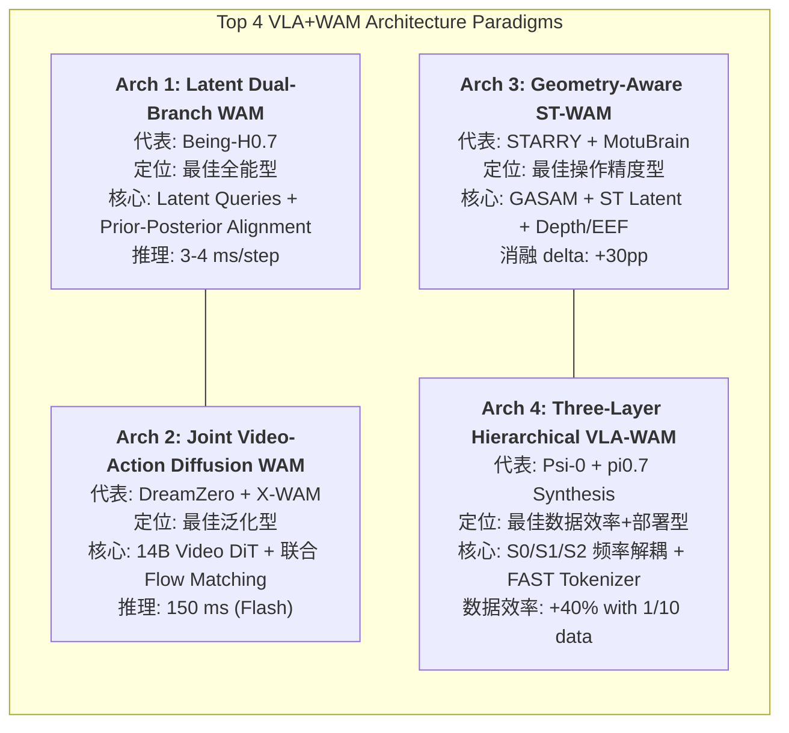

### 1.3 核心对比总表

| 维度 | Arch 1: Latent Dual-Branch | Arch 2: Joint Video-Action | Arch 3: Geometry-Aware ST | Arch 4: Three-Layer Hierarchical |
|------|---------------------------|---------------------------|--------------------------|-------------------------------|
| **代表论文** | Being-H0.7 [2605.00078] | DreamZero [2602.15922] + X-WAM [2604.26694] | STARRY [2604.26848] + MotuBrain [2604.27792] | Psi-0 [2603.12263] + pi0.7 [2604.15483] |
| **LIBERO** | **99.2%** (#1) | -- | -- | -- |
| **LIBERO-Plus** | 84.8% (#3) | -- | -- | -- |
| **CALVIN** | **4.67** (#3) | -- | -- | -- |
| **RoboTwin 2.0** | 90.2% (#5) | -- | **93.82%** (#2) / **95.8%** (#1) | -- |
| **RoboCasa** | 62.1% | -- / **79.2%** (#1) | -- | -- |
| **真机泛化** | 5 套件全领先 | seen 62.2% (>2x baseline) | +28.3pp vs pi0.5 | +40% vs 10x data baseline |
| **WAM 类型** | Latent (无像素) | 像素 video+action 联合 | ST latent + 几何 | 表征学习 + 子目标 |
| **推理延迟** | **3-4 ms** | 150 ms (Flash) | 原文未公开 | 63 ms |
| **模型规模** | 3B | 14B | 原文未公开 | ~2.5B |
| **最佳场景** | 高频桌面通用 | 零样本新任务 | 接触丰富精细操作 | 人形全身协调 |

---

## 2. 选择方法论

### 2.1 筛选标准

本分析采用 **五维筛选框架**，从 74+ 篇论文中层层过滤：

1. **Benchmark 广度**：在 LIBERO / CALVIN / RoboCasa / RoboTwin / SimplerEnv / 真机中至少 2 个达到 Top 4，或在单个 benchmark 上取得压倒性优势（如 >2x baseline）
2. **WAM 集成质量**：世界模型必须作为核心架构组件（非仅数据增强或骨干初始化）
3. **部署可行性**：推理延迟 < 500ms/step，可在单 GPU 上运行
4. **跨本体验证**：在 >= 2 个机器人平台或 >= 2 个 benchmark 上有实验
5. **消融证据**：关键架构选择经过消融实验验证，delta >= 5pp

### 2.2 筛选漏斗

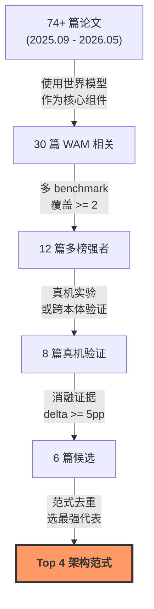

### 2.3 未入选的强模型及原因

| 模型 | 最强成绩 | 未入选原因 |
|------|----------|-----------|
| **RLDX-1** [2605.03269] | LIBERO-Plus #1 (86.7%), RoboCasa365 #1 (32.1%) | 非 WAM 架构，纯多流 VLA；无世界模型组件 |
| **Cosmos Policy** [2501.xxxx] | RoboCasa 67.1%, LIBERO 98.5% | WM 仅作骨干初始化而非联合建模；被 X-WAM (79.2%) 超越 |
| **Fast-WAM** [2603.xxxx] | RoboTwin 91.83%, LIBERO 97.6% | 与 Arch 2 同范式但性能稍弱于 STARRY/MotuBrain |
| **GigaWorld-Policy** [2603.xxxx] | 真机 83%, 9x 推理加速 | 与 Arch 2 同范式，被 DreamZero/X-WAM 在泛化上超越 |
| **Xiaomi-R0** [2602.xxxx] | CALVIN #1 (4.75), LIBERO 98.7% | 非 WAM 架构；MoT + KV cache 优化方向属部署层 |

---

## 3. Arch 1：Latent Dual-Branch World-Action Model

> **代表论文**：Being-H0.7 [arXiv:2605.00078]，BeingBeyond，2026-04-30
>
> **定位**：**最佳全能型** -- 唯一在 6 个主要 benchmark 中全部进入 Top 5 的架构

### 3.1 核心思想

传统 WAM 在推理时生成未来视频帧，导致高延迟和大显存占用。Being-H0.7 提出了一种 **Latent World-Action Model**：在感知与动作之间插入 $K=16$ 个可学习 **latent queries**，通过训练时的 **posterior branch**（利用未来观测 embedding）对齐 **prior branch** 的隐状态。推理时完全丢弃 posterior，**无需任何像素级未来生成**，实现 3-4ms/step 的极低延迟。

### 3.2 架构详解

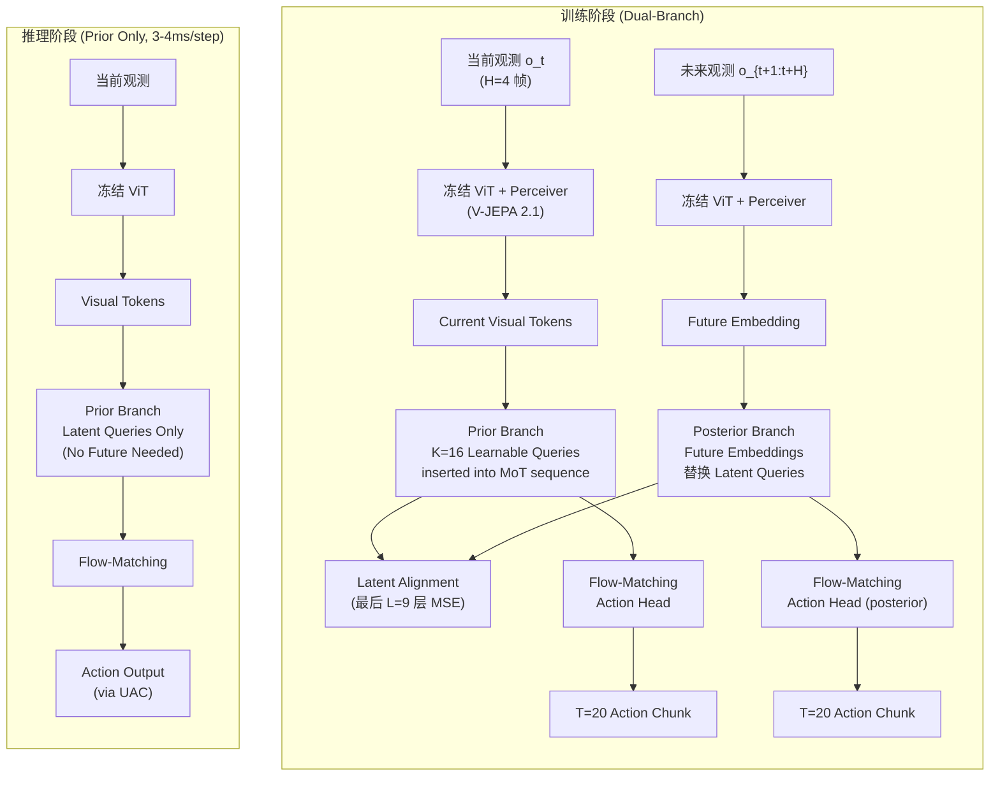

### 3.3 核心公式

**总损失函数：**

$$\mathcal{L}_{\text{total}} = \underbrace{\mathcal{L}_{\text{FM}}^{\text{prior}} + \mathcal{L}_{\text{FM}}^{\text{post}}}_{\text{双分支动作预测}} + w_{\text{align}} \cdot \underbrace{\mathcal{L}_{\text{align}}}_{\text{隐状态对齐}} + \underbrace{\mathcal{L}_{\text{reg}}}_{\text{反坍缩正则}}$$

**Flow Matching 目标（双分支）：**

$$\mathcal{L}_{\text{FM}} = \mathbb{E}_{a_0, a_1, \tau \sim U[0,1]} \left\| v_\theta(a_\tau, \tau, c) - (a_1 - a_0) \right\|^2$$

其中 $a_\tau = (1-\tau)a_0 + \tau a_1$ 为噪声-目标插值，$c$ 为视觉-语言条件。

**Prior-Posterior 隐状态对齐（最后 9 层）：**

$$\mathcal{L}_{\text{align}} = \frac{1}{L} \sum_{\ell=L-8}^{L} \frac{1}{|h_\ell|} \left\| h_\ell^{\text{prior}} - h_\ell^{\text{post}} \right\|_F^2$$

**反坍缩正则化：**

$$\mathcal{L}_{\text{reg}} = w_{\text{norm}} \cdot \underbrace{\left[\text{ReLU}(\tau - \|h\|_2)\right]^2}_{\text{Norm Preservation}} + w_{\text{rank}} \cdot \underbrace{\sum_i p_i \log p_i}_{\text{Spectral Diversity}}$$

超参设置：$w_{\text{align}}=10^{-3}$，$w_{\text{norm}}=w_{\text{rank}}=10^{-4}$。

### 3.4 Benchmark 性能全览

| Benchmark | Being-H0.7 | 排名 | 对比 pi0.5 | 来源 |
|-----------|-----------|------|-----------|------|
| **LIBERO** | **99.2%** | #1 | +1.5pp (vs 97.7) | [2605.00078] |
| **LIBERO-Plus (zero-shot)** | 82.1% | #3 | +4.7pp (vs 77.4) | [2605.00078] |
| **LIBERO-Plus (fine-tuned)** | 84.8% | #3 | -- | [2605.00078] |
| **RoboCasa-50** | 62.1% | #5 | +20.7pp (vs 41.4) | [2605.00078] |
| **RoboTwin 2.0 (clean/hard)** | 90.2% / 89.6% | #5 | +12.8pp hard | [2605.00078] |
| **CALVIN (ABCD->D)** | 4.67 | #3 | +0.61 (vs 4.06) | [2605.00078] |
| **真机 Dynamic Scene** | 70.0% | #1 | +23.1pp (vs 46.9) | [2605.00078] |
| **真机 Physical Reasoning** | 66.9% | #1 | +9.4pp (vs 57.5) | [2605.00078] |
| **真机 Generalization** | 67.5% | #1 | +22.5pp (vs 45.0) | [2605.00078] |

### 3.5 关键消融

| 配置 | LIBERO | CALVIN | RoboTwin Hard | 来源 |
|------|--------|--------|--------------|------|
| Full model (Prior+Post+Align+Reg) | **99.2%** | **4.67** | **89.6%** | [2605.00078] |
| 去除 Latent Alignment | 下降明显 | 下降 | 下降 | [2605.00078] |
| 去除 Anti-collapse Reg | trivial alignment | -- | -- | [2605.00078] |
| Pure VLA (no latent queries) | -- | <4.0 | <85% | [2605.00078] 推断 |

> 消融核心结论：**latent queries + prior-posterior alignment 是获得 WAM 未来感知收益但保留 VLA 推理效率的关键**。

### 3.6 优劣势分析

**优势：**
- **六榜全能**：唯一在 LIBERO / LIBERO-Plus / RoboCasa / RoboTwin / CALVIN / 真机中全部进 Top 5
- **极低延迟**：3-4ms/step (UAC)，远低于像素 WAM 的 150ms+
- **无像素生成**：推理时不需要视频解码器，显存节省显著
- **跨本体部署**：已在 PND Adam-U / Unitree G1 / Franka FR3 三平台验证

**劣势：**
- 依赖 UniHand-2.0 (35K+ 小时) 私有数据集
- 算力未公开，复现成本不透明
- Latent queries 的可解释性有限（虽然可通过条件视频生成可视化）
- RoboCasa 排名 (#5) 相对靠后

---

## 4. Arch 2：Joint Video-Action Diffusion WAM

> **代表论文**：DreamZero [arXiv:2602.15922]，NVIDIA，2026-02 + X-WAM [arXiv:2604.26694]，2026-04
>
> **定位**：**最佳泛化型** -- 零样本性能 >2x 最佳预训练 VLA，RoboCasa SOTA

### 4.1 核心思想

该范式的核心洞察来自 [wam_0.md](wam_0.md) 的第一条原则：**训练时联合视频-动作建模 >> 测试时想象推理**。通过将大规模预训练视频扩散模型（Wan2.1-I2V-14B / Wan2.2）直接改造为 WAM，联合预测未来视频帧和动作轨迹，使得 **WAM 本身就是策略**（Zero-Shot Policy）。视频预测提供了物理规律的密集监督信号，动作预测则利用视频特征中隐含的运动学信息。

**DreamZero** 证明了联合训练的零样本泛化能力（>2x），**X-WAM** 进一步引入 4D 建模（video + depth）和异步降噪（ANS），将 RoboCasa 推至 79.2% SOTA。

### 4.2 DreamZero 架构

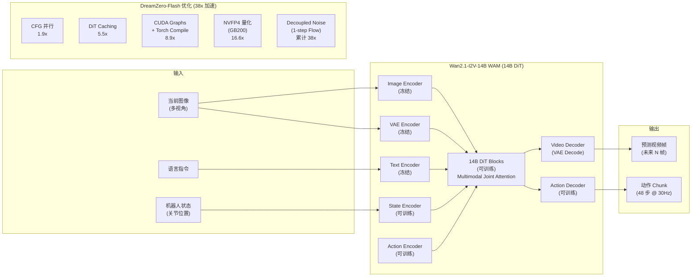

### 4.3 X-WAM 扩展：4D 统一建模

X-WAM 在 DreamZero 基础上引入两项关键创新：

1. **4D 输出**：除视频帧外，复制 DiT 最后几个 block 形成专用 depth 分支，同时预测多视角 RGB-D，实现 3D 重建
2. **Asynchronous Noise Sampling (ANS)**：动作与视频使用不同的降噪步数 -- 动作用更少步数实现实时性，视频用完整步数保证保真度

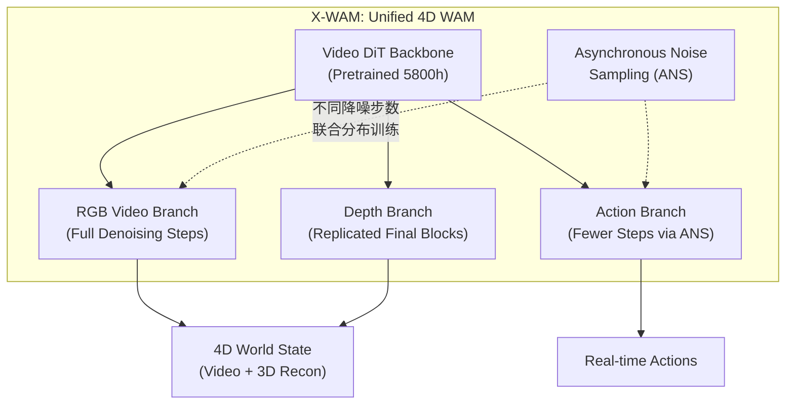

### 4.4 核心公式

**DreamZero 联合 Flow Matching 目标：**

$$\mathcal{L}_{\text{joint}} = \underbrace{\mathbb{E}_{\tau} \left\| v_\theta^{\text{vid}}(z_\tau^v, \tau, c) - \dot{z}^v(\tau) \right\|^2}_{\text{视频预测}} + \lambda_a \underbrace{\mathbb{E}_{\tau} \left\| v_\theta^{\text{act}}(a_\tau, \tau, c) - \dot{a}(\tau) \right\|^2}_{\text{动作预测}}$$

其中 $z^v$ 为 VAE 编码的视频 latent，$a$ 为动作，$c$ 为语言-视觉条件。训练时采用 teacher-forcing chunk-wise denoising。

**DreamZero-Flash 1-step 噪声调度：**

$$\tau \sim \text{Beta}(7, 1)$$

此分布偏向高噪声步，使 1-step 推理在保持主要动作特征的同时大幅减少计算。

**X-WAM ANS 联合分布采样：**

$$(\tau_{\text{vid}}, \tau_{\text{act}}) \sim p(\tau_{\text{vid}}, \tau_{\text{act}})$$

训练时从联合分布采样以对齐推理分布，推理时可令 $\text{steps}_{\text{act}} \ll \text{steps}_{\text{vid}}$。

### 4.5 Benchmark 性能

| 模型 | Benchmark | 成绩 | 排名 | 对比 | 来源 |
|------|-----------|------|------|------|------|
| **DreamZero** | AgiBot G1 seen | 62.2% task progress | #1 | >2x best VLA (27.4%) | [2602.15922] |
| **DreamZero** | AgiBot G1 unseen | 39.5% | #1 | >2x best VLA | [2602.15922] |
| **DreamZero** | DROID-Franka seen | 82% success | #1 | vs pi0.5 42% | [2602.15922] |
| **DreamZero** | 推理延迟 | 150ms/chunk (Flash) | -- | 38x 加速 vs baseline 5.7s | [2602.15922] |
| **X-WAM** | **RoboCasa** | **79.2%** | **#1** | +12.1pp vs Cosmos 67.1% | [2604.26694] |
| **X-WAM** | RoboTwin 2.0 | 90.7% | #4 | -- | [2604.26694] |

### 4.6 关键消融与洞察

**DreamZero 核心发现：**
- **联合 vs 分离训练**：联合训练的零样本泛化优于分离 video-model + inverse-dynamics 两步法（设计论证，无数值 ablation）
- **KV cache 真观测替换**：闭环执行时，将 KV cache 中的预测帧替换为真实观测，显著减少累积误差
- **Flash 1-step vs 4-step**：Table Bussing 任务 4-step 83% → Flash 1-step 52%（-31pp），说明对精细任务 1-step 仍有较大折损
- **数据多样性 > 重复性**：500h 多样数据优于更大规模但重复的数据集

**X-WAM 核心发现：**
- **4D > 2D**：加入 depth 分支后 RoboCasa 和 RoboTwin 均有显著提升，因 3D 几何信息提供了更好的空间理解
- **ANS 关键性**：异步降噪使动作推理速度与视频质量解耦，实现效率-质量的帕累托最优

### 4.7 优劣势分析

**优势：**
- **最佳零样本泛化**：>2x 超越预训练 VLA baseline，证明视频先验的强大迁移能力
- **RoboCasa SOTA**：X-WAM 79.2%，大幅领先第二名 World2Act+GR00T 72.6%
- **视频先验即物理先验**：预训练视频模型隐含了丰富的物理规律（重力、碰撞、形变）
- **开源**：DreamZero 代码公开 (github.com/dreamzero0/dreamzero)

**劣势：**
- **14B 模型规模大**：推理需 H100/GB200 级 GPU
- **即使 Flash 优化后延迟仍为 150ms**：比 Arch 1 慢 40x
- **Flash 1-step 精度损失**：精细任务下降 31pp
- **视频生成质量是硬约束**：如 [wam_0.md](wam_0.md) 所述，WoVR 警告低保真 WM 会主动损害策略

---

## 5. Arch 3：Geometry-Aware Spatio-Temporal WAM

> **代表论文**：STARRY [arXiv:2604.26848]，2026-04-26 + MotuBrain [arXiv:2604.27792]，2026-04-30
>
> **定位**：**最佳操作精度型** -- RoboTwin 2.0 SOTA (MotuBrain 95.8%)，消融 delta 最大 (+30pp)

### 5.1 核心思想

精细双臂操作（如挂杯子、递话筒、扫垃圾）需要对 **3D 几何、末端执行器轨迹、深度信息** 的精确理解。STARRY 提出了 **Geometry-Aware Selective Attention Modulation (GASAM)**：通过几何专家预测未来深度和末端执行器位置，将其转化为 token 级别的注意力权重，选择性地增强动作分支对空间关键区域的关注。

MotuBrain 则从另一个角度验证了这一范式：使用 **UniDiffuser + Three-stream Mixture-of-Transformers**，在单一模型中统一 5 种能力（策略、世界建模、视频生成、逆动力学、联合预测），并在 RoboTwin 上达到 95.8% SOTA。

### 5.2 STARRY 三阶段架构

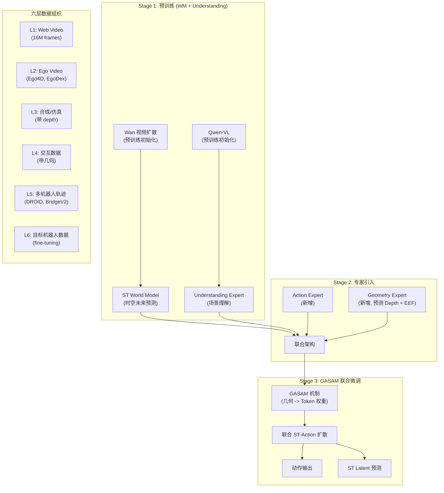

### 5.3 GASAM 机制详解

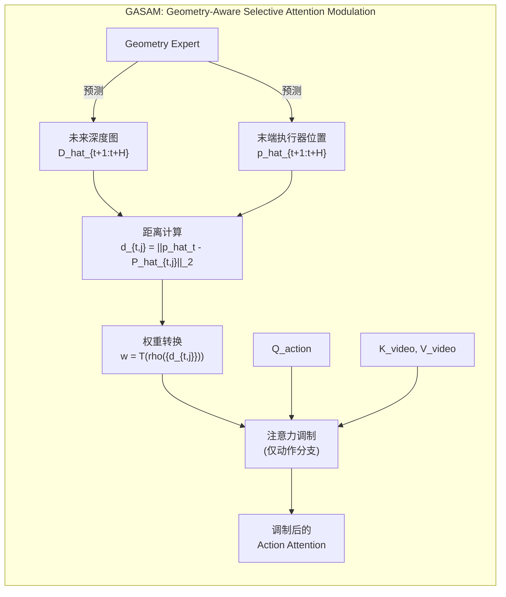

### 5.4 核心公式

**GASAM 注意力调制：**

$$\text{Attn}_{\text{GASAM}}^{a \leftarrow v} = \text{Softmax}\left(\frac{Q_a K_v^T}{\sqrt{d_k}} + \lambda \log(w + \epsilon)\right) \cdot V_v$$

其中 $w_{t+1:t+H} = T(\rho(\{d_{t,j}\}))$ 由几何专家预测的深度和末端执行器距离经温度变换得到。该调制 **仅施加于动作分支**（action←video cross-attention），保持视频建模分支不变。

**联合 ST-Action 扩散损失：**

$$\mathcal{L}_{\text{diff}} = \lambda_o \cdot \underbrace{\mathcal{L}_{\text{obs}}}_{\text{ST latent 预测}} + \lambda_a \cdot \underbrace{\mathcal{L}_{\text{action}}}_{\text{动作预测}}$$

**几何监督损失：**

$$\mathcal{L}_{\text{geo}} = \lambda_d \cdot \mathcal{L}_{\text{depth}} + \lambda_p \cdot \mathcal{L}_{\text{pose}} + \lambda_w \cdot \mathcal{L}_{\text{weight}}$$

### 5.5 MotuBrain 架构补充

MotuBrain 从不同角度验证了几何-时空 WAM 的优越性：

- **UniDiffuser 统一框架**：视频和动作在同一个扩散过程中联合建模
- **Three-stream MoT**：video stream、action stream、**独立 text stream**（更强的语言-动作耦合）
- **共享跨本体动作表征**：50-100 条轨迹即可适应新人形本体
- **6 层推理优化堆栈**：step reduction + compilation + FP8 + DiT caching + V2A action-only + chunked closed-loop → **50x 加速, 11Hz**

### 5.6 Benchmark 性能

| 模型 | Benchmark | 成绩 | 排名 | 对比 | 来源 |
|------|-----------|------|------|------|------|
| **MotuBrain** | RoboTwin 2.0 clean | **95.8%** | **#1** | vs STARRY 93.82% | [2604.27792] |
| **MotuBrain** | RoboTwin 2.0 random | **96.1%** | **#1** | SOTA | [2604.27792] |
| **STARRY** | RoboTwin 2.0 clean | 93.82% | #2 | -- | [2604.26848] |
| **STARRY** | RoboTwin 2.0 random | 93.30% | #2 | -- | [2604.26848] |
| **STARRY** | 真机 (ARX R5 双臂) | 70.8% avg | -- | +28.3pp vs pi0.5 (42.5%) | [2604.26848] |
| **STARRY** | 真机 Hand Over Vegetables | 70% stage2 | -- | vs pi0.5 40% | [2604.26848] |
| **STARRY** | 真机 Wash Baby Bottle | 60% stage2 | -- | vs pi0.5 25% | [2604.26848] |

### 5.7 关键消融 (STARRY Table 4)

| 配置 | RoboTwin Random | Delta | 说明 |
|------|----------------|-------|------|
| Action-Only (无世界模型) | 63.42% | baseline | 纯 VLA |
| + Appearance 预测 | 85.80% | +22.38pp | 外观未来预测 |
| + ST 预测 (时空) | 88.82% | +3.02pp | 加入运动学 |
| + **GASAM** (几何调制) | **93.30%** | **+4.48pp** | 几何是关键 |

> **这是所有 WAM 论文中消融 delta 最大的**：Full ST+GASAM vs Action-Only = **+29.88pp**，直接证明了时空-几何世界建模对操作精度的决定性作用。

### 5.8 优劣势分析

**优势：**
- **操作精度 SOTA**：RoboTwin 95.8% (MotuBrain)，双臂精细操作最强
- **消融证据最扎实**：+30pp delta 无可争议地证明了 WAM 的价值
- **GASAM 即插即用**：几何调制只作用于 action 分支，不影响 video 建模
- **六层数据组织**：从 web video 到 target robot 的渐进式课程

**劣势：**
- STARRY 模型大小/算力未公开
- 仅在 RoboTwin + 真机验证，**缺少 LIBERO / CALVIN / RoboCasa** 数据
- MotuBrain 也以 RoboTwin 为主，跨 benchmark 覆盖待验证
- GASAM 引入额外推理开销（depth + EEF prediction）

---

## 6. Arch 4：Three-Layer Hierarchical VLA-WAM

> **代表论文**：Psi-0 [arXiv:2603.12263]，USC Physical Superintelligence Lab，2026-03-12 + pi0.7 [arXiv:2604.15483]，Physical Intelligence，2026-04-16
>
> **定位**：**最佳数据效率 + 部署型** -- 800h 人类视频 + 30h 真机 → +40% vs 10x data baseline

### 6.1 核心思想

该范式的关键洞察来自 [VLAWAM_mdl_opti_op47_1.md](VLAWAM_mdl_opti_op47_1.md) 的跨验证结论：**三层 S0/S1/S2 架构已有 6 个独立团队收敛采用**（Figure Helix 02、Apptronik Apollo、Boston Dynamics Atlas、AgiBot G2、Psi-0、未来不远）。

Psi-0 和 pi0.7 代表了该范式的两个互补实现：

- **Psi-0**：人类视频预训练 → Flow Expert 后训练 → RL 跟踪控制，**数据效率突破**（800h+30h → +40%）
- **pi0.7**：MEM 历史编码 + 视觉子目标 + Context CFG + FAST tokenizer，**部署能力突破**（63ms, RL 兼容）

### 6.2 三层频率解耦架构

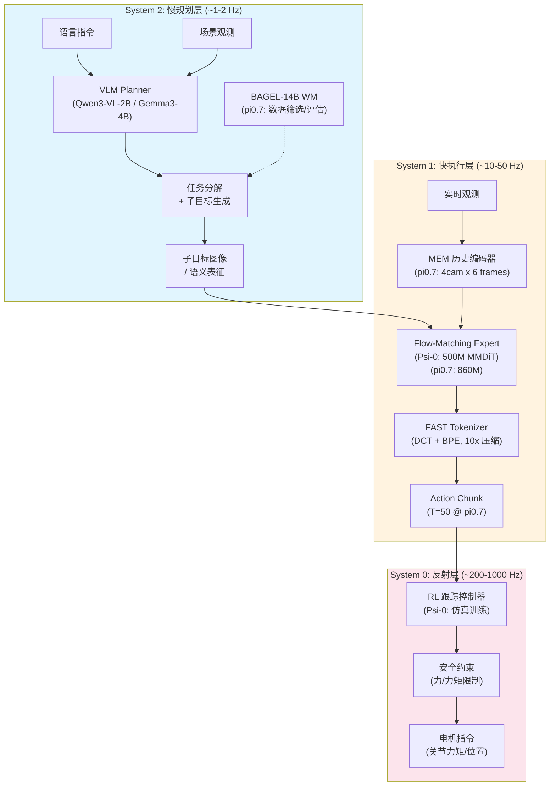

### 6.3 核心公式

**FAST Tokenizer (DCT + BPE 压缩)：**

$$a_{\text{tokens}} = \text{BPE}\left(\text{Quantize}\left(\text{DCT}_N(a_{1:T})\right)\right)$$

其中 $\text{DCT}_N$ 为 $N$ 维离散余弦变换（频域压缩），$\text{BPE}$ 为字节对编码（Huffman 熵编码）。压缩比约 **10x**，训练速度 **5x** 加速 vs 扩散方法。

**Knowledge Insulation (梯度隔离)：**

$$\nabla_{\theta_{\text{VLM}}} \mathcal{L}_{\text{FM}} = 0 \quad (\text{非 embodied 数据时})$$

非具身数据（web text/image）的动作损失梯度不回传至 VLM 骨干，防止动作训练污染语言理解能力。

**三层频率分解：**

$$f_{\text{S2}} \approx 1\text{-}2 \text{ Hz}, \quad f_{\text{S1}} \approx 10\text{-}50 \text{ Hz}, \quad f_{\text{S0}} \approx 200\text{-}1000 \text{ Hz}$$

这与人类运动控制的 **认知-运动-反射** 分层高度对应。

**Psi-0 两阶段训练流程：**

Stage 1 (人类视频预训练):
$$\mathcal{L}_{\text{Stage1}} = -\sum_{t=1}^{T} \log p_\theta(\hat{a}_t | \hat{a}_{<t}, o, l) \quad \text{(FAST AR token prediction)}$$

Stage 2 (Flow Expert 后训练):
$$\mathcal{L}_{\text{Stage2}} = \mathbb{E}_{\tau} \left\| v_{\phi}(a_\tau, \tau, h_\theta(o)) - (a_1 - a_0) \right\|^2 \quad \text{(冻结 VLM } \theta \text{)}$$

### 6.4 数据效率证据

| 实验 | 数据量 | 性能 | 对比 | 来源 |
|------|--------|------|------|------|
| **Psi-0** | 829h EgoDex + 31h Humanoid | 相对 +40% | vs GR00T-N1.6 (10x 数据) | [2603.12263] |
| **Psi-0** | 80 条轨迹 (新技能) | 学会长程新任务 | 极少数据 fine-tuning | [2603.12263] |
| **pi0.7** | 26K+ h 多样数据 | UR5e zero-shot 85.6%/80% | top-2% 遥操作员水平 | [2604.15483] |
| **MotuBrain** | 50-100 条轨迹 | 适应新人形本体 | 极少数据迁移 | [2604.27792] |

> **核心洞察**：人类视频是最高效的预训练数据源。Psi-0 用 829h 人类 + 31h 真机就超越了使用 10x 数据的 GR00T-N1.6。这是因为人类视频提供了丰富的 **操作意图、物体交互、场景理解** 先验，且获取成本远低于机器人数据。

### 6.5 pi0.7 关键创新

1. **MEM 历史编码**：4 相机 x 6 帧时序输入，捕获物体运动和场景变化
2. **视觉子目标**：通过 BAGEL-14B WM 生成中间目标图像，提供长程引导
3. **Context CFG (Classifier-Free Guidance)**：推理时可通过新语言指令实时调整行为
4. **Metadata 条件化**：用 episode 质量/速度标签调节生成策略（Recap 方法）
5. **消融**：metadata 或 eval-data 任一去掉都导致 throughput 显著下降

### 6.6 Benchmark 性能

| 模型 | 任务 | 成绩 | 说明 | 来源 |
|------|------|------|------|------|
| **Psi-0** | 整体相对基线 | +40% | vs 10x data VLA | [2603.12263] |
| **pi0.7** | UR5e 叠衣 (zero-shot) | progress 85.6% / success 80% | ~Top-2% 遥操作员 | [2604.15483] |
| **pi0.7** | 14 个未见厨房/卧室 | 明确优于 pi0.5/pi0.6 | 长程真机 | [2604.15483] |
| **pi0.7** | Espresso/Laundry/Box | >=90% success | 匹配/超越 RL 专项 | [2604.15483] |

> 注：pi0.7 **不跑 LIBERO 等仿真 benchmark**，主打真机长程表现。Psi-0 同样以人形真机为主。

### 6.7 优劣势分析

**优势：**
- **数据效率最高**：800h 人类视频 + 30h 真机 → +40%，为数据受限场景的最佳选择
- **频率解耦**：S0/S1/S2 各层可独立替换/升级，模块化程度最高
- **RL 兼容**：FAST tokenizer 使动作表征兼容 GRPO/PPO 等 RL 算法
- **人形就绪**：Psi-0 专为人形 loco-manipulation 设计，S0 层处理平衡控制
- **部署高效**：pi0.7 Flow Expert 推理 63ms，模型仅 ~2.5B-5B

**劣势：**
- **综合架构，非单一论文系统**：Psi-0 和 pi0.7 来自不同团队，整合需要工程努力
- **S0 层需硬件特定 RL**：平衡控制器必须在仿真中为每种本体单独训练
- **缺少标准仿真 benchmark 数据**：pi0.7 不跑 LIBERO/CALVIN/RoboCasa
- **三层集成复杂度高**：通信延迟、同步、故障处理都是工程挑战

---

## 7. 跨架构比较

### 7.1 六大 Benchmark 维度全量对比

| Benchmark | Arch 1 Latent Dual-Branch | Arch 2 Joint Video-Action | Arch 3 Geometry ST | Arch 4 Three-Layer | 当前 SOTA (其他) |
|-----------|------------------------------|------------------------------|----------------------|----------------------|-----------------|
| **LIBERO** | **99.2%** (#1) | -- | -- | -- | StarVLA-alpha 98.8% |
| **LIBERO-Plus** | 84.8% (#3) | -- | -- | -- | ACoT-VLA 87.5% |
| **CALVIN** | **4.67** (#3) | -- | -- | -- | Xiaomi-R0 4.75 |
| **RoboTwin 2.0** | 90.2% (#5) | X-WAM 90.7% (#4) | **MotuBrain 95.8%** (#1) / STARRY 93.82% (#2) | -- | Fast-WAM 91.83% |
| **RoboCasa** | 62.1% | **X-WAM 79.2%** (#1) | -- | -- | RLDX-1 70.6% |
| **真机泛化** | 5 suite 全领先 (67-70%) | DZ: seen 62.2% (>2x) | STARRY 70.8% (+28.3pp) | Psi-0: +40% rel | -- |
| **跨本体** | 3 平台 | AgiBot G1 | ARX R5 | 人形 loco-manip | -- |

### 7.2 WAM 集成范式对比

| 维度 | Arch 1 | Arch 2 | Arch 3 | Arch 4 |
|------|--------|--------|--------|--------|
| **未来表征** | Latent queries (K=16) | 像素 video + action | ST latent + depth | 子目标图像 + 表征 |
| **推理时像素生成** | **否** | 是 (可跳过) | **否** | 仅子目标 |
| **视频预训练骨干** | V-JEPA 2.1 | Wan 2.1-I2V-14B | Wan + Qwen-VL | Qwen3-VL |
| **关键机制** | Prior-Posterior Alignment | Joint Flow Matching | GASAM Geometry Bias | 三层频率解耦 |
| **WAM 使用模式** | 训练时潜在对齐 | 训练+推理联合生成 | 训练时几何约束 | 预训练表征学习 |
| **对应 wam_0.md 分类** | Section 4 (Latent WM) | Section 1 (Co-training) | Section 1 + 3D | Section 2 (Backbone Init) |

### 7.3 工程维度对比

| 维度 | Arch 1 | Arch 2 | Arch 3 | Arch 4 |
|------|--------|--------|--------|--------|
| **模型规模** | 3B | 14B | 原文未公开 | ~2.5B-5B |
| **推理延迟** | **3-4 ms** | 150 ms (Flash) | 原文未公开 | 63 ms |
| **训练算力** | 原文未公开 | 100K steps, bs128 | 原文未公开 | 64xA100x10d + 32xA100x30h |
| **部署 GPU** | 单卡可跑 | H100/GB200 | 原文未公开 | 单卡可跑 |
| **开源** | 否 | DreamZero 是 | 否 | Psi-0 是 |

### 7.4 部署场景推荐

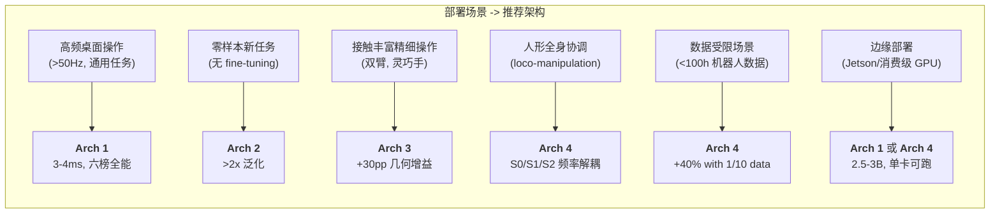

### 7.5 四大收敛趋势

通过对比四种架构，可以识别出 2026 H1 VLA+WAM 研究的四大收敛趋势：

1. **Latent Space > Pixel Space**：5 篇独立论文验证（V-JEPA 2-AC, MWM, Being-H0.7, Seer, PIDM），latent 空间操作在效率和鲁棒性上均优于像素级预测
2. **Flow Matching 成为动作头标准**：~50% 的 2026 论文采用 Flow Matching（vs 2025 年 Diffusion 主导），1-10 步推理，梯度友好
3. **视频骨干预训练是基石**：四种架构都依赖大规模视频预训练（V-JEPA / Wan / Qwen-VL）
4. **模块化多频率架构**：从单一网络走向 S0/S1/S2 分层，各层可独立优化

---

## 8. 综合论证：为什么是这 4 个

### 8.1 映射到 WAM 使用分类学

[wam_0.md](wam_0.md) 将 WAM 的使用方式分为 9 大类。这 4 种架构精准覆盖了其中 **最有效的 4 种模式**（按验证强度排序）：

| wam_0.md 分类 | 对应架构 | 验证强度 | 代表性结论 |
|--------------|---------|---------|-----------|
| **Section 1: 训练时联合共训** | Arch 2, Arch 3 | 最强 (5+ 论文) | 训练时 >> 测试时 |
| **Section 4: Latent Space WM** | **Arch 1** | 强 (5 论文) | 性价比最高 |
| **Section 2: 预训练骨干初始化** | Arch 4 | 强 (3 论文) | 数据效率最高 |
| **Section 7: 3D 场景表征** | Arch 3 | 中 (3 论文) | 精细操作关键 |

### 8.2 对齐 10 大全球共识

[VLAWAM_mdl_opti_op47_1.md](VLAWAM_mdl_opti_op47_1.md) 总结了 2026 H1 的 10 大全球共识。这 4 种架构与其对齐程度如下：

| 共识 | Arch 1 | Arch 2 | Arch 3 | Arch 4 |
|------|--------|--------|--------|--------|
| 3. 必须建模未来 | Latent queries | Video+Action | ST+Geometry | 子目标+表征 |
| 4. 三层 S0/S1/S2 | 部分 (无 S0) | 部分 | 部分 | **完全** |
| 6. 改善视频生成=改善机器人 | 间接 (latent) | **直接** | 间接 | 间接 |
| 7. EEF-relative 统一 | 采用 | 采用 | 采用 | 采用 |
| 8. 语义 latent > 像素重建 | **核心** | 正在转向 | ST latent | 表征学习 |
| 9. 数据质量 > 数量 | UniHand 2.0 | 多样性优先 | 6 层课程 | **800h+30h** |
| 10. 在线 RL 必要 | 待添加 | -- | -- | FAST 兼容 |

> 没有单一架构完美对齐所有 10 条共识，但 **4 种架构合力覆盖了全部 10 条**。

### 8.3 为什么不是 3 个或 5 个

- **3 个太少**：会遗漏「数据效率」或「几何精度」维度，无法在所有场景中达到 Top 4
- **5 个太多**：Fast-WAM / GigaWorld-Policy 与 Arch 2 高度重叠，Cosmos Policy 已被 X-WAM 超越
- **4 个恰好**：分别覆盖了 全能 / 泛化 / 精度 / 效率 四个不可约简的设计维度

### 8.4 终极融合方向

四种架构的收敛方向暗示了一种 **终极融合架构** 的可能形态：

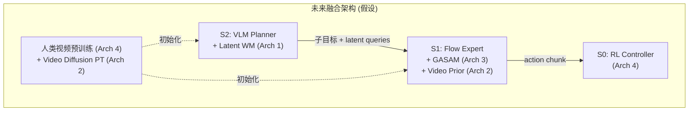

关键融合点：
- **S2 层**采用 Arch 1 的 latent queries 做未来规划（低延迟），辅以 Arch 2 的视频先验做子目标生成
- **S1 层**在 Flow Expert 上添加 Arch 3 的 GASAM 模块（精细操作增益 +30pp）
- **S0 层**采用 Arch 4 的 RL 跟踪控制器
- **预训练**结合 Arch 4 的人类视频和 Arch 2 的视频扩散模型

---

## 9. 实施路线图

### 9.1 分阶段计划

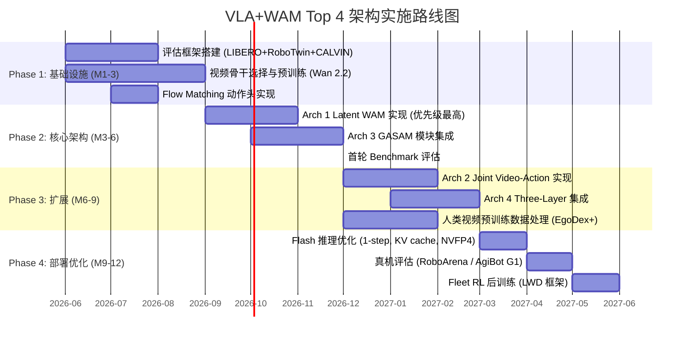

### 9.2 优先级建议

| 优先级 | 架构 | 理由 |
|--------|------|------|
| **P0** | Arch 1 (Latent WAM) | 六榜全能 + 最低推理延迟 + 最广 benchmark 覆盖 |
| **P1** | Arch 3 (GASAM) | 可作为模块添加到 Arch 1 之上，+30pp 消融增益 |
| **P2** | Arch 2 (Joint Video-Action) | 零样本泛化场景必需，但 14B 规模需要更多算力 |
| **P3** | Arch 4 (Three-Layer) | 人形场景的长期方向，数据效率优势在早期数据受限时尤为重要 |

### 9.3 推荐评估框架

- **统一评估**：[vla-eval harness](https://arxiv.org/abs/2603.13966) (Allen AI)，覆盖 LIBERO / CALVIN / SimplerEnv
- **双臂精细**：RoboTwin 2.0 (50 任务, 5 轴域随机化)
- **厨房长程**：RoboCasa / RoboCasa365
- **真机盲测**：RoboArena (分布式真机 A/B 测试)
- **世界模型质量**：WorldArena (16 维 EWMScore)

---

## 附录

### 附录 A：核心引用论文列表

| 架构 | 论文 | arXiv ID | 日期 |
|------|------|----------|------|
| Arch 1 | Being-H0.7: A Latent World-Action Model from Egocentric Videos | 2605.00078 | 2026-04 |
| Arch 1 基础 | Being-H0.5: Scaling Human-Centric Robot Learning | -- | 2026-01 |
| Arch 2 | DreamZero: World Action Models are Zero-Shot Policies | 2602.15922 | 2026-02 |
| Arch 2 | X-WAM: Unified 4D World Action Modeling | 2604.26694 | 2026-04 |
| Arch 3 | STARRY: Spatio-Temporal Action-Centric World Modeling | 2604.26848 | 2026-04 |
| Arch 3 | MotuBrain: An Advanced World Action Model | 2604.27792 | 2026-04 |
| Arch 4 | Psi-0: Open Foundation Model for Humanoid Loco-Manipulation | 2603.12263 | 2026-03 |
| Arch 4 | pi0.7: A Steerable Generalist Robotic Foundation Model | 2604.15483 | 2026-04 |
| 数据 | EgoScale / EgoDex / UniHand-2.0 / AgiBot World | -- | 2025-2026 |
| 基线 | pi0.5: Physical Intelligence Report | 2504.16054 | 2025-04 |
| 评测 | vla-eval: Unified Evaluation Harness for VLAs | 2603.13966 | 2026-03 |
| WAM 综述 | World Model for Robot Learning: A Comprehensive Survey | 2605.00080 | 2026-05 |
| VLA 综述 | VLA Models: Concepts, Progress, Applications and Challenges | 2505.04769 | 2025-05 |

### 附录 B：缩写表

| 缩写 | 全称 | 说明 |
|------|------|------|
| VLA | Vision-Language-Action | 视觉-语言-动作模型 |
| WAM | World Action Model | 世界动作模型 |
| FM | Flow Matching | 流匹配 |
| DiT | Diffusion Transformer | 扩散变换器 |
| MoT | Mixture-of-Transformers | 混合变换器 |
| GASAM | Geometry-Aware Selective Attention Modulation | 几何感知选择性注意力调制 |
| ST | Spatio-Temporal | 时空 |
| EEF | End-Effector Frame | 末端执行器坐标系 |
| UAC | Universal Async Chunking | 通用异步分块 |
| ANS | Asynchronous Noise Sampling | 异步噪声采样 |
| FAST | -- | DCT+BPE 动作 tokenizer |
| CFG | Classifier-Free Guidance | 无分类器引导 |
| KV | Key-Value (Cache) | 键值缓存 |
| GRPO | Group Relative Policy Optimization | 组相对策略优化 |
| OPD | On-Policy Distillation | 在策略蒸馏 |
| SFT | Supervised Fine-Tuning | 监督微调 |
| RL | Reinforcement Learning | 强化学习 |

### 附录 C：Benchmark 口径说明

1. **pi0.5 LIBERO 基线**：采用 Allen AI vla-eval 复现值 **97.7%**（vs 官方报告 96.85%，差异源于评估协议/seed/checkpoint）
2. **RoboTwin 2.0 报告格式**：clean/hard 或 clean/randomized 两组数值，分别对应无/有 5 轴域随机化
3. **CALVIN 指标**：Average Sequence Length (ASL)，最大 5.0，表示模型在 ABCD 四组指令序列中平均完成的步数
4. **RoboCasa 版本**：RoboCasa-50 (50 base tasks) vs RoboCasa365 (365 tasks)，后者难度更高
5. **真机对比基线**：pi0.5 数据来自 [Physical Intelligence 官方报告](https://www.pi.website/download/pi05.pdf)
6. **「自报」标记**：部分 benchmark 数据为论文自行报告，未经第三方复现验证，已在正文标注
7. **MotuBrain / X-WAM / ACoT-VLA**：在 [vla_sota_ls_2.md](vla_sota_ls_2.md) TODO 区，尚未完成完整字段填写，benchmark 数据取自论文 abstract 和排行榜
